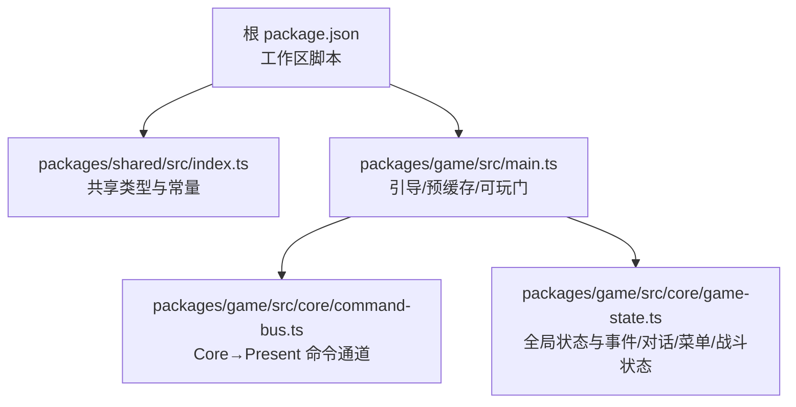
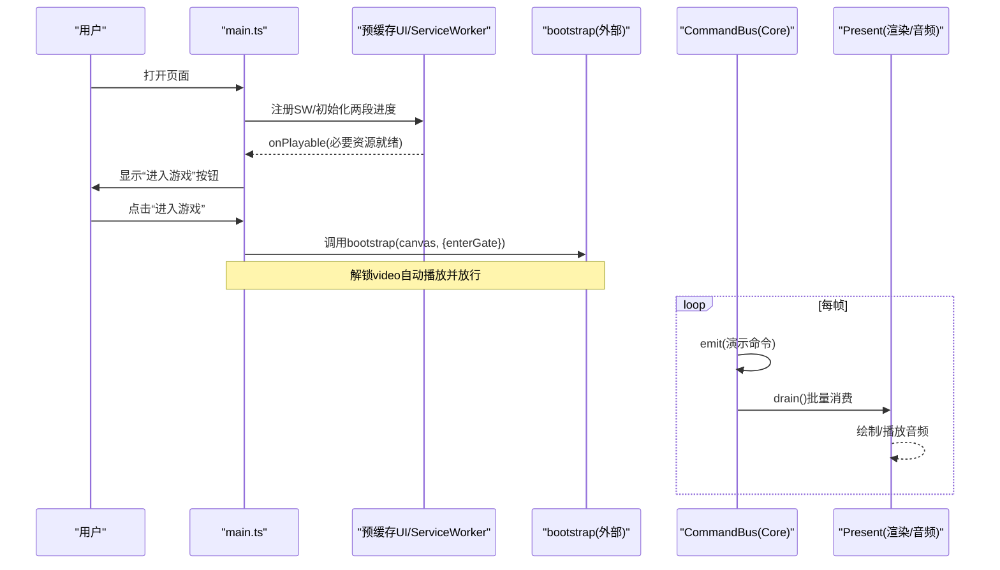
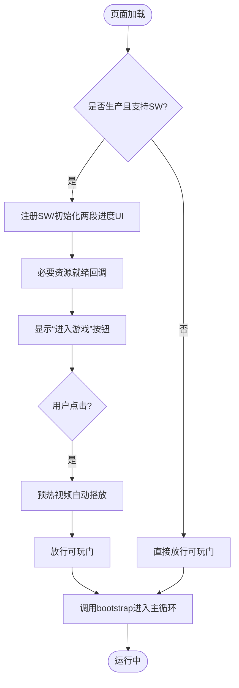
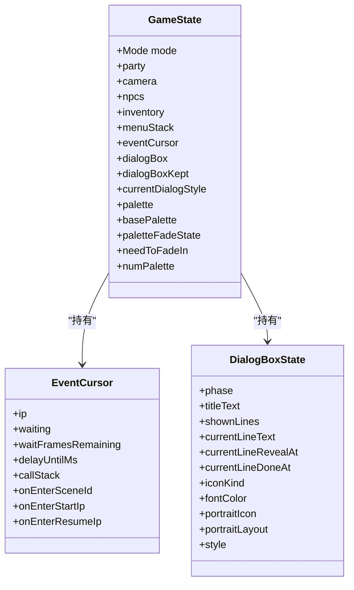
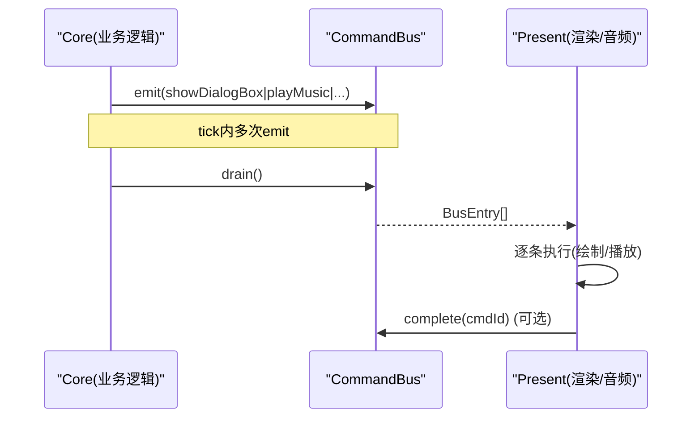
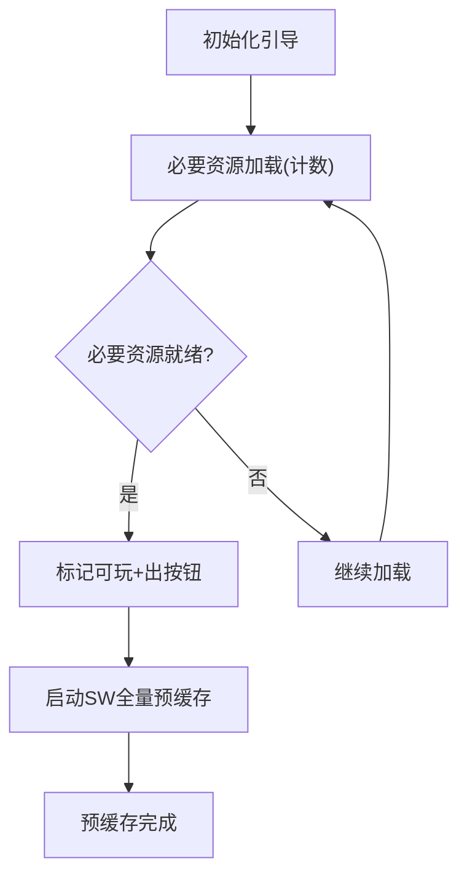
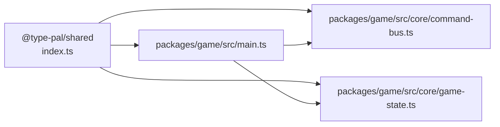

# API 参考

<cite>
**本文引用的文件**
- [README.md](file://README.md)
- [package.json](file://package.json)
- [main.ts](file://packages/game/src/main.ts)
- [command-bus.ts](file://packages/game/src/core/command-bus.ts)
- [game-state.ts](file://packages/game/src/core/game-state.ts)
- [index.ts](file://packages/shared/src/index.ts)
</cite>

## 目录
1. [简介](#简介)
2. [项目结构](#项目结构)
3. [核心组件](#核心组件)
4. [架构总览](#架构总览)
5. [详细组件分析](#详细组件分析)
6. [依赖关系分析](#依赖关系分析)
7. [性能考量](#性能考量)
8. [故障排查指南](#故障排查指南)
9. [结论](#结论)
10. [附录](#附录)

## 简介
本参考文档面向开发者，系统化梳理游戏启动、状态机、命令总线与资源加载等核心 API，并给出公共类型定义、扩展接口约定、参数与返回值规范、错误处理约定以及集成模式。内容基于仓库现有实现进行提炼，帮助快速上手与正确扩展系统功能。

## 项目结构
- 包划分：shared（共享类型）、pal-extract（资源提取）、game（浏览器运行时）、reforge（第二阶段新引擎 demo）、content（第二阶段内容数据）。
- 关键入口：packages/game/src/main.ts 负责浏览器端引导、预缓存与可玩门；packages/shared/src/index.ts 暴露跨包常量与类型。
- 运行命令：根 package.json 提供 check/test/typecheck/lint/format/extract 等脚本。

图表来源
- [package.json:1-29](file://package.json#L1-L29)
- [index.ts:1-39](file://packages/shared/src/index.ts#L1-L39)
- [main.ts:1-78](file://packages/game/src/main.ts#L1-L78)
- [command-bus.ts:1-89](file://packages/game/src/core/command-bus.ts#L1-L89)
- [game-state.ts:1-800](file://packages/game/src/core/game-state.ts#L1-L800)

章节来源
- [README.md:110-131](file://README.md#L110-L131)
- [package.json:1-29](file://package.json#L1-L29)

## 核心组件
本节聚焦四大核心 API 面：游戏启动、状态机、命令总线、资源加载。

- 游戏启动 API
  - 入口：packages/game/src/main.ts
  - 职责：安装网络重试、注册 Service Worker、两段进度 UI、可玩门、调用 bootstrap 进入主循环。
  - 关键行为：
    - 生产环境：注册 SW、显示必要资源进度、出“进入游戏”按钮、点击后解锁视频自动播放并放行 bootstrap。
    - 开发/无 SW：退化为 fetch 计数进度、直接放行。
    - 错误兜底：bootstrap 失败时覆盖层提示并在 canvas 上显示错误信息。
  - 典型用法：在 HTML 中提供 id="screen" 的 Canvas，引入 main.ts 即可启动。

- 状态机 API
  - 入口：packages/game/src/core/game-state.ts
  - 职责：维护探索/事件/战斗/菜单模式的单一真相源，包含队伍、相机、NPC、事件游标、对话框、调色板淡入淡出、菜单栈等。
  - 关键概念：
    - Mode：'explore' | 'event' | 'battle' | 'menu'
    - EventCursor：事件解释器游标，支持等待原因、callStack、onEnter 持久化等。
    - DialogBoxState：对话框状态机，含打字、翻页、样式切换、头像布局等。
    - PaletteFadeState：调色板淡入淡出状态，配合 FRAME_MS_FADE 高频插值。
  - 使用建议：通过 GameState 字段读写驱动逻辑与渲染；避免直接操作底层呈现。

- 命令总线 API
  - 入口：packages/game/src/core/command-bus.ts
  - 职责：Core → Present 单向命令通道，tick 内 emit，tick 末 drain；异步回执预留 complete(cmdId)。
  - 主要命令类型：showDialogBox/clearDialogBox、showBattleMessage/showDamageNum、flashEnemy/flashPlayer、playEnemyAttack/playPlayerAttack、playMagicAnim、playEnemyDeath、showBattleUI、playSound/playMusic/stopMusic。
  - 使用建议：Core 侧只 emit 意图，Present 侧消费并执行具体绘制/音频播放。

- 资源加载 API
  - 入口：packages/game/src/main.ts 中的 registerPrecache/startPrecache、initBootLoading/restoreBootFetch 等。
  - 职责：两段进度（必要资源前台 + SW 全量预缓存），可玩门控制，失败降级。
  - 关键回调：onPlayable、onProgress、onDone、onUnavailable。
  - 使用建议：在生产环境启用两段进度与可玩门；非生产环境自动降级为 fetch 计数进度。

章节来源
- [main.ts:1-78](file://packages/game/src/main.ts#L1-L78)
- [game-state.ts:1-800](file://packages/game/src/core/game-state.ts#L1-L800)
- [command-bus.ts:1-89](file://packages/game/src/core/command-bus.ts#L1-L89)

## 架构总览
下图展示从页面到 Core/Present 的关键交互路径，包括引导、预缓存、可玩门与命令分发。

图表来源
- [main.ts:1-78](file://packages/game/src/main.ts#L1-L78)
- [command-bus.ts:1-89](file://packages/game/src/core/command-bus.ts#L1-L89)

## 详细组件分析

### 游戏启动 API
- 目标：完成网络重试、SW 注册、两段进度、可玩门、错误兜底，最终进入主循环。
- 关键参数与回调
  - bootstrap(canvas, options)
    - options.enterGate: Promise<void>，由“进入游戏”或不可用时释放。
    - options.onPlayable(): 必要资源就绪回调，用于停必要资源计数、出按钮、启动 SW 全量预缓存。
  - registerPrecache({ isProd, onProgress, onDone, onUnavailable })
    - onProgress(p): p.bytes/p.totalBytes 用于全量进度条。
    - onDone(): 全量预缓存完成。
    - onUnavailable(): SW 不可用或注册失败，自动放行可玩门。
  - initBootLoading(onNecessaryProgress?, onFullProgress?)
    - 包装 window.fetch 计数，上报必要资源进度。
- 返回值与错误
  - bootstrap 返回 Promise，失败时捕获并显示错误信息。
- 集成模式
  - 生产环境：两段进度 + 显式可玩门 + SW 全量预缓存。
  - 开发/无 SW：fetch 计数进度 + 自动放行。

图表来源
- [main.ts:1-78](file://packages/game/src/main.ts#L1-L78)

章节来源
- [main.ts:1-78](file://packages/game/src/main.ts#L1-L78)

### 状态机 API（GameState）
- 目标：作为全局唯一真相源，管理探索/事件/战斗/菜单模式下的所有可变状态。
- 关键类型与字段
  - Mode：'explore' | 'event' | 'battle' | 'menu'
  - party/camera/npcs/inventory/menuStack/dialogBox/dialogBoxKept/currentDialogStyle 等
  - eventCursor：事件解释器游标，含 waiting/waitFramesRemaining/delayUntilMs/callStack/onEnterSceneId 等
  - dialogBox：对话框状态机，含 phase/titleText/shownLines/currentLineText/revealAt/doneAt/iconKind/fontColor 等
  - palette/basePalette/paletteFadeState/needToFadeIn/numPalette：调色板与淡入淡出
- 使用建议
  - 读取/写入 GameState 以驱动逻辑与渲染；避免绕过状态机直接修改呈现层。
  - 注意 waiting 语义对 autoScript 推进的影响。

图表来源
- [game-state.ts:1-800](file://packages/game/src/core/game-state.ts#L1-L800)

章节来源
- [game-state.ts:1-800](file://packages/game/src/core/game-state.ts#L1-L800)

### 命令总线 API（CommandBus）
- 目标：Core 与 Present 之间的单向命令通道，保证 tick 内同步语义与批处理。
- 接口
  - emit(cmd): number — 提交命令，返回 cmdId
  - drain(): BusEntry[] — 一次性拉取队列并清空
  - complete(cmdId): void — 异步回执占位（M3 激活）
- 命令类型（节选）
  - showDialogBox/clearDialogBox
  - showBattleMessage/showDamageNum
  - flashEnemy/flashPlayer
  - playEnemyAttack/playPlayerAttack
  - playMagicAnim
  - playEnemyDeath
  - showBattleUI
  - playSound/playMusic/stopMusic
- 使用建议
  - Core 侧仅 emit 意图；Present 侧在 drain 后统一消费执行。
  - 需要异步完成的命令可通过 complete(cmdId) 通知。

图表来源
- [command-bus.ts:1-89](file://packages/game/src/core/command-bus.ts#L1-L89)

章节来源
- [command-bus.ts:1-89](file://packages/game/src/core/command-bus.ts#L1-L89)

### 资源加载 API（预缓存与进度）
- 目标：两段进度（必要资源前台 + SW 全量预缓存），可玩门控制，失败降级。
- 关键函数
  - registerPrecache({ isProd, onProgress, onDone, onUnavailable })
  - startPrecache()
  - initBootLoading(onNecessaryProgress?, onFullProgress?)
  - restoreBootFetch()
- 进度模型
  - 必要资源阶段：initBootLoading 包装 fetch 计数，回调映射到 UI 虚线前段。
  - 全量阶段：SW 注册成功后，startPrecache 触发全量预缓存，onProgress 上报 bytes/totalBytes。
- 可玩门
  - enterGate 由“进入游戏”或不可用时释放；gateReleased 防止竞态重复放行。
- 错误处理
  - onUnavailable 自动放行；bootstrap 失败时覆盖层提示并在 canvas 显示错误。

图表来源
- [main.ts:1-78](file://packages/game/src/main.ts#L1-L78)

章节来源
- [main.ts:1-78](file://packages/game/src/main.ts#L1-L78)

## 依赖关系分析
- 包间依赖
  - game 依赖 shared 提供的类型与常量（如 FPS_EXPLORE/FPS_BATTLE/FRAME_MS_*）。
  - main.ts 组合 boot-loading、precache-client、precache-ui、avi-player、bootstrap 等模块。
- 内部耦合
  - command-bus.ts 仅依赖 shared 的 DialogBoxStyle 类型，保持低耦合。
  - game-state.ts 集中持有各子系统状态，是 Core 与 Present 的数据契约中心。

图表来源
- [index.ts:1-39](file://packages/shared/src/index.ts#L1-L39)
- [main.ts:1-78](file://packages/game/src/main.ts#L1-L78)
- [command-bus.ts:1-89](file://packages/game/src/core/command-bus.ts#L1-L89)
- [game-state.ts:1-800](file://packages/game/src/core/game-state.ts#L1-L800)

章节来源
- [index.ts:1-39](file://packages/shared/src/index.ts#L1-L39)
- [main.ts:1-78](file://packages/game/src/main.ts#L1-L78)
- [command-bus.ts:1-89](file://packages/game/src/core/command-bus.ts#L1-L89)
- [game-state.ts:1-800](file://packages/game/src/core/game-state.ts#L1-L800)

## 性能考量
- 帧率与时间基准
  - 探索/事件默认 10fps，战斗 25fps；特效 fade 期间提升到 60fps 以保证平滑。
  - 对话框打字采用 wall-clock 推进，不受 10fps 逻辑 tick 限制。
- 预缓存策略
  - 两段进度减少首屏阻塞；SW 全量预缓存提升后续体验。
- 命令批处理
  - 通过 drain 批量消费命令，降低 Present 层调度开销。

章节来源
- [index.ts:14-39](file://packages/shared/src/index.ts#L14-L39)
- [game-state.ts:732-738](file://packages/game/src/core/game-state.ts#L732-L738)
- [command-bus.ts:69-89](file://packages/game/src/core/command-bus.ts#L69-L89)

## 故障排查指南
- 常见问题
  - 启动失败：检查 bootstrap 错误捕获分支，确认覆盖层与 canvas 错误信息输出。
  - 预缓存不可用：确认 onUnavailable 已放行可玩门，避免死锁。
  - 视频无法自动播放：确保“进入游戏”点击后调用了预热方法。
- 定位建议
  - 查看 main.ts 的错误日志与 UI 反馈。
  - 核对 registerPrecache 回调是否被正确触发。
  - 在开发环境关闭 SW 验证基础流程。

章节来源
- [main.ts:59-74](file://packages/game/src/main.ts#L59-L74)

## 结论
本文档围绕游戏启动、状态机、命令总线与资源加载四个核心 API 面，给出了类型、参数、返回值、错误处理与集成模式说明，并辅以架构图与流程图帮助理解。遵循这些约定可确保在不同环境与模式下稳定运行，并为后续扩展（自定义场景、物品、剧情脚本、插件系统）打下坚实基础。

## 附录

### 公共类型与常量（精选）
- 帧率与时间
  - FPS_EXPLORE / FPS_BATTLE / FRAME_MS_EXPLORE / FRAME_MS_BATTLE / FRAME_MS_FADE
- 事件与输入
  - 事件命令格式、输入事件类型、配置选项等详见 shared 包导出。
- 资源与表格
  - MKF、RLE、YJ2、RNG、资源表等类型与工具函数。

章节来源
- [index.ts:1-39](file://packages/shared/src/index.ts#L1-L39)