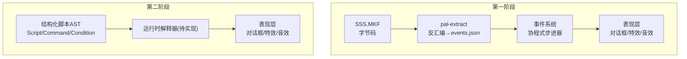
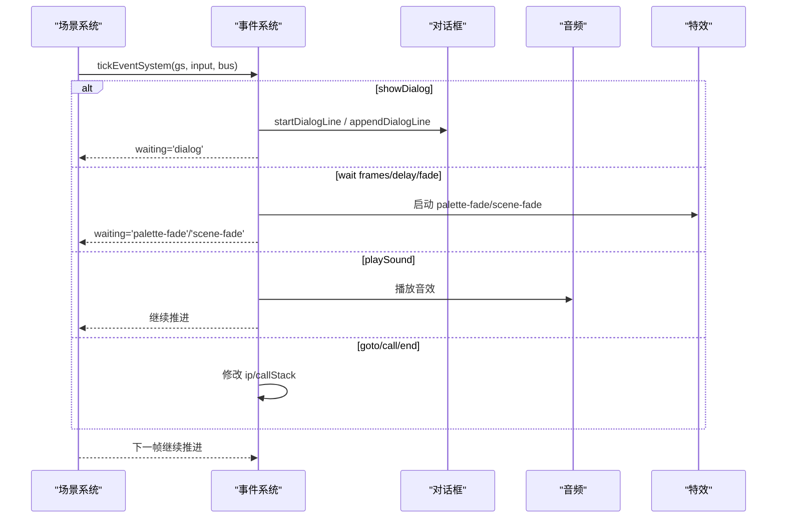
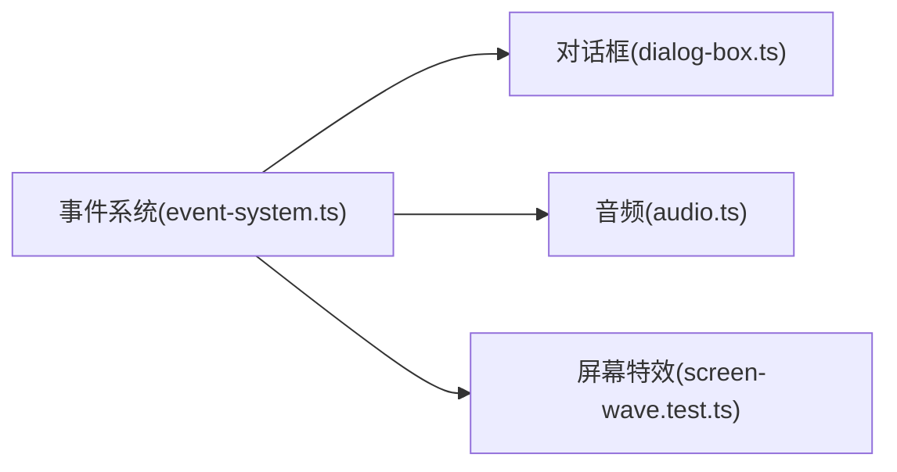

# 剧情脚本系统

<cite>
**本文引用的文件**   
- [README.md](file://README.md)
- [05-events-schema.md](file://docs/phase1/05-events-schema.md)
- [script-system-design.md](file://docs/phase2/foundation/script-system-design.md)
- [model-design.md](file://docs/phase2/dialogue/model-design.md)
- [visual-design.md](file://docs/phase2/dialogue/visual-design.md)
- [event-system.ts](file://packages/game/src/core/event-system.ts)
- [dialog-box.ts](file://packages/game/src/present/dialog-box.ts)
- [screen-wave.test.ts](file://packages/game/src/present/screen-wave.test.ts)
- [audio.ts](file://packages/game/src/shell/audio.ts)
</cite>

## 目录
1. [简介](#简介)
2. [项目结构](#项目结构)
3. [核心组件](#核心组件)
4. [架构总览](#架构总览)
5. [详细组件分析](#详细组件分析)
6. [依赖关系分析](#依赖关系分析)
7. [性能与执行特性](#性能与执行特性)
8. [排错指南](#排错指南)
9. [结论](#结论)
10. [附录：编写指南](#附录编写指南)

## 简介
本文件系统化梳理“剧情脚本系统”的设计与实现，覆盖事件脚本语法、条件判断逻辑、动画控制接口、协程式步进器（异步与帧级控制）、以及对话/任务/过场的制作指南。文档同时兼顾第一阶段（忠实还原）与第二阶段（Reforge 重制）两套体系：前者以字节码转写与具名命令为主，后者以结构化 AST 数据模型为核心。

## 项目结构
- 第一阶段（Phase 1）：以 sdlpal 为真值参考，事件脚本由 SSS.MKF 的字节码经 pal-extract 反汇编为 events.json，运行时由事件系统解释执行。
- 第二阶段（Phase 2）：采用结构化嵌套 AST 的数据模型，统一驱动对话、演出、状态读写等，便于查看器与编辑器消费同一模型。

图表来源
- [05-events-schema.md:1-158](file://docs/phase1/05-events-schema.md#L1-L158)
- [script-system-design.md:1-168](file://docs/phase2/foundation/script-system-design.md#L1-L168)

章节来源
- [README.md:1-139](file://README.md#L1-L139)

## 核心组件
- 事件脚本数据模型（第一阶段）：events.json 中的命令清单，支持具名动作、标签跳转、原始兜底，以及可选的结构化子集。
- 事件脚本数据模型（第二阶段）：结构化 AST，包含 Script、Command、Condition、EntityPage、TemplateInstance 等类型。
- 协程式步进器：事件系统在 tick 中推进命令，遇到可等待命令挂起，下一帧恢复；auto 脚本每帧推进一条。
- 对话系统：结构化 DialogueLine + locale 富文本，打字机效果、分页、自动推进、双框共存。
- 动画与特效：屏幕波动、淡入淡出、调色板渐变、RNG 过场、音效播放等。

章节来源
- [05-events-schema.md:25-111](file://docs/phase1/05-events-schema.md#L25-L111)
- [script-system-design.md:15-118](file://docs/phase2/foundation/script-system-design.md#L15-L118)
- [model-design.md:34-109](file://docs/phase2/dialogue/model-design.md#L34-L109)

## 架构总览
事件系统作为“世界 = 实体 + 触发器 + 脚本”的执行中枢，将脚本命令映射到表现层与状态层。第一阶段通过 label/goto 与具名 op 组合表达流程；第二阶段用结构化 branch/parallel/wait 等命令内嵌子树，避免悬空 goto。

图表来源
- [event-system.ts:1496-1510](file://packages/game/src/core/event-system.ts#L1496-L1510)
- [event-system.ts:500-533](file://packages/game/src/core/event-system.ts#L500-L533)
- [event-system.ts:571-598](file://packages/game/src/core/event-system.ts#L571-L598)

## 详细组件分析

### 事件脚本语法（第一阶段）
- 命令形态
  - 具名动作命令：op 字段为动词，操作数转为具名字段，如 giveItem、playMusic、showDialog。
  - 标签与跳转：label 标注目标命令，goto 跳转到标签名。
  - 原始兜底：raw opcode + operands，用于尚未具名的指令。
- 控制流
  - goto/条件命令：原版每种条件是专用 opcode，转写后保留语义，跳转字段指向标签。
  - 两类脚本：trigger（交互触发，整段跑完或阻塞于等待命令）、auto（NPC 待机行为，每帧推进一条）。
- 文字处理
  - 消息索引内联进命令，对话框类型（居中/上/下）转成 box 字段。
- 文件组织
  - 按场景可达性切分：scene-xxx.json、shared.json、objects.json；跨文件跳转使用 shared#label。

章节来源
- [05-events-schema.md:25-111](file://docs/phase1/05-events-schema.md#L25-L111)
- [05-events-schema.md:113-127](file://docs/phase1/05-events-schema.md#L113-L127)
- [05-events-schema.md:138-158](file://docs/phase1/05-events-schema.md#L138-L158)

### 事件脚本语法（第二阶段）
- 数据结构
  - WorldStateScriptExt：flags（布尔开关）、vars（数值变量），持久化并随存档。
  - Condition：flag/var/hasItem/all/any/not 判别联合。
  - ActorRef：player 或 { entity } 引用实体。
  - Command：discriminated union，起步集包括 dialog、choice、moveActor、faceActor、camera、giveItem/loseItem、learnSkill、giveMoney、setFlag/setVar/addVar、playEffect/playRng/playSound/fade、wait/branch/parallel/callScript/loadScene/startBattle/stop。
  - Script：id + body(Command[])。
  - EntityPage：when/sprite/pos/facing/visible/trigger，页模型决定实体外观与交互脚本。
  - TemplateInstance：chest/pickup/talk 等模板参数，expand 为标准命令。
- 关键决策
  - 结构化嵌套 AST，不用扁平 IP 跳转。
  - 持久状态一等公民，分支基于 flags/vars。
  - 模板=带参智能实体，底层统一，上层易用。
  - 战斗是边界外的独立系统，startBattle 调用。
  - content-first 增长命令集。
  - 实体场景本地，跨场景联动靠全局 flag。
  - 移动是路径点，不做自动寻路。

章节来源
- [script-system-design.md:15-118](file://docs/phase2/foundation/script-system-design.md#L15-L118)
- [script-system-design.md:120-147](file://docs/phase2/foundation/script-system-design.md#L120-L147)

### 条件判断逻辑
- 变量比较：var 条件支持 ==、!=、>=、<=、>、< 与数值比较。
- 状态检查：flag 条件读取布尔开关；hasItem 检查背包物品数量。
- 复合条件：all/any/not 组合多个条件，形成表达式树。
- 作用域：只读 world flags/vars/背包，不直接写入；写入通过 setFlag/setVar/addVar/giveItem 等命令完成。

章节来源
- [script-system-design.md:27-34](file://docs/phase2/foundation/script-system-design.md#L27-L34)

### 动画控制接口
- 精灵动画与走位
  - moveActor：actor 指定玩家或某实体，path 为 GridPos[] 途经点，speed 可调，wait 阻塞到走完。
  - faceActor：设置朝向。
  - camera：镜头跟随 actor/固定 pos/跟随 player，wait 阻塞。
- 屏幕特效
  - playEffect：在 actor 或网格位置播放特效。
  - fade：dir in/out，ms 可选时长。
  - screen-wave：屏幕波动效果（见测试用例）。
- 过场与音效
  - playRng：播放 RNG.MKF 过场动画。
  - playSound：播放音效，音频模块负责解码与去重。

章节来源
- [script-system-design.md:47-68](file://docs/phase2/foundation/script-system-design.md#L47-L68)
- [screen-wave.test.ts:1-43](file://packages/game/src/present/screen-wave.test.ts#L1-L43)
- [audio.ts:211-252](file://packages/game/src/shell/audio.ts#L211-L252)

### 协程式步进器（异步与帧级控制）
- trigger 脚本
  - 进入事件模式后逐步推进命令清单，遇可等待命令（对话、战斗、转场、播放动画）挂起，每 tick 查回执，完成后继续。
- auto 脚本
  - 每 tick 推进一条命令（跳转除外），对应 NPC 待机行为。
- 内部表示
  - 结构化命令加载时可展平成“带标签指令 + 指令指针”的统一形式，事件系统只需一种执行器。
- 保护机制
  - 单 tick 指令上限，防止死循环。

章节来源
- [05-events-schema.md:138-158](file://docs/phase1/05-events-schema.md#L138-L158)
- [event-system.ts:1587-1695](file://packages/game/src/core/event-system.ts#L1587-L1695)

### 对话系统（第二阶段）
- 数据模型
  - DialogueLine：speaker/text（TextId）、speed（ms/字）、autoAdvance（ms）。
  - Dialogue：id + lines[]。
  - i18n：正文走 text id + locale 表，颜色样式以成对标记（如 <cyan>…</cyan>）嵌入富文本。
- 渲染与交互
  - 打字机效果由 wall-clock 驱动，逐字显示；分页由渲染层计算；autoAdvance 尾停顿不可加速。
  - slot 模型：top/bottom 多面板共存，头像左/右，光标形态可选。
- 迁移策略
  - 原版 in-band 控制符（$NN/~NN/" 等）在数据生产期解析为结构化字段与富文本标记，运行时不再解析功能/结构控制符。

章节来源
- [model-design.md:34-109](file://docs/phase2/dialogue/model-design.md#L34-L109)
- [visual-design.md:29-96](file://docs/phase2/dialogue/visual-design.md#L29-L96)
- [dialog-box.ts:1245-1339](file://packages/game/src/present/dialog-box.ts#L1245-L1339)

## 依赖关系分析
- 事件系统与表现层解耦：事件系统通过命令总线发出 show/hide 等指令，表现层（对话框、特效、音效）订阅执行。
- 音频模块：按需加载、缓存 AudioBuffer，播放时受音量节点控制，失败静默不阻塞游戏。
- 屏幕特效：wave 效果通过帧缓冲变换与进度衰减，达到渐弱关闭。

图表来源
- [event-system.ts:1496-1510](file://packages/game/src/core/event-system.ts#L1496-L1510)
- [audio.ts:211-252](file://packages/game/src/shell/audio.ts#L211-L252)
- [screen-wave.test.ts:1-43](file://packages/game/src/present/screen-wave.test.ts#L1-L43)

章节来源
- [event-system.ts:1496-1510](file://packages/game/src/core/event-system.ts#L1496-L1510)
- [audio.ts:211-252](file://packages/game/src/shell/audio.ts#L211-L252)
- [screen-wave.test.ts:1-43](file://packages/game/src/present/screen-wave.test.ts#L1-L43)

## 性能与执行特性
- 协程步进器限制单 tick 指令数，避免长脚本导致卡顿。
- 对话打字机效果使用墙钟驱动，避免被主循环采样频率影响。
- 音频资源按需加载与缓存，解码失败静默处理，不影响主线流程。
- 屏幕特效 wave 每帧更新进度，归零自动关闭，减少无效计算。

章节来源
- [event-system.ts:1587-1695](file://packages/game/src/core/event-system.ts#L1587-L1695)
- [model-design.md:110-118](file://docs/phase2/dialogue/model-design.md#L110-L118)
- [audio.ts:211-252](file://packages/game/src/shell/audio.ts#L211-L252)
- [screen-wave.test.ts:28-43](file://packages/game/src/present/screen-wave.test.ts#L28-L43)

## 排错指南
- 对话尾停顿卡死/无限重播
  - 现象：打字中途反复按键导致尾停顿无法结束。
  - 根因：跳字后仍按行起始时间计算 elapsed，或反复按键重置尾停顿。
  - 修复要点：首次跳字修正 lineStartMs，后续仅等尾停顿；已进入尾停顿再按键应 noop。
- 事件系统越界/死循环
  - 现象：ip 越界或单 tick 指令过多。
  - 处理：记录警告并切回探索模式；超过阈值抛错防死循环。
- 音频未播放
  - 现象：音效缺失或浏览器未解锁 AudioContext。
  - 处理：确保用户交互后 resume；解码失败静默跳过。

章节来源
- [visual-spec.md:173-193](file://docs/phase2/dialogue/visual-spec.md#L173-L193)
- [event-system.ts:1620-1695](file://packages/game/src/core/event-system.ts#L1620-L1695)
- [audio.ts:211-252](file://packages/game/src/shell/audio.ts#L211-L252)

## 结论
本系统在第一阶段以字节码转写与具名命令保障忠实还原，在第二阶段以结构化 AST 提升可读性与可扩展性。事件系统作为统一执行中枢，结合协程式步进器、对话系统、动画与音效接口，为丰富的叙事体验提供坚实基础。

## 附录：编写指南

### 对话系统编写
- 使用 DialogueLine 结构化字段，text 走 locale 表，必要时以成对标记强调颜色。
- 合理设置 speed/autoAdvance，避免误用 in-band 控制符。
- 利用 slot/portrait/cursorFrame 控制布局与交互细节。

章节来源
- [model-design.md:34-109](file://docs/phase2/dialogue/model-design.md#L34-L109)
- [visual-design.md:60-96](file://docs/phase2/dialogue/visual-design.md#L60-L96)

### 任务触发与条件分支
- 使用 Condition 组合 flag/var/hasItem 构建触发守卫。
- 通过 branch/parallel/wait 编排复杂流程，保持结构化嵌套，避免 goto spaghetti。
- 模板（chest/pickup/talk）简化高频内容创作，expand 为标准命令。

章节来源
- [script-system-design.md:27-34](file://docs/phase2/foundation/script-system-design.md#L27-L34)
- [script-system-design.md:110-118](file://docs/phase2/foundation/script-system-design.md#L110-L118)

### 过场动画制作
- 使用 moveActor/camera 编排角色走位与镜头运动。
- 配合 playEffect/fade/playRng 增强视觉冲击。
- 通过 playSound 同步音效，注意音频上下文解锁与去重。

章节来源
- [script-system-design.md:47-68](file://docs/phase2/foundation/script-system-design.md#L47-L68)
- [audio.ts:211-252](file://packages/game/src/shell/audio.ts#L211-L252)