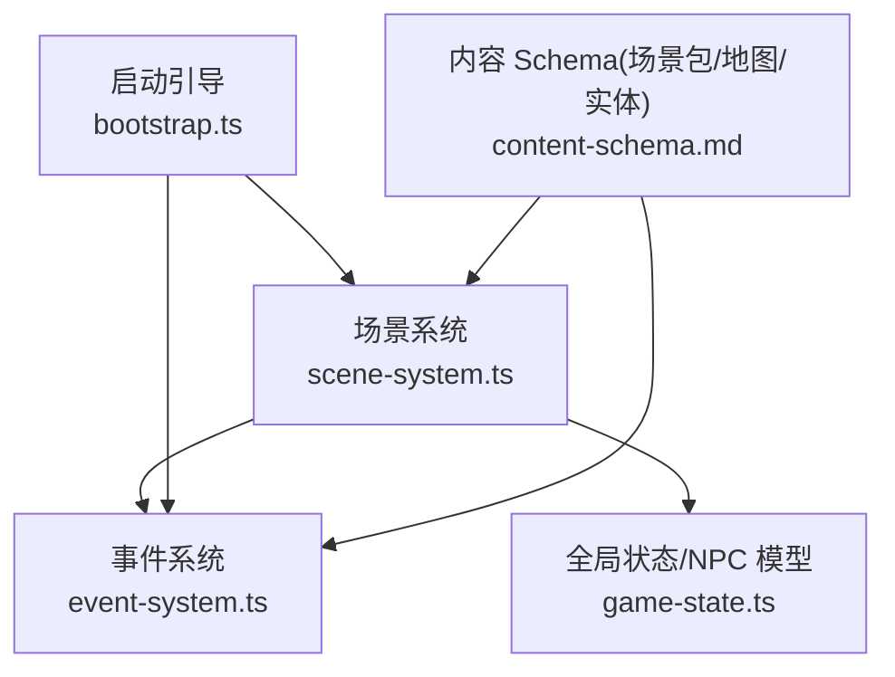
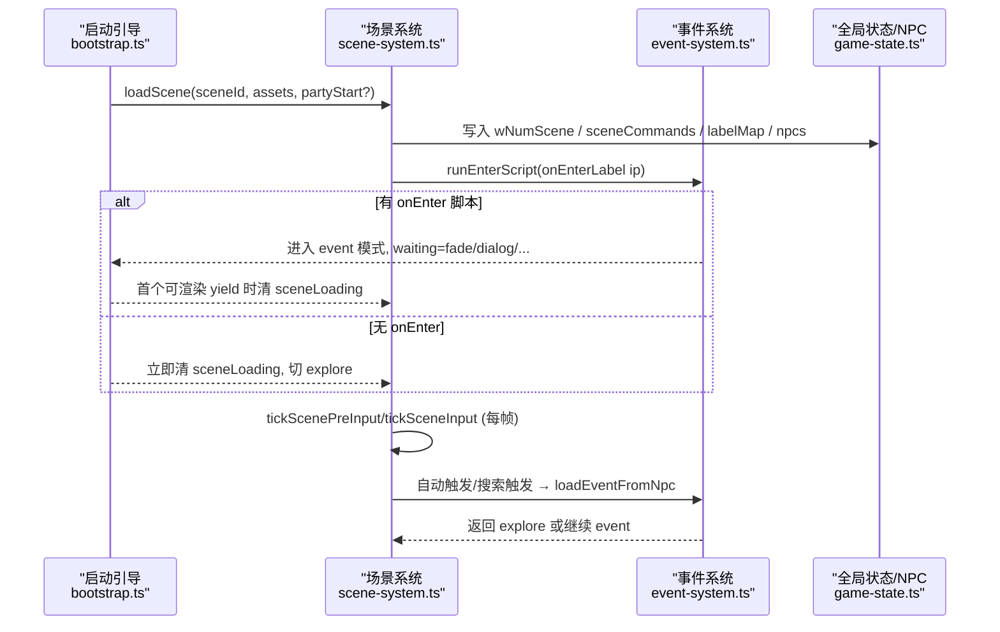
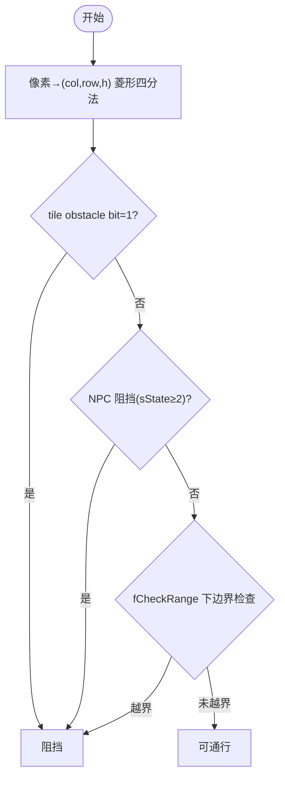
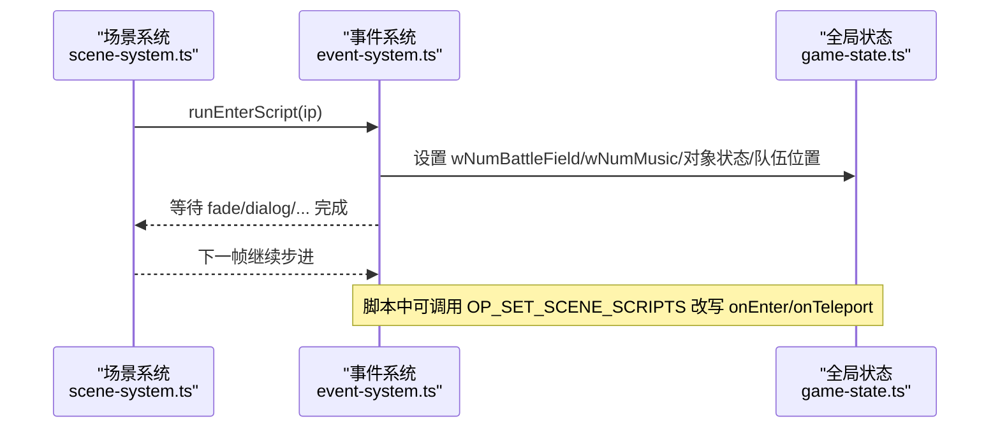

# 场景扩展接口

<cite>
**本文引用的文件**
- [scene-system.ts](file://packages/game/src/core/scene-system.ts)
- [event-system.ts](file://packages/game/src/core/event-system.ts)
- [game-state.ts](file://packages/game/src/core/game-state.ts)
- [bootstrap.ts](file://packages/game/src/shell/bootstrap.ts)
- [content-schema.md](file://docs/phase2/foundation/content-schema.md)
</cite>

## 目录
1. [简介](#简介)
2. [项目结构](#项目结构)
3. [核心组件](#核心组件)
4. [架构总览](#架构总览)
5. [详细组件分析](#详细组件分析)
6. [依赖关系分析](#依赖关系分析)
7. [性能与实现要点](#性能与实现要点)
8. [故障排查指南](#故障排查指南)
9. [结论](#结论)
10. [附录：开发示例](#附录开发示例)

## 简介
本文件面向“场景扩展”的开发者，系统化说明如何基于现有引擎扩展游戏世界内容。文档覆盖：
- 自定义场景开发：场景文件结构、瓦片地图配置、碰撞检测区域设置
- NPC 行为系统：NPC 数据格式、对话触发条件、移动路径配置
- 场景脚本编写：onEnter/onTeleport 事件处理、动态场景元素控制
- 相机控制接口：视口管理、跟随逻辑、边界限制
- 完整开发示例：新地图创建、NPC 添加、交互逻辑实现

## 项目结构
围绕场景扩展的关键代码位于以下模块：
- 场景运行与输入循环：packages/game/src/core/scene-system.ts
- 事件系统与脚本执行：packages/game/src/core/event-system.ts
- 全局状态与 NPC 模型：packages/game/src/core/game-state.ts
- 启动引导与场景加载流程：packages/game/src/shell/bootstrap.ts
- 第二阶段内容 Schema（场景包、地图、实体等）：docs/phase2/foundation/content-schema.md

图表来源
- [scene-system.ts:1-661](file://packages/game/src/core/scene-system.ts#L1-L661)
- [event-system.ts:1-800](file://packages/game/src/core/event-system.ts#L1-L800)
- [game-state.ts:82-108](file://packages/game/src/core/game-state.ts#L82-L108)
- [bootstrap.ts:860-879](file://packages/game/src/shell/bootstrap.ts#L860-L879)
- [content-schema.md:50-67](file://docs/phase2/foundation/content-schema.md#L50-L67)

章节来源
- [scene-system.ts:1-661](file://packages/game/src/core/scene-system.ts#L1-L661)
- [event-system.ts:1-800](file://packages/game/src/core/event-system.ts#L1-L800)
- [game-state.ts:82-108](file://packages/game/src/core/game-state.ts#L82-L108)
- [bootstrap.ts:860-879](file://packages/game/src/shell/bootstrap.ts#L860-L879)
- [content-schema.md:50-67](file://docs/phase2/foundation/content-schema.md#L50-L67)

## 核心组件
- 场景系统（探索模式主循环）
  - 负责读取输入、移动与转向、碰撞与阻挡、自动触发区检测、Confirm 调查、切模式
  - 提供 isWalkable 菱形碰撞判定、自动触发距离公式、推离阻挡物逻辑、相机跟随与边界限制
- 事件系统（事件模式步进器）
  - 驱动 opcode 执行：对话、镜头、淡入淡出、场景切换、对象状态、音乐音效、随机数、移动等
  - 维护 onEnter/onTeleport 覆盖、autoScript 推进、等待态（dialog/camera-pan/palette-fade 等）
- 全局状态与 NPC 模型
  - NpcState 字段定义：坐标、精灵号、triggerLabel、triggerMode、sState、scriptedFrame 等
- 启动引导
  - 场景加载后注入 onEnter 脚本、重置 NPC、更新 SceneContext、必要时覆写 party 起点并同步 camera

章节来源
- [scene-system.ts:1-661](file://packages/game/src/core/scene-system.ts#L1-L661)
- [event-system.ts:1-800](file://packages/game/src/core/event-system.ts#L1-L800)
- [game-state.ts:82-108](file://packages/game/src/core/game-state.ts#L82-L108)
- [bootstrap.ts:860-879](file://packages/game/src/shell/bootstrap.ts#L860-L879)

## 架构总览
下图展示从“加载场景”到“进入探索/事件循环”的整体流程，以及关键回调点（onEnter/onTeleport）。

图表来源
- [bootstrap.ts:860-879](file://packages/game/src/shell/bootstrap.ts#L860-L879)
- [scene-system.ts:586-661](file://packages/game/src/core/scene-system.ts#L586-L661)
- [event-system.ts:4810-4830](file://packages/game/src/core/event-system.ts#L4810-L4830)

## 详细组件分析

### 场景文件结构与地图配置（第二阶段 Schema）
- 场景包自包含：id/name、map 引用、entities（统一实体模型）、cutscenes/triggers、entry
- 地图支持尺寸可变、多层视觉层、独立碰撞/地形层；tile 用于铺地，entity 用于独立物件
- 推荐目录结构：world/scenes/shared/assets

章节来源
- [content-schema.md:50-67](file://docs/phase2/foundation/content-schema.md#L50-L67)
- [content-schema.md:69-89](file://docs/phase2/foundation/content-schema.md#L69-L89)
- [content-schema.md:99-111](file://docs/phase2/foundation/content-schema.md#L99-L111)

### 碰撞检测与行走规则
- 菱形四分法将像素映射到 tile(col,row,h)，再查 obstacle bit(bit 13 of lower/upper u16)
- NPC 阻挡：仅 sState>=2 的对象参与阻挡；contact 明雷(triggerMode>=4)不阻挡走路但会触发战斗
- 自动触发区：按 triggerMode 计算阈值，Manhattan 加权距离 < threshold 即触发
- 推离阻挡：当玩家被 NPC 压住时，沿 NPC 朝向顺时针试 4 个方向，找到合法落点并同步 camera

图表来源
- [scene-system.ts:348-425](file://packages/game/src/core/scene-system.ts#L348-L425)

章节来源
- [scene-system.ts:348-425](file://packages/game/src/core/scene-system.ts#L348-L425)
- [scene-system.ts:125-140](file://packages/game/src/core/scene-system.ts#L125-L140)
- [scene-system.ts:276-296](file://packages/game/src/core/scene-system.ts#L276-L296)

### NPC 行为系统
- NPC 数据格式（关键字段）
  - id/x/y/spriteNum：位置与外观
  - triggerLabel/triggerMode：对话/自动触发
  - sState/scriptedFrame：可见性与动画帧
  - autoTriggerAnchorX/Y/autoTriggerOnce：自动触发锚点与一次性触发
- 对话触发条件
  - Confirm 搜索：在面向方向 13 格范围内且 grid 匹配，命中后 NPC 面向队伍反方向并复位站立帧
  - 自动触发：走进指定距离阈值范围，满足 sState>0 且 triggerMode≥4 即触发
- 移动路径配置
  - 单步移动：OP_NPC_WALK_ONE_STEP_* 系列按 facing 走一步并推进动画帧
  - 直线走到目标：OP_NPC_WALK_TO_* 系列逐帧推进直至到达
  - 相对位移：OP_MOVE_OBJECT 直接修改 x/y
  - 自身遮挡排除：NPC 移动时 selfNpcId 跳过自身

章节来源
- [game-state.ts:82-108](file://packages/game/src/core/game-state.ts#L82-L108)
- [scene-system.ts:159-178](file://packages/game/src/core/scene-system.ts#L159-L178)
- [scene-system.ts:187-267](file://packages/game/src/core/scene-system.ts#L187-L267)
- [event-system.ts:5491-5502](file://packages/game/src/core/event-system.ts#L5491-L5502)

### 场景脚本编写（onEnter/onTeleport 与动态控制）
- onEnter 入口
  - 场景加载时若存在 onEnterLabel，则解析为全局 ip 并运行；可在其中设置战场、音乐、对象状态、队伍位置等
  - 首次可渲染 yield 前保持 sceneLoading 冻结渲染，避免旧场景残留
- onTeleport 覆盖
  - 通过 OP_SET_SCENE_SCRIPTS 可为某场景设置 onEnter/onTeleport 覆盖；onTeleport 持久生效，供归隐符/瞬移使用
- 动态场景元素控制
  - 对象状态：OP_SET_SCENE_OBJECT_STATE / OP_SET_MULTI_OBJECT_STATE
  - 对象位置/姿态：OP_SET_OBJECT_POS / OP_SET_OBJECT_GESTURE / OP_SET_EVENT_OBJECT_DIR_AND_FRAME
  - 隐藏/显影：OP_NULLIFY_OBJECT / OP_HIDE_OBJECT
  - 镜头/特效：OP_SET_CAMERA / OP_FADE_SCREEN / OP_SCENE_FADE / OP_COLOR_FADE / OP_PLAY_RNG 等

图表来源
- [bootstrap.ts:860-879](file://packages/game/src/shell/bootstrap.ts#L860-L879)
- [event-system.ts:4810-4830](file://packages/game/src/core/event-system.ts#L4810-L4830)

章节来源
- [bootstrap.ts:860-879](file://packages/game/src/shell/bootstrap.ts#L860-L879)
- [event-system.ts:4810-4830](file://packages/game/src/core/event-system.ts#L4810-L4830)

### 相机控制接口（视口管理、跟随、边界）
- 视口语义：camera = party.world - PARTYOFFSET(160,112)
- 跟随逻辑：每帧根据 party 位置计算 camera，并 clamp 到地图边界
- 脚本控制：
  - 回正：op0=0, op1=0 → camera 回到队伍中心
  - 绝对定位：flag=0xFFFF → camera 设为绝对 tile 坐标
  - 相对平移：多帧 pan(op2>1) → waiting='camera-pan' 逐帧推进
- 注意：多帧 pan 期间 present 仍会重绘场景，需配合 needToFadeIn 与 palette fade 保证视觉正确

章节来源
- [scene-system.ts:427-434](file://packages/game/src/core/scene-system.ts#L427-L434)
- [event-system.ts:3650-3672](file://packages/game/src/core/event-system.ts#L3650-L3672)
- [event-system.ts:2389-2395](file://packages/game/src/core/event-system.ts#L2389-L2395)

## 依赖关系分析
- scene-system.ts 依赖 event-system.ts 的脚本解析与自动脚本推进
- event-system.ts 通过注入 hook 访问碰撞检测（isObstacle），避免反向 import 成环
- bootstrap.ts 协调场景加载、onEnter 执行与 sceneLoading 生命周期
- game-state.ts 提供 NpcState 等运行时数据结构

图表来源
- [scene-system.ts:1-661](file://packages/game/src/core/scene-system.ts#L1-L661)
- [event-system.ts:1-800](file://packages/game/src/core/event-system.ts#L1-L800)
- [game-state.ts:82-108](file://packages/game/src/core/game-state.ts#L82-L108)
- [bootstrap.ts:860-879](file://packages/game/src/shell/bootstrap.ts#L860-L879)

章节来源
- [scene-system.ts:1-661](file://packages/game/src/core/scene-system.ts#L1-L661)
- [event-system.ts:1-800](file://packages/game/src/core/event-system.ts#L1-L800)
- [game-state.ts:82-108](file://packages/game/src/core/game-state.ts#L82-L108)
- [bootstrap.ts:860-879](file://packages/game/src/shell/bootstrap.ts#L860-L879)

## 性能与实现要点
- 碰撞判定采用位运算与整数算术，复杂度 O(1) 对 tile，O(N) 对 NPC 列表（N 通常为几十量级）
- 自动触发区检测每帧遍历 NPC，建议合理设置 triggerMode 与 anchor 减少误触
- 多帧 camera-pan 与 palette fade 需要谨慎管理 sceneLoading 与 needToFadeIn，避免多余重绘
- 自动脚本与对话期冻结：对话阻塞期间 owner NPC 的 autoScript 应跳过，防止覆盖面向玩家的姿势

[本节为通用指导，无需具体文件引用]

## 故障排查指南
- 常见问题
  - 走进地图边缘不触发场景切换：检查 NPC 的 triggerMode 与阈值公式是否匹配
  - 对话期 NPC 瞬间转回：确认对话阻塞期间是否跳过了 owner NPC 的 autoScript
  - 切场景后黑屏不亮：确保 onEnter 中有合适的淡入或 needToFadeIn 被消费
  - 相机偏移异常：核对 PARTYOFFSET 与 camera 计算公式，确认绝对/相对/回正分支
- 定位手段
  - 打印 gs.eventCursor.waiting 与 gs.sceneLoading 判断当前等待态
  - 校验 isWalkable 返回值与 NPC sState/triggerMode 是否符合预期
  - 检查 OP_SET_SCENE_SCRIPTS 是否正确设置了 onEnter/onTeleport 覆盖

章节来源
- [scene-system.ts:187-267](file://packages/game/src/core/scene-system.ts#L187-L267)
- [event-system.ts:2389-2395](file://packages/game/src/core/event-system.ts#L2389-L2395)
- [event-system.ts:4810-4830](file://packages/game/src/core/event-system.ts#L4810-L4830)

## 结论
通过统一的场景包 Schema、清晰的碰撞与触发机制、完善的脚本与相机控制接口，开发者可以高效扩展游戏世界。遵循“场景自包含、稳定身份、世界变量显式化”的原则，能显著降低跨场景耦合与维护成本。

[本节为总结性内容，无需具体文件引用]

## 附录：开发示例

### 示例一：创建新地图与场景
- 准备地图资源与 tileset，按 content-schema 组织 scenes/<name>/map 与 entities
- 在场景中定义 entry（onEnterLabel），并在脚本中设置初始战场/音乐/对象状态
- 加载场景：调用 loadScene(sceneId, assets, partyStart?)，按需传入 partyStart 以覆盖起点

章节来源
- [content-schema.md:50-67](file://docs/phase2/foundation/content-schema.md#L50-L67)
- [scene-system.ts:586-661](file://packages/game/src/core/scene-system.ts#L586-L661)

### 示例二：添加 NPC 与对话触发
- 在场景 entities 中添加 NPC，设置 spriteNum、triggerLabel、triggerMode
- 若需走近自动触发，设置 triggerMode≥4 与合适阈值；如需 Confirm 调查，设置 triggerMode 1..3
- 在对应 triggerLabel 指向的脚本中编写 showDialog、跳转、对象状态变更等逻辑

章节来源
- [game-state.ts:82-108](file://packages/game/src/core/game-state.ts#L82-L108)
- [scene-system.ts:159-178](file://packages/game/src/core/scene-system.ts#L159-L178)
- [scene-system.ts:187-267](file://packages/game/src/core/scene-system.ts#L187-L267)

### 示例三：实现交互逻辑（对象状态与镜头）
- 使用 OP_SET_SCENE_OBJECT_STATE 改变对象可见性或状态
- 使用 OP_SET_CAMERA 进行镜头回正/绝对定位/多帧平移
- 结合 OP_FADE_SCREEN/OP_SCENE_FADE 做过渡效果，注意 sceneLoading 与 needToFadeIn 的配合

章节来源
- [event-system.ts:3650-3672](file://packages/game/src/core/event-system.ts#L3650-L3672)
- [event-system.ts:2389-2395](file://packages/game/src/core/event-system.ts#L2389-L2395)

### 示例四：NPC 移动路径配置
- 使用 OP_NPC_WALK_ONE_STEP_* 让 NPC 按方向走一步
- 使用 OP_NPC_WALK_TO_* 让 NPC 直线移动到目标坐标（支持不同速度）
- 使用 OP_MOVE_OBJECT 进行相对位移；注意自身遮挡排除与碰撞检测

章节来源
- [event-system.ts:5491-5502](file://packages/game/src/core/event-system.ts#L5491-L5502)
- [scene-system.ts:348-425](file://packages/game/src/core/scene-system.ts#L348-L425)