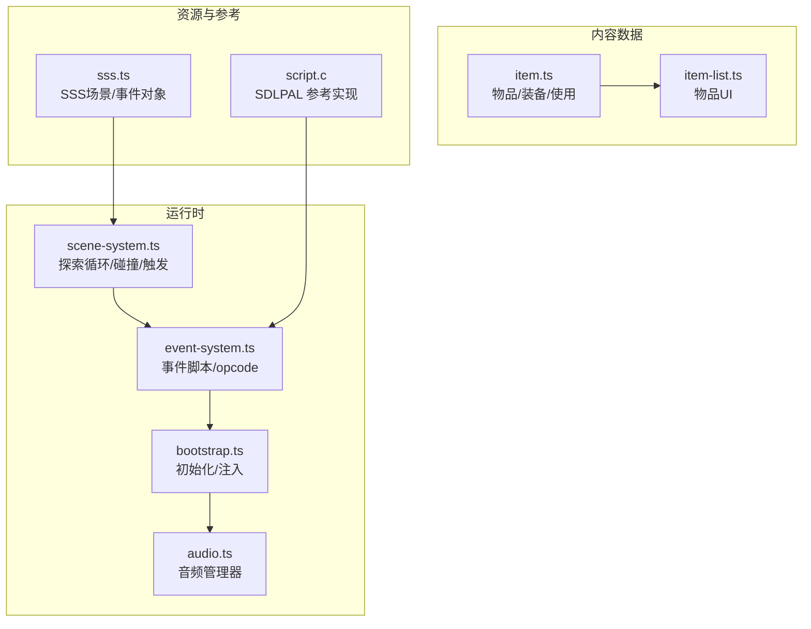
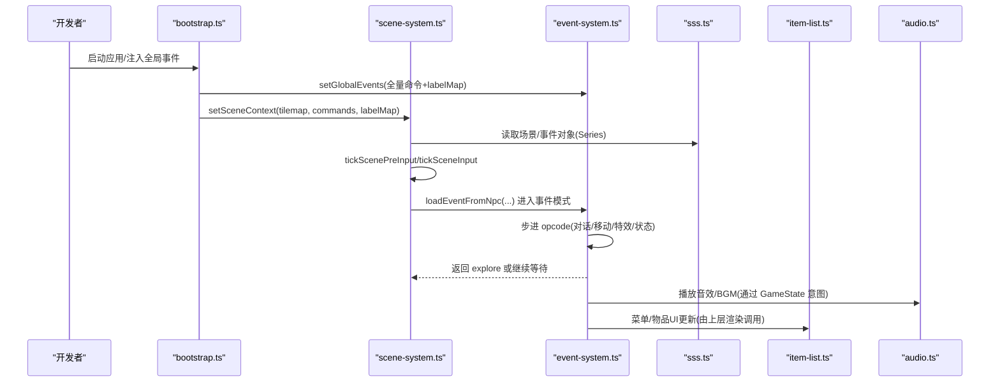
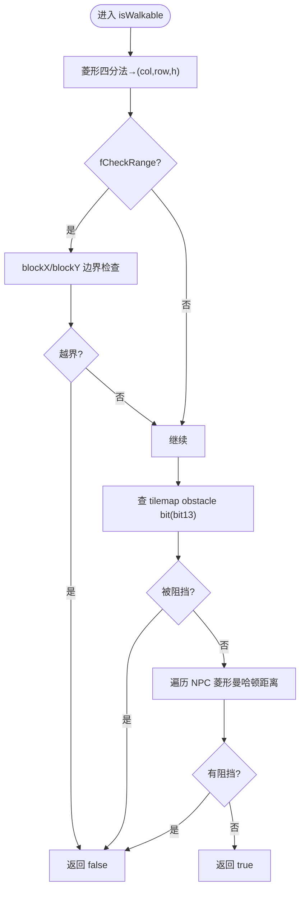
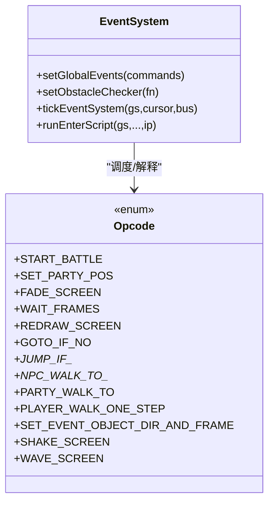
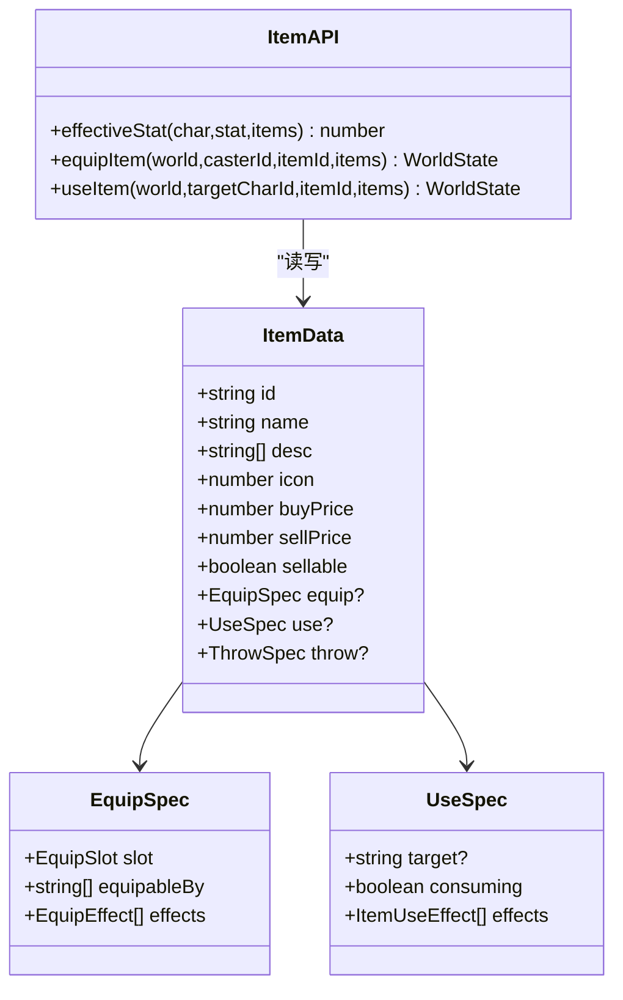
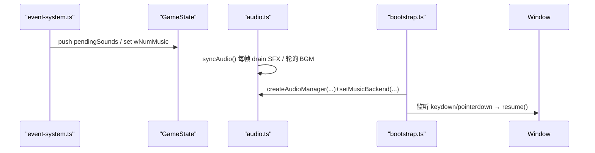
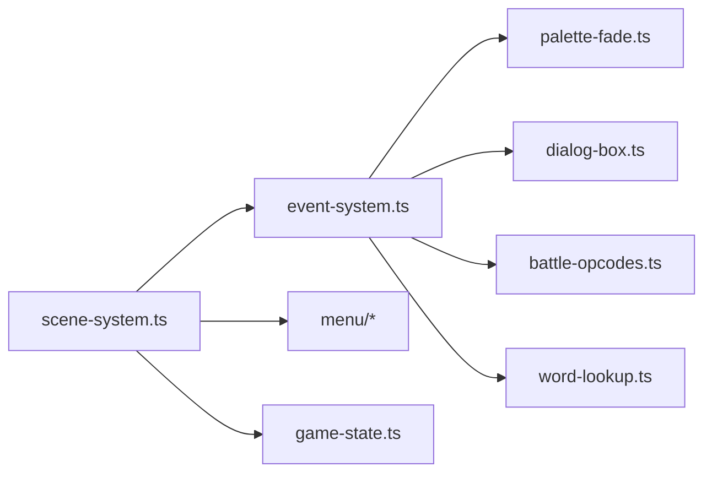

# 扩展接口

<cite>
**本文引用的文件**   
- [packages/game/src/core/scene-system.ts](file://packages/game/src/core/scene-system.ts)
- [packages/game/src/core/event-system.ts](file://packages/game/src/core/event-system.ts)
- [packages/content/src/item.ts](file://packages/content/src/item.ts)
- [packages/reforge/src/menu/item-list.ts](file://packages/reforge/src/menu/item-list.ts)
- [packages/pal-extract/src/io/sss.ts](file://packages/pal-extract/src/io/sss.ts)
- [reference/sdlpal/script.c](file://reference/sdlpal/script.c)
- [packages/game/src/shell/bootstrap.ts](file://packages/game/src/shell/bootstrap.ts)
- [packages/game/src/shell/audio.ts](file://packages/game/src/shell/audio.ts)
</cite>

## 目录
1. [简介](#简介)
2. [项目结构](#项目结构)
3. [核心组件](#核心组件)
4. [架构总览](#架构总览)
5. [详细组件分析](#详细组件分析)
6. [依赖关系分析](#依赖关系分析)
7. [性能与可维护性](#性能与可维护性)
8. [故障排查指南](#故障排查指南)
9. [结论](#结论)
10. [附录：开发示例与集成清单](#附录开发示例与集成清单)

## 简介
本文件面向“扩展开发者”，聚焦以下能力：
- 自定义场景开发：场景文件结构、碰撞检测配置、NPC 行为定义
- 新物品添加：物品数据格式、效果实现接口、UI 显示定制
- 剧情脚本编写：事件脚本语法、条件判断逻辑、动画控制接口
- 插件系统接口：渲染钩子、音频扩展、输入处理扩展
并提供完整示例与集成步骤，帮助快速扩展游戏功能。

## 项目结构
本项目采用多包工作区组织，核心扩展点分布在：
- 场景与事件：scene-system.ts（探索模式 tick、碰撞、自动触发）、event-system.ts（事件脚本引擎与 opcode）
- 内容数据层：content/src/item.ts（物品/装备数据结构与使用/穿戴逻辑）
- UI 展示：reforge/src/menu/item-list.ts（物品列表与详情绘制）
- 资源提取：pal-extract/src/io/sss.ts（SSS 场景/事件对象解析）
- 参考真值：reference/sdlpal/script.c（opcode 语义来源）
- 运行时注入：shell/bootstrap.ts、shell/audio.ts（音频后端、输入解锁等）

图表来源
- [packages/game/src/core/scene-system.ts:1-120](file://packages/game/src/core/scene-system.ts#L1-L120)
- [packages/game/src/core/event-system.ts:1-120](file://packages/game/src/core/event-system.ts#L1-L120)
- [packages/content/src/item.ts:1-67](file://packages/content/src/item.ts#L1-L67)
- [packages/reforge/src/menu/item-list.ts:1-88](file://packages/reforge/src/menu/item-list.ts#L1-L88)
- [packages/pal-extract/src/io/sss.ts:66-173](file://packages/pal-extract/src/io/sss.ts#L66-L173)
- [reference/sdlpal/script.c:594-695](file://reference/sdlpal/script.c#L594-L695)
- [packages/game/src/shell/bootstrap.ts:449-469](file://packages/game/src/shell/bootstrap.ts#L449-L469)
- [packages/game/src/shell/audio.ts:1-26](file://packages/game/src/shell/audio.ts#L1-L26)

章节来源
- [README.md:1-139](file://README.md#L1-L139)

## 核心组件
- 场景系统（scene-system.ts）
  - 负责探索模式主循环：读取输入、移动与转向、菱形碰撞、NPC 阻挡、自动触发区、Confirm 调查、相机跟随与边界限制、切场景加载。
  - 关键函数：tickSceneSystem、isWalkable、loadScene、tickScenePreInput、tickSceneInput。
- 事件系统（event-system.ts）
  - 协程式步进器，驱动事件脚本执行；提供大量具名 opcode（对话、移动、淡入淡出、状态修改、战斗开关等）。
  - 通过 setGlobalEvents 注入全局命令数组与 labelMap；通过 setObstacleChecker 注入碰撞检测回调。
- 内容数据（item.ts）
  - 定义 ItemData/EquipSpec/UseSpec 等类型，提供 effectiveStat/equipItem/useItem 等纯函数，用于计算属性、换装与使用效果。
- UI 展示（item-list.ts）
  - 绘制物品网格、数量、选中光标与底部 itembox 图标/描述，支持“已装备”高亮与闪烁选择色。
- 资源提取（sss.ts）
  - 解析 SSS 中的 Scene 与 EventObject 原始块，供场景加载与 NPC 生成。
- 参考实现（script.c）
  - SDLPAL 原版脚本解释器，作为 opcode 语义与行为对齐的权威来源。
- 运行时注入（bootstrap.ts / audio.ts）
  - 初始化音频后端、用户手势解锁 AudioContext、注册事件监听；为 event-system 提供外部能力注入点。

章节来源
- [packages/game/src/core/scene-system.ts:1-120](file://packages/game/src/core/scene-system.ts#L1-L120)
- [packages/game/src/core/event-system.ts:1-120](file://packages/game/src/core/event-system.ts#L1-L120)
- [packages/content/src/item.ts:1-67](file://packages/content/src/item.ts#L1-L67)
- [packages/reforge/src/menu/item-list.ts:1-88](file://packages/reforge/src/menu/item-list.ts#L1-L88)
- [packages/pal-extract/src/io/sss.ts:66-173](file://packages/pal-extract/src/io/sss.ts#L66-L173)
- [reference/sdlpal/script.c:594-695](file://reference/sdlpal/script.c#L594-L695)
- [packages/game/src/shell/bootstrap.ts:449-469](file://packages/game/src/shell/bootstrap.ts#L449-L469)
- [packages/game/src/shell/audio.ts:1-26](file://packages/game/src/shell/audio.ts#L1-L26)

## 架构总览
下图展示了从“场景加载 → 事件脚本 → 渲染/音频/输入”的关键路径与扩展点。

图表来源
- [packages/game/src/shell/bootstrap.ts:449-469](file://packages/game/src/shell/bootstrap.ts#L449-L469)
- [packages/game/src/core/scene-system.ts:586-661](file://packages/game/src/core/scene-system.ts#L586-L661)
- [packages/game/src/core/event-system.ts:1-120](file://packages/game/src/core/event-system.ts#L1-L120)
- [packages/pal-extract/src/io/sss.ts:66-173](file://packages/pal-extract/src/io/sss.ts#L66-L173)
- [packages/reforge/src/menu/item-list.ts:1-88](file://packages/reforge/src/menu/item-list.ts#L1-L88)
- [packages/game/src/shell/audio.ts:1-26](file://packages/game/src/shell/audio.ts#L1-L26)

## 详细组件分析

### 场景系统与碰撞检测
- 场景文件结构
  - 场景元信息包含 mapNum、onEnter/onTeleport 脚本入口、事件对象索引等，来源于 SSS 解析结果。
  - 场景切换时，会重置 NPC、设置当前地图号、运行 onEnter 脚本并可选覆写队伍起点。
- 碰撞检测配置
  - isWalkable 实现菱形四分法映射到 tile(col,row,h)，检查 tilemap obstacle bit(bit 13 of lower/upper u16)，再叠加 NPC 菱形曼哈顿距离判定。
  - 走路时 fCheckRange=TRUE，加入 blockX/blockY 下边界保护，确保镜头不越界。
- NPC 行为定义
  - triggerMode 4..8 对应不同自动触发阈值；sState>=2 视为阻挡物；nSpriteFrames>0 才进行朝向/站立帧调整。
  - Confirm Search 命中后，NPC 面向队伍反方向并复位站立帧，队伍全员面向 NPC。

图表来源
- [packages/game/src/core/scene-system.ts:348-425](file://packages/game/src/core/scene-system.ts#L348-L425)

章节来源
- [packages/game/src/core/scene-system.ts:1-120](file://packages/game/src/core/scene-system.ts#L1-L120)
- [packages/game/src/core/scene-system.ts:348-425](file://packages/game/src/core/scene-system.ts#L348-L425)
- [packages/pal-extract/src/io/sss.ts:66-173](file://packages/pal-extract/src/io/sss.ts#L66-L173)

### 事件脚本与 NPC 行为
- 事件脚本语法
  - 以具名 opcode 为主，如 OP_START_BATTLE、OP_SET_PARTY_POS、OP_FADE_SCREEN、OP_WAIT_FRAMES、OP_REDRAW_SCREEN、OP_GOTO_IF_NO 等。
  - 通过 setGlobalEvents 注入全局命令数组与 labelMap，goto/call/reset 基于 label 跳转。
- 条件判断逻辑
  - 条件跳转类 opcode：OP_JUMP_IF_ITEM_LESS、OP_JUMP_IF_NOT_POISONED、OP_JUMP_IF_SCENE、OP_RANDOM_JUMP 等。
  - 成功/失败门控：OP_MARK_SCRIPT_FAILED 影响后续 gate 分支。
- 动画控制接口
  - 移动：OP_NPC_WALK_TO_SPEED_3/2/8、OP_PARTY_WALK_TO、OP_PLAYER_WALK_ONE_STEP、OP_ANIMATE_OBJECT。
  - 姿态：OP_SET_EVENT_OBJECT_DIR_AND_FRAME、OP_SET_OBJECT_GESTURE、OP_SET_PLAYER_SPRITE。
  - 屏幕特效：OP_FADE_SCREEN、OP_SCENE_FADE、OP_COLOR_FADE、OP_SHAKE_SCREEN、OP_WAVE_SCREEN。
- 与 SDLPAL 对齐
  - 所有 opcode 语义与参数解读均参考 reference/sdlpal/script.c 真值。

图表来源
- [packages/game/src/core/event-system.ts:1-120](file://packages/game/src/core/event-system.ts#L1-L120)
- [reference/sdlpal/script.c:594-695](file://reference/sdlpal/script.c#L594-L695)

章节来源
- [packages/game/src/core/event-system.ts:1-120](file://packages/game/src/core/event-system.ts#L1-L120)
- [reference/sdlpal/script.c:594-695](file://reference/sdlpal/script.c#L594-L695)

### 新物品添加：数据格式、效果接口与 UI 定制
- 物品数据格式
  - ItemData 字段：id/name/desc/icon/buyPrice/sellPrice/sellable/equip?/use?/throw?。
  - EquipSpec：slot/equipableBy/effects[]；UseSpec：target/consuming/effects[]；ThrowSpec：effects[]。
- 效果实现接口
  - useItem(world,targetCharId,itemId,items) 支持 healHp/healMp 等效果；其余 kind 留桩可扩展。
  - equipItem(world,casterId,itemId,items) 完成换装与库存交换。
  - effectiveStat(char,stat,items) 计算穿戴后的有效属性。
- UI 显示定制
  - drawItemGridList 绘制 3 列网格、数量、选中光标与底部 itembox 图标/多行描述；支持“已装备”绿色高亮与选中闪烁。

图表来源
- [packages/content/src/item.ts:1-67](file://packages/content/src/item.ts#L1-L67)
- [packages/content/src/item.ts:69-176](file://packages/content/src/item.ts#L69-L176)
- [packages/reforge/src/menu/item-list.ts:1-88](file://packages/reforge/src/menu/item-list.ts#L1-L88)

章节来源
- [packages/content/src/item.ts:1-67](file://packages/content/src/item.ts#L1-L67)
- [packages/content/src/item.ts:69-176](file://packages/content/src/item.ts#L69-L176)
- [packages/reforge/src/menu/item-list.ts:1-88](file://packages/reforge/src/menu/item-list.ts#L1-L88)

### 插件系统接口：渲染钩子、音频扩展、输入处理扩展
- 渲染钩子
  - 通过 setSceneContext 将 tilemap、事件命令与 labelMap 注入 scene-system；present 层在 tick 中消费 gs.paletteFadeState/fadeState 等状态进行淡入淡出、抖动等视觉表现。
- 音频扩展
  - shell 层 AudioManager 暴露 MusicBackend 接口（play/stop/resume），bootstrap 注入 SpessaSynth 后端；core 仅通过 GameState 意图（pendingSounds/wNumMusic）驱动。
- 输入处理扩展
  - bootstrap 监听 keydown/pointerdown 解锁 AudioContext；scene-system 内部按最后按下键决定 facing（last-press priority），与 SDLPAL 一致。

图表来源
- [packages/game/src/shell/audio.ts:1-26](file://packages/game/src/shell/audio.ts#L1-L26)
- [packages/game/src/shell/bootstrap.ts:449-469](file://packages/game/src/shell/bootstrap.ts#L449-L469)
- [packages/game/src/core/event-system.ts:1-120](file://packages/game/src/core/event-system.ts#L1-L120)

章节来源
- [packages/game/src/shell/audio.ts:1-26](file://packages/game/src/shell/audio.ts#L1-L26)
- [packages/game/src/shell/bootstrap.ts:449-469](file://packages/game/src/shell/bootstrap.ts#L449-L469)
- [packages/game/src/core/scene-system.ts:70-98](file://packages/game/src/core/scene-system.ts#L70-L98)

## 依赖关系分析
- 模块耦合
  - scene-system.ts 依赖 event-system.ts（自动脚本/触发）、menu 子系统（快捷菜单）、game-state（NPC/队伍状态）。
  - event-system.ts 依赖 word-lookup、palette-fade、dialog-box、battle-opcodes 等，并通过注入点与外部交互（obstacle checker、scene loader、map reloader、palette source）。
- 外部依赖
  - 资源来自 extracted 目录（软链至 data/extracted），由 pal-extract 生成。
  - 行为真值参考 sdlpal C 源码。

图表来源
- [packages/game/src/core/scene-system.ts:1-120](file://packages/game/src/core/scene-system.ts#L1-L120)
- [packages/game/src/core/event-system.ts:1-120](file://packages/game/src/core/event-system.ts#L1-L120)

章节来源
- [packages/game/src/core/scene-system.ts:1-120](file://packages/game/src/core/scene-system.ts#L1-L120)
- [packages/game/src/core/event-system.ts:1-120](file://packages/game/src/core/event-system.ts#L1-L120)

## 性能与可维护性
- 碰撞检测
  - isWalkable 使用 O(n) 遍历 NPC 列表，建议对大场景考虑空间分区或缓存最近邻 NPC。
- 脚本执行
  - 单 tick 内连跑非阻塞命令，配合 SINGLE_TICK_LIMIT 防死循环；长演出建议使用 frame-wait 与 fade 分段。
- 资源加载
  - 场景切换走异步 lazy fetch，避免首屏卡顿；注意重复切同场景不重复 fetch。
- 代码风格
  - 严格对照 SDLPAL 真值注释与行号，便于回归审计与差异修复。

[本节为通用指导，无需具体文件引用]

## 故障排查指南
- 走到地图边缘不触发切场景
  - 检查 NPC triggerMode 阈值与 autoTriggerAnchorX/Y 是否合理；确认 _findTriggerZoneNpc 的距离公式与 threshold 计算。
- NPC 被调查后姿势异常
  - 确认 applySearchVisualEffect 仅在 nSpriteFrames>0 时重置站立帧；避免误改装饰物。
- 脚本无响应或卡住
  - 检查 goto/call 目标 label 是否存在；确认 setGlobalEvents 是否正确注入；查看 waiting 状态是否为 'frame-wait'/'scene-fade' 等。
- 音频无声
  - 确认 bootstrap 已监听 keydown/pointerdown 并调用 resume()；检查 MusicBackend 注入与 track 编号。

章节来源
- [packages/game/src/core/scene-system.ts:125-140](file://packages/game/src/core/scene-system.ts#L125-L140)
- [packages/game/src/core/scene-system.ts:159-178](file://packages/game/src/core/scene-system.ts#L159-L178)
- [packages/game/src/core/event-system.ts:1-120](file://packages/game/src/core/event-system.ts#L1-L120)
- [packages/game/src/shell/bootstrap.ts:449-469](file://packages/game/src/shell/bootstrap.ts#L449-L469)

## 结论
通过 scene-system 与 event-system 的清晰分层、严格的 SDLPAL 对齐、以及 content 层的纯函数式数据模型，开发者可以安全地扩展场景、NPC、物品与剧情脚本。结合 shell 层的音频与输入注入点，可在不侵入核心逻辑的前提下实现渲染与媒体扩展。

[本节为总结，无需具体文件引用]

## 附录：开发示例与集成清单

### 自定义场景开发
- 准备场景数据
  - 使用 pal-extract 生成的 SSS 数据，确保 Scene 的 mapNum、scriptOnEnter、scriptOnTeleport、eventObjectIndex 正确。
- 配置碰撞
  - 在 tilemap 中设置 obstacle bit（bit 13）；如需自定义阻挡规则，可通过 setObstacleChecker 注入 isWalkable 替代逻辑。
- 定义 NPC 行为
  - 设置 sState、triggerMode、triggerLabel/autoTriggerAnchorX/Y；必要时用 opcode 控制移动与姿态。

章节来源
- [packages/pal-extract/src/io/sss.ts:66-173](file://packages/pal-extract/src/io/sss.ts#L66-L173)
- [packages/game/src/core/scene-system.ts:348-425](file://packages/game/src/core/scene-system.ts#L348-L425)
- [packages/game/src/core/event-system.ts:1-120](file://packages/game/src/core/event-system.ts#L1-L120)

### 新物品添加
- 数据定义
  - 在 content 层新增 ItemData，按需填写 equip/use/throw 能力块。
- 效果实现
  - 若需自定义效果，扩展 ItemUseEffect 联合并在 useItem 中实现对应分支。
- UI 定制
  - 复用 drawItemGridList 绘制网格与详情；如需自定义布局，复制并修改常量与绘制流程。

章节来源
- [packages/content/src/item.ts:1-67](file://packages/content/src/item.ts#L1-L67)
- [packages/content/src/item.ts:178-227](file://packages/content/src/item.ts#L178-L227)
- [packages/reforge/src/menu/item-list.ts:1-88](file://packages/reforge/src/menu/item-list.ts#L1-L88)

### 剧情脚本编写
- 事件脚本语法
  - 使用具名 opcode 组合对话、移动、特效与状态变更；通过 label 与 goto/call 构建结构化流程。
- 条件判断
  - 使用条件跳转 opcode 实现分支；利用 success gate 控制后续流程。
- 动画控制
  - 使用 walk-to、animate-object、fade/screen-shake 等 opcode 编排演出。

章节来源
- [packages/game/src/core/event-system.ts:1-120](file://packages/game/src/core/event-system.ts#L1-L120)
- [reference/sdlpal/script.c:594-695](file://reference/sdlpal/script.c#L594-L695)

### 插件系统集成
- 渲染钩子
  - 在 bootstrap 阶段 setSceneContext 注入 tilemap/commands/labelMap；在 present 层消费 paletteFadeState/fadeState。
- 音频扩展
  - 实现 MusicBackend 并通过 setMusicBackend 注入；确保用户手势后 resume。
- 输入处理扩展
  - 在 bootstrap 中追加输入监听；遵循 last-press priority 的 facing 选择策略。

章节来源
- [packages/game/src/shell/bootstrap.ts:449-469](file://packages/game/src/shell/bootstrap.ts#L449-L469)
- [packages/game/src/shell/audio.ts:1-26](file://packages/game/src/shell/audio.ts#L1-L26)
- [packages/game/src/core/scene-system.ts:70-98](file://packages/game/src/core/scene-system.ts#L70-L98)