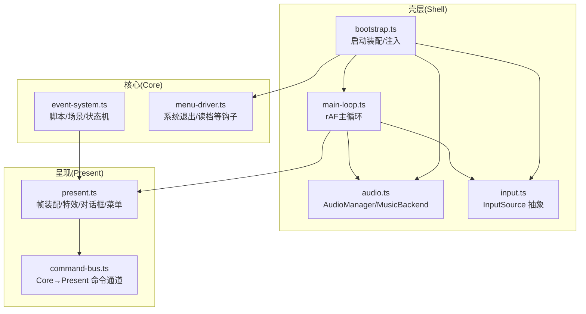
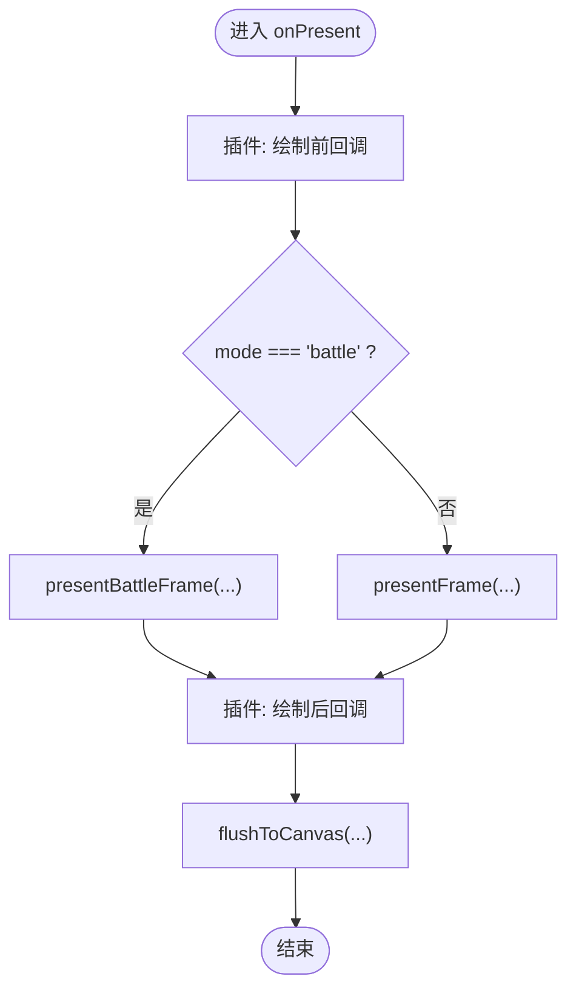
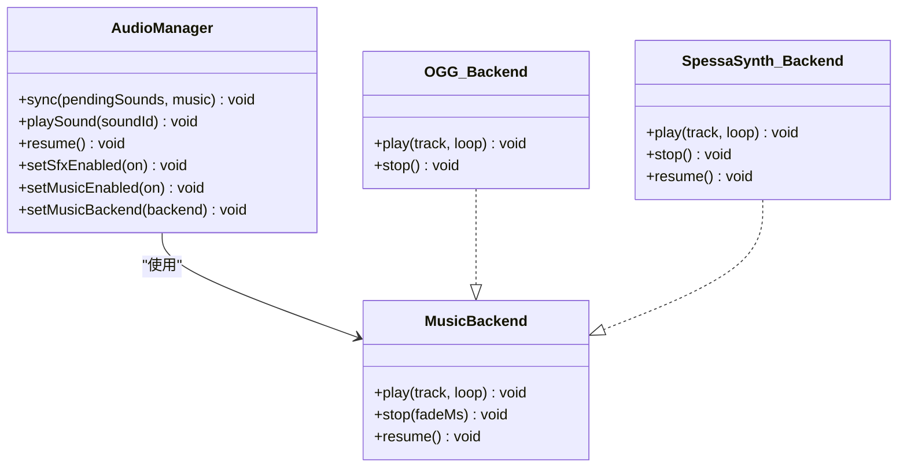
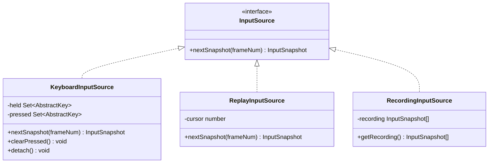
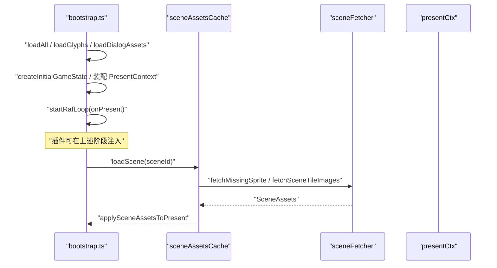
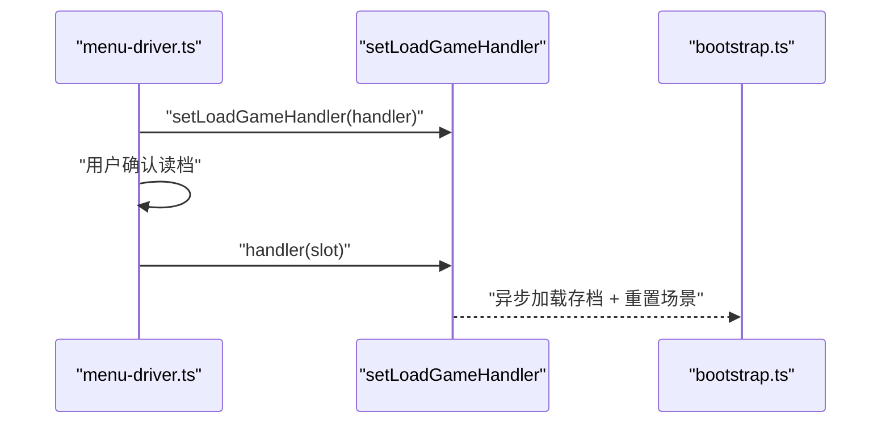
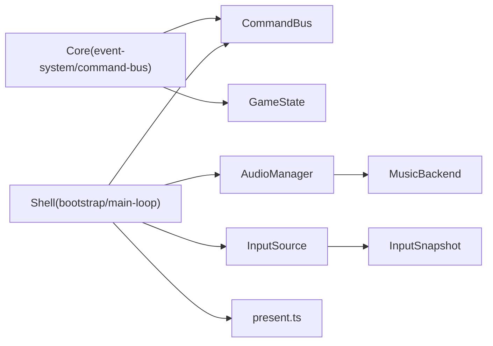

# 插件钩子系统

<cite>
**本文引用的文件**
- [packages/game/src/shell/bootstrap.ts](file://packages/game/src/shell/bootstrap.ts)
- [packages/game/src/shell/main-loop.ts](file://packages/game/src/shell/main-loop.ts)
- [packages/game/src/present/present.ts](file://packages/game/src/present/present.ts)
- [packages/game/src/core/command-bus.ts](file://packages/game/src/core/command-bus.ts)
- [packages/game/src/shell/audio.ts](file://packages/game/src/shell/audio.ts)
- [packages/game/src/shell/input.ts](file://packages/game/src/shell/input.ts)
- [packages/game/src/core/event-system.ts](file://packages/game/src/core/event-system.ts)
- [packages/game/src/core/menu/menu-driver.ts](file://packages/game/src/core/menu/menu-driver.ts)
</cite>

## 目录
1. [简介](#简介)
2. [项目结构](#项目结构)
3. [核心组件](#核心组件)
4. [架构总览](#架构总览)
5. [详细组件分析](#详细组件分析)
6. [依赖关系分析](#依赖关系分析)
7. [性能考量](#性能考量)
8. [故障排查指南](#故障排查指南)
9. [结论](#结论)
10. [附录](#附录)

## 简介
本文件面向“插件化扩展”视角，系统化梳理当前代码库中可用于外部扩展的“钩子点”，并给出可落地的开发框架与示例路径。围绕以下目标展开：
- 渲染钩子：绘制前/后回调、自定义渲染层、滤镜效果注入
- 音频扩展接口：音效拦截、音乐替换、音量控制扩展
- 输入处理扩展：按键映射重写、手势识别、设备适配
- 生命周期钩子：初始化阶段、更新循环、资源加载
- 插件开发框架与示例：第三方渲染引擎集成、自定义音频后端、高级输入处理器

说明：本文所有实现细节均基于仓库现有源码；未在当前仓库中发现显式“插件注册表”或“事件总线式钩子容器”，因此我们将以“可插拔接口 + 注入点 + 组合模式”的方式，将现有能力抽象为“插件钩子系统”。

## 项目结构
从“可被插件扩展”的角度，关键位置集中在 shell（运行时装配）、present（渲染管线）、audio（音频系统）、input（输入源）以及 core 中的命令通道与菜单驱动。



图表来源
- [packages/game/src/shell/bootstrap.ts:1-120](file://packages/game/src/shell/bootstrap.ts#L1-L120)
- [packages/game/src/shell/main-loop.ts:59-75](file://packages/game/src/shell/main-loop.ts#L59-L75)
- [packages/game/src/present/present.ts:166-210](file://packages/game/src/present/present.ts#L166-L210)
- [packages/game/src/core/command-bus.ts:1-89](file://packages/game/src/core/command-bus.ts#L1-L89)
- [packages/game/src/shell/audio.ts:1-45](file://packages/game/src/shell/audio.ts#L1-L45)
- [packages/game/src/shell/input.ts:1-65](file://packages/game/src/shell/input.ts#L1-L65)
- [packages/game/src/core/menu/menu-driver.ts:176-205](file://packages/game/src/core/menu/menu-driver.ts#L176-L205)

章节来源
- [packages/game/src/shell/bootstrap.ts:1-120](file://packages/game/src/shell/bootstrap.ts#L1-L120)
- [packages/game/src/shell/main-loop.ts:59-75](file://packages/game/src/shell/main-loop.ts#L59-L75)

## 核心组件
- 命令通道（Core → Present）：通过单向命令队列解耦逻辑与表现，便于在 present 侧进行“绘制前后”的二次处理与扩展。
- 音频管理器（AudioManager）：提供 SFX/BGM 的统一入口，支持 MusicBackend 注入，天然适合做“音效拦截/音乐替换/音量控制扩展”。
- 输入源抽象（InputSource）：键盘/回放/录制等多源统一，便于“按键映射重写/手势识别/设备适配”作为新 InputSource 接入。
- 渲染管线（presentFrame/presentBattleFrame）：按固定顺序组装图层、特效、对话框、菜单，是“绘制前/后回调/自定义渲染层/滤镜注入”的最佳插入点。
- 生命周期装配（bootstrap）：集中完成资源加载、上下文注入、主循环启动，是“初始化钩子/资源加载钩子”的天然位置。
- 菜单驱动钩子：系统退出、读档等关键流程暴露 setXxxHandler 注入点，可作为“生命周期钩子”的补充。

章节来源
- [packages/game/src/core/command-bus.ts:1-89](file://packages/game/src/core/command-bus.ts#L1-L89)
- [packages/game/src/shell/audio.ts:1-45](file://packages/game/src/shell/audio.ts#L1-L45)
- [packages/game/src/shell/input.ts:1-65](file://packages/game/src/shell/input.ts#L1-L65)
- [packages/game/src/present/present.ts:166-210](file://packages/game/src/present/present.ts#L166-L210)
- [packages/game/src/shell/bootstrap.ts:1-120](file://packages/game/src/shell/bootstrap.ts#L1-L120)
- [packages/game/src/core/menu/menu-driver.ts:176-205](file://packages/game/src/core/menu/menu-driver.ts#L176-L205)

## 架构总览
下图展示“插件钩子系统”在运行时的交互方式：shell 层在每帧对 Core 与 Present 进行桥接，插件可通过注入后端/处理器/回调来改变行为。

```mermaid
sequenceDiagram
participant Plugin as "插件"
participant Shell as "bootstrap.ts"
participant Loop as "main-loop.ts"
participant Core as "event-system.ts / command-bus.ts"
participant Audio as "audio.ts"
participant Present as "present.ts"
Plugin->>Shell : "注入 MusicBackend / InputSource / 回调"
Shell->>Loop : "startRafLoop(onPresent)"
Loop->>Core : "tickEventSystem()/drain bus"
Loop->>Audio : "sync(pendingSounds, music)"
Loop->>Present : "presentFrame()/presentBattleFrame()"
Present-->>Loop : "flushToCanvas(...)"
Note over Plugin,Present : "插件可在 onPresent 前后、MusicBackend、InputSource 等处扩展"
```

图表来源
- [packages/game/src/shell/bootstrap.ts:473-508](file://packages/game/src/shell/bootstrap.ts#L473-L508)
- [packages/game/src/shell/main-loop.ts:59-75](file://packages/game/src/shell/main-loop.ts#L59-L75)
- [packages/game/src/core/command-bus.ts:1-89](file://packages/game/src/core/command-bus.ts#L1-L89)
- [packages/game/src/shell/audio.ts:272-312](file://packages/game/src/shell/audio.ts#L272-L312)
- [packages/game/src/present/present.ts:688-695](file://packages/game/src/present/present.ts#L688-L695)

## 详细组件分析

### 渲染钩子系统
- 绘制前回调
  - 插入点：onPresent 内、调用 presentFrame/presentBattleFrame 之前。
  - 用途：读取/修改 GameState、准备额外图层、记录统计信息。
- 绘制后回调
  - 插入点：flushToCanvas 之后。
  - 用途：叠加 UI 覆盖层、截图、录屏、调试可视化。
- 自定义渲染层
  - 方案：在 onPresent 中新增独立 Canvas 或离屏 Framebuffer，由插件负责合成到最终输出。
- 滤镜效果注入
  - 方案：在 flushToCanvas 前对 ImageData 执行像素级滤镜（如 CRT、反色、锐化），或在 presentFrame 内部特效阶段（屏幕波动/震屏）追加新的 effect。



图表来源
- [packages/game/src/shell/bootstrap.ts:481-507](file://packages/game/src/shell/bootstrap.ts#L481-L507)
- [packages/game/src/present/present.ts:688-695](file://packages/game/src/present/present.ts#L688-L695)

章节来源
- [packages/game/src/shell/bootstrap.ts:473-508](file://packages/game/src/shell/bootstrap.ts#L473-L508)
- [packages/game/src/present/present.ts:166-210](file://packages/game/src/present/present.ts#L166-L210)
- [packages/game/src/present/present.ts:688-695](file://packages/game/src/present/present.ts#L688-L695)

### 音频扩展接口
- 音效拦截
  - 入口：AudioManager.playSound / sync 中的 pendingSounds 消费。
  - 扩展方式：在 AudioManager 外层包装一个代理，拦截 soundId 并改写/丢弃/重定向。
- 音乐替换
  - 入口：setMusicBackend 注入自定义 MusicBackend。
  - 扩展方式：实现自定义 play/stop/resume，例如对接第三方播放器或流媒体。
- 音量控制扩展
  - 入口：setSfxVolume / setOggVolumeScale / setBgmVolume（MIDI 后端）。
  - 扩展方式：增加全局混音器、动态压缩、频段均衡等。



图表来源
- [packages/game/src/shell/audio.ts:18-44](file://packages/game/src/shell/audio.ts#L18-L44)
- [packages/game/src/shell/audio.ts:161-190](file://packages/game/src/shell/audio.ts#L161-L190)
- [packages/game/src/shell/audio.ts:272-312](file://packages/game/src/shell/audio.ts#L272-L312)

章节来源
- [packages/game/src/shell/audio.ts:1-45](file://packages/game/src/shell/audio.ts#L1-L45)
- [packages/game/src/shell/audio.ts:161-190](file://packages/game/src/shell/audio.ts#L161-L190)
- [packages/game/src/shell/audio.ts:272-312](file://packages/game/src/shell/audio.ts#L272-L312)

### 输入处理扩展
- 按键映射重写
  - 入口：codeToAbstractKey 映射表。
  - 扩展方式：封装新的 InputSource，或在映射前加入中间层进行重写。
- 手势识别
  - 入口：新增 TouchInputSource / PointerInputSource 实现 InputSource。
  - 扩展方式：将多点触控/滑动手势转换为 AbstractKey 快照。
- 设备适配
  - 入口：不同平台下选择不同 InputSource（键盘/触屏/手柄）。
  - 扩展方式：在 bootstrap 中根据 UA/特性检测选择合适输入源。



图表来源
- [packages/game/src/shell/input.ts:1-65](file://packages/game/src/shell/input.ts#L1-L65)
- [packages/game/src/shell/input.ts:67-135](file://packages/game/src/shell/input.ts#L67-L135)
- [packages/game/src/shell/input.ts:137-164](file://packages/game/src/shell/input.ts#L137-L164)

章节来源
- [packages/game/src/shell/input.ts:1-65](file://packages/game/src/shell/input.ts#L1-L65)
- [packages/game/src/shell/input.ts:67-135](file://packages/game/src/shell/input.ts#L67-L135)
- [packages/game/src/shell/input.ts:137-164](file://packages/game/src/shell/input.ts#L137-L164)

### 生命周期钩子
- 初始化阶段
  - 入口：bootstrap 顶部并行加载 glyphs/dialog-assets/soundfont，随后装配 PresentContext、BattleAssets、CommandBus、InputSource、AudioManager。
  - 扩展方式：在 loadAll 前后插入自定义资源加载/校验步骤；在 createInitialGameState 后注入初始配置。
- 更新循环
  - 入口：startRafLoop 的 onPresent 回调。
  - 扩展方式：在 onPresent 前后挂入插件逻辑（如统计、日志、覆盖层）。
- 资源加载
  - 入口：sceneAssetsCache.loadScene 按需拉取新场景资源；tileImagesBySceneId 路由。
  - 扩展方式：在 sceneFetcher 前后注入缓存策略、降级策略、预取策略。



图表来源
- [packages/game/src/shell/bootstrap.ts:229-236](file://packages/game/src/shell/bootstrap.ts#L229-L236)
- [packages/game/src/shell/bootstrap.ts:473-508](file://packages/game/src/shell/bootstrap.ts#L473-L508)
- [packages/game/src/shell/bootstrap.ts:556-614](file://packages/game/src/shell/bootstrap.ts#L556-L614)
- [packages/game/src/shell/bootstrap.ts:641-651](file://packages/game/src/shell/bootstrap.ts#L641-L651)

章节来源
- [packages/game/src/shell/bootstrap.ts:229-236](file://packages/game/src/shell/bootstrap.ts#L229-L236)
- [packages/game/src/shell/bootstrap.ts:473-508](file://packages/game/src/shell/bootstrap.ts#L473-L508)
- [packages/game/src/shell/bootstrap.ts:556-614](file://packages/game/src/shell/bootstrap.ts#L556-L614)
- [packages/game/src/shell/bootstrap.ts:641-651](file://packages/game/src/shell/bootstrap.ts#L641-L651)

### 菜单与系统钩子
- 系统退出
  - 入口：setSystemQuitHandler。
  - 用途：保存进度、清理资源、上报埋点。
- 读档触发
  - 入口：setLoadGameHandler。
  - 用途：合并存档、迁移数据、重载场景。



图表来源
- [packages/game/src/core/menu/menu-driver.ts:176-205](file://packages/game/src/core/menu/menu-driver.ts#L176-L205)

章节来源
- [packages/game/src/core/menu/menu-driver.ts:176-205](file://packages/game/src/core/menu/menu-driver.ts#L176-L205)

## 依赖关系分析
- 松耦合设计
  - Core 不直接依赖 Web Audio/Canvas，仅通过 CommandBus 和 GameState 表达意图。
  - Shell 负责把 Core 意图落地到具体后端（AudioManager/InputSource/Present）。
- 可扩展性
  - MusicBackend 与 InputSource 均为接口，可自由替换。
  - onPresent 作为单一桥接点，便于插件在渲染前后插入逻辑。
- 潜在风险
  - 若插件在 onPresent 中执行阻塞操作，会影响 rAF 帧率。
  - 多后端切换需幂等处理（AudioManager 已内置幂等开关）。



图表来源
- [packages/game/src/core/command-bus.ts:1-89](file://packages/game/src/core/command-bus.ts#L1-L89)
- [packages/game/src/shell/audio.ts:18-44](file://packages/game/src/shell/audio.ts#L18-L44)
- [packages/game/src/shell/input.ts:1-65](file://packages/game/src/shell/input.ts#L1-L65)
- [packages/game/src/shell/bootstrap.ts:473-508](file://packages/game/src/shell/bootstrap.ts#L473-L508)

章节来源
- [packages/game/src/core/command-bus.ts:1-89](file://packages/game/src/core/command-bus.ts#L1-L89)
- [packages/game/src/shell/audio.ts:18-44](file://packages/game/src/shell/audio.ts#L18-L44)
- [packages/game/src/shell/input.ts:1-65](file://packages/game/src/shell/input.ts#L1-L65)
- [packages/game/src/shell/bootstrap.ts:473-508](file://packages/game/src/shell/bootstrap.ts#L473-L508)

## 性能考量
- 避免在 onPresent 中进行同步 I/O 或重型计算，必要时拆分到下一帧。
- 滤镜/覆盖层尽量使用离屏缓冲复用，减少分配。
- MusicBackend 切换时注意释放旧媒体资源（OGG 后端已实现 release）。
- InputSource 的 nextSnapshot 应轻量，避免频繁创建大对象。

[本节为通用指导，无需源码引用]

## 故障排查指南
- 无声音/静音
  - 检查浏览器 autoplay policy：确保在用户手势后 resume AudioContext（bootstrap 已监听 keydown/pointerdown）。
  - 检查 setSfxEnabled/setMusicEnabled 是否被关闭。
- 画面闪烁/错位
  - 确认 suspendRaf 期间不触碰 canvas（bootstrap 已 gate）。
  - 检查 fadeState/sceneLoading 标志位是否正确清置。
- 输入异常
  - 核对 codeToAbstractKey 映射是否符合预期；必要时用 ReplayInputSource 回放验证。
- 读档/退出问题
  - 检查 setLoadGameHandler/setSystemQuitHandler 是否正确注入且幂等。

章节来源
- [packages/game/src/shell/bootstrap.ts:467-470](file://packages/game/src/shell/bootstrap.ts#L467-L470)
- [packages/game/src/shell/bootstrap.ts:481-507](file://packages/game/src/shell/bootstrap.ts#L481-L507)
- [packages/game/src/shell/audio.ts:291-312](file://packages/game/src/shell/audio.ts#L291-L312)
- [packages/game/src/core/menu/menu-driver.ts:176-205](file://packages/game/src/core/menu/menu-driver.ts#L176-L205)

## 结论
通过将 shell 层的装配点、命令通道、音频后端、输入源抽象与渲染管线解耦，本项目天然具备“插件钩子系统”的基础设施。开发者可在以下位置安全扩展：
- 渲染：onPresent 前后、滤镜/覆盖层、自定义渲染层
- 音频：MusicBackend 替换、SFX 拦截、音量控制链
- 输入：自定义 InputSource、按键映射重写、手势识别
- 生命周期：bootstrap 初始化、场景资源加载、菜单系统钩子

[本节为总结，无需源码引用]

## 附录

### 插件开发框架与示例路径
- 第三方渲染引擎集成
  - 思路：在 onPresent 中获取 fb.indices 或 ImageData，交由第三方引擎渲染后再回写；或使用独立 Canvas 叠加。
  - 参考路径：
    - [packages/game/src/shell/bootstrap.ts:481-507](file://packages/game/src/shell/bootstrap.ts#L481-L507)
    - [packages/game/src/present/present.ts:688-695](file://packages/game/src/present/present.ts#L688-L695)
- 自定义音频后端
  - 思路：实现 MusicBackend 并通过 setMusicBackend 注入；如需跨端兼容，可同时保留 OGG 与 MIDI 后端。
  - 参考路径：
    - [packages/game/src/shell/audio.ts:18-44](file://packages/game/src/shell/audio.ts#L18-L44)
    - [packages/game/src/shell/audio.ts:161-190](file://packages/game/src/shell/audio.ts#L161-L190)
    - [packages/game/src/shell/audio.ts:272-312](file://packages/game/src/shell/audio.ts#L272-L312)
- 高级输入处理器
  - 思路：实现 InputSource，将触摸/手柄/鼠标手势转为 AbstractKey 快照；在 bootstrap 中替换默认输入源。
  - 参考路径：
    - [packages/game/src/shell/input.ts:1-65](file://packages/game/src/shell/input.ts#L1-L65)
    - [packages/game/src/shell/input.ts:67-135](file://packages/game/src/shell/input.ts#L67-L135)
    - [packages/game/src/shell/input.ts:137-164](file://packages/game/src/shell/input.ts#L137-L164)
- 生命周期钩子示例
  - 初始化：在 loadAll/loadGlyphs 前后注入自定义资源校验/统计。
  - 更新循环：在 onPresent 前后挂入插件逻辑。
  - 资源加载：在 sceneFetcher 前后注入缓存/预取策略。
  - 参考路径：
    - [packages/game/src/shell/bootstrap.ts:229-236](file://packages/game/src/shell/bootstrap.ts#L229-L236)
    - [packages/game/src/shell/bootstrap.ts:473-508](file://packages/game/src/shell/bootstrap.ts#L473-L508)
    - [packages/game/src/shell/bootstrap.ts:556-614](file://packages/game/src/shell/bootstrap.ts#L556-L614)
    - [packages/game/src/shell/bootstrap.ts:641-651](file://packages/game/src/shell/bootstrap.ts#L641-L651)