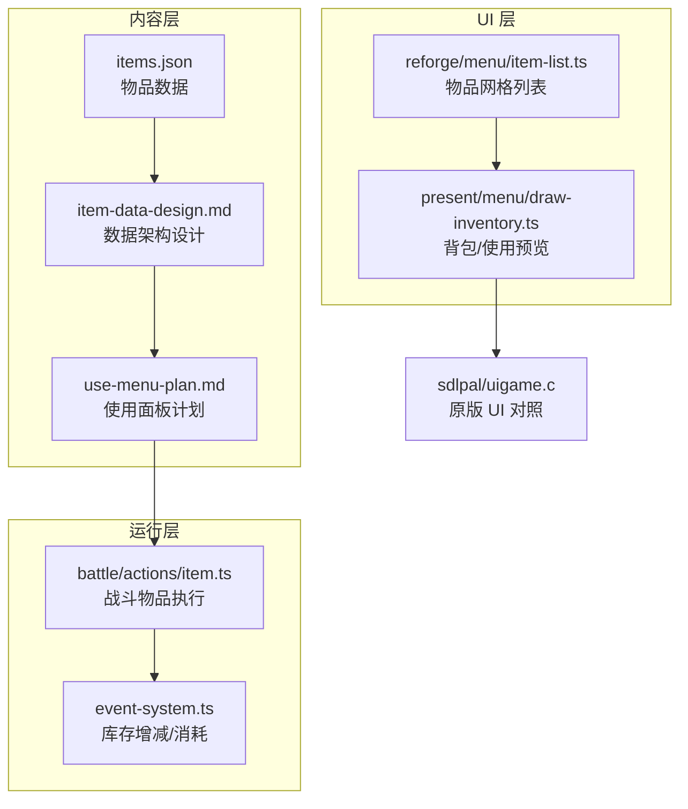
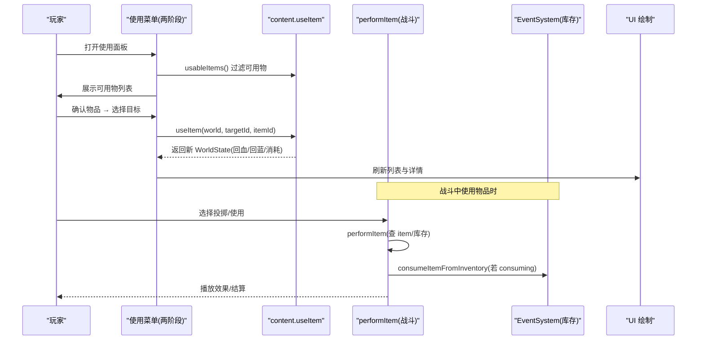
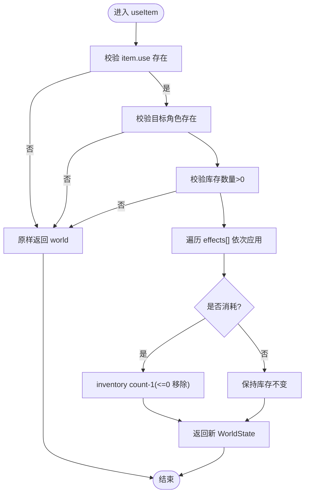
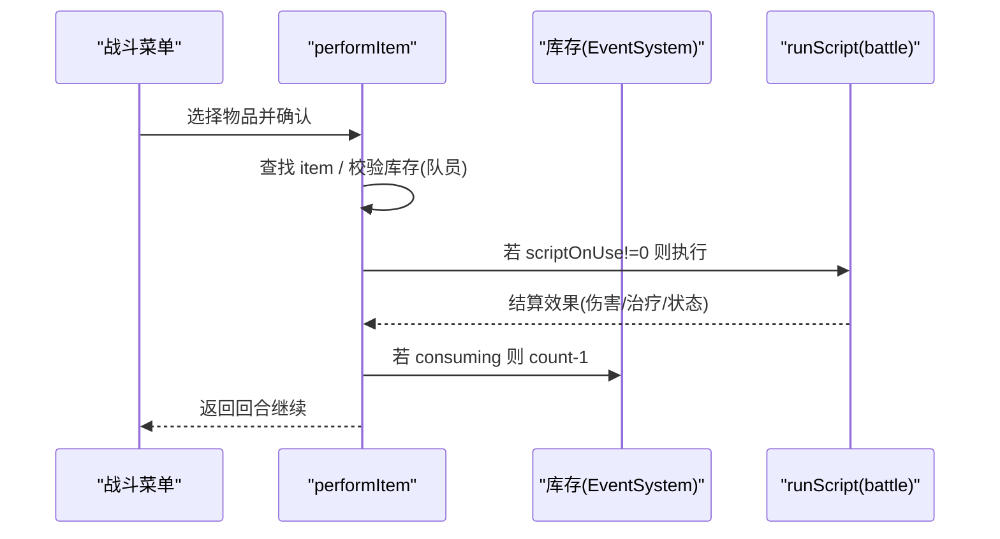
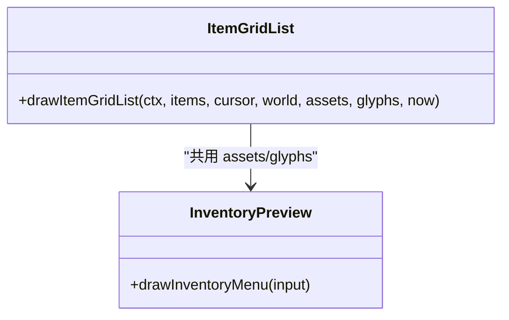
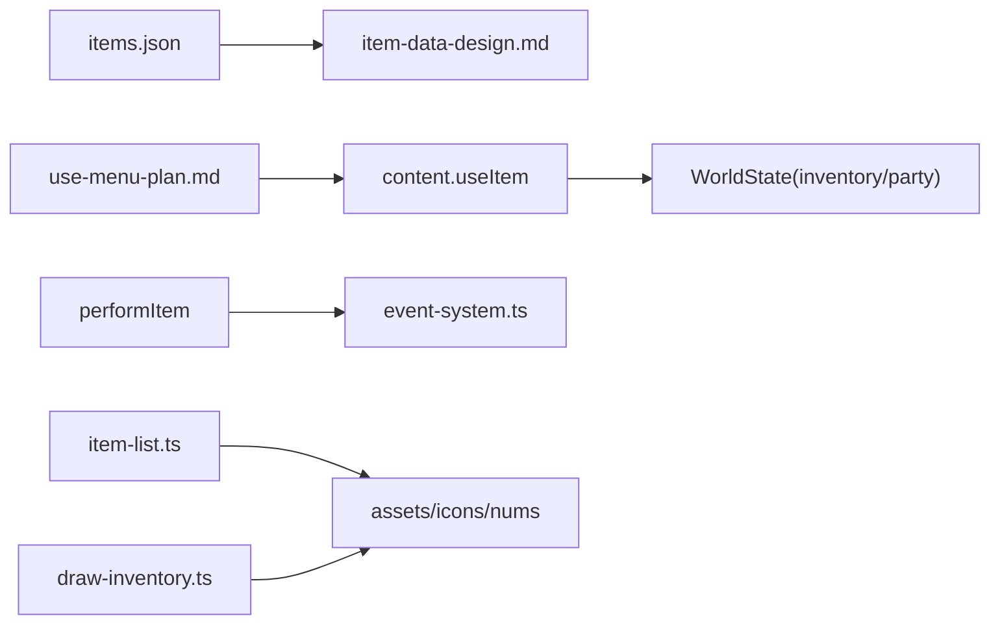

# 物品扩展接口

<cite>
**本文引用的文件**   
- [projects/demo/content/items.json](file://projects/demo/content/items.json)
- [docs/phase2/foundation/item-data-design.md](file://docs/phase2/foundation/item-data-design.md)
- [docs/phase2/menu/use-menu-plan.md](file://docs/phase2/menu/use-menu-plan.md)
- [packages/game/src/core/battle/actions/item.ts](file://packages/game/src/core/battle/actions/item.ts)
- [packages/game/src/core/event-system.ts](file://packages/game/src/core/event-system.ts)
- [packages/reforge/src/menu/item-list.ts](file://packages/reforge/src/menu/item-list.ts)
- [packages/game/src/present/menu/draw-inventory.ts](file://packages/game/src/present/menu/draw-inventory.ts)
- [reference/sdlpal/uigame.c](file://reference/sdlpal/uigame.c)
</cite>

## 目录
1. [简介](#简介)
2. [项目结构](#项目结构)
3. [核心组件](#核心组件)
4. [架构总览](#架构总览)
5. [详细组件分析](#详细组件分析)
6. [依赖分析](#依赖分析)
7. [性能考虑](#性能考虑)
8. [故障排查指南](#故障排查指南)
9. [结论](#结论)
10. [附录：新物品开发示例](#附录新物品开发示例)

## 简介
本文件面向开发者，系统化说明如何扩展游戏的“物品系统”，覆盖以下方面：
- 物品数据格式与属性配置（含装备、使用、投掷能力块）
- 使用效果实现（恢复、增益、脚本触发等）
- 战斗物品集成（伤害计算、状态应用、目标选择）
- UI 显示定制（图标、名称本地化、使用反馈界面）
- 完整的新物品开发示例（恢复类、增强类、特殊功能）

## 项目结构
围绕“物品”的关键代码与文档分布如下：
- 内容层：demo 物品数据定义、使用菜单计划、物品数据设计
- 游戏运行层：战斗物品执行、库存管理、事件系统
- 渲染/UI 层：物品列表绘制、背包预览、商店预览
- 参考实现：SDL 原版 UI 行为对照

图表来源
- [projects/demo/content/items.json:1-248](file://projects/demo/content/items.json#L1-L248)
- [docs/phase2/foundation/item-data-design.md:1-147](file://docs/phase2/foundation/item-data-design.md#L1-L147)
- [docs/phase2/menu/use-menu-plan.md:1-324](file://docs/phase2/menu/use-menu-plan.md#L1-L324)
- [packages/game/src/core/battle/actions/item.ts:1-84](file://packages/game/src/core/battle/actions/item.ts#L1-L84)
- [packages/game/src/core/event-system.ts:3255-3283](file://packages/game/src/core/event-system.ts#L3255-L3283)
- [packages/reforge/src/menu/item-list.ts:9-88](file://packages/reforge/src/menu/item-list.ts#L9-L88)
- [packages/game/src/present/menu/draw-inventory.ts:1-323](file://packages/game/src/present/menu/draw-inventory.ts#L1-L323)
- [reference/sdlpal/uigame.c:1527-1582](file://reference/sdlpal/uigame.c#L1527-L1582)

章节来源
- [docs/phase2/foundation/item-data-design.md:1-147](file://docs/phase2/foundation/item-data-design.md#L1-L147)
- [docs/phase2/menu/use-menu-plan.md:1-324](file://docs/phase2/menu/use-menu-plan.md#L1-L324)

## 核心组件
- 物品数据模型 ItemData
  - 基础字段：id、name、desc、icon、buyPrice、sellPrice、sellable
  - 能力块（可叠加）：equip?、use?、throw?
- 装备能力 EquipSpec + EquipEffect
  - slot 六槽：weapon/head/body/cloak/feet/accessory
  - effects 支持 statBonus、resistance、maxPool、grantStatus、grantSkill、attackAll 等
- 使用能力 UseSpec + ItemUseEffect
  - target、consuming、effects[]；本期实现 healHp/healMp，其余 kind 留桩
- 战斗物品执行 performItem
  - 查找 item → 检查库存 → 跑 scriptOnUse → 按 consuming 扣库存
- 库存操作 addItemToInventory / consumeItemFromInventory
  - qty=0→1、上限 99、负数归零移除

章节来源
- [docs/phase2/foundation/item-data-design.md:27-115](file://docs/phase2/foundation/item-data-design.md#L27-L115)
- [docs/phase2/menu/use-menu-plan.md:30-179](file://docs/phase2/menu/use-menu-plan.md#L30-L179)
- [packages/game/src/core/battle/actions/item.ts:1-84](file://packages/game/src/core/battle/actions/item.ts#L1-L84)
- [packages/game/src/core/event-system.ts:3255-3283](file://packages/game/src/core/event-system.ts#L3255-L3283)

## 架构总览
从“数据定义 → 世界操作 → 菜单交互 → 战斗执行 → UI 呈现”的端到端流程如下：

图表来源
- [docs/phase2/menu/use-menu-plan.md:183-298](file://docs/phase2/menu/use-menu-plan.md#L183-L298)
- [packages/game/src/core/battle/actions/item.ts:1-84](file://packages/game/src/core/battle/actions/item.ts#L1-L84)
- [packages/game/src/core/event-system.ts:3255-3283](file://packages/game/src/core/event-system.ts#L3255-L3283)
- [packages/reforge/src/menu/item-list.ts:9-88](file://packages/reforge/src/menu/item-list.ts#L9-L88)

## 详细组件分析

### 物品数据格式与属性配置
- 基础字段
  - id：不透明字符串（demo 沿用原版 oid）
  - name/desc：名称与多行描述
  - icon：图标位图索引（由资源烘焙映射）
  - buyPrice/sellPrice/sellable：买卖相关
- 能力块
  - equip：装备能力（slot/equipableBy/effects[]）
  - use：使用能力（target/consuming/effects[]）
  - throw：战斗投掷（phase3 细化）
- 示例数据
  - 观音符：healHp 150，可消耗
  - 茶叶蛋：healHp+healMp 各 15，可消耗
  - 木剑/头巾/布袍/披风/草鞋/护腕：statBonus 加攻防速等
  - 土灵珠：双重身份（装备 grantSkill/resistance + 使用 triggerScript）

章节来源
- [projects/demo/content/items.json:1-248](file://projects/demo/content/items.json#L1-L248)
- [docs/phase2/foundation/item-data-design.md:27-115](file://docs/phase2/foundation/item-data-design.md#L27-L115)

### 使用效果实现（大世界）
- 可用列表：usableItems(world) 仅列出具备 use 能力块的物品
- 施用逻辑：useItem(world, targetCharId, itemId)
  - 校验 item.use 存在、目标角色存在、库存数量 > 0
  - 顺序执行 effects[]：
    - healHp/healMp：对目标 HP/MP 增加并夹上限
    - 其他 kind（applyStatus/triggerScript/teleport）：留桩
  - 若 consuming=true：对应 inventory 条目 count-1，为 0 则移除
- 不可变更新：返回新的 WorldState

图表来源
- [docs/phase2/menu/use-menu-plan.md:118-179](file://docs/phase2/menu/use-menu-plan.md#L118-L179)

章节来源
- [docs/phase2/menu/use-menu-plan.md:30-179](file://docs/phase2/menu/use-menu-plan.md#L30-L179)

### 战斗物品集成
- 执行入口 performItem
  - 查找 item；队员 cast 需检查库存；敌人 cast 不扣库存
  - 若 item.scriptOnUse != 0，则在 battle 模式下 runScript
  - 队员 cast 且 item.flags.consuming：脚本后 inventory count-1
- 目标选择与重选
  - 当目标敌方已死时，自动重选活敌（攻击/法术/投掷/合击）
  - 全体目标态直接提交，无需等待选择
- 库存消费
  - 通过 consumeItemFromInventory 调用统一库存加减逻辑

图表来源
- [packages/game/src/core/battle/actions/item.ts:1-84](file://packages/game/src/core/battle/actions/item.ts#L1-L84)
- [packages/game/src/core/event-system.ts:3255-3283](file://packages/game/src/core/event-system.ts#L3255-L3283)

章节来源
- [packages/game/src/core/battle/actions/item.ts:1-84](file://packages/game/src/core/battle/actions/item.ts#L1-L84)
- [packages/game/src/core/event-system.ts:3255-3283](file://packages/game/src/core/event-system.ts#L3255-L3283)

### UI 显示定制
- 物品网格列表
  - 3 列网格布局，显示名称、数量（>1）、选中光标
  - 底部 itembox + 图标 + 多行描述
- 背包/使用预览
  - 选中项的 ITEMBOX 精灵 + BALL 图标偏移 (8,7)
  - 实时读取库存数量，避免“用后仍显旧数量”
- 颜色规则
  - 非选中/不可用、选中闪烁、穿戴中绿色等，对齐 sdlpal 真值

图表来源
- [packages/reforge/src/menu/item-list.ts:9-88](file://packages/reforge/src/menu/item-list.ts#L9-L88)
- [packages/game/src/present/menu/draw-inventory.ts:1-323](file://packages/game/src/present/menu/draw-inventory.ts#L1-L323)
- [reference/sdlpal/uigame.c:1527-1582](file://reference/sdlpal/uigame.c#L1527-L1582)

章节来源
- [packages/reforge/src/menu/item-list.ts:9-88](file://packages/reforge/src/menu/item-list.ts#L9-L88)
- [packages/game/src/present/menu/draw-inventory.ts:1-323](file://packages/game/src/present/menu/draw-inventory.ts#L1-L323)
- [reference/sdlpal/uigame.c:1527-1582](file://reference/sdlpal/uigame.c#L1527-L1582)

## 依赖分析
- 内容层到运行层
  - items.json → item-data-design.md 的 schema 约定
  - use-menu-plan.md 驱动 content.useItem 与 reforge 菜单状态机
- 运行层内部
  - performItem 依赖 event-system 的库存操作
- UI 层
  - 列表与预览均依赖 assets（图标、数字、光标）与 glyphs（字体）

图表来源
- [projects/demo/content/items.json:1-248](file://projects/demo/content/items.json#L1-L248)
- [docs/phase2/foundation/item-data-design.md:1-147](file://docs/phase2/foundation/item-data-design.md#L1-L147)
- [docs/phase2/menu/use-menu-plan.md:1-324](file://docs/phase2/menu/use-menu-plan.md#L1-L324)
- [packages/game/src/core/battle/actions/item.ts:1-84](file://packages/game/src/core/battle/actions/item.ts#L1-L84)
- [packages/game/src/core/event-system.ts:3255-3283](file://packages/game/src/core/event-system.ts#L3255-L3283)
- [packages/reforge/src/menu/item-list.ts:9-88](file://packages/reforge/src/menu/item-list.ts#L9-L88)
- [packages/game/src/present/menu/draw-inventory.ts:1-323](file://packages/game/src/present/menu/draw-inventory.ts#L1-L323)

章节来源
- [docs/phase2/foundation/item-data-design.md:1-147](file://docs/phase2/foundation/item-data-design.md#L1-L147)
- [docs/phase2/menu/use-menu-plan.md:1-324](file://docs/phase2/menu/use-menu-plan.md#L1-L324)

## 性能考虑
- 列表过滤与渲染
  - usableItems 仅扫描 inventory 一次，避免重复查询
  - 列表渲染按需绘制数量与光标，减少多余 draw 调用
- 库存操作
  - addItemToInventory 内聚计数与边界处理，避免多处分支
- 战斗执行
  - performItem 先查库存再执行脚本，失败早退，减少无效开销

[本节为通用指导，不涉及具体文件分析]

## 故障排查指南
- 使用物品无效果
  - 检查 item.use.effects 是否包含已实现 kind（如 healHp/healMp）
  - 确认目标角色存在且库存数量 > 0
- 使用后数量未减少
  - 确认 item.use.consuming = true
  - 核对 consumeItemFromInventory 是否被调用（战斗路径）
- 图标或名称不显示
  - 确认 items.json 的 icon 索引已在资源烘焙中映射
  - 检查 UI 层 assets.itemIcons 与 glyphs 是否正确注入

章节来源
- [docs/phase2/menu/use-menu-plan.md:118-179](file://docs/phase2/menu/use-menu-plan.md#L118-L179)
- [packages/game/src/core/battle/actions/item.ts:1-84](file://packages/game/src/core/battle/actions/item.ts#L1-L84)
- [packages/game/src/core/event-system.ts:3255-3283](file://packages/game/src/core/event-system.ts#L3255-L3283)
- [packages/reforge/src/menu/item-list.ts:9-88](file://packages/reforge/src/menu/item-list.ts#L9-L88)
- [packages/game/src/present/menu/draw-inventory.ts:1-323](file://packages/game/src/present/menu/draw-inventory.ts#L1-L323)

## 结论
通过“一物多能力块”的数据模型与“内容/运行/UI 分层”的实现方式，新增物品只需在 items.json 中声明能力块与效果，即可在大世界使用菜单与战斗系统中无缝生效。配合明确的 UI 规范与库存操作，开发者可快速扩展恢复、增强与特殊功能类物品。

[本节为总结性内容，不涉及具体文件分析]

## 附录：新物品开发示例

### 恢复类物品（例如“金创药”）
- 数据要点
  - use.target = 'oneAlly'
  - use.consuming = true
  - effects = [{ kind: 'healHp', amount: N }]
- 预期行为
  - 使用菜单可见；选择己方目标后 HP 增加并夹上限；库存 -1

章节来源
- [docs/phase2/menu/use-menu-plan.md:30-179](file://docs/phase2/menu/use-menu-plan.md#L30-L179)
- [projects/demo/content/items.json:1-248](file://projects/demo/content/items.json#L1-L248)

### 增强类物品（例如“铁锁衣”风格）
- 数据要点
  - equip.slot = 'body'
  - equip.equipableBy = ['li-xiaoyao']
  - equip.effects = [{ kind: 'statBonus', stat: 'defense', delta: -10 }]
- 预期行为
  - 装备后有效属性下降；状态板即时反映

章节来源
- [docs/phase2/foundation/item-data-design.md:45-95](file://docs/phase2/foundation/item-data-design.md#L45-L95)
- [projects/demo/content/items.json:1-248](file://projects/demo/content/items.json#L1-L248)

### 特殊功能物品（例如“引路蜂”）
- 数据要点
  - use.target = 'scene'
  - use.consuming = false
  - effects = [{ kind: 'triggerScript', scriptId: 'xxx' }]
- 预期行为
  - 使用菜单可见；触发剧情/场景跳转（当前为桩）

章节来源
- [docs/phase2/foundation/item-data-design.md:98-115](file://docs/phase2/foundation/item-data-design.md#L98-L115)
- [projects/demo/content/items.json:1-248](file://projects/demo/content/items.json#L1-L248)

### 战斗投掷物品（例如“飞刀”）
- 数据要点
  - throw 能力块（phase3 细化）
  - 战斗菜单出现“投掷”选项
- 预期行为
  - 选择目标后执行脚本/效果；若 consuming 则扣库存

章节来源
- [docs/phase2/foundation/item-data-design.md:98-115](file://docs/phase2/foundation/item-data-design.md#L98-L115)
- [packages/game/src/core/battle/actions/item.ts:1-84](file://packages/game/src/core/battle/actions/item.ts#L1-L84)