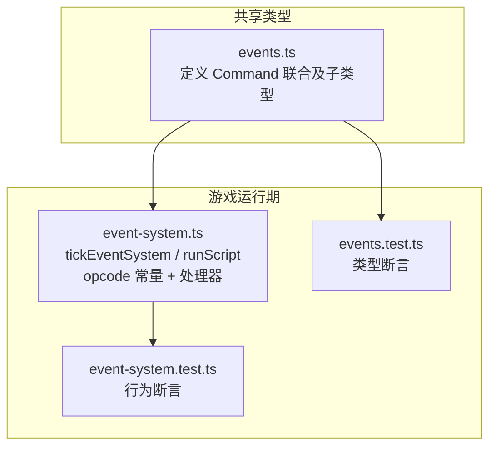
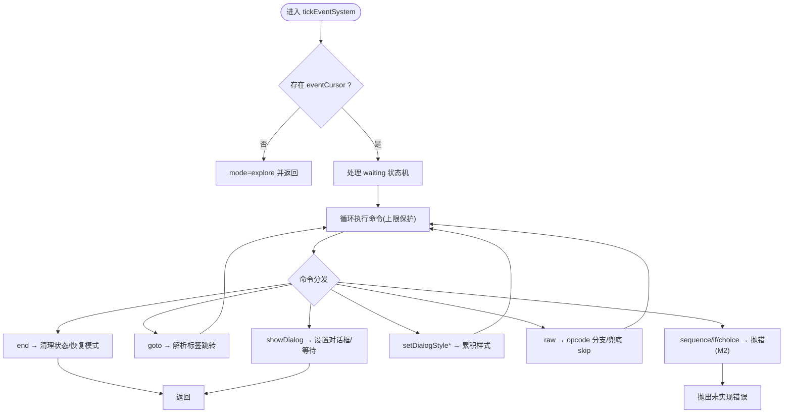
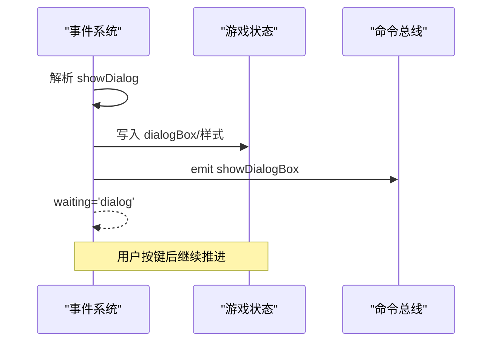
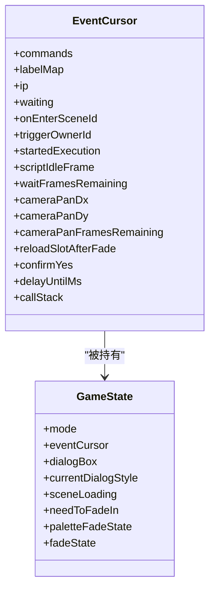
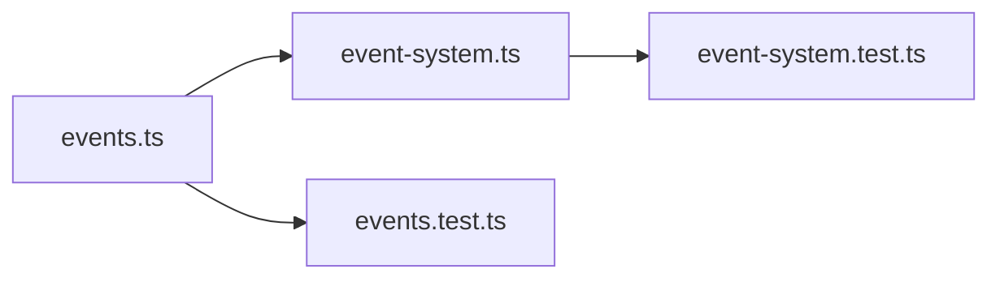

# 事件命令类型

<cite>
**本文引用的文件**   
- [packages/shared/src/events.ts](file://packages/shared/src/events.ts)
- [packages/game/src/core/event-system.ts](file://packages/game/src/core/event-system.ts)
- [packages/game/src/core/event-system.test.ts](file://packages/game/src/core/event-system.test.ts)
- [packages/shared/src/events.test.ts](file://packages/shared/src/events.test.ts)
</cite>

## 目录
1. [简介](#简介)
2. [项目结构](#项目结构)
3. [核心组件](#核心组件)
4. [架构总览](#架构总览)
5. [详细组件分析](#详细组件分析)
6. [依赖关系分析](#依赖关系分析)
7. [性能与执行特性](#性能与执行特性)
8. [调试与错误处理](#调试与错误处理)
9. [结论](#结论)
10. [附录：复杂脚本示例与最佳实践](#附录复杂脚本示例与最佳实践)

## 简介
本文件为“事件命令系统”的完整类型参考，聚焦于 EventCommand 联合类型及其所有具名命令。内容覆盖：
- 对话命令、条件判断、变量操作、场景切换等命令的参数格式、执行逻辑与返回值
- 命令链的嵌套结构与执行顺序
- 复杂事件脚本的组合方式与编写建议
- 调试与错误处理的最佳实践

说明：当前仓库中未定义名为 EventCommand 的枚举；事件命令以 TypeScript 联合类型 Command 表达，并通过 op 字面量区分具体命令。

## 项目结构
事件命令的类型定义位于 shared 包，运行时解释器位于 game 包的 event-system 模块。测试用例同时覆盖类型与行为。

图表来源
- [packages/shared/src/events.ts:1-193](file://packages/shared/src/events.ts#L1-L193)
- [packages/game/src/core/event-system.ts:1496-2399](file://packages/game/src/core/event-system.ts#L1496-L2399)
- [packages/game/src/core/event-system.test.ts:1463-1574](file://packages/game/src/core/event-system.test.ts#L1463-L1574)
- [packages/shared/src/events.test.ts:1-45](file://packages/shared/src/events.test.ts#L1-L45)

章节来源
- [packages/shared/src/events.ts:1-193](file://packages/shared/src/events.ts#L1-L193)
- [packages/game/src/core/event-system.ts:1496-2399](file://packages/game/src/core/event-system.ts#L1496-L2399)

## 核心组件
- 命令类型集合（Command）：包含 raw、end、goto、showDialog、giveItem、startBattle、loadScene、setPalette、setDialogStyle*、sequence、if、choice 等。
- 对话框样式（DialogBoxStyle）：top、center、bottom、narration、item-box。
- 事件片段（EventSegment）与事件文件（EventFile）：描述入口与命令序列。
- 运行时解释器：tickEventSystem（异步步进）、runScript（同步执行）。

章节来源
- [packages/shared/src/events.ts:162-193](file://packages/shared/src/events.ts#L162-L193)
- [packages/shared/src/events.ts:31-48](file://packages/shared/src/events.ts#L31-L48)
- [packages/game/src/core/event-system.ts:1496-2399](file://packages/game/src/core/event-system.ts#L1496-L2399)

## 架构总览
事件系统采用“协程式步进器”模型：单 tick 内连续执行非阻塞命令，遇到等待型命令或结束/越界时返回，下一帧继续。结构化命令（sequence/if/choice）在 M2 阶段抛错提示未实现，后续扩展。

图表来源
- [packages/game/src/core/event-system.ts:1496-2399](file://packages/game/src/core/event-system.ts#L1496-L2399)

章节来源
- [packages/game/src/core/event-system.ts:1496-2399](file://packages/game/src/core/event-system.ts#L1496-L2399)

## 详细组件分析

### 命令类型与参数格式
以下为各命令的关键字段与语义摘要（不展示代码内容，仅给出路径引用）：
- RawCommand：op='raw'，携带 opcode 与三元组 operands，label 可选。用于兼容原始字节码。
- EndCommand：op='end'，支持 advance/reset/resetTo/idleFrames 控制流程持久化与复位。
- GotoCommand：op='goto'，to 为目标标签（可带 shared# 前缀），frameDelay 可选。
- ShowDialogCommand：op='showDialog'，box 可选样式，messageIndex 与 text 必填。
- GiveItemCommand：op='giveItem'，itemId、count 必填，_item 可读标注。
- StartBattleCommand：op='startBattle'，enemyTeamId 必填，operands 透传，_enemyTeam 可读标注。
- LoadSceneCommand：op='loadScene'，sceneId 必填，_scene 可读标注。
- SetPaletteCommand：op='setPalette'，paletteIndex 必填。
- SetDialogStyleTop/Center/Bottom/NarrationCommand：op 分别为 setDialogStyleTop/Center/Bottom/Narration，arg0/1/2 保留 round-trip。
- SequenceCommand：op='sequence'，steps 为子命令数组。
- IfCommand：op='if'，cond 为条件命令，then/else 为命令数组。
- ChoiceCommand：op='choice'，prompt 文本，options 列表含 then 分支。

章节来源
- [packages/shared/src/events.ts:6-178](file://packages/shared/src/events.ts#L6-L178)

### 执行逻辑与返回值
- tickEventSystem：按 waiting 状态机推进，逐条执行命令；遇到等待型命令（如对话框、淡入淡出、场景加载、商店菜单、RNG/FBP 播放、延时、按键等待等）则挂起等待，下一帧继续。
- runScript：同步执行一段命令，不改变全局 mode/dialogBox/party/scene，主要用于 item/scriptOnUse 等上下文。
- 结构化命令（sequence/if/choice）：M2 阶段直接抛错，提示未实现。

章节来源
- [packages/game/src/core/event-system.ts:1496-2399](file://packages/game/src/core/event-system.ts#L1496-L2399)
- [packages/game/src/core/event-system.ts:2899-2943](file://packages/game/src/core/event-system.ts#L2899-L2943)

### 关键命令详解

#### 对话命令（showDialog 与 setDialogStyle*）
- showDialog：根据当前对话框样式追加一行文本；若达到翻页阈值则等待用户确认；narration/item-box 样式具备自动消失计时。
- setDialogStyleTop/Center/Bottom/Narration：设置对话框位置、头像、字体颜色；若已有可见对话内容，会先等待用户确认后应用新样式。

图表来源
- [packages/game/src/core/event-system.ts:2047-2148](file://packages/game/src/core/event-system.ts#L2047-L2148)
- [packages/game/src/core/event-system.ts:2150-2180](file://packages/game/src/core/event-system.ts#L2150-L2180)

章节来源
- [packages/game/src/core/event-system.ts:2047-2180](file://packages/game/src/core/event-system.ts#L2047-L2180)

#### 条件判断与选择（if/choice）
- if：包含 cond 条件命令与 then/else 分支命令数组。
- choice：提供 prompt 与多个选项，每个选项对应一个 then 分支。
- 注意：M2 阶段这些结构化命令尚未实现，执行时会抛错。

章节来源
- [packages/shared/src/events.ts:128-148](file://packages/shared/src/events.ts#L128-L148)
- [packages/game/src/core/event-system.ts:2873-2882](file://packages/game/src/core/event-system.ts#L2873-L2882)

#### 变量与数据操作（raw 与相关 opcode）
- raw：通用原始指令，通过 opcode 与 operands 指定行为。
- 常见 opcode（部分）：
  - OP_START_BATTLE：开启战斗，保存战后接回点。
  - OP_SET_PARTY_POS：设置队伍位置。
  - OP_PLAY_MUSIC / OP_STOP_MUSIC：背景音乐控制。
  - OP_ADD_CASH / OP_ADD_ITEM / OP_REMOVE_ITEM：金钱与物品操作。
  - OP_SHAKE_SCREEN：屏幕震动。
  - OP_TELEPORT_OUT：离开场景。
  - OP_WAIT_FRAMES：等待 N 帧。
  - OP_FADE_SCREEN / OP_PALETTE_FADE / OP_SCENE_FADE：各类淡入淡出。
  - OP_LOAD_LAST_SAVE / OP_QUIT：读档与退出。
  - OP_GOTO_IF_NO：弹出确认框并根据选择跳转。
  - OP_CALL_SCRIPT：调用子脚本（call/return 机制）。
  - 其他移动、方向、姿态、特效等大量 opcode。

章节来源
- [packages/game/src/core/event-system.ts:63-450](file://packages/game/src/core/event-system.ts#L63-L450)
- [packages/game/src/core/event-system.ts:2182-2399](file://packages/game/src/core/event-system.ts#L2182-L2399)

#### 场景切换（loadScene）
- loadScene：触发异步场景加载，期间 cursor.waiting='scene-load'，完成后由注入的回调替换 eventCursor 到新场景 onEnterLabel 的 ip，继续执行。

章节来源
- [packages/game/src/core/event-system.ts:673-704](file://packages/game/src/core/event-system.ts#L673-L704)
- [packages/game/src/core/event-system.ts:1594-1600](file://packages/game/src/core/event-system.ts#L1594-L1600)

#### 调色板切换（setPalette）
- setPalette：更新 gs.palette，渲染层下一帧使用新调色板。

章节来源
- [packages/shared/src/events.ts:150-160](file://packages/shared/src/events.ts#L150-L160)
- [packages/game/src/core/event-system.ts:535-558](file://packages/game/src/core/event-system.ts#L535-L558)

### 命令链的嵌套结构与执行顺序
- 主循环：tickEventSystem 内部 while(true) 循环，SINGLE_TICK_LIMIT 防死循环。
- 等待型命令：将 cursor.waiting 设为特定状态（如 'dialog'、'fade-screen'、'scene-load'、'shop'、'rng-play'、'show-fbp'、'scroll-fbp'、'ending-anim'、'wait-key'、'confirm'、'delay'、'camera-pan'、'frame-wait'、'palette-fade'、'scene-fade'），并在顶部分支处理释放条件后继续推进。
- 跳转与子脚本：goto 基于 labelMap 解析目标 ip；OP_CALL_SCRIPT 维护 callStack 实现多层调用与返回。

图表来源
- [packages/game/src/core/event-system.ts:1496-2399](file://packages/game/src/core/event-system.ts#L1496-L2399)

章节来源
- [packages/game/src/core/event-system.ts:1496-2399](file://packages/game/src/core/event-system.ts#L1496-L2399)

## 依赖关系分析
- 类型定义（events.ts）被运行时（event-system.ts）导入，确保命令结构一致。
- 运行时依赖输入快照（InputSnapshot）、命令总线（CommandBus）、游戏状态（GameState）等。
- 测试文件验证类型与行为一致性。

图表来源
- [packages/shared/src/events.ts:1-193](file://packages/shared/src/events.ts#L1-L193)
- [packages/game/src/core/event-system.ts:1-120](file://packages/game/src/core/event-system.ts#L1-L120)
- [packages/game/src/core/event-system.test.ts:1463-1574](file://packages/game/src/core/event-system.test.ts#L1463-L1574)
- [packages/shared/src/events.test.ts:1-45](file://packages/shared/src/events.test.ts#L1-L45)

章节来源
- [packages/shared/src/events.ts:1-193](file://packages/shared/src/events.ts#L1-L193)
- [packages/game/src/core/event-system.ts:1-120](file://packages/game/src/core/event-system.ts#L1-L120)

## 性能与执行特性
- 单 tick 指令上限：SINGLE_TICK_LIMIT = 256，防止 goto 自指或 raw 链导致的死循环。
- 等待型命令避免阻塞主循环：通过 waiting 状态机与时间/按键驱动，保证交互流畅。
- 自动脚本（autoScript）每帧推进一条指令，遵循 sdlpal 真值，避免 owner 对象在首 tick 间隙被覆盖。

章节来源
- [packages/game/src/core/event-system.ts:493-500](file://packages/game/src/core/event-system.ts#L493-L500)
- [packages/game/src/core/event-system.ts:1242-1285](file://packages/game/src/core/event-system.ts#L1242-L1285)

## 调试与错误处理
- 结构化命令未实现：sequence/if/choice 在 M2 阶段抛错，便于快速发现未实现路径。
- 未知命令：default 分支抛出 unhandled op 错误，帮助定位缺失 handler。
- 越界保护：ip 越界时记录警告并安全退出，恢复 explore/menu 模式。
- 日志输出：raw 命令跳过时打印 opcode 与 operands，battle 模式下带前缀方便 grep。

章节来源
- [packages/game/src/core/event-system.ts:2873-2882](file://packages/game/src/core/event-system.ts#L2873-L2882)
- [packages/game/src/core/event-system.ts:1840-1859](file://packages/game/src/core/event-system.ts#L1840-L1859)
- [packages/game/src/core/event-system.test.ts:920-942](file://packages/game/src/core/event-system.test.ts#L920-L942)

## 结论
事件命令系统通过联合类型与运行时解释器协同工作，实现了对话、跳转、资源与场景控制等核心能力。M2 阶段对结构化命令暂不支持，但已预留接口与错误提示，便于后续扩展。完善的等待状态机与上限保护确保了系统的稳定性与可调试性。

## 附录：复杂脚本示例与最佳实践

### 复杂脚本组合示例（概念性）
- 开场对话 → 设置对话框样式 → 显示多行文本 → 等待用户确认 → 条件判断（基于库存/状态）→ 分支执行不同剧情 → 切换场景 → 播放 RNG/FBP 动画 → 结束。
- 注意：sequence/if/choice 在 M2 阶段不可用，需通过 goto 与 raw 条件跳转（如 JUMP_IF_*）模拟分支。

[本节为概念性说明，不直接分析具体文件]

### 编写建议
- 合理使用 setDialogStyle* 与 showDialog 组合，确保对话样式与立绘正确。
- 使用 goto 的 frameDelay 控制循环步调，避免无限循环。
- 在需要阻塞的场景（商店、RNG/FBP、淡入淡出）利用 waiting 状态机，不要强行推进 ip。
- 谨慎使用 raw 命令，尽量通过具名命令提升可读性与可维护性。

[本节为概念性说明，不直接分析具体文件]