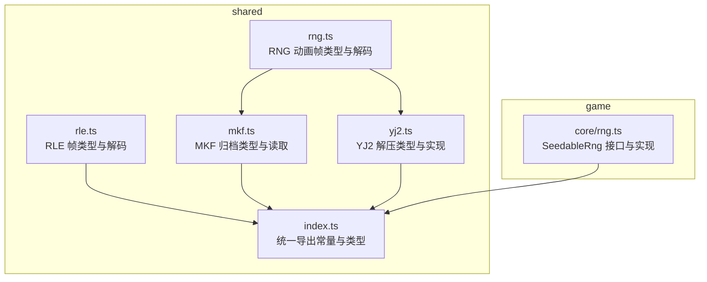
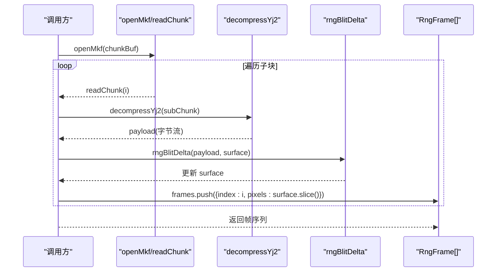
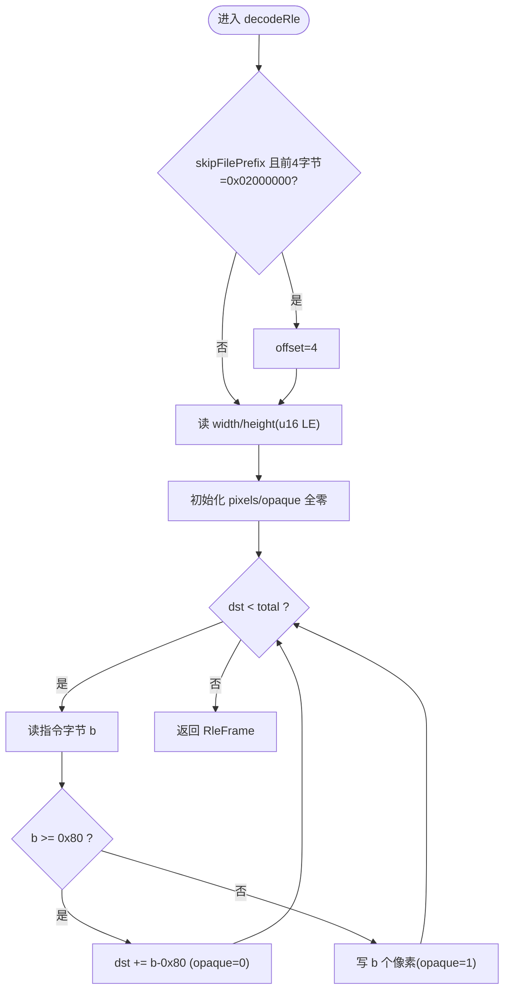
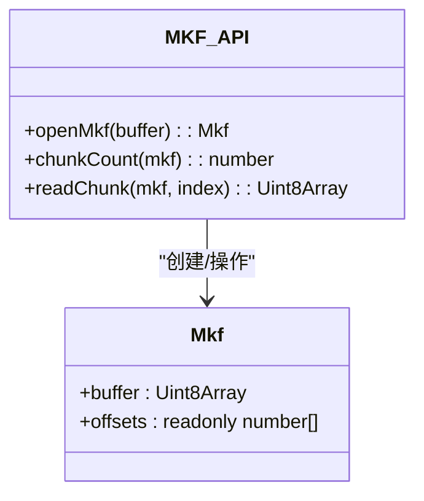
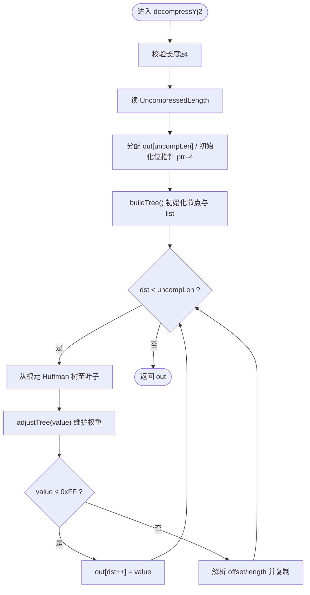
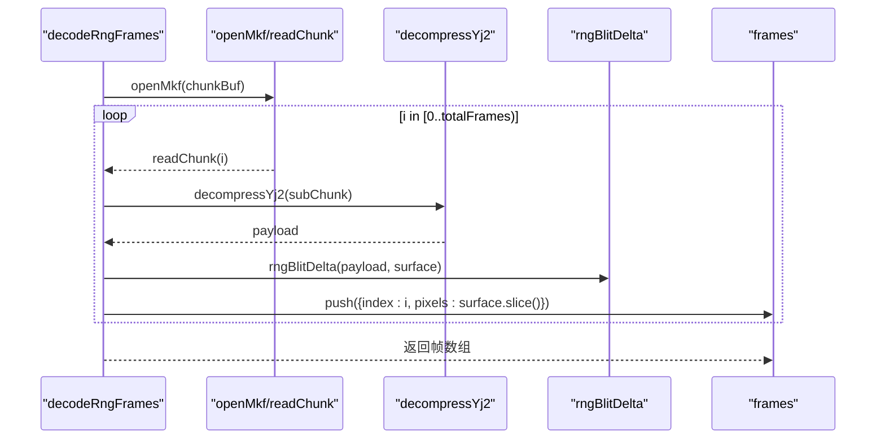
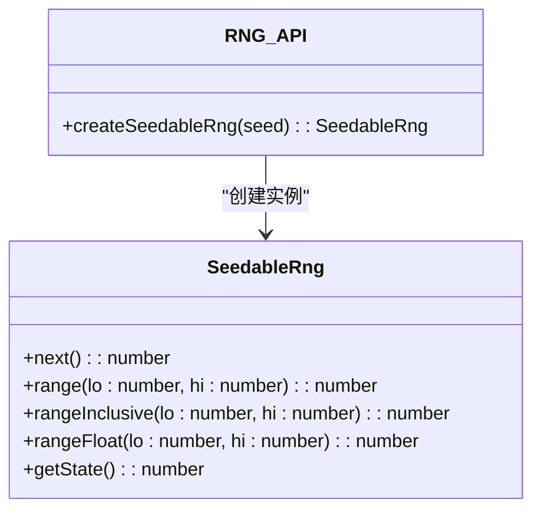
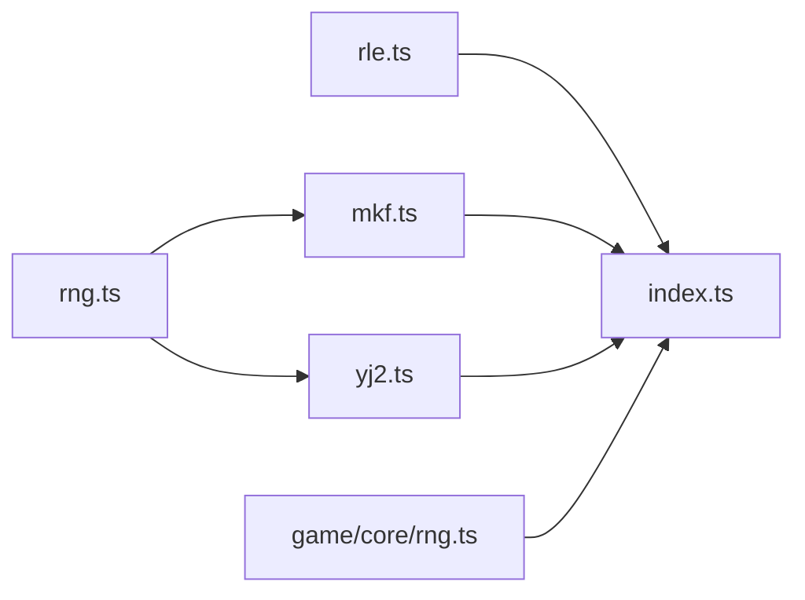

# 工具类型

<cite>
**本文引用的文件**   
- [packages/shared/src/rle.ts](file://packages/shared/src/rle.ts)
- [packages/shared/src/mkf.ts](file://packages/shared/src/mkf.ts)
- [packages/shared/src/yj2.ts](file://packages/shared/src/yj2.ts)
- [packages/shared/src/rng.ts](file://packages/shared/src/rng.ts)
- [packages/game/src/core/rng.ts](file://packages/game/src/core/rng.ts)
- [packages/shared/src/index.ts](file://packages/shared/src/index.ts)
- [reference/sdlpal/palcommon.c](file://reference/sdlpal/palcommon.c)
- [reference/sdlpal/yj1.c](file://reference/sdlpal/yj1.c)
</cite>

## 目录
1. [简介](#简介)
2. [项目结构](#项目结构)
3. [核心组件](#核心组件)
4. [架构总览](#架构总览)
5. [详细组件分析](#详细组件分析)
6. [依赖关系分析](#依赖关系分析)
7. [性能考量](#性能考量)
8. [故障排查指南](#故障排查指南)
9. [结论](#结论)
10. [附录：使用示例与最佳实践](#附录使用示例与最佳实践)

## 简介
本文件聚焦于工具类与算法的类型定义文档，覆盖以下模块的接口、数据流与错误约定：
- RLE 压缩/解压（精灵帧）
- MKF 归档（子文件索引与读取）
- YJ2 图像压缩（Win9x 版 MKF 子文件压缩）
- RNG 动画解码（sub-MKF + YJ2 + RLE delta）
- 随机数生成器（可播种 PRNG）

目标读者包括需要理解资源管线、渲染与回放系统类型的工程师与内容作者。文档强调类型安全、边界检查、错误处理约定以及性能相关设计（缓冲区、流式处理）。

## 项目结构
与工具类型相关的核心代码位于 packages/shared 与 packages/game 两个包中：
- shared 提供跨包共享的编解码与数据结构类型
- game 提供可播种随机数实现，供战斗与回放等确定性场景使用

图表来源
- [packages/shared/src/rle.ts:1-127](file://packages/shared/src/rle.ts#L1-L127)
- [packages/shared/src/mkf.ts:1-44](file://packages/shared/src/mkf.ts#L1-L44)
- [packages/shared/src/yj2.ts:1-201](file://packages/shared/src/yj2.ts#L1-L201)
- [packages/shared/src/rng.ts:1-179](file://packages/shared/src/rng.ts#L1-L179)
- [packages/shared/src/index.ts:1-39](file://packages/shared/src/index.ts#L1-L39)
- [packages/game/src/core/rng.ts:1-48](file://packages/game/src/core/rng.ts#L1-L48)

章节来源
- [packages/shared/src/index.ts:1-39](file://packages/shared/src/index.ts#L1-L39)

## 核心组件
本节概述各工具模块对外暴露的关键类型与函数签名，并说明其职责与约束。

- RLE 精灵帧
  - 类型：RleFrame
  - 函数：decodeRle(buf, opts?)、parseSpriteChunk(buf)
  - 语义：将 RLE 指令流解码为像素下标与不透明掩码；支持跳过单帧整-chunk 的文件头前缀；对损坏 sprite chunk 做维度上限保护。

- MKF 归档
  - 类型：Mkf
  - 函数：openMkf(buffer)、chunkCount(mkf)、readChunk(mkf, index)
  - 语义：解析 N+1 个 u32 LE 偏移表，返回子文件切片视图；越界访问抛出错误。

- YJ2 解压
  - 函数：decompressYj2(src)
  - 语义：自适应 Huffman + LZSS 回引；按 UncompressedLength 分配输出缓冲；遇到无效输入抛错。

- RNG 动画帧
  - 类型：RngFrame
  - 函数：rngBlitDelta(payload, surface)、decodeRngFrames(chunkBuf)
  - 语义：基于上一帧 surface 增量 blit；每帧返回 pixels 拷贝；空 chunk 返回空数组。

- 随机数生成器
  - 类型：SeedableRng
  - 函数：createSeedableRng(seed)
  - 语义：mulberry32 实现；提供 next、range、rangeInclusive、rangeFloat、getState；保证同 seed 确定性。

章节来源
- [packages/shared/src/rle.ts:13-83](file://packages/shared/src/rle.ts#L13-L83)
- [packages/shared/src/mkf.ts:7-43](file://packages/shared/src/mkf.ts#L7-L43)
- [packages/shared/src/yj2.ts:136-200](file://packages/shared/src/yj2.ts#L136-L200)
- [packages/shared/src/rng.ts:144-178](file://packages/shared/src/rng.ts#L144-L178)
- [packages/game/src/core/rng.ts:9-48](file://packages/game/src/core/rng.ts#L9-L48)

## 架构总览
下图展示从 MKF 到最终帧序列的数据流，以及 RNG 动画的增量解码过程。

图表来源
- [packages/shared/src/mkf.ts:12-43](file://packages/shared/src/mkf.ts#L12-L43)
- [packages/shared/src/yj2.ts:136-200](file://packages/shared/src/yj2.ts#L136-L200)
- [packages/shared/src/rng.ts:37-178](file://packages/shared/src/rng.ts#L37-L178)

## 详细组件分析

### RLE 精灵帧类型与解码
- 关键类型
  - RleFrame
    - width: number
    - height: number
    - pixels: Uint8Array（调色板下标，长度 = width × height）
    - opaque: Uint8Array（1=不透明，0=RLE-skip 透明）
- 关键函数
  - decodeRle(buf, opts?): RleFrame
    - 支持 skipFilePrefix 选项以跳过单帧整-chunk 的 0x00000002 前缀
    - 指令 b ≥ 0x80：跳过 b-0x80 像素（opaque 保持 0）
    - 指令 b < 0x80：写入 b 个像素（opaque 置 1）
  - parseSpriteChunk(buf): RleFrame[]
    - 解析 imagecount 与 word-offset 表，构建帧列表
    - 维度上限保护：width/height > 400 视为损坏尾帧并跳过
    - 键一致性：返回数组下标即 tile 索引

图表来源
- [packages/shared/src/rle.ts:39-83](file://packages/shared/src/rle.ts#L39-L83)

章节来源
- [packages/shared/src/rle.ts:13-127](file://packages/shared/src/rle.ts#L13-L127)
- [reference/sdlpal/palcommon.c:907-1106](file://reference/sdlpal/palcommon.c#L907-L1106)

### MKF 归档类型与读取
- 关键类型
  - Mkf
    - buffer: Uint8Array
    - offsets: readonly number[]
- 关键函数
  - openMkf(buffer): Mkf
    - 校验头部长度与首偏移对齐
    - 计算子文件数量并加载偏移表
  - chunkCount(mkf): number
  - readChunk(mkf, index): Uint8Array
    - 越界抛错；返回 buffer 的 subarray 视图

图表来源
- [packages/shared/src/mkf.ts:7-43](file://packages/shared/src/mkf.ts#L7-L43)

章节来源
- [packages/shared/src/mkf.ts:1-44](file://packages/shared/src/mkf.ts#L1-L44)
- [reference/sdlpal/palcommon.c:907-1106](file://reference/sdlpal/palcommon.c#L907-L1106)

### YJ2 解压类型与实现
- 关键函数
  - decompressYj2(src): Uint8Array
    - 读取 UncompressedLength 并分配输出缓冲
    - 自适应 Huffman 树 + LZSS 回引
    - 权重溢出时执行归约，维持单调性
    - 遇到 pos==0xFFF 或源过短抛错

图表来源
- [packages/shared/src/yj2.ts:136-200](file://packages/shared/src/yj2.ts#L136-L200)
- [reference/sdlpal/yj1.c:318-379](file://reference/sdlpal/yj1.c#L318-L379)

章节来源
- [packages/shared/src/yj2.ts:1-201](file://packages/shared/src/yj2.ts#L1-L201)
- [reference/sdlpal/yj1.c:214-379](file://reference/sdlpal/yj1.c#L214-L379)

### RNG 动画帧类型与解码
- 关键类型
  - RngFrame
    - index: number（sub-MKF 内帧序号）
    - pixels: Uint8Array（320×200 palette 下标平面，全屏不透明）
- 关键函数
  - rngBlitDelta(payload, surface): void
    - 按 sdlpal 真值 opcode 应用增量 blit
    - 未知 opcode 抛错
  - decodeRngFrames(chunkBuf): RngFrame[]
    - 打开 sub-MKF，逐帧 YJ2 解压后 blit
    - 每帧返回 surface 的拷贝

图表来源
- [packages/shared/src/rng.ts:157-178](file://packages/shared/src/rng.ts#L157-L178)
- [packages/shared/src/mkf.ts:12-43](file://packages/shared/src/mkf.ts#L12-L43)
- [packages/shared/src/yj2.ts:136-200](file://packages/shared/src/yj2.ts#L136-L200)

章节来源
- [packages/shared/src/rng.ts:1-179](file://packages/shared/src/rng.ts#L1-L179)

### 随机数生成器（可播种）
- 关键类型
  - SeedableRng
    - next(): number
    - range(lo, hi): number
    - rangeInclusive(lo, hi): number
    - rangeFloat(lo, hi): number
    - getState(): number
- 关键函数
  - createSeedableRng(seed): SeedableRng
    - mulberry32 算法；同 seed 确定性；范围方法保证边界正确

图表来源
- [packages/game/src/core/rng.ts:9-48](file://packages/game/src/core/rng.ts#L9-L48)

章节来源
- [packages/game/src/core/rng.ts:1-48](file://packages/game/src/core/rng.ts#L1-L48)

## 依赖关系分析
- shared 内部依赖
  - rng.ts 依赖 mkf.ts 与 yj2.ts
  - rle.ts 独立，被游戏层与提取器共用
  - mkf.ts 与 yj2.ts 无相互依赖
- 跨包依赖
  - game 的 SeedableRng 通过 shared/index.ts 统一导出常量与类型

图表来源
- [packages/shared/src/index.ts:1-39](file://packages/shared/src/index.ts#L1-L39)
- [packages/shared/src/rng.ts:1-179](file://packages/shared/src/rng.ts#L1-L179)
- [packages/shared/src/mkf.ts:1-44](file://packages/shared/src/mkf.ts#L1-L44)
- [packages/shared/src/yj2.ts:1-201](file://packages/shared/src/yj2.ts#L1-L201)
- [packages/shared/src/rle.ts:1-127](file://packages/shared/src/rle.ts#L1-L127)
- [packages/game/src/core/rng.ts:1-48](file://packages/game/src/core/rng.ts#L1-L48)

章节来源
- [packages/shared/src/index.ts:1-39](file://packages/shared/src/index.ts#L1-L39)

## 性能考量
- 缓冲区与内存
  - RLE 解码直接分配 pixels/opaque 两个 Uint8Array，避免中间对象；parseSpriteChunk 复用同一 buffer 的 subarray 减少拷贝
  - YJ2 解压一次性分配输出缓冲，按 UncompressedLength 精确分配，避免扩容开销
  - RNG 动画每帧返回 surface 的 slice 拷贝，确保帧间独立性；若需极致优化，可在上层按需延迟拷贝
- 流式处理
  - RNG 解码采用“sub-MKF → YJ2 → RLE delta”流水线，边解压边 blit，降低峰值内存
- 边界与健壮性
  - RLE 对损坏 sprite 做维度上限保护，防止死循环
  - MKF 越界访问抛错，便于快速定位
  - YJ2 在源过短时立即报错，避免未定义行为

[本节为通用性能建议，无需特定文件引用]

## 故障排查指南
- MKF 读取失败
  - 现象：openMkf 抛错或 readChunk 越界
  - 排查：确认 buffer 长度、首偏移是否为 4 的倍数、子文件索引是否在范围内
- YJ2 解压异常
  - 现象：decompressYj2 抛错或结果长度不符
  - 排查：确认输入包含至少 4 字节头；UncompressedLength 与实际数据一致；bit 流完整
- RNG 动画帧缺失或错位
  - 现象：帧序列为空或部分帧不正确
  - 排查：确认 sub-MKF 存在有效子块；YJ2 解压成功；opcode 合法；surface 尺寸 320×200
- RLE 透明与 palette-0 混淆
  - 现象：palette-0 像素被误判为透明
  - 排查：使用 opaque 字段判断不透明；不要仅凭 pixels[i]===0 判定透明

章节来源
- [packages/shared/src/mkf.ts:12-43](file://packages/shared/src/mkf.ts#L12-L43)
- [packages/shared/src/yj2.ts:136-200](file://packages/shared/src/yj2.ts#L136-L200)
- [packages/shared/src/rng.ts:37-178](file://packages/shared/src/rng.ts#L37-L178)
- [packages/shared/src/rle.ts:13-83](file://packages/shared/src/rle.ts#L13-L83)

## 结论
本仓库的工具类型围绕资源编解码与确定性随机数展开，通过清晰的类型契约与严格的边界检查，确保跨包复用的一致性与稳定性。RLE/MKF/YJ2/RNG 形成稳定的数据管线，配合 SeedableRng 满足回放与数值对拍需求。建议在扩展新格式时遵循现有模式：显式类型、严格校验、最小拷贝与可组合的流式处理。

[本节为总结性内容，无需特定文件引用]

## 附录：使用示例与最佳实践
- RLE 解码
  - 单帧整-chunk：传入 { skipFilePrefix: true }
  - sprite-group 帧：由 parseSpriteChunk 取 offset 后喂入 decodeRle，不传 skipFilePrefix
  - 渲染时依据 opaque 判断是否写入像素，而非 pixels[i]===0
- MKF 读取
  - 先 openMkf 再 chunkCount 校验，随后 readChunk 获取子块
  - 捕获越界错误并记录日志以便定位
- YJ2 解压
  - 仅在已知为 YJ2 压缩的 chunk 上调用
  - 捕获异常并跳过损坏片段，避免中断整体流程
- RNG 动画
  - 使用 decodeRngFrames 获得帧序列；如需节省内存，可改为迭代器模式按需产出帧
- 随机数
  - 使用 createSeedableRng 固定种子进行回放与测试
  - 保存/恢复状态时使用 getState 与外部存储

[本节为概念性指导，无需特定文件引用]