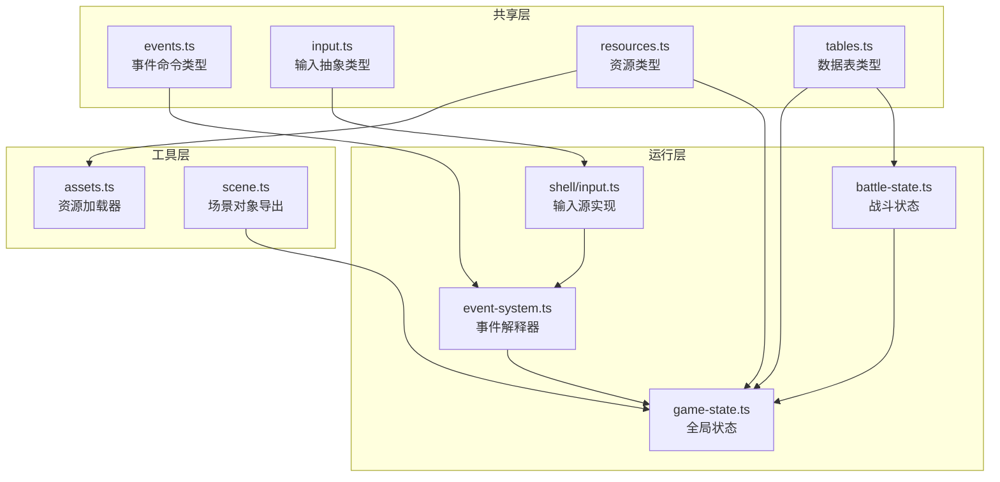
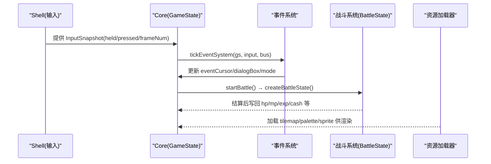
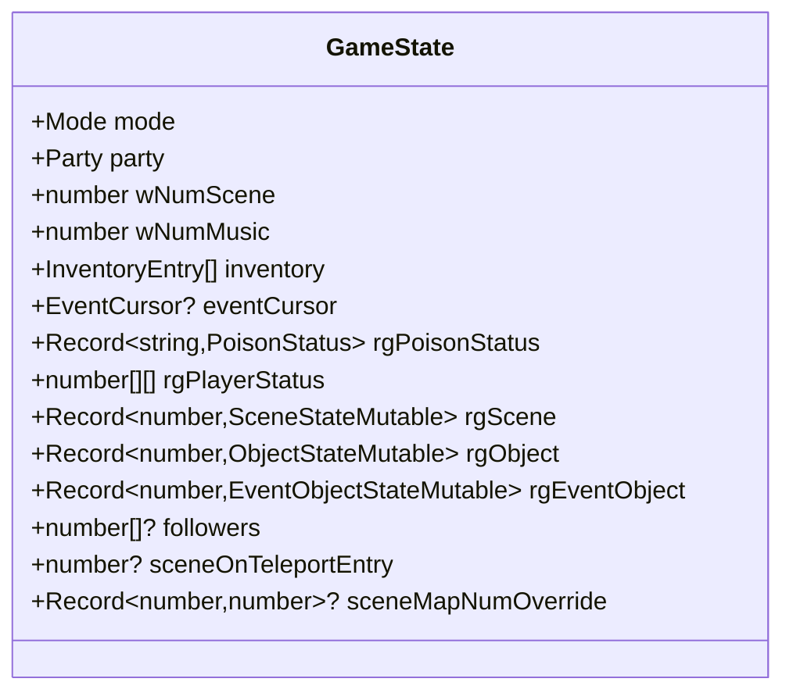
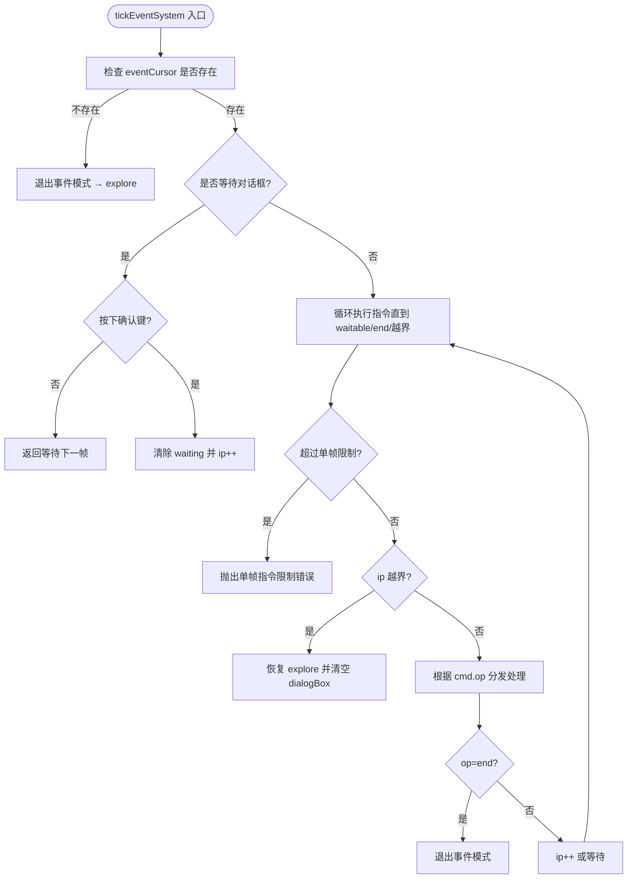
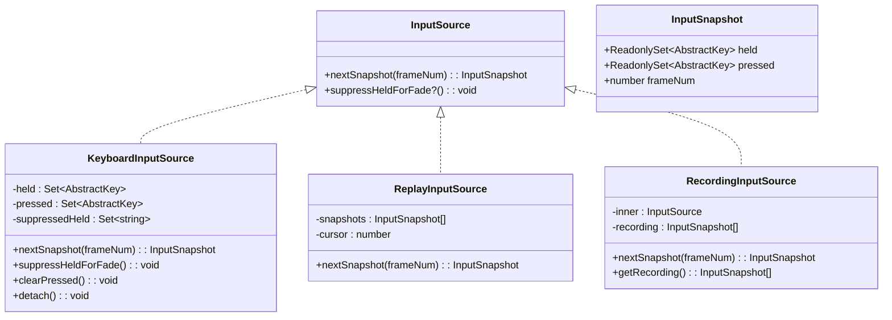
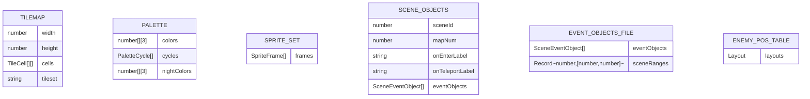
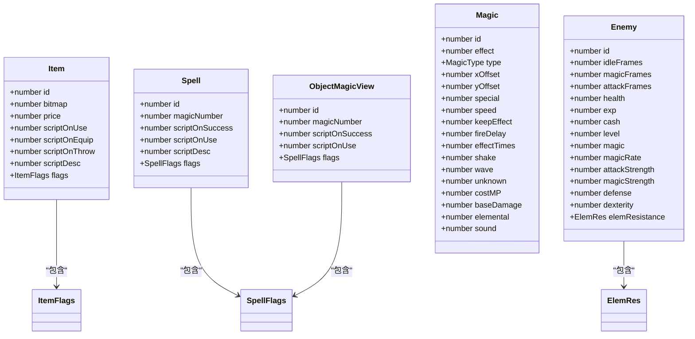
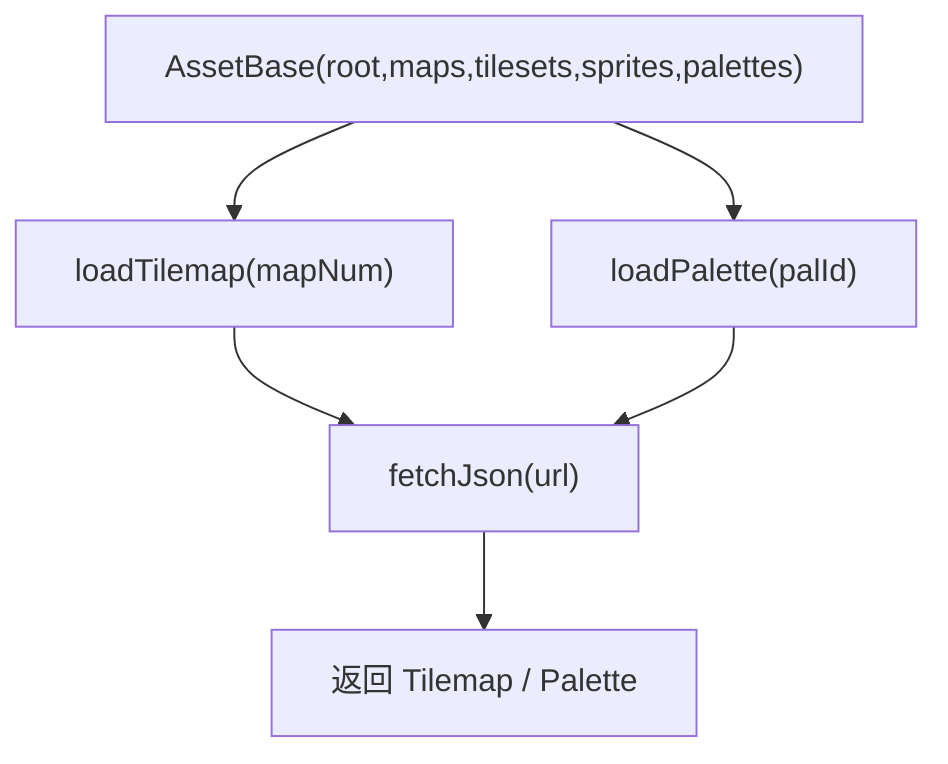
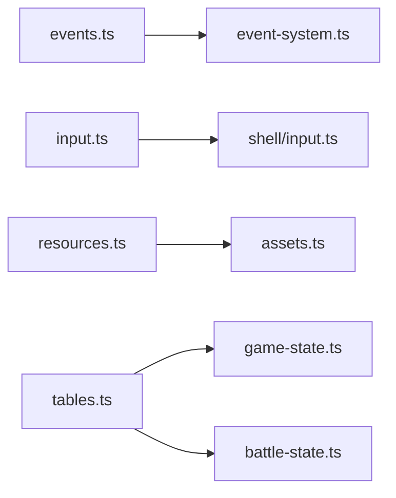

# 数据类型

<cite>
**本文引用的文件**   
- [packages/shared/src/events.ts](file://packages/shared/src/events.ts)
- [packages/game/src/core/event-system.ts](file://packages/game/src/core/event-system.ts)
- [packages/shared/src/input.ts](file://packages/shared/src/input.ts)
- [packages/game/src/shell/input.ts](file://packages/game/src/shell/input.ts)
- [packages/shared/src/resources.ts](file://packages/shared/src/resources.ts)
- [packages/reforge/src/assets.ts](file://packages/reforge/src/assets.ts)
- [packages/shared/src/tables.ts](file://packages/shared/src/tables.ts)
- [packages/pal-extract/src/resources/scene.ts](file://packages/pal-extract/src/resources/scene.ts)
- [packages/game/src/core/battle/battle-state.ts](file://packages/game/src/core/battle/battle-state.ts)
- [packages/game/src/core/game-state.ts](file://packages/game/src/core/game-state.ts)
</cite>

## 目录
1. [简介](#简介)
2. [项目结构](#项目结构)
3. [核心组件](#核心组件)
4. [架构总览](#架构总览)
5. [详细组件分析](#详细组件分析)
6. [依赖关系分析](#依赖关系分析)
7. [性能考虑](#性能考虑)
8. [故障排查指南](#故障排查指南)
9. [结论](#结论)
10. [附录](#附录)

## 简介
本文件为“数据类型”参考文档，聚焦于共享数据结构、事件命令格式、输入事件类型与资源类型的完整定义与使用规范。目标读者包括策划、程序与测试工程师，旨在帮助正确理解并安全地使用以下关键类型：
- 共享数据：GameState、BattleState、SceneData（场景对象）、ItemData（物品表）等
- 事件命令：EventCommand 联合、条件判断语法、动作执行参数
- 输入事件：InputSnapshot、按键映射、触摸事件处理
- 资源类型：SpriteData（精灵帧集合）、TilemapData（地图图块）、AudioResource（音频元数据）等

## 项目结构
本项目采用多包协作的 TypeScript 工程组织方式，核心类型分布在 shared、game、reforge、pal-extract 等包中：
- shared：跨包共享的类型契约（事件、输入、资源、数据表）
- game：运行时核心状态与系统（游戏状态、战斗状态、事件系统、输入源实现）
- reforge：资源加载器（tilemap/palette/sprites 等）
- pal-extract：从原始数据导出 JSON 的工具（场景对象、全局事件对象表）



图表来源
- [packages/shared/src/events.ts:1-193](file://packages/shared/src/events.ts#L1-L193)
- [packages/shared/src/input.ts:1-54](file://packages/shared/src/input.ts#L1-L54)
- [packages/shared/src/resources.ts:1-141](file://packages/shared/src/resources.ts#L1-L141)
- [packages/shared/src/tables.ts:1-200](file://packages/shared/src/tables.ts#L1-L200)
- [packages/game/src/core/game-state.ts:1-200](file://packages/game/src/core/game-state.ts#L1-L200)
- [packages/game/src/core/battle/battle-state.ts:1-200](file://packages/game/src/core/battle/battle-state.ts#L1-L200)
- [packages/game/src/core/event-system.ts:2873-2908](file://packages/game/src/core/event-system.ts#L2873-2908)
- [packages/game/src/shell/input.ts:63-164](file://packages/game/src/shell/input.ts#L63-L164)
- [packages/reforge/src/assets.ts:1-30](file://packages/reforge/src/assets.ts#L1-L30)
- [packages/pal-extract/src/resources/scene.ts:40-89](file://packages/pal-extract/src/resources/scene.ts#L40-L89)

章节来源
- [packages/shared/src/events.ts:1-193](file://packages/shared/src/events.ts#L1-L193)
- [packages/shared/src/input.ts:1-54](file://packages/shared/src/input.ts#L1-L54)
- [packages/shared/src/resources.ts:1-141](file://packages/shared/src/resources.ts#L1-L141)
- [packages/shared/src/tables.ts:1-200](file://packages/shared/src/tables.ts#L1-L200)
- [packages/game/src/core/game-state.ts:1-200](file://packages/game/src/core/game-state.ts#L1-L200)
- [packages/game/src/core/battle/battle-state.ts:1-200](file://packages/game/src/core/battle/battle-state.ts#L1-L200)
- [packages/game/src/core/event-system.ts:2873-2908](file://packages/game/src/core/event-system.ts#L2873-2908)
- [packages/game/src/shell/input.ts:63-164](file://packages/game/src/shell/input.ts#L63-L164)
- [packages/reforge/src/assets.ts:1-30](file://packages/reforge/src/assets.ts#L1-L30)
- [packages/pal-extract/src/resources/scene.ts:40-89](file://packages/pal-extract/src/resources/scene.ts#L40-L89)

## 核心组件
本节概述各核心类型的作用域与职责边界，便于快速定位与查阅。

- 全局状态 GameState
  - 探索/事件/战斗模式下的单一真相源，包含队伍位置、场景、音乐、库存、NPC、事件游标、调色板、毒状态、玩家持久状态、场景可变状态等。
  - 关键字段示例：party、wNumScene、inventory、eventCursor、rgPoisonStatus、rgPlayerStatus、rgScene、followers、rgObject、rgEventObject 等。

- 战斗状态 BattleState
  - 战斗模式的局部工作态，包含队员/敌人视图、战场背景、阶段机、回合队列、动画时间线、UI 菜单状态等。
  - 关键字段示例：players、enemies、field、phase、turn、actionQueue、uiState、menuState、rng、battleAnim 等。

- 事件命令 EventCommand（联合）
  - 描述事件脚本的命令集合，支持 raw 兜底与具名命令（跳转、对话、给物、开战、切场景、调色板、对话框样式、结构化子集 sequence/if/choice）。
  - 关键字段示例：op、opcode、operands、to、messageIndex、text、itemId、enemyTeamId、sceneId、paletteIndex 等。

- 输入事件 InputSnapshot 与输入源
  - 抽象按键集合与每帧快照；键盘/回放/录制输入源实现统一接口。
  - 关键字段示例：held、pressed、frameNum；方法 nextSnapshot、suppressHeldForFade、clearPressed。

- 资源类型
  - Tilemap/Palette/SpriteFrame/SpriteSet/SceneObjects/EnemyPosTable 等。
  - 关键字段示例：width/height/cells/tileset、colors/cycles/nightColors、frames/image、sceneId/mapNum/onEnterLabel/eventObjects 等。

- 数据表 Item/Magic/Spell/Enemy 等
  - 物品、法术、怪物等静态数据条目，含 flags 位拆、数值、脚本入口等。
  - 关键字段示例：id、bitmap、price、scriptOnUse、flags、magicNumber、type、effect、health、elemResistance 等。

章节来源
- [packages/game/src/core/game-state.ts:608-1195](file://packages/game/src/core/game-state.ts#L608-L1195)
- [packages/game/src/core/battle/battle-state.ts:1-200](file://packages/game/src/core/battle/battle-state.ts#L1-L200)
- [packages/shared/src/events.ts:1-193](file://packages/shared/src/events.ts#L1-L193)
- [packages/shared/src/input.ts:1-54](file://packages/shared/src/input.ts#L1-L54)
- [packages/shared/src/resources.ts:1-141](file://packages/shared/src/resources.ts#L1-L141)
- [packages/shared/src/tables.ts:1-200](file://packages/shared/src/tables.ts#L1-L200)

## 架构总览
下图展示核心类型在系统中的交互关系：输入源提供 InputSnapshot，事件系统消费事件命令驱动 GameState 变化；战斗系统在 BattleState 内推进；资源加载器读取 Tilemap/Palette/Sprite 等资源供渲染使用。



图表来源
- [packages/game/src/core/event-system.ts:2873-2908](file://packages/game/src/core/event-system.ts#L2873-2908)
- [packages/game/src/core/battle/battle-state.ts:1-200](file://packages/game/src/core/battle/battle-state.ts#L1-L200)
- [packages/reforge/src/assets.ts:1-30](file://packages/reforge/src/assets.ts#L1-L30)
- [packages/game/src/shell/input.ts:63-164](file://packages/game/src/shell/input.ts#L63-L164)

## 详细组件分析

### 全局状态 GameState
- 作用域：全局唯一真相源，贯穿 explore/event/battle/menu 模式。
- 重要字段与语义
  - party：队伍世界坐标与朝向；camera 由 partyoffset 推导。
  - wNumScene/wNumMusic/wNumBattleField：当前场景/音乐/战场索引。
  - inventory：物品清单（itemId/count），用于消耗品判定与 UI 显示。
  - eventCursor：事件游标（commands/labelMap/ip/waiting），驱动事件解释器。
  - rgPoisonStatus：毒状态稀疏记录（poisonSlot_playerIdx → PoisonStatus）。
  - rgPlayerStatus：持久玩家状态（装备授的状态，战末不清除）。
  - rgScene/rgObject/rgEventObject：场景/对象/事件对象的运行时可变状态（稀疏存）。
  - followers：跟随者角色 id 列表（剧情 NPC 跟随）。
  - sceneOnTeleportEntry/sceneMapNumOverride：传送 base 脚本与 mapNum 覆盖。
- 验证规则
  - 新初始状态所有字段非 undefined（默认值见单测断言）。
  - Exp/PlayerRolesRuntime 等嵌套数组长度固定（MAX_PLAYER_ROLES=6）。
  - rgPoisonStatus/rgScene/rgObject/rgEventObject 仅保存被脚本修改过的条目。



图表来源
- [packages/game/src/core/game-state.ts:608-1195](file://packages/game/src/core/game-state.ts#L608-L1195)

章节来源
- [packages/game/src/core/game-state.ts:1055-1077](file://packages/game/src/core/game-state.ts#L1055-L1077)
- [packages/game/src/core/game-state.ts:1166-1195](file://packages/game/src/core/game-state.ts#L1166-L1195)

### 战斗状态 BattleState
- 作用域：战斗模式局部工作态，startBattle 时创建，结束时写回 GameState。
- 关键字段
  - players/enemies：队员/敌人的战斗视图（prevHp/defending/status/pos/currentFrame 等）。
  - field：战场背景与元素 buff（wind/thunder/water/fire/earth）。
  - phase/turn/actionQueue：阶段机与回合队列。
  - uiState/menuState：UI 菜单状态（主菜单/选择/杂项等）。
  - rng：可播种随机数生成器。
  - battleAnim：声明式动画时间线（帧、叠加特效、伤害数字、抖动、屏波、召唤神等）。
- 验证规则
  - maxHealth 必须设置以保证“HP 百分比”判定稳定。
  - poisons/resistanceToSorcery 需初始化，避免空引用。
  - deathFadeStep 控制淡出步数（0..71 进行中，≥72 完成）。

```mermaid
classDiagram
class BattleState {
+BattlePlayer[] players
+BattleEnemy[] enemies
+BattleField field
+BattlePhase phase
+number turn
+ActionQueueItem[] actionQueue
+string uiState
+string menuState
+SeedableRng rng
+BattleAnimState battleAnim
}
class BattlePlayer {
+number roleId
+number prevHp
+number prevMp
+boolean defending
+BattleStatus status
+{x : number,y : number}? pos
+number? currentFrame
}
class BattleEnemy {
+Enemy e
+BattleStatus status
+number prevHp
+number? maxHealth
+number? objectId
+number scriptOnTurnStart
+number scriptOnBattleEnd
+number scriptOnReady
+number? resistanceToSorcery
+{poisonId : number,scriptEntry : number}[]? poisons
+boolean? defeated
+number? deathFadeStep
}
BattleState --> BattlePlayer : "拥有"
BattleState --> BattleEnemy : "拥有"
```

图表来源
- [packages/game/src/core/battle/battle-state.ts:1-200](file://packages/game/src/core/battle/battle-state.ts#L1-L200)
- [packages/game/src/core/battle/battle-state.ts:200-400](file://packages/game/src/core/battle/battle-state.ts#L200-L400)

章节来源
- [packages/game/src/core/battle/battle-state.ts:1-200](file://packages/game/src/core/battle/battle-state.ts#L1-L200)
- [packages/game/src/core/battle/battle-state.ts:200-400](file://packages/game/src/core/battle/battle-state.ts#L200-L400)

### 事件命令 EventCommand 与事件系统
- 命令联合 Command
  - RawCommand：透传原始 opcode 与三元组 operands，用于兼容旧字节布局。
  - EndCommand：结束事件，支持 advance/reset/idleFrames/resetTo。
  - GotoCommand：跳转到标签（支持跨文件 "shared#L_X"/"objects#L_X"）。
  - ShowDialogCommand：显示对话框（box/style/messageIndex/text）。
  - GiveItemCommand：给予物品（itemId/count）。
  - StartBattleCommand：开始战斗（enemyTeamId/operands/_enemyTeam）。
  - LoadSceneCommand：切换场景（sceneId/_scene）。
  - SetPaletteCommand：切换调色板（paletteIndex）。
  - SetDialogStyle*Command：设置对话框样式（top/center/bottom/narration）。
  - SequenceCommand/IfCommand/ChoiceCommand：结构化子集（手写内容用）。
- 事件系统 tickEventSystem
  - 维护 eventCursor（ip/commands/labelMap/waiting），按帧推进。
  - 等待对话框确认（waiting='dialog'）后再继续。
  - 对未实现的结构化 op 抛出错误，raw 跳过并 debug 输出。
  - runScript：同步执行一段命令（battle/exploration 两种 runtimeMode）。



图表来源
- [packages/game/src/core/event-system.ts:2873-2908](file://packages/game/src/core/event-system.ts#L2873-2908)

章节来源
- [packages/shared/src/events.ts:1-193](file://packages/shared/src/events.ts#L1-L193)
- [packages/game/src/core/event-system.ts:2873-2908](file://packages/game/src/core/event-system.ts#L2873-2908)

### 输入事件 InputSnapshot 与输入源
- 抽象按键 AbstractKey
  - 与 sdlpal kKey* 一一对应，字符串枚举形式（Up/Down/Left/Right/Confirm/Cancel/Menu 等）。
- 输入快照 InputSnapshot
  - held：当前按住键集合（走路方向）。
  - pressed：本 tick 新按下键集合（菜单/确认）。
  - frameNum：帧号，便于回放与日志对齐。
- 输入源 InputSource
  - nextSnapshot(frameNum)：返回当前帧快照。
  - suppressHeldForFade?：仅在特定 fade 期间抑制方向键并清 pressed。
  - clearPressed()：清理尚未消费的 pressed（跨 modal 边界）。
- 键盘输入源 KeyboardInputSource
  - 过滤 repeat 事件，确保 pressed 只在初次按下时加入。
  - 维护 held 插入序以支持“后按优先”。
  - 支持 fade 抑制与 pressed 清理。
- 回放/录制输入源
  - ReplayInputSource：按帧顺序回放。
  - RecordingInputSource：录制输入序列。



图表来源
- [packages/shared/src/input.ts:1-54](file://packages/shared/src/input.ts#L1-L54)
- [packages/game/src/shell/input.ts:63-164](file://packages/game/src/shell/input.ts#L63-L164)

章节来源
- [packages/shared/src/input.ts:1-54](file://packages/shared/src/input.ts#L1-L54)
- [packages/game/src/shell/input.ts:63-164](file://packages/game/src/shell/input.ts#L63-L164)

### 资源类型 Tilemap/Palette/Sprite/SceneObjects
- Tilemap
  - width/height：逻辑格子尺寸（目标 64×128）。
  - cells[row][col]：TileCell（lower/upper 各 16bit 索引+属性）。
  - tileset：指向压缩后的 GOP chunk（rle/gzip），runtime 解码。
- Palette
  - colors：256 个 RGB 三元组（白天）。
  - cycles：调色板循环动画段。
  - nightColors：夜间调色板（可选）。
- SpriteFrame/SpriteSet
  - frames：精灵帧集合（width/height/anchorX/anchorY/image）。
- SceneObjects/EventObjectsFile
  - sceneId/mapNum/onEnterLabel/onTeleportLabel/eventObjects。
  - 全局事件对象表 + 各场景区间（sceneRanges）。
- EnemyPosTable
  - layouts[count-1] 数组，每条长度为 enemy count，运行时取第 i 个敌人位置。



图表来源
- [packages/shared/src/resources.ts:1-141](file://packages/shared/src/resources.ts#L1-L141)
- [packages/pal-extract/src/resources/scene.ts:40-89](file://packages/pal-extract/src/resources/scene.ts#L40-L89)

章节来源
- [packages/shared/src/resources.ts:1-141](file://packages/shared/src/resources.ts#L1-L141)
- [packages/pal-extract/src/resources/scene.ts:40-89](file://packages/pal-extract/src/resources/scene.ts#L40-L89)

### 数据表 Item/Magic/Spell/Enemy
- Item
  - id/bitmap/price/scriptOnUse/scriptOnEquip/scriptOnThrow/scriptDesc/flags。
  - flags 位拆：usable/equipable/throwable/consuming/applyToAll/sellable/equipableBy[6]。
- Spell/ObjectMagicView
  - id/magicNumber/scriptOnSuccess/scriptOnUse/scriptDesc/flags。
  - ObjectMagicView 将 OBJECT 数组按 magic union 解读，供任意 object id 当魔法使用。
- Magic
  - id/effect/type/xOffset/yOffset/special/speed/keepEffect/fireDelay/effectTimes/shake/wave/unknown/costMP/baseDamage/elemental/sound。
- Enemy
  - id/idleFrames/magicFrames/attackFrames/idleAnimSpeed/actWaitFrames/yPosOffset 等。
  - 声音/数值/抗性/物理抗性/双动/收集价值等。
  - elemResistance 五元素抗（wind/thunder/water/fire/earth）。



图表来源
- [packages/shared/src/tables.ts:1-200](file://packages/shared/src/tables.ts#L1-L200)
- [packages/shared/src/tables.ts:200-400](file://packages/shared/src/tables.ts#L200-L400)

章节来源
- [packages/shared/src/tables.ts:1-200](file://packages/shared/src/tables.ts#L1-L200)
- [packages/shared/src/tables.ts:200-400](file://packages/shared/src/tables.ts#L200-L400)

### 资源加载器 AssetBase 与加载函数
- AssetBase
  - root/maps/tilesets/sprites/palettes：资源根与各子目录路径。
- 加载函数
  - loadTilemap(base, mapNum)：读取 maps/{mapNum}.json。
  - loadPalette(base, palId)：读取 palettes/{palId}.json。
  - 其他资源（sprites/tilesets）通过 fetchJson 解析 JSON 并返回对应类型。



图表来源
- [packages/reforge/src/assets.ts:1-30](file://packages/reforge/src/assets.ts#L1-L30)

章节来源
- [packages/reforge/src/assets.ts:1-30](file://packages/reforge/src/assets.ts#L1-L30)

## 依赖关系分析
- 模块耦合
  - events.ts 被 event-system.ts 消费，提供命令联合与结构化子集。
  - input.ts 被 shell/input.ts 实现，Core 只依赖抽象类型。
  - resources.ts 被 assets.ts 消费，提供 Tilemap/Palette/Sprite 等类型。
  - tables.ts 被 game-state.ts 与 battle-state.ts 引用，提供 Item/Magic/Spell/Enemy 等数据表类型。
- 外部依赖
  - SDL 参考实现（reference/sdlpal）作为字段语义与行为对照。
  - Web Audio/浏览器 API（输入与音频播放）在 Shell 层实现。



图表来源
- [packages/shared/src/events.ts:1-193](file://packages/shared/src/events.ts#L1-L193)
- [packages/game/src/core/event-system.ts:2873-2908](file://packages/game/src/core/event-system.ts#L2873-2908)
- [packages/shared/src/input.ts:1-54](file://packages/shared/src/input.ts#L1-L54)
- [packages/game/src/shell/input.ts:63-164](file://packages/game/src/shell/input.ts#L63-L164)
- [packages/shared/src/resources.ts:1-141](file://packages/shared/src/resources.ts#L1-L141)
- [packages/reforge/src/assets.ts:1-30](file://packages/reforge/src/assets.ts#L1-L30)
- [packages/shared/src/tables.ts:1-200](file://packages/shared/src/tables.ts#L1-L200)
- [packages/game/src/core/game-state.ts:1-200](file://packages/game/src/core/game-state.ts#L1-L200)
- [packages/game/src/core/battle/battle-state.ts:1-200](file://packages/game/src/core/battle/battle-state.ts#L1-L200)

章节来源
- [packages/shared/src/events.ts:1-193](file://packages/shared/src/events.ts#L1-L193)
- [packages/game/src/core/event-system.ts:2873-2908](file://packages/game/src/core/event-system.ts#L2873-2908)
- [packages/shared/src/input.ts:1-54](file://packages/shared/src/input.ts#L1-L54)
- [packages/game/src/shell/input.ts:63-164](file://packages/game/src/shell/input.ts#L63-L164)
- [packages/shared/src/resources.ts:1-141](file://packages/shared/src/resources.ts#L1-L141)
- [packages/reforge/src/assets.ts:1-30](file://packages/reforge/src/assets.ts#L1-L30)
- [packages/shared/src/tables.ts:1-200](file://packages/shared/src/tables.ts#L1-L200)
- [packages/game/src/core/game-state.ts:1-200](file://packages/game/src/core/game-state.ts#L1-L200)
- [packages/game/src/core/battle/battle-state.ts:1-200](file://packages/game/src/core/battle/battle-state.ts#L1-L200)

## 性能考虑
- 事件系统单帧指令限制：防止死循环导致卡顿，超限抛错。
- 输入快照不可变：held/pressed 暴露为 ReadonlySet，避免意外变异。
- 资源按需加载：tilemap/palette/sprite 通过 JSON 路径懒加载，减少首屏开销。
- 战斗动画声明式：BattleAnimFrame 集中描述帧增量与特效，present 层按真实时间平滑渲染。

## 故障排查指南
- 事件系统
  - goto 标签不存在：抛出“goto label 不在 labelMap”错误。
  - 未实现结构化 op：sequence/if/choice 在 M2 未实现会抛错。
  - 未知 op：default 分支抛出“unhandled op”错误。
- 输入系统
  - fade 期间方向键不自动恢复：需调用 suppressHeldForFade 并在 keyup 解除抑制。
  - pressed 残留：跨 modal 前调用 clearPressed 清理。
- 资源加载
  - fetch 失败：返回 HTTP 状态码错误信息，检查路径与网络。
  - JSON 解析失败：检查 JSON 结构与字段完整性。

章节来源
- [packages/game/src/core/event-system.ts:2873-2908](file://packages/game/src/core/event-system.ts#L2873-2908)
- [packages/game/src/shell/input.ts:63-164](file://packages/game/src/shell/input.ts#L63-L164)
- [packages/reforge/src/assets.ts:1-30](file://packages/reforge/src/assets.ts#L1-L30)

## 结论
本文档系统化梳理了项目的核心数据类型与使用规范，涵盖全局状态、战斗状态、事件命令、输入事件与资源类型。通过类型契约与验证规则，开发者可以更安全地扩展功能、编写脚本与调试问题。建议在实际开发中严格遵循字段语义与约束，结合单测断言进行回归验证。

## 附录
- 术语对照
  - 事件命令：EventCommand 联合，包含 raw 与具名命令。
  - 输入快照：InputSnapshot，包含 held/pressed/frameNum。
  - 资源类型：Tilemap/Palette/SpriteFrame/SpriteSet/SceneObjects 等。
  - 数据表：Item/Magic/Spell/Enemy 等静态条目。