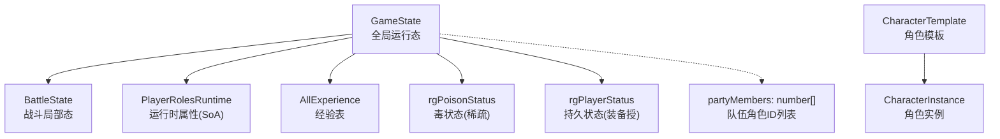
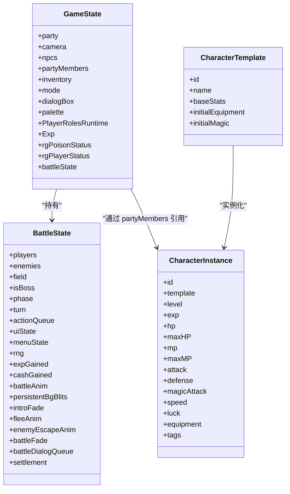
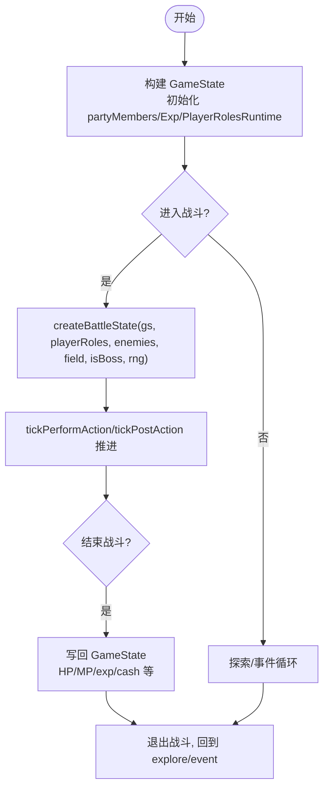
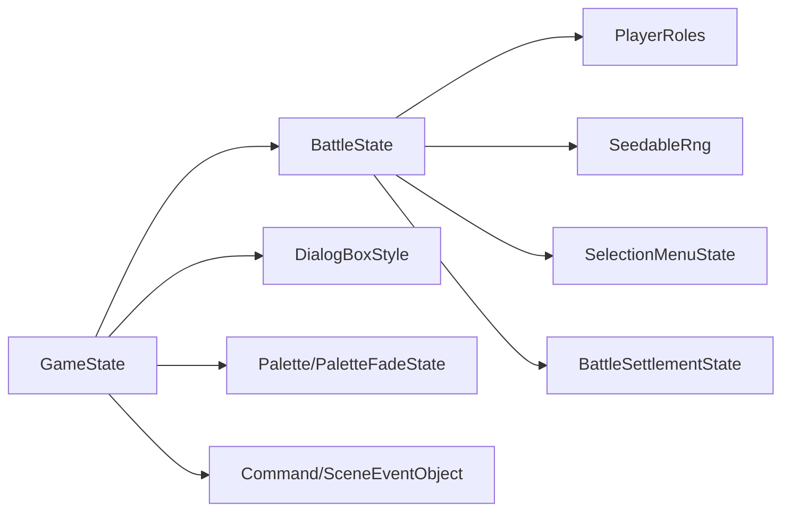

# 核心数据类型

<cite>
**本文引用的文件**   
- [packages/game/src/core/game-state.ts](file://packages/game/src/core/game-state.ts)
- [packages/game/src/core/battle/battle-state.ts](file://packages/game/src/core/battle/battle-state.ts)
- [packages/content/src/character.ts](file://packages/content/src/character.ts)
- [packages/game/src/core/game-state.test.ts](file://packages/game/src/core/game-state.test.ts)
</cite>

## 目录
1. [引言](#引言)
2. [项目结构](#项目结构)
3. [核心组件](#核心组件)
4. [架构总览](#架构总览)
5. [详细组件分析](#详细组件分析)
6. [依赖关系分析](#依赖关系分析)
7. [性能与复杂度](#性能与复杂度)
8. [序列化与版本兼容](#序列化与版本兼容)
9. [故障排查指南](#故障排查指南)
10. [结论](#结论)

## 引言
本文件聚焦于游戏核心状态类型，围绕 GameState、BattleState、CharacterData（内容层角色模板/实例）以及 PartyData（队伍数据在运行时由 GameState.partyMembers 表达）进行系统化说明。文档将：
- 明确各类型的字段含义、取值范围与验证规则
- 给出类型之间的关系图与继承/组合结构
- 提供跨系统传递与操作这些结构的最佳实践
- 总结序列化和反序列化的注意事项及版本兼容性策略

## 项目结构
核心类型分布在以下模块：
- 运行期全局状态：GameState（探索/事件/战斗模式单一真相源）
- 战斗局部状态：BattleState（从 GameState 派生，战毕写回）
- 内容层角色数据：CharacterTemplate / CharacterInstance（用于构建初始世界态）
- 队伍成员列表：以 GameState.partyMembers 表达（数组的每个元素为角色 id）

图表来源
- [packages/game/src/core/game-state.ts:655-800](file://packages/game/src/core/game-state.ts#L655-L800)
- [packages/game/src/core/battle/battle-state.ts:455-666](file://packages/game/src/core/battle/battle-state.ts#L455-L666)
- [packages/content/src/character.ts:36-85](file://packages/content/src/character.ts#L36-L85)

章节来源
- [packages/game/src/core/game-state.ts:655-800](file://packages/game/src/core/game-state.ts#L655-L800)
- [packages/game/src/core/battle/battle-state.ts:455-666](file://packages/game/src/core/battle/battle-state.ts#L455-L666)
- [packages/content/src/character.ts:36-85](file://packages/content/src/character.ts#L36-L85)

## 核心组件
本节对四个核心类型逐一展开：字段语义、取值范围、校验规则、使用场景与关联类型。

### GameState（全局运行态）
- 作用：探索/事件/战斗模式的单一真相源，持有队伍位置、相机、NPC、菜单栈、对话框、调色板、战斗状态等。
- 关键子结构：
  - party：队长像素坐标 + 朝向 Facing
  - camera：屏幕左上对应的世界坐标（viewport）
  - npcs：当前场景 NPC 运行时可变状态
  - partyMembers：队伍成员角色 ID 列表（长度受战斗限制影响）
  - inventory：持有物品清单
  - mode：'explore' | 'event' | 'battle' | 'menu'
  - dialogBox/dialogBoxKept/currentDialogStyle 等：对话框状态机
  - palette/basePalette/paletteFadeState/numPalette：调色板与淡入淡出
  - PlayerRolesRuntime：角色运行时属性（等级、HP/MP、装备、魔法等 SoA 数组）
  - Exp：多类经验表（主经验、HP/MP/攻击/防御/身法/逃跑经验）
  - rgPoisonStatus：毒状态（稀疏记录）
  - rgPlayerStatus：持久玩家状态（装备授状态，值>999 视为永久）
  - battleState：战斗局部状态（进入战斗时创建，退出后写回）
- 取值范围与约束：
  - facing：'up' | 'down' | 'left' | 'right'
  - mode：四态之一；测试用例覆盖 'battle' 赋值合法
  - partyMembers：战斗时最多 3 人（见 BattleState 常量 MAX_BATTLE_PLAYERS）
  - 经验表：每类长度为 MAX_PLAYER_ROLES（6），索引对应 roleId
- 典型使用场景：
  - 移动与相机跟随：camera = party - offset
  - 菜单与对话框：通过 menuStack 与 dialogBox 控制交互
  - 战斗切换：mode='battle' 并设置 battleState；战后恢复 explore/event

章节来源
- [packages/game/src/core/game-state.ts:655-800](file://packages/game/src/core/game-state.ts#L655-L800)
- [packages/game/src/core/game-state.ts:1055-1077](file://packages/game/src/core/game-state.ts#L1055-L1077)
- [packages/game/src/core/game-state.test.ts:215-245](file://packages/game/src/core/game-state.test.ts#L215-L245)
- [packages/game/src/core/game-state.test.ts:301-332](file://packages/game/src/core/game-state.test.ts#L301-L332)

### BattleState（战斗局部状态）
- 作用：从 GameState 派生的战斗工作态，包含敌我双方视图、回合队列、UI 状态、动画时间线、对话队列等。
- 关键子结构：
  - players/enemies：战斗中的队员/敌人视图（含 prevHp/maxHealth/status 等）
  - field/isBoss：战场与是否 Boss
  - phase/uiState/menuState：阶段与 UI 状态机
  - actionQueue/currentActionIndex/pendingActions：动作队列与待执行动作
  - rng：可播种随机数生成器
  - expGained/cashGained：本场结算收益
  - battleAnim：物理战斗动画时间线（帧级增量、特效叠加、伤害数字、屏波、召唤神演出等）
  - persistentBgBlits：被“烙进背景”的魔法精灵
  - introFade/fleeAnim/enemyEscapeAnim/battleFade：入场/逃跑/死亡淡出等过渡
  - battleDialogQueue：战斗内对话队列（复用大世界对话框渲染）
  - turnStartDoneForTurn/selectionStartedForTurn：回合时序门控
  - settlement：胜利结算演出
- 取值范围与约束：
  - MAX_BATTLE_PLAYERS = 3（超过抛错）
  - status 计数器：WORD 计数，>999 表示装备永久效果
  - targetSide：省略默认 'enemy'
  - uiState/menuState：严格枚举集
- 典型使用场景：
  - createBattleState：从 GameState + fixture 构造
  - tickPerformAction/tickPostAction：推进动画与回合逻辑
  - finalizeBattleCleanup：写回 GameState（HP/MP/exp/cash 等）

章节来源
- [packages/game/src/core/battle/battle-state.ts:455-666](file://packages/game/src/core/battle/battle-state.ts#L455-L666)
- [packages/game/src/core/battle/battle-state.ts:803-913](file://packages/game/src/core/battle/battle-state.ts#L803-L913)

### CharacterData（内容层角色模板与实例）
- 作用：定义角色模板与运行时实例，用于构建初始世界态与演示数据。
- 关键结构：
  - CharacterTemplate：id、name、baseStats、initialEquipment、initialMagic
  - CharacterInstance：稳定 id、template、level、exp、hp/mp、maxHP/maxMP、attack/defense/magicAttack/speed/luck、equipment、tags
  - WorldState/StartWorld：世界态与启动配置（party、money、learnedSkills、inventory）
- 取值范围与约束：
  - baseStats 中数值为非负整数（示例中均为正）
  - equipment 为 slotId → itemId 映射
  - buildWorld 会深拷贝初始值，避免污染源数据
- 典型使用场景：
  - instantiate：模板→实例
  - buildWorld：从 manifest.startWorld 组装初始世界态

章节来源
- [packages/content/src/character.ts:36-85](file://packages/content/src/character.ts#L36-L85)
- [packages/content/src/character.ts:92-115](file://packages/content/src/character.ts#L92-L115)

### PartyData（队伍数据）
- 说明：仓库未定义独立的 PartyData 接口。队伍数据在运行时由 GameState.partyMembers（number[]）表达，即队伍成员的角色 ID 列表。
- 取值范围与约束：
  - 战斗模式下长度不超过 MAX_BATTLE_PLAYERS（3）
  - 非战斗模式可容纳更多成员（原版最大 5）
- 典型使用场景：
  - 战斗初始化：按 gs.partyMembers 顺序构造 BattleState.players
  - 菜单/状态页：遍历 partyMembers 获取角色信息

章节来源
- [packages/game/src/core/game-state.ts:676-677](file://packages/game/src/core/game-state.ts#L676-L677)
- [packages/game/src/core/battle/battle-state.ts:803-830](file://packages/game/src/core/battle/battle-state.ts#L803-L830)

## 架构总览
下图展示核心类型之间的组合与依赖关系，以及关键流程入口。

图表来源
- [packages/game/src/core/game-state.ts:655-800](file://packages/game/src/core/game-state.ts#L655-L800)
- [packages/game/src/core/battle/battle-state.ts:455-666](file://packages/game/src/core/battle/battle-state.ts#L455-L666)
- [packages/content/src/character.ts:36-85](file://packages/content/src/character.ts#L36-L85)

## 详细组件分析

### 类型关系与继承结构
- 组合关系：
  - GameState 组合 BattleState（可选）、PlayerRolesRuntime、Exp、rgPoisonStatus、rgPlayerStatus
  - BattleState 组合 BattlePlayer/BattleEnemy、BattleAnimState、SelectionMenuState 等
- 实例化关系：
  - CharacterTemplate 经 instantiate/buildWorld 生成 CharacterInstance，最终由 GameState.partyMembers 指向具体角色 ID

图表来源
- [packages/game/src/core/battle/battle-state.ts:803-913](file://packages/game/src/core/battle/battle-state.ts#L803-L913)
- [packages/game/src/core/game-state.ts:655-800](file://packages/game/src/core/game-state.ts#L655-L800)

### 字段语义与验证规则（精选）
- GameState.mode
  - 取值：'explore' | 'event' | 'battle' | 'menu'
  - 验证：测试断言允许赋值为 'battle'
- GameState.facing
  - 取值：'up' | 'down' | 'left' | 'right'
  - 验证：测试断言集合长度=4
- BattleState.MAX_BATTLE_PLAYERS
  - 取值：3
  - 验证：createBattleState 若输入 partyMembers.length > 3 则抛错
- BattleStatus 计数器
  - 取值：WORD 计数；>999 表示装备永久效果
  - 验证：seedBattleStatus 从持久 rgPlayerStatus 映射到战斗状态
- BattleAction.targetSide
  - 取值：'enemy' | 'player'；省略默认 'enemy'
  - 验证：mainMenu/二级菜单 Confirm 后根据 magic.flags/item flags 设置

章节来源
- [packages/game/src/core/game-state.test.ts:215-245](file://packages/game/src/core/game-state.test.ts#L215-L245)
- [packages/game/src/core/battle/battle-state.ts:803-830](file://packages/game/src/core/battle/battle-state.ts#L803-L830)
- [packages/game/src/core/battle/battle-state.ts:26-38](file://packages/game/src/core/battle/battle-state.ts#L26-L38)
- [packages/game/src/core/battle/battle-state.ts:162-198](file://packages/game/src/core/battle/battle-state.ts#L162-L198)

### 使用示例（跨系统传递与操作）
- 从 GameState 派生 BattleState
  - 调用 createBattleState(input)，其中 input.gs 来自 GameState，input.playerRoles 来自 PlayerRoles，input.enemies 为已展开的敌队，field/isBoss/rng 传入
  - 注意：gs.partyMembers 长度必须 ≤ 3；否则抛错
- 战斗中读写角色状态
  - 通过 BattleState.players[i].prevHp/prevMp 做动画对比
  - 通过 BattleState.players[i].status 管理异常/增益（>999 为永久）
- 战斗结束后写回 GameState
  - 更新 HP/MP/exp/cash 等字段，清理 battleState，恢复 mode='explore'
- 内容层角色数据构建
  - 使用 instantiate(t) 将模板转为实例，buildWorld(startWorld, templatesById) 组装初始世界态

章节来源
- [packages/game/src/core/battle/battle-state.ts:803-913](file://packages/game/src/core/battle/battle-state.ts#L803-L913)
- [packages/content/src/character.ts:76-115](file://packages/content/src/character.ts#L76-L115)

## 依赖关系分析
- 直接依赖
  - BattleState 依赖 GameState（构造输入）、PlayerRoles、SeedableRng、SelectionMenuState、BattleSettlementState
  - GameState 依赖 BattleState、DialogBoxStyle、Palette、PaletteFadeState、Command、SceneEventObject
  - Content 层 CharacterTemplate/CharacterInstance 独立于运行态，仅用于构建初始世界态
- 间接依赖
  - 战斗动画与 UI 子系统消费 BattleState 的 battleAnim/uiState/menuState
  - 对话系统复用 GameState.dialogBox 与 BattleState.battleDialogQueue

图表来源
- [packages/game/src/core/battle/battle-state.ts:11-18](file://packages/game/src/core/battle/battle-state.ts#L11-L18)
- [packages/game/src/core/game-state.ts:7-11](file://packages/game/src/core/game-state.ts#L7-L11)

章节来源
- [packages/game/src/core/battle/battle-state.ts:11-18](file://packages/game/src/core/battle/battle-state.ts#L11-L18)
- [packages/game/src/core/game-state.ts:7-11](file://packages/game/src/core/game-state.ts#L7-L11)

## 性能与复杂度
- 数据结构规模
  - PlayerRolesRuntime/Exp 为固定长度数组（MAX_PLAYER_ROLES=6），访问 O(1)
  - rgPoisonStatus 稀疏存储，键空间较小，查找 O(1)
  - BattleState.actionQueue 随回合推进线性增长，但单轮有限
- 时间复杂度
  - createBattleState：O(P+E)，P 为队员数，E 为敌人数
  - tickPerformAction：取决于动画帧数与动作数量，整体线性
- 空间复杂度
  - BattleAnimState.frames 累积当前动画帧，播完释放
  - persistentBgBlits 仅在特定魔法效果存在时增长

[本节为通用性能讨论，不直接分析具体文件]

## 序列化与版本兼容
- 序列化要点
  - GameState 作为存档根对象，需序列化 party/camera/npcs/inventory/mode/dialogBox/palette/PlayerRolesRuntime/Exp/rgPoisonStatus/rgPlayerStatus/battleState 等
  - BattleState 为战斗局部态，通常不在存档中持久化（或仅保存必要元数据），战斗结束时写回 GameState
  - CharacterTemplate/CharacterInstance 属于内容层，不参与运行时存档
- 向后兼容策略
  - 可选字段大量使用 undefined 与 ?? 默认值（如 BattlePlayer.pos、BattleEnemy.maxHealth/resistanceToSorcery/poisons 等）
  - 旧 fixture 缺省字段时，运行时用默认值填充（例如空槽敌人 defeated=true、poisons=[]）
  - 经验表与 PlayerRolesRuntime 长度固定，旧档缺失字段时用 ?? 0 补齐
- 版本演进建议
  - 新增字段优先设为 optional，并在读取处提供默认值
  - 对破坏性变更采用迁移脚本（migrate 包）处理旧存档
  - 在 createBattleState 等处保留 fallback 路径，确保旧数据可用

章节来源
- [packages/game/src/core/battle/battle-state.ts:833-882](file://packages/game/src/core/battle/battle-state.ts#L833-L882)
- [packages/game/src/core/game-state.ts:1055-1077](file://packages/game/src/core/game-state.ts#L1055-L1077)

## 故障排查指南
- 常见错误
  - 战斗队员超限：createBattleState 抛出 partyMembers.length > 3 的错误
  - 角色 ID 不存在：createBattleState 找不到对应 PlayerRoles.roles[roleId] 时报错
  - 经验表长度不一致：检查 AllExperience 各数组是否为 6
- 定位方法
  - 查看 GameState.mode 与 battleState 是否存在
  - 检查 BattleState.phase/uiState/menuState 是否符合预期
  - 核对 BattleStatus 计数器是否 >999（装备永久效果）

章节来源
- [packages/game/src/core/battle/battle-state.ts:803-830](file://packages/game/src/core/battle/battle-state.ts#L803-L830)
- [packages/game/src/core/game-state.test.ts:301-332](file://packages/game/src/core/game-state.test.ts#L301-L332)

## 结论
- GameState 是全局唯一真相源，BattleState 是其战斗分支的工作态
- CharacterTemplate/CharacterInstance 用于内容层构建初始世界态，与运行态解耦
- PartyData 以 GameState.partyMembers 表达，遵循战斗人数上限约束
- 设计强调向后兼容：大量 optional 字段与默认值，便于旧数据平滑迁移
- 建议在新增字段时保持可选并提供默认值，必要时通过迁移脚本处理破坏性变更