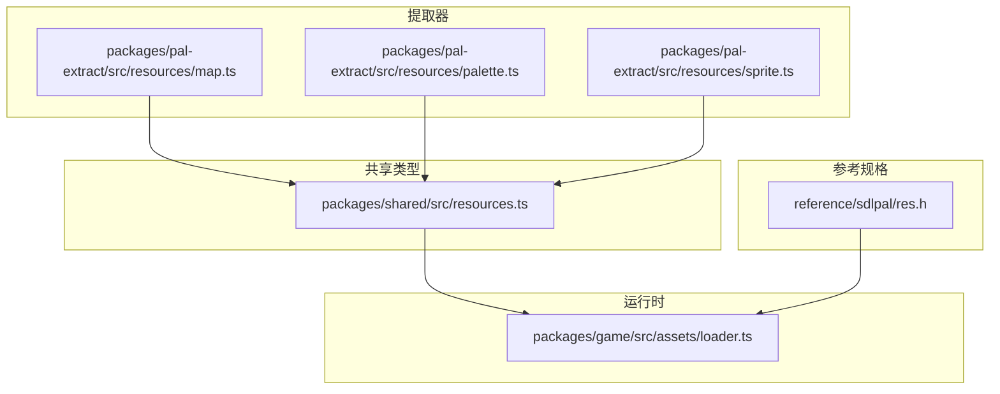
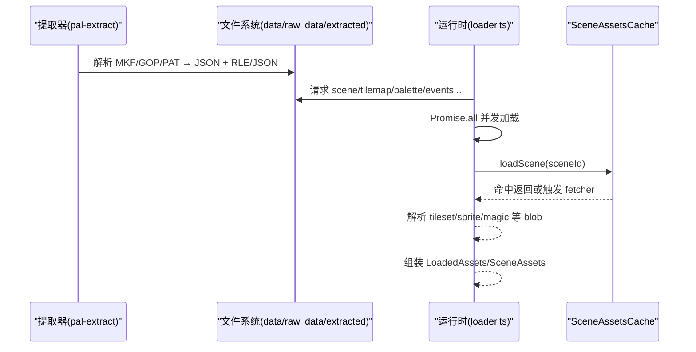
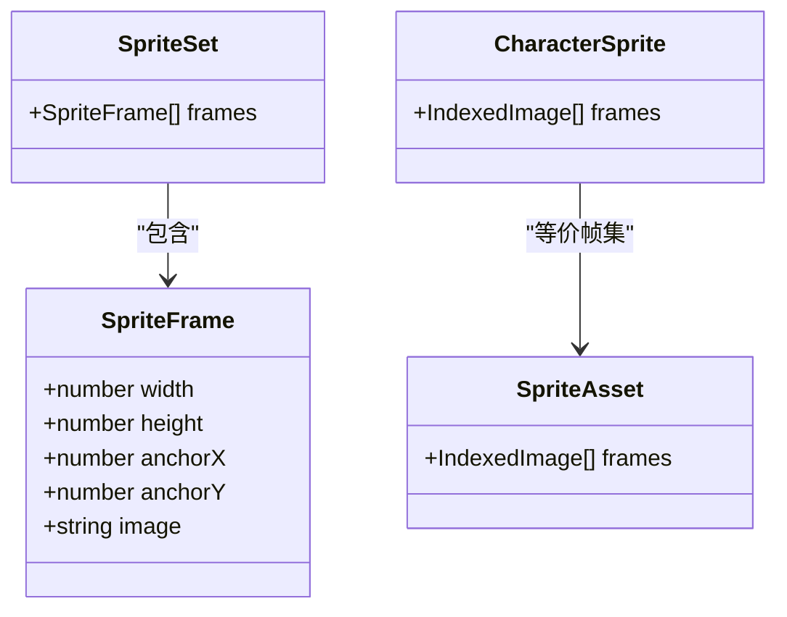
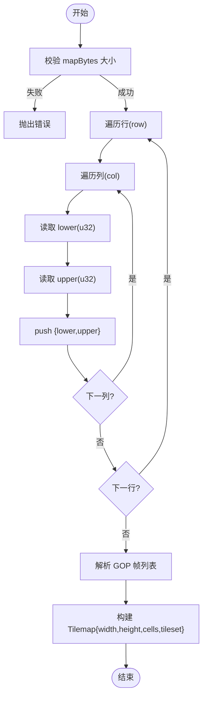
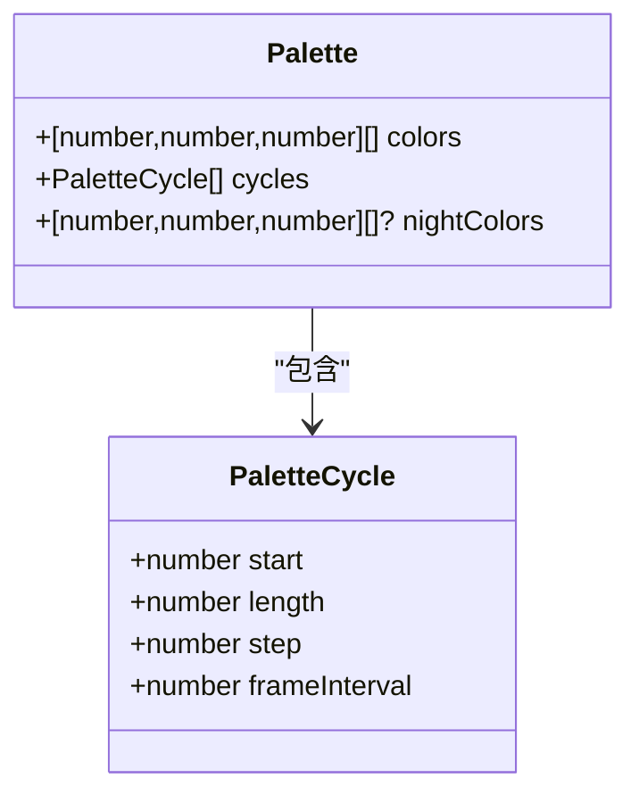
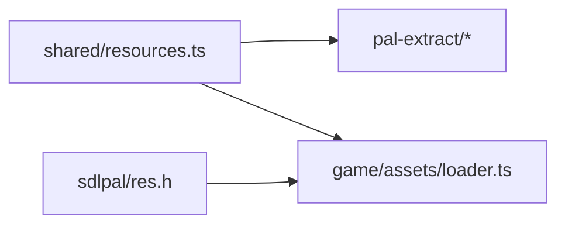

# 资源类型定义

<cite>
**本文引用的文件**   
- [packages/shared/src/resources.ts](file://packages/shared/src/resources.ts)
- [packages/pal-extract/src/resources/map.ts](file://packages/pal-extract/src/resources/map.ts)
- [packages/pal-extract/src/resources/palette.ts](file://packages/pal-extract/src/resources/palette.ts)
- [packages/pal-extract/src/resources/sprite.ts](file://packages/pal-extract/src/resources/sprite.ts)
- [packages/game/src/assets/loader.ts](file://packages/game/src/assets/loader.ts)
- [reference/sdlpal/res.h](file://reference/sdlpal/res.h)
</cite>

## 目录
1. [引言](#引言)
2. [项目结构](#项目结构)
3. [核心组件](#核心组件)
4. [架构总览](#架构总览)
5. [详细组件分析](#详细组件分析)
6. [依赖关系分析](#依赖关系分析)
7. [性能与内存管理](#性能与内存管理)
8. [故障排查指南](#故障排查指南)
9. [结论](#结论)
10. [附录](#附录)

## 引言
本文件为资源管理系统的完整类型文档，聚焦以下资源类型的定义、文件格式、内存布局、加载策略与缓存机制：
- SpriteData（精灵帧数据）
- TilemapData（瓦片地图数据）
- AudioResource（音频资源）
- PaletteData（调色板数据）

同时覆盖资源引用关系与依赖管理、资源转换与优化最佳实践、版本控制与增量更新策略，以及性能优化与内存管理建议。

## 项目结构
本项目采用多包结构，资源相关类型集中在共享包中，提取器负责将原版数据转换为运行时可用的 JSON/二进制，运行时负责按需加载与缓存。

图表来源
- [packages/shared/src/resources.ts:1-141](file://packages/shared/src/resources.ts#L1-L141)
- [packages/pal-extract/src/resources/map.ts:1-72](file://packages/pal-extract/src/resources/map.ts#L1-L72)
- [packages/pal-extract/src/resources/palette.ts:1-38](file://packages/pal-extract/src/resources/palette.ts#L1-L38)
- [packages/pal-extract/src/resources/sprite.ts:1-86](file://packages/pal-extract/src/resources/sprite.ts#L1-L86)
- [packages/game/src/assets/loader.ts:1-500](file://packages/game/src/assets/loader.ts#L1-L500)
- [reference/sdlpal/res.h:1-78](file://reference/sdlpal/res.h#L1-L78)

章节来源
- [packages/shared/src/resources.ts:1-141](file://packages/shared/src/resources.ts#L1-L141)
- [packages/pal-extract/src/resources/map.ts:1-72](file://packages/pal-extract/src/resources/map.ts#L1-L72)
- [packages/pal-extract/src/resources/palette.ts:1-38](file://packages/pal-extract/src/resources/palette.ts#L1-L38)
- [packages/pal-extract/src/resources/sprite.ts:1-86](file://packages/pal-extract/src/resources/sprite.ts#L1-L86)
- [packages/game/src/assets/loader.ts:1-500](file://packages/game/src/assets/loader.ts#L1-L500)
- [reference/sdlpal/res.h:1-78](file://reference/sdlpal/res.h#L1-L78)

## 核心组件
本节对四类资源进行类型化说明，包括字段含义、文件格式、内存布局、加载与缓存策略。

### 精灵数据 SpriteData
- 类型定义
  - 帧级信息：SpriteFrame（宽、高、锚点、图像文件名）
  - 集合：SpriteSet（帧列表）
- 文件格式
  - 运行时使用 PNG 索引位图（R 通道=调色板索引，A 通道=不透明掩码），由提取器从原始 sprite chunk 解码生成。
- 内存布局
  - 每帧包含像素索引数组与不透明掩码；渲染时按调色板映射颜色。
- 加载策略
  - 通过 loadCharacterSpriteBlob / loadSpriteFramesBlob 读取 gzip RLE blob，解析后得到帧序列。
- 缓存机制
  - 场景资源缓存 SceneAssetsCache 可缓存 NPC 精灵图集；全局资源在首次加载后常驻 Map。

章节来源
- [packages/shared/src/resources.ts:44-54](file://packages/shared/src/resources.ts#L44-L54)
- [packages/pal-extract/src/resources/sprite.ts:1-86](file://packages/pal-extract/src/resources/sprite.ts#L1-L86)
- [packages/game/src/assets/loader.ts:212-221](file://packages/game/src/assets/loader.ts#L212-L221)
- [packages/game/src/assets/loader.ts:451-499](file://packages/game/src/assets/loader.ts#L451-L499)

### 瓦片地图数据 TilemapData
- 类型定义
  - TileCell：下层/上层 tile 的 u32 值（低 16 位含 bitmap 索引与属性位）
  - Tilemap：width、height、cells[row][col]、tileset 路径
- 文件格式
  - MAP.MKF chunk N：YJ2 压缩，解压后固定 128×64×2 个 u32 LE
  - GOP.MKF chunk N：sprite chunk（raw，不压缩），每帧为一个 tile bitmap
  - 运行时 tileset 指向 gzip RLE blob（tileset/{mapNum}.rle）
- 内存布局
  - cells 为二维数组，行优先存储 lower/upper 成对 u32
- 加载策略
  - 提取器 parseMap 将 mapBytes 与 gopBytes 解析为 Tilemap 与 tiles 帧列表
  - 运行时 loadAll 根据 tilemap.tileset 路径加载并解析 tileset blob
- 缓存机制
  - SceneAssetsCache 可按场景缓存 tilemap 与 tileImages 解码结果

章节来源
- [packages/shared/src/resources.ts:1-22](file://packages/shared/src/resources.ts#L1-L22)
- [packages/pal-extract/src/resources/map.ts:1-72](file://packages/pal-extract/src/resources/map.ts#L1-L72)
- [packages/game/src/assets/loader.ts:192-194](file://packages/game/src/assets/loader.ts#L192-L194)
- [packages/game/src/assets/loader.ts:451-499](file://packages/game/src/assets/loader.ts#L451-L499)

### 音频资源 AudioResource
- 类型定义
  - 当前仓库未提供统一的 AudioResource 类型定义
- 文件格式
  - 参考 sdlpal 支持 OGG/MP3/OPUS/MIDI 等格式（见 audio.c、oggplay.c、mp3play.c、opusplay.c、midi.c）
- 内存布局
  - 运行时以流式或预解码缓冲形式播放，具体取决于后端实现
- 加载策略
  - 未在 loader.ts 中暴露统一入口；通常由音频子系统按需加载
- 缓存机制
  - 未见集中缓存实现；建议在高频短音效层引入 LRU 缓存

章节来源
- [reference/sdlpal/res.h:27-76](file://reference/sdlpal/res.h#L27-L76)

### 调色板数据 PaletteData
- 类型定义
  - PaletteCycle：循环段（起始下标、长度、步长、帧间隔）
  - Palette：colors（白天 256 色）、cycles（动画段）、nightColors（可选夜间 256 色）
- 文件格式
  - PAT.MKF chunk：纯白天 768 字节或白天+夜间 1536 字节（VGA 0–63 → RGB 0–255）
- 内存布局
  - colors 为 [R,G,B][] 三元组数组；nightColors 可选
- 加载策略
  - 提取器 decodePalette 将 buf 升位到 8-bit RGB，并判断是否包含夜间半
  - 运行时 fetchPalette 按 id 获取 palette JSON
- 缓存机制
  - 场景资源缓存可附带 palette；也可在全局层面做简单 Map 缓存

章节来源
- [packages/shared/src/resources.ts:24-42](file://packages/shared/src/resources.ts#L24-L42)
- [packages/pal-extract/src/resources/palette.ts:1-38](file://packages/pal-extract/src/resources/palette.ts#L1-L38)
- [packages/game/src/assets/loader.ts:396-398](file://packages/game/src/assets/loader.ts#L396-L398)

## 架构总览
资源管线分为“提取期”和“运行期”。提取期将 MKF/GOP/PAT 等原始数据解析为 JSON 与二进制 blob；运行期按场景/系统需求并发加载，并通过 LRU 缓存控制内存占用。

图表来源
- [packages/pal-extract/src/resources/map.ts:1-72](file://packages/pal-extract/src/resources/map.ts#L1-L72)
- [packages/pal-extract/src/resources/palette.ts:1-38](file://packages/pal-extract/src/resources/palette.ts#L1-L38)
- [packages/pal-extract/src/resources/sprite.ts:1-86](file://packages/pal-extract/src/resources/sprite.ts#L1-L86)
- [packages/game/src/assets/loader.ts:135-190](file://packages/game/src/assets/loader.ts#L135-L190)
- [packages/game/src/assets/loader.ts:451-499](file://packages/game/src/assets/loader.ts#L451-L499)

## 详细组件分析

### 精灵数据 SpriteData 深入
- 关键流程
  - 提取期：parseSpriteChunk 解析原始 sprite chunk → framesToOut 编码为 PNG（索引位图 + opaque mask）
  - 运行期：loadCharacterSpriteBlob/loadSpriteFramesBlob 读取 gzip RLE → 解析帧 → 构建 IndexedImage[]
- 数据结构关系

图表来源
- [packages/shared/src/resources.ts:44-54](file://packages/shared/src/resources.ts#L44-L54)
- [packages/pal-extract/src/resources/sprite.ts:1-86](file://packages/pal-extract/src/resources/sprite.ts#L1-L86)
- [packages/game/src/assets/loader.ts:212-221](file://packages/game/src/assets/loader.ts#L212-L221)

章节来源
- [packages/shared/src/resources.ts:44-54](file://packages/shared/src/resources.ts#L44-L54)
- [packages/pal-extract/src/resources/sprite.ts:1-86](file://packages/pal-extract/src/resources/sprite.ts#L1-L86)
- [packages/game/src/assets/loader.ts:212-221](file://packages/game/src/assets/loader.ts#L212-L221)

### 瓦片地图数据 TilemapData 深入
- 关键流程
  - 提取期：parseMap 校验 mapBytes 大小 → 逐格读取 lower/upper → 解析 GOP 帧列表
  - 运行期：根据 tilemap.tileset 路径加载 gzip RLE → 解析为 tile 帧图集
- 算法流程图

图表来源
- [packages/pal-extract/src/resources/map.ts:34-71](file://packages/pal-extract/src/resources/map.ts#L34-L71)

章节来源
- [packages/shared/src/resources.ts:1-22](file://packages/shared/src/resources.ts#L1-L22)
- [packages/pal-extract/src/resources/map.ts:1-72](file://packages/pal-extract/src/resources/map.ts#L1-L72)
- [packages/game/src/assets/loader.ts:192-194](file://packages/game/src/assets/loader.ts#L192-L194)

### 音频资源 AudioResource 深入
- 现状
  - 未提供统一类型；参考 sdlpal 的多后端实现
- 建议
  - 新增 AudioResource 接口（格式、采样率、时长、缓冲策略）
  - 在 loader.ts 增加统一入口与缓存键（如 hash(路径+元数据)）

章节来源
- [reference/sdlpal/res.h:27-76](file://reference/sdlpal/res.h#L27-L76)

### 调色板数据 PaletteData 深入
- 关键流程
  - 提取期：decodeColorBlock 升位到 8-bit RGB；若 buf > 768 则解析夜间半
  - 运行期：fetchPalette 按 id 获取 JSON；消费方根据 night flag 选择 colors 或 nightColors
- 数据结构关系

图表来源
- [packages/shared/src/resources.ts:24-42](file://packages/shared/src/resources.ts#L24-L42)
- [packages/pal-extract/src/resources/palette.ts:1-38](file://packages/pal-extract/src/resources/palette.ts#L1-L38)
- [packages/game/src/assets/loader.ts:396-398](file://packages/game/src/assets/loader.ts#L396-L398)

章节来源
- [packages/shared/src/resources.ts:24-42](file://packages/shared/src/resources.ts#L24-L42)
- [packages/pal-extract/src/resources/palette.ts:1-38](file://packages/pal-extract/src/resources/palette.ts#L1-L38)
- [packages/game/src/assets/loader.ts:396-398](file://packages/game/src/assets/loader.ts#L396-L398)

## 依赖关系分析
- 类型依赖
  - resources.ts 被 shared 包导出，供 pal-extract 与 game 共同消费
- 运行时依赖
  - loader.ts 依赖 shared 类型，并调用 tileset-blob/png 解码模块
- 参考依赖
  - res.h 定义了资源加载标志与 API，指导行为对齐

图表来源
- [packages/shared/src/resources.ts:1-141](file://packages/shared/src/resources.ts#L1-L141)
- [packages/game/src/assets/loader.ts:1-500](file://packages/game/src/assets/loader.ts#L1-L500)
- [reference/sdlpal/res.h:1-78](file://reference/sdlpal/res.h#L1-L78)

章节来源
- [packages/shared/src/resources.ts:1-141](file://packages/shared/src/resources.ts#L1-L141)
- [packages/game/src/assets/loader.ts:1-500](file://packages/game/src/assets/loader.ts#L1-L500)
- [reference/sdlpal/res.h:1-78](file://reference/sdlpal/res.h#L1-L78)

## 性能与内存管理
- 并发加载
  - 使用 Promise.all 并行拉取 JSON 与二进制，减少首屏时间
- 去重与子集加载
  - 仅加载被 magics[].effect 引用的 fire-sprites chunk，避免全量 55 chunk
- 防风暴缓存
  - 同一 chunk 的 N 帧并发只触发一次底层加载，避免 O(N²) 重复解压
- LRU 场景缓存
  - SceneAssetsCache 基于 JS Map 顺序维护 LRU，支持保护当前场景不被淘汰
- 内存控制
  - 限制 maxEntries，onEvict 联动清理并行缓存（如 tileImagesBySceneId）
- 解码优化
  - 使用 DecompressionStream 与 parseSpriteChunk 在浏览器端高效解 RLE

章节来源
- [packages/game/src/assets/loader.ts:135-190](file://packages/game/src/assets/loader.ts#L135-L190)
- [packages/game/src/assets/loader.ts:279-311](file://packages/game/src/assets/loader.ts#L279-L311)
- [packages/game/src/assets/loader.ts:451-499](file://packages/game/src/assets/loader.ts#L451-L499)

## 故障排查指南
- 常见错误
  - fetch 失败：loader 抛错包含 URL 与状态码，便于定位缺失资源
  - 魔法特效缺失：fire-sprites.json 缺失或某 chunk 加载失败会 warn 并跳过
  - UI 精灵帧缺失：ui-sprite 帧加载失败会导致菜单渲染异常
- 处理建议
  - 检查 /extracted 目录结构与 manifest 一致性
  - 关注控制台 warn 日志，确认是否因资源缺失导致功能退化
  - 对关键资源（scene、tilemap、palette）添加重试与降级逻辑

章节来源
- [packages/game/src/assets/loader.ts:35-41](file://packages/game/src/assets/loader.ts#L35-L41)
- [packages/game/src/assets/loader.ts:279-311](file://packages/game/src/assets/loader.ts#L279-L311)
- [packages/game/src/assets/loader.ts:313-332](file://packages/game/src/assets/loader.ts#L313-L332)

## 结论
本类型文档明确了 SpriteData、TilemapData、AudioResource、PaletteData 的类型定义、文件格式与内存布局，并给出了提取期与运行期的加载策略与缓存机制。通过并发加载、子集去重、LRU 场景缓存与防风暴策略，系统在性能与内存方面具备良好表现。后续可在 AudioResource 类型化与统一加载入口上进一步完善。

## 附录
- 资源转换与优化最佳实践
  - 精灵：使用 gzip RLE + 索引位图 PNG，运行时按需解析帧
  - 地图：tileset 存为单 blob，减少请求数与解析开销
  - 调色板：白天/夜间分离，按需切换
  - 音频：建议统一类型与缓存键，短音效走 LRU，长 BGM 流式播放
- 版本控制与增量更新
  - 以 manifest 驱动（如 fire-sprites.json、items-icons.json），变更时仅拉取受影响资源
  - 使用内容哈希作为缓存键，配合 Service Worker 实现离线与增量更新
- 资源引用与依赖管理
  - 通过 scene→mapNum→tilemap 链与 eventObjects.spriteNum 引用 sprite，确保一致性
  - magic.effect 与 fire-sprites.json 关联，避免无关资源加载