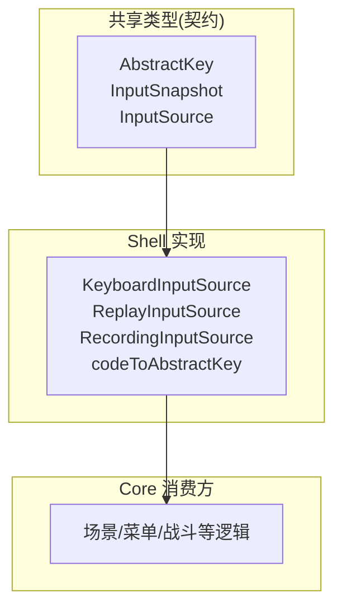
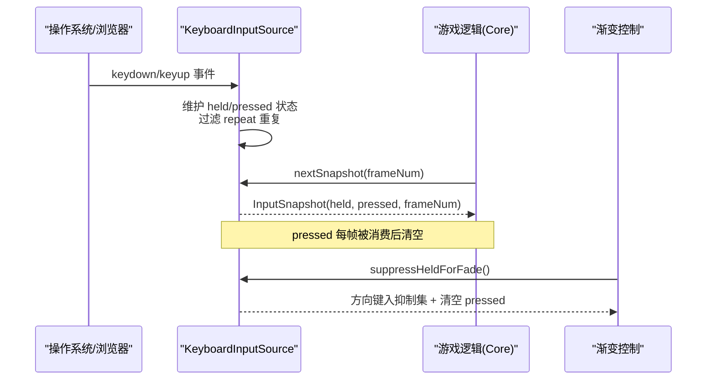
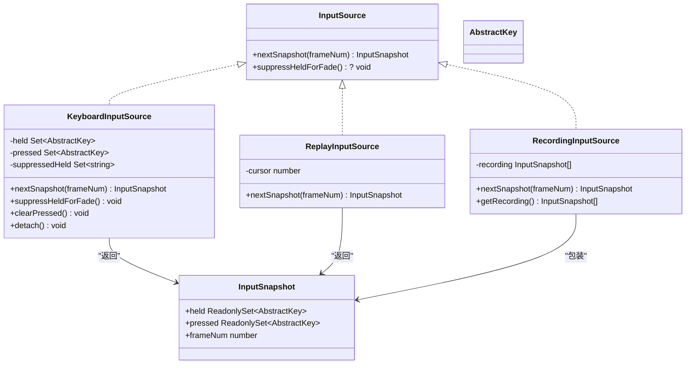
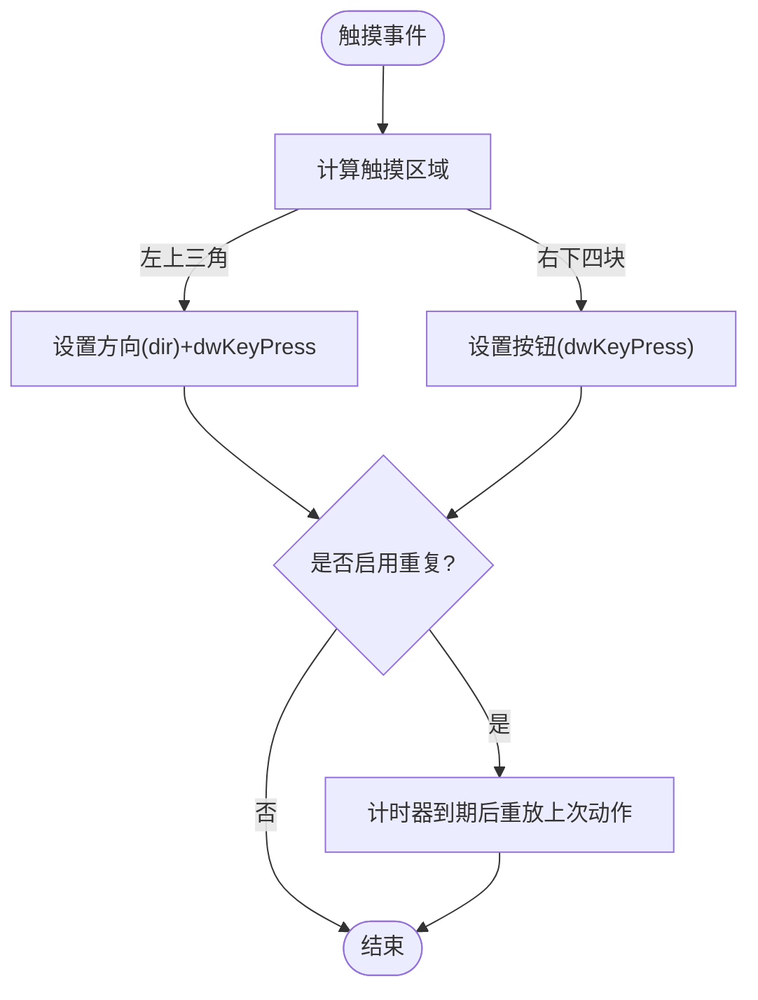
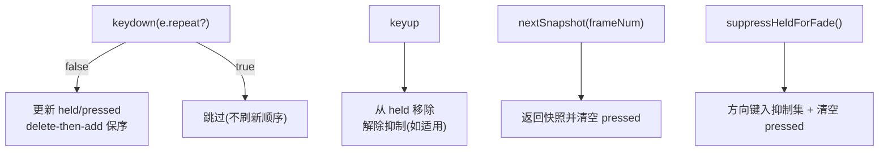
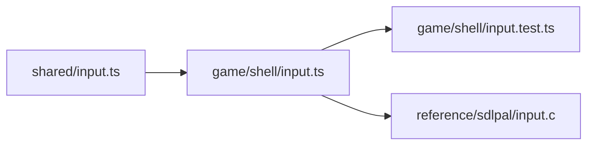

# 输入事件类型

<cite>
**本文引用的文件**
- [packages/shared/src/input.ts](file://packages/shared/src/input.ts)
- [packages/game/src/shell/input.ts](file://packages/game/src/shell/input.ts)
- [packages/game/src/shell/input.test.ts](file://packages/game/src/shell/input.test.ts)
- [reference/sdlpal/input.c](file://reference/sdlpal/input.c)
</cite>

## 目录
1. [简介](#简介)
2. [项目结构](#项目结构)
3. [核心组件](#核心组件)
4. [架构总览](#架构总览)
5. [详细组件分析](#详细组件分析)
6. [依赖关系分析](#依赖关系分析)
7. [性能与行为特性](#性能与行为特性)
8. [故障排查指南](#故障排查指南)
9. [结论](#结论)
10. [附录](#附录)

## 简介
本文件为输入事件系统的详细类型文档，聚焦以下目标：
- 记录 InputSnapshot、InputEvent（抽象按键）、KeyMapping（物理键到抽象键映射）等核心类型。
- 说明按键映射的配置格式与真值来源。
- 描述触摸事件的参考处理流程（基于 sdlpal 参考实现）。
- 解释输入事件的传播机制与“最后按下优先”的语义。
- 提供多平台输入适配的类型设计与扩展方法。
- 说明输入缓冲与去抖处理的实现细节。
- 给出输入测试与调试的工具类型（回放/录制/抑制）。

## 项目结构
输入系统采用“Shell → Core”分层：
- Shell 层负责平台输入采集与抽象化（键盘、回放、录制、fade 抑制）。
- Core 层仅消费抽象输入快照，与浏览器解耦，便于单测与回放。

图表来源
- [packages/shared/src/input.ts:1-54](file://packages/shared/src/input.ts#L1-L54)
- [packages/game/src/shell/input.ts:1-165](file://packages/game/src/shell/input.ts#L1-L165)

章节来源
- [packages/shared/src/input.ts:1-54](file://packages/shared/src/input.ts#L1-L54)
- [packages/game/src/shell/input.ts:1-165](file://packages/game/src/shell/input.ts#L1-L165)

## 核心组件
本节定义并说明输入系统的关键类型与职责。

- AbstractKey（抽象按键）
  - 作用：屏蔽平台差异，向上游暴露统一动作语义。
  - 范围：方向键、确认/取消/菜单、翻页/Home/End、Repeat/Auto/Defend、UseItem/ThrowItem/Flee/Force/Status。
  - 设计要点：字符串枚举，便于 TS 类型推导与单测断言。

- InputSnapshot（输入快照）
  - 字段：
    - held：当前按住的键集合（用于移动/持续操作）。
    - pressed：本 tick 新按下的键集合（用于菜单/确认等一次性触发）。
    - frameNum：帧号，便于回放与日志对齐。
  - 不可变性：held/pressed 以只读集合形式暴露，防止外部篡改。

- InputSource（输入源接口）
  - nextSnapshot(frameNum): 返回一帧的 InputSnapshot。
  - suppressHeldForFade?(): 可选方法，用于在特定渐变期间抑制按住的方向键并清空 pressed，以对齐 sdlpal 清键行为。

- KeyMapping（物理键到抽象键映射）
  - 位置：shell 层的 codeToAbstractKey 及内部 CODE_MAP。
  - 规则：严格遵循 sdlpal input.c 的真值映射；WASD 不充当方向键，而是对应原义动作。

章节来源
- [packages/shared/src/input.ts:18-53](file://packages/shared/src/input.ts#L18-L53)
- [packages/game/src/shell/input.ts:17-65](file://packages/game/src/shell/input.ts#L17-L65)

## 架构总览
输入从平台事件进入 Shell，转换为抽象快照后供 Core 消费。Shell 同时提供回放与录制能力，以及 fade 抑制能力。

图表来源
- [packages/game/src/shell/input.ts:67-135](file://packages/game/src/shell/input.ts#L67-L135)
- [packages/shared/src/input.ts:42-53](file://packages/shared/src/input.ts#L42-L53)

## 详细组件分析

### 类型与接口设计
- AbstractKey 联合类型覆盖所有可识别动作，保证上游仅能使用受控键名。
- InputSnapshot 将“持续态”和“瞬时态”分离，避免误用导致的重复触发或漏触发。
- InputSource 作为唯一入口，使 Core 对平台无关；可选的 suppressHeldForFade 用于对齐原版清键时序。

图表来源
- [packages/shared/src/input.ts:18-53](file://packages/shared/src/input.ts#L18-L53)
- [packages/game/src/shell/input.ts:67-165](file://packages/game/src/shell/input.ts#L67-L165)

章节来源
- [packages/shared/src/input.ts:18-53](file://packages/shared/src/input.ts#L18-L53)
- [packages/game/src/shell/input.ts:67-165](file://packages/game/src/shell/input.ts#L67-L165)

### 按键映射配置格式（KeyMapping）
- 映射表位于 shell 层，以 DOM KeyboardEvent.code 为键，输出 AbstractKey。
- 真值来源：sdlpal input.c 中 kKey* 常量与映射段。
- 重要约定：
  - WASD 不映射为方向键，保持原义（Repeat/Auto/Defend/UseItem/ThrowItem/Flee/Force/Status）。
  - 方向键包含箭头键与小键盘数字键。
  - Menu/Confirm/PgUp/PgDn/Home/End 等均有明确映射。

章节来源
- [packages/game/src/shell/input.ts:17-65](file://packages/game/src/shell/input.ts#L17-L65)
- [reference/sdlpal/input.c:868-1021](file://reference/sdlpal/input.c#L868-L1021)

### 触摸事件处理流程（参考 sdlpal）
- 屏幕区域判定：左上三角区为方向，右下四块为按钮。
- 动作设置：根据区域设置 dir 与 dwKeyPress 位掩码。
- 重复检测：若启用键重复，则按固定间隔重放上一次触摸动作。
- 释放处理：方向区域释放时重置 dir。

图表来源
- [reference/sdlpal/input.c:868-1021](file://reference/sdlpal/input.c#L868-L1021)

章节来源
- [reference/sdlpal/input.c:868-1021](file://reference/sdlpal/input.c#L868-L1021)

### 输入事件传播机制
- 事件采集：keydown/keyup 进入 KeyboardInputSource。
- 去抖策略：忽略 e.repeat 的重复事件，避免刷新“最后按下优先”的顺序。
- 顺序语义：通过 delete-then-add 维持 Set 插入序，确保“最后按下优先”。
- 快照消费：nextSnapshot 返回后清空 pressed，held 保留至 keyup。
- 渐变抑制：在特定 fade 阶段调用 suppressHeldForFade，方向键进入抑制集，pressed 清空；物理松开再按下才恢复。

图表来源
- [packages/game/src/shell/input.ts:67-135](file://packages/game/src/shell/input.ts#L67-L135)
- [packages/shared/src/input.ts:42-53](file://packages/shared/src/input.ts#L42-L53)

章节来源
- [packages/game/src/shell/input.ts:67-135](file://packages/game/src/shell/input.ts#L67-L135)
- [packages/shared/src/input.ts:42-53](file://packages/shared/src/input.ts#L42-L53)

### 多平台输入适配的类型设计
- 抽象层：InputSource 接口屏蔽平台差异，Core 仅依赖该接口。
- 键盘适配：KeyboardInputSource 将 DOM KeyboardEvent.code 映射为 AbstractKey。
- 手柄/其他设备：可通过实现 InputSource 接入（例如将手柄按键映射为 AbstractKey），无需改动 Core。
- 参考对照：libretro 将手柄按键转为 SDL 键盘事件，最终仍落入同一抽象键空间。

章节来源
- [packages/shared/src/input.ts:42-53](file://packages/shared/src/input.ts#L42-L53)
- [packages/game/src/shell/input.ts:17-65](file://packages/game/src/shell/input.ts#L17-L65)

### 自定义输入设备的扩展方法
- 步骤：
  1) 实现 InputSource 接口，提供 nextSnapshot(frameNum)。
  2) 如需支持 fade 抑制，可选实现 suppressHeldForFade。
  3) 在应用启动处注入自定义 InputSource 实例。
- 建议：
  - 保持 pressed/held 语义一致：pressed 为边沿触发，held 为电平态。
  - 若设备自带重复，自行实现去抖，避免污染“最后按下优先”顺序。

章节来源
- [packages/shared/src/input.ts:42-53](file://packages/shared/src/input.ts#L42-L53)

### 输入缓冲与去抖处理
- 缓冲：
  - pressed：每帧待消费的边沿事件集合，消费后即清空。
  - held：跨帧持续的按住集合，直到 keyup 移除。
- 去抖：
  - 忽略 e.repeat 的重复事件，防止重复刷新 held 顺序与误增 pressed。
  - clearPressed 等价 PAL_ClearKeyState，用于模态边界清理残留 pressed。
- 渐变抑制：
  - suppressHeldForFade 将方向键加入抑制集，pressed 清空；物理松开后再按下才恢复。

章节来源
- [packages/game/src/shell/input.ts:95-135](file://packages/game/src/shell/input.ts#L95-L135)
- [packages/game/src/shell/input.ts:113-118](file://packages/game/src/shell/input.ts#L113-L118)

### 输入测试与调试工具类型
- ReplayInputSource：按帧顺序回放已记录的快照序列，超出序列返回空快照。
- RecordingInputSource：装饰任意 InputSource，自动收集每帧快照，便于导出与回放。
- 单测覆盖：
  - 键映射真值校验（方向/菜单/翻页/专用键）。
  - last-press priority 与 repeat 过滤。
  - clearPressed 与 fade 抑制行为验证。

章节来源
- [packages/game/src/shell/input.ts:137-165](file://packages/game/src/shell/input.ts#L137-L165)
- [packages/game/src/shell/input.test.ts:1-224](file://packages/game/src/shell/input.test.ts#L1-224)

## 依赖关系分析
- shared.input.ts 定义契约，game.shell.input.ts 提供具体实现。
- 测试用例覆盖映射、行为与工具类。
- sdlpal input.c 作为真值参考，指导映射与行为一致性。

图表来源
- [packages/shared/src/input.ts:1-54](file://packages/shared/src/input.ts#L1-L54)
- [packages/game/src/shell/input.ts:1-165](file://packages/game/src/shell/input.ts#L1-L165)
- [packages/game/src/shell/input.test.ts:1-224](file://packages/game/src/shell/input.test.ts#L1-224)
- [reference/sdlpal/input.c:868-1021](file://reference/sdlpal/input.c#L868-L1021)

章节来源
- [packages/shared/src/input.ts:1-54](file://packages/shared/src/input.ts#L1-L54)
- [packages/game/src/shell/input.ts:1-165](file://packages/game/src/shell/input.ts#L1-L165)
- [packages/game/src/shell/input.test.ts:1-224](file://packages/game/src/shell/input.test.ts#L1-224)
- [reference/sdlpal/input.c:868-1021](file://reference/sdlpal/input.c#L868-L1021)

## 性能与行为特性
- 时间复杂度：
  - 每帧 snapshot 构建为 O(k)，k 为当前 held 大小。
  - 事件处理为 O(1) 的集合操作。
- 空间复杂度：
  - 每个 InputSource 维护两个 Set，外加录制时的快照数组（按需）。
- 行为特性：
  - “最后按下优先”通过 Set 插入序实现，repeat 事件不参与排序。
  - fade 抑制仅在特定渐变阶段生效，不影响其他渐变。

[本节为通用性能讨论，不直接分析具体文件]

## 故障排查指南
- 症状：菜单首帧误确认
  - 原因：AVI 播放后残留 Space 未被清理。
  - 解决：在进入菜单前调用 clearPressed 清理未消费的 pressed。
- 症状：按住方向键穿越 fade 后继续行走
  - 原因：未在 fade 期间抑制方向键。
  - 解决：在指定 fade 步骤调用 suppressHeldForFade，并在 keyup 后重按恢复。
- 症状：后按优先失效
  - 原因：未过滤 e.repeat 导致重复刷新顺序。
  - 解决：确保在 keydown 分支中跳过 repeat 事件。

章节来源
- [packages/game/src/shell/input.test.ts:93-106](file://packages/game/src/shell/input.test.ts#L93-L106)
- [packages/game/src/shell/input.test.ts:203-223](file://packages/game/src/shell/input.test.ts#L203-L223)
- [packages/game/src/shell/input.test.ts:138-169](file://packages/game/src/shell/input.test.ts#L138-L169)

## 结论
本输入系统通过抽象键与快照模型，将平台差异隔离在 Shell 层，Core 层获得稳定、可测试的输入语义。配合回放/录制与 fade 抑制，既满足还原需求，又具备良好的扩展性与可观测性。

[本节为总结性内容，不直接分析具体文件]

## 附录
- 键位真值参考：sdlpal input.c 中的 kKey* 常量与映射段。
- 触摸区域与动作映射：sdlpal input.c 的区域判定与动作设置函数。

章节来源
- [reference/sdlpal/input.c:868-1021](file://reference/sdlpal/input.c#L868-L1021)