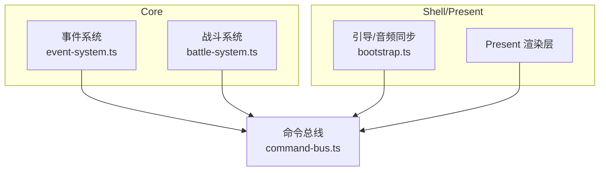
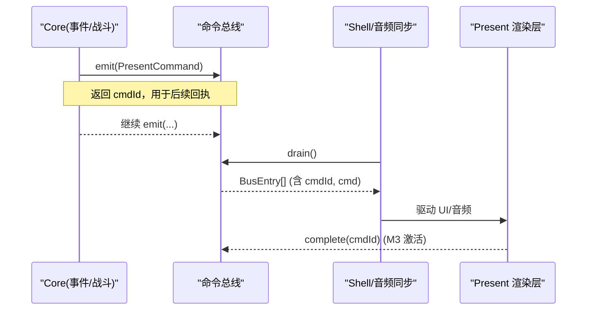
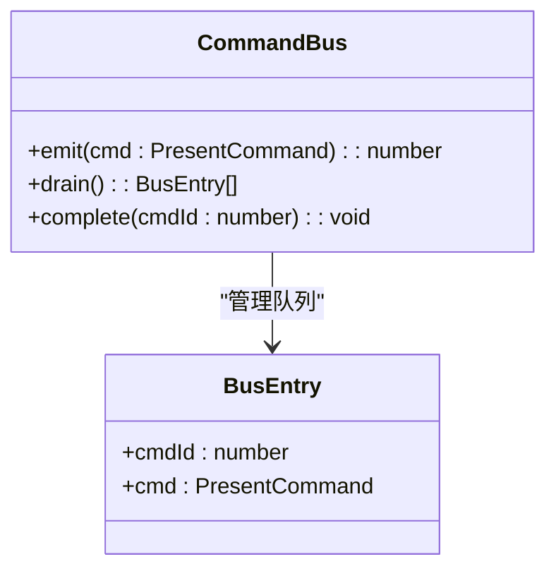
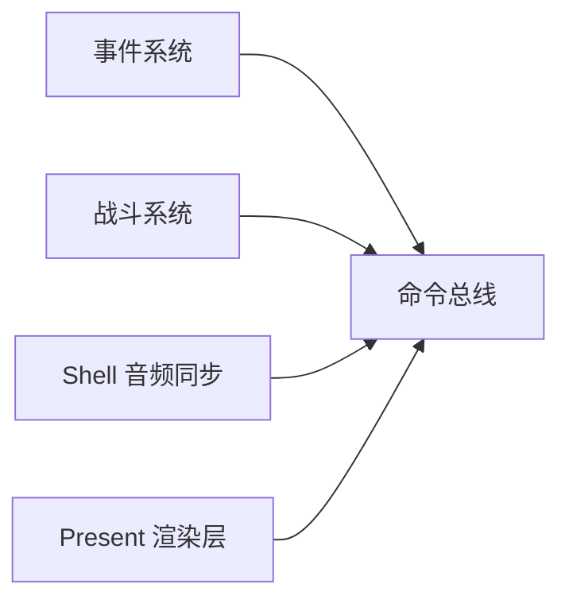

# 命令总线 API

<cite>
**本文引用的文件**   
- [packages/game/src/core/command-bus.ts](file://packages/game/src/core/command-bus.ts)
- [packages/game/src/core/command-bus.test.ts](file://packages/game/src/core/command-bus.test.ts)
- [packages/shared/src/events.ts](file://packages/shared/src/events.ts)
- [packages/game/src/core/event-system.ts](file://packages/game/src/core/event-system.ts)
- [packages/game/src/shell/bootstrap.ts](file://packages/game/src/shell/bootstrap.ts)
- [packages/game/src/core/battle/__tests__/battle-opcodes.test.ts](file://packages/game/src/core/battle/__tests__/battle-opcodes.test.ts)
</cite>

## 目录
1. [简介](#简介)
2. [项目结构](#项目结构)
3. [核心组件](#核心组件)
4. [架构总览](#架构总览)
5. [详细组件分析](#详细组件分析)
6. [依赖关系分析](#依赖关系分析)
7. [性能与优化](#性能与优化)
8. [故障排查](#故障排查)
9. [结论](#结论)
10. [附录：常用命令类型与示例](#附录常用命令类型与示例)

## 简介
本文件面向使用“命令总线”的开发者，系统化说明 Core → Present 单向命令通道的设计、接口契约、数据模型与异步扩展点。重点覆盖：
- Command 类型定义：命令结构、元数据、载荷格式
- 消息发送/接收：emit()、drain()、complete() 等核心接口（对应需求中的 sendCommand()/subscribe()/unsubscribe() 语义）
- 异步处理模式：cmdId 回执机制、Promise 支持策略、错误传播与超时处理
- 常用命令类型：输入/系统/游戏逻辑相关命令
- 自定义命令定义、订阅事件、处理响应的实践路径
- 优先级、批量处理与性能优化建议

## 项目结构
命令总线位于游戏包的核心层，负责将 Core 侧产生的“呈现命令”以 FIFO 队列形式传递给 Present 层消费；同时预留异步回执接口，为 M3 转场/视频等长耗时操作提供完成回调能力。

图表来源
- [packages/game/src/core/command-bus.ts:1-89](file://packages/game/src/core/command-bus.ts#L1-L89)
- [packages/game/src/core/event-system.ts:1-200](file://packages/game/src/core/event-system.ts#L1-L200)
- [packages/game/src/shell/bootstrap.ts:165-196](file://packages/game/src/shell/bootstrap.ts#L165-L196)

章节来源
- [packages/game/src/core/command-bus.ts:1-89](file://packages/game/src/core/command-bus.ts#L1-L89)
- [packages/game/src/core/event-system.ts:1-200](file://packages/game/src/core/event-system.ts#L1-L200)
- [packages/game/src/shell/bootstrap.ts:165-196](file://packages/game/src/shell/bootstrap.ts#L165-L196)

## 核心组件
- 命令总线接口
  - emit(cmd): 入队一条命令，返回唯一 cmdId
  - drain(): 拉取并清空当前帧的命令队列，供 Present 层消费
  - complete(cmdId): 标记某条命令完成（M2 内 no-op，M3 激活异步资源关联）
- 命令类型
  - PresentCommand：Core → Present 的联合类型，包含对话、战斗 UI、音频意图等命令
  - BusEntry：带 cmdId 的包装项，便于追踪与回执

章节来源
- [packages/game/src/core/command-bus.ts:58-88](file://packages/game/src/core/command-bus.ts#L58-L88)

## 架构总览
命令总线采用“单帧批处理 + 异步回执预留”的模式：
- Core 在 tick 内通过 emit() 写入命令
- tick 末由 Present 或 Shell 调用 drain() 一次性消费
- 若命令涉及异步资源（如转场、视频），可通过 complete(cmdId) 通知完成

图表来源
- [packages/game/src/core/command-bus.ts:63-88](file://packages/game/src/core/command-bus.ts#L63-L88)
- [packages/game/src/shell/bootstrap.ts:165-196](file://packages/game/src/shell/bootstrap.ts#L165-L196)

## 详细组件分析

### 命令总线实现与接口
- 数据结构
  - BusEntry：携带 cmdId 与具体命令
  - CommandBus：定义 emit/drain/complete 三方法
- 行为特性
  - emit 返回递增且唯一的 cmdId
  - drain 返回当前队列并清空
  - complete 在 M2 中为空操作，不抛错；M3 可据此关联异步资源生命周期

图表来源
- [packages/game/src/core/command-bus.ts:58-88](file://packages/game/src/core/command-bus.ts#L58-L88)

章节来源
- [packages/game/src/core/command-bus.ts:58-88](file://packages/game/src/core/command-bus.ts#L58-L88)
- [packages/game/src/core/command-bus.test.ts:1-45](file://packages/game/src/core/command-bus.test.ts#L1-L45)

### 命令类型定义（PresentCommand）
PresentCommand 是 Core → Present 的强类型联合，涵盖：
- 对话框：显示/清除
- 战斗 UI：消息条、伤害数字、闪烁、攻击动画、魔法动画、死亡、UI 状态切换
- 音频意图：播放音效、播放 BGM、停止 BGM

这些命令由 Core 在 tick 内 emit，由 Present/Shell 在 drain 后消费。

章节来源
- [packages/game/src/core/command-bus.ts:9-57](file://packages/game/src/core/command-bus.ts#L9-L57)

### 事件系统与命令总线集成
- 事件系统在运行脚本时，遇到需要阻塞或跨层的交互（如对话框），会设置等待标志并通过 bus.emit() 发出呈现命令
- 在 battle 模式下，事件系统对某些命令走特殊路径（例如 setDialogStyle* 视为 no-op）
- 事件系统还定义了多种结构化/具名命令（如 startBattle、loadScene、setPalette 等），它们最终可能转化为 PresentCommand 或直接影响 GameState

章节来源
- [packages/game/src/core/event-system.ts:1-200](file://packages/game/src/core/event-system.ts#L1-L200)
- [packages/shared/src/events.ts:1-193](file://packages/shared/src/events.ts#L1-L193)

### Shell 音频同步与命令消费
- Shell 每帧从总线 drain 出命令，根据 op 分发到音频模块
- 在战斗场景下，还会根据命令推断 SFX（如攻击、受击、阵亡）并播放

章节来源
- [packages/game/src/shell/bootstrap.ts:165-196](file://packages/game/src/shell/bootstrap.ts#L165-L196)

### 战斗命令与测试用例
- 战斗 opcode 在执行时会 emit 展示伤害数字等命令
- 测试覆盖了不同伤害场景（单体/全体、超杀、吸血等）以及延迟缓冲（pendingDamageNums）的行为

章节来源
- [packages/game/src/core/battle/__tests__/battle-opcodes.test.ts:1630-1829](file://packages/game/src/core/battle/__tests__/battle-opcodes.test.ts#L1630-L1829)

## 依赖关系分析
- Core 子系统（事件系统、战斗系统）依赖命令总线进行跨层通信
- Shell 依赖命令总线消费音频与 UI 意图
- Present 层通过 drain 获取命令并执行渲染/播放

图表来源
- [packages/game/src/core/command-bus.ts:1-89](file://packages/game/src/core/command-bus.ts#L1-L89)
- [packages/game/src/core/event-system.ts:1-200](file://packages/game/src/core/event-system.ts#L1-L200)
- [packages/game/src/shell/bootstrap.ts:165-196](file://packages/game/src/shell/bootstrap.ts#L165-L196)

章节来源
- [packages/game/src/core/command-bus.ts:1-89](file://packages/game/src/core/command-bus.ts#L1-L89)
- [packages/game/src/core/event-system.ts:1-200](file://packages/game/src/core/event-system.ts#L1-L200)
- [packages/game/src/shell/bootstrap.ts:165-196](file://packages/game/src/shell/bootstrap.ts#L165-L196)

## 性能与优化
- 批处理与零拷贝
  - drain 直接返回内部队列引用并在下次 drain 前清空，避免额外分配
- 顺序保证
  - FIFO 队列确保命令按 emit 顺序被消费
- 可扩展性
  - 通过 complete(cmdId) 预留异步回执，未来可接入 Promise/超时控制
- 建议
  - 高频短命令（如 showDamageNum）尽量合并或节流
  - 对长耗时命令（如转场/视频）使用 complete 回调，避免阻塞主循环
  - 在 Shell 层集中消费命令，减少多消费者竞争

[本节为通用指导，无需源码引用]

## 故障排查
- 未知 cmdId 调用 complete 不会抛错（M2 安全网）
- 死循环保护：事件系统对单 tick 指令数设限，防止 goto/raw 链导致卡死
- 未注入 handler 时的降级：startBattle 等命令会记录警告并清理游标，不中断流程

章节来源
- [packages/game/src/core/command-bus.test.ts:28-37](file://packages/game/src/core/command-bus.test.ts#L28-L37)
- [packages/game/src/core/event-system.test.ts:1102-1133](file://packages/game/src/core/event-system.test.ts#L1102-L1133)

## 结论
命令总线提供了轻量、强类型、可扩展的 Core → Present 通信机制。当前实现满足 M2 同步批处理需求，并为 M3 的异步回执（Promise/超时/错误传播）预留了清晰扩展点。通过统一命令类型与严格的测试覆盖，系统具备良好的可维护性与可观测性。

[本节为总结，无需源码引用]

## 附录：常用命令类型与示例

### 常用命令类型
- 输入/系统类
  - showDialogBox/clearDialogBox：对话框显示与清除
  - playSound/playMusic/stopMusic：音频意图
- 游戏逻辑/战斗类
  - showBattleMessage：战斗消息条
  - showDamageNum：伤害数字（颜色区分掉血/回血/回 MP）
  - flashEnemy/flashPlayer：目标闪烁
  - playEnemyAttack/playPlayerAttack：攻击动画
  - playMagicAnim：魔法动画
  - playEnemyDeath：敌人死亡
  - showBattleUI：战斗 UI 状态切换

章节来源
- [packages/game/src/core/command-bus.ts:9-57](file://packages/game/src/core/command-bus.ts#L9-L57)

### 自定义命令定义与订阅
- 定义新命令
  - 在 PresentCommand 联合中添加新的 op 分支，并定义必要字段
- 发送命令
  - 在 Core 侧调用 bus.emit({ op: 'yourOp', ...payload })
- 订阅与消费
  - 在 Shell/Present 侧每帧调用 bus.drain()，遍历 BusEntry 并根据 cmd.op 分发处理
- 异步回执
  - 若命令涉及异步资源，保存 cmdId，在资源完成后调用 bus.complete(cmdId)

章节来源
- [packages/game/src/core/command-bus.ts:58-88](file://packages/game/src/core/command-bus.ts#L58-L88)

### 异步处理模式（Promise/错误/超时）
- 当前实现
  - M2 中 complete 为空操作，不抛错
- 推荐扩展
  - 在 emit 时创建 Promise，resolve 于 complete(cmdId)，reject 于错误/超时
  - 在 Shell 层维护 cmdId→Promise 映射，超时则 reject 并清理
  - 错误传播：在 complete 之前捕获异常，统一上报并可选降级

章节来源
- [packages/game/src/core/command-bus.ts:84-87](file://packages/game/src/core/command-bus.ts#L84-L87)

### 优先级与批量处理
- 优先级
  - 当前为 FIFO，无内置优先级；如需优先级，可在 emit 前排序或使用多个队列
- 批量处理
  - 利用 drain 一次拉取整帧命令，在 Shell 层集中处理，减少上下文切换

章节来源
- [packages/game/src/core/command-bus.ts:69-88](file://packages/game/src/core/command-bus.ts#L69-L88)