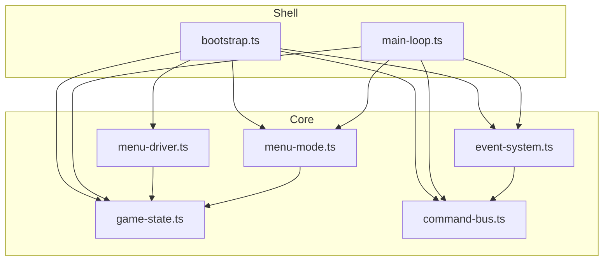
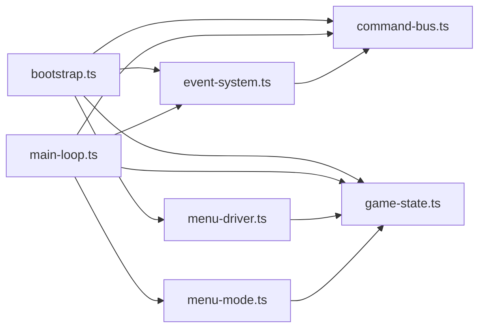

# 核心 API

<cite>
**本文引用的文件**   
- [packages/game/src/shell/bootstrap.ts](file://packages/game/src/shell/bootstrap.ts)
- [packages/game/src/shell/main-loop.ts](file://packages/game/src/shell/main-loop.ts)
- [packages/game/src/core/command-bus.ts](file://packages/game/src/core/command-bus.ts)
- [packages/game/src/core/event-system.ts](file://packages/game/src/core/event-system.ts)
- [packages/game/src/core/menu/menu-driver.ts](file://packages/game/src/core/menu/menu-driver.ts)
- [packages/game/src/core/menu/menu-mode.ts](file://packages/game/src/core/menu/menu-mode.ts)
- [packages/game/src/core/game-state.ts](file://packages/game/src/core/game-state.ts)
</cite>

## 目录
1. [简介](#简介)
2. [项目结构](#项目结构)
3. [核心组件](#核心组件)
4. [架构总览](#架构总览)
5. [详细组件分析](#详细组件分析)
6. [依赖关系分析](#依赖关系分析)
7. [性能考量](#性能考量)
8. [故障排查指南](#故障排查指南)
9. [结论](#结论)

## 简介
本文件面向“核心 API”的文档目标，聚焦以下能力：
- 游戏启动 API：入口 bootstrap、参数配置、初始化流程与生命周期管理
- 状态机 API：模式切换接口、状态监听机制、事件订阅系统
- 命令总线 API：Command 类型定义、消息发送接收、异步处理模式
并提供实际使用示例路径（以源码片段路径形式给出），以及错误处理最佳实践与性能优化建议。

## 项目结构
围绕核心 API 的关键模块组织如下：
- shell 层负责资源加载、主循环驱动、音频/视频播放、渲染管线集成
- core 层提供 GameState、事件系统、菜单驱动、命令总线等运行时核心
- present 层消费命令进行画面输出（由 shell 调用）



图表来源
- [packages/game/src/shell/bootstrap.ts:215-508](file://packages/game/src/shell/bootstrap.ts#L215-L508)
- [packages/game/src/shell/main-loop.ts:162-181](file://packages/game/src/shell/main-loop.ts#L162-L181)
- [packages/game/src/core/command-bus.ts:63-88](file://packages/game/src/core/command-bus.ts#L63-L88)
- [packages/game/src/core/event-system.ts:1-25](file://packages/game/src/core/event-system.ts#L1-L25)
- [packages/game/src/core/menu/menu-driver.ts:1-12](file://packages/game/src/core/menu/menu-driver.ts#L1-L12)
- [packages/game/src/core/menu/menu-mode.ts:1-30](file://packages/game/src/core/menu/menu-mode.ts#L1-L30)
- [packages/game/src/core/game-state.ts:50-75](file://packages/game/src/core/game-state.ts#L50-L75)

章节来源
- [packages/game/src/shell/bootstrap.ts:215-508](file://packages/game/src/shell/bootstrap.ts#L215-L508)
- [packages/game/src/shell/main-loop.ts:162-181](file://packages/game/src/shell/main-loop.ts#L162-L181)

## 核心组件
- 启动引导与生命周期：bootstrap 负责资源并行加载、上下文注入、菜单/场景/战斗装配、主循环启动与首帧可见；main-loop 负责 rAF 节流、按模式分派 tick、present 刷新
- 状态机：GameState.mode 为顶层模式机（explore / event / battle / menu），menu-mode 维护菜单栈并决定关闭后的恢复目标
- 事件系统：tickEventSystem 在 event 模式下步进脚本，支持等待态（对话、淡入淡出、场景切换、RNG/FBP/结局动画等）
- 命令总线：PresentCommand 统一描述 UI/音频意图，core 侧 emit，shell 侧 drain 并执行

章节来源
- [packages/game/src/shell/bootstrap.ts:215-508](file://packages/game/src/shell/bootstrap.ts#L215-L508)
- [packages/game/src/shell/main-loop.ts:66-181](file://packages/game/src/shell/main-loop.ts#L66-L181)
- [packages/game/src/core/game-state.ts:50-75](file://packages/game/src/core/game-state.ts#L50-L75)
- [packages/game/src/core/menu/menu-mode.ts:18-62](file://packages/game/src/core/menu/menu-mode.ts#L18-L62)
- [packages/game/src/core/event-system.ts:1-25](file://packages/game/src/core/event-system.ts#L1-L25)
- [packages/game/src/core/command-bus.ts:9-88](file://packages/game/src/core/command-bus.ts#L9-L88)

## 架构总览
下图展示从 bootstrap 到 main-loop 再到 core 的调用链与数据流，包括命令总线在 tick 末被 drain 并由 onPresent 消费。

```mermaid
sequenceDiagram
participant App as "应用"
participant Boot as "bootstrap.bootstrap()"
participant Loop as "main-loop.startRafLoop()"
participant Core as "core.tickByMode()"
participant Bus as "command-bus"
participant Present as "onPresent(drain)"
App->>Boot : 传入 canvas + deps
Boot->>Boot : 并行加载资源/词表/菜单目录
Boot->>Boot : 注入全局上下文(setSceneContext/setMenuCatalogs/...)
Boot->>Loop : startRafLoop(ctx)
loop 每帧
Loop->>Core : tickByMode(gs, input, bus)
Core->>Bus : emit(PresentCommand)
Loop->>Bus : drain()
Loop->>Present : onPresent(drained)
end
```

图表来源
- [packages/game/src/shell/bootstrap.ts:215-508](file://packages/game/src/shell/bootstrap.ts#L215-L508)
- [packages/game/src/shell/main-loop.ts:162-181](file://packages/game/src/shell/main-loop.ts#L162-L181)
- [packages/game/src/core/command-bus.ts:63-88](file://packages/game/src/core/command-bus.ts#L63-L88)

## 详细组件分析

### 启动 API：bootstrap 与生命周期
- 入口函数：bootstrap(canvas, deps?)
  - 参数
    - canvas: HTMLCanvasElement，用于最终绘制
    - deps?: BootstrapDeps
      - onPlayable?: () => void，soundfont 就绪后回调（生产显示“进入游戏”按钮）
      - enterGate?: Promise<void>，用户点击进入或自动放行后 resolve
  - URL 参数
    - ?skip-intro=1：跳过商标/开场动画，直接进入主场景
    - ?build=dos：选择 DOS fallback 风格（WIN95 默认）
  - 关键流程
    - 并行预取 soundfont、glyphs、dialog 资产与首屏 scene 资源
    - 注入全局上下文：词表、菜单目录、sprite 帧数查询器、场景加载器等
    - 构建初始 GameState、帧缓冲、present 上下文、战斗呈现对象
    - 创建 CommandBus、输入源、音频管理器（含 MIDI 后端）
    - 注册 unlockAudio 事件（keydown/pointerdown）以解除浏览器自动播放限制
    - 设置 per-scene 懒加载与缓存策略（tileset blob、NPC sprite 按需补载）
    - 启动主循环 startRafLoop，并在 onPresent 中同步音频、控制 SW 预缓存让路、按 mode 渲染
    - 完成引导后 finishBootLoading 并打印启动信息

- 生命周期要点
  - 首帧可见前：可暂停 rAF（suspendRaf）由 modal 播放器独占 canvas
  - 首帧可见后：finishBootLoading 触发 loading 覆盖层淡出
  - 资源失败兜底：glyphs/soundfont 失败不阻断启动，降级运行并 warn

- 代码示例路径
  - 启动入口与参数：[packages/game/src/shell/bootstrap.ts:215-236](file://packages/game/src/shell/bootstrap.ts#L215-L236)
  - 资源并行加载与上下文注入：[packages/game/src/shell/bootstrap.ts:229-269](file://packages/game/src/shell/bootstrap.ts#L229-L269)
  - 主循环与 onPresent 集成：[packages/game/src/shell/bootstrap.ts:473-508](file://packages/game/src/shell/bootstrap.ts#L473-L508)
  - 首帧可见与日志：[packages/game/src/shell/bootstrap.ts:1884-1894](file://packages/game/src/shell/bootstrap.ts#L1884-L1894)

章节来源
- [packages/game/src/shell/bootstrap.ts:215-508](file://packages/game/src/shell/bootstrap.ts#L215-L508)
- [packages/game/src/shell/bootstrap.ts:1884-1894](file://packages/game/src/shell/bootstrap.ts#L1884-L1894)

### 主循环与帧率控制
- startRafLoop(ctx)
  - 基于 requestAnimationFrame 驱动，内部 advanceRafFrame 实现 accumulator 节流
  - 根据 gs.mode 动态调整逻辑间隔（探索/事件 10fps，战斗 25fps）
  - 每帧：推进速度计时器、FPS 覆盖层、请求下一帧
- tickN(n, ctx)
  - headless 测试/录制回放用，连续跑 n 个逻辑 tick

- 代码示例路径
  - 启动 rAF 循环：[packages/game/src/shell/main-loop.ts:162-181](file://packages/game/src/shell/main-loop.ts#L162-L181)
  - 单帧推进与 clamp 不变量：[packages/game/src/shell/main-loop.ts:66-120](file://packages/game/src/shell/main-loop.ts#L66-L120)
  - headless 多 tick：[packages/game/src/shell/main-loop.ts:157-160](file://packages/game/src/shell/main-loop.ts#L157-L160)

章节来源
- [packages/game/src/shell/main-loop.ts:66-181](file://packages/game/src/shell/main-loop.ts#L66-L181)

### 状态机 API：模式切换与菜单栈
- 顶层模式
  - Mode = 'explore' | 'event' | 'battle' | 'menu'
  - tickByMode 根据 gs.mode 分发到对应子系统（scene/event/battle/menu）
- 菜单栈
  - openMenu(gs, entry)：push 新菜单项并切 mode='menu'
  - closeTopMenu(gs)：pop 栈顶；若栈空，tickMenu 下帧自动恢复目标模式
  - resumeAfterMenusClosed：依据是否处于战斗、是否商店阻塞等决定回 explore / event / battle

- 代码示例路径
  - Mode 定义与 ActiveMenuKind：[packages/game/src/core/game-state.ts:50-75](file://packages/game/src/core/game-state.ts#L50-L75)
  - 菜单 tick 与恢复逻辑：[packages/game/src/core/menu/menu-mode.ts:18-62](file://packages/game/src/core/menu/menu-mode.ts#L18-L62)
  - 菜单输入分发与子菜单导航：[packages/game/src/core/menu/menu-driver.ts:209-248](file://packages/game/src/core/menu/menu-driver.ts#L209-L248)

章节来源
- [packages/game/src/core/game-state.ts:50-75](file://packages/game/src/core/game-state.ts#L50-L75)
- [packages/game/src/core/menu/menu-mode.ts:18-62](file://packages/game/src/core/menu/menu-mode.ts#L18-L62)
- [packages/game/src/core/menu/menu-driver.ts:209-248](file://packages/game/src/core/menu/menu-driver.ts#L209-L248)

### 事件系统 API：脚本步进与等待态
- tickEventSystem(gs, input, bus)
  - 单 tick 内连跑非阻塞指令，遇 waitable/end/越界返回
  - 支持 waiting 原因：dialog、frame-wait、fade-screen、scene-load、delay、shop、palette-fade、scene-fade、rng-play、show-fbp、scroll-fbp、ending-anim、wait-key、quit、confirm、camera-pan
  - 具名 opcode 常量（如 OP_START_BATTLE、OP_SET_PARTY_POS、OP_PLAY_MUSIC 等）
  - 通过 setStartBattleHandler 等注入点与 shell 交互（例如进入战斗）

- 代码示例路径
  - 事件系统职责与范围说明：[packages/game/src/core/event-system.ts:1-25](file://packages/game/src/core/event-system.ts#L1-L25)
  - 关键 opcode 常量定义：[packages/game/src/core/event-system.ts:63-157](file://packages/game/src/core/event-system.ts#L63-L157)
  - 等待态字段与语义（EventCursor.waiting 等）：[packages/game/src/core/game-state.ts:226-343](file://packages/game/src/core/game-state.ts#L226-L343)

章节来源
- [packages/game/src/core/event-system.ts:1-25](file://packages/game/src/core/event-system.ts#L1-L25)
- [packages/game/src/core/event-system.ts:63-157](file://packages/game/src/core/event-system.ts#L63-L157)
- [packages/game/src/core/game-state.ts:226-343](file://packages/game/src/core/game-state.ts#L226-L343)

### 命令总线 API：类型、发送与异步回执
- PresentCommand 类型
  - 对话框：showDialogBox/clearDialogBox
  - 战斗 UI：showBattleMessage/showDamageNum/flashEnemy/flashPlayer/playEnemyAttack/playPlayerAttack/playMagicAnim/playEnemyDeath/showBattleUI
  - 音频意图：playSound/playMusic/stopMusic
- CommandBus 接口
  - emit(cmd): number —— 入队并返回 cmdId
  - drain(): BusEntry[] —— 清空队列并返回当前批次
  - complete(cmdId): void —— M3 异步回执预留（M2 无操作）

- 代码示例路径
  - 类型与接口定义：[packages/game/src/core/command-bus.ts:9-88](file://packages/game/src/core/command-bus.ts#L9-L88)

章节来源
- [packages/game/src/core/command-bus.ts:9-88](file://packages/game/src/core/command-bus.ts#L9-L88)

### 启动与运行示例（路径）
- 正确启动游戏
  - 调用 bootstrap(canvas, { onPlayable, enterGate })
  - 参考：[packages/game/src/shell/bootstrap.ts:215-236](file://packages/game/src/shell/bootstrap.ts#L215-L236)
- 监听状态变化
  - 通过 gs.mode 与菜单栈变化观察；或在 onPresent 中读取 drained 命令
  - 参考：[packages/game/src/core/menu/menu-mode.ts:18-62](file://packages/game/src/core/menu/menu-mode.ts#L18-L62)、[packages/game/src/shell/bootstrap.ts:473-508](file://packages/game/src/shell/bootstrap.ts#L473-L508)
- 发送系统命令
  - 在事件脚本或业务逻辑中通过 bus.emit({ op: 'playSound', soundId }) 等
  - 参考：[packages/game/src/core/command-bus.ts:9-88](file://packages/game/src/core/command-bus.ts#L9-L88)

## 依赖关系分析
- bootstrap 依赖 core 各子系统（event-system、menu-driver、game-state、command-bus）完成上下文注入与装配
- main-loop 依赖 core 的 tickByMode 与 command-bus，将逻辑与呈现解耦
- event-system 依赖 command-bus 发出 UI/音频意图，并通过注入点与 shell 交互（如开始战斗）
- menu-driver 依赖 game-state 的菜单栈与模式，menu-mode 提供栈操作与恢复逻辑



图表来源
- [packages/game/src/shell/bootstrap.ts:215-508](file://packages/game/src/shell/bootstrap.ts#L215-L508)
- [packages/game/src/shell/main-loop.ts:162-181](file://packages/game/src/shell/main-loop.ts#L162-L181)
- [packages/game/src/core/event-system.ts:1-25](file://packages/game/src/core/event-system.ts#L1-L25)
- [packages/game/src/core/menu/menu-driver.ts:1-12](file://packages/game/src/core/menu/menu-driver.ts#L1-L12)
- [packages/game/src/core/menu/menu-mode.ts:1-30](file://packages/game/src/core/menu/menu-mode.ts#L1-L30)
- [packages/game/src/core/command-bus.ts:63-88](file://packages/game/src/core/command-bus.ts#L63-L88)

章节来源
- [packages/game/src/shell/bootstrap.ts:215-508](file://packages/game/src/shell/bootstrap.ts#L215-L508)
- [packages/game/src/shell/main-loop.ts:162-181](file://packages/game/src/shell/main-loop.ts#L162-L181)

## 性能考量
- 资源并行加载：soundfont/glyphs/dialog/首屏场景并行 fetch，避免串行瓶颈
- 按需加载与缓存：per-scene tileset blob 与 NPC sprite 按需补载，LRU 保留最近 N 个场景资源，保护当前场景不被淘汰
- 主循环节流：accumulator 防 catch-up，mode 切换时 clamp 累积值，避免瞬时多 tick
- 音频与带宽让路：modal 播放期间暂停 SW 预缓存，避免抢带宽导致卡顿
- 首帧可见优化：finishBootLoading 延迟 loading 覆盖层淡出，减少首帧抖动

章节来源
- [packages/game/src/shell/bootstrap.ts:229-269](file://packages/game/src/shell/bootstrap.ts#L229-L269)
- [packages/game/src/shell/bootstrap.ts:556-628](file://packages/game/src/shell/bootstrap.ts#L556-L628)
- [packages/game/src/shell/main-loop.ts:66-120](file://packages/game/src/shell/main-loop.ts#L66-L120)

## 故障排查指南
- 启动期常见错误
  - playerRoles.roles[0] 缺失：检查角色数据完整性
    - 参考：[packages/game/src/shell/bootstrap.ts:274](file://packages/game/src/shell/bootstrap.ts#L274)
  - events.json segment[0] 缺失：检查事件文件结构
    - 参考：[packages/game/src/shell/bootstrap.ts:294](file://packages/game/src/shell/bootstrap.ts#L294)
  - 队长 sprite 加载失败或无 frame：检查 sprite 资源
    - 参考：[packages/game/src/shell/bootstrap.ts:339-341](file://packages/game/src/shell/bootstrap.ts#L339-L341)
  - canvas 2d context 不可用：检查环境兼容性
    - 参考：[packages/game/src/shell/bootstrap.ts:365](file://packages/game/src/shell/bootstrap.ts#L365)
- 资源加载失败兜底
  - glyphs 加载失败：warn 并继续（文字退化为 tofu）
    - 参考：[packages/game/src/shell/bootstrap.ts:231-234](file://packages/game/src/shell/bootstrap.ts#L231-L234)
  - soundfont HTTP 失败：warn 并回退（BGM 静默）
    - 参考：[packages/game/src/shell/bootstrap.ts:221-225](file://packages/game/src/shell/bootstrap.ts#L221-L225)
- 事件系统异常防护
  - 单 tick 指令上限：防止死循环，超过阈值抛错
    - 参考：[packages/game/src/core/event-system.test.ts:1564-1572](file://packages/game/src/core/event-system.test.ts#L1564-L1572)
- 菜单与模式恢复
  - 菜单关闭后未回到预期模式：检查 resumeAfterMenusClosed 分支条件
    - 参考：[packages/game/src/core/menu/menu-mode.ts:40-51](file://packages/game/src/core/menu/menu-mode.ts#L40-L51)

章节来源
- [packages/game/src/shell/bootstrap.ts:274-365](file://packages/game/src/shell/bootstrap.ts#L274-L365)
- [packages/game/src/shell/bootstrap.ts:221-234](file://packages/game/src/shell/bootstrap.ts#L221-L234)
- [packages/game/src/core/event-system.test.ts:1564-1572](file://packages/game/src/core/event-system.test.ts#L1564-L1572)
- [packages/game/src/core/menu/menu-mode.ts:40-51](file://packages/game/src/core/menu/menu-mode.ts#L40-L51)

## 结论
本核心 API 以 bootstrap 为入口，结合 main-loop 的帧驱动与 core 的状态机/事件系统/命令总线，形成清晰的“逻辑—呈现”分层。通过菜单栈与等待态机制，实现了稳健的模式切换与交互流程；命令总线则提供了跨层的 UI/音频意图通道。配合并行加载、按需缓存与节流策略，整体具备良好的性能与可维护性。