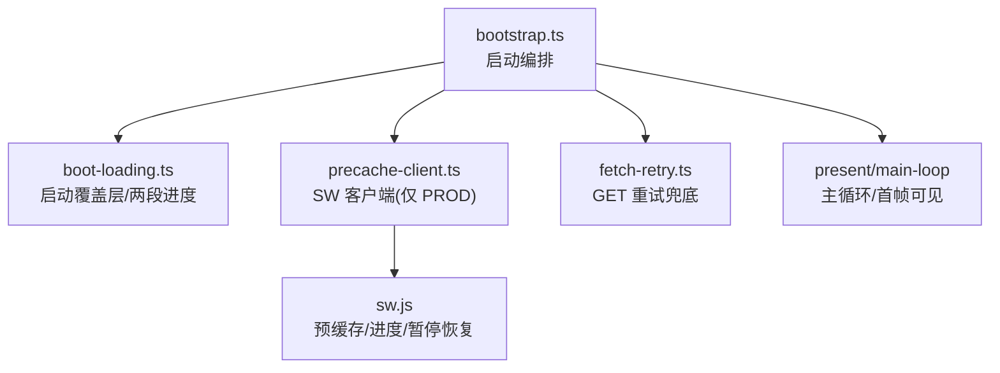
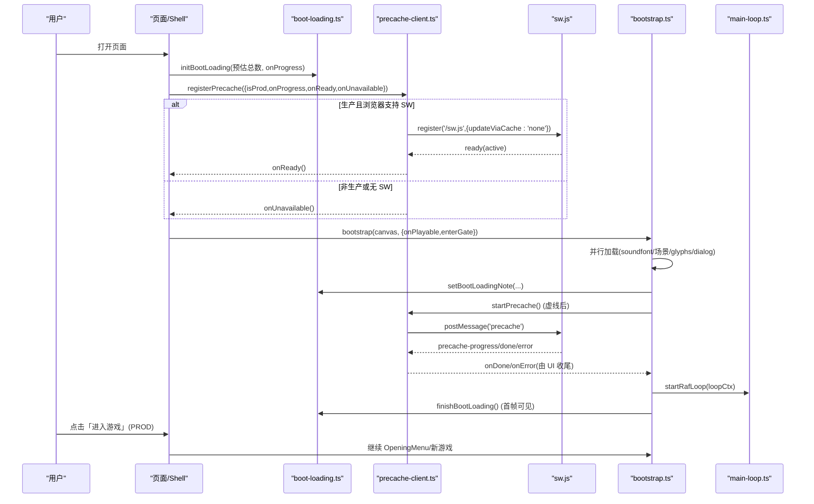
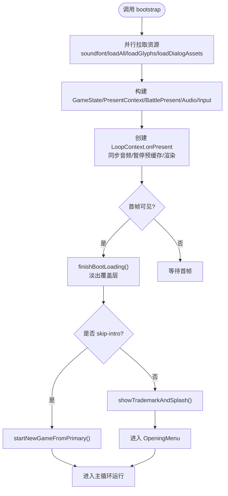
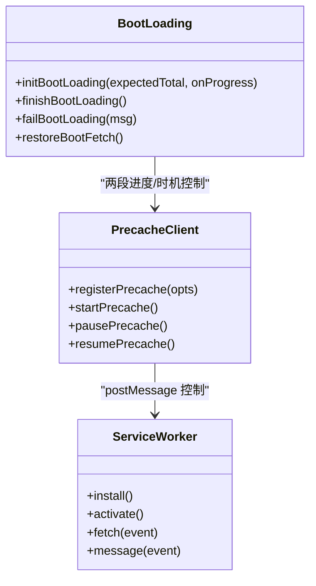
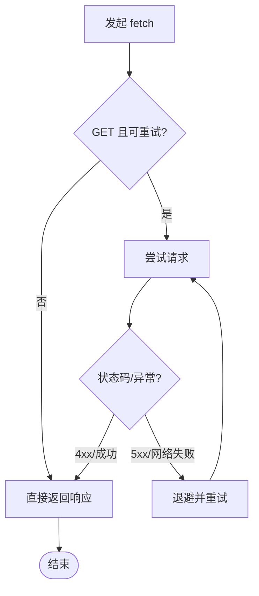
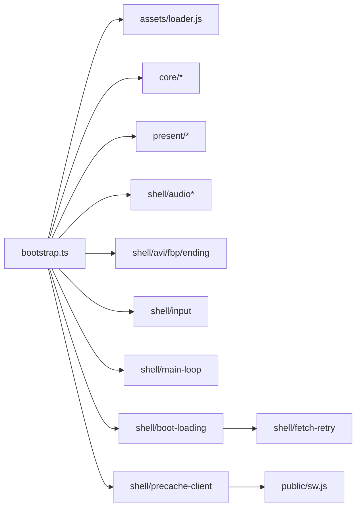

# 游戏启动 API

<cite>
**本文引用的文件**
- [packages/game/src/shell/bootstrap.ts](file://packages/game/src/shell/bootstrap.ts)
- [packages/game/src/shell/precache-client.ts](file://packages/game/src/shell/precache-client.ts)
- [packages/game/public/sw.js](file://packages/game/public/sw.js)
- [packages/game/src/shell/fetch-retry.ts](file://packages/game/src/shell/fetch-retry.ts)
- [packages/game/src/shell/boot-loading.ts](file://packages/game/src/shell/boot-loading.ts)
</cite>

## 目录
1. [简介](#简介)
2. [项目结构](#项目结构)
3. [核心组件](#核心组件)
4. [架构总览](#架构总览)
5. [详细组件分析](#详细组件分析)
6. [依赖关系分析](#依赖关系分析)
7. [性能考量](#性能考量)
8. [故障排查指南](#故障排查指南)
9. [结论](#结论)
10. [附录](#附录)

## 简介
本文件面向“游戏启动”相关的前端 Shell 层，聚焦以下目标：
- 详细说明 bootstrap() 的参数、初始化流程与生命周期管理。
- 说明生产环境与开发环境的差异处理：Service Worker 注册、预缓存策略、可玩门机制。
- 描述错误处理机制：网络重试、加载失败、资源缺失等异常路径。
- 提供实际代码示例（以源码路径引用形式）展示如何正确启动游戏、配置启动选项、处理启动回调。
- 给出性能优化建议与最佳实践。

## 项目结构
围绕“启动”的关键文件与职责如下：
- bootstrap.ts：游戏启动编排器，负责资源并行加载、音频/输入/渲染上下文装配、主循环启动、开场动画/菜单、首帧可见后收尾 loading。
- precache-client.ts：仅在生产环境注册 Service Worker，控制预缓存的时机（早注册、虚线后全速、视频期间暂停）。
- sw.js：原生 Service Worker，按 manifest 版本管理缓存、后台预缓存、进度上报、暂停/恢复。
- fetch-retry.ts：全局 GET 请求重试兜底，应对偶发网络抖动或网关瞬时错误。
- boot-loading.ts：启动覆盖层与两段进度 UI（必要资源就绪→用户点击进入游戏），在 SW 不可用时降级为本地计数。

图表来源
- [packages/game/src/shell/bootstrap.ts:215-236](file://packages/game/src/shell/bootstrap.ts#L215-L236)
- [packages/game/src/shell/boot-loading.ts:104-150](file://packages/game/src/shell/boot-loading.ts#L104-L150)
- [packages/game/src/shell/precache-client.ts:50-90](file://packages/game/src/shell/precache-client.ts#L50-L90)
- [packages/game/public/sw.js:100-160](file://packages/game/public/sw.js#L100-L160)
- [packages/game/src/shell/fetch-retry.ts:20-51](file://packages/game/src/shell/fetch-retry.ts#L20-L51)

章节来源
- [packages/game/src/shell/bootstrap.ts:215-236](file://packages/game/src/shell/bootstrap.ts#L215-L236)
- [packages/game/src/shell/boot-loading.ts:104-150](file://packages/game/src/shell/boot-loading.ts#L104-L150)
- [packages/game/src/shell/precache-client.ts:50-90](file://packages/game/src/shell/precache-client.ts#L50-L90)
- [packages/game/public/sw.js:100-160](file://packages/game/public/sw.js#L100-L160)
- [packages/game/src/shell/fetch-retry.ts:20-51](file://packages/game/src/shell/fetch-retry.ts#L20-L51)

## 核心组件
- bootstrap(canvas, deps?)
  - 参数
    - canvas: HTMLCanvasElement，用于绘制游戏画面。
    - deps?: BootstrapDeps
      - onPlayable?(): void — 必要资源就绪时触发（PROD 显示“进入游戏”按钮；dev/无门 no-op）。
      - enterGate?: Promise<void> — 等待用户进入或自动放行后 resolve（dev 预先 resolved → 不阻塞）。
  - 主要职责
    - 并行拉取 soundfont、场景资源、字体与对话资产。
    - 构建 GameState、PresentContext、BattlePresent、AudioManager、InputSource。
    - 设置事件系统、菜单目录、词表、装备效果等运行时注入点。
    - 根据 URL 参数决定 build 模式与是否跳过开场。
    - 启动 rAF 主循环，首帧可见后淡出 loading 覆盖层。
- precache-client.registerPrecache(opts)
  - 仅 isProd=true 时注册 /sw.js，并监听 message 转发进度/完成/错误。
  - 暴露 start/pause/resume 控制预缓存时机。
- sw.js
  - install/activate：按 manifest.version 归位 CACHE_NAME，清理旧版本缓存，claim 页面。
  - fetch：命中 cache 则返回，否则回源并缓存 200 响应。
  - 后台预缓存：收到 precache 消息后并发下载 manifest 中文件，支持暂停/恢复与进度上报。
- fetch-retry.installFetchRetry(opts)
  - 对 GET 请求进行最多 N 次重试（默认 2 次），退避 300ms/900ms，5xx 与网络层失败会重试，4xx 等资源性错误不重试。
- boot-loading.initBootLoading(expectedTotal?, onProgress?)
  - 包裹 globalThis.fetch 统计已发起/已完成数，驱动进度条与状态文本。
  - finishBootLoading()/failBootLoading(msg) 收尾或报错展示。

章节来源
- [packages/game/src/shell/bootstrap.ts:208-236](file://packages/game/src/shell/bootstrap.ts#L208-L236)
- [packages/game/src/shell/precache-client.ts:17-90](file://packages/game/src/shell/precache-client.ts#L17-L90)
- [packages/game/public/sw.js:1-160](file://packages/game/public/sw.js#L1-L160)
- [packages/game/src/shell/fetch-retry.ts:1-57](file://packages/game/src/shell/fetch-retry.ts#L1-L57)
- [packages/game/src/shell/boot-loading.ts:104-150](file://packages/game/src/shell/boot-loading.ts#L104-L150)

## 架构总览
下图展示了从页面加载到游戏可玩的端到端流程，包括 SW 预缓存、两段进度、可玩门与首帧可见。

图表来源
- [packages/game/src/shell/boot-loading.ts:104-150](file://packages/game/src/shell/boot-loading.ts#L104-L150)
- [packages/game/src/shell/precache-client.ts:50-90](file://packages/game/src/shell/precache-client.ts#L50-L90)
- [packages/game/public/sw.js:100-160](file://packages/game/public/sw.js#L100-L160)
- [packages/game/src/shell/bootstrap.ts:215-236](file://packages/game/src/shell/bootstrap.ts#L215-L236)

## 详细组件分析

### bootstrap() 函数详解
- 入口签名
  - bootstrap(canvas: HTMLCanvasElement, deps?: BootstrapDeps): Promise<void>
- 关键步骤
  - 并行拉取
    - soundfont.sf3（大体积，提前与其余资源并行下载，失败不阻断启动，BGM 静默+warn）。
    - loadAll(SCENE_ID)、loadGlyphs()、loadDialogAssets()（字体失败降级 tofu，不影响运行）。
  - 运行时注入
    - 词表、菜单目录、装备效果、NPC sprite 帧数查询器等。
  - 初始 GameState
    - 队伍成员、起始位置、调色板工作副本、basePalette、scene 命令与 labelMap。
  - 渲染与主循环
    - createFramebuffer、canvas 2d context、PresentContext、BattlePresent。
    - AudioManager + SpessaSynth 后端（worklet + soundfontData）。
    - 键盘/指针事件解锁 AudioContext。
    - LoopContext.onPresent 内同步音频、根据 suspendRaf 暂停/恢复预缓存、present 与 flushToCanvas。
  - 场景切换与按需加载
    - sceneFetcher 按需拉取新 scene 的 JSON/tilemap/events，补 fetch NPC sprite 与 tileset blob，LRU 缓存最近 16 个场景。
  - 开场与可玩门
    - ?skip-intro=1 直接走新游戏；否则播放商标/片头并进入 OpeningMenu。
    - 首帧可见后 finishBootLoading()，DEV 下暴露 __tpgs 给调试面板。
- 生命周期
  - 启动期：initBootLoading → 并行加载 → 首帧可见 → finishBootLoading。
  - 运行期：rAF loop 持续 present，按需加载新场景资源。
  - 退出/失败：failBootLoading(msg) 展示错误信息。

图表来源
- [packages/game/src/shell/bootstrap.ts:215-236](file://packages/game/src/shell/bootstrap.ts#L215-L236)
- [packages/game/src/shell/bootstrap.ts:471-508](file://packages/game/src/shell/bootstrap.ts#L471-L508)
- [packages/game/src/shell/bootstrap.ts:1506-1518](file://packages/game/src/shell/bootstrap.ts#L1506-L1518)
- [packages/game/src/shell/bootstrap.ts:1852-1894](file://packages/game/src/shell/bootstrap.ts#L1852-L1894)

章节来源
- [packages/game/src/shell/bootstrap.ts:215-236](file://packages/game/src/shell/bootstrap.ts#L215-L236)
- [packages/game/src/shell/bootstrap.ts:471-508](file://packages/game/src/shell/bootstrap.ts#L471-L508)
- [packages/game/src/shell/bootstrap.ts:1506-1518](file://packages/game/src/shell/bootstrap.ts#L1506-L1518)
- [packages/game/src/shell/bootstrap.ts:1852-1894](file://packages/game/src/shell/bootstrap.ts#L1852-L1894)

### 预缓存与可玩门（生产 vs 开发）
- 生产环境
  - registerPrecache(isProd=true) 注册 /sw.js，updateViaCache:none 确保 SW 更新即时生效。
  - 早注册但不立即触发预缓存；onReady 后仍不自动开始，避免抢占必要资源带宽。
  - 虚线后（必要资源就绪）调用 startPrecache()，SW 全速预缓存。
  - 开场视频期间 pausePrecache()，播完 resumePrecache()，避免 Range 请求与输入延迟。
  - SW 侧 precacheAll 使用 waitUntil 保活，支持暂停/恢复与断点续传。
- 开发环境
  - isProd=false 时不注册 SW，安全 no-op。
  - 无 SW 能力时 onUnavailable 触发，UI 自动放行可玩门，不卡死。
- 可玩门
  - PROD 两段进度：必要资源就绪回调 onPlayable，显示“进入游戏”按钮；用户点击后再进入 OpeningMenu/新游戏。
  - dev/无门：onPlayable 不阻塞，直接进入。

图表来源
- [packages/game/src/shell/precache-client.ts:34-90](file://packages/game/src/shell/precache-client.ts#L34-L90)
- [packages/game/public/sw.js:100-160](file://packages/game/public/sw.js#L100-L160)
- [packages/game/src/shell/boot-loading.ts:104-150](file://packages/game/src/shell/boot-loading.ts#L104-L150)

章节来源
- [packages/game/src/shell/precache-client.ts:50-90](file://packages/game/src/shell/precache-client.ts#L50-L90)
- [packages/game/public/sw.js:100-160](file://packages/game/public/sw.js#L100-L160)
- [packages/game/src/shell/boot-loading.ts:104-150](file://packages/game/src/shell/boot-loading.ts#L104-L150)

### 错误处理机制
- 网络层重试
  - installFetchRetry 包装 globalThis.fetch，仅对 GET 幂等请求重试。
  - 重试条件：网络层 reject 或 502/503/504；4xx 等资源性错误不重试。
  - 默认重试 2 次，退避 300ms/900ms。
- 资源加载失败
  - glyphs 加载失败：warn 并继续，文字降级为 tofu。
  - event-objects.json 加载失败：warn 并降级为非持久 NPC 状态。
  - 队长 sprite 缺失：抛错终止启动，防止空引用导致运行时崩溃。
  - 新场景按需加载失败：console.warn 并跳过该资源，保证主流程继续。
- 启动失败反馈
  - failBootLoading(msg)：还原 fetch，将覆盖层改为错误提示。
  - finishBootLoading()：首帧可见后淡出覆盖层。

图表来源
- [packages/game/src/shell/fetch-retry.ts:20-51](file://packages/game/src/shell/fetch-retry.ts#L20-L51)

章节来源
- [packages/game/src/shell/fetch-retry.ts:20-51](file://packages/game/src/shell/fetch-retry.ts#L20-L51)
- [packages/game/src/shell/bootstrap.ts:229-236](file://packages/game/src/shell/bootstrap.ts#L229-L236)
- [packages/game/src/shell/bootstrap.ts:306-326](file://packages/game/src/shell/bootstrap.ts#L306-L326)
- [packages/game/src/shell/bootstrap.ts:338-341](file://packages/game/src/shell/bootstrap.ts#L338-L341)
- [packages/game/src/shell/bootstrap.ts:556-614](file://packages/game/src/shell/bootstrap.ts#L556-L614)
- [packages/game/src/shell/boot-loading.ts:142-150](file://packages/game/src/shell/boot-loading.ts#L142-L150)

### 实际使用示例（以源码路径引用）
- 基本启动
  - 参考路径：[packages/game/src/shell/bootstrap.ts:215-236](file://packages/game/src/shell/bootstrap.ts#L215-L236)
- 配置启动选项
  - 通过 URL 参数控制行为：
    - ?build=dos 或 win95（商标/片头表现差异）
    - ?skip-intro=1（跳过商标/片头直接进入新游戏）
  - 参考路径：[packages/game/src/shell/bootstrap.ts:139-156](file://packages/game/src/shell/bootstrap.ts#L139-L156)
- 处理启动回调
  - 必要资源就绪回调 onPlayable（PROD 显示“进入游戏”按钮）
  - 等待用户进入 enterGate（dev 预先 resolved）
  - 参考路径：[packages/game/src/shell/bootstrap.ts:208-213](file://packages/game/src/shell/bootstrap.ts#L208-L213)
- 预缓存控制
  - 注册与进度：registerPrecache({isProd,onProgress,onReady,onUnavailable})
  - 启动/暂停/恢复：startPrecache()/pausePrecache()/resumePrecache()
  - 参考路径：[packages/game/src/shell/precache-client.ts:34-90](file://packages/game/src/shell/precache-client.ts#L34-L90)
- 网络重试
  - 安装全局 GET 重试：installFetchRetry({retries, backoffMs})
  - 参考路径：[packages/game/src/shell/fetch-retry.ts:20-51](file://packages/game/src/shell/fetch-retry.ts#L20-L51)
- 启动覆盖层
  - 初始化与收尾：initBootLoading()/finishBootLoading()/failBootLoading(msg)
  - 参考路径：[packages/game/src/shell/boot-loading.ts:104-150](file://packages/game/src/shell/boot-loading.ts#L104-L150)

## 依赖关系分析
- bootstrap.ts 依赖
  - assets/loader.js：loadAll 场景资源。
  - core/*：GameState、EventSystem、Menu、Save、SceneSystem 等运行时注入。
  - present/*：framebuffer、present、draw-tilemap 等渲染管线。
  - shell/audio*：音频管理与 MIDI 合成后端。
  - shell/avi-player、fbp-player、ending-player：多媒体播放。
  - shell/input、main-loop：输入与 rAF 主循环。
  - shell/boot-loading、shell/precache-client：启动 UI 与预缓存控制。
- precache-client.ts 与 sw.js
  - 通过 navigator.serviceWorker 注册与 postMessage 通信。
  - SW 侧按 manifest.version 管理缓存，后台并发预缓存。
- fetch-retry.ts
  - 在 initBootLoading 之前安装，确保覆盖层也受重试保护。

图表来源
- [packages/game/src/shell/bootstrap.ts:1-122](file://packages/game/src/shell/bootstrap.ts#L1-L122)
- [packages/game/src/shell/precache-client.ts:50-90](file://packages/game/src/shell/precache-client.ts#L50-L90)
- [packages/game/public/sw.js:1-63](file://packages/game/public/sw.js#L1-L63)
- [packages/game/src/shell/boot-loading.ts:104-150](file://packages/game/src/shell/boot-loading.ts#L104-L150)
- [packages/game/src/shell/fetch-retry.ts:20-51](file://packages/game/src/shell/fetch-retry.ts#L20-L51)

章节来源
- [packages/game/src/shell/bootstrap.ts:1-122](file://packages/game/src/shell/bootstrap.ts#L1-L122)
- [packages/game/src/shell/precache-client.ts:50-90](file://packages/game/src/shell/precache-client.ts#L50-L90)
- [packages/game/public/sw.js:1-63](file://packages/game/public/sw.js#L1-L63)
- [packages/game/src/shell/boot-loading.ts:104-150](file://packages/game/src/shell/boot-loading.ts#L104-L150)
- [packages/game/src/shell/fetch-retry.ts:20-51](file://packages/game/src/shell/fetch-retry.ts#L20-L51)

## 性能考量
- 并行加载
  - soundfont、场景资源、字体与对话资产并行拉取，缩短首屏时间。
  - 参考路径：[packages/game/src/shell/bootstrap.ts:229-236](file://packages/game/src/shell/bootstrap.ts#L229-L236)
- 预缓存时机
  - 虚线后才全速预缓存，避免抢占必要资源带宽；视频期间暂停，减少卡顿。
  - 参考路径：[packages/game/src/shell/precache-client.ts:34-48](file://packages/game/src/shell/precache-client.ts#L34-L48)
- 场景资源 LRU
  - 保留最近 16 个场景的 tile 位图，平衡内存与重访成本。
  - 参考路径：[packages/game/src/shell/bootstrap.ts:615-628](file://packages/game/src/shell/bootstrap.ts#L615-L628)
- 按需加载
  - 新场景 NPC sprite 与 tileset blob 按需 fetch，避免一次性加载全部。
  - 参考路径：[packages/game/src/shell/bootstrap.ts:556-614](file://packages/game/src/shell/bootstrap.ts#L556-L614)
- 音频与输入
  - 首个 keydown/pointerdown 解锁 AudioContext，避免 BGM/SFX 静音。
  - 参考路径：[packages/game/src/shell/bootstrap.ts:467-469](file://packages/game/src/shell/bootstrap.ts#L467-L469)

## 故障排查指南
- 常见问题定位
  - 启动黑屏或长时间无反馈：检查 boot-loading 覆盖层是否淡出，确认 finishBootLoading 是否被调用。
    - 参考路径：[packages/game/src/shell/bootstrap.ts:1884-1894](file://packages/game/src/shell/bootstrap.ts#L1884-L1894)
  - 预缓存进度停在虚线：确认 startPrecache 是否在 onPlayable 后调用，SW 是否 ready。
    - 参考路径：[packages/game/src/shell/precache-client.ts:34-90](file://packages/game/src/shell/precache-client.ts#L34-L90)
  - 资源 404 或加载失败：查看 console warn 与 fallback 逻辑（如 glyphs/tofu、event-objects 非持久）。
    - 参考路径：[packages/game/src/shell/bootstrap.ts:229-236](file://packages/game/src/shell/bootstrap.ts#L229-L236)
    - 参考路径：[packages/game/src/shell/bootstrap.ts:306-326](file://packages/game/src/shell/bootstrap.ts#L306-L326)
  - 网络偶发失败：确认 installFetchRetry 是否安装，重试次数与退避是否符合预期。
    - 参考路径：[packages/game/src/shell/fetch-retry.ts:20-51](file://packages/game/src/shell/fetch-retry.ts#L20-L51)
- 快速修复建议
  - 若 SW 不可用，确保 onUnavailable 触发后自动放行可玩门。
    - 参考路径：[packages/game/src/shell/precache-client.ts:50-65](file://packages/game/src/shell/precache-client.ts#L50-L65)
  - 若首帧未渲染，检查 gs.suspendRaf 与 modal 播放器冲突，确保 onPresent 分支正确。
    - 参考路径：[packages/game/src/shell/bootstrap.ts:488-508](file://packages/game/src/shell/bootstrap.ts#L488-L508)

章节来源
- [packages/game/src/shell/bootstrap.ts:1884-1894](file://packages/game/src/shell/bootstrap.ts#L1884-L1894)
- [packages/game/src/shell/precache-client.ts:34-90](file://packages/game/src/shell/precache-client.ts#L34-L90)
- [packages/game/src/shell/bootstrap.ts:229-236](file://packages/game/src/shell/bootstrap.ts#L229-L236)
- [packages/game/src/shell/bootstrap.ts:306-326](file://packages/game/src/shell/bootstrap.ts#L306-L326)
- [packages/game/src/shell/fetch-retry.ts:20-51](file://packages/game/src/shell/fetch-retry.ts#L20-L51)
- [packages/game/src/shell/bootstrap.ts:488-508](file://packages/game/src/shell/bootstrap.ts#L488-L508)

## 结论
- bootstrap() 作为启动编排器，串联资源加载、运行时注入、主循环与开场流程，并在首帧可见后收尾 loading。
- 生产环境通过 precache-client 与 sw.js 实现两段进度与后台预缓存，兼顾用户体验与离线能力。
- 网络层重试与资源降级策略提升了鲁棒性，避免偶发失败影响整体体验。
- 建议在集成时严格遵循顺序：先安装 fetch-retry，再 initBootLoading，随后 bootstrap 与 precache 协同工作。

## 附录
- 关键源码路径索引
  - 启动编排：[packages/game/src/shell/bootstrap.ts](file://packages/game/src/shell/bootstrap.ts)
  - 预缓存客户端：[packages/game/src/shell/precache-client.ts](file://packages/game/src/shell/precache-client.ts)
  - Service Worker：[packages/game/public/sw.js](file://packages/game/public/sw.js)
  - 网络重试：[packages/game/src/shell/fetch-retry.ts](file://packages/game/src/shell/fetch-retry.ts)
  - 启动覆盖层：[packages/game/src/shell/boot-loading.ts](file://packages/game/src/shell/boot-loading.ts)