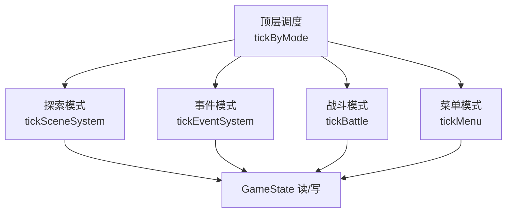
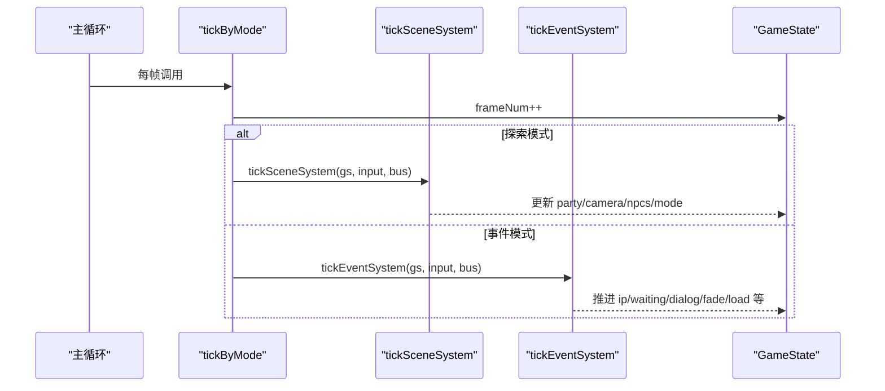
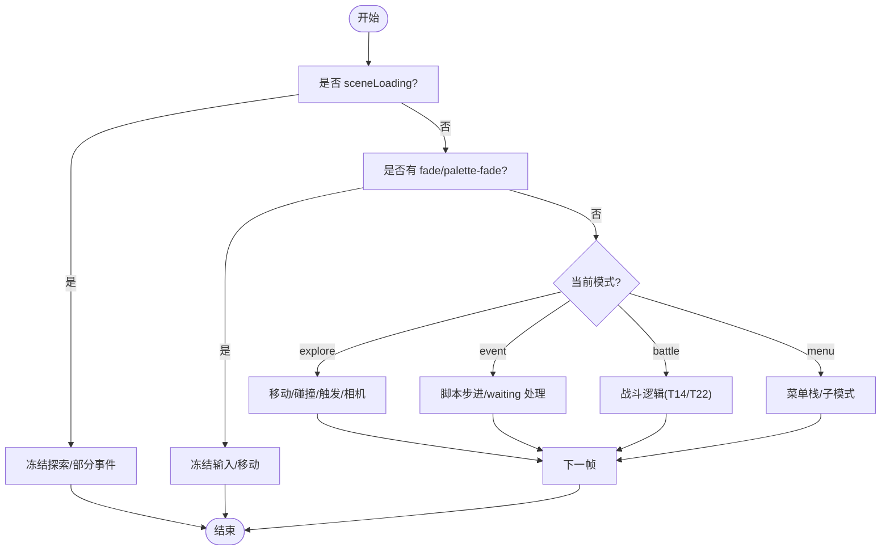
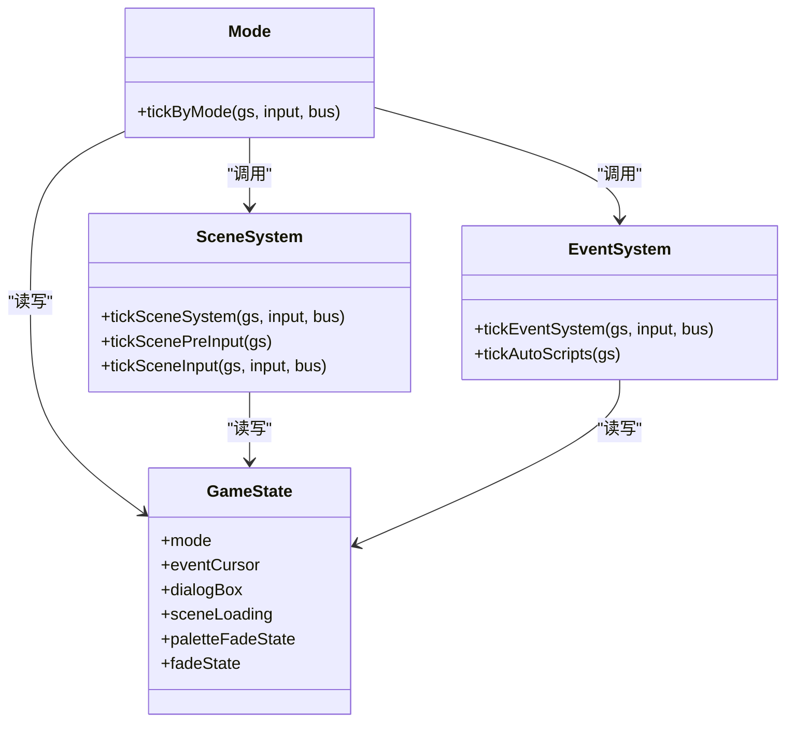

# 状态机 API

<cite>
**本文引用的文件**   
- [packages/game/src/core/mode.ts](file://packages/game/src/core/mode.ts)
- [packages/game/src/core/event-system.ts](file://packages/game/src/core/event-system.ts)
- [packages/game/src/core/scene-system.ts](file://packages/game/src/core/scene-system.ts)
- [packages/game/src/core/game-state.ts](file://packages/game/src/core/game-state.ts)
- [packages/game/src/shell/bootstrap.ts](file://packages/game/src/shell/bootstrap.ts)
</cite>

## 目录
1. [简介](#简介)
2. [项目结构](#项目结构)
3. [核心组件](#核心组件)
4. [架构总览](#架构总览)
5. [详细组件分析](#详细组件分析)
6. [依赖关系分析](#依赖关系分析)
7. [性能考量](#性能考量)
8. [故障排查指南](#故障排查指南)
9. [结论](#结论)
10. [附录：API 参考与示例](#附录api-参考与示例)

## 简介
本文件面向“状态机”相关 API，聚焦模式切换、事件监听、内置模式类型、转换守卫与前置检查、以及状态持久化与恢复。该状态机由顶层调度器按当前模式分发到对应子系统（探索、事件、战斗、菜单），并通过 GameState 作为单一真相源进行跨层共享。

## 项目结构
- 顶层模式调度：根据 gs.mode 分发到 tickSceneSystem / tickEventSystem / tickBattle / tickMenu。
- 事件系统：event 模式的协程式步进器，支持等待态、对话、淡入淡出、场景加载等异步流程。
- 场景系统：explore 模式输入处理、碰撞、自动触发、相机跟随、切 mode。
- 游戏状态：全局唯一状态对象，包含模式、脚本游标、对话框、特效状态、存档字段等。
- 启动引导：负责场景加载、onEnter 脚本执行、初始模式设置与过渡帧控制。

图表来源
- [packages/game/src/core/mode.ts:15-88](file://packages/game/src/core/mode.ts#L15-L88)
- [packages/game/src/core/scene-system.ts:575-584](file://packages/game/src/core/scene-system.ts#L575-L584)
- [packages/game/src/core/event-system.ts:1496-1505](file://packages/game/src/core/event-system.ts#L1496-L1505)

章节来源
- [packages/game/src/core/mode.ts:15-88](file://packages/game/src/core/mode.ts#L15-L88)
- [packages/game/src/core/scene-system.ts:575-584](file://packages/game/src/core/scene-system.ts#L575-L584)
- [packages/game/src/core/event-system.ts:1496-1505](file://packages/game/src/core/event-system.ts#L1496-L1505)

## 核心组件
- 顶层调度器 tickByMode：统一推进 frameNum，按模式分发；在特定条件下对 autoScript 和追逐计时器放行。
- 事件系统 tickEventSystem：event 模式主循环，支持多种 waiting 态（dialog、frame-wait、fade-screen、scene-load、palette-fade、scene-fade、delay、shop、rng-play、show-fbp、scroll-fbp、ending-anim、wait-key、quit、confirm、camera-pan）。
- 场景系统 tickSceneSystem：探索模式输入、碰撞、自动触发区检测、搜索交互、相机跟随、切 event 模式。
- 游戏状态 GameState：mode、eventCursor、dialogBox、fade/palette 状态、场景加载标志、存档字段等。

章节来源
- [packages/game/src/core/mode.ts:15-88](file://packages/game/src/core/mode.ts#L15-L88)
- [packages/game/src/core/event-system.ts:1496-1599](file://packages/game/src/core/event-system.ts#L1496-L1599)
- [packages/game/src/core/scene-system.ts:443-584](file://packages/game/src/core/scene-system.ts#L443-L584)
- [packages/game/src/core/game-state.ts:655-800](file://packages/game/src/core/game-state.ts#L655-L800)

## 架构总览
状态机以 GameState 为中心，顶层 tickByMode 每帧读取 input 并调用对应子系统。事件系统与场景系统通过 CommandBus 与外部模块解耦（如战斗、商店、RNG/FBP 播放、存档重载等通过注入的 handler 回调）。

图表来源
- [packages/game/src/core/mode.ts:15-88](file://packages/game/src/core/mode.ts#L15-L88)
- [packages/game/src/core/scene-system.ts:575-584](file://packages/game/src/core/scene-system.ts#L575-L584)
- [packages/game/src/core/event-system.ts:1496-1599](file://packages/game/src/core/event-system.ts#L1496-L1599)

## 详细组件分析

### 模式切换接口
- enterMode()
  - 说明：仓库未暴露名为 enterMode 的函数。进入某模式通常由子系统内部写入 gs.mode 并配合 cursor/waiting 完成。例如：
    - 探索→事件：场景系统在检测到 NPC 触发或 Confirm 调查后，构造 eventCursor 并将 gs.mode 设为 'event'。
    - 事件→探索：事件系统遇到 end 或无 cursor 时回退为 'explore'。
    - 事件→战斗：事件系统 startBattle 指令将 gs.mode 设为 'battle'。
    - 探索→菜单：输入 Menu 键打开 InGame 菜单，gs.menuStack 非空且 tickMenu 管理子模式。
  - 建议封装：如需对外提供 enterMode(targetMode)，可在 tickByMode 前做守卫校验（见下节）再委托子系统完成。
- exitMode()
  - 说明：仓库未暴露名为 exitMode 的函数。退出某模式通常由子系统清理自身上下文（如清 eventCursor、清 dialogBox、清 fade/palette 状态）并切回 explore。
- getCurrentMode()
  - 说明：直接读取 gs.mode 即可。

章节来源
- [packages/game/src/core/scene-system.ts:302-339](file://packages/game/src/core/scene-system.ts#L302-L339)
- [packages/game/src/core/event-system.ts:1496-1505](file://packages/game/src/core/event-system.ts#L1496-L1505)
- [packages/game/src/core/mode.ts:53-68](file://packages/game/src/core/mode.ts#L53-L68)
- [packages/game/src/core/game-state.ts:680](file://packages/game/src/core/game-state.ts#L680)

### 状态监听机制
- onModeChange 事件订阅
  - 说明：仓库未提供统一的 onModeChange 事件总线。推荐做法是在 tickByMode 中比较 prevMode 与 gs.mode，若变化则触发自定义回调（可注册到单例或注入式监听器）。
- 状态变化回调
  - 说明：可通过注入式回调在关键节点（如 scene-loading 结束、fade 完成、end 回到 explore）执行副作用。
- 异步状态转换
  - 说明：事件系统支持多种 waiting 态实现异步转换，如：
    - scene-load：等待 bootstrap 回调完成后再继续脚本。
    - palette-fade / scene-fade：时间驱动淡入淡出完成后 ip++ 继续。
    - rng-play / show-fbp / scroll-fbp / ending-anim：modal 全屏序列播完续跑。
    - wait-key / confirm：按键交互后继续。

章节来源
- [packages/game/src/core/event-system.ts:1563-1599](file://packages/game/src/core/event-system.ts#L1563-L1599)
- [packages/game/src/core/event-system.ts:1594-1599](file://packages/game/src/core/event-system.ts#L1594-L1599)
- [packages/game/src/core/mode.ts:15-50](file://packages/game/src/core/mode.ts#L15-L50)

### 内置模式类型与使用场景
- 探索模式（explore）
  - 职责：移动、碰撞、自动触发、搜索交互、相机跟随、淡入恢复。
  - 典型入口：loadScene 成功后默认 explore；事件脚本 end 返回 explore。
- 事件模式（event）
  - 职责：脚本步进、对话、淡入淡出、场景切换、商店/RNG/FBP 等 modal。
  - 典型入口：NPC 触发、Confirm 调查、startBattle 前/后的脚本。
- 战斗模式（battle）
  - 职责：回合制战斗逻辑（T14 stub，T22 真实现）。
  - 典型入口：事件脚本 startBattle；战后 resumePostBattleScript 接回事件脚本。
- 菜单模式（menu）
  - 职责：大世界菜单栈（InGame、装备、物品、法术、状态、商店等）。
  - 典型入口：按下 Menu 键或脚本打开商店菜单；栈空时自动切回 explore。

章节来源
- [packages/game/src/core/mode.ts:53-68](file://packages/game/src/core/mode.ts#L53-L68)
- [packages/game/src/core/scene-system.ts:575-584](file://packages/game/src/core/scene-system.ts#L575-L584)
- [packages/game/src/core/event-system.ts:1496-1505](file://packages/game/src/core/event-system.ts#L1496-L1505)
- [packages/game/src/core/game-state.ts:51](file://packages/game/src/core/game-state.ts#L51)

### 状态转换的守卫条件与前置检查
- 通用门控
  - sceneLoading：场景资源异步加载期间冻结探索与部分事件行为，避免花屏。
  - paletteFadeState / fadeState：淡入淡出进行中冻结输入与移动。
  - suspendRaf：全屏 modal 序列（AVI/RNG/FBP）暂停渲染循环。
- 探索→事件
  - 前置：NPC 处于可见状态且满足 triggerMode 距离阈值；或 Confirm 搜索命中。
  - 守卫：suppressAutoTriggerOnce 首帧跳过自动触发扫描，防止死锁。
- 事件→探索
  - 后置：end 指令清理 eventCursor/dialogBox，切回 explore；或无 cursor 时回退。
- 事件→战斗
  - 前置：startBattle 指令携带 enemyTeamId/isBoss；战后可用 postBattleResume 接回。
- 探索→菜单
  - 前置：Menu 键或快捷键；openMenu 推入 menuStack，tickMenu 管理子模式。

图表来源
- [packages/game/src/core/scene-system.ts:443-484](file://packages/game/src/core/scene-system.ts#L443-L484)
- [packages/game/src/core/event-system.ts:1507-1599](file://packages/game/src/core/event-system.ts#L1507-L1599)
- [packages/game/src/core/mode.ts:15-50](file://packages/game/src/core/mode.ts#L15-L50)

章节来源
- [packages/game/src/core/scene-system.ts:443-584](file://packages/game/src/core/scene-system.ts#L443-L584)
- [packages/game/src/core/event-system.ts:1507-1599](file://packages/game/src/core/event-system.ts#L1507-L1599)
- [packages/game/src/core/mode.ts:15-50](file://packages/game/src/core/mode.ts#L15-L50)

### 实际代码示例（路径引用）
- 监听状态变化
  - 在 tickByMode 中记录 prevMode，比较后触发自定义回调（参考 tickByMode 中的 prevMode 计算与分支）。
  - 参考路径：[packages/game/src/core/mode.ts:52-68](file://packages/game/src/core/mode.ts#L52-L68)
- 触发模式切换
  - 探索→事件：场景系统 loadEventFromNpc 设置 eventCursor 并切 mode='event'。
    - 参考路径：[packages/game/src/core/scene-system.ts:302-339](file://packages/game/src/core/scene-system.ts#L302-L339)
  - 事件→探索：事件系统 end 或无 cursor 时切回 explore。
    - 参考路径：[packages/game/src/core/event-system.ts:1496-1505](file://packages/game/src/core/event-system.ts#L1496-L1505)
  - 事件→战斗：事件系统 startBattle 指令（注入 handler）切 battle。
    - 参考路径：[packages/game/src/core/event-system.ts:817-837](file://packages/game/src/core/event-system.ts#L817-L837)
- 处理状态相关逻辑
  - 场景加载与 onEnter：bootstrap 中根据 onEnterLabel 设置 eventCursor 与 mode='event'，并在 skip-intro 或正常启动路径分别处理。
    - 参考路径：[packages/game/src/shell/bootstrap.ts:1542-1567](file://packages/game/src/shell/bootstrap.ts#L1542-L1567)

章节来源
- [packages/game/src/core/mode.ts:52-68](file://packages/game/src/core/mode.ts#L52-L68)
- [packages/game/src/core/scene-system.ts:302-339](file://packages/game/src/core/scene-system.ts#L302-L339)
- [packages/game/src/core/event-system.ts:1496-1505](file://packages/game/src/core/event-system.ts#L1496-L1505)
- [packages/game/src/core/event-system.ts:817-837](file://packages/game/src/core/event-system.ts#L817-L837)
- [packages/game/src/shell/bootstrap.ts:1542-1567](file://packages/game/src/shell/bootstrap.ts#L1542-L1567)

### 状态持久化与恢复机制
- 场景 onEnter 进度
  - 每个场景维护 sceneOnEnterIp（基于全局 ip），用于“开场 cutscene 只播一次，重进不重播”。
  - 参考路径：[packages/game/src/core/game-state.ts:1080-1096](file://packages/game/src/core/game-state.ts#L1080-L1096)
- 事件对象与全局对象表
  - allEventObjects 保存全量事件对象（NPC/宝箱/机关等），gs.npcs 是当前场景切片（引用同一数组，改动即持久）。
  - 参考路径：[packages/game/src/core/game-state.ts:1198-1210](file://packages/game/src/core/game-state.ts#L1198-L1210)
- 新游戏重置
  - resetSceneRuntimeForNewGame 清理上一局残留（rgScene、sceneOnEnterIp、rgObject、rgEventObject、allEventObjects 重建等）。
  - 参考路径：[packages/game/src/core/game-state.ts:1499-1526](file://packages/game/src/core/game-state.ts#L1499-L1526)
- 读档/重载
  - opcode 0x4E load-last-save：先淡黑，淡完触发 _loadLastSaveHandler(slot) 重载当前槽位。
  - 参考路径：[packages/game/src/core/event-system.ts:974-984](file://packages/game/src/core/event-system.ts#L974-L984)

章节来源
- [packages/game/src/core/game-state.ts:1080-1096](file://packages/game/src/core/game-state.ts#L1080-L1096)
- [packages/game/src/core/game-state.ts:1198-1210](file://packages/game/src/core/game-state.ts#L1198-L1210)
- [packages/game/src/core/game-state.ts:1499-1526](file://packages/game/src/core/game-state.ts#L1499-L1526)
- [packages/game/src/core/event-system.ts:974-984](file://packages/game/src/core/event-system.ts#L974-L984)

## 依赖关系分析
- 顶层调度器依赖各子系统 tick 函数，并通过 GameState 共享状态。
- 事件系统通过注入式 handler 与 shell/菜单/战斗等模块解耦（startBattle、shop、RNG/FBP、load-last-save、quit 等）。
- 场景系统依赖 tilemap、事件命令与 labelMap（setSceneContext），并与事件系统双向协作（autoScript、trigger）。

图表来源
- [packages/game/src/core/mode.ts:15-88](file://packages/game/src/core/mode.ts#L15-L88)
- [packages/game/src/core/scene-system.ts:575-584](file://packages/game/src/core/scene-system.ts#L575-L584)
- [packages/game/src/core/event-system.ts:1496-1505](file://packages/game/src/core/event-system.ts#L1496-L1505)
- [packages/game/src/core/game-state.ts:655-800](file://packages/game/src/core/game-state.ts#L655-L800)

章节来源
- [packages/game/src/core/mode.ts:15-88](file://packages/game/src/core/mode.ts#L15-L88)
- [packages/game/src/core/scene-system.ts:575-584](file://packages/game/src/core/scene-system.ts#L575-L584)
- [packages/game/src/core/event-system.ts:1496-1505](file://packages/game/src/core/event-system.ts#L1496-L1505)
- [packages/game/src/core/game-state.ts:655-800](file://packages/game/src/core/game-state.ts#L655-L800)

## 性能考量
- 单 tick 限制：事件系统对 goto 自环/无限 raw 链设置 SINGLE_TICK_LIMIT 保护，避免卡顿。
- 自动脚本门控：仅在允许窗口（frame-wait/scene-fade/camera-pan 等）运行 autoScript，减少无效计算。
- 淡入淡出时间驱动：palette-fade/scene-fade 使用 wall-clock 时长，不受逻辑帧率影响，保证一致体验。
- 场景加载冻结：sceneLoading 期间冻结探索与部分事件，避免花屏与重复触发。

章节来源
- [packages/game/src/core/event-system.ts:493](file://packages/game/src/core/event-system.ts#L493)
- [packages/game/src/core/mode.ts:38-50](file://packages/game/src/core/mode.ts#L38-L50)
- [packages/game/src/core/event-system.ts:1563-1599](file://packages/game/src/core/event-system.ts#L1563-L1599)
- [packages/game/src/core/game-state.ts:837-849](file://packages/game/src/core/game-state.ts#L837-L849)

## 故障排查指南
- 常见问题
  - 切场景后黑屏：确认 needToFadeIn 与 auto fade-in 消费点是否正确（explore 模式下 tickSceneAutoFadeIn）。
    - 参考路径：[packages/game/src/core/event-system.ts:645-671](file://packages/game/src/core/event-system.ts#L645-L671)
  - 对话显示异常或头像残留：检查 setDialogStyleX 与 ClearDialog 的 pendingFullClear/pendingPartialClear 分支。
    - 参考路径：[packages/game/src/core/event-system.ts:1193-1226](file://packages/game/src/core/event-system.ts#L1193-L1226)
  - 自动触发死锁：确保 suppressAutoTriggerOnce 在脚本结束首帧生效，避免立即再次触发。
    - 参考路径：[packages/game/src/core/scene-system.ts:443-465](file://packages/game/src/core/scene-system.ts#L443-L465)
  - 读档后行为异常：确认 currentSaveSlot 与 load-last-save 流程顺序（先淡黑再重载）。
    - 参考路径：[packages/game/src/core/event-system.ts:974-984](file://packages/game/src/core/event-system.ts#L974-L984)

章节来源
- [packages/game/src/core/event-system.ts:645-671](file://packages/game/src/core/event-system.ts#L645-L671)
- [packages/game/src/core/event-system.ts:1193-1226](file://packages/game/src/core/event-system.ts#L1193-L1226)
- [packages/game/src/core/scene-system.ts:443-465](file://packages/game/src/core/scene-system.ts#L443-L465)
- [packages/game/src/core/event-system.ts:974-984](file://packages/game/src/core/event-system.ts#L974-L984)

## 结论
状态机以 GameState 为核心，通过 tickByMode 统一调度，结合事件系统的多 waiting 态与场景系统的输入/碰撞/触发，实现了探索、事件、战斗、菜单四种模式的稳定流转。通过注入式 handler 与全局脚本数组，系统保持了良好的分层与可扩展性。建议在业务侧封装 enterMode/exitMode/getCurrentMode 并提供 onModeChange 监听，以便上层统一管理状态变更。

## 附录：API 参考与示例
- 模式切换
  - enterMode(targetMode)：建议封装，内部调用子系统完成上下文准备与 gs.mode 设置。
  - exitMode()：建议封装，内部清理 eventCursor/dialogBox/fade 等并切回 explore。
  - getCurrentMode()：返回 gs.mode。
- 状态监听
  - onModeChange(callback)：在 tickByMode 中比较 prevMode 与 gs.mode，变化时调用 callback(prev, next)。
- 示例路径
  - 探索→事件：[packages/game/src/core/scene-system.ts:302-339](file://packages/game/src/core/scene-system.ts#L302-L339)
  - 事件→探索：[packages/game/src/core/event-system.ts:1496-1505](file://packages/game/src/core/event-system.ts#L1496-L1505)
  - 事件→战斗：[packages/game/src/core/event-system.ts:817-837](file://packages/game/src/core/event-system.ts#L817-L837)
  - 场景加载与 onEnter：[packages/game/src/shell/bootstrap.ts:1542-1567](file://packages/game/src/shell/bootstrap.ts#L1542-L1567)

章节来源
- [packages/game/src/core/scene-system.ts:302-339](file://packages/game/src/core/scene-system.ts#L302-L339)
- [packages/game/src/core/event-system.ts:1496-1505](file://packages/game/src/core/event-system.ts#L1496-L1505)
- [packages/game/src/core/event-system.ts:817-837](file://packages/game/src/core/event-system.ts#L817-L837)
- [packages/game/src/shell/bootstrap.ts:1542-1567](file://packages/game/src/shell/bootstrap.ts#L1542-L1567)