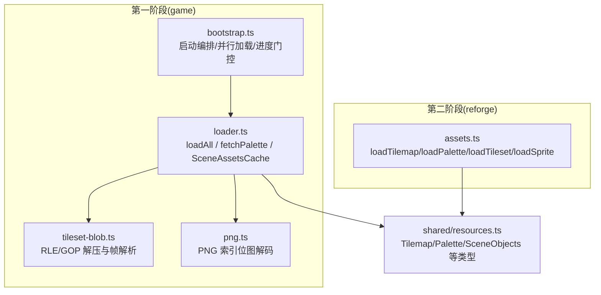
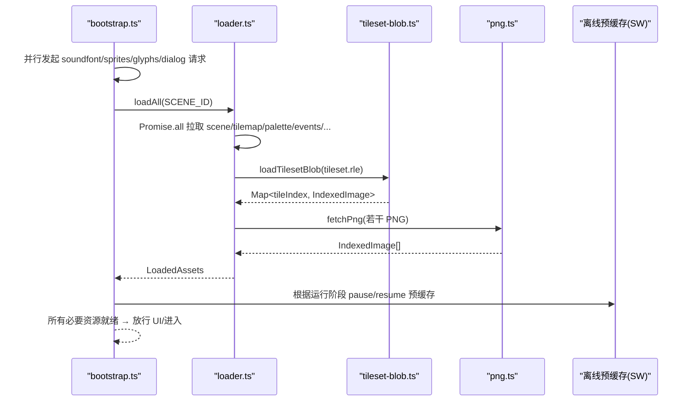
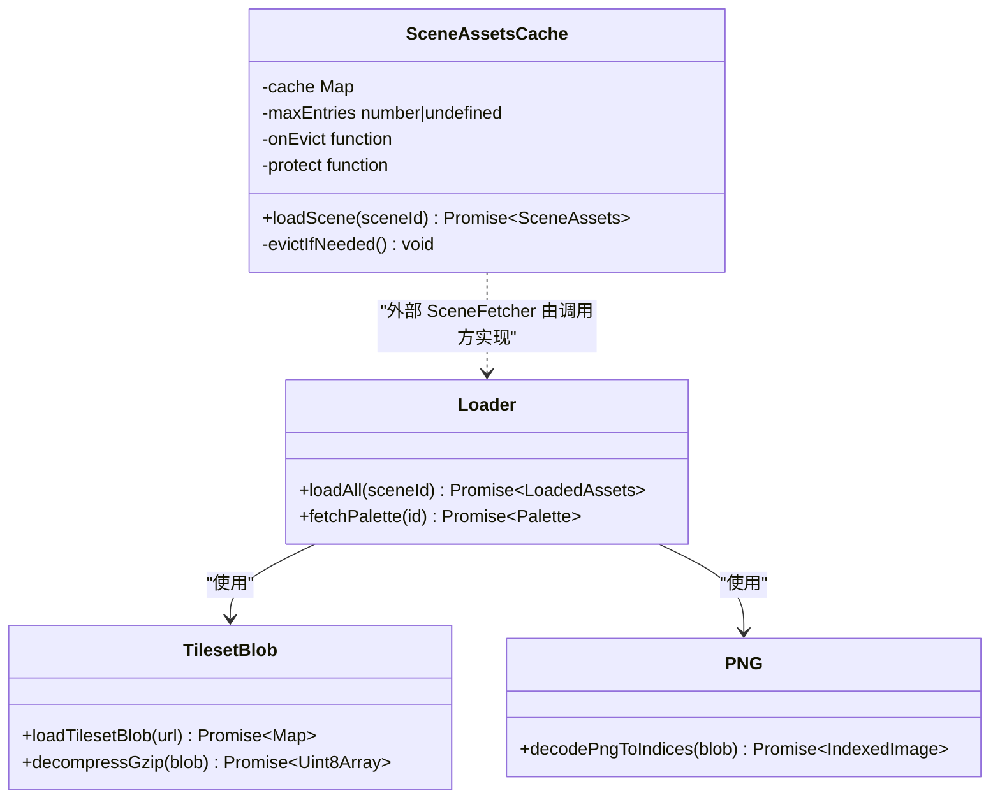
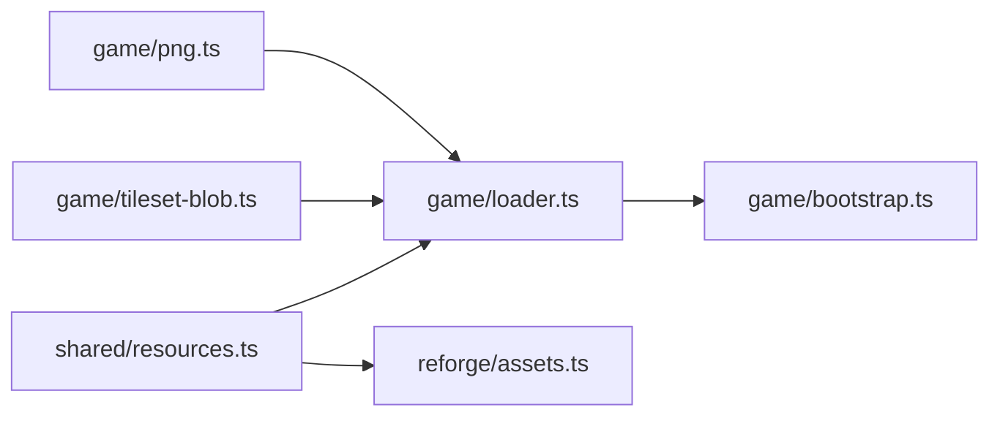

# 资源加载 API

<cite>
**本文引用的文件**
- [packages/game/src/assets/loader.ts](file://packages/game/src/assets/loader.ts)
- [packages/game/src/assets/png.ts](file://packages/game/src/assets/png.ts)
- [packages/game/src/assets/tileset-blob.ts](file://packages/game/src/assets/tileset-blob.ts)
- [packages/reforge/src/assets.ts](file://packages/reforge/src/assets.ts)
- [packages/shared/src/resources.ts](file://packages/shared/src/resources.ts)
- [packages/game/src/shell/bootstrap.ts](file://packages/game/src/shell/bootstrap.ts)
</cite>

## 目录
1. [简介](#简介)
2. [项目结构](#项目结构)
3. [核心组件](#核心组件)
4. [架构总览](#架构总览)
5. [详细组件分析](#详细组件分析)
6. [依赖关系分析](#依赖关系分析)
7. [性能与内存优化](#性能与内存优化)
8. [故障排查指南](#故障排查指南)
9. [结论](#结论)
10. [附录：API 参考](#附录api-参考)

## 简介
本文件面向“资源加载”相关 API，覆盖以下目标：
- 接口说明：loadAll()、fetchPalette()、SceneAssetsCache.loadScene()、以及 Reforge 的 loadTilemap()/loadPalette()/loadTileset()/loadSprite()。
- 现代资源格式支持：JSON 数据文件、PNG 索引位图、gzip RLE 精灵/瓦片 blob、音频/视频（由 bootstrap 层协调）。
- 异步加载机制：Promise 返回、错误处理；进度回调通过上层引导流程实现。
- 缓存策略：场景级 LRU 内存缓存、浏览器 HTTP 缓存、离线预缓存（Service Worker）协同。
- 实战示例路径：如何加载游戏资源、处理加载进度、管理资源生命周期。
- 优化建议与内存管理最佳实践。

## 项目结构
资源加载相关代码主要分布在两个包：
- 第一阶段（game）：负责运行时资源加载、解码与场景缓存。
- 第二阶段（reforge）：提供轻量工程资源加载器，复用 shared 类型与解码逻辑。

图表来源
- [packages/game/src/assets/loader.ts:135-390](file://packages/game/src/assets/loader.ts#L135-L390)
- [packages/game/src/assets/tileset-blob.ts:105-151](file://packages/game/src/assets/tileset-blob.ts#L105-L151)
- [packages/game/src/assets/png.ts:23-50](file://packages/game/src/assets/png.ts#L23-L50)
- [packages/reforge/src/assets.ts:24-63](file://packages/reforge/src/assets.ts#L24-L63)
- [packages/shared/src/resources.ts:8-42](file://packages/shared/src/resources.ts#L8-L42)

章节来源
- [packages/game/src/assets/loader.ts:135-390](file://packages/game/src/assets/loader.ts#L135-L390)
- [packages/game/src/assets/tileset-blob.ts:105-151](file://packages/game/src/assets/tileset-blob.ts#L105-L151)
- [packages/game/src/assets/png.ts:23-50](file://packages/game/src/assets/png.ts#L23-L50)
- [packages/reforge/src/assets.ts:24-63](file://packages/reforge/src/assets.ts#L24-L63)
- [packages/shared/src/resources.ts:8-42](file://packages/shared/src/resources.ts#L8-L42)

## 核心组件
- 场景资源聚合加载器
  - loadAll(sceneId): 并发拉取 JSON 清单、tilemap、调色板、事件、角色表、战斗数据、UI 图标等，并解码 tileset blob 与 NPC 精灵。
  - fetchPalette(id): 按 ID 动态获取调色板 JSON。
  - SceneAssetsCache: 场景级 LRU 缓存，保护当前渲染场景，淘汰时联动释放 tileImagesBySceneId。
- 二进制/图像解码
  - tileset-blob.ts: 统一 gzip RLE 解压 + parseSpriteChunk 解析为帧数组或 Map<tileIndex, IndexedImage>。
  - png.ts: PNG 索引位图解码为 indices + opaque mask。
- Reforge 工程加载器
  - loadTilemap/loadPalette/loadTileset/loadSprite: 基于 AssetBase 根路径的轻量加载函数，复用 shared 类型与 gzip 解压。

章节来源
- [packages/game/src/assets/loader.ts:135-390](file://packages/game/src/assets/loader.ts#L135-L390)
- [packages/game/src/assets/loader.ts:396-398](file://packages/game/src/assets/loader.ts#L396-L398)
- [packages/game/src/assets/loader.ts:451-499](file://packages/game/src/assets/loader.ts#L451-L499)
- [packages/game/src/assets/tileset-blob.ts:105-151](file://packages/game/src/assets/tileset-blob.ts#L105-L151)
- [packages/game/src/assets/png.ts:23-50](file://packages/game/src/assets/png.ts#L23-L50)
- [packages/reforge/src/assets.ts:24-63](file://packages/reforge/src/assets.ts#L24-L63)

## 架构总览
资源加载在启动期由 bootstrap 编排，采用 Promise.all 并行下载关键资源，并通过“可玩门”控制 UI 放行时机。

图表来源
- [packages/game/src/shell/bootstrap.ts:215-236](file://packages/game/src/shell/bootstrap.ts#L215-L236)
- [packages/game/src/assets/loader.ts:135-190](file://packages/game/src/assets/loader.ts#L135-L190)
- [packages/game/src/assets/tileset-blob.ts:142-151](file://packages/game/src/assets/tileset-blob.ts#L142-L151)
- [packages/game/src/assets/png.ts:43-48](file://packages/game/src/assets/png.ts#L43-L48)

## 详细组件分析

### 组件一：场景资源加载器（loader.ts）
- 职责
  - 聚合加载一个场景所需的全部资源（JSON 数据 + 瓦片/精灵/图标等），并返回结构化对象。
  - 提供场景级 LRU 缓存，避免重复加载与内存膨胀。
- 关键方法
  - loadAll(sceneId): 并发拉取 scene、tilemap、palette、events、playerRoles、战斗数据、UI 图标等；解码 tileset blob 与 NPC 精灵；构建 battle/magic/effect 等资源映射。
  - fetchPalette(id): 运行时按需切换调色板。
  - SceneAssetsCache.loadScene(sceneId): 命中则刷新 MRU；未命中则调用外部 SceneFetcher 拉取，并在超出上限时按 LRU 淘汰，同时触发 onEvict 清理关联缓存。
- 数据结构
  - LoadedAssets: 包含 tilemap、palette、scene、events、playerRoles、tileImages、characterSprites、battleSprites、battleBgs、effectSprite、magicSprites、items/spells/magics、uiSpriteFrames、itemIcons、levelUpExp/LevelUpMagic 等。
  - SceneAssets: 单场景元数据与命令集，供场景切换后同步呈现上下文。
- 错误处理
  - 对可选资源（如 object-players.json、words.json、fire-sprites.json、items-icons.json）采用 catch + warn 降级，不中断主流程。
- 典型调用路径
  - bootstrap 中 await loadAll(SCENE_ID)，随后注入到全局上下文与菜单系统。

图表来源
- [packages/game/src/assets/loader.ts:135-390](file://packages/game/src/assets/loader.ts#L135-L390)
- [packages/game/src/assets/loader.ts:451-499](file://packages/game/src/assets/loader.ts#L451-L499)
- [packages/game/src/assets/tileset-blob.ts:142-151](file://packages/game/src/assets/tileset-blob.ts#L142-L151)
- [packages/game/src/assets/png.ts:23-50](file://packages/game/src/assets/png.ts#L23-L50)

章节来源
- [packages/game/src/assets/loader.ts:135-390](file://packages/game/src/assets/loader.ts#L135-L390)
- [packages/game/src/assets/loader.ts:396-398](file://packages/game/src/assets/loader.ts#L396-L398)
- [packages/game/src/assets/loader.ts:451-499](file://packages/game/src/assets/loader.ts#L451-L499)

### 组件二：RLE/GOP 瓦片与精灵解码（tileset-blob.ts）
- 职责
  - 将 gzip 压缩的 sprite/RLE blob 解压并解析为帧序列或瓦片映射。
  - 兼容 Content-Encoding 双解压防御：若上游已解（无 gzip 魔数），直接返回原始字节。
- 关键方法
  - decompressGzip(blob): 使用浏览器 DecompressionStream('gzip') 流式解压。
  - loadTilesetBlob(url): 拉取 .rle → 解压 → 解析为 Map<tileIndex, IndexedImage>。
  - loadSpriteFramesBlob(url): 拉取 .rle → 解压 → 解析为 IndexedImage[]。
- 复杂度与性能
  - I/O 为主，CPU 集中在 gzip 解压与帧解析；流式读取降低峰值内存占用。
- 兼容性
  - 要求现代浏览器（Chrome 80+/Safari 16.4+/Firefox 113+）；缺失环境抛错提示。

章节来源
- [packages/game/src/assets/tileset-blob.ts:105-151](file://packages/game/src/assets/tileset-blob.ts#L105-L151)

### 组件三：PNG 索引位图解码（png.ts）
- 职责
  - 将 pal-extract 产出的 RGBA 索引位图 PNG 解码为 indices + opaque 掩码，确保透明通道正确。
- 关键点
  - 使用 createImageBitmap + Canvas 2D 提取像素，A 通道 > 0 视为不透明。
  - 返回 IndexedImage 供 blit 端按 opaque 判定透明。

章节来源
- [packages/game/src/assets/png.ts:23-50](file://packages/game/src/assets/png.ts#L23-L50)

### 组件四：Reforge 工程资源加载器（reforge/assets.ts）
- 职责
  - 提供轻量化的 tilemap/palette/tileset/sprite 加载函数，适配新引擎 demo。
- 关键方法
  - loadTilemap(base, mapNum): 拉取 JSON tilemap。
  - loadPalette(base, palId): 拉取 JSON palette。
  - loadTileset(base, mapNum): 拉取 .rle → 解压 → parseSpriteChunk → Map<index, frame>。
  - loadSprite(base, spriteNum): 拉取 .rle → 解压 → 帧 + 锚点。
  - decompressGzip(blob): 与 game 同源的 gzip 解压实现。

章节来源
- [packages/reforge/src/assets.ts:24-63](file://packages/reforge/src/assets.ts#L24-L63)
- [packages/reforge/src/assets.ts:69-94](file://packages/reforge/src/assets.ts#L69-L94)

### 组件五：启动编排与进度门控（bootstrap.ts）
- 职责
  - 并行加载 soundfont、字体、对话资产与首屏场景资源；失败降级不影响可运行性。
  - 通过“可玩门”控制 UI 放行时机，保障用户体验。
- 进度与门控
  - 进度：上层 loading 页面统计 fetch 完成度；当必要资源就绪后显示“进入游戏”。
  - 门控：等待 soundfontSettled、loadAll、loadGlyphs、loadDialogAssets 全部 settle 后再放行。
- 场景切换
  - 使用 SceneAssetsCache 进行场景级 LRU 缓存，保护当前场景不被淘汰，淘汰时联动释放 tileImagesBySceneId。

章节来源
- [packages/game/src/shell/bootstrap.ts:215-236](file://packages/game/src/shell/bootstrap.ts#L215-L236)
- [packages/game/src/shell/bootstrap.ts:556-628](file://packages/game/src/shell/bootstrap.ts#L556-L628)

## 依赖关系分析
- loader.ts 依赖：
  - shared/resources.ts：Tilemap、Palette、SceneObjects 等类型定义。
  - tileset-blob.ts：RLE/GOP 解压与帧解析。
  - png.ts：PNG 索引位图解码。
- bootstrap.ts 依赖：
  - loader.ts：loadAll、SceneAssetsCache、fetchPalette。
  - tileset-blob.ts：按需补载 tileset blob。
  - png.ts：部分 PNG 资源解码。
- reforge/assets.ts 依赖：
  - shared/resources.ts：类型定义。
  - 浏览器原生 DecompressionStream：gzip 解压。

图表来源
- [packages/shared/src/resources.ts:8-42](file://packages/shared/src/resources.ts#L8-L42)
- [packages/game/src/assets/loader.ts:135-190](file://packages/game/src/assets/loader.ts#L135-L190)
- [packages/game/src/assets/tileset-blob.ts:142-151](file://packages/game/src/assets/tileset-blob.ts#L142-L151)
- [packages/game/src/assets/png.ts:23-50](file://packages/game/src/assets/png.ts#L23-L50)
- [packages/reforge/src/assets.ts:24-63](file://packages/reforge/src/assets.ts#L24-L63)

章节来源
- [packages/shared/src/resources.ts:8-42](file://packages/shared/src/resources.ts#L8-L42)
- [packages/game/src/assets/loader.ts:135-190](file://packages/game/src/assets/loader.ts#L135-L190)
- [packages/game/src/assets/tileset-blob.ts:142-151](file://packages/game/src/assets/tileset-blob.ts#L142-L151)
- [packages/game/src/assets/png.ts:23-50](file://packages/game/src/assets/png.ts#L23-L50)
- [packages/reforge/src/assets.ts:24-63](file://packages/reforge/src/assets.ts#L24-L63)

## 性能与内存优化
- 并发与去重
  - 大量资源通过 Promise.all 并发拉取；对 manifest 驱动的资源（如 battle sprites、magic chunks）仅加载被引用子集，避免全量下载。
- 传输与解码
  - 瓦片与精灵采用 gzip RLE 单 blob 替代多 PNG，显著减少请求数与解码开销。
  - 使用浏览器原生 DecompressionStream 流式解压，降低峰值内存。
- 缓存策略
  - 场景级 LRU 内存缓存（默认保留最近 N 个场景），保护当前场景不被淘汰；淘汰时联动释放 tileImagesBySceneId，防止内存泄漏。
  - 浏览器 HTTP 缓存：静态资源（JSON/PNG/.rle）由服务器与浏览器缓存共同作用。
  - 离线预缓存：Service Worker 在后台预取，modal 播放期间暂停预缓存以避免带宽竞争。
- 渐进与降级
  - 可选资源缺失时 warn 并降级（如 words.json、object-players.json、fire-sprites.json），保证核心玩法可用。

[本节为通用指导，无需源码引用]

## 故障排查指南
- 常见错误与定位
  - fetch 失败（HTTP 非 ok）：检查资源路径与服务器配置，确认 /extracted 软链与静态资源可达。
  - gzip 解压失败：确认服务端未二次添加 Content-Encoding；必要时启用“双解压防御”分支。
  - PNG 解码异常：确认 PNG 为 RGBA 索引位图格式，且 A 通道语义正确。
  - 场景黑屏：检查 SceneAssetsCache 的 protect 是否指向当前场景，onEvict 是否正确清理 tileImagesBySceneId。
- 日志与降级
  - 多处 console.warn 用于记录可选资源缺失与跳过项，便于快速定位问题范围。
- 调试建议
  - 使用 dev 面板查看缩略图渲染与场景跳转，验证 tileset 与 NPC 精灵是否按需加载。
  - 观察网络面板，确认 .rle 与 JSON 的请求数量与大小是否符合预期。

章节来源
- [packages/game/src/assets/loader.ts:229-311](file://packages/game/src/assets/loader.ts#L229-L311)
- [packages/game/src/assets/tileset-blob.ts:105-135](file://packages/game/src/assets/tileset-blob.ts#L105-L135)
- [packages/game/src/assets/png.ts:23-50](file://packages/game/src/assets/png.ts#L23-L50)
- [packages/game/src/shell/bootstrap.ts:556-628](file://packages/game/src/shell/bootstrap.ts#L556-L628)

## 结论
本资源加载体系以“并发拉取 + 流式解压 + 场景级 LRU 缓存”为核心，兼顾性能与稳定性。通过 manifest 驱动的按需加载与完善的降级策略，在保证可运行性的前提下最大化用户体验。结合浏览器与 Service Worker 的缓存能力，可实现首屏快速与离线可玩的目标。

[本节为总结，无需源码引用]

## 附录：API 参考

### 第一阶段（game）
- loadAll(sceneId: number): Promise<LoadedAssets>
  - 功能：加载首屏场景所需全部资源（JSON + 瓦片 + 精灵 + 图标等）。
  - 返回：LoadedAssets 对象，含 tilemap、palette、scene、events、playerRoles、tileImages、characterSprites、battleSprites、battleBgs、effectSprite、magicSprites、items/spells/magics、uiSpriteFrames、itemIcons、levelUpExp/LevelUpMagic 等。
  - 错误：可选资源缺失会 warn 并降级，不抛错中断。
  - 参考路径：[packages/game/src/assets/loader.ts:135-390](file://packages/game/src/assets/loader.ts#L135-L390)
- fetchPalette(id: number): Promise<Palette>
  - 功能：按 ID 拉取调色板 JSON。
  - 参考路径：[packages/game/src/assets/loader.ts:396-398](file://packages/game/src/assets/loader.ts#L396-L398)
- SceneAssetsCache.loadScene(sceneId: number): Promise<SceneAssets>
  - 功能：场景级 LRU 缓存加载；命中刷新 MRU；未命中调用外部 SceneFetcher；超限按 LRU 淘汰并触发 onEvict。
  - 参考路径：[packages/game/src/assets/loader.ts:451-499](file://packages/game/src/assets/loader.ts#L451-L499)

### 第二阶段（reforge）
- loadTilemap(base: AssetBase, mapNum: number): Promise<Tilemap>
  - 功能：拉取 JSON tilemap。
  - 参考路径：[packages/reforge/src/assets.ts:24-26](file://packages/reforge/src/assets.ts#L24-L26)
- loadPalette(base: AssetBase, palId: number): Promise<Palette>
  - 功能：拉取 JSON palette。
  - 参考路径：[packages/reforge/src/assets.ts:28-30](file://packages/reforge/src/assets.ts#L28-L30)
- loadTileset(base: AssetBase, mapNum: number): Promise<Map<number, RleFrame>>
  - 功能：拉取 .rle → 解压 → parseSpriteChunk → Map<index, frame>。
  - 参考路径：[packages/reforge/src/assets.ts:33-43](file://packages/reforge/src/assets.ts#L33-L43)
- loadSprite(base: AssetBase, spriteNum: number): Promise<LoadedSprite>
  - 功能：拉取 .rle → 解压 → 帧 + 锚点。
  - 参考路径：[packages/reforge/src/assets.ts:53-63](file://packages/reforge/src/assets.ts#L53-L63)

### 辅助解码
- decompressGzip(blob: Blob): Promise<Uint8Array>
  - 功能：浏览器原生 gzip 解压，兼容上游已解压情况。
  - 参考路径（game）：[packages/game/src/assets/tileset-blob.ts:105-135](file://packages/game/src/assets/tileset-blob.ts#L105-L135)
  - 参考路径（reforge）：[packages/reforge/src/assets.ts:69-94](file://packages/reforge/src/assets.ts#L69-L94)
- decodePngToIndices(source: Blob): Promise<IndexedImage>
  - 功能：PNG 索引位图解码为 indices + opaque。
  - 参考路径：[packages/game/src/assets/png.ts:23-50](file://packages/game/src/assets/png.ts#L23-L50)

### 类型定义（shared）
- Tilemap、Palette、SceneObjects、EnemyPosTable 等
  - 参考路径：[packages/shared/src/resources.ts:8-42](file://packages/shared/src/resources.ts#L8-L42)