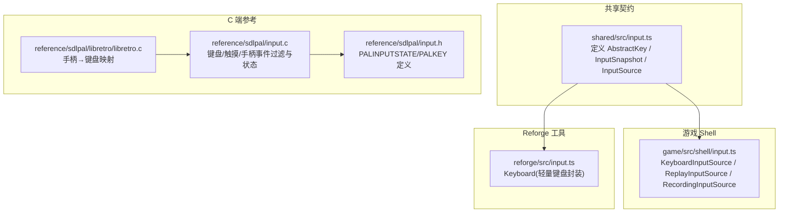
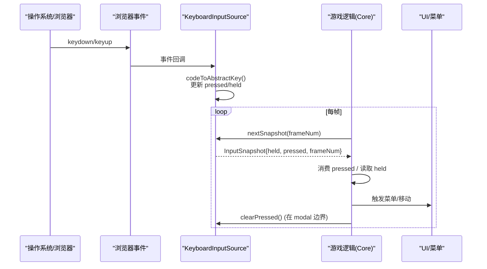
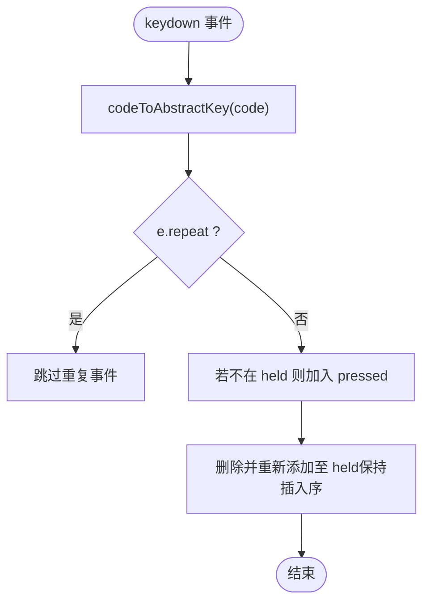
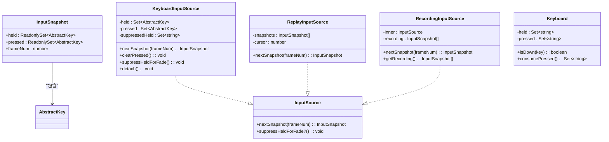

# 输入系统 API

<cite>
**本文引用的文件**
- [packages/shared/src/input.ts](file://packages/shared/src/input.ts)
- [packages/game/src/shell/input.ts](file://packages/game/src/shell/input.ts)
- [packages/reforge/src/input.ts](file://packages/reforge/src/input.ts)
- [reference/sdlpal/input.c](file://reference/sdlpal/input.c)
- [reference/sdlpal/input.h](file://reference/sdlpal/input.h)
- [reference/sdlpal/libretro/libretro.c](file://reference/sdlpal/libretro/libretro.c)
</cite>

## 目录
1. [简介](#简介)
2. [项目结构](#项目结构)
3. [核心组件](#核心组件)
4. [架构总览](#架构总览)
5. [详细组件分析](#详细组件分析)
6. [依赖关系分析](#依赖关系分析)
7. [性能与延迟优化](#性能与延迟优化)
8. [故障排查指南](#故障排查指南)
9. [结论](#结论)
10. [附录：API 参考](#附录api-参考)

## 简介
本文件为输入系统的 API 文档，聚焦以下目标：
- 输入处理接口：注册输入源、获取每帧输入快照、清理输入状态等。
- 按键映射机制：键盘事件、鼠标事件、触摸事件的统一抽象。
- 输入快照机制：每帧捕获、去重、组合键与方向优先级。
- 支持设备：键盘、鼠标、触摸屏、手柄（libretro/SDL）。
- 跨平台兼容性与输入延迟优化策略。
- 实际使用示例路径，展示如何注册输入处理器、获取当前输入状态、处理用户交互。

## 项目结构
输入系统采用“共享契约 + Shell 实现”的分层设计：
- shared 层定义抽象类型与接口（AbstractKey、InputSnapshot、InputSource）。
- game shell 层提供浏览器键盘输入源及录制/回放包装器。
- reforge 子包提供轻量键盘工具类（独立于游戏主循环）。
- reference/sdlpal 提供 C 端 SDL 输入、触摸、手柄的原始行为与映射，作为对齐基准。

图表来源
- [packages/shared/src/input.ts:1-54](file://packages/shared/src/input.ts#L1-L54)
- [packages/game/src/shell/input.ts:1-165](file://packages/game/src/shell/input.ts#L1-L165)
- [packages/reforge/src/input.ts:1-42](file://packages/reforge/src/input.ts#L1-L42)
- [reference/sdlpal/input.c:1-200](file://reference/sdlpal/input.c#L1-L200)
- [reference/sdlpal/input.h:1-106](file://reference/sdlpal/input.h#L1-L106)
- [reference/sdlpal/libretro/libretro.c:259-292](file://reference/sdlpal/libretro/libretro.c#L259-L292)

章节来源
- [packages/shared/src/input.ts:1-54](file://packages/shared/src/input.ts#L1-L54)
- [packages/game/src/shell/input.ts:1-165](file://packages/game/src/shell/input.ts#L1-L165)
- [packages/reforge/src/input.ts:1-42](file://packages/reforge/src/input.ts#L1-L42)
- [reference/sdlpal/input.c:1-200](file://reference/sdlpal/input.c#L1-L200)
- [reference/sdlpal/input.h:1-106](file://reference/sdlpal/input.h#L1-L106)
- [reference/sdlpal/libretro/libretro.c:259-292](file://reference/sdlpal/libretro/libretro.c#L259-L292)

## 核心组件
- 抽象类型与接口
  - AbstractKey：与 sdlpal kKey* 一一对应的字符串枚举，屏蔽物理键差异。
  - InputSnapshot：每帧输入快照，包含 held（按住）、pressed（边沿按下）与 frameNum。
  - InputSource：输入源抽象，nextSnapshot(frameNum) 返回快照；可选 suppressHeldForFade() 用于场景渐变期间抑制方向键。
- 具体实现
  - KeyboardInputSource：浏览器键盘事件 → AbstractKey，维护 pressed/held，支持 fade 抑制与 clearPressed。
  - ReplayInputSource：按序回放预录快照。
  - RecordingInputSource：对任意 InputSource 进行录制包装。
  - Keyboard（reforge）：轻量键盘封装，提供 isDown()/consumePressed()。

章节来源
- [packages/shared/src/input.ts:1-54](file://packages/shared/src/input.ts#L1-L54)
- [packages/game/src/shell/input.ts:1-165](file://packages/game/src/shell/input.ts#L1-L165)
- [packages/reforge/src/input.ts:1-42](file://packages/reforge/src/input.ts#L1-L42)

## 架构总览
输入数据流从底层事件到上层消费的关键路径如下：

图表来源
- [packages/game/src/shell/input.ts:67-135](file://packages/game/src/shell/input.ts#L67-L135)
- [packages/shared/src/input.ts:25-53](file://packages/shared/src/input.ts#L25-L53)

## 详细组件分析

### 抽象契约：AbstractKey / InputSnapshot / InputSource
- AbstractKey
  - 覆盖方向、确认/取消、菜单、翻页、Home/End、战斗与大世界专用键。
  - 与 sdlpal input.h 中 PALKEY 位域一一对应，确保语义一致。
- InputSnapshot
  - held：持续按住集合（用于移动/连续动作）。
  - pressed：本 tick 新按下集合（用于菜单选择/确认）。
  - frameNum：帧号，便于回放与日志对齐。
- InputSource
  - nextSnapshot(frameNum)：由主循环驱动，返回当前帧快照。
  - suppressHeldForFade?()：仅在特定场景渐变时调用，抑制方向键并清空 pressed，避免误触。

章节来源
- [packages/shared/src/input.ts:1-54](file://packages/shared/src/input.ts#L1-L54)
- [reference/sdlpal/input.h:28-61](file://reference/sdlpal/input.h#L28-L61)

### 键盘输入源：KeyboardInputSource
- 功能要点
  - 物理键码 → AbstractKey 映射表，严格遵循 sdlpal 真值键集。
  - 忽略 repeat 事件，保证“后按优先”的方向选择语义。
  - 维护 pressed/held 两个集合，nextSnapshot 返回后清空 pressed。
  - 支持 suppressHeldForFade()：在 palette fade 期间将方向键加入抑制集，直到物理松开再解除。
  - clearPressed()：等价 sdlpal PAL_ClearKeyState，用于 modal 边界清理未消费的 pressed。
- 关键流程
  - keydown：若 e.repeat 则跳过；否则将键加入 pressed 与 held，并保持插入顺序以体现“后按优先”。
  - keyup：从 held 与 suppressedHeld 移除对应键。
  - nextSnapshot：构造快照，清空 pressed，返回给调用方。

图表来源
- [packages/game/src/shell/input.ts:67-104](file://packages/game/src/shell/input.ts#L67-L104)

章节来源
- [packages/game/src/shell/input.ts:17-65](file://packages/game/src/shell/input.ts#L17-L65)
- [packages/game/src/shell/input.ts:67-135](file://packages/game/src/shell/input.ts#L67-L135)

### 录制与回放：RecordingInputSource / ReplayInputSource
- RecordingInputSource：包装任意 InputSource，记录每次 nextSnapshot 的结果，供后续导出或回放。
- ReplayInputSource：按序返回预录快照，超出范围时返回空快照。

章节来源
- [packages/game/src/shell/input.ts:137-164](file://packages/game/src/shell/input.ts#L137-L164)

### 轻量键盘工具：Keyboard（reforge）
- 提供 isDown(key)/consumePressed()，阻止默认滚动与刷新热键。
- 适用于非主循环场景的快速键盘访问。

章节来源
- [packages/reforge/src/input.ts:1-42](file://packages/reforge/src/input.ts#L1-L42)

### 触摸与鼠标：C 端参考实现
- 触摸区域判定与动作映射：将屏幕坐标划分为方向区与按钮区，设置 dwKeyPress/dir。
- 多点触控：跟踪两指 finger1/finger2，支持重复触发与移动切换区域。
- 鼠标事件：通过事件过滤器将点击映射为等效按键（如菜单/搜索）。

章节来源
- [reference/sdlpal/input.c:868-1110](file://reference/sdlpal/input.c#L868-L1110)

### 手柄输入：libretro 映射
- 将 libretro 手柄按键映射为 SDL 键盘扫描码，注入 SDL_PrivateKeyboard，从而复用键盘输入管线。

章节来源
- [reference/sdlpal/libretro/libretro.c:259-292](file://reference/sdlpal/libretro/libretro.c#L259-L292)

## 依赖关系分析
- 耦合与内聚
  - shared 层仅暴露类型与接口，无外部依赖，内聚度高。
  - game shell 层依赖 shared 契约，实现浏览器键盘输入源，并通过录制/回放包装增强可测试性。
  - reforge 工具独立，不依赖游戏主循环，适合小范围快速接入。
- 外部依赖
  - 浏览器事件模型（keydown/keyup）。
  - C 端参考：SDL 事件、触摸、手柄，作为行为对齐基准。

图表来源
- [packages/shared/src/input.ts:1-54](file://packages/shared/src/input.ts#L1-L54)
- [packages/game/src/shell/input.ts:67-164](file://packages/game/src/shell/input.ts#L67-L164)
- [packages/reforge/src/input.ts:1-42](file://packages/reforge/src/input.ts#L1-L42)

章节来源
- [packages/shared/src/input.ts:1-54](file://packages/shared/src/input.ts#L1-L54)
- [packages/game/src/shell/input.ts:67-164](file://packages/game/src/shell/input.ts#L67-L164)
- [packages/reforge/src/input.ts:1-42](file://packages/reforge/src/input.ts#L1-L42)

## 性能与延迟优化
- 事件过滤与去重
  - 忽略 e.repeat，避免重复事件导致 pressed 污染与方向优先级错乱。
  - 使用 Set 管理 pressed/held，O(1) 增删查，减少每帧开销。
- 方向优先级
  - 通过 delete-then-add 维持插入序，确保“后按优先”，无需额外排序。
- 渐变抑制
  - 在 palette fade 期间抑制方向键，避免误触导致的意外移动。
- 跨模态清理
  - 在 modal 边界调用 clearPressed()，防止残留 pressed 被误读。
- 回放与录制
  - 通过 RecordingInputSource 收集快照，ReplayInputSource 精确回放，提升调试与回归效率。

[本节为通用指导，不直接分析具体文件]

## 故障排查指南
- 症状：按住方向键后进入菜单仍自动移动
  - 检查是否在场景渐变期间调用了 suppressHeldForFade()，并在 keyup 后正确解除抑制。
  - 确认在 modal 边界调用了 clearPressed()，避免 pressed 残留。
- 症状：WASD 无法控制方向
  - 这是预期行为：WASD 在原版中分别映射为 ThrowItem/Auto/Status/Defend，方向由方向键与小键盘控制。
- 症状：触屏操作无效
  - 参考 C 端触摸区域判定与动作映射，确认坐标归一化与区域划分是否正确。
- 症状：手柄按键无响应
  - 检查 libretro 映射是否将手柄键正确注入 SDL 键盘事件。

章节来源
- [packages/game/src/shell/input.ts:106-135](file://packages/game/src/shell/input.ts#L106-L135)
- [reference/sdlpal/input.c:868-1110](file://reference/sdlpal/input.c#L868-L1110)
- [reference/sdlpal/libretro/libretro.c:259-292](file://reference/sdlpal/libretro/libretro.c#L259-L292)

## 结论
本输入系统通过共享契约与 Shell 实现解耦，实现了键盘/鼠标/触摸/手柄的统一抽象与稳定快照机制。配合录制/回放能力与渐变抑制策略，既保证了与原版的语义一致性，又提升了可测试性与用户体验。

[本节为总结，不直接分析具体文件]

## 附录：API 参考

### 输入处理接口
- registerInputHandler()
  - 说明：仓库未提供该函数名。推荐使用 InputSource 抽象，通过实例化 KeyboardInputSource/ReplayInputSource/RecordingInputSource 并交由主循环调用 nextSnapshot(frameNum) 完成注册与消费。
  - 替代方案：在主循环初始化时创建具体 InputSource 实例，并在每帧调用 nextSnapshot。
- getInputState()
  - 说明：仓库未提供该函数名。请使用 InputSource.nextSnapshot(frameNum) 获取 InputSnapshot，其中包含 held 与 pressed。
- clearInput()
  - 说明：仓库未提供该函数名。请使用 KeyboardInputSource.clearPressed() 清理未消费的 pressed，或在需要时结合 suppressHeldForFade() 处理渐变抑制。

章节来源
- [packages/shared/src/input.ts:42-53](file://packages/shared/src/input.ts#L42-L53)
- [packages/game/src/shell/input.ts:120-135](file://packages/game/src/shell/input.ts#L120-L135)

### 按键映射机制
- 键盘事件
  - 代码位置：packages/game/src/shell/input.ts 中的 CODE_MAP 与 codeToAbstractKey。
  - 行为：忽略 repeat，维护 pressed/held，支持 fade 抑制与 clearPressed。
- 鼠标事件
  - 参考：reference/sdlpal/input.c 中的鼠标事件过滤器，将点击映射为等效按键。
- 触摸事件
  - 参考：reference/sdlpal/input.c 中的触摸区域判定与动作映射，支持多点触控与重复触发。

章节来源
- [packages/game/src/shell/input.ts:17-65](file://packages/game/src/shell/input.ts#L17-L65)
- [reference/sdlpal/input.c:868-1110](file://reference/sdlpal/input.c#L868-L1110)

### 输入快照机制
- 每帧捕获：InputSource.nextSnapshot(frameNum) 返回 InputSnapshot。
- 输入去重：忽略 repeat 事件，Set 结构天然去重。
- 组合键与方向优先级：通过插入序保证“后按优先”，无需额外排序。

章节来源
- [packages/shared/src/input.ts:25-53](file://packages/shared/src/input.ts#L25-L53)
- [packages/game/src/shell/input.ts:67-104](file://packages/game/src/shell/input.ts#L67-L104)

### 支持的输入设备
- 键盘：KeyboardInputSource
- 鼠标：C 端参考实现（input.c）
- 触摸屏：C 端参考实现（input.c）
- 手柄：libretro 映射（libretro.c）

章节来源
- [packages/game/src/shell/input.ts:67-135](file://packages/game/src/shell/input.ts#L67-L135)
- [reference/sdlpal/input.c:868-1110](file://reference/sdlpal/input.c#L868-L1110)
- [reference/sdlpal/libretro/libretro.c:259-292](file://reference/sdlpal/libretro/libretro.c#L259-L292)

### 使用示例（路径引用）
- 注册输入处理器
  - 示例路径：packages/game/src/shell/input.ts 中 KeyboardInputSource 构造函数与 nextSnapshot 用法。
- 获取当前输入状态
  - 示例路径：packages/shared/src/input.ts 中 InputSnapshot 字段；packages/game/src/shell/input.ts 中 nextSnapshot 返回快照。
- 处理用户交互
  - 示例路径：packages/game/src/shell/input.ts 中 clearPressed() 与 suppressHeldForFade() 的使用位置。

章节来源
- [packages/game/src/shell/input.ts:90-135](file://packages/game/src/shell/input.ts#L90-L135)
- [packages/shared/src/input.ts:25-53](file://packages/shared/src/input.ts#L25-L53)

### 跨平台兼容性与延迟优化
- 跨平台兼容
  - 通过 AbstractKey 屏蔽物理键差异；C 端参考确保行为对齐。
- 延迟优化
  - 忽略 repeat、Set O(1) 操作、fade 抑制、modal 边界清理，降低误触与额外计算。

章节来源
- [packages/shared/src/input.ts:1-54](file://packages/shared/src/input.ts#L1-L54)
- [packages/game/src/shell/input.ts:67-135](file://packages/game/src/shell/input.ts#L67-L135)