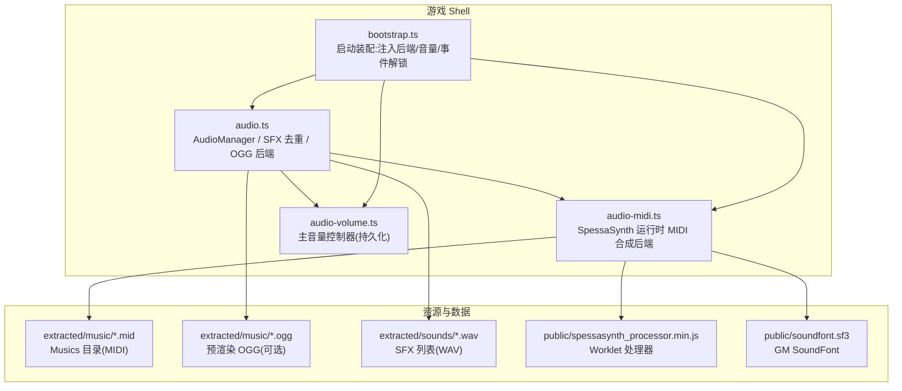
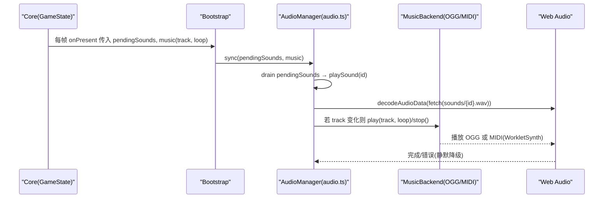
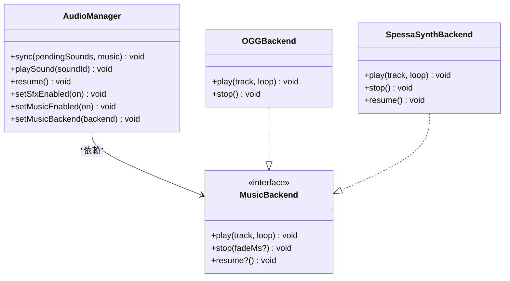
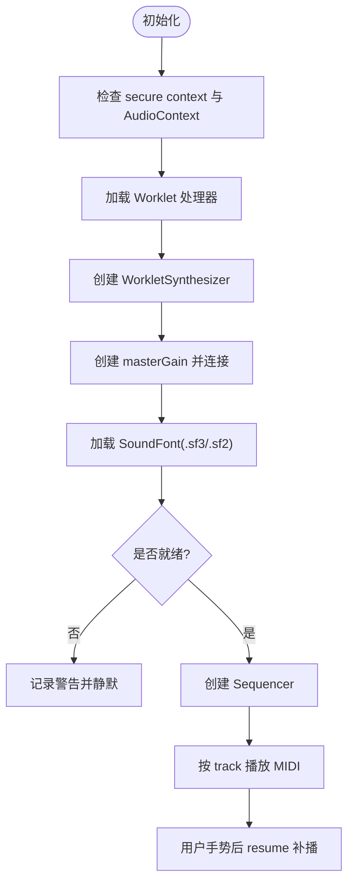
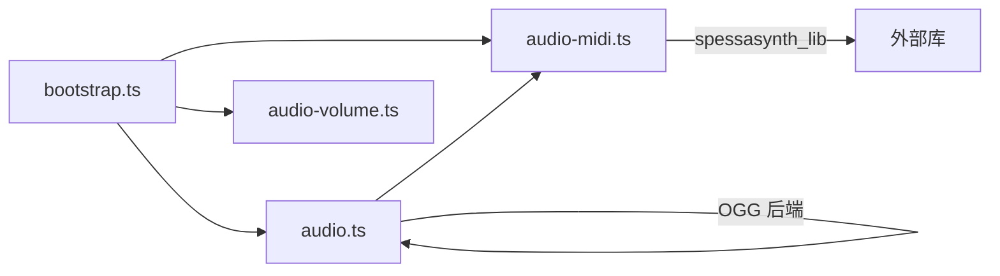

# 音频系统 API

<cite>
**本文引用的文件**   
- [packages/game/src/shell/audio.ts](file://packages/game/src/shell/audio.ts)
- [packages/game/src/shell/audio-midi.ts](file://packages/game/src/shell/audio-midi.ts)
- [packages/game/src/shell/audio-volume.ts](file://packages/game/src/shell/audio-volume.ts)
- [packages/game/src/shell/bootstrap.ts](file://packages/game/src/shell/bootstrap.ts)
- [packages/pal-extract/src/resources/parsers/sounds.ts](file://packages/pal-extract/src/resources/parsers/sounds.ts)
- [reference/sdlpal/audio.c](file://reference/sdlpal/audio.c)
- [reference/sdlpal/sound.c](file://reference/sdlpal/sound.c)
- [reference/sdlpal/midi.c](file://reference/sdlpal/midi.c)
</cite>

## 目录
1. [简介](#简介)
2. [项目结构](#项目结构)
3. [核心组件](#核心组件)
4. [架构总览](#架构总览)
5. [详细组件分析](#详细组件分析)
6. [依赖关系分析](#依赖关系分析)
7. [性能考虑](#性能考虑)
8. [故障排查指南](#故障排查指南)
9. [结论](#结论)
10. [附录：API 参考与示例](#附录api-参考与示例)

## 简介
本文件面向开发者，系统化记录本项目在浏览器端的音频系统 API 与实现要点，覆盖以下目标：
- 播放接口：playMusic()、playSoundEffect()、setVolume() 等（以 TypeScript 层暴露的接口为准）。
- MIDI 音乐播放：MIDI 文件解析、音源合成、实时控制。
- 音效管理系统：音效分类、音量控制、音频混合。
- 音频资源加载：异步加载、格式转换、缓存策略。
- 实际代码示例：如何播放背景音乐、触发音效、控制音频设置。
- 性能优化建议与浏览器兼容性处理方案。

说明：
- 本仓库包含 C 端 sdlpal 参考实现与 TS 端 Web Audio 实现。本文以 TS 端为主，必要时引用 sdlpal 行为作为“真值”对照。
- 为避免直接粘贴源码，所有代码片段均以“来源路径 + 行号”形式标注。

## 项目结构
音频相关代码集中在 shell 层，负责将 core 层的音频意图（SFX 队列、BGM track）转换为实际的 Web Audio 播放。

图表来源
- [packages/game/src/shell/audio.ts:1-313](file://packages/game/src/shell/audio.ts#L1-L313)
- [packages/game/src/shell/audio-midi.ts:1-170](file://packages/game/src/shell/audio-midi.ts#L1-L170)
- [packages/game/src/shell/audio-volume.ts:1-55](file://packages/game/src/shell/audio-volume.ts#L1-L55)
- [packages/game/src/shell/bootstrap.ts:450-470](file://packages/game/src/shell/bootstrap.ts#L450-L470)

章节来源
- [packages/game/src/shell/audio.ts:1-313](file://packages/game/src/shell/audio.ts#L1-L313)
- [packages/game/src/shell/audio-midi.ts:1-170](file://packages/game/src/shell/audio-midi.ts#L1-L170)
- [packages/game/src/shell/audio-volume.ts:1-55](file://packages/game/src/shell/audio-volume.ts#L1-L55)
- [packages/game/src/shell/bootstrap.ts:450-470](file://packages/game/src/shell/bootstrap.ts#L450-L470)

## 核心组件
- AudioManager（audio.ts）
  - 职责：每帧同步 SFX 队列与 BGM track；管理 SFX 解码缓存与去重；提供 setSfxEnabled/setMusicEnabled/resume 等开关与生命周期方法。
  - 关键导出：createAudioManager、sfxUrl、musicUrl、pickMusicTrack、battleVictoryTrack、sfxForBattleEvent、setOggVolumeScale、setSfxVolume。
- MusicBackend（audio.ts 定义接口）
  - 职责：统一 BGM 播放后端抽象。当前提供两种实现：
    - createOggMusicBackend：基于 HTMLAudioElement 播放预渲染 OGG。
    - SpessaSynth 后端（audio-midi.ts）：运行时 MIDI 合成，直接播 Musics/*.mid。
- SpessaSynth 后端（audio-midi.ts）
  - 职责：初始化 WorkletSynthesizer + Sequencer，加载 GM SoundFont，按 track 播放 MIDI，支持 resume 与音量控制。
  - 关键导出：createSpessaSynthBackend、setBgmVolume。
- 音量控制器（audio-volume.ts）
  - 职责：维护 0..1 主音量与静音状态，持久化到 localStorage，并通过回调 applyVolume 推送给输出层。

章节来源
- [packages/game/src/shell/audio.ts:18-44](file://packages/game/src/shell/audio.ts#L18-L44)
- [packages/game/src/shell/audio.ts:161-190](file://packages/game/src/shell/audio.ts#L161-L190)
- [packages/game/src/shell/audio-midi.ts:51-169](file://packages/game/src/shell/audio-midi.ts#L51-L169)
- [packages/game/src/shell/audio-volume.ts:27-54](file://packages/game/src/shell/audio-volume.ts#L27-L54)

## 架构总览
整体流程：core 层通过 GameState 发出音频意图（pendingSounds 队列、wNumMusic/wNumBattleMusic），shell 层每帧消费并驱动 Web Audio。

图表来源
- [packages/game/src/shell/bootstrap.ts:165-196](file://packages/game/src/shell/bootstrap.ts#L165-L196)
- [packages/game/src/shell/audio.ts:272-311](file://packages/game/src/shell/audio.ts#L272-L311)
- [packages/game/src/shell/audio-midi.ts:64-76](file://packages/game/src/shell/audio-midi.ts#L64-L76)

章节来源
- [packages/game/src/shell/bootstrap.ts:165-196](file://packages/game/src/shell/bootstrap.ts#L165-L196)
- [packages/game/src/shell/audio.ts:272-311](file://packages/game/src/shell/audio.ts#L272-L311)

## 详细组件分析

### 组件一：AudioManager（SFX 与 BGM 调度）
- 设计要点
  - SFX 去重：同一 soundId 在上一次未播完前不再触发，避免叠音。
  - 异步加载：首次播放时 fetch WAV → decodeAudioData → 缓存 AudioBuffer，后续直接复用。
  - 自动补播：若首次因 autoplay 限制未发声，待 ctx.resume 后仍会尝试补播。
  - BGM 切换：track 变化即切；支持 stop(0)、循环与非循环。
  - 兼容退化：无 Web Audio 环境（测试/SSR）→ 静 no-op。
- 关键函数与路径
  - sfxUrl(baseUrl, id)：生成 sounds/{id}.wav 地址。[路径:46-49](file://packages/game/src/shell/audio.ts#L46-L49)
  - musicUrl(baseUrl, track)：生成 music/{NNN}.mid 地址。[路径:71-74](file://packages/game/src/shell/audio.ts#L71-L74)
  - pickMusicTrack(inBattle, wNumMusic, wNumBattleMusic, battleIntroActive)：决定当前有效 BGM track。[路径:81-94](file://packages/game/src/shell/audio.ts#L81-L94)
  - battleVictoryTrack(battle)：结算期胜利曲选择。[路径:102-107](file://packages/game/src/shell/audio.ts#L102-L107)
  - sfxForBattleEvent(cmd, enemies, partyMembers, roles)：战斗事件映射为 SFX id。[路径:115-133](file://packages/game/src/shell/audio.ts#L115-L133)
  - createAudioManager(baseUrl)：创建管理器实例。[路径:197-312](file://packages/game/src/shell/audio.ts#L197-L312)
- 复杂度与内存
  - SFX 解码缓存 Map<number, AudioBuffer>，空间随已触发的 SFX 数量线性增长。
  - 并发请求保护：使用 Set<number> 标记 in-flight，避免重复 fetch。

图表来源
- [packages/game/src/shell/audio.ts:18-44](file://packages/game/src/shell/audio.ts#L18-L44)
- [packages/game/src/shell/audio.ts:161-190](file://packages/game/src/shell/audio.ts#L161-L190)
- [packages/game/src/shell/audio-midi.ts:51-169](file://packages/game/src/shell/audio-midi.ts#L51-L169)

章节来源
- [packages/game/src/shell/audio.ts:46-49](file://packages/game/src/shell/audio.ts#L46-L49)
- [packages/game/src/shell/audio.ts:71-74](file://packages/game/src/shell/audio.ts#L71-L74)
- [packages/game/src/shell/audio.ts:81-94](file://packages/game/src/shell/audio.ts#L81-L94)
- [packages/game/src/shell/audio.ts:102-107](file://packages/game/src/shell/audio.ts#L102-L107)
- [packages/game/src/shell/audio.ts:115-133](file://packages/game/src/shell/audio.ts#L115-L133)
- [packages/game/src/shell/audio.ts:197-312](file://packages/game/src/shell/audio.ts#L197-L312)

### 组件二：SpessaSynth 后端（运行时 MIDI 合成）
- 设计要点
  - 工作流：加载 Worklet 处理器 → 创建 WorkletSynthesizer → 连接 masterGain → 加载 SoundFont → 创建 Sequencer → 按 track 播放。
  - 混响控制：默认关闭混响(CC91=0)，可配置低值回一点混响。
  - 自动恢复：用户手势后 resume()，确保 autoplay 解禁后能补播当前曲目。
  - 健壮性：secure context 检测、soundfont RIFF 魔数校验、HTTP 失败告警但不阻塞游戏。
- 关键函数与路径
  - setBgmVolume(v)：设置 BGM 主音量（0..1），影响 masterGain。[路径:46-49](file://packages/game/src/shell/audio-midi.ts#L46-L49)
  - createSpessaSynthBackend(opts)：创建后端实例。[路径:51-169](file://packages/game/src/shell/audio-midi.ts#L51-L169)
- 资源依赖
  - public/spessasynth_processor.min.js（Worklet 处理器）
  - public/soundfont.sf3（GM SoundFont，~6MB）

图表来源
- [packages/game/src/shell/audio-midi.ts:78-145](file://packages/game/src/shell/audio-midi.ts#L78-L145)
- [packages/game/src/shell/audio-midi.ts:147-169](file://packages/game/src/shell/audio-midi.ts#L147-L169)

章节来源
- [packages/game/src/shell/audio-midi.ts:46-49](file://packages/game/src/shell/audio-midi.ts#L46-L49)
- [packages/game/src/shell/audio-midi.ts:51-169](file://packages/game/src/shell/audio-midi.ts#L51-L169)

### 组件三：音量控制器（持久化与生效）
- 设计要点
  - 独立键名：支持多通道各自独立的音量键，共享静音键。
  - 持久化：localStorage 存储音量与静音状态，启动即应用。
  - 输出层注入：applyVolume(effective) 由 bootstrap 注入，分别调用 audio-midi.setBgmVolume 与 audio.ts 的 OGG/SFX 系数。
- 关键函数与路径
  - createAudioVolumeController(opts)：创建控制器。[路径:27-54](file://packages/game/src/shell/audio-volume.ts#L27-L54)

章节来源
- [packages/game/src/shell/audio-volume.ts:27-54](file://packages/game/src/shell/audio-volume.ts#L27-L54)

### 组件四：资源加载与缓存
- SFX 资源
  - 来源：SOUNDS.MKF chunk → 提取为 extracted/sounds/{id}.wav。
  - 解析元数据：[路径:1-29](file://packages/pal-extract/src/resources/parsers/sounds.ts#L1-L29)
  - 运行时加载：fetch WAV → decodeAudioData → 缓存 AudioBuffer；并发去重。
- BGM 资源
  - MIDI：extracted/music/{NNN}.mid，SpessaSynth 运行时合成。
  - OGG：extracted/music/{NNN}.ogg，HTMLAudioElement 播放（离线渲染产物）。
- 预取与进度
  - bootstrap 阶段并行下载 glyphs/dialog/soundfont 等，提升首屏体验。[路径:221-236](file://packages/game/src/shell/bootstrap.ts#L221-L236)

章节来源
- [packages/pal-extract/src/resources/parsers/sounds.ts:1-29](file://packages/pal-extract/src/resources/parsers/sounds.ts#L1-L29)
- [packages/game/src/shell/audio.ts:217-235](file://packages/game/src/shell/audio.ts#L217-L235)
- [packages/game/src/shell/bootstrap.ts:221-236](file://packages/game/src/shell/bootstrap.ts#L221-L236)

## 依赖关系分析
- 模块耦合
  - bootstrap.ts 装配 AudioManager、SpessaSynth 后端、音量控制器，并注册用户手势以解除 autoplay 限制。
  - audio.ts 与 audio-midi.ts 通过 MusicBackend 接口解耦，便于替换后端。
- 外部依赖
  - spessasynth_lib：运行时 MIDI 合成库。
  - Web Audio API：AudioContext、AudioWorklet、HTMLAudioElement。
- 潜在环依赖
  - 未见循环导入；各模块职责清晰，依赖方向自上而下。

图表来源
- [packages/game/src/shell/bootstrap.ts:450-470](file://packages/game/src/shell/bootstrap.ts#L450-L470)
- [packages/game/src/shell/audio.ts:18-44](file://packages/game/src/shell/audio.ts#L18-L44)
- [packages/game/src/shell/audio-midi.ts:19-20](file://packages/game/src/shell/audio-midi.ts#L19-L20)

章节来源
- [packages/game/src/shell/bootstrap.ts:450-470](file://packages/game/src/shell/bootstrap.ts#L450-L470)
- [packages/game/src/shell/audio.ts:18-44](file://packages/game/src/shell/audio.ts#L18-L44)
- [packages/game/src/shell/audio-midi.ts:19-20](file://packages/game/src/shell/audio-midi.ts#L19-L20)

## 性能考虑
- SFX 解码缓存
  - 首次 fetch+decode 后缓存 AudioBuffer，避免重复 IO 与 CPU 解码。
  - 并发请求去重，防止 stampede。
- BGM 后端选择
  - 预渲染 OGG：零运行时合成开销，适合低端设备；需构建期离线渲染。
  - 运行时 MIDI：无需额外媒体包，但需要加载 SoundFont 与 Worklet，首开有延迟。
- 资源预取
  - 启动期并行下载大体积资源（如 glyphs、dialog、soundfont），减少首屏卡顿。
- 内存控制
  - 仅缓存已触发的 SFX；BGM 元素释放时 removeAttribute('src') + load() 以回收底层媒体资源。
- 浏览器限制
  - autoplay policy：必须在用户手势后 resume()；对 BGM 与 SFX 均适用。
  - secure context：AudioWorklet 仅在 https 或 localhost 可用，否则退化为静默。

[本节为通用指导，不直接分析具体文件]

## 故障排查指南
- 无声音（SFX/BGM 全哑）
  - 检查是否在非 secure context 下运行（局域网 IP http:// 访问会导致 AudioWorklet 不可用）。[路径:85-91](file://packages/game/src/shell/audio-midi.ts#L85-L91)
  - 确认用户手势后调用了 resume()（keydown/pointerdown 监听）。[路径:467-469](file://packages/game/src/shell/bootstrap.ts#L467-L469)
- 只有 SFX 没有 BGM
  - 可能是 secure context 问题导致 Worklet 不可用；或 soundfont 缺失/不是 RIFF 魔数。[路径:104-119](file://packages/game/src/shell/audio-midi.ts#L104-L119)
- BGM 不循环或循环异常
  - 检查 MusicBackend.play 的 loop 参数与 Sequencer.loopCount 设置。[路径:74-75](file://packages/game/src/shell/audio-midi.ts#L74-L75)
- 音量无效
  - 确认音量控制器 applyVolume 已注入并调用 setBgmVolume 与 setOggVolumeScale/setSfxVolume。[路径:27-54](file://packages/game/src/shell/audio-volume.ts#L27-L54)
- 资源 404
  - 检查 extracted/music/*.mid 或 *.ogg、extracted/sounds/*.wav 是否存在于服务器根。[路径:46-49](file://packages/game/src/shell/audio.ts#L46-L49)

章节来源
- [packages/game/src/shell/audio-midi.ts:85-91](file://packages/game/src/shell/audio-midi.ts#L85-L91)
- [packages/game/src/shell/audio-midi.ts:104-119](file://packages/game/src/shell/audio-midi.ts#L104-L119)
- [packages/game/src/shell/audio-midi.ts:74-75](file://packages/game/src/shell/audio-midi.ts#L74-L75)
- [packages/game/src/shell/audio-volume.ts:27-54](file://packages/game/src/shell/audio-volume.ts#L27-L54)
- [packages/game/src/shell/audio.ts:46-49](file://packages/game/src/shell/audio.ts#L46-L49)
- [packages/game/src/shell/bootstrap.ts:467-469](file://packages/game/src/shell/bootstrap.ts#L467-L469)

## 结论
本音频系统以清晰的接口分层（AudioManager + MusicBackend）实现了跨后端的 BGM 播放与高效的 SFX 管理。通过预取、缓存与并发去重，兼顾了首开体验与运行时稳定性。SpessaSynth 运行时 MIDI 合成为开箱即用提供了便利，同时保留 OGG 预渲染路径以满足不同部署需求。建议在生产环境优先准备 soundfont 与必要资源，并在用户交互后及时 resume，以获得最佳兼容性与一致性体验。

[本节为总结，不直接分析具体文件]

## 附录：API 参考与示例

### 公开 API 一览
- AudioManager（audio.ts）
  - createAudioManager(baseUrl): AudioManager
  - sync(pendingSounds, music): void
  - playSound(soundId): void
  - resume(): void
  - setSfxEnabled(on): void
  - setMusicEnabled(on): void
  - setMusicBackend(backend): void
  - sfxUrl(baseUrl, soundId): string
  - musicUrl(baseUrl, track): string
  - pickMusicTrack(inBattle, wNumMusic, wNumBattleMusic, battleIntroActive): number
  - battleVictoryTrack(battle): number
  - sfxForBattleEvent(cmd, enemies, partyMembers, roles): number
  - setOggVolumeScale(s): void
  - setSfxVolume(s): void
- SpessaSynth 后端（audio-midi.ts）
  - createSpessaSynthBackend(opts): MusicBackend
  - setBgmVolume(v): void
- 音量控制器（audio-volume.ts）
  - createAudioVolumeController(opts): AudioVolumeController

章节来源
- [packages/game/src/shell/audio.ts:18-44](file://packages/game/src/shell/audio.ts#L18-L44)
- [packages/game/src/shell/audio.ts:46-49](file://packages/game/src/shell/audio.ts#L46-L49)
- [packages/game/src/shell/audio.ts:71-74](file://packages/game/src/shell/audio.ts#L71-L74)
- [packages/game/src/shell/audio.ts:81-94](file://packages/game/src/shell/audio.ts#L81-L94)
- [packages/game/src/shell/audio.ts:102-107](file://packages/game/src/shell/audio.ts#L102-L107)
- [packages/game/src/shell/audio.ts:115-133](file://packages/game/src/shell/audio.ts#L115-L133)
- [packages/game/src/shell/audio.ts:150-159](file://packages/game/src/shell/audio.ts#L150-L159)
- [packages/game/src/shell/audio.ts:161-190](file://packages/game/src/shell/audio.ts#L161-L190)
- [packages/game/src/shell/audio.ts:197-312](file://packages/game/src/shell/audio.ts#L197-L312)
- [packages/game/src/shell/audio-midi.ts:46-49](file://packages/game/src/shell/audio-midi.ts#L46-L49)
- [packages/game/src/shell/audio-midi.ts:51-169](file://packages/game/src/shell/audio-midi.ts#L51-L169)
- [packages/game/src/shell/audio-volume.ts:27-54](file://packages/game/src/shell/audio-volume.ts#L27-L54)

### 用法示例（以路径代替代码内容）
- 播放背景音乐（MIDI 合成）
  - 初始化与注入后端：[路径:456-461](file://packages/game/src/shell/bootstrap.ts#L456-L461)
  - 每帧同步 track：[路径:179-182](file://packages/game/src/shell/bootstrap.ts#L179-L182)
  - 后端播放逻辑：[路径:64-76](file://packages/game/src/shell/audio-midi.ts#L64-L76)
- 触发音效
  - 构造管理器与 URL：[路径:197-215](file://packages/game/src/shell/audio.ts#L197-L215), [路径:46-49](file://packages/game/src/shell/audio.ts#L46-L49)
  - 播放入口与去重：[路径:254-270](file://packages/game/src/shell/audio.ts#L254-L270), [路径:57-69](file://packages/game/src/shell/audio.ts#L57-L69)
- 控制音频设置
  - 主音量（持久化）：[路径:27-54](file://packages/game/src/shell/audio-volume.ts#L27-L54)
  - 注入音量回调（MIDI/OGG/SFX）：[路径:46-49](file://packages/game/src/shell/audio-midi.ts#L46-L49), [路径:150-159](file://packages/game/src/shell/audio.ts#L150-L159), [路径:157-159](file://packages/game/src/shell/audio.ts#L157-L159)
  - 开关音乐/音效：[路径:297-305](file://packages/game/src/shell/audio.ts#L297-L305)

### 与 sdlpal 真值的对照
- AUDIO_PlayMusic/AUDIO_DecreaseVolume/AUDIO_PlaySound 的行为与注释对照：
  - 播放音乐与音量调整：[路径:490-559](file://reference/sdlpal/audio.c#L490-L559)
  - 音效播放与缓冲填充：[路径:828-897](file://reference/sdlpal/sound.c#L828-L897)
  - MIDI 文件路径约定（Musics/%.3d.mid）：[路径:67-67](file://reference/sdlpal/midi.c#L67-L67)

章节来源
- [reference/sdlpal/audio.c:490-559](file://reference/sdlpal/audio.c#L490-L559)
- [reference/sdlpal/sound.c:828-897](file://reference/sdlpal/sound.c#L828-L897)
- [reference/sdlpal/midi.c:67-67](file://reference/sdlpal/midi.c#L67-L67)