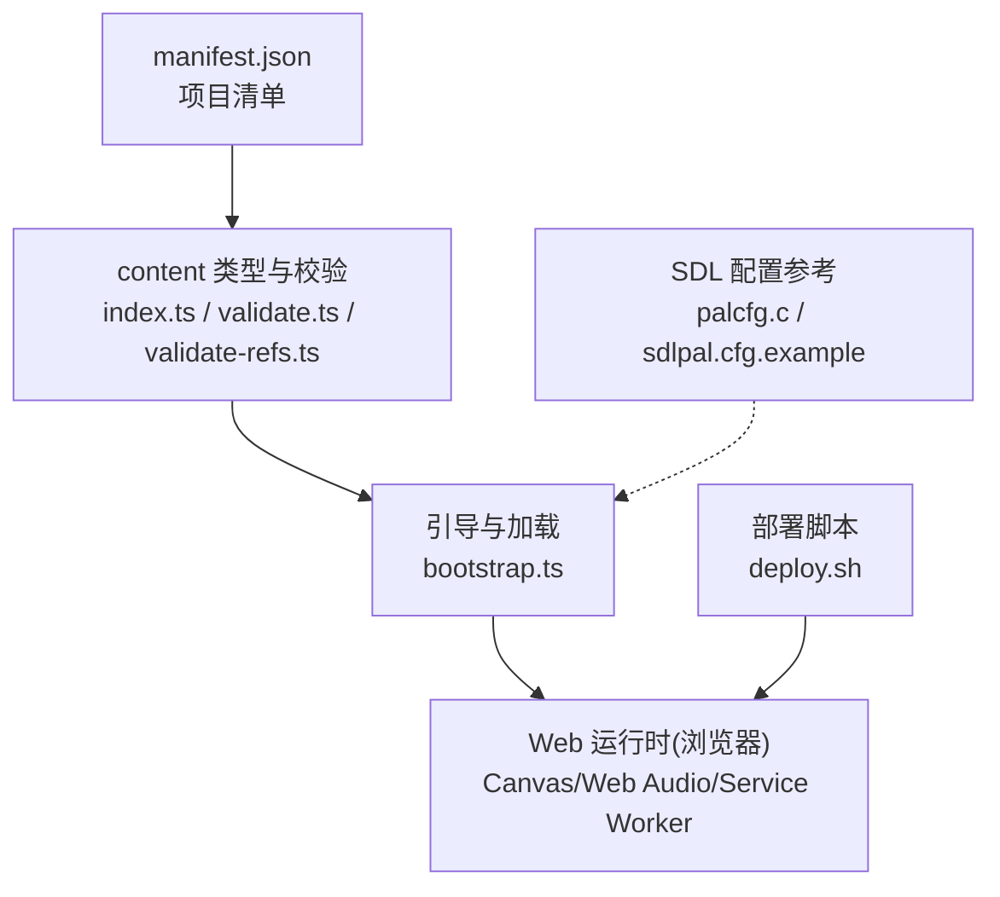
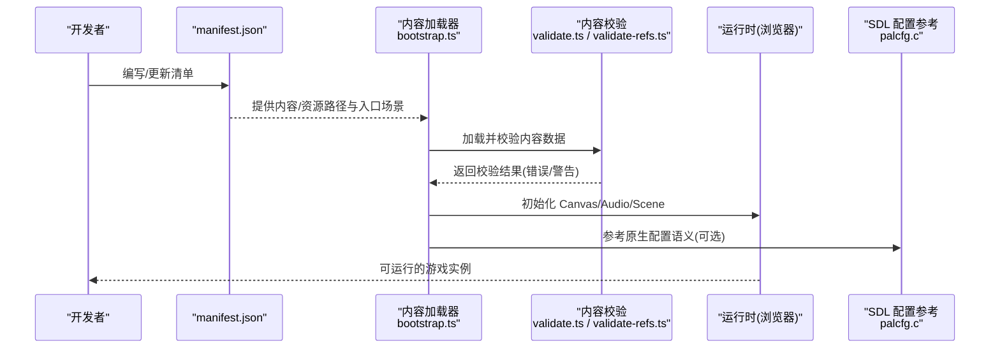
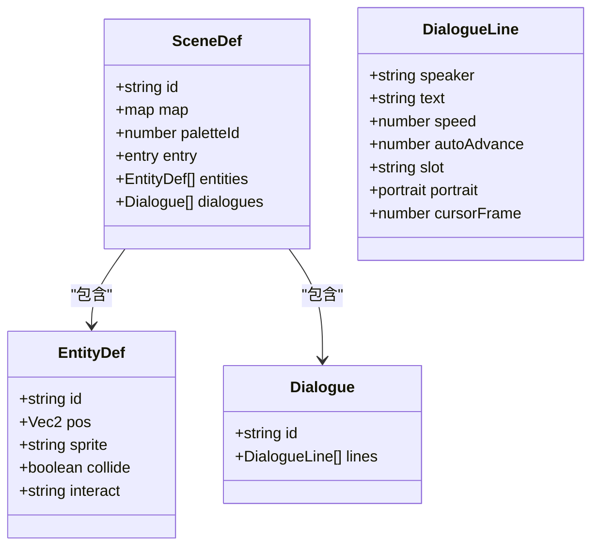
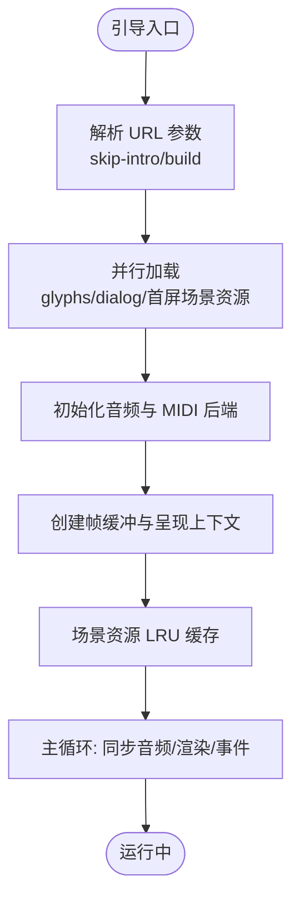
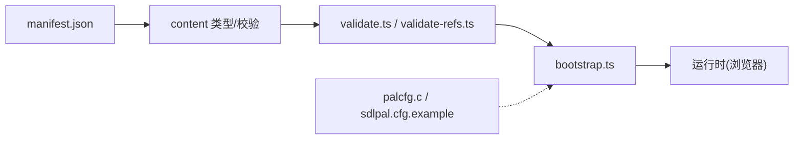

# 配置接口

<cite>
**本文引用的文件**
- [projects/demo/manifest.json](file://projects/demo/manifest.json)
- [packages/content/src/index.ts](file://packages/content/src/index.ts)
- [packages/content/src/validate.ts](file://packages/content/src/validate.ts)
- [packages/content/src/validate-refs.ts](file://packages/content/src/validate-refs.ts)
- [packages/game/src/shell/bootstrap.ts](file://packages/game/src/shell/bootstrap.ts)
- [reference/sdlpal/palcfg.c](file://reference/sdlpal/palcfg.c)
- [reference/sdlpal/docs/sdlpal.cfg.example](file://reference/sdlpal/docs/sdlpal.cfg.example)
- [scripts/deploy.sh](file://scripts/deploy.sh)
</cite>

## 目录
1. [简介](#简介)
2. [项目结构](#项目结构)
3. [核心组件](#核心组件)
4. [架构总览](#架构总览)
5. [详细组件分析](#详细组件分析)
6. [依赖关系分析](#依赖关系分析)
7. [性能考虑](#性能考虑)
8. [故障排查指南](#故障排查指南)
9. [结论](#结论)
10. [附录](#附录)

## 简介
本文件为“配置接口”文档，聚焦以下目标：
- 游戏运行时配置项：分辨率、音频、输入映射、性能调优参数
- 资源清单 manifest.json 的结构、依赖声明与版本管理
- 环境变量与启动参数（URL 查询参数）在开发/生产环境中的使用方式
- 配置文件验证规则与默认值说明
- 不同部署环境的配置示例与最佳实践

## 项目结构
本项目采用多包工作区组织。与“配置接口”直接相关的代码与数据主要位于：
- 内容层类型与校验：packages/content/src/*
- 运行期引导与加载：packages/game/src/shell/bootstrap.ts
- 原生 SDL 配置解析参考：reference/sdlpal/palcfg.c 与 sdlpal.cfg.example
- 资源清单示例：projects/demo/manifest.json
- 部署脚本：scripts/deploy.sh

图表来源
- [projects/demo/manifest.json:1-33](file://projects/demo/manifest.json#L1-L33)
- [packages/content/src/index.ts:1-101](file://packages/content/src/index.ts#L1-L101)
- [packages/content/src/validate.ts:23-96](file://packages/content/src/validate.ts#L23-L96)
- [packages/content/src/validate-refs.ts:1-43](file://packages/content/src/validate-refs.ts#L1-L43)
- [packages/game/src/shell/bootstrap.ts:215-508](file://packages/game/src/shell/bootstrap.ts#L215-L508)
- [reference/sdlpal/palcfg.c:398-440](file://reference/sdlpal/palcfg.c#L398-L440)
- [reference/sdlpal/docs/sdlpal.cfg.example:57-86](file://reference/sdlpal/docs/sdlpal.cfg.example#L57-L86)
- [scripts/deploy.sh:98-124](file://scripts/deploy.sh#L98-L124)

章节来源
- [projects/demo/manifest.json:1-33](file://projects/demo/manifest.json#L1-L33)
- [packages/content/src/index.ts:1-101](file://packages/content/src/index.ts#L1-L101)
- [packages/content/src/validate.ts:23-96](file://packages/content/src/validate.ts#L23-L96)
- [packages/content/src/validate-refs.ts:1-43](file://packages/content/src/validate-refs.ts#L1-L43)
- [packages/game/src/shell/bootstrap.ts:215-508](file://packages/game/src/shell/bootstrap.ts#L215-L508)
- [reference/sdlpal/palcfg.c:398-440](file://reference/sdlpal/palcfg.c#L398-L440)
- [reference/sdlpal/docs/sdlpal.cfg.example:57-86](file://reference/sdlpal/docs/sdlpal.cfg.example#L57-L86)
- [scripts/deploy.sh:98-124](file://scripts/deploy.sh#L98-L124)

## 核心组件
本节从“配置接口”的角度梳理关键能力与边界：
- 资源清单 manifest.json：定义项目元信息、内容依赖、资源根路径、起始世界状态等
- 内容层类型与校验：场景、角色、技能、物品、本地化、精灵注册表等的结构与跨引用完整性校验
- 运行期引导 bootstrap：读取 URL 参数、并行加载资源、初始化音频与渲染上下文、按场景按需加载
- SDL 配置参考：原生端配置项的键名、取值范围与默认值（用于理解平台差异与兼容性）
- 部署脚本：构建产物与资源目录的组织方式，影响运行时资源路径与缓存策略

章节来源
- [projects/demo/manifest.json:1-33](file://projects/demo/manifest.json#L1-L33)
- [packages/content/src/index.ts:1-101](file://packages/content/src/index.ts#L1-L101)
- [packages/content/src/validate.ts:23-96](file://packages/content/src/validate.ts#L23-L96)
- [packages/content/src/validate-refs.ts:1-43](file://packages/content/src/validate-refs.ts#L1-L43)
- [packages/game/src/shell/bootstrap.ts:215-508](file://packages/game/src/shell/bootstrap.ts#L215-L508)
- [reference/sdlpal/palcfg.c:398-440](file://reference/sdlpal/palcfg.c#L398-L440)
- [reference/sdlpal/docs/sdlpal.cfg.example:57-86](file://reference/sdlpal/docs/sdlpal.cfg.example#L57-L86)
- [scripts/deploy.sh:98-124](file://scripts/deploy.sh#L98-L124)

## 架构总览
下图展示“配置接口”在系统中的位置与交互：manifest 驱动内容加载；内容校验保障数据结构正确；引导程序负责运行时初始化与资源调度；SDL 配置参考提供原生端行为对照；部署脚本决定最终资源布局。

图表来源
- [projects/demo/manifest.json:1-33](file://projects/demo/manifest.json#L1-L33)
- [packages/game/src/shell/bootstrap.ts:215-508](file://packages/game/src/shell/bootstrap.ts#L215-L508)
- [packages/content/src/validate.ts:23-96](file://packages/content/src/validate.ts#L23-L96)
- [packages/content/src/validate-refs.ts:1-43](file://packages/content/src/validate-refs.ts#L1-L43)
- [reference/sdlpal/palcfg.c:398-440](file://reference/sdlpal/palcfg.c#L398-L440)

## 详细组件分析

### 资源清单 manifest.json 结构
- 顶层字段
  - id: 项目标识
  - name: 显示名称
  - contentVersion: 内容版本号
  - entryScene: 初始场景标识
- content: 内容依赖声明
  - scenes, characters, skills, items, locale, sprites 等指向各自 JSON 文件路径
- assets: 资源根与子目录映射
  - root, maps, tilesets, sprites, palettes 等
- startWorld: 起始世界状态
  - party, money, learnedSkills, inventory, seedStats 等

用途与约束
- 由内容加载器消费，决定首次加载的场景与资源路径
- sprites 为可选（向后兼容），若缺失则运行时不请求 sprites 表
- 资源路径基于 assets.root 拼接，部署时需保证相对路径有效

章节来源
- [projects/demo/manifest.json:1-33](file://projects/demo/manifest.json#L1-L33)
- [packages/content/src/index.ts:1-101](file://packages/content/src/index.ts#L1-L101)

### 内容数据模型与校验
- 场景 SceneDef
  - 关键字段：id、map(reuseOriginalMap + room)、paletteId、entry、entities、dialogues
  - paletteId 可选，缺省 0
- 实体 EntityDef
  - 关键字段：id、pos、sprite、collide、interact
- 对话 Dialogue/DialogueLine
  - 关键字段：speaker、text、speed、autoAdvance、slot、portrait、cursorFrame
- 校验规则
  - 形状校验：数组/对象必填字段、类型检查（如 id 必须为字符串）
  - 跨引用校验：检测悬空引用（如 entities 引用不存在的 sprite/dialogue）

图表来源
- [packages/content/src/index.ts:1-101](file://packages/content/src/index.ts#L1-L101)

章节来源
- [packages/content/src/index.ts:1-101](file://packages/content/src/index.ts#L1-L101)
- [packages/content/src/validate.ts:23-96](file://packages/content/src/validate.ts#L23-L96)
- [packages/content/src/validate-refs.ts:1-43](file://packages/content/src/validate-refs.ts#L1-L43)

### 运行期引导与加载（bootstrap）
- URL 查询参数（开发/测试常用）
  - skip-intro: 跳过开场梦境直接进入主场景
  - build: dos/win95 切换不同开场表现
- 资源加载策略
  - 并行加载 glyphs、dialog 资产与首屏场景资源
  - 按场景懒加载 tileset blob 与 NPC sprite，LRU 缓存最近 N 个场景
- 音频系统
  - Web Audio 后端，MIDI 合成通过 SpessaSynth 工作线程
  - 自动解锁 AudioContext（键盘/指针事件）
- 渲染管线
  - Framebuffer → presentFrame/presentBattleFrame → flushToCanvas
  - 调色板工作副本与基础调色板分离，支持淡入淡出与特效

图表来源
- [packages/game/src/shell/bootstrap.ts:215-508](file://packages/game/src/shell/bootstrap.ts#L215-L508)

章节来源
- [packages/game/src/shell/bootstrap.ts:215-508](file://packages/game/src/shell/bootstrap.ts#L215-L508)

### 原生 SDL 配置参考（对比与兼容）
- 配置项类别
  - 音频：采样率、OPL 采样率、重采样质量、缓冲区大小、音量
  - 窗口：窗口宽度等
  - 日志：日志级别
  - 设备：音频设备选择
- 取值与默认值
  - 多数数值型配置有最小/最大范围限制，非法值会被钳制到合法区间
  - 部分配置具有推荐值或平台相关默认值

注意
- 当前 Web 端未直接暴露这些键作为运行时配置项；此处提供参考以理解原生端行为差异与兼容性边界。

章节来源
- [reference/sdlpal/palcfg.c:398-440](file://reference/sdlpal/palcfg.c#L398-L440)
- [reference/sdlpal/docs/sdlpal.cfg.example:57-86](file://reference/sdlpal/docs/sdlpal.cfg.example#L57-L86)

### 环境变量与启动参数
- URL 查询参数（浏览器环境）
  - skip-intro: 布尔开关，跳过开场流程
  - build: dos | win95，控制开场视频/动画分支
- 部署相关的环境变量（脚本侧）
  - SERVER_USER、SERVER_HOST、REMOTE_ROOT 等（见部署脚本）
- 运行时资源路径
  - 资源根目录通常为 /extracted，部署时通过符号链接将 extracted 目录挂载至 dist.new/extracted

章节来源
- [packages/game/src/shell/bootstrap.ts:139-156](file://packages/game/src/shell/bootstrap.ts#L139-L156)
- [scripts/deploy.sh:98-124](file://scripts/deploy.sh#L98-L124)

### 配置文件验证规则与默认值
- 单表形状校验
  - 要求数组/对象存在，必填字段齐全，类型正确（如 id 为 string）
- 跨引用完整性校验
  - 检测 entities、dialogues、sprites 等之间的引用是否悬空
- 默认值与降级
  - sprites 为可选，缺失时不请求该表
  - paletteId 可选，缺省 0
  - 文本加载失败时退化为占位字形，不影响基本运行

章节来源
- [packages/content/src/validate.ts:23-96](file://packages/content/src/validate.ts#L23-L96)
- [packages/content/src/validate-refs.ts:1-43](file://packages/content/src/validate-refs.ts#L1-L43)
- [packages/content/src/index.ts:1-101](file://packages/content/src/index.ts#L1-L101)

### 不同部署环境的配置示例与最佳实践
- 开发环境
  - 使用 URL 参数快速切换行为：?skip-intro=1、?build=dos
  - 本地资源路径保持 /extracted 不变，便于与生产一致
- 生产环境
  - 应用壳与资源树分离：dist.new 内放置 index.html 等壳文件，extracted 作为兄弟目录并通过符号链接挂载
  - 确保 soundfont.sf3 与 spessasynth_processor.min.js 可被访问
- 最佳实践
  - 资源清单尽量显式声明 sprites（避免运行时回退）
  - 对大体积资源（soundfont、glyphs）进行预取与缓存，避免阻塞首屏
  - 场景资源按需加载，LRU 上限建议 16，兼顾内存与重访成本

章节来源
- [packages/game/src/shell/bootstrap.ts:215-508](file://packages/game/src/shell/bootstrap.ts#L215-L508)
- [scripts/deploy.sh:98-124](file://scripts/deploy.sh#L98-L124)
- [projects/demo/manifest.json:1-33](file://projects/demo/manifest.json#L1-L33)

## 依赖关系分析
- 清单到内容：manifest.json 的 content 字段决定需要加载的内容 JSON 文件
- 内容到校验：validate.ts 与 validate-refs.ts 分别负责形状与跨引用校验
- 引导到资源：bootstrap.ts 根据 manifest 与 URL 参数并行/按需加载资源
- 原生参考：palcfg.c 提供原生端配置项语义，供移植与兼容性参考

图表来源
- [projects/demo/manifest.json:1-33](file://projects/demo/manifest.json#L1-L33)
- [packages/content/src/validate.ts:23-96](file://packages/content/src/validate.ts#L23-L96)
- [packages/content/src/validate-refs.ts:1-43](file://packages/content/src/validate-refs.ts#L1-L43)
- [packages/game/src/shell/bootstrap.ts:215-508](file://packages/game/src/shell/bootstrap.ts#L215-L508)
- [reference/sdlpal/palcfg.c:398-440](file://reference/sdlpal/palcfg.c#L398-L440)
- [reference/sdlpal/docs/sdlpal.cfg.example:57-86](file://reference/sdlpal/docs/sdlpal.cfg.example#L57-L86)

## 性能考虑
- 资源加载
  - 并行下载 glyphs、dialog 资产与首屏场景资源，减少首屏等待
  - 大单体资源（soundfont）提前预取，避免阻塞后续 IO
- 场景缓存
  - LRU 保留最近 16 个场景的 tile 位图与元数据，保护当前场景不被淘汰
- 音频
  - 用户手势后恢复 AudioContext，避免静音问题
  - MIDI 工作线程独立，降低主线程压力
- 渲染
  - 仅在非 modal 期间刷新 canvas，避免与播放器冲突导致的闪烁

[本节为通用指导，无需具体文件分析]

## 故障排查指南
- 文本显示为占位符
  - 可能原因：glyphs 加载失败
  - 处理：检查 /extracted 下字体资源是否可用，关注控制台警告
- 音频无声
  - 可能原因：AudioContext 未恢复或 soundfont 不可用
  - 处理：触发一次用户手势（点击/按键），确认 soundfont.sf3 可达
- 场景切换黑屏或贴图缺失
  - 可能原因：tileset blob 或 NPC sprite 未成功加载
  - 处理：检查 /extracted/data/tileset 与 /extracted/data/sprite 路径，查看网络请求状态码
- 部署后资源 404
  - 可能原因：符号链接未生效或 dist.new/extracted 未创建
  - 处理：确认部署脚本执行成功，远程 dist.new 中存在 extracted 符号链接

章节来源
- [packages/game/src/shell/bootstrap.ts:215-508](file://packages/game/src/shell/bootstrap.ts#L215-L508)
- [scripts/deploy.sh:98-124](file://scripts/deploy.sh#L98-L124)

## 结论
- 清单驱动的资源与内容加载是配置接口的核心
- 内容校验保障数据结构与引用完整性，提升稳定性
- 运行期引导提供灵活的 URL 参数与按需加载策略，适配开发与生产
- 原生 SDL 配置参考有助于理解平台差异与兼容性边界
- 部署脚本决定了资源路径与缓存策略，需在生产环境严格遵循

[本节为总结性内容，无需具体文件分析]

## 附录
- 术语
  - 清单：manifest.json，描述项目内容与资源路径
  - 内容：scenes、characters、skills、items、locale、sprites 等 JSON 数据
  - 引导：bootstrap.ts，负责运行时初始化与资源调度
  - 原生参考：palcfg.c 与 sdlpal.cfg.example，提供原生端配置项语义

[本节为概念性内容，无需具体文件分析]