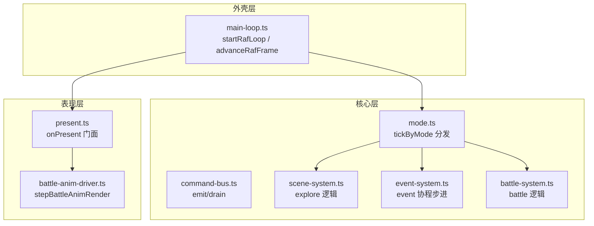
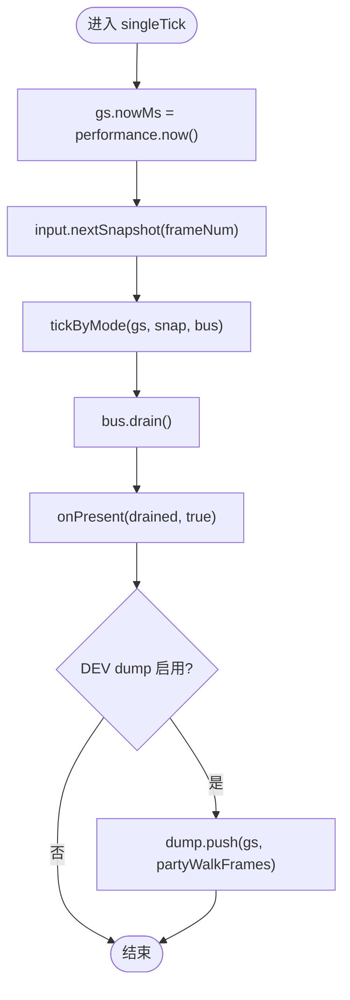
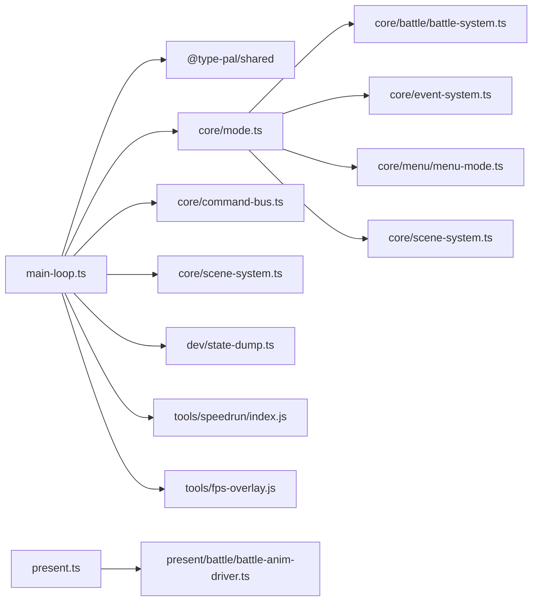

# 主循环系统

<cite>
**本文引用的文件**   
- [packages/game/src/shell/main-loop.ts](file://packages/game/src/shell/main-loop.ts)
- [packages/game/src/core/mode.ts](file://packages/game/src/core/mode.ts)
- [packages/game/src/present/battle/battle-anim-driver.ts](file://packages/game/src/present/battle/battle-anim-driver.ts)
- [packages/game/src/shell/main-loop.test.ts](file://packages/game/src/shell/main-loop.test.ts)
- [docs/phase1/plans/2026-05-30-xianglan-cutscene-fidelity.md](file://docs/phase1/plans/2026-05-30-xianglan-cutscene-fidelity.md)
</cite>

## 目录
1. [简介](#简介)
2. [项目结构](#项目结构)
3. [核心组件](#核心组件)
4. [架构总览](#架构总览)
5. [详细组件分析](#详细组件分析)
6. [依赖关系分析](#依赖关系分析)
7. [性能考量](#性能考量)
8. [故障排查指南](#故障排查指南)
9. [结论](#结论)
10. [附录](#附录)

## 简介
本文件聚焦“主循环系统”的技术实现与优化策略，围绕固定步长逻辑推进、requestAnimationFrame 累积器机制、帧率自适应切换展开。重点解释 advanceRafFrame 的三不变量设计（逻辑 interval 固定、mode 切换 clamp 保护、present 门控优化），并梳理单 tick 执行流程：输入快照获取、tickByMode 分发、命令总线处理、状态 dump 集成。同时总结 fade-only 渲染、速通暂停冻结、溢出量结转等关键优化点，并提供可定位的代码片段路径与调试技巧。

## 项目结构
主循环位于外壳层，负责驱动 requestAnimationFrame 循环、计算逻辑间隔、按模式分发 tick、并在合适时机调用表现层 present。核心模式机在 core 层，将输入与命令总线注入到 explore/event/battle/menu 各子系统。战斗动画细分由 present 层的 battle-anim-driver 提供 wall-clock 视觉帧推进。



图表来源
- [packages/game/src/shell/main-loop.ts:162-181](file://packages/game/src/shell/main-loop.ts#L162-L181)
- [packages/game/src/core/mode.ts:15-88](file://packages/game/src/core/mode.ts#L15-L88)
- [packages/game/src/present/battle/battle-anim-driver.ts:156-204](file://packages/game/src/present/battle/battle-anim-driver.ts#L156-L204)

章节来源
- [packages/game/src/shell/main-loop.ts:1-181](file://packages/game/src/shell/main-loop.ts#L1-L181)
- [packages/game/src/core/mode.ts:1-89](file://packages/game/src/core/mode.ts#L1-L89)

## 核心组件
- 逻辑间隔计算 logicIntervalMs：根据当前 gs.mode 返回固定间隔——战斗 40ms、探索/菜单/事件 100ms；fade 不再提速逻辑。
- rAF 累积器 RafLoopState：持有 lastTickTime 与 accumulator，用于节流与溢出结转。
- 单帧推进函数 advanceRafFrame：实现三不变量（interval 固定、clamp 保护、present 门控）。
- 模式分发 tickByMode：统一推进 frameNum、autoScript/chaseTimer 门控、按 mode 调度子模块。
- Present 门面 onPresent：接收 drained 命令与 ticked 标志，决定是否重绘及是否仅做 fade-only 补帧。
- 战斗动画细分 stepBattleAnimRender：在 present 阶段按 wall-clock 细分 renderIdx，避免施法慢抖频。

章节来源
- [packages/game/src/shell/main-loop.ts:49-137](file://packages/game/src/shell/main-loop.ts#L49-L137)
- [packages/game/src/core/mode.ts:15-88](file://packages/game/src/core/mode.ts#L15-L88)
- [packages/game/src/present/battle/battle-anim-driver.ts:156-204](file://packages/game/src/present/battle/battle-anim-driver.ts#L156-L204)

## 架构总览
下图展示从 rAF 回调到逻辑 tick 再到 present 的完整时序，包括冻结、命令总线与状态 dump 的集成点。

```mermaid
sequenceDiagram
participant R as "rAF 回调"
participant ML as "advanceRafFrame"
participant M as "tickByMode"
participant S as "场景/事件/战斗子系统"
participant B as "CommandBus"
participant P as "onPresent"
participant A as "stepBattleAnimRender"
R->>ML: "now, ctx, dump, frozen?"
ML->>ML: "dt = now - lastTickTime; accumulator += dt"
ML->>ML: "interval = logicIntervalMs(gs)"
alt "frozen=true 且 accumulator >= interval"
    ML->>ML: "accumulator = 0 (冻结世界)"
else "正常推进"
    ML->>M: "tickByMode(gs, input.nextSnapshot(), bus)"
    M->>S: "按 mode 分发"
    S-->>B: "bus.emit(cmd...)"
    ML->>B: "drain()"
    ML->>ML: "dump?.push(gs) (DEV)"
end
alt "ticked 或 fade/battleAnim 进行中"
    ML->>P: "onPresent(drained, ticked)"
    P->>A: "stepBattleAnimRender(nowMs)"
else "无必要绘制"
    ML-->>R: "跳过 present"
end
R->>R: "requestAnimationFrame(loop)"
```

图表来源
- [packages/game/src/shell/main-loop.ts:66-137](file://packages/game/src/shell/main-loop.ts#L66-L137)
- [packages/game/src/core/mode.ts:15-88](file://packages/game/src/core/mode.ts#L15-L88)
- [packages/game/src/present/battle/battle-anim-driver.ts:156-204](file://packages/game/src/present/battle/battle-anim-driver.ts#L156-L204)

## 详细组件分析

### 固定步长与 rAF 累积器
- 逻辑间隔：logicIntervalMs 依据 gs.mode 返回 40ms（战斗）或 100ms（其他），fade 期间不改变逻辑速率。
- 累积器：每 rAF 累加 dt，当 accumulator ≥ interval 时触发一次逻辑 tick，并将 accumulator 减去 interval；若仍大于 interval，则清零（丢弃真积压，避免 catch-up 多 tick）。
- 模式切换保护：跨 mode 切换时不清零 accumulator，但通过 clamp 保证至多 1 tick/rAF，防止 explore→battle 瞬间连跑多 tick。
- 永不补帧语义：下一截止从当前时刻起算，慢帧只顺延，不补帧；余量正常累积，高刷屏下节奏稳定。

章节来源
- [packages/game/src/shell/main-loop.ts:49-51](file://packages/game/src/shell/main-loop.ts#L49-L51)
- [packages/game/src/shell/main-loop.ts:66-116](file://packages/game/src/shell/main-loop.ts#L66-L116)
- [packages/game/src/shell/main-loop.test.ts:72-102](file://packages/game/src/shell/main-loop.test.ts#L72-L102)

### advanceRafFrame 三不变量
- 不变量①：逻辑 interval 固定为 logicIntervalMs，fade 不提速。
- 不变量②：mode 切换 clamp 保护，accumulator > interval 时清零，避免 catch-up 多 tick。
- 不变量③：present 门控优化，仅在 ticked 或存在 fade/battleAnim 时才调用 onPresent，减少空转重画。

章节来源
- [packages/game/src/shell/main-loop.ts:59-65](file://packages/game/src/shell/main-loop.ts#L59-L65)
- [packages/game/src/shell/main-loop.ts:118-136](file://packages/game/src/shell/main-loop.ts#L118-L136)

### 单 tick 执行流程
- 输入快照：input.nextSnapshot(gs.frameNum) 获取本 tick 的 held/pressed 快照。
- 模式分发：tickByMode 推进全局 frameNum，按 gs.mode 分发到 explore/event/battle/menu。
- 命令总线：子系统通过 bus.emit 发出命令，tick 末尾 drain 出队列供 present 消费。
- 状态 dump：DEV 模式下 push 当前 gs 与 partyWalkFrames，便于 e2e 回放与对比。



图表来源
- [packages/game/src/shell/main-loop.ts:139-147](file://packages/game/src/shell/main-loop.ts#L139-L147)
- [packages/game/src/core/mode.ts:15-88](file://packages/game/src/core/mode.ts#L15-L88)

章节来源
- [packages/game/src/shell/main-loop.ts:139-147](file://packages/game/src/shell/main-loop.ts#L139-L147)
- [packages/game/src/core/mode.ts:15-88](file://packages/game/src/core/mode.ts#L15-L88)

### 模式分发与自动脚本门控
- frameNum 推进：每个 tick 都递增，作为 NPC 动画相位等全局时间基准。
- autoScript/chaseTimer 门控：在 event 模式的特定 waiting 状态下才运行自动脚本与追逐计时器，忠实 sdlpal 行为。
- 同 tick 二次步进：当 battle/menu → 'event' 切换时，为避免首帧露空窗，立即再步进一次 event 直到首个 waitable 或结束。

章节来源
- [packages/game/src/core/mode.ts:15-88](file://packages/game/src/core/mode.ts#L15-L88)

### Present 门控与 fade-only 渲染
- 门控条件：ticked 或存在 fadeState/paletteFadeState/battleFade/battleAnim 任一非空时，才调用 onPresent。
- fade-only：当无逻辑 tick 但有 fade 进行时，present 仍被放行，用于 palette/dither 平滑过渡，避免顿挫。
- 战斗动画细分：stepBattleAnimRender 在 present 阶段按 wall-clock 推进 renderIdx，使法术效果/召唤特效平滑到屏幕刷新率，解决“施法慢”抖频问题。

章节来源
- [packages/game/src/shell/main-loop.ts:118-136](file://packages/game/src/shell/main-loop.ts#L118-L136)
- [packages/game/src/present/battle/battle-anim-driver.ts:156-204](file://packages/game/src/present/battle/battle-anim-driver.ts#L156-L204)

### 速通暂停冻结
- 冻结入口：isSpeedrunPaused() 传入 frozen=true 时，即使 accumulator≥interval 也不推进逻辑与输入消费，仅清空 accumulator 避免恢复后一次性补帧。
- 覆盖层独立刷新：速通计时器与 FPS 覆盖层每 rAF 刷新，不受游戏世界冻结影响。

章节来源
- [packages/game/src/shell/main-loop.ts:95-99](file://packages/game/src/shell/main-loop.ts#L95-L99)
- [packages/game/src/shell/main-loop.ts:173-177](file://packages/game/src/shell/main-loop.ts#L173-L177)
- [packages/game/src/shell/main-loop.test.ts:129-141](file://packages/game/src/shell/main-loop.test.ts#L129-L141)

### 溢出量结转算法
- 旧缺陷：tick 后将 accumulator 直接清零，导致 [interval, interval+rafDt) 的溢出量丢失，战斗 40ms 在 60Hz 上平均变慢。
- 修复方案：tick 后 accumulator -= interval；若仍大于 interval，则清零（丢弃真积压），保留余量以维持 ~40ms/tick 的平均节奏，确保淡出/动画时长忠实原版。

章节来源
- [packages/game/src/shell/main-loop.ts:108-116](file://packages/game/src/shell/main-loop.ts#L108-L116)
- [packages/game/src/shell/main-loop.test.ts:84-102](file://packages/game/src/shell/main-loop.test.ts#L84-L102)

## 依赖关系分析
- main-loop.ts 依赖：
  - @type-pal/shared 的 FRAME_MS_BATTLE/FRAME_MS_EXPLORE 常量。
  - core/command-bus.ts 的 CommandBus 接口。
  - core/mode.ts 的 tickByMode。
  - core/scene-system.ts 的 setSceneContext。
  - dev/state-dump.ts 的 initStateDump（DEV 分支）。
  - tools/speedrun/index.js 的 isSpeedrunPaused/tickSpeedrunTimer。
  - tools/fps-overlay.js 的 tickFps。
- mode.ts 依赖：
  - core/battle/battle-system.ts 的 tickBattle。
  - core/event-system.ts 的 tickAutoScripts/tickChaseTimer/tickEventSystem/tickSceneAutoFadeIn。
  - core/menu/menu-mode.ts 的 tickMenu。
  - core/scene-system.ts 的 tickSceneSystem。
- present/battle/battle-anim-driver.ts 被 onPresent 调用，用于战斗动画细分。



图表来源
- [packages/game/src/shell/main-loop.ts:17-25](file://packages/game/src/shell/main-loop.ts#L17-L25)
- [packages/game/src/core/mode.ts:8-13](file://packages/game/src/core/mode.ts#L8-L13)
- [packages/game/src/present/battle/battle-anim-driver.ts:156-204](file://packages/game/src/present/battle/battle-anim-driver.ts#L156-L204)

章节来源
- [packages/game/src/shell/main-loop.ts:17-25](file://packages/game/src/shell/main-loop.ts#L17-L25)
- [packages/game/src/core/mode.ts:8-13](file://packages/game/src/core/mode.ts#L8-L13)

## 性能考量
- fade-only 渲染：在无逻辑 tick 但存在 fade/battleAnim 时仍 present，确保 palette/dither 与战斗动画平滑，避免顿挫。
- 速通暂停冻结：手动暂停时冻结世界，避免恢复时 catch-up 造成卡顿；UI 覆盖层继续刷新。
- 溢出量结转：保留余量，维持 40ms/tick 平均节奏，避免战斗动画整体偏慢。
- 战斗动画细分：wall-clock 驱动 renderIdx，使法术/召唤特效贴合屏幕刷新率，消除拍频抖动。

章节来源
- [packages/game/src/shell/main-loop.ts:118-136](file://packages/game/src/shell/main-loop.ts#L118-L136)
- [packages/game/src/shell/main-loop.ts:95-99](file://packages/game/src/shell/main-loop.ts#L95-L99)
- [packages/game/src/shell/main-loop.ts:108-116](file://packages/game/src/shell/main-loop.ts#L108-L116)
- [packages/game/src/present/battle/battle-anim-driver.ts:156-204](file://packages/game/src/present/battle/battle-anim-driver.ts#L156-L204)

## 故障排查指南
- “战后 fadeout 卡键”：检查 scene-fade 等待集合下的 suppressHeldForFade 调用是否正确清键，避免吞键。
- “死亡淡出比原版长”：确认 accumulator 结转逻辑未误清零，保持余量；验证 battle 区间 40ms 在 60Hz 上的 tick 计数接近 25fps。
- “施法慢/抖频”：确认 stepBattleAnimRender 在 present 阶段按 wall-clock 推进 renderIdx，避免只在 25fps 逻辑 tick 刷新。
- “大世界菜单闪一帧”：检查 battle/menu → 'event' 切换时的同 tick 二次步进逻辑，确保首帧不露空窗。

章节来源
- [packages/game/src/shell/main-loop.ts:78-87](file://packages/game/src/shell/main-loop.ts#L78-L87)
- [packages/game/src/shell/main-loop.ts:108-116](file://packages/game/src/shell/main-loop.ts#L108-L116)
- [packages/game/src/present/battle/battle-anim-driver.ts:156-204](file://packages/game/src/present/battle/battle-anim-driver.ts#L156-L204)
- [packages/game/src/core/mode.ts:70-87](file://packages/game/src/core/mode.ts#L70-L87)

## 结论
主循环通过固定步长与 rAF 累积器实现了稳定的逻辑推进与帧率自适应切换；advanceRafFrame 的三不变量保证了逻辑节奏、模式切换安全与呈现门控效率；单 tick 流程清晰地将输入快照、模式分发、命令总线与状态 dump 串联起来；配合 fade-only 渲染、速通暂停冻结与溢出量结转等优化，系统在忠实原版节奏的同时兼顾了现代显示器的平滑体验。

## 附录
- 设计决策参考：解耦淡入渲染高 FPS 与逻辑 tick 速率，采用最小改动方案（选项 C 稳妥版），在 present 内按 wall-clock 平滑步进 fade，逻辑恒 100/40ms。

章节来源
- [docs/phase1/plans/2026-05-30-xianglan-cutscene-fidelity.md:58-72](file://docs/phase1/plans/2026-05-30-xianglan-cutscene-fidelity.md#L58-L72)