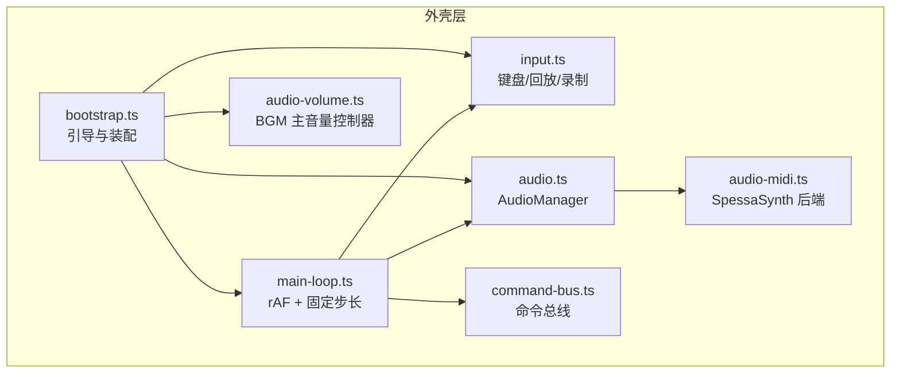
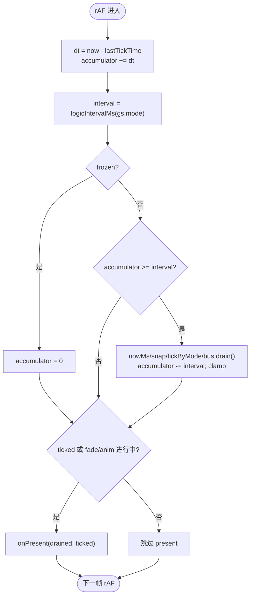
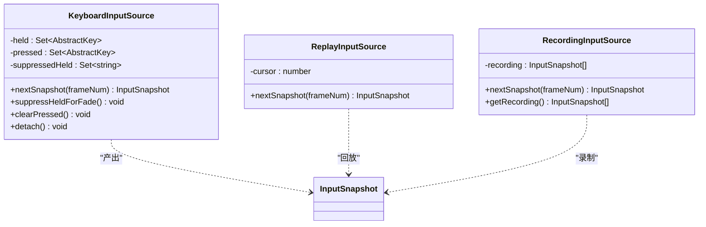
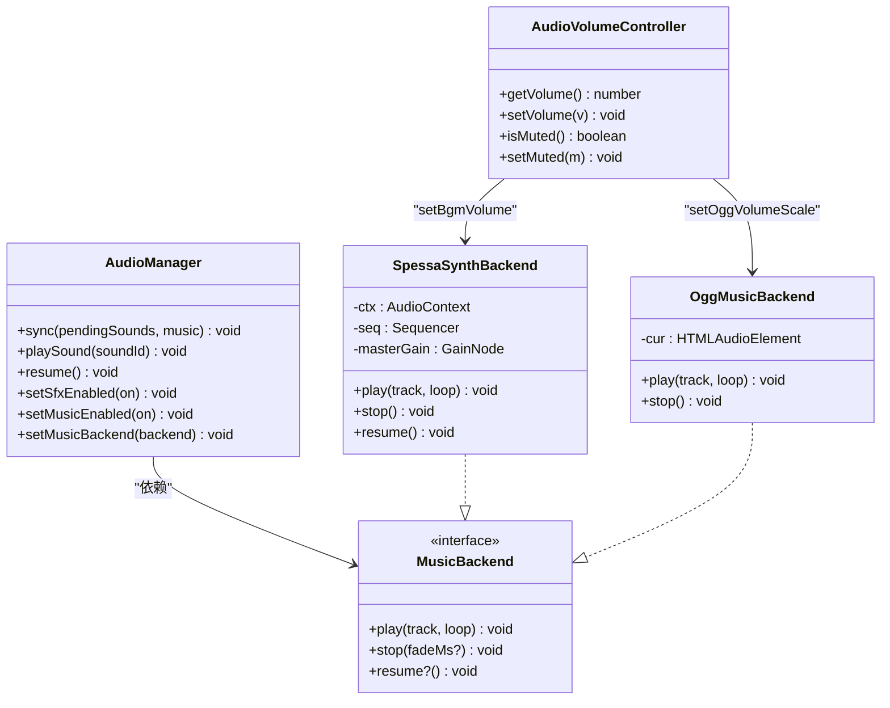
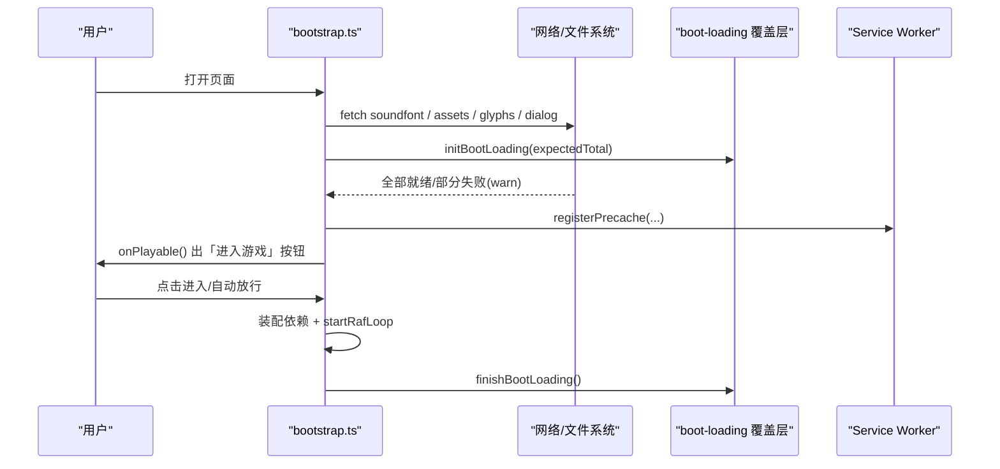
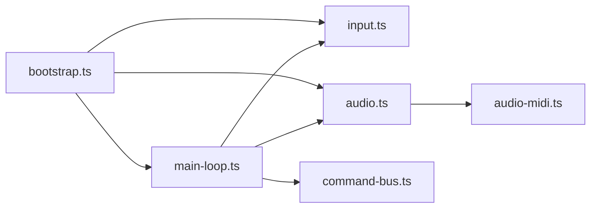

# 外壳层系统

<cite>
**本文引用的文件**
- [packages/game/src/shell/main-loop.ts](file://packages/game/src/shell/main-loop.ts)
- [packages/game/src/shell/input.ts](file://packages/game/src/shell/input.ts)
- [packages/game/src/shell/audio.ts](file://packages/game/src/shell/audio.ts)
- [packages/game/src/shell/audio-midi.ts](file://packages/game/src/shell/audio-midi.ts)
- [packages/game/src/shell/audio-volume.ts](file://packages/game/src/shell/audio-volume.ts)
- [packages/game/src/shell/bootstrap.ts](file://packages/game/src/shell/bootstrap.ts)
- [packages/game/src/core/command-bus.ts](file://packages/game/src/core/command-bus.ts)
</cite>

## 目录
1. [简介](#简介)
2. [项目结构](#项目结构)
3. [核心组件](#核心组件)
4. [架构总览](#架构总览)
5. [详细组件分析](#详细组件分析)
6. [依赖关系分析](#依赖关系分析)
7. [性能考量](#性能考量)
8. [故障排查指南](#故障排查指南)
9. [结论](#结论)
10. [附录](#附录)

## 简介
本文件面向“外壳层系统”的技术文档，聚焦以下子系统：
- 主循环系统：固定步长逻辑推进、帧率控制与模式切换、性能监控集成。
- 输入系统：键盘事件抽象、按键映射、输入快照、多设备/回放支持。
- 音频系统：MIDI 音乐播放（SpessaSynth）、音效管理、音量控制、音频上下文管理。
- 引导程序：资源加载、依赖注入、配置入口、错误恢复机制。
- 系统间通信协议与扩展接口：命令总线、音频后端、输入源等。

## 项目结构
外壳层位于 packages/game/src/shell，围绕 bootstrap 启动流程组织，将主循环、输入、音频、呈现与工具面板等装配在一起。



图表来源
- [packages/game/src/shell/bootstrap.ts:450-508](file://packages/game/src/shell/bootstrap.ts#L450-L508)
- [packages/game/src/shell/main-loop.ts:162-181](file://packages/game/src/shell/main-loop.ts#L162-L181)
- [packages/game/src/shell/input.ts:67-135](file://packages/game/src/shell/input.ts#L67-L135)
- [packages/game/src/shell/audio.ts:197-312](file://packages/game/src/shell/audio.ts#L197-L312)
- [packages/game/src/shell/audio-midi.ts:51-169](file://packages/game/src/shell/audio-midi.ts#L51-L169)
- [packages/game/src/shell/audio-volume.ts:1-19](file://packages/game/src/shell/audio-volume.ts#L1-L19)
- [packages/game/src/core/command-bus.ts:58-88](file://packages/game/src/core/command-bus.ts#L58-L88)

章节来源
- [packages/game/src/shell/bootstrap.ts:450-508](file://packages/game/src/shell/bootstrap.ts#L450-L508)
- [packages/game/src/shell/main-loop.ts:162-181](file://packages/game/src/shell/main-loop.ts#L162-L181)

## 核心组件
- 主循环：基于 requestAnimationFrame 的累积器实现，按游戏模式选择固定逻辑间隔（探索/事件 100ms，战斗 40ms），每 rAF 至多推进一次逻辑 tick，避免卡顿后连追；present 门控在逻辑 tick 或各类 fade/动画进行中才执行渲染。
- 输入系统：键盘事件到抽象键映射，维护 pressed/held 集合，提供 nextSnapshot 快照；支持 Replay/Recording 输入源；fade 期间方向键抑制与跨模态清键。
- 音频系统：AudioManager 负责 SFX 队列与 BGM 切曲；MusicBackend 抽象（当前默认 SpessaSynth MIDI 后端）；BGM 主音量控制器通过注入 applyVolume 驱动输出层缩放。
- 引导程序：并行加载资源（场景、字体、对话资产、soundfont），注入各子系统依赖，设置 onPresent 回调，启动主循环并处理预缓存让路、modal 独占等边界。

章节来源
- [packages/game/src/shell/main-loop.ts:1-182](file://packages/game/src/shell/main-loop.ts#L1-L182)
- [packages/game/src/shell/input.ts:1-165](file://packages/game/src/shell/input.ts#L1-L165)
- [packages/game/src/shell/audio.ts:1-313](file://packages/game/src/shell/audio.ts#L1-L313)
- [packages/game/src/shell/audio-midi.ts:1-170](file://packages/game/src/shell/audio-midi.ts#L1-L170)
- [packages/game/src/shell/audio-volume.ts:1-19](file://packages/game/src/shell/audio-volume.ts#L1-L19)
- [packages/game/src/shell/bootstrap.ts:215-508](file://packages/game/src/shell/bootstrap.ts#L215-L508)

## 架构总览
外壳层以 bootstrap 为入口，装配 GameState、CommandBus、InputSource、AudioManager、MusicBackend 与呈现管线，并通过 LoopContext 把 onPresent 注入主循环。

```mermaid
sequenceDiagram
participant Boot as "引导 bootstrap.ts"
participant Loop as "主循环 main-loop.ts"
participant Inp as "输入 input.ts"
participant Bus as "命令总线 command-bus.ts"
participant Aud as "音频 audio.ts"
participant Midi as "MIDI 后端 audio-midi.ts"
participant Vol as "音量控制器 audio-volume.ts"
Boot->>Boot : 并行加载资源/注入依赖
Boot->>Loop : startRafLoop(ctx)
Loop->>Inp : nextSnapshot(frameNum)
Loop->>Loop : tickByMode(gs, snap, bus)
Loop->>Bus : drain()
Loop->>Aud : onPresent(drained, ticked)
Aud->>Aud : sync(pendingSounds, music)
Aud->>Midi : play(track, loop)/stop()/resume()
Vol-->>Midi : setBgmVolume(effective)
```

图表来源
- [packages/game/src/shell/bootstrap.ts:450-508](file://packages/game/src/shell/bootstrap.ts#L450-L508)
- [packages/game/src/shell/main-loop.ts:162-181](file://packages/game/src/shell/main-loop.ts#L162-L181)
- [packages/game/src/shell/input.ts:95-104](file://packages/game/src/shell/input.ts#L95-L104)
- [packages/game/src/core/command-bus.ts:58-88](file://packages/game/src/core/command-bus.ts#L58-L88)
- [packages/game/src/shell/audio.ts:272-312](file://packages/game/src/shell/audio.ts#L272-L312)
- [packages/game/src/shell/audio-midi.ts:147-169](file://packages/game/src/shell/audio-midi.ts#L147-L169)
- [packages/game/src/shell/audio-volume.ts:1-19](file://packages/game/src/shell/audio-volume.ts#L1-L19)

## 详细组件分析

### 主循环系统（固定步长、帧率控制、性能监控）
- 固定步长：根据 gs.mode 选择 interval（battle=40ms，其他=100ms）。每 rAF 仅当 accumulator ≥ interval 时推进一次逻辑 tick，随后 accumulator -= interval 并 clamp 防止 catch-up。
- 模式切换：mode 中途切换不清零 accumulator，但超过 3×interval 会 clamp 到 1×interval，避免 explore→battle 瞬间多跑 tick。
- Present 门控：仅在逻辑 tick 或存在 fade/battleFade/battleAnim 时 present，避免空转重绘。
- 速通冻结：手动暂停时冻结世界推进，仅消费累积量，计时器与 FPS 覆盖层仍刷新。
- 性能监控：每 rAF 调用 tickFps(now) 累计帧数（未启用时内部早退）。



图表来源
- [packages/game/src/shell/main-loop.ts:49-137](file://packages/game/src/shell/main-loop.ts#L49-L137)
- [packages/game/src/shell/main-loop.ts:162-181](file://packages/game/src/shell/main-loop.ts#L162-L181)

章节来源
- [packages/game/src/shell/main-loop.ts:1-182](file://packages/game/src/shell/main-loop.ts#L1-L182)

### 输入系统（键盘、抽象映射、快照、多设备）
- 抽象键映射：物理键码 → AbstractKey，严格对齐 sdlpal 原义（WASD 不是方向键）。
- 状态机：held/pressed 集合，过滤 e.repeat 保证“后按优先”语义；Set 插入顺序用于 pickFacing 反向取末位。
- 输入快照：nextSnapshot 返回 {held, pressed, frameNum}，并在返回后清空 pressed。
- Fade 抑制：scene-fade 期间 suppressHeldForFade 阻止方向键持续生效，keyup 解除抑制。
- 多设备/回放：ReplayInputSource 按帧回放快照；RecordingInputSource 包装任意 InputSource 记录快照。



图表来源
- [packages/game/src/shell/input.ts:67-135](file://packages/game/src/shell/input.ts#L67-L135)
- [packages/game/src/shell/input.ts:137-164](file://packages/game/src/shell/input.ts#L137-L164)

章节来源
- [packages/game/src/shell/input.ts:1-165](file://packages/game/src/shell/input.ts#L1-L165)

### 音频系统（MIDI 播放、音效、音量、上下文）
- AudioManager：每帧 sync(pendingSounds, music)，drain SFX 队列并轮询 BGM track 变化；提供 resume/setSfxEnabled/setMusicEnabled/setMusicBackend。
- MusicBackend 抽象：play/stop/resume，当前默认由 createSpessaSynthBackend 实现。
- SpessaSynth 后端：在 AudioWorklet 中运行 SF2/SF3 软合成，直接播 Musics/{NNN}.mid；支持 reverbAmount 锁定 CC91；setBgmVolume 经 masterGain 控制。
- OGG 后端：createOggMusicBackend 使用 HTMLAudioElement 播放离线渲染的 OGG，供构建期预渲染路径。
- 音量控制：audio-volume.ts 维护 0..1 有效音量与静音状态，localStorage 持久化；applyVolume 注入到 setBgmVolume 与 setOggVolumeScale。
- 上下文管理：首个用户手势触发 resume，解决浏览器 autoplay policy；非 secure context 下给出明确提示。



图表来源
- [packages/game/src/shell/audio.ts:197-312](file://packages/game/src/shell/audio.ts#L197-L312)
- [packages/game/src/shell/audio-midi.ts:51-169](file://packages/game/src/shell/audio-midi.ts#L51-L169)
- [packages/game/src/shell/audio-volume.ts:1-19](file://packages/game/src/shell/audio-volume.ts#L1-L19)

章节来源
- [packages/game/src/shell/audio.ts:1-313](file://packages/game/src/shell/audio.ts#L1-L313)
- [packages/game/src/shell/audio-midi.ts:1-170](file://packages/game/src/shell/audio-midi.ts#L1-L170)
- [packages/game/src/shell/audio-volume.ts:1-19](file://packages/game/src/shell/audio-volume.ts#L1-L19)

### 引导程序（初始化、依赖注入、配置、错误恢复）
- 并行加载：soundfont、场景资源、glyphs、dialog 资产 Promise.all 并行；失败不阻塞（warn 降级）。
- 依赖注入：创建 CommandBus、KeyboardInputSource、AudioManager、SpessaSynth 后端，注入 LoopContext.onPresent。
- 配置入口：从 URL 参数解析 buildFlag/skip-intro；工具面板、速通热键、快速存档等按需 setup。
- 错误恢复：showError 绘制错误信息；boot-loading 覆盖层显示进度/失败；SW 不可用时放行可玩门。
- 预缓存让路：modal 播放 suspendRaf 期间 pausePrecache，避免抢带宽。



图表来源
- [packages/game/src/shell/bootstrap.ts:215-236](file://packages/game/src/shell/bootstrap.ts#L215-L236)
- [packages/game/src/shell/boot-loading.ts:104-149](file://packages/game/src/shell/boot-loading.ts#L104-L149)

章节来源
- [packages/game/src/shell/bootstrap.ts:215-508](file://packages/game/src/shell/bootstrap.ts#L215-L508)
- [packages/game/src/shell/boot-loading.ts:104-149](file://packages/game/src/shell/boot-loading.ts#L104-L149)

### 系统间通信协议与扩展接口
- 命令总线：core 通过 emit(cmd) 产生 PresentCommand，shell 每 tick 后 drain() 消费，用于战斗浮动数字、音效触发等。
- 音频后端：MusicBackend 接口允许替换 BGM 播放实现（MIDI/OGG/自定义）。
- 输入源：InputSource 接口统一 nextSnapshot，便于回放/录制/外部设备接入。
- 音量控制：AudioVolumeController 暴露 get/set 与 isMuted，通过注入 applyVolume 影响输出层。

章节来源
- [packages/game/src/core/command-bus.ts:58-88](file://packages/game/src/core/command-bus.ts#L58-L88)
- [packages/game/src/shell/audio.ts:19-44](file://packages/game/src/shell/audio.ts#L19-L44)
- [packages/game/src/shell/input.ts:1-16](file://packages/game/src/shell/input.ts#L1-L16)
- [packages/game/src/shell/audio-volume.ts:1-19](file://packages/game/src/shell/audio-volume.ts#L1-L19)

## 依赖关系分析
- 耦合与内聚：
  - bootstrap 集中装配，降低 shell 模块间相互引用复杂度。
  - main-loop 仅依赖 shared 常量、core/mode、scene-system 与 tools/fps-overlay，职责单一。
  - audio.ts 与 audio-midi.ts 通过 MusicBackend 解耦，便于替换后端。
- 外部依赖：
  - Web Audio API、AudioWorklet、HTMLAudioElement。
  - spessasynth_lib（运行时 MIDI 合成）。
  - Service Worker（可选，预缓存）。
- 潜在环依赖：无直接环；所有关键交互通过接口或回调（onPresent、MusicBackend、InputSource）完成。



图表来源
- [packages/game/src/shell/bootstrap.ts:450-508](file://packages/game/src/shell/bootstrap.ts#L450-L508)
- [packages/game/src/shell/main-loop.ts:162-181](file://packages/game/src/shell/main-loop.ts#L162-L181)
- [packages/game/src/shell/audio.ts:197-312](file://packages/game/src/shell/audio.ts#L197-L312)
- [packages/game/src/shell/audio-midi.ts:51-169](file://packages/game/src/shell/audio-midi.ts#L51-L169)
- [packages/game/src/core/command-bus.ts:58-88](file://packages/game/src/core/command-bus.ts#L58-L88)

章节来源
- [packages/game/src/shell/bootstrap.ts:450-508](file://packages/game/src/shell/bootstrap.ts#L450-L508)
- [packages/game/src/shell/main-loop.ts:162-181](file://packages/game/src/shell/main-loop.ts#L162-L181)

## 性能考量
- 固定步长与防连追：每 rAF 最多 1 tick，clamp 积压，避免卡顿后瞬移/跳帧。
- Present 门控：仅在必要时渲染，减少高刷屏下的无效重绘。
- 资源并行与降级：soundfont/glyphs/dialog 并行加载，失败 warn 继续；OGG 缺失静默回退。
- 预缓存让路：modal 播放期间暂停预缓存，避免视频/输入 IO 争用。
- 内存控制：场景 tile 位图 LRU 缓存，保护当前场景，淘汰联动释放。

[本节为通用指导，无需源码引用]

## 故障排查指南
- 无 BGM 但有 SFX：检查是否非 secure context（http 局域网 IP）导致 AudioWorklet 不可用；改用 https 或 http://localhost。
- Soundfont 加载失败：确认 public/soundfont.sf3 存在且为 RIFF 容器；dev server 回 index.html 会被识别并报错。
- 启动黑屏/文字 tofu：loadGlyphs 失败不会阻塞，但文本会退化；检查 glyphs.json 与网络可达性。
- 启动卡住：查看 boot-loading 覆盖层状态与 failBootLoading 日志；确认 soundfont/资源 HTTP 状态。
- 声音延迟/不同步：确保首个用户手势已触发 resume；检查 modal 播放 suspendRaf 期间音频 drain 未被阻塞。

章节来源
- [packages/game/src/shell/audio-midi.ts:85-145](file://packages/game/src/shell/audio-midi.ts#L85-L145)
- [packages/game/src/shell/bootstrap.ts:215-236](file://packages/game/src/shell/bootstrap.ts#L215-L236)
- [packages/game/src/shell/boot-loading.ts:130-149](file://packages/game/src/shell/boot-loading.ts#L130-L149)

## 结论
外壳层通过清晰的装配与解耦接口，将主循环、输入、音频与引导流程整合成稳定可靠的运行时骨架。固定步长与 present 门控保障时序与性能；输入快照与多源支持提升可测性与可回放性；音频后端抽象与音量控制器使播放策略灵活可控；引导程序的并行加载与错误降级确保用户体验稳健。

[本节为总结，无需源码引用]

## 附录
- 关键接口定义
  - MusicBackend：play/stop/resume
  - InputSource：nextSnapshot
  - CommandBus：emit/drain/complete
  - AudioVolumeController：getVolume/setVolume/isMuted/setMuted

章节来源
- [packages/game/src/shell/audio.ts:19-44](file://packages/game/src/shell/audio.ts#L19-L44)
- [packages/game/src/shell/input.ts:1-16](file://packages/game/src/shell/input.ts#L1-L16)
- [packages/game/src/core/command-bus.ts:58-88](file://packages/game/src/core/command-bus.ts#L58-L88)
- [packages/game/src/shell/audio-volume.ts:1-19](file://packages/game/src/shell/audio-volume.ts#L1-L19)