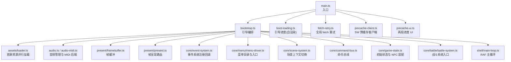
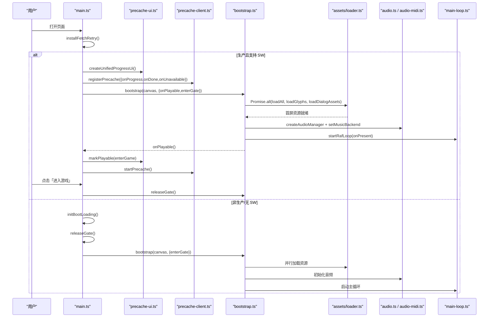
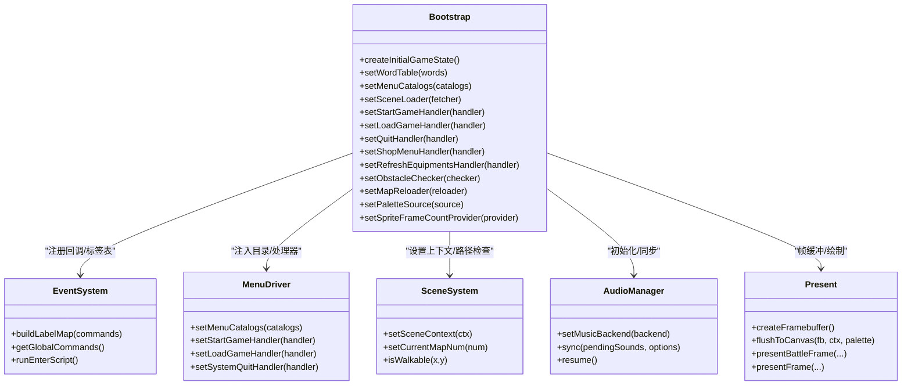
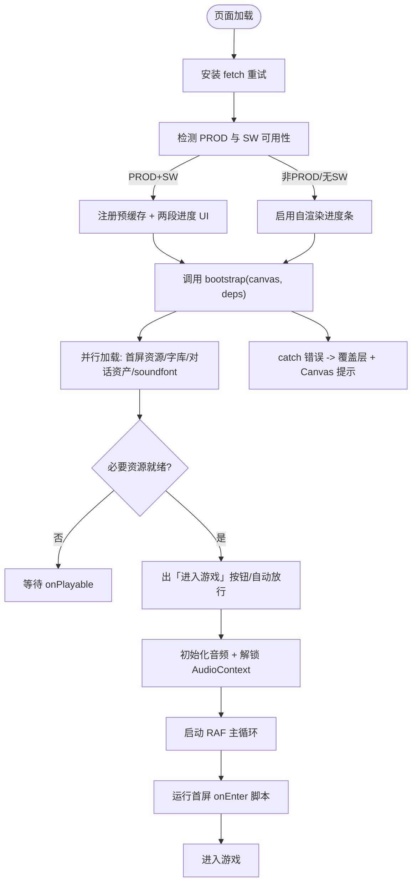
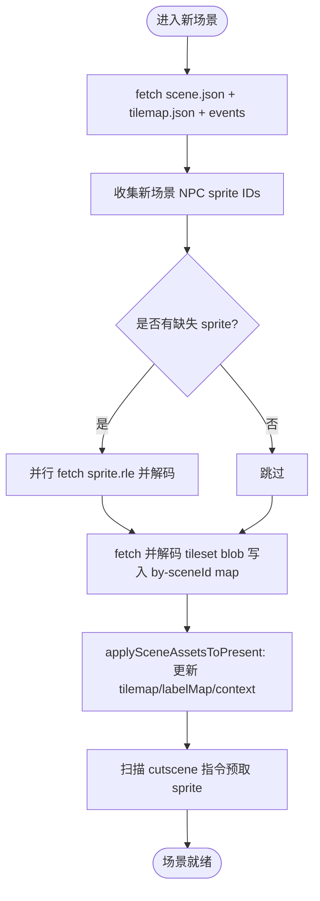
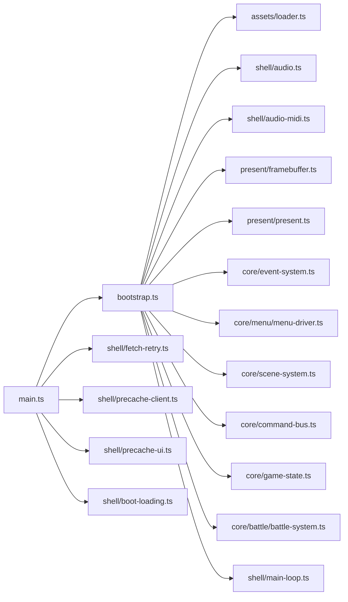

# 引导程序

<cite>
**本文引用的文件**
- [packages/game/src/main.ts](file://packages/game/src/main.ts)
- [packages/game/src/shell/bootstrap.ts](file://packages/game/src/shell/bootstrap.ts)
- [packages/game/src/shell/boot-loading.ts](file://packages/game/src/shell/boot-loading.ts)
- [packages/game/src/shell/fetch-retry.ts](file://packages/game/src/shell/fetch-retry.ts)
- [packages/game/src/shell/precache-client.ts](file://packages/game/src/shell/precache-client.ts)
- [packages/game/src/shell/precache-ui.ts](file://packages/game/src/shell/precache-ui.ts)
- [packages/game/src/shell/audio.ts](file://packages/game/src/shell/audio.ts)
- [packages/game/src/shell/audio-midi.ts](file://packages/game/src/shell/audio-midi.ts)
- [packages/game/src/shell/avi-player.ts](file://packages/game/src/shell/avi-player.ts)
- [packages/game/src/assets/loader.ts](file://packages/game/src/assets/loader.ts)
- [packages/game/src/present/framebuffer.ts](file://packages/game/src/present/framebuffer.ts)
- [packages/game/src/present/present.ts](file://packages/game/src/present/present.ts)
- [packages/game/src/core/event-system.ts](file://packages/game/src/core/event-system.ts)
- [packages/game/src/core/menu/menu-driver.ts](file://packages/game/src/core/menu/menu-driver.ts)
- [packages/game/src/core/scene-system.ts](file://packages/game/src/core/scene-system.ts)
- [packages/game/src/core/command-bus.ts](file://packages/game/src/core/command-bus.ts)
- [packages/game/src/core/game-state.ts](file://packages/game/src/core/game-state.ts)
- [packages/game/src/core/battle/battle-system.ts](file://packages/game/src/core/battle/battle-system.ts)
- [packages/game/src/shell/main-loop.ts](file://packages/game/src/shell/main-loop.ts)
</cite>

## 目录
1. [简介](#简介)
2. [项目结构](#项目结构)
3. [核心组件](#核心组件)
4. [架构总览](#架构总览)
5. [详细组件分析](#详细组件分析)
6. [依赖关系分析](#依赖关系分析)
7. [性能考量](#性能考量)
8. [故障排查指南](#故障排查指南)
9. [结论](#结论)
10. [附录](#附录)

## 简介
本文件聚焦于浏览器端游戏的“引导程序”（Bootstrap）子系统，覆盖从页面加载到可玩主循环启动的完整流程。内容包含：
- 依赖注入容器构建与核心服务注册
- 配置参数解析与默认值合并
- 启动序列：资源预加载、Canvas 初始化、音频上下文准备、错误恢复机制
- 模块化加载策略：按需加载、懒初始化、内存管理
- 配置管理系统：配置文件解析、默认值合并、运行时配置更新
- 错误处理与日志记录：异常捕获、用户友好提示、开发模式诊断信息
- 自定义引导流程与扩展点集成方法

## 项目结构
引导程序位于 packages/game 包内，入口为 main.ts，核心编排在 shell/bootstrap.ts，并协同 shell 层多个模块完成网络重试、进度条、离线预缓存、音频解锁等能力；同时通过 assets/loader.ts 并行拉取首屏场景资源，present 层负责帧缓冲与绘制，core 层提供事件系统、菜单驱动、场景系统与游戏状态等。

图表来源
- [packages/game/src/main.ts:1-78](file://packages/game/src/main.ts#L1-L78)
- [packages/game/src/shell/bootstrap.ts:215-508](file://packages/game/src/shell/bootstrap.ts#L215-L508)
- [packages/game/src/shell/boot-loading.ts:1-200](file://packages/game/src/shell/boot-loading.ts#L1-L200)
- [packages/game/src/shell/fetch-retry.ts:1-200](file://packages/game/src/shell/fetch-retry.ts#L1-L200)
- [packages/game/src/shell/precache-client.ts:1-200](file://packages/game/src/shell/precache-client.ts#L1-L200)
- [packages/game/src/shell/precache-ui.ts:1-200](file://packages/game/src/shell/precache-ui.ts#L1-L200)
- [packages/game/src/assets/loader.ts:1-200](file://packages/game/src/assets/loader.ts#L1-L200)
- [packages/game/src/present/framebuffer.ts:1-200](file://packages/game/src/present/framebuffer.ts#L1-L200)
- [packages/game/src/present/present.ts:1-200](file://packages/game/src/present/present.ts#L1-L200)
- [packages/game/src/core/event-system.ts:1-200](file://packages/game/src/core/event-system.ts#L1-L200)
- [packages/game/src/core/menu/menu-driver.ts:1-200](file://packages/game/src/core/menu/menu-driver.ts#L1-L200)
- [packages/game/src/core/scene-system.ts:1-200](file://packages/game/src/core/scene-system.ts#L1-L200)
- [packages/game/src/core/command-bus.ts:1-200](file://packages/game/src/core/command-bus.ts#L1-L200)
- [packages/game/src/core/game-state.ts:1-200](file://packages/game/src/core/game-state.ts#L1-L200)
- [packages/game/src/core/battle/battle-system.ts:1-200](file://packages/game/src/core/battle/battle-system.ts#L1-L200)
- [packages/game/src/shell/main-loop.ts:1-200](file://packages/game/src/shell/main-loop.ts#L1-L200)

章节来源
- [packages/game/src/main.ts:1-78](file://packages/game/src/main.ts#L1-L78)
- [packages/game/src/shell/bootstrap.ts:215-508](file://packages/game/src/shell/bootstrap.ts#L215-L508)

## 核心组件
- 引导入口与门控
  - main.ts 负责环境探测、SW 可用性判断、两段进度 UI 挂载、可玩门 enterGate 控制、以及 bootstrap 调用与错误兜底。
- 引导编排器
  - bootstrap.ts 是核心编排器：并行加载首屏资源、字库与对话资产；创建帧缓冲与呈现上下文；注册事件系统回调与菜单目录；初始化音频管理器与 MIDI 后端；建立按场景懒加载的资源缓存；启动 RAF 主循环；并在每帧同步音频与呈现。
- 资源加载器
  - assets/loader.ts 提供 loadAll 等接口，用于首屏场景资源的批量并行加载。
- 音频系统
  - shell/audio.ts 与 shell/audio-midi.ts 提供 Web Audio 抽象与 SpessaSynth MIDI 后端；支持音量、开关、BGM/SFX 同步。
- 呈现与帧缓冲
  - present/framebuffer.ts 与 present/present.ts 提供离屏缓冲与帧绘制路由（大世界/战斗）。
- 核心系统
  - core/event-system.ts、core/menu/menu-driver.ts、core/scene-system.ts、core/command-bus.ts、core/game-state.ts、core/battle/battle-system.ts 提供事件执行、菜单、场景切换、命令分发、状态与战斗入口。
- 主循环
  - shell/main-loop.ts 提供基于 requestAnimationFrame 的主循环框架。

章节来源
- [packages/game/src/shell/bootstrap.ts:215-508](file://packages/game/src/shell/bootstrap.ts#L215-L508)
- [packages/game/src/assets/loader.ts:1-200](file://packages/game/src/assets/loader.ts#L1-L200)
- [packages/game/src/shell/audio.ts:1-200](file://packages/game/src/shell/audio.ts#L1-L200)
- [packages/game/src/shell/audio-midi.ts:1-200](file://packages/game/src/shell/audio-midi.ts#L1-L200)
- [packages/game/src/present/framebuffer.ts:1-200](file://packages/game/src/present/framebuffer.ts#L1-L200)
- [packages/game/src/present/present.ts:1-200](file://packages/game/src/present/present.ts#L1-L200)
- [packages/game/src/core/event-system.ts:1-200](file://packages/game/src/core/event-system.ts#L1-L200)
- [packages/game/src/core/menu/menu-driver.ts:1-200](file://packages/game/src/core/menu/menu-driver.ts#L1-L200)
- [packages/game/src/core/scene-system.ts:1-200](file://packages/game/src/core/scene-system.ts#L1-L200)
- [packages/game/src/core/command-bus.ts:1-200](file://packages/game/src/core/command-bus.ts#L1-L200)
- [packages/game/src/core/game-state.ts:1-200](file://packages/game/src/core/game-state.ts#L1-L200)
- [packages/game/src/core/battle/battle-system.ts:1-200](file://packages/game/src/core/battle/battle-system.ts#L1-L200)
- [packages/game/src/shell/main-loop.ts:1-200](file://packages/game/src/shell/main-loop.ts#L1-L200)

## 架构总览
引导程序的总体时序如下：页面加载 → 安装网络重试 → 检测 SW 与生产环境 → 挂载两段进度 UI → 并行拉取必要资源与字体/对话资产 → 等待可玩门 → 进入商标/开场视频或 DOS 回退 → 初始化 Canvas/帧缓冲/音频 → 注册核心服务 → 启动主循环 → 运行首屏 onEnter 脚本 → 进入游戏。

图表来源
- [packages/game/src/main.ts:1-78](file://packages/game/src/main.ts#L1-L78)
- [packages/game/src/shell/precache-ui.ts:1-200](file://packages/game/src/shell/precache-ui.ts#L1-L200)
- [packages/game/src/shell/precache-client.ts:1-200](file://packages/game/src/shell/precache-client.ts#L1-L200)
- [packages/game/src/shell/bootstrap.ts:215-508](file://packages/game/src/shell/bootstrap.ts#L215-L508)
- [packages/game/src/assets/loader.ts:1-200](file://packages/game/src/assets/loader.ts#L1-L200)
- [packages/game/src/shell/audio.ts:1-200](file://packages/game/src/shell/audio.ts#L1-L200)
- [packages/game/src/shell/audio-midi.ts:1-200](file://packages/game/src/shell/audio-midi.ts#L1-L200)
- [packages/game/src/shell/main-loop.ts:1-200](file://packages/game/src/shell/main-loop.ts#L1-L200)

## 详细组件分析

### 依赖注入与服务注册
- 依赖注入容器构建
  - 采用“显式组装”模式：bootstrap.ts 中集中创建关键对象（帧缓冲、音频管理器、命令总线、输入源），并通过 setter 将能力注入到各子系统（事件系统、菜单驱动、场景系统等）。
- 核心服务注册
  - 事件系统：注册全局命令、标签表、场景加载器、商店菜单、刷新装备、结束动画、音效播放等回调。
  - 菜单驱动：注入物品/法术/角色目录、开始/读档/退出处理器。
  - 场景系统：设置当前场景上下文（tilemap、事件命令、标签表）、障碍物检测、地图重载器等。
  - 词表与对话框：注入 WORD.DAT 词表与对话图标/头像资源。
- 数据装配
  - 首屏玩家角色 sprite 帧装配、NPC 精灵帧数回填、事件对象切片与静态默认值填充。
  - 战斗呈现资源装配（敌方位置、魔法特效、UI 数字帧等）。

图表来源
- [packages/game/src/shell/bootstrap.ts:215-508](file://packages/game/src/shell/bootstrap.ts#L215-L508)
- [packages/game/src/core/event-system.ts:1-200](file://packages/game/src/core/event-system.ts#L1-L200)
- [packages/game/src/core/menu/menu-driver.ts:1-200](file://packages/game/src/core/menu/menu-driver.ts#L1-L200)
- [packages/game/src/core/scene-system.ts:1-200](file://packages/game/src/core/scene-system.ts#L1-L200)
- [packages/game/src/shell/audio.ts:1-200](file://packages/game/src/shell/audio.ts#L1-L200)
- [packages/game/src/present/framebuffer.ts:1-200](file://packages/game/src/present/framebuffer.ts#L1-L200)
- [packages/game/src/present/present.ts:1-200](file://packages/game/src/present/present.ts#L1-L200)

章节来源
- [packages/game/src/shell/bootstrap.ts:215-508](file://packages/game/src/shell/bootstrap.ts#L215-L508)

### 启动序列与错误恢复
- 资源预加载
  - 并行拉取首屏场景资源、字库与对话资产；soundfont 提前下载但不阻塞主流程，失败降级为静默 BGM。
- Canvas 初始化
  - 获取 2D 上下文，创建帧缓冲，构建呈现上下文（tilemap/tileImages/NPC 精灵/对话资产/UI 资源等）。
- 音频上下文准备
  - 创建音频管理器与 MIDI 后端；监听键盘/指针事件以解除浏览器自动播放限制；每帧同步 BGM/SFX。
- 错误恢复机制
  - 全局 fetch 重试包装；SW 不可用时自动放行可玩门；资源缺失时降级（如字库 tofu、NPC 持久化失效）；错误统一显示在覆盖层与 Canvas。

图表来源
- [packages/game/src/main.ts:1-78](file://packages/game/src/main.ts#L1-L78)
- [packages/game/src/shell/bootstrap.ts:215-508](file://packages/game/src/shell/bootstrap.ts#L215-L508)
- [packages/game/src/shell/fetch-retry.ts:1-200](file://packages/game/src/shell/fetch-retry.ts#L1-L200)
- [packages/game/src/shell/boot-loading.ts:1-200](file://packages/game/src/shell/boot-loading.ts#L1-L200)
- [packages/game/src/shell/precache-client.ts:1-200](file://packages/game/src/shell/precache-client.ts#L1-L200)
- [packages/game/src/shell/precache-ui.ts:1-200](file://packages/game/src/shell/precache-ui.ts#L1-L200)

章节来源
- [packages/game/src/main.ts:1-78](file://packages/game/src/main.ts#L1-L78)
- [packages/game/src/shell/bootstrap.ts:215-508](file://packages/game/src/shell/bootstrap.ts#L215-L508)

### 模块化加载策略：按需加载、懒初始化、内存管理
- 首屏并行加载
  - 使用 Promise.all 并行拉取首屏场景、字库、对话资产，缩短首屏时间。
- 场景按需加载
  - 通过 SceneAssetsCache 与 sceneFetcher 实现：仅在新场景需要时 fetch scene JSON、tilemap JSON、事件脚本与缺失的 NPC sprite；tile PNG 解码后按场景 ID 缓存。
- 懒初始化
  - 新场景 NPC sprite 仅在首次出现时补 fetch；cutscene 前扫描 setPlayerSprite 指令预取相关 sprite。
- 内存管理
  - 场景资源 LRU 上限（默认 16），淘汰时联动释放 tileImagesBySceneId 对应条目；保护当前场景不被淘汰；缩略图渲染使用临时 Map，渲染后即弃。

图表来源
- [packages/game/src/shell/bootstrap.ts:556-628](file://packages/game/src/shell/bootstrap.ts#L556-L628)
- [packages/game/src/shell/bootstrap.ts:641-651](file://packages/game/src/shell/bootstrap.ts#L641-L651)
- [packages/game/src/shell/bootstrap.ts:756-768](file://packages/game/src/shell/bootstrap.ts#L756-L768)

章节来源
- [packages/game/src/shell/bootstrap.ts:556-628](file://packages/game/src/shell/bootstrap.ts#L556-L628)
- [packages/game/src/shell/bootstrap.ts:641-651](file://packages/game/src/shell/bootstrap.ts#L641-L651)
- [packages/game/src/shell/bootstrap.ts:756-768](file://packages/game/src/shell/bootstrap.ts#L756-L768)

### 配置管理系统：解析、合并与运行时更新
- 配置来源
  - URL 查询参数：skip-intro（跳过开场梦境）、build（dos/win95 风格）。
  - 环境变量：import.meta.env.PROD 决定 SW 与可玩门行为。
- 默认值合并
  - 若未传 build，则默认 win95；若未传 skip-intro，则默认 false。
- 运行时更新
  - 音频开关与音量：由 GameState 字段驱动，每帧同步至 AudioManager。
  - 场景切换：通过 setSceneContext 动态更新 tilemap、事件命令与标签表。
  - 菜单目录：setMenuCatalogs 注入 items/spells/magics/playerRoles，供菜单系统消费。

章节来源
- [packages/game/src/shell/bootstrap.ts:139-156](file://packages/game/src/shell/bootstrap.ts#L139-L156)
- [packages/game/src/shell/bootstrap.ts:265-269](file://packages/game/src/shell/bootstrap.ts#L265-L269)
- [packages/game/src/shell/bootstrap.ts:481-507](file://packages/game/src/shell/bootstrap.ts#L481-L507)
- [packages/game/src/shell/bootstrap.ts:641-651](file://packages/game/src/shell/bootstrap.ts#L641-L651)

### 错误处理与日志记录
- 异常捕获
  - bootstrap 外层 try/catch 捕获启动期错误；资源加载失败走 warn 降级（如字库缺失、event-objects.json 不可用）。
- 用户友好提示
  - 覆盖层显示错误消息；Canvas 上绘制红色背景与错误文本；SW 不可用时自动放行不阻断体验。
- 开发模式诊断
  - dev 面板、缩略图渲染、FPS 叠加等工具辅助定位问题；控制台输出关键警告与日志。

章节来源
- [packages/game/src/main.ts:59-74](file://packages/game/src/main.ts#L59-L74)
- [packages/game/src/shell/bootstrap.ts:229-236](file://packages/game/src/shell/bootstrap.ts#L229-L236)
- [packages/game/src/shell/bootstrap.ts:306-321](file://packages/game/src/shell/bootstrap.ts#L306-L321)
- [packages/game/src/shell/bootstrap.ts:198-206](file://packages/game/src/shell/bootstrap.ts#L198-L206)

### 自定义引导流程与扩展点集成
- 扩展点
  - onPlayable：必要资源就绪回调，可用于触发额外预热或 UI 交互。
  - enterGate：Promise 门控，允许外部逻辑决定是否放行 bootstrap。
  - setSceneLoader/setStartGameHandler/setLoadGameHandler/setQuitHandler：替换场景加载、开始/读档/退出逻辑。
  - setObstacleChecker/setMapReloader/setPaletteSource：定制碰撞、地图重载与调色板来源。
  - setSpriteFrameCountProvider：为 NPC 帧数计算提供数据源。
- 集成建议
  - 在 main.ts 中组合自定义 onPlayable/enterGate 逻辑；在 bootstrap.ts 中通过现有 setter 注入自定义行为；确保与主循环 onPresent 的 suspendRaf 语义一致。

章节来源
- [packages/game/src/main.ts:17-28](file://packages/game/src/main.ts#L17-L28)
- [packages/game/src/shell/bootstrap.ts:208-214](file://packages/game/src/shell/bootstrap.ts#L208-L214)
- [packages/game/src/shell/bootstrap.ts:265-269](file://packages/game/src/shell/bootstrap.ts#L265-L269)
- [packages/game/src/shell/bootstrap.ts:360-361](file://packages/game/src/shell/bootstrap.ts#L360-L361)

## 依赖关系分析
引导程序对以下模块存在强依赖：
- 资源加载：assets/loader.ts
- 音频：shell/audio.ts、shell/audio-midi.ts
- 呈现：present/framebuffer.ts、present/present.ts
- 核心系统：core/event-system.ts、core/menu/menu-driver.ts、core/scene-system.ts、core/command-bus.ts、core/game-state.ts、core/battle/battle-system.ts
- 主循环：shell/main-loop.ts
- 网络与缓存：shell/fetch-retry.ts、shell/precache-client.ts、shell/precache-ui.ts、shell/boot-loading.ts

图表来源
- [packages/game/src/main.ts:1-78](file://packages/game/src/main.ts#L1-L78)
- [packages/game/src/shell/bootstrap.ts:215-508](file://packages/game/src/shell/bootstrap.ts#L215-L508)
- [packages/game/src/assets/loader.ts:1-200](file://packages/game/src/assets/loader.ts#L1-L200)
- [packages/game/src/shell/audio.ts:1-200](file://packages/game/src/shell/audio.ts#L1-L200)
- [packages/game/src/shell/audio-midi.ts:1-200](file://packages/game/src/shell/audio-midi.ts#L1-L200)
- [packages/game/src/present/framebuffer.ts:1-200](file://packages/game/src/present/framebuffer.ts#L1-L200)
- [packages/game/src/present/present.ts:1-200](file://packages/game/src/present/present.ts#L1-L200)
- [packages/game/src/core/event-system.ts:1-200](file://packages/game/src/core/event-system.ts#L1-L200)
- [packages/game/src/core/menu/menu-driver.ts:1-200](file://packages/game/src/core/menu/menu-driver.ts#L1-L200)
- [packages/game/src/core/scene-system.ts:1-200](file://packages/game/src/core/scene-system.ts#L1-L200)
- [packages/game/src/core/command-bus.ts:1-200](file://packages/game/src/core/command-bus.ts#L1-L200)
- [packages/game/src/core/game-state.ts:1-200](file://packages/game/src/core/game-state.ts#L1-L200)
- [packages/game/src/core/battle/battle-system.ts:1-200](file://packages/game/src/core/battle/battle-system.ts#L1-L200)
- [packages/game/src/shell/main-loop.ts:1-200](file://packages/game/src/shell/main-loop.ts#L1-L200)
- [packages/game/src/shell/fetch-retry.ts:1-200](file://packages/game/src/shell/fetch-retry.ts#L1-L200)
- [packages/game/src/shell/precache-client.ts:1-200](file://packages/game/src/shell/precache-client.ts#L1-L200)
- [packages/game/src/shell/precache-ui.ts:1-200](file://packages/game/src/shell/precache-ui.ts#L1-L200)
- [packages/game/src/shell/boot-loading.ts:1-200](file://packages/game/src/shell/boot-loading.ts#L1-L200)

章节来源
- [packages/game/src/main.ts:1-78](file://packages/game/src/main.ts#L1-L78)
- [packages/game/src/shell/bootstrap.ts:215-508](file://packages/game/src/shell/bootstrap.ts#L215-L508)

## 性能考量
- 并行加载：首屏资源、字库、对话资产并行拉取，减少首屏时间。
- 带宽让路：modal 播放期间暂停预缓存，避免与视频流争抢带宽。
- 按需加载：新场景资源与 NPC sprite 懒加载，降低首屏压力。
- 内存控制：场景资源 LRU 上限与联动释放，防止常驻内存膨胀。
- 音频优化：soundfont 提前下载但不阻塞主流程；AudioContext 在用户手势后 resume，避免静默。

[本节为通用指导，无需列出具体文件来源]

## 故障排查指南
- 常见问题
  - 音频无声：确认用户手势已触发 AudioContext.resume；检查 MIDI 后端 soundfont 是否可用。
  - 画面黑屏：检查 tileset blob 与 NPC sprite 是否成功加载；确认 applySceneAssetsToPresent 被调用。
  - 资源 404：核对 /extracted 路径与文件名；查看 fetch 重试与错误日志。
  - 预缓存失败：SW 不可用时会自动放行；检查 precache-client 的 onUnavailable 分支。
- 调试手段
  - 开启 dev 面板与缩略图渲染；使用 FPS 叠加观察卡顿；查看控制台 warn/error 日志。

章节来源
- [packages/game/src/shell/bootstrap.ts:229-236](file://packages/game/src/shell/bootstrap.ts#L229-L236)
- [packages/game/src/shell/bootstrap.ts:306-321](file://packages/game/src/shell/bootstrap.ts#L306-L321)
- [packages/game/src/shell/bootstrap.ts:556-628](file://packages/game/src/shell/bootstrap.ts#L556-L628)
- [packages/game/src/main.ts:59-74](file://packages/game/src/main.ts#L59-L74)

## 结论
引导程序通过显式组装与分层职责划分，实现了高可靠、可扩展的启动流程。其并行加载、按需加载与内存管理策略有效平衡了首屏性能与长期稳定性；完善的错误恢复与用户提示提升了用户体验；丰富的扩展点便于二次开发与定制化需求。

[本节为总结性内容，无需列出具体文件来源]

## 附录
- 关键入口与函数路径
  - 入口：packages/game/src/main.ts
  - 引导编排：packages/game/src/shell/bootstrap.ts
  - 资源加载：packages/game/src/assets/loader.ts
  - 音频管理：packages/game/src/shell/audio.ts、packages/game/src/shell/audio-midi.ts
  - 呈现与帧缓冲：packages/game/src/present/framebuffer.ts、packages/game/src/present/present.ts
  - 核心系统：packages/game/src/core/event-system.ts、packages/game/src/core/menu/menu-driver.ts、packages/game/src/core/scene-system.ts、packages/game/src/core/command-bus.ts、packages/game/src/core/game-state.ts、packages/game/src/core/battle/battle-system.ts
  - 主循环：packages/game/src/shell/main-loop.ts
  - 网络与缓存：packages/game/src/shell/fetch-retry.ts、packages/game/src/shell/precache-client.ts、packages/game/src/shell/precache-ui.ts、packages/game/src/shell/boot-loading.ts

[本节为导航性内容，无需列出具体文件来源]