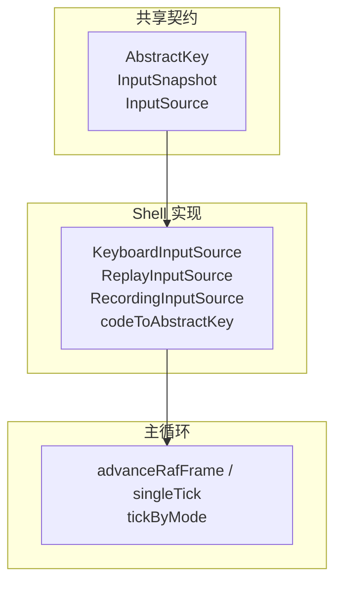
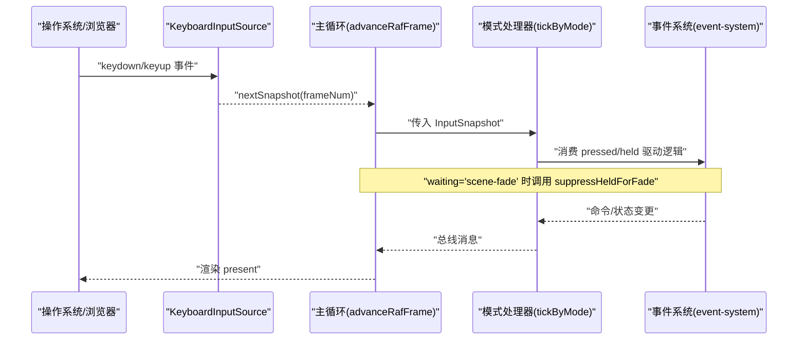
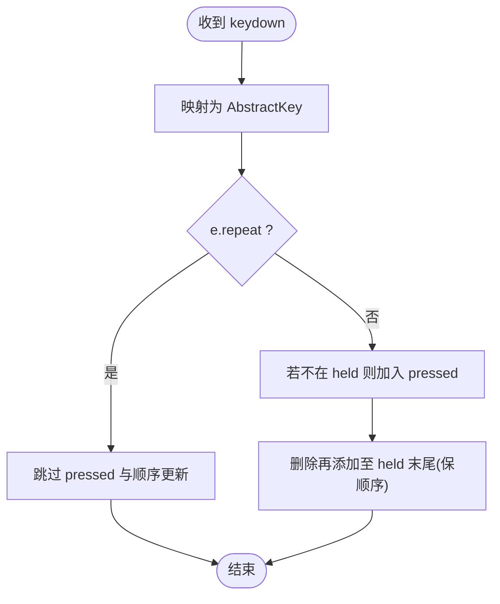
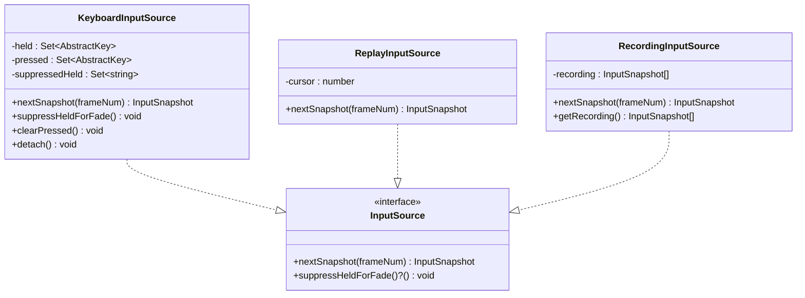
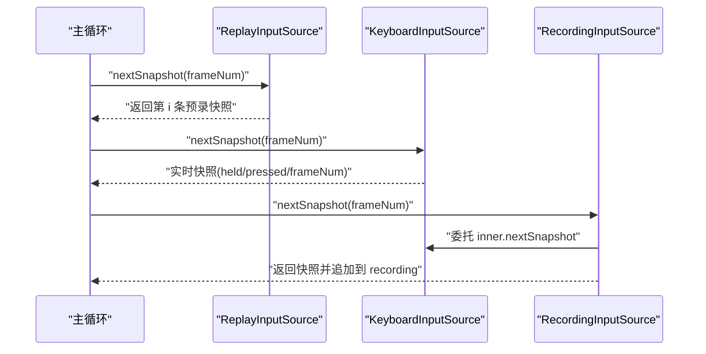
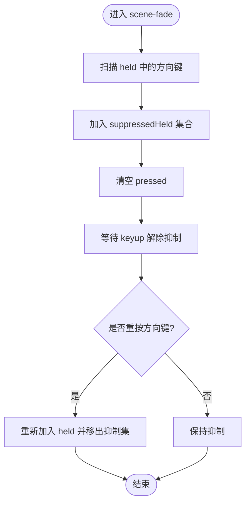
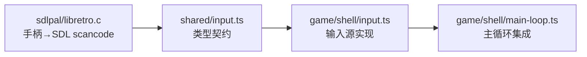

# 输入系统

<cite>
**本文引用的文件**   
- [packages/shared/src/input.ts](file://packages/shared/src/input.ts)
- [packages/game/src/shell/input.ts](file://packages/game/src/shell/input.ts)
- [packages/game/src/shell/main-loop.ts](file://packages/game/src/shell/main-loop.ts)
- [packages/game/src/core/event-system.ts](file://packages/game/src/core/event-system.ts)
- [packages/game/src/shell/input.test.ts](file://packages/game/src/shell/input.test.ts)
- [packages/shared/src/input.test.ts](file://packages/shared/src/input.test.ts)
- [reference/sdlpal/libretro/libretro.c](file://reference/sdlpal/libretro/libretro.c)
</cite>

## 目录
1. [简介](#简介)
2. [项目结构](#项目结构)
3. [核心组件](#核心组件)
4. [架构总览](#架构总览)
5. [详细组件分析](#详细组件分析)
6. [依赖关系分析](#依赖关系分析)
7. [性能考量](#性能考量)
8. [故障排查指南](#故障排查指南)
9. [结论](#结论)
10. [附录](#附录)

## 简介
本文件面向“输入系统”的技术文档，覆盖键盘输入处理、抽象按键映射、输入快照与回放、输入抑制（fade 期间）、扩展接口与自定义输入源集成，以及调试与测试方法。目标是帮助读者在不深入源码的情况下理解系统设计与实现要点，并能正确扩展与测试。

## 项目结构
输入系统由“共享类型契约 + Shell 层实现 + 主循环集成”三部分构成：
- 共享契约：定义抽象按键、输入快照与输入源接口，确保 Core 与平台解耦。
- Shell 实现：浏览器键盘事件监听、重复按键过滤、按下/按住状态管理、fade 抑制、录制/回放支持。
- 主循环集成：每逻辑帧拉取输入快照并传递给模式处理器；在特定 fade 阶段调用抑制接口。

图表来源
- [packages/shared/src/input.ts:1-54](file://packages/shared/src/input.ts#L1-L54)
- [packages/game/src/shell/input.ts:1-165](file://packages/game/src/shell/input.ts#L1-L165)
- [packages/game/src/shell/main-loop.ts:66-182](file://packages/game/src/shell/main-loop.ts#L66-L182)

章节来源
- [packages/shared/src/input.ts:1-54](file://packages/shared/src/input.ts#L1-L54)
- [packages/game/src/shell/input.ts:1-165](file://packages/game/src/shell/input.ts#L1-L165)
- [packages/game/src/shell/main-loop.ts:66-182](file://packages/game/src/shell/main-loop.ts#L66-L182)

## 核心组件
- 抽象按键与快照
  - AbstractKey：与 sdlpal 的 kKey* 一一对应，屏蔽浏览器键名差异。
  - InputSnapshot：包含 held（持续按住）、pressed（边沿触发）与 frameNum（同步帧号）。
- 输入源接口
  - InputSource.nextSnapshot(frameNum)：返回当前帧快照。
  - InputSource.suppressHeldForFade?()：可选，用于 scene-fade 期间抑制方向键并清空 pressed。
- Shell 实现
  - KeyboardInputSource：监听 keydown/keyup，维护 held/pressed，过滤 repeat，支持 fade 抑制与 clearPressed。
  - ReplayInputSource：按序回放预录快照。
  - RecordingInputSource：装饰任意 InputSource，记录每帧快照。
- 主循环集成
  - advanceRafFrame/singleTick：每逻辑帧调用 input.nextSnapshot，并在 waiting='scene-fade' 时调用 suppressHeldForFade。

章节来源
- [packages/shared/src/input.ts:1-54](file://packages/shared/src/input.ts#L1-L54)
- [packages/game/src/shell/input.ts:67-165](file://packages/game/src/shell/input.ts#L67-L165)
- [packages/game/src/shell/main-loop.ts:86-116](file://packages/game/src/shell/main-loop.ts#L86-L116)

## 架构总览
下图展示从物理按键到游戏动作的完整链路，包括输入抑制与回放路径。

图表来源
- [packages/game/src/shell/input.ts:67-135](file://packages/game/src/shell/input.ts#L67-L135)
- [packages/game/src/shell/main-loop.ts:86-116](file://packages/game/src/shell/main-loop.ts#L86-L116)
- [packages/game/src/core/event-system.ts:2493-2513](file://packages/game/src/core/event-system.ts#L2493-L2513)

## 详细组件分析

### 键盘输入处理机制
- 事件监听
  - 订阅 window 的 keydown/keyup，将 DOM code 映射为 AbstractKey。
  - 未知 code 直接忽略，避免污染状态。
- 按键状态管理
  - held：Set 维护当前按住的键，保持插入顺序以体现“最后按的方向优先”。
  - pressed：Set 维护本 tick 新按下的键，每帧 nextSnapshot 后清空。
- 重复按键处理
  - 仅初次按下(e.repeat=false)才更新 pressed 与 held 顺序；repeat 不刷新顺序、不产生新的 pressed。
- 边界清理
  - clearPressed：等价 sdlpal PAL_ClearKeyState，清未消费的 pressed，保留 held 以便后续 keyup 配对。

图表来源
- [packages/game/src/shell/input.ts:70-82](file://packages/game/src/shell/input.ts#L70-L82)
- [packages/game/src/shell/input.ts:95-104](file://packages/game/src/shell/input.ts#L95-L104)
- [packages/game/src/shell/input.ts:127-129](file://packages/game/src/shell/input.ts#L127-L129)

章节来源
- [packages/game/src/shell/input.ts:67-135](file://packages/game/src/shell/input.ts#L67-L135)
- [packages/game/src/shell/input.test.ts:72-169](file://packages/game/src/shell/input.test.ts#L72-L169)

### 抽象按键映射层
- 物理键 → 抽象键
  - 方向键与数字小键盘方向键统一映射到 Up/Down/Left/Right。
  - Menu/Confirm/PgUp/PgDn/Home/End 等按 sdlpal 真值映射。
  - WASD 还原 sdlpal 原义：W=ThrowItem、A=Auto、S=Status、D=Defend；不再作为方向键。
- 配置化键位绑定
  - 通过 CODE_MAP 集中维护映射表，便于统一调整与审计。
- 多设备支持（键盘/手柄）
  - libretro 层将手柄按钮映射为 SDL scancode，再由 sdlpal 输入管线转为 kKey*；TS 侧通过 AbstractKey 屏蔽差异。

图表来源
- [packages/game/src/shell/input.ts:67-165](file://packages/game/src/shell/input.ts#L67-L165)
- [packages/shared/src/input.ts:42-53](file://packages/shared/src/input.ts#L42-L53)

章节来源
- [packages/game/src/shell/input.ts:17-65](file://packages/game/src/shell/input.ts#L17-L65)
- [reference/sdlpal/libretro/libretro.c:259-292](file://reference/sdlpal/libretro/libretro.c#L259-L292)

### 输入快照机制
- frameNum 同步
  - 主循环提供 frameNum，输入源原样写入快照，便于回放与日志对齐。
- 快照数据结构
  - held：ReadonlySet<AbstractKey>，表示持续按住。
  - pressed：ReadonlySet<AbstractKey>，表示本 tick 新按下。
  - frameNum：number，逻辑帧号。
- 确定性回放支持
  - ReplayInputSource 按序返回预录快照；超出序列返回空快照。
  - RecordingInputSource 可包装任意 InputSource，记录每帧快照供回放使用。

图表来源
- [packages/game/src/shell/input.ts:137-164](file://packages/game/src/shell/input.ts#L137-L164)
- [packages/game/src/shell/main-loop.ts:101-107](file://packages/game/src/shell/main-loop.ts#L101-L107)

章节来源
- [packages/shared/src/input.ts:25-41](file://packages/shared/src/input.ts#L25-L41)
- [packages/game/src/shell/input.ts:137-164](file://packages/game/src/shell/input.ts#L137-L164)
- [packages/shared/src/input.test.ts:15-23](file://packages/shared/src/input.test.ts#L15-L23)

### 输入抑制机制（fade 期间）
- 触发条件
  - 当 eventCursor.waiting === 'scene-fade' 时，主循环每 rAF 调用 input.suppressHeldForFade。
- 行为
  - 将当前 held 中的方向键加入抑制集，直到物理松开并重按才恢复。
  - 清空 pressed，等价于 sdlpal 在该类 fade 中逐步清键。
- 影响范围
  - 仅针对 scene-fade（如 0x93 SceneFade、0x80 PaletteFade-fUpdateScene），其他渐变不清键。

图表来源
- [packages/game/src/shell/main-loop.ts:86-87](file://packages/game/src/shell/main-loop.ts#L86-L87)
- [packages/game/src/shell/input.ts:113-118](file://packages/game/src/shell/input.ts#L113-L118)
- [packages/game/src/core/event-system.ts:2493-2513](file://packages/game/src/core/event-system.ts#L2493-L2513)

章节来源
- [packages/game/src/shell/main-loop.ts:86-87](file://packages/game/src/shell/main-loop.ts#L86-L87)
- [packages/game/src/shell/input.ts:113-118](file://packages/game/src/shell/input.ts#L113-L118)
- [packages/game/src/core/event-system.ts:2493-2513](file://packages/game/src/core/event-system.ts#L2493-L2513)

### 扩展接口与自定义输入源集成
- 实现 InputSource
  - 必须实现 nextSnapshot(frameNum)，返回包含 held/pressed/frameNum 的快照。
  - 可选实现 suppressHeldForFade，以支持 scene-fade 期间的输入抑制。
- 集成步骤
  - 在启动主循环前，将自定义 InputSource 注入 LoopContext.input。
  - 如需录制/回放，使用 RecordingInputSource 或 ReplayInputSource 进行包装。
- 示例思路
  - 网络多人：将远程输入转换为 InputSnapshot 序列，通过 ReplayInputSource 回放。
  - 手柄/触屏：将设备事件映射为 AbstractKey，封装为 InputSource。

章节来源
- [packages/shared/src/input.ts:42-53](file://packages/shared/src/input.ts#L42-L53)
- [packages/game/src/shell/input.ts:137-164](file://packages/game/src/shell/input.ts#L137-L164)
- [packages/game/src/shell/main-loop.ts:27-39](file://packages/game/src/shell/main-loop.ts#L27-L39)

### 输入调试工具与测试用例编写指南
- 单元测试
  - 验证 codeToAbstractKey 映射（方向、菜单、确认、翻页、战斗专用键）。
  - 验证 KeyboardInputSource 的 held/pressed 行为、repeat 过滤、last-press 优先级、clearPressed 语义。
  - 验证 ReplayInputSource 回放与越界行为、RecordingInputSource 录制行为。
  - 验证 suppressHeldForFade 对方向键的抑制与恢复。
- 端到端测试
  - 使用 headless 主循环 tickN + ReplayInputSource 喂入固定输入序列，断言 GameState 变化。
- 开发面板
  - F1 输出 GameState dump，辅助定位输入相关状态问题。

章节来源
- [packages/game/src/shell/input.test.ts:9-70](file://packages/game/src/shell/input.test.ts#L9-L70)
- [packages/game/src/shell/input.test.ts:72-169](file://packages/game/src/shell/input.test.ts#L72-L169)
- [packages/game/src/shell/input.test.ts:172-201](file://packages/game/src/shell/input.test.ts#L172-L201)
- [packages/game/src/shell/input.test.ts:203-223](file://packages/game/src/shell/input.test.ts#L203-L223)
- [packages/shared/src/input.test.ts:1-38](file://packages/shared/src/input.test.ts#L1-L38)

## 依赖关系分析
- 耦合与内聚
  - Shared 层只暴露类型契约，低耦合高内聚。
  - Shell 层实现具体输入源，内部维护状态，职责清晰。
  - 主循环仅在特定场景调用 suppressHeldForFade，避免侵入输入源细节。
- 外部依赖
  - libretro 层将手柄按钮映射为 SDL scancode，最终进入 sdlpal 输入管线，TS 侧通过 AbstractKey 屏蔽差异。

图表来源
- [packages/shared/src/input.ts:1-54](file://packages/shared/src/input.ts#L1-L54)
- [packages/game/src/shell/input.ts:1-165](file://packages/game/src/shell/input.ts#L1-L165)
- [packages/game/src/shell/main-loop.ts:66-182](file://packages/game/src/shell/main-loop.ts#L66-L182)
- [reference/sdlpal/libretro/libretro.c:259-292](file://reference/sdlpal/libretro/libretro.c#L259-L292)

章节来源
- [packages/shared/src/input.ts:1-54](file://packages/shared/src/input.ts#L1-L54)
- [packages/game/src/shell/input.ts:1-165](file://packages/game/src/shell/input.ts#L1-L165)
- [packages/game/src/shell/main-loop.ts:66-182](file://packages/game/src/shell/main-loop.ts#L66-L182)
- [reference/sdlpal/libretro/libretro.c:259-292](file://reference/sdlpal/libretro/libretro.c#L259-L292)

## 性能考量
- 重复按键过滤避免频繁 Set 操作，减少 held 顺序抖动。
- pressed 每帧清空，降低跨帧误读风险。
- 主循环每 rAF 最多推进一个逻辑 tick，避免卡顿后连追导致瞬移。
- fade 期间仅 present 推进视觉，不加速逻辑，保证时序稳定。

[本节为通用指导，无需列出具体文件来源]

## 故障排查指南
- 症状：战后淡出期间按键无效或方向键需松开重按
  - 原因：旧版将所有渐变视为清键，导致吞键。现限定 scene-fade 才抑制。
  - 排查：检查 eventCursor.waiting 是否为 'scene-fade'，确认 suppressHeldForFade 被调用。
- 症状：开场 AVI 跳过后的 Space 残留导致菜单误确认
  - 原因：异步监听器累积 pressed，modal 切换未清理。
  - 修复：在进入菜单前调用 input.clearPressed()。
- 症状：按住方向键穿 fade 后继续走
  - 原因：未在 scene-fade 期间抑制方向键。
  - 修复：确保 waiting='scene-fade' 时调用 suppressHeldForFade。

章节来源
- [packages/game/src/shell/main-loop.ts:86-87](file://packages/game/src/shell/main-loop.ts#L86-L87)
- [packages/game/src/shell/input.ts:113-118](file://packages/game/src/shell/input.ts#L113-L118)
- [packages/game/src/shell/input.ts:127-129](file://packages/game/src/shell/input.ts#L127-L129)

## 结论
输入系统通过抽象按键与快照接口，实现了键盘/手柄等多设备的统一接入；通过 repeat 过滤与 last-press 优先级保障交互一致性；借助 scene-fade 抑制与 clearPressed 解决关键边界问题；配合录制/回放能力，为确定性与可测试性提供基础。建议在新功能中遵循现有契约，优先复用 Replay/Recording 输入源以提升可测性与可复现性。

[本节为总结，无需列出具体文件来源]

## 附录
- 键位对照参考（部分）
  - 方向：ArrowUp/Down/Left/Right、Numpad8/2/4/6
  - 菜单：Escape、AltLeft/Right、Insert、Numpad0、KeyM
  - 确认：Space、Enter、NumpadEnter、ControlLeft
  - 翻页/Home/End：PageUp/PageDown、Numpad9/3/7/1、Home、End
  - 战斗/大世界专用：KeyR/A/D/E/W/Q/F/S
- 手柄映射参考（libretro → SDL scancode）
  - 见 reference/sdlpal/libretro/libretro.c 中 bkeys 数组映射。

章节来源
- [packages/game/src/shell/input.ts:17-65](file://packages/game/src/shell/input.ts#L17-L65)
- [reference/sdlpal/libretro/libretro.c:259-292](file://reference/sdlpal/libretro/libretro.c#L259-L292)