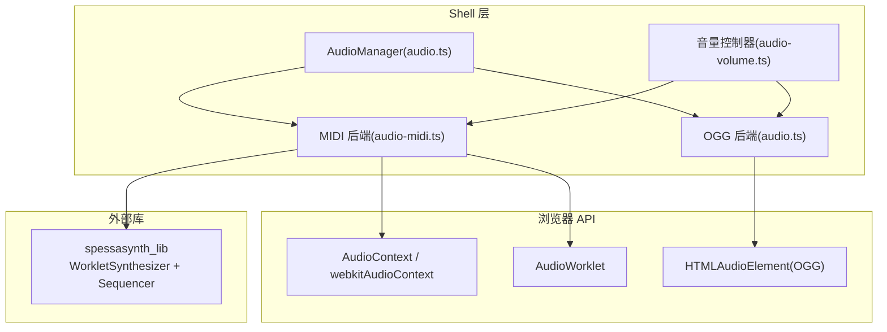
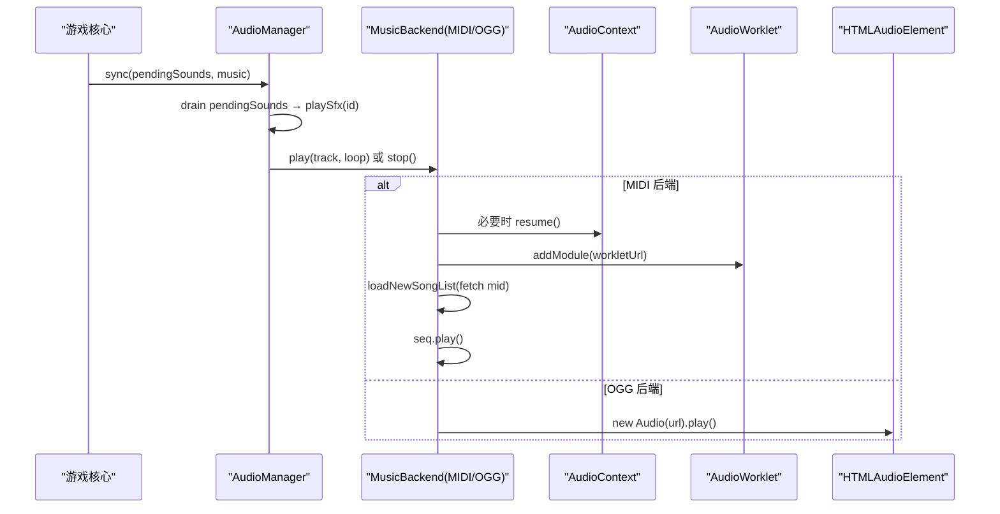
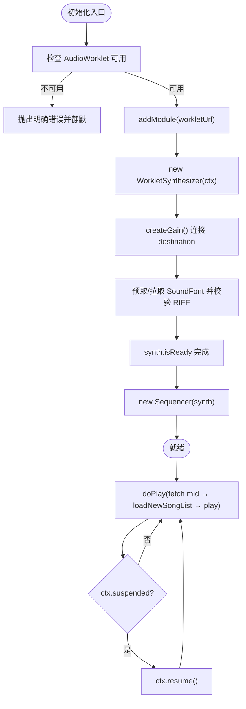
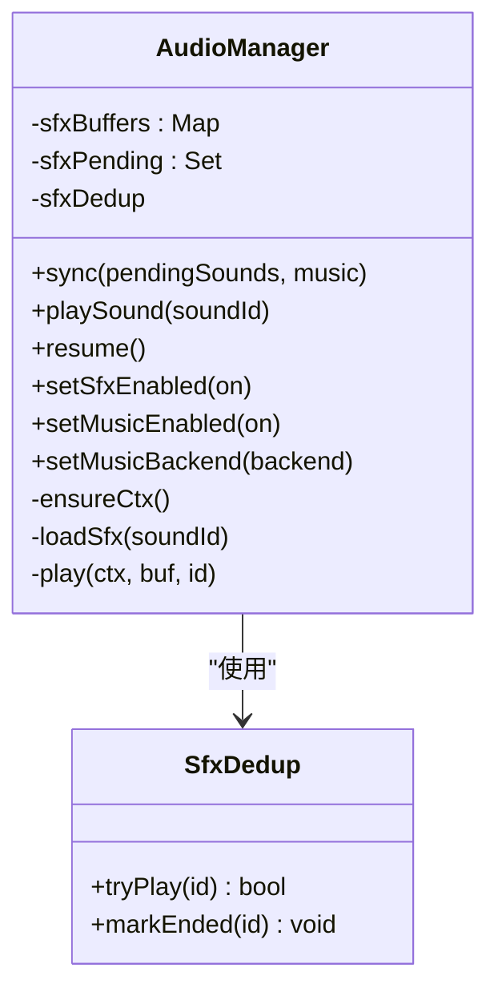
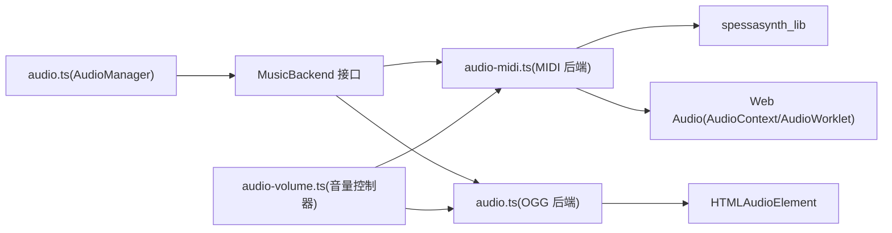

# 音频系统

<cite>
**本文引用的文件**
- [audio.ts](file://packages/game/src/shell/audio.ts)
- [audio-midi.ts](file://packages/game/src/shell/audio-midi.ts)
- [audio-volume.ts](file://packages/game/src/shell/audio-volume.ts)
- [mix.c](file://reference/sdlpal/timidity/mix.c)
- [sound.c](file://reference/sdlpal/sound.c)
- [opusfile.c](file://reference/sdlpal/libopusfile/src/opusfile.c)
- [internal.h](file://reference/sdlpal/libopusfile/src/internal.h)
</cite>

## 目录
1. [简介](#简介)
2. [项目结构](#项目结构)
3. [核心组件](#核心组件)
4. [架构总览](#架构总览)
5. [详细组件分析](#详细组件分析)
6. [依赖关系分析](#依赖关系分析)
7. [性能考量](#性能考量)
8. [故障排查指南](#故障排查指南)
9. [结论](#结论)
10. [附录](#附录)

## 简介
本技术文档围绕项目的音频子系统，系统性阐述以下方面：
- MIDI 音乐播放架构：spessasynth_lib 集成、AudioWorklet 合成器与 Sequencer 工作流、Web Audio 上下文管理与自动播放策略。
- 音效管理系统：SFX 分类与触发时机、去重与优先级控制、音量混音路径、内存优化（解码缓存与资源释放）。
- 音频格式支持：OGG（预渲染 BGM）、MIDI（运行时软合成）、WAV（SFX）的解码与播放策略。
- 音频状态管理：全局主音量与静音持久化、BGM 淡入淡出现状与扩展点、音效触发时机与幂等性。
- 性能优化：预加载策略、资源池管理、Web Audio API 最佳实践。
- 调试工具与排障：开发期探针、常见错误定位与修复建议。

## 项目结构
音频相关代码位于 shell 层，遵循“核心不碰 Web Audio”的分层原则：
- audio.ts：统一音频管理器，负责 SFX 队列消费、BGM 后端调度、Web Audio 上下文生命周期。
- audio-midi.ts：MIDI 后端实现，基于 spessasynth_lib 在 AudioWorklet 中软合成 SF2/SF3。
- audio-volume.ts：主音量控制器，提供 0..1 音量与静音开关，并持久化到 localStorage。
- reference/sdlpal：参考 C 端实现（混音、重采样、Opus 解码），用于对齐行为与性能基线。

图表来源
- [audio.ts:197-313](file://packages/game/src/shell/audio.ts#L197-L313)
- [audio-midi.ts:51-170](file://packages/game/src/shell/audio-midi.ts#L51-L170)
- [audio-volume.ts:27-55](file://packages/game/src/shell/audio-volume.ts#L27-L55)

章节来源
- [audio.ts:1-313](file://packages/game/src/shell/audio.ts#L1-L313)
- [audio-midi.ts:1-170](file://packages/game/src/shell/audio-midi.ts#L1-L170)
- [audio-volume.ts:1-55](file://packages/game/src/shell/audio-volume.ts#L1-L55)

## 核心组件
- AudioManager（audio.ts）
  - 职责：每帧同步 SFX 队列与 BGM 切换；维护 SFX 解码缓存与去重；暴露 resume/setMusicEnabled/setSfxEnabled 等接口。
  - 关键能力：
    - SFX：按 soundId 拉取 WAV → decodeAudioData → 缓存 AudioBuffer → 创建 BufferSource 经 GainNode 输出。
    - BGM：通过 MusicBackend 抽象，注入 OGG 或 MIDI 后端；track 变化即切；支持暂停/停止。
    - 自动播放：首个用户手势后 resume()，确保 ctx 进入 running。
- MIDI 后端（audio-midi.ts）
  - 职责：初始化 AudioWorklet、加载 SoundFont、创建 WorkletSynthesizer 与 Sequencer；按需 fetch MIDI 并播放；处理 autoplay 解锁。
  - 关键能力：
    - 预取 SoundFont 数据避免二次下载；校验 RIFF 魔数防 dev server 回退 HTML。
    - 锁定 CC91 混响通道，默认全干，可按需微调。
    - 模块级 masterGain 作为 BGM 主音量节点，受音量控制器驱动。
- 音量控制器（audio-volume.ts）
  - 职责：维护目标音量与静音状态，持久化到 localStorage；通过回调 applyVolume 将有效音量推送给各后端。
  - 关键能力：钳制 0..1、静音时推 0、启动即读回上次设置。

章节来源
- [audio.ts:197-313](file://packages/game/src/shell/audio.ts#L197-L313)
- [audio-midi.ts:51-170](file://packages/game/src/shell/audio-midi.ts#L51-L170)
- [audio-volume.ts:27-55](file://packages/game/src/shell/audio-volume.ts#L27-L55)

## 架构总览
整体采用“管理器 + 可插拔后端”的架构：
- 管理器只关心意图（播放某 SFX、切换到某 BGM track），不耦合具体解码/合成细节。
- 后端各自实现 Media 播放语义（OGG 用 HTMLAudioElement，MIDI 用 WorkletSynthesizer）。
- 音量控制走“应用层系数 + 输出层增益节点”的组合，保证即时生效且可独立缩放不同媒体类型。

图表来源
- [audio.ts:273-313](file://packages/game/src/shell/audio.ts#L273-L313)
- [audio-midi.ts:64-170](file://packages/game/src/shell/audio-midi.ts#L64-L170)
- [audio.ts:161-190](file://packages/game/src/shell/audio.ts#L161-L190)

## 详细组件分析

### MIDI 音乐播放架构（SpessaSynth 集成）
- 初始化流程
  - 检测 secure context 与 AudioWorklet 可用性，失败则给出明确提示。
  - 加载 worklet 处理器，创建 WorkletSynthesizer，连接至 masterGain → destination。
  - 优先使用 bootstrap 预取的 SoundFont ArrayBuffer；否则从 soundfontUrl 拉取并校验 RIFF 魔数。
  - 为 16 个 MIDI 通道设置并锁定 CC91（reverb send），默认全干，可按 reverbAmount 微调。
  - 创建 Sequencer（skipToFirstNoteOn=false，保留曲头静音以正确循环）。
- 播放流程
  - doPlay 根据 baseUrl/music/{NNN}.mid 拉取 MIDI，loadNewSongList 后设置 loopCount 并 play。
  - 若 ctx 处于 suspended，先 resume 再播。
- 自动播放与补播
  - 记录 last={track,loop}，在 init 完成或 resume 成功后补播一次，确保用户体验一致。
- 音量控制
  - setBgmVolume 更新模块级 masterGain.gain.value；若调用早于 masterGain 创建，则暂存 pendingBgmVolume 并在创建时回填。

图表来源
- [audio-midi.ts:79-145](file://packages/game/src/shell/audio-midi.ts#L79-L145)
- [audio-midi.ts:64-76](file://packages/game/src/shell/audio-midi.ts#L64-L76)
- [audio-midi.ts:147-169](file://packages/game/src/shell/audio-midi.ts#L147-L169)

章节来源
- [audio-midi.ts:1-170](file://packages/game/src/shell/audio-midi.ts#L1-L170)

### 音效管理系统（SFX）
- 分类与触发
  - 战斗事件映射到 SFX id（如敌死、攻击、玩家武器声），由 shell 读取 bus 事件与角色数据生成。
  - 非战斗场景可通过通用 playSound(soundId) 触发。
- 去重与优先级
  - 同号去重：同一 soundId 在上一次未播完前不再触发，避免叠音；播完自动复位。
  - 优先级：SFX 短促高频，直接走 BufferSource 实时播放；无显式优先级队列，依靠去重与快速响应保障体验。
- 音量混音
  - 每个 SFX 经独立 GainNode 输出，受 sfxScale 控制；与 BGM 主音量解耦。
- 内存优化
  - 解码后的 AudioBuffer 缓存于 Map，避免重复 fetch/decode。
  - 正在解码的 soundId 加入 Set 防止并发重复请求。
  - 对 OGG 后端，切换曲目时 removeAttribute('src') + load() 释放底层媒体资源，避免游离元素堆积。

图表来源
- [audio.ts:57-69](file://packages/game/src/shell/audio.ts#L57-L69)
- [audio.ts:197-313](file://packages/game/src/shell/audio.ts#L197-L313)

章节来源
- [audio.ts:197-313](file://packages/game/src/shell/audio.ts#L197-L313)

### 音频格式支持与解码策略
- OGG（预渲染 BGM）
  - 通过 createOggMusicBackend 使用 HTMLAudioElement 播放 /music/{NNN}.ogg。
  - 切换曲目时主动释放旧元素，避免内存泄漏。
  - 音量 = 0.6 × oggScale，oggScale 可由音量控制器通过 setOggVolumeScale 刷新。
- MIDI（运行时软合成）
  - 通过 SpessaSynth 在 AudioWorklet 中合成 SF2/SF3，无需离线渲染，开箱即用。
  - 支持预取 SoundFont 数据，减少二次 fetch；严格校验 RIFF 魔数以规避 dev server 回退 HTML。
- WAV（SFX）
  - 通过 decodeAudioData 解码 RIFF/WAV 片段，缓存 AudioBuffer 提升后续播放性能。
- Opus 解码参考（C 端）
  - libopusfile 内部 op_decode 封装多声道解码与回调机制，可作为参考对比。

章节来源
- [audio.ts:161-190](file://packages/game/src/shell/audio.ts#L161-L190)
- [audio-midi.ts:79-145](file://packages/game/src/shell/audio-midi.ts#L79-L145)
- [opusfile.c:2770-2801](file://reference/sdlpal/libopusfile/src/opusfile.c#L2770-L2801)
- [internal.h:207-237](file://reference/sdlpal/libopusfile/src/internal.h#L207-L237)

### 音频状态管理
- 全局音量控制
  - 主音量控制器维护 volume 与 muted，持久化 tp-master-volume 与 tp-muted。
  - 通过 applyVolume(effective) 回调分别驱动：
    - MIDI 后端：setBgmVolume(v) 更新 masterGain.gain。
    - OGG 后端：setOggVolumeScale(s) 更新当前播放元素的 volume。
- 背景音乐淡入淡出
  - 当前实现未做 gain ramp 淡入淡出，忠实还原 C 端 native MIDI 行为；可在 MusicBackend 中扩展 fadeMs 参数。
- 音效触发时机
  - 每帧 sync 中 drain pendingSounds；若 ctx 未运行则跳过并立即复位去重标记，避免阻塞后续触发。

章节来源
- [audio-volume.ts:27-55](file://packages/game/src/shell/audio-volume.ts#L27-L55)
- [audio-midi.ts:46-49](file://packages/game/src/shell/audio-midi.ts#L46-L49)
- [audio.ts:150-153](file://packages/game/src/shell/audio.ts#L150-L153)
- [audio.ts:273-296](file://packages/game/src/shell/audio.ts#L273-L296)

## 依赖关系分析
- 模块内聚与耦合
  - AudioManager 与 MusicBackend 松耦合，便于替换后端（MIDI/OGG）。
  - 音量控制器与后端通过回调/函数解耦，避免跨模块直接操作 Web Audio。
- 外部依赖
  - spessasynth_lib：WorkletSynthesizer + Sequencer，提供 MIDI 软合成。
  - Web Audio API：AudioContext、AudioWorklet、GainNode、BufferSource。
  - HTMLMediaElement：HTMLAudioElement 用于 OGG 播放。
- 潜在循环依赖
  - 当前设计无循环导入；AudioManager 仅依赖后端接口，不反向依赖具体实现。

图表来源
- [audio.ts:19-26](file://packages/game/src/shell/audio.ts#L19-L26)
- [audio.ts:197-313](file://packages/game/src/shell/audio.ts#L197-L313)
- [audio-midi.ts:51-170](file://packages/game/src/shell/audio-midi.ts#L51-L170)
- [audio-volume.ts:27-55](file://packages/game/src/shell/audio-volume.ts#L27-L55)

章节来源
- [audio.ts:197-313](file://packages/game/src/shell/audio.ts#L197-L313)
- [audio-midi.ts:51-170](file://packages/game/src/shell/audio-midi.ts#L51-L170)
- [audio-volume.ts:27-55](file://packages/game/src/shell/audio-volume.ts#L27-L55)

## 性能考量
- 预加载策略
  - SoundFont 预取：bootstrap 阶段下载并传入 Promise<ArrayBuffer>，避免二次 fetch。
  - SFX 解码缓存：首次 fetch+decode 后缓存 AudioBuffer，后续零网络开销。
- 资源池管理
  - OGG 后端切换曲目时 removeAttribute('src') + load() 释放底层媒体资源，避免游离元素累积。
  - SFX 解码并发保护：Set 记录正在解码的 soundId，避免重复请求。
- Web Audio API 最佳实践
  - 仅在用户手势后 resume()，避免 autoplay 限制导致无声。
  - 使用 GainNode 集中控制音量，避免频繁重建节点。
  - 合理设置 skipToFirstNoteOn=false，保留曲头静音以获得正确的循环间隔。
- 参考 C 端混音与重采样
  - Timidity 混音路径包含包络衰减、声像移动与线性斜坡淡出逻辑，可作为未来淡入淡出的参考。
  - SDL 声音子系统按设备频率进行重采样，质量与速率配置清晰，有助于理解平台差异。

章节来源
- [audio-midi.ts:100-120](file://packages/game/src/shell/audio-midi.ts#L100-L120)
- [audio.ts:161-190](file://packages/game/src/shell/audio.ts#L161-L190)
- [mix.c:425-502](file://reference/sdlpal/timidity/mix.c#L425-L502)
- [sound.c:828-897](file://reference/sdlpal/sound.c#L828-L897)

## 故障排查指南
- 现象：有音效无 BGM
  - 可能原因：非 secure context 导致 AudioWorklet 不可用（http://局域网 IP 访问）。
  - 解决：改用 https:// 或 http://localhost 访问；查看控制台明确错误提示。
- 现象：MIDI 后端初始化失败
  - 可能原因：
    - SoundFont 缺失或 dev server 回退 index.html（非 RIFF 魔数）。
    - workletUrl 不可达。
  - 解决：确认 packages/game/public/soundfont.sf3 存在且为真实 GM .sf2/.sf3；worklet 文件已 vendored 到 public/。
- 现象：BGM 循环衔接突兀
  - 可能原因：skipToFirstNoteOn=true 会跳过曲头静音。
  - 解决：保持默认 false，保留作曲者设置的静音段。
- 现象：混响过重
  - 可能原因：MIDI 自带 CC91 混响发送被打开。
  - 解决：锁定 CC91 并设置 reverbAmount=0（全干），或调低值获得少量混响。
- 现象：频繁切歌内存增长
  - 可能原因：OGG 后端未释放旧媒体元素。
  - 解决：确保 release 流程执行 removeAttribute('src') + load()。

章节来源
- [audio-midi.ts:85-91](file://packages/game/src/shell/audio-midi.ts#L85-L91)
- [audio-midi.ts:109-119](file://packages/game/src/shell/audio-midi.ts#L109-L119)
- [audio-midi.ts:130-132](file://packages/game/src/shell/audio-midi.ts#L130-L132)
- [audio.ts:167-172](file://packages/game/src/shell/audio.ts#L167-L172)

## 结论
本项目音频系统采用清晰的“管理器 + 可插拔后端”架构，兼顾了：
- 运行时 MIDI 软合成的灵活性与开箱即用体验；
- OGG 预渲染路径的低运行时开销；
- SFX 的高效解码缓存与去重；
- 主音量与静音的持久化与即时生效；
- 面向未来的淡入淡出扩展点与性能优化空间。

## 附录
- 关键路径参考
  - SFX 播放路径：[audio.ts:254-270](file://packages/game/src/shell/audio.ts#L254-L270)
  - BGM 切换路径：[audio.ts:273-286](file://packages/game/src/shell/audio.ts#L273-L286)
  - MIDI 初始化与播放：[audio-midi.ts:79-145](file://packages/game/src/shell/audio-midi.ts#L79-L145)
  - 音量控制器：[audio-volume.ts:27-55](file://packages/game/src/shell/audio-volume.ts#L27-L55)
- 参考实现
  - Timidity 混音与淡出：[mix.c:425-502](file://reference/sdlpal/timidity/mix.c#L425-L502)
  - SDL 声音重采样与缓冲填充：[sound.c:828-897](file://reference/sdlpal/sound.c#L828-L897)
  - Opus 解码封装：[opusfile.c:2770-2801](file://reference/sdlpal/libopusfile/src/opusfile.c#L2770-L2801), [internal.h:207-237](file://reference/sdlpal/libopusfile/src/internal.h#L207-L237)