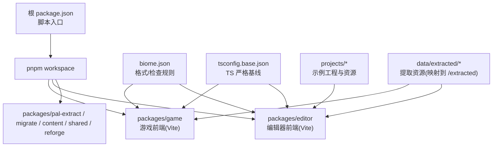
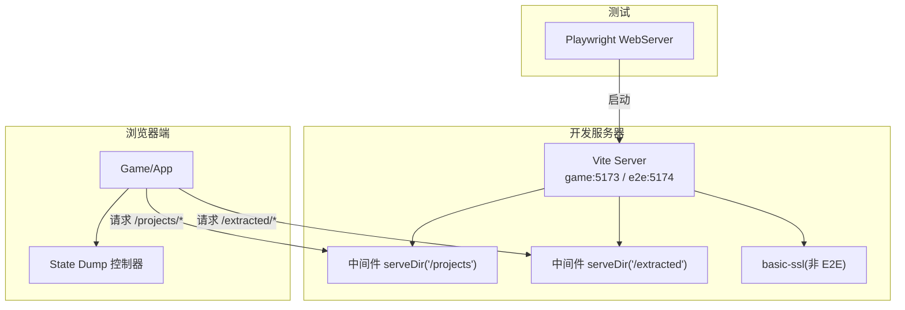
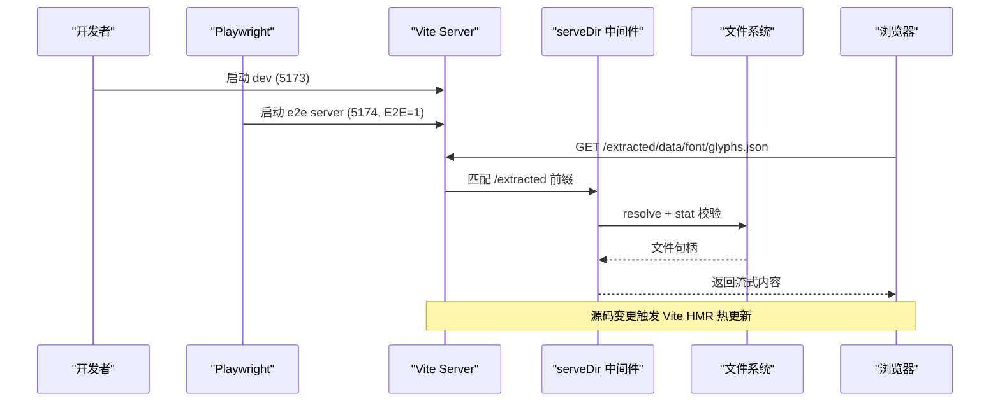
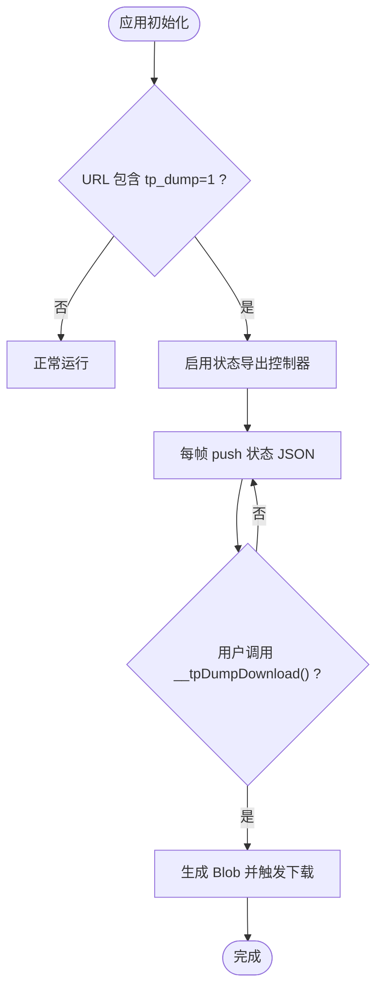
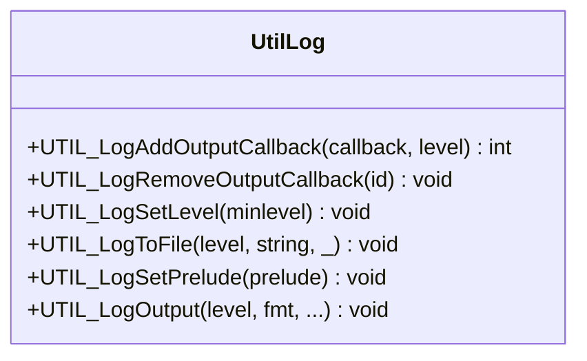
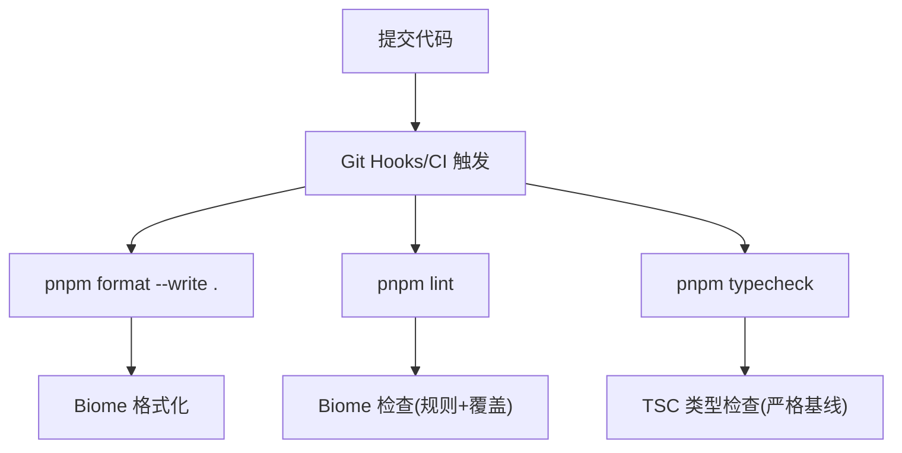
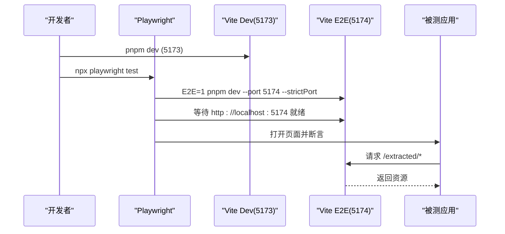
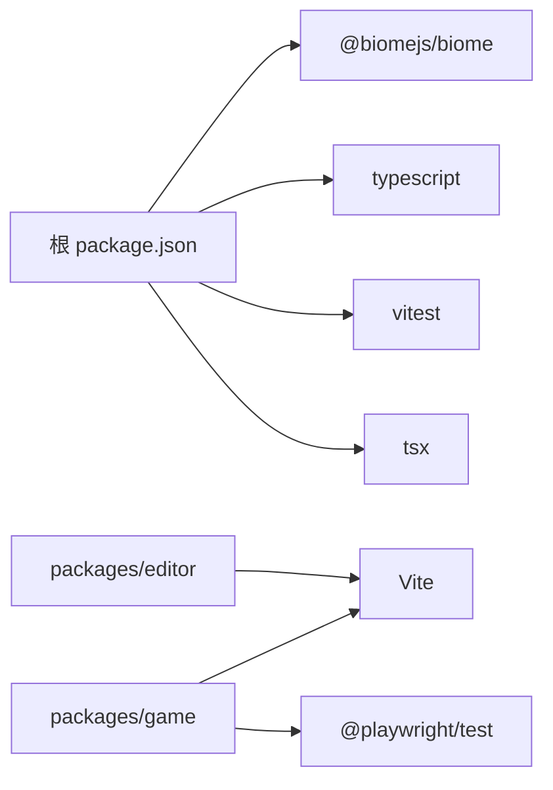

# 开发工作流

<cite>
**本文引用的文件**   
- [package.json](file://package.json)
- [biome.json](file://biome.json)
- [tsconfig.base.json](file://tsconfig.base.json)
- [packages/game/vite.config.ts](file://packages/game/vite.config.ts)
- [packages/editor/vite.config.ts](file://packages/editor/vite.config.ts)
- [packages/game/playwright.config.ts](file://packages/game/playwright.config.ts)
- [packages/game/src/dev/state-dump.ts](file://packages/game/src/dev/state-dump.ts)
- [reference/sdlpal/util.c](file://reference/sdlpal/util.c)
- [reference/sdlpal/util.h](file://reference/sdlpal/util.h)
</cite>

## 目录
1. [简介](#简介)
2. [项目结构](#项目结构)
3. [核心组件](#核心组件)
4. [架构总览](#架构总览)
5. [详细组件分析](#详细组件分析)
6. [依赖分析](#依赖分析)
7. [性能考虑](#性能考虑)
8. [故障排查指南](#故障排查指南)
9. [结论](#结论)
10. [附录](#附录)

## 简介
本指南面向开发者，系统化说明 type-pal 项目的开发工作流与工具链配置，覆盖以下主题：
- 热重载与开发服务器：Vite 中间件、端口策略、E2E 隔离、局域网访问与 HTTPS。
- 错误报告系统：运行时错误捕获、堆栈跟踪、用户反馈收集（含浏览器端状态导出）。
- 日志系统：C 侧日志级别控制、回调输出；前端调试输出与结构化导出。
- 代码质量工具：Biome 格式化与静态检查规则、TypeScript 严格模式基线。
- 开发环境搭建、IDE 建议、团队协作规范与常见问题解决方案。

## 项目结构
仓库采用 monorepo 组织，根目录提供统一脚本与工具链配置，各功能模块位于 packages 下，参考实现与资源在 reference 与 projects 中。

图表来源
- [package.json:1-29](file://package.json#L1-L29)
- [biome.json:1-71](file://biome.json#L1-L71)
- [tsconfig.base.json:1-16](file://tsconfig.base.json#L1-L16)
- [packages/game/vite.config.ts:1-70](file://packages/game/vite.config.ts#L1-L70)
- [packages/editor/vite.config.ts:1-54](file://packages/editor/vite.config.ts#L1-L54)

章节来源
- [package.json:1-29](file://package.json#L1-L29)
- [biome.json:1-71](file://biome.json#L1-L71)
- [tsconfig.base.json:1-16](file://tsconfig.base.json#L1-L16)

## 核心组件
- 构建与脚本
  - 根脚本提供 check、typecheck、test、format、lint、extract、bake 等命令，统一通过 pnpm workspace 分发执行。
- 代码质量
  - Biome 负责格式化与检查，包含全局与按路径覆盖的规则集。
  - TypeScript 使用 base 配置启用严格模式与模块化选项。
- 开发服务器
  - game 与 editor 均基于 Vite，提供自定义中间件将 /projects 与 /extracted 映射至仓库目录，避免跨平台 symlink 问题。
  - game 在非 E2E 环境下启用 basic-ssl，确保局域网 https 下的 AudioWorklet 可用。
- E2E 测试
  - Playwright 启动独立 dev server 实例于 5174 端口，与本地 5173 互不干扰，并复用同一份 vite 配置。

章节来源
- [package.json:1-29](file://package.json#L1-L29)
- [biome.json:1-71](file://biome.json#L1-L71)
- [tsconfig.base.json:1-16](file://tsconfig.base.json#L1-L16)
- [packages/game/vite.config.ts:1-70](file://packages/game/vite.config.ts#L1-L70)
- [packages/editor/vite.config.ts:1-54](file://packages/editor/vite.config.ts#L1-L54)
- [packages/game/playwright.config.ts:1-32](file://packages/game/playwright.config.ts#L1-L32)

## 架构总览
下图展示开发期关键组件的交互关系：Vite 开发服务器、自定义静态资源中间件、SSL 插件、E2E 进程以及浏览器端调试能力。

图表来源
- [packages/game/vite.config.ts:1-70](file://packages/game/vite.config.ts#L1-L70)
- [packages/editor/vite.config.ts:1-54](file://packages/editor/vite.config.ts#L1-L54)
- [packages/game/playwright.config.ts:1-32](file://packages/game/playwright.config.ts#L1-L32)
- [packages/game/src/dev/state-dump.ts:1-107](file://packages/game/src/dev/state-dump.ts#L1-L107)

## 详细组件分析

### 热重载与开发服务器优化
- 端口与并发
  - 开发默认 5173，E2E 使用 5174，strictPort 防止端口漂移导致冲突。
  - host:true 绑定 0.0.0.0，便于局域网直连。
- 静态资源映射
  - 通过中间件将 /projects 与 /extracted 映射到仓库目录，兼容 Windows/macOS/Linux，无需 symlink。
  - 对 URL 进行解码、去前导斜杠与越界校验，防止路径穿越。
- HTTPS 与安全上下文
  - 非 E2E 时启用 basic-ssl，使局域网访问走 https，满足 AudioWorklet 安全上下文要求。
  - E2E 强制 http，保证 baseURL 一致。
- 增量编译与热更新
  - 由 Vite 原生支持，配合 NodeNext 模块解析与 isolatedModules 提升编译效率。

图表来源
- [packages/game/vite.config.ts:1-70](file://packages/game/vite.config.ts#L1-L70)
- [packages/editor/vite.config.ts:1-54](file://packages/editor/vite.config.ts#L1-L54)
- [packages/game/playwright.config.ts:1-32](file://packages/game/playwright.config.ts#L1-L32)

章节来源
- [packages/game/vite.config.ts:1-70](file://packages/game/vite.config.ts#L1-L70)
- [packages/editor/vite.config.ts:1-54](file://packages/editor/vite.config.ts#L1-L54)
- [packages/game/playwright.config.ts:1-32](file://packages/game/playwright.config.ts#L1-L32)
- [tsconfig.base.json:1-16](file://tsconfig.base.json#L1-L16)

### 错误报告系统
- 运行时错误捕获
  - 浏览器端渲染层对异常进行 try/catch 包裹，并在画布上显示错误信息，同时输出 console.error 以便定位。
- 堆栈跟踪
  - 利用浏览器控制台输出 Error 对象，保留完整堆栈。
- 用户反馈收集
  - 通过 URL 参数 ?tp_dump=1 开启帧级状态导出，暴露 window.__tpDumpDownload() 下载 jsonl 文件，便于复现与对比。

图表来源
- [packages/game/src/dev/state-dump.ts:1-107](file://packages/game/src/dev/state-dump.ts#L1-L107)

章节来源
- [packages/game/src/dev/state-dump.ts:1-107](file://packages/game/src/dev/state-dump.ts#L1-L107)

### 日志系统
- C 侧日志
  - 提供日志级别过滤、时间戳与预置前缀拼接、致命级别直接终止流程、可插拔回调输出机制。
  - 支持设置最小日志级别、添加/移除回调、写入文件等。
- 前端日志
  - 使用 console.log/console.warn/console.error 输出调试信息；状态导出为结构化 JSONL，便于离线分析。

图表来源
- [reference/sdlpal/util.h:227-373](file://reference/sdlpal/util.h#L227-L373)
- [reference/sdlpal/util.c:869-921](file://reference/sdlpal/util.c#L869-L921)

章节来源
- [reference/sdlpal/util.h:227-373](file://reference/sdlpal/util.h#L227-L373)
- [reference/sdlpal/util.c:869-921](file://reference/sdlpal/util.c#L869-L921)

### 代码质量工具
- Biome
  - 启用 vcs 集成与忽略文件；格式化缩进、行宽、引号、分号与尾逗号策略。
  - 推荐规则集为基础，针对特定包与测试文件做覆盖调整（如禁用 noNonNullAssertion 或 any 限制）。
- TypeScript
  - 基于 tsconfig.base.json 启用 ES2022 目标、NodeNext 模块解析、严格模式、verbatimModuleSyntax、isolatedModules 等，保障类型安全与构建一致性。

图表来源
- [biome.json:1-71](file://biome.json#L1-L71)
- [tsconfig.base.json:1-16](file://tsconfig.base.json#L1-L16)
- [package.json:1-29](file://package.json#L1-L29)

章节来源
- [biome.json:1-71](file://biome.json#L1-L71)
- [tsconfig.base.json:1-16](file://tsconfig.base.json#L1-L16)
- [package.json:1-29](file://package.json#L1-L29)

### 端到端测试与开发服务器协同
- Playwright 通过 webServer.command 启动独立的 Vite 实例（5174），并设置 E2E=1 以关闭 basic-ssl，保持 http。
- reuseExistingServer 在非 CI 环境复用已有服务，减少启动开销。
- 与本地开发（5173）并行运行，互不干扰。

图表来源
- [packages/game/playwright.config.ts:1-32](file://packages/game/playwright.config.ts#L1-L32)
- [packages/game/vite.config.ts:1-70](file://packages/game/vite.config.ts#L1-L70)

章节来源
- [packages/game/playwright.config.ts:1-32](file://packages/game/playwright.config.ts#L1-L32)
- [packages/game/vite.config.ts:1-70](file://packages/game/vite.config.ts#L1-L70)

## 依赖分析
- 顶层依赖
  - @biomejs/biome：代码格式化与检查。
  - tsx：TypeScript 执行器（用于脚本）。
  - typescript：类型检查与编译。
  - vitest：单元测试框架。
- 构建与开发
  - Vite 作为开发与预览服务器，结合 basic-ssl 与自定义中间件。
  - Playwright 驱动 E2E，复用 Vite 配置。

图表来源
- [package.json:1-29](file://package.json#L1-L29)
- [packages/game/vite.config.ts:1-70](file://packages/game/vite.config.ts#L1-L70)
- [packages/editor/vite.config.ts:1-54](file://packages/editor/vite.config.ts#L1-L54)
- [packages/game/playwright.config.ts:1-32](file://packages/game/playwright.config.ts#L1-L32)

章节来源
- [package.json:1-29](file://package.json#L1-L29)

## 性能考虑
- 开发服务器
  - strictPort 避免端口漂移导致的额外重试与失败。
  - basic-ssl 仅在非 E2E 启用，减少不必要的证书协商开销。
  - 中间件按需读取文件，避免不必要的全量扫描。
- 构建与模块
  - NodeNext 模块解析与 isolatedModules 有助于增量构建与缓存命中。
  - assetsInlineLimit 设为 0，避免大资源内联影响首屏加载。
- 音频特性
  - 局域网访问需 https 才能使用 AudioWorklet，否则 MIDI BGM 无法初始化。

[本节为通用指导，不直接分析具体文件]

## 故障排查指南
- 局域网无法播放 BGM
  - 现象：http://192.168.x.x:5173 访问时 BGM 无声。
  - 原因：非 secure context 导致 AudioWorklet 不可用。
  - 解决：使用 https 访问（开发已自动启用 basic-ssl），或在浏览器信任自签证书。
- E2E 与本地 dev 端口冲突
  - 现象：dev 占用 5173 后 E2E 自动跳到 5174 导致断言失败。
  - 解决：启用 strictPort，确保端口固定；E2E 使用 5174 且 baseURL 与之匹配。
- /extracted 资源 404
  - 现象：Windows 下 public/extracted 为普通文件导致 fetch 失败。
  - 解决：使用中间件映射 /extracted 到 data/extracted，已在 vite.config 中内置。
- 状态导出无数据
  - 现象：未看到导出文件或导出为空。
  - 解决：确认 URL 包含 ?tp_dump=1，并在控制台调用 window.__tpDumpDownload()。

章节来源
- [packages/game/vite.config.ts:1-70](file://packages/game/vite.config.ts#L1-L70)
- [packages/game/playwright.config.ts:1-32](file://packages/game/playwright.config.ts#L1-L32)
- [packages/game/src/dev/state-dump.ts:1-107](file://packages/game/src/dev/state-dump.ts#L1-L107)

## 结论
本项目通过 Vite 中间件与基础 SSL 插件构建了稳定高效的开发体验，结合 Biome 与 TypeScript 严格基线保障代码质量，并通过 Playwright 与独立端口策略实现可靠的 E2E 验证。浏览器端的状态导出与 C 侧日志体系为问题定位提供了有力支撑。遵循本文档的配置与实践，可显著提升团队协作效率与问题修复速度。

[本节为总结性内容，不直接分析具体文件]

## 附录
- 常用命令
  - 格式化：pnpm format
  - 检查：pnpm lint
  - 类型检查：pnpm typecheck
  - 单测：pnpm test
  - 资源提取：pnpm extract
  - 烘焙：pnpm bake
- IDE 建议
  - 安装 Biome 与 TypeScript 扩展，启用保存时格式化与类型检查。
  - 在 VS Code 中将默认格式化器设置为 Biome，并启用 ESLint/Terminal 集成。
- 团队协作规范
  - 提交前运行 format 与 lint，确保风格一致。
  - 新增规则需在 biome.json 中明确覆盖范围与理由。
  - 涉及网络与音频的功能需验证局域网 https 行为。

[本节为通用指导，不直接分析具体文件]