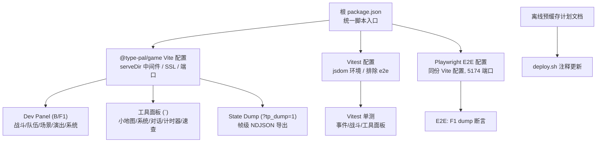
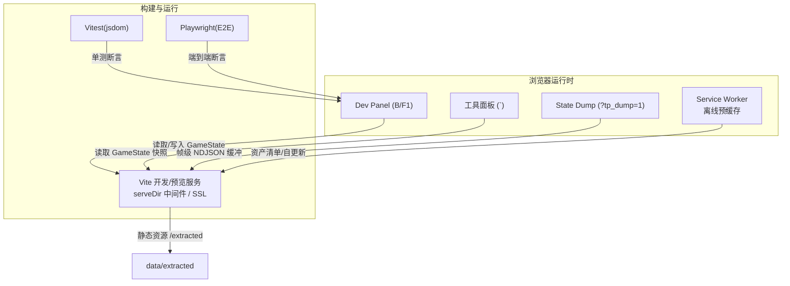
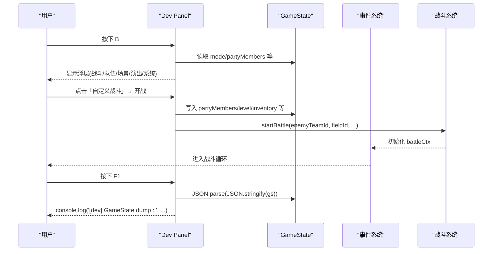
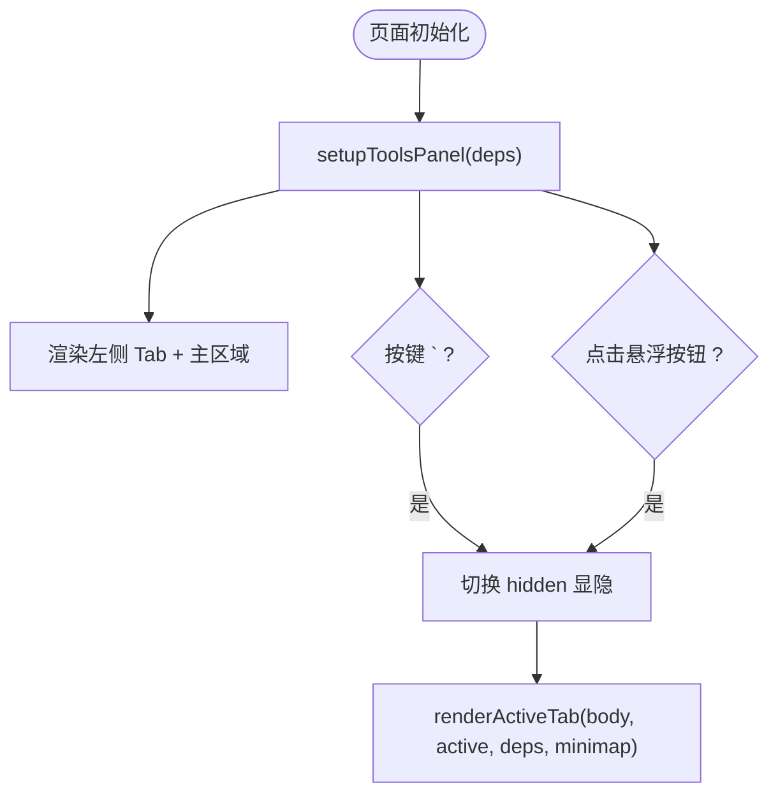
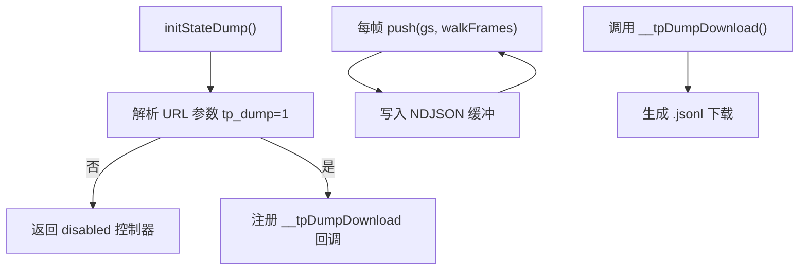
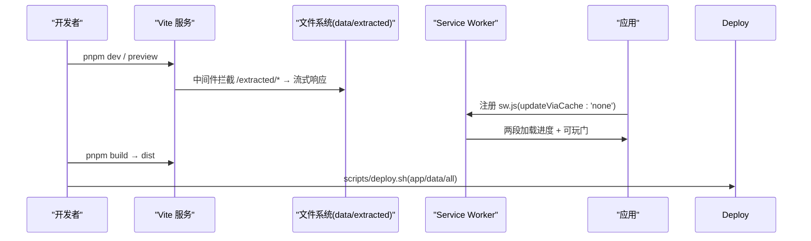
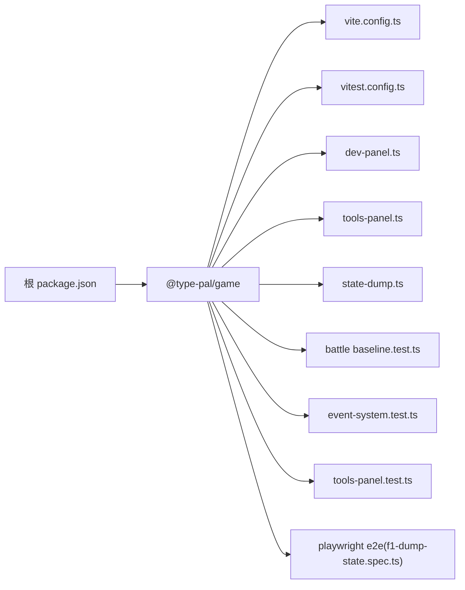
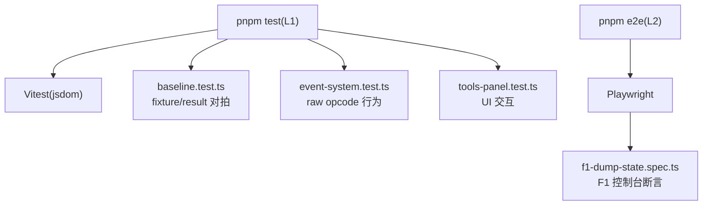

# 开发工具

<cite>
**本文引用的文件**   
- [README.md](file://README.md)
- [package.json](file://package.json)
- [vite.config.ts](file://packages/game/vite.config.ts)
- [vitest.config.ts](file://packages/game/vitest.config.ts)
- [dev-panel.ts](file://packages/game/src/dev/dev-panel.ts)
- [tools-panel.ts](file://packages/game/src/tools/tools-panel.ts)
- [state-dump.ts](file://packages/game/src/dev/state-dump.ts)
- [f1-dump-state.spec.ts](file://packages/game/e2e/dev/f1-dump-state.spec.ts)
- [baseline.test.ts](file://packages/game/src/core/battle/__tests__/baseline.test.ts)
- [event-system.test.ts](file://packages/game/src/core/event-system.test.ts)
- [tools-panel.test.ts](file://packages/game/src/tools/tools-panel.test.ts)
- [offline-precache-sw.md](file://docs/phase1/plans/2026-06-13-offline-precache-sw.md)
</cite>

## 目录
1. [简介](#简介)
2. [项目结构](#项目结构)
3. [核心组件](#核心组件)
4. [架构总览](#架构总览)
5. [详细组件分析](#详细组件分析)
6. [依赖关系分析](#依赖关系分析)
7. [性能与构建优化](#性能与构建优化)
8. [测试框架与策略](#测试框架与策略)
9. [故障排查指南](#故障排查指南)
10. [结论](#结论)
11. [附录：自定义调试扩展最佳实践](#附录自定义调试扩展最佳实践)

## 简介
本文件面向开发者，系统化说明本项目在“开发工具链”方面的使用与实践，覆盖以下主题：
- 调试面板：实时状态查看、快速存档读档、性能分析入口、战斗只读信息展示
- 测试框架：单元测试策略、回归对拍、E2E 用例编写
- 构建系统：Vite 配置优化、打包策略、部署流程自动化
- 开发工作流：热重载、错误报告、日志系统
- 自定义调试工具的扩展方法与最佳实践

## 项目结构
围绕开发工具相关的关键位置如下：
- 根脚本与命令：pnpm 脚本统一入口，提供 check/test/typecheck/lint/format/extract 等
- 游戏包（@type-pal/game）：Vite 开发服务器、预览服务、Vitest 单测、Playwright E2E
- 调试面板：
  - 生产环境浮层式 Dev Panel（快捷键 B/F1），仅 DEV 生效
  - 常驻工具面板（反引号键切换），包含场景小地图、系统设置、历史对话、速通计时器、快捷键速查等
- 离线预缓存：Service Worker + asset-manifest 机制，两段加载进度与可玩门
- 基准对拍：基于 sdlpal classic 的 baseline 数据驱动回归

图表来源
- [vite.config.ts:11-44](file://packages/game/vite.config.ts#L11-L44)
- [vitest.config.ts:1-12](file://packages/game/vitest.config.ts#L1-L12)
- [dev-panel.ts:431-451](file://packages/game/src/dev/dev-panel.ts#L431-L451)
- [tools-panel.ts:832-899](file://packages/game/src/tools/tools-panel.ts#L832-L899)
- [state-dump.ts:74-106](file://packages/game/src/dev/state-dump.ts#L74-L106)
- [offline-precache-sw.md:580-625](file://docs/phase1/plans/2026-06-13-offline-precache-sw.md#L580-L625)

章节来源
- [README.md:66-97](file://README.md#L66-L97)
- [package.json:1-29](file://package.json#L1-L29)

## 核心组件
- 调试面板（Dev Panel）
  - 快捷键：B 打开战斗/队伍/场景/演出/系统浮层；F1 输出 GameState 深拷贝到控制台
  - 功能：快捷战斗、自定义战斗、剧情 Boss 一键起战、队伍编辑、场景跳转、演出触发、物品作弊、战斗只读信息刷新
- 工具面板（Tools Panel）
  - 反引号键切换显隐；左侧竖排 Tab：战斗只读信息、场景小地图、系统设置、历史对话、速通计时器、快捷键速查
- 状态转储（State Dump）
  - URL 参数 ?tp_dump=1 开启，每帧推入 NDJSON 缓冲，暴露 window.__tpDumpDownload() 下载
- 构建与运行
  - Vite 插件 serveDir 将 /extracted 映射到仓库 data/extracted，避免 symlink 问题
  - 非 E2E 自动启用 basicSsl，局域网访问 AudioWorklet 可用
  - Vitest 使用 jsdom 环境，排除 e2e 目录
  - Playwright E2E 复用同一份 Vite 配置，但端口 5174 且走 HTTP

章节来源
- [dev-panel.ts:431-451](file://packages/game/src/dev/dev-panel.ts#L431-L451)
- [dev-panel.ts:838-900](file://packages/game/src/dev/dev-panel.ts#L838-L900)
- [tools-panel.ts:832-899](file://packages/game/src/tools/tools-panel.ts#L832-L899)
- [state-dump.ts:74-106](file://packages/game/src/dev/state-dump.ts#L74-L106)
- [vite.config.ts:46-69](file://packages/game/vite.config.ts#L46-L69)
- [vitest.config.ts:1-12](file://packages/game/vitest.config.ts#L1-L12)

## 架构总览
开发工具链由“运行时调试 UI + 构建/测试基础设施 + 离线能力”组成。Dev Panel 与 Tools Panel 通过注入 DOM 悬浮于 Canvas 之上，不进入 framebuffer；Vite 中间件解决资源路径跨平台问题；Vitest/Playwright 分别负责 L1/L2 测试；离线预缓存通过 Service Worker 与 asset-manifest 协同。

图表来源
- [vite.config.ts:11-44](file://packages/game/vite.config.ts#L11-L44)
- [dev-panel.ts:431-451](file://packages/game/src/dev/dev-panel.ts#L431-L451)
- [tools-panel.ts:832-899](file://packages/game/src/tools/tools-panel.ts#L832-L899)
- [state-dump.ts:74-106](file://packages/game/src/dev/state-dump.ts#L74-L106)
- [offline-precache-sw.md:580-625](file://docs/phase1/plans/2026-06-13-offline-precache-sw.md#L580-L625)

## 详细组件分析

### 调试面板（Dev Panel）
- 启动与可见性
  - 仅在 import.meta.env.DEV 时挂载监听，生产构建会被死代码消除剔除
  - 浮层为 DOM z-index 最高，独立于 320×200 canvas，不进 framebuffer
- 快捷键
  - B：在探索/战斗中弹出 picker（含战斗/队伍/场景/演出/系统）
  - F1：console.log 输出 GameState 深拷贝
- 主要功能
  - 快捷战斗：按 fixture 列表一键应用并 startBattle
  - 自定义战斗：多选敌人（≤5，允许重复）、选择队员（≤3）、等级/全道具/自动战斗开关
  - 剧情 Boss 战：按 BOSS_ROSTER 一键起真 boss team
  - 队伍编辑：头像卡片切换在队/离队，队首李逍遥常驻
  - 场景跳转：搜索过滤、缩略图懒加载、坐标传送
  - 演出触发：字体测试、对话样式、剧情过场、RNG 片段、视频/DOS 开场/结局
  - 战斗只读信息：队伍状态、敌方状态、场地信息，支持刷新
  - 物品作弊：全道具/清空/逐项数量编辑
- 安全约束
  - 不使用 innerHTML，全部通过 createElement + textContent 构造

图表来源
- [dev-panel.ts:431-451](file://packages/game/src/dev/dev-panel.ts#L431-L451)
- [dev-panel.ts:838-900](file://packages/game/src/dev/dev-panel.ts#L838-L900)
- [dev-panel.ts:1881-1902](file://packages/game/src/dev/dev-panel.ts#L1881-L1902)

章节来源
- [dev-panel.ts:1-17](file://packages/game/src/dev/dev-panel.ts#L1-L17)
- [dev-panel.ts:431-451](file://packages/game/src/dev/dev-panel.ts#L431-L451)
- [dev-panel.ts:838-900](file://packages/game/src/dev/dev-panel.ts#L838-L900)
- [dev-panel.ts:1881-1902](file://packages/game/src/dev/dev-panel.ts#L1881-L1902)

### 工具面板（Tools Panel）
- 入口与交互
  - 左上角悬浮按钮与反引号键切换显隐
  - 左侧竖排 Tab：战斗只读信息、场景小地图、系统设置、历史对话、速通计时器、快捷键速查
- 渲染与状态
  - 默认隐藏，首次打开渲染当前活跃 Tab
  - 场景 Tab 显示当前场景号与主角坐标
- 可扩展性
  - 通过 deps 注入 getGs、getMapThumbnail 等钩子，便于接入更多只读视图或操作

图表来源
- [tools-panel.ts:832-899](file://packages/game/src/tools/tools-panel.ts#L832-L899)

章节来源
- [tools-panel.ts:832-899](file://packages/game/src/tools/tools-panel.ts#L832-L899)
- [tools-panel.test.ts:42-127](file://packages/game/src/tools/tools-panel.test.ts#L42-L127)

### 状态转储（State Dump）
- 启用方式：URL 追加 ?tp_dump=1
- 行为：每帧 push 一条 NDJSON 记录到内存缓冲，暴露 window.__tpDumpDownload() 下载
- 用途：录制关键流程后离线分析，配合回放/对比工具定位问题

图表来源
- [state-dump.ts:68-106](file://packages/game/src/dev/state-dump.ts#L68-L106)

章节来源
- [state-dump.ts:68-106](file://packages/game/src/dev/state-dump.ts#L68-L106)

### 构建系统与部署
- Vite 配置要点
  - serveDir 中间件：将 /extracted 映射到仓库 data/extracted，避免 Windows 下 symlink 失效导致 404
  - basicSsl：非 E2E 环境下启用 https，使局域网访问具备 secure context，AudioWorklet 可用
  - server.host=true、strictPort=true、port=5173；E2E 使用 5174
- 打包策略
  - outDir=dist，target=es2022，assetsInlineLimit=0
- 部署流程自动化
  - deploy.sh 注释中补充 SW 与 asset-manifest 随 app/data 目标自动带出
  - 本地预览需确保 /extracted 可达以验证离线能力

图表来源
- [vite.config.ts:11-44](file://packages/game/vite.config.ts#L11-L44)
- [vite.config.ts:46-69](file://packages/game/vite.config.ts#L46-L69)
- [offline-precache-sw.md:580-625](file://docs/phase1/plans/2026-06-13-offline-precache-sw.md#L580-L625)

章节来源
- [vite.config.ts:11-44](file://packages/game/vite.config.ts#L11-L44)
- [vite.config.ts:46-69](file://packages/game/vite.config.ts#L46-L69)
- [offline-precache-sw.md:580-625](file://docs/phase1/plans/2026-06-13-offline-precache-sw.md#L580-L625)

## 依赖关系分析
- 顶层脚本与包
  - 根 package.json 聚合 workspace 命令，统一 test/check/typecheck/lint/format/extract
- 开发与测试
  - Vitest 使用 jsdom 环境，排除 e2e/**，保证 L1 单测与 L2 E2E 解耦
  - Playwright E2E 复用同一份 Vite 配置，但强制 HTTP 与不同端口
- 运行时依赖
  - Dev Panel 依赖 GameState、事件系统、战斗系统、资源表（敌人/队伍/法术等）
  - Tools Panel 依赖最小化 GameState 快照与可选缩略图渲染器

图表来源
- [package.json:1-29](file://package.json#L1-L29)
- [vite.config.ts:11-44](file://packages/game/vite.config.ts#L11-L44)
- [vitest.config.ts:1-12](file://packages/game/vitest.config.ts#L1-L12)
- [dev-panel.ts:431-451](file://packages/game/src/dev/dev-panel.ts#L431-L451)
- [tools-panel.ts:832-899](file://packages/game/src/tools/tools-panel.ts#L832-L899)
- [state-dump.ts:74-106](file://packages/game/src/dev/state-dump.ts#L74-L106)
- [baseline.test.ts:558-591](file://packages/game/src/core/battle/__tests__/baseline.test.ts#L558-L591)
- [event-system.test.ts:920-942](file://packages/game/src/core/event-system.test.ts#L920-L942)
- [tools-panel.test.ts:42-127](file://packages/game/src/tools/tools-panel.test.ts#L42-L127)
- [f1-dump-state.spec.ts:1-15](file://packages/game/e2e/dev/f1-dump-state.spec.ts#L1-L15)

章节来源
- [package.json:1-29](file://package.json#L1-L29)
- [vitest.config.ts:1-12](file://packages/game/vitest.config.ts#L1-L12)

## 性能与构建优化
- 资源路径与网络
  - serveDir 中间件避免 symlink 导致的 404，提升开发体验
  - assetsInlineLimit=0 利于 CDN 长缓存与并行加载
- 音频与 Secure Context
  - basicSsl 让局域网访问成为 secure context，保障 AudioWorklet 可用，BGM 正常
- 构建目标
  - target=es2022 平衡兼容性与体积
- 预览与离线
  - preview 模式同样挂载 serveDir，便于本地验证 SW 与离线能力

[本节为通用指导，无需源码引用]

## 测试框架与策略
- 单元测试（Vitest）
  - 环境：jsdom；setupFiles 指定 vitest.setup.ts
  - 范围：事件系统、战斗 baseline、工具面板等
  - 示例：
    - 事件系统 raw opcode 在 battle 模式下 debug 前缀校验
    - 工具面板：显隐、Tab 切换、幂等、场景坐标显示
- 回归对拍（Baseline）
  - 基于 sdlpal classic 的 fixture/result 对拍，已知偏差项 skip 并输出 warn 供参考
- E2E（Playwright）
  - 复用同一份 Vite 配置，端口 5174，HTTP
  - 示例：F1 快捷键触发 GameState dump，断言控制台消息前缀

图表来源
- [vitest.config.ts:1-12](file://packages/game/vitest.config.ts#L1-L12)
- [baseline.test.ts:558-591](file://packages/game/src/core/battle/__tests__/baseline.test.ts#L558-L591)
- [event-system.test.ts:920-942](file://packages/game/src/core/event-system.test.ts#L920-L942)
- [tools-panel.test.ts:42-127](file://packages/game/src/tools/tools-panel.test.ts#L42-L127)
- [f1-dump-state.spec.ts:1-15](file://packages/game/e2e/dev/f1-dump-state.spec.ts#L1-L15)

章节来源
- [vitest.config.ts:1-12](file://packages/game/vitest.config.ts#L1-L12)
- [baseline.test.ts:558-591](file://packages/game/src/core/battle/__tests__/baseline.test.ts#L558-L591)
- [event-system.test.ts:920-942](file://packages/game/src/core/event-system.test.ts#L920-L942)
- [tools-panel.test.ts:42-127](file://packages/game/src/tools/tools-panel.test.ts#L42-L127)
- [f1-dump-state.spec.ts:1-15](file://packages/game/e2e/dev/f1-dump-state.spec.ts#L1-L15)

## 故障排查指南
- 局域网无法播放 BGM
  - 现象：非 https 访问导致 AudioWorklet 不可用，BGM 无声
  - 处理：确认已启用 basicSsl 或使用 https://localhost:5173
- /extracted 资源 404
  - 现象：Windows 下 symlink 失效导致 fetch 失败
  - 处理：确认 Vite 中间件 serveDir 已挂载，且 data/extracted 存在
- 面板未出现
  - Dev Panel：确认处于 DEV 环境；检查是否被 dead-code-elimination 剔除
  - 工具面板：确认反引号键绑定与 setupToolsPanel 幂等逻辑
- 状态转储未生效
  - 确认 URL 包含 ?tp_dump=1，并在控制台执行 window.__tpDumpDownload() 下载

章节来源
- [vite.config.ts:46-69](file://packages/game/vite.config.ts#L46-L69)
- [dev-panel.ts:431-451](file://packages/game/src/dev/dev-panel.ts#L431-L451)
- [tools-panel.ts:832-899](file://packages/game/src/tools/tools-panel.ts#L832-L899)
- [state-dump.ts:74-106](file://packages/game/src/dev/state-dump.ts#L74-L106)

## 结论
本项目通过“轻量浮层调试面板 + 常驻工具面板 + 严格测试矩阵 + 稳健构建/部署”形成闭环的开发工具链。Dev Panel 聚焦战斗与系统调试，Tools Panel 提供只读信息与导航辅助；Vitest/Playwright 分层保障质量；Vite 中间件与 SSL 解决跨平台与音频上下文问题；离线预缓存提升可玩性与稳定性。建议在此基础上持续完善性能分析与可视化，进一步降低定位问题的成本。

[本节为总结，无需源码引用]

## 附录：自定义调试扩展最佳实践
- 新增只读视图
  - 在 Tools Panel 的 renderActiveTab 中增加新 Tab，通过 deps.getGs 获取快照，避免直接耦合具体实现
- 新增操作入口
  - 在 Dev Panel 对应 Tab 内添加按钮，调用现有 apply* 函数（如 applyCustomBattle/applySceneJump），保持与真实引擎一致的控制流
- 安全与隔离
  - 所有 DOM 构造使用 createElement/textContent，禁止 innerHTML
  - 浮层与 Canvas 隔离，不修改 framebuffer
- 可观测性
  - 使用 console.debug/console.warn 标注模块前缀，便于 grep
  - 必要时启用 state dump 录制关键流程
- 测试覆盖
  - 为新增交互编写 Vitest 单测（模拟键盘/鼠标事件）
  - 对关键快捷键行为编写 Playwright E2E（如 F1 dump）

[本节为通用指导，无需源码引用]