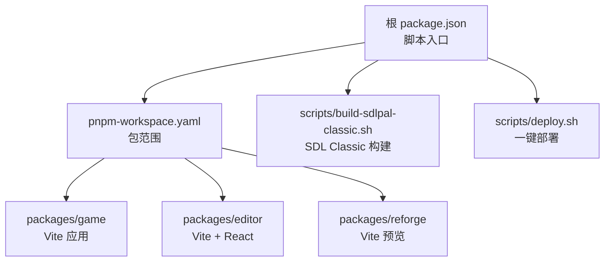
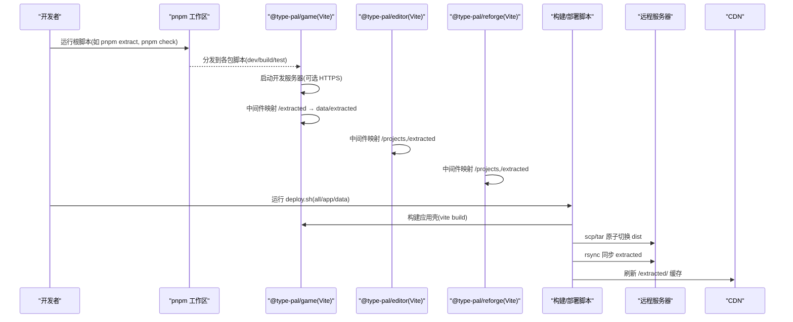
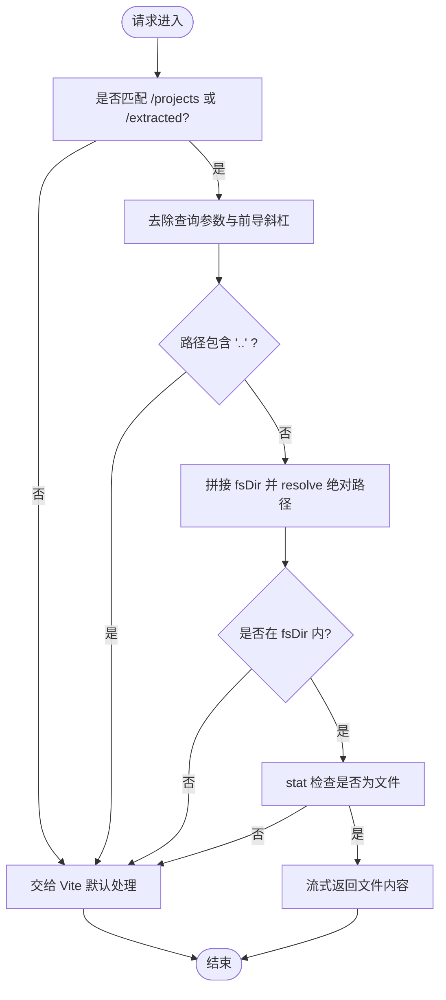
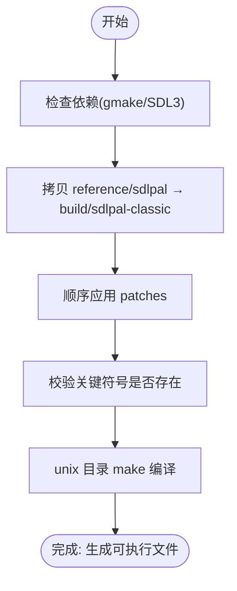
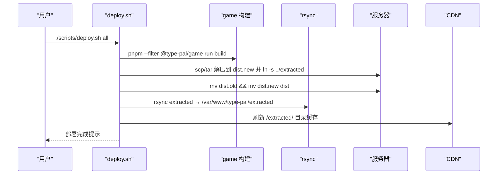
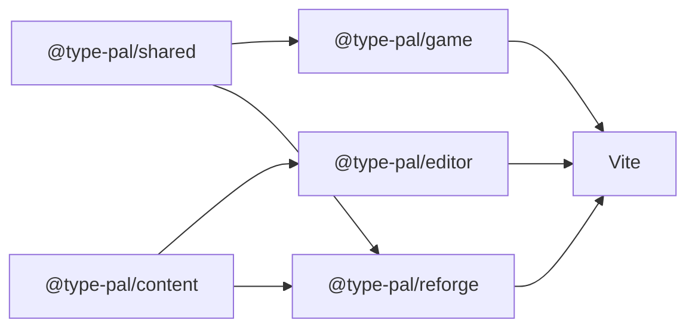

# 构建系统

<cite>
**本文引用的文件**
- [package.json](file://package.json)
- [pnpm-workspace.yaml](file://pnpm-workspace.yaml)
- [packages/game/vite.config.ts](file://packages/game/vite.config.ts)
- [packages/editor/vite.config.ts](file://packages/editor/vite.config.ts)
- [packages/reforge/vite.config.ts](file://packages/reforge/vite.config.ts)
- [packages/game/package.json](file://packages/game/package.json)
- [packages/editor/package.json](file://packages/editor/package.json)
- [packages/reforge/package.json](file://packages/reforge/package.json)
- [scripts/build-sdlpal-classic.sh](file://scripts/build-sdlpal-classic.sh)
- [scripts/deploy.sh](file://scripts/deploy.sh)
</cite>

## 目录
1. [简介](#简介)
2. [项目结构](#项目结构)
3. [核心组件](#核心组件)
4. [架构总览](#架构总览)
5. [详细组件分析](#详细组件分析)
6. [依赖关系分析](#依赖关系分析)
7. [性能考量](#性能考量)
8. [故障排查指南](#故障排查指南)
9. [结论](#结论)
10. [附录](#附录)

## 简介
本文件面向“类型化仙剑”项目的构建系统，聚焦以下目标：
- Vite 配置优化：开发服务器、插件与资源映射、环境变量控制。
- 打包策略：代码分割、资源内联/外链、Tree Shaking 与产物体积控制。
- 部署自动化：一键脚本、原子切换、CDN 刷新、多环境（开发/E2E/生产）差异。
- 构建脚本：SDL Classic 版本构建、资源提取与预处理、依赖管理。
- 自定义任务与扩展点：如何在现有工作流中新增任务、优化性能与定位问题。

## 项目结构
仓库采用 pnpm monorepo，应用与工具分布在 packages 下，根脚本统一编排。关键路径：
- 根级 package.json：定义跨包脚本与工具链。
- pnpm-workspace.yaml：声明 workspace 包范围。
- packages/game：游戏主应用（Vite + Playwright + Vitest）。
- packages/editor：编辑器（React + Vite）。
- packages/reforge：重构库（Vite 本地预览）。
- scripts：构建与部署脚本（SDL Classic 构建、一键部署等）。

图表来源
- [package.json:1-29](file://package.json#L1-L29)
- [pnpm-workspace.yaml:1-3](file://pnpm-workspace.yaml#L1-L3)

章节来源
- [package.json:1-29](file://package.json#L1-L29)
- [pnpm-workspace.yaml:1-3](file://pnpm-workspace.yaml#L1-L3)

## 核心组件
- 根脚本与工作区
  - 提供 check/typecheck/test/format/lint/extract/bake 等命令，统一在 monorepo 内执行。
  - extract 调用 @type-pal/pal-extract 的 extract 子命令，用于从原版数据生成 extracted 资源树。
- 各包脚本
  - game/editor/reforge 均暴露 dev/build/typecheck/test/check/e2e 等标准脚本，便于独立开发与测试。
- Vite 配置
  - 通过自定义中间件将 /projects 与 /extracted 映射到仓库根真实目录，避免 symlink 跨平台不一致。
  - game 包在非 E2E 环境下启用 basic-ssl，使局域网访问成为 secure context，保障 AudioWorklet 可用。
- 构建与部署
  - build-sdlpal-classic.sh：复制 SDL 源码、打补丁、编译 PAL_CLASSIC 版本，供基准对比使用。
  - deploy.sh：构建应用壳、rsync 同步大资源、原子切换 dist、刷新 CDN。

章节来源
- [package.json:1-29](file://package.json#L1-L29)
- [packages/game/package.json:1-32](file://packages/game/package.json#L1-32)
- [packages/editor/package.json:1-26](file://packages/editor/package.json#L1-26)
- [packages/reforge/package.json:1-26](file://packages/reforge/package.json#L1-26)
- [packages/game/vite.config.ts:1-70](file://packages/game/vite.config.ts#L1-L70)
- [packages/editor/vite.config.ts:1-54](file://packages/editor/vite.config.ts#L1-L54)
- [packages/reforge/vite.config.ts:1-59](file://packages/reforge/vite.config.ts#L1-L59)
- [scripts/build-sdlpal-classic.sh:1-88](file://scripts/build-sdlpal-classic.sh#L1-L88)
- [scripts/deploy.sh:1-203](file://scripts/deploy.sh#L1-L203)

## 架构总览
下图展示开发、构建与部署的关键流程与交互。

图表来源
- [package.json:1-29](file://package.json#L1-L29)
- [packages/game/vite.config.ts:1-70](file://packages/game/vite.config.ts#L1-L70)
- [packages/editor/vite.config.ts:1-54](file://packages/editor/vite.config.ts#L1-L54)
- [packages/reforge/vite.config.ts:1-59](file://packages/reforge/vite.config.ts#L1-L59)
- [scripts/deploy.sh:1-203](file://scripts/deploy.sh#L1-L203)

## 详细组件分析

### Vite 配置与开发服务器
- 通用资源映射中间件 serveDir
  - 作用：将 URL 前缀（/projects、/extracted）映射到仓库根真实目录，避免 symlink 跨平台问题。
  - 安全：去 query、去前导斜杠、拒绝包含 .. 的路径、校验解析后仍在 fsDir 内。
  - 适用：dev 与 preview 双端挂载同一中间件，保证本地预览也能访问 /extracted。
- game 包差异化
  - 非 E2E 时启用 basic-ssl，使局域网访问为 https，满足 AudioWorklet 的 secure context 要求。
  - E2E 场景通过环境变量 E2E=1 禁用 SSL，保持 http，配合 playwright webServer 端口 5174。
  - server.host=true 绑定 0.0.0.0；strictPort=true 防止端口漂移；port=5173 固定端口。
- editor/reforge 包
  - 仅挂载 serveDir 插件，分别映射 /projects 与 /extracted，确保编辑器与重构预览能直接读取工程与资源。

图表来源
- [packages/game/vite.config.ts:17-44](file://packages/game/vite.config.ts#L17-L44)
- [packages/editor/vite.config.ts:18-45](file://packages/editor/vite.config.ts#L18-L45)
- [packages/reforge/vite.config.ts:21-51](file://packages/reforge/vite.config.ts#L21-L51)

章节来源
- [packages/game/vite.config.ts:1-70](file://packages/game/vite.config.ts#L1-L70)
- [packages/editor/vite.config.ts:1-54](file://packages/editor/vite.config.ts#L1-L54)
- [packages/reforge/vite.config.ts:1-59](file://packages/reforge/vite.config.ts#L1-L59)

### 打包策略与产物优化
- 输出目录与目标
  - outDir=dist，target=es2022，assetsInlineLimit=0（资源默认外链，利于缓存与并行加载）。
- 代码分割与 Tree Shaking
  - 基于 Vite 默认策略（ESM + esbuild），未显式开启 rollupOptions 时，按模块边界进行按需打包与摇树优化。
  - 如需更细粒度分包，可在对应包的 vite.config.ts 中扩展 build.rollupOptions.output.manualChunks。
- 资源与缓存
  - 资源外链有利于浏览器缓存；结合 Service Worker 更新策略可实现增量更新。
  - 大资源（extracted）通过部署脚本分离，不进入应用壳 tar 包，减少传输体积。

章节来源
- [packages/game/vite.config.ts:56-60](file://packages/game/vite.config.ts#L56-L60)

### 环境变量与多环境
- 开发 vs E2E
  - 通过环境变量 E2E=1 切换：禁用 basic-ssl，保持 http，适配 playwright 的 baseURL=http://localhost:5174。
- 其他变量
  - 当前配置未使用 import.meta.env.* 的运行时变量；如需引入，可在各包 vite.config.ts 中通过 define 注入或通过 .env 文件管理。

章节来源
- [packages/game/vite.config.ts:7-10](file://packages/game/vite.config.ts#L7-L10)

### 构建脚本：SDL Classic 版
- 目的：构建 PAL_CLASSIC 版本的 sdlpal，作为战斗数值与行为基准。
- 流程要点
  - 检测 GNU Make 4.x 与 SDL3 依赖。
  - 幂等：若检测到未完整 patch 的构建目录则删除重建。
  - 拷贝 reference/sdlpal 至 build/sdlpal-classic，依次应用 patches，验证关键宏/函数存在。
  - 在 unix 目录下 make 编译，产出可执行文件。
- 使用方式
  - 在项目根执行：bash scripts/build-sdlpal-classic.sh

图表来源
- [scripts/build-sdlpal-classic.sh:1-88](file://scripts/build-sdlpal-classic.sh#L1-L88)

章节来源
- [scripts/build-sdlpal-classic.sh:1-88](file://scripts/build-sdlpal-classic.sh#L1-L88)

### 部署流程自动化
- 目标模式
  - app：仅构建并部署应用壳（index.html + assets）。
  - data：rsync 同步 extracted 资源树（~205MB），并刷新 CDN。
  - all：先 data 再 app，保证新壳不会踩到缺数据。
- 关键机制
  - 构建期临时移除 public/extracted 软链，避免 vite 拷贝大目录，构建完成后恢复。
  - 应用壳以 tar 形式上传，远端解压到 dist.new，建立 ../extracted 相对软链，原子切换 dist。
  - 资源树 rsync --delete 增量同步，必要时刷新 CDN 目录缓存。
- 前置条件
  - SSH 免密登录服务器；首次上线需配置 DNS 与证书（脚本注释中有说明）。

图表来源
- [scripts/deploy.sh:1-203](file://scripts/deploy.sh#L1-L203)

章节来源
- [scripts/deploy.sh:1-203](file://scripts/deploy.sh#L1-L203)

### 资源预处理与依赖管理
- 资源提取
  - 根脚本 extract 调用 @type-pal/pal-extract 的 extract 子命令，从原版数据生成 data/extracted 资源树。
  - 部署脚本会校验 data/extracted 完整性，缺失则中止。
- 依赖管理
  - 使用 pnpm workspace，各包通过 workspace:* 引用共享包（@type-pal/shared、@type-pal/content 等）。
  - 根只声明全局开发依赖（Biome、tsx、typescript、vitest），构建依赖由各包自行声明。

章节来源
- [package.json:1-29](file://package.json#L1-L29)
- [packages/game/package.json:1-32](file://packages/game/package.json#L1-32)
- [packages/editor/package.json:1-26](file://packages/editor/package.json#L1-26)
- [packages/reforge/package.json:1-26](file://packages/reforge/package.json#L1-26)
- [scripts/deploy.sh:64-70](file://scripts/deploy.sh#L64-L70)

### 自定义构建任务与扩展点
- 在根 package.json 添加新脚本，并通过 pnpm -r run 或 pnpm --filter 分发到指定包。
- 在对应包的 vite.config.ts 中扩展插件或构建选项（例如手动分包、别名、外部化）。
- 在 scripts 下新增 shell 脚本，并在根脚本中编排组合。

章节来源
- [package.json:1-29](file://package.json#L1-L29)
- [packages/game/vite.config.ts:1-70](file://packages/game/vite.config.ts#L1-L70)

## 依赖关系分析
- 包间依赖
  - game 依赖 shared；editor 依赖 content 与 reforge；reforge 依赖 shared 与 content。
- 构建工具链
  - Vite 作为统一构建器；Playwright/Vitest 负责端到端与单元测试；Biome 负责格式化与检查。
- 外部依赖
  - SDL3、GNU Make 4.x（SDL Classic 构建）；阿里云 CLI（CDN 刷新，可选）。

图表来源
- [packages/game/package.json:1-32](file://packages/game/package.json#L1-32)
- [packages/editor/package.json:1-26](file://packages/editor/package.json#L1-26)
- [packages/reforge/package.json:1-26](file://packages/reforge/package.json#L1-26)

章节来源
- [packages/game/package.json:1-32](file://packages/game/package.json#L1-32)
- [packages/editor/package.json:1-26](file://packages/editor/package.json#L1-26)
- [packages/reforge/package.json:1-26](file://packages/reforge/package.json#L1-26)

## 性能考量
- 开发体验
  - 使用 strictPort 与 host:true 提升局域网调试效率；basic-ssl 仅在非 E2E 启用，避免 e2e 干扰。
  - 资源映射中间件零拷贝，避免 symlink 带来的额外开销与跨平台问题。
- 构建体积
  - assetsInlineLimit=0 让资源外链，利于缓存与并行下载；大资源通过部署脚本分离，不进入应用壳。
- 网络与缓存
  - Service Worker 自更新策略配合 CDN 刷新，保证资源变更及时生效。
- 建议
  - 对热点页面或首屏关键资源，可在 rollupOptions.output.manualChunks 中做精细化分包。
  - 对静态资源启用强缓存与版本号命名（Vite 默认已实现）。

[本节为通用指导，无需列出具体文件来源]

## 故障排查指南
- 局域网无法播放 BGM
  - 现象：AudioWorklet 不可用导致无声。
  - 原因：非 https 访问导致 secure context 缺失。
  - 解决：确认已启用 basic-ssl（非 E2E 环境），或使用 https://192.168.x.x:5173 访问。
- E2E 测试失败
  - 现象：webServer 走 https 但 baseURL 为 http。
  - 解决：设置 E2E=1 禁用 SSL，确保端口与协议一致。
- /extracted 资源 404
  - 现象：Windows 克隆后 symlink 失效。
  - 解决：确认 serveDir 中间件已挂载，且 data/extracted 存在；部署脚本会在构建期临时移走 public/extracted 软链以避免拷贝大目录。
- 部署后旧资源仍被缓存
  - 现象：CDN 边缘节点继续返回旧数据。
  - 解决：data/all 目标会自动刷新 /extracted/ 目录缓存；若失败，可在控制台手动刷新。
- SDL Classic 构建失败
  - 现象：缺少 gmake 或 SDL3。
  - 解决：安装 GNU Make 4.x 与 SDL3；macOS 上使用 gmake。

章节来源
- [packages/game/vite.config.ts:46-55](file://packages/game/vite.config.ts#L46-L55)
- [packages/game/vite.config.ts:61-68](file://packages/game/vite.config.ts#L61-L68)
- [packages/game/vite.config.ts:17-44](file://packages/game/vite.config.ts#L17-L44)
- [scripts/deploy.sh:72-96](file://scripts/deploy.sh#L72-L96)
- [scripts/deploy.sh:131-145](file://scripts/deploy.sh#L131-L145)
- [scripts/build-sdlpal-classic.sh:35-44](file://scripts/build-sdlpal-classic.sh#L35-L44)

## 结论
本项目通过 pnpm monorepo 统一管理多包构建，利用 Vite 插件实现跨平台资源映射，结合脚本实现 SDL Classic 构建与一键部署。整体方案兼顾开发体验、构建体积与部署可靠性。建议在后续迭代中按需细化分包策略与缓存策略，进一步提升首屏性能与稳定性。

[本节为总结性内容，无需列出具体文件来源]

## 附录
- 常用命令
  - 根脚本：pnpm check / typecheck / test / format / lint / extract / bake
  - 包脚本：dev / build / typecheck / test / check / e2e / e2e:update
- 环境变量
  - E2E=1：禁用 basic-ssl，保持 http，适配 playwright。
- 部署参数
  - ./scripts/deploy.sh [app|data|all] [--skip-check]

章节来源
- [package.json:1-29](file://package.json#L1-L29)
- [packages/game/package.json:1-32](file://packages/game/package.json#L1-32)
- [packages/editor/package.json:1-26](file://packages/editor/package.json#L1-26)
- [packages/reforge/package.json:1-26](file://packages/reforge/package.json#L1-26)
- [scripts/deploy.sh:1-203](file://scripts/deploy.sh#L1-L203)