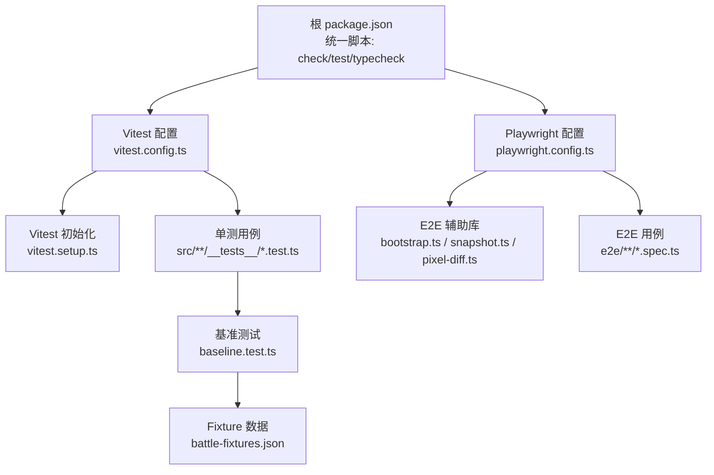
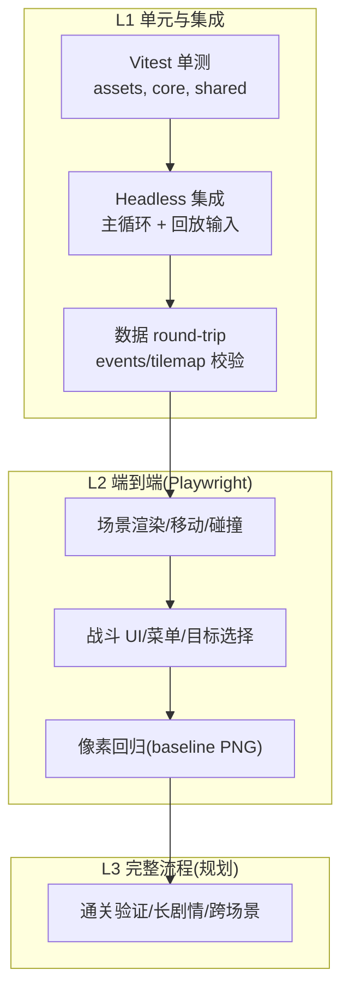
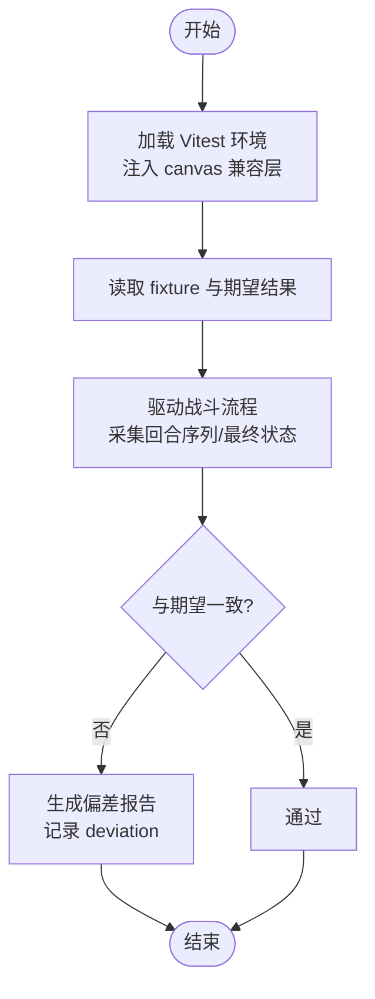
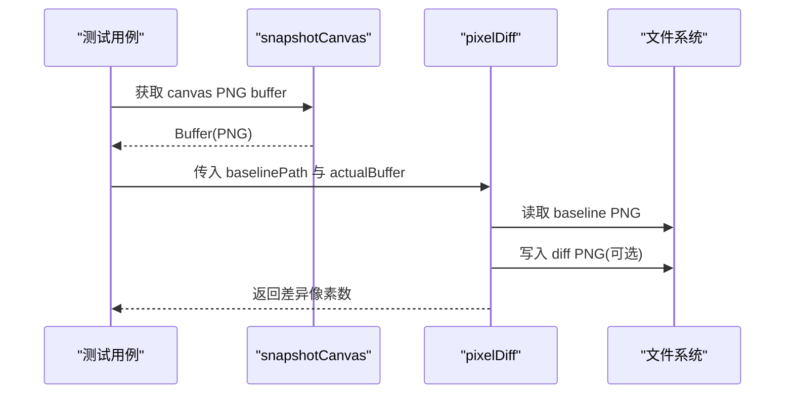
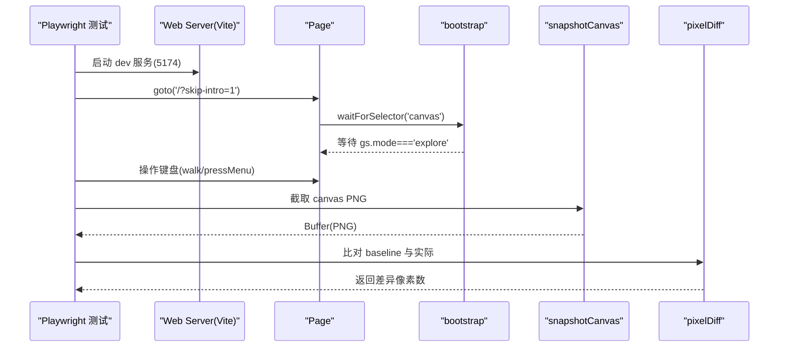
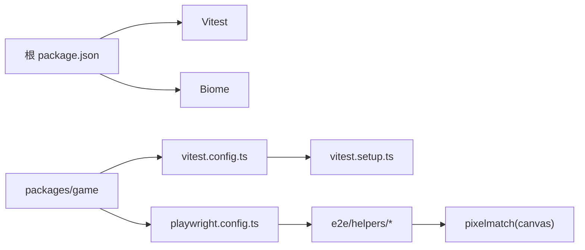

# 测试框架

<cite>
**本文引用的文件**
- [README.md](file://README.md)
- [package.json](file://package.json)
- [vitest.config.ts](file://packages/game/vitest.config.ts)
- [vitest.setup.ts](file://packages/game/vitest.setup.ts)
- [playwright.config.ts](file://packages/game/playwright.config.ts)
- [bootstrap.ts](file://packages/game/e2e/helpers/bootstrap.ts)
- [snapshot.ts](file://packages/game/e2e/helpers/snapshot.ts)
- [pixel-diff.ts](file://packages/game/e2e/helpers/pixel-diff.ts)
- [baseline.test.ts](file://packages/game/src/core/battle/__tests__/baseline.test.ts)
- [battle-fixtures.json](file://packages/game/src/dev/fixtures/battle-fixtures.json)
- [04-decisions.md](file://docs/phase1/04-decisions.md)
- [m3-5-scene-encounter-design.md](file://docs/phase1/plans/2026-05-24-m3-5-scene-encounter-design.md)
- [sdlpal-dump-map-all.ts](file://packages/pal-extract/scripts/sdlpal-dump-map-all.ts)
</cite>

## 目录
1. [简介](#简介)
2. [项目结构](#项目结构)
3. [核心组件](#核心组件)
4. [架构总览](#架构总览)
5. [详细组件分析](#详细组件分析)
6. [依赖分析](#依赖分析)
7. [性能考虑](#性能考虑)
8. [故障排查指南](#故障排查指南)
9. [结论](#结论)
10. [附录](#附录)

## 简介
本文件为 type-pal 项目的“测试框架”使用文档，覆盖单元测试策略、回归测试套件（基准与视觉回归）、E2E 用例编写（Playwright）、测试数据管理、覆盖率报告、持续集成配置与最佳实践。项目采用 TypeScript + Vite + Vitest + Playwright 的测试体系，以 sdlpal 源码作为行为规格来源，强调“重档”回归：通过像素差分与回合对拍确保忠实还原。

## 项目结构
测试相关的关键位置与职责如下：
- 根脚本与命令：统一入口在根 package.json，提供 check/test/typecheck/lint/format 等命令；test 会递归 workspace 执行各包的 test。
- Vitest 单测：位于 packages/game 下，配置文件 vitest.config.ts 指定 jsdom 环境、setupFiles，并排除 e2e/**，避免与 Playwright 冲突。
- Playwright E2E：位于 packages/game/e2e，配置文件 playwright.config.ts 定义浏览器项目、端口、webServer 启动参数与追踪策略。
- 辅助工具：e2e/helpers 提供 bootstrap、snapshot、pixel-diff 等能力，用于快速进入目标模式、截图与像素比对。
- 基准与数据：battle 基准测试 baseline.test.ts 驱动 fixture 跑战斗并与期望结果对比；battle-fixtures.json 提供可复现的战斗场景数据。
- 决策与设计：docs/phase1/04-decisions.md 与 plans/m3-5-scene-encounter-design.md 明确测试分层、基线策略与端到端方案。

图表来源
- [package.json:1-29](file://package.json#L1-L29)
- [vitest.config.ts:1-12](file://packages/game/vitest.config.ts#L1-L12)
- [playwright.config.ts:1-32](file://packages/game/playwright.config.ts#L1-L32)
- [vitest.setup.ts:1-21](file://packages/game/vitest.setup.ts#L1-L21)
- [bootstrap.ts:1-112](file://packages/game/e2e/helpers/bootstrap.ts#L1-L112)
- [snapshot.ts:1-17](file://packages/game/e2e/helpers/snapshot.ts#L1-L17)
- [pixel-diff.ts:39-80](file://packages/game/e2e/helpers/pixel-diff.ts#L39-L80)
- [baseline.test.ts:359-591](file://packages/game/src/core/battle/__tests__/baseline.test.ts#L359-L591)
- [battle-fixtures.json:1-29](file://packages/game/src/dev/fixtures/battle-fixtures.json#L1-L29)

章节来源
- [README.md:80-108](file://README.md#L80-L108)
- [package.json:1-29](file://package.json#L1-L29)
- [vitest.config.ts:1-12](file://packages/game/vitest.config.ts#L1-L12)
- [playwright.config.ts:1-32](file://packages/game/playwright.config.ts#L1-L32)

## 核心组件
- 测试运行器与环境
  - Vitest：jsdom 环境，setupFiles 注入 canvas 兼容层，使原生图像 API 可在测试中运行。
  - Playwright：独立 webServer 启动 dev 服务（端口 5174），串行执行，禁用重试，开启 trace on-first-retry。
- 辅助能力
  - bootstrap：跳过开场对话、等待 explore 模式就绪、打开开发面板、选择战斗/场景跳转、模拟按键输入。
  - snapshot：从 canvas 导出 PNG buffer，供像素比对。
  - pixel-diff：读取 baseline PNG 与实际 PNG，计算差异像素数，支持更新 baseline 或输出 diff PNG。
- 基准与数据
  - baseline.test.ts：解析 KV fixture 与 result.json，驱动战斗流程，采集回合序列与最终状态，生成偏差报告。
  - battle-fixtures.json：定义队伍成员、玩家属性覆盖、库存、敌人队伍与战场 ID，保证可重复性。

章节来源
- [vitest.setup.ts:1-21](file://packages/game/vitest.setup.ts#L1-L21)
- [playwright.config.ts:1-32](file://packages/game/playwright.config.ts#L1-L32)
- [bootstrap.ts:1-112](file://packages/game/e2e/helpers/bootstrap.ts#L1-L112)
- [snapshot.ts:1-17](file://packages/game/e2e/helpers/snapshot.ts#L1-L17)
- [pixel-diff.ts:39-80](file://packages/game/e2e/helpers/pixel-diff.ts#L39-L80)
- [baseline.test.ts:359-591](file://packages/game/src/core/battle/__tests__/baseline.test.ts#L359-L591)
- [battle-fixtures.json:1-29](file://packages/game/src/dev/fixtures/battle-fixtures.json#L1-L29)

## 架构总览
测试体系按层级划分，兼顾速度与保真度：
- L1a/b/c/d：Vitest 单测与集成、headless 流程、数据 round-trip 与字节级对拍。
- L2：Playwright 端到端，聚焦用户视觉关注点（渲染、交互）。
- L3：完整游戏流程端到端（当前规划阶段）。

[此图为概念性架构图，不直接映射具体源文件]

## 详细组件分析

### 单元测试策略（Vitest）
- 环境与初始化
  - 使用 jsdom 环境，并通过 setupFiles 注入 createImageBitmap 与 ImageData 的 polyfill，使走浏览器原生 API 的资源与帧缓冲代码能在测试中运行。
- 用例组织
  - 单测文件遵循 *.test.ts 命名约定，集中在 src/**/__tests__ 目录；资源解码、精灵 blob、tileset 等均有对应单测。
- 断言与模拟
  - 使用 Vitest 内置 expect 与 vi.spyOn 进行断言与日志拦截；对于外部系统（如文件系统、网络）可通过 mock 隔离。
- 基准测试
  - baseline.test.ts 驱动战斗 fixture，采集实际回合与最终状态，与期望 result.json 对比，输出偏差报告；已知偏差项标记 skip 并记录原因。

图表来源
- [vitest.setup.ts:1-21](file://packages/game/vitest.setup.ts#L1-L21)
- [baseline.test.ts:359-591](file://packages/game/src/core/battle/__tests__/baseline.test.ts#L359-L591)

章节来源
- [vitest.config.ts:1-12](file://packages/game/vitest.config.ts#L1-L12)
- [vitest.setup.ts:1-21](file://packages/game/vitest.setup.ts#L1-L21)
- [baseline.test.ts:359-591](file://packages/game/src/core/battle/__tests__/baseline.test.ts#L359-L591)

### 回归测试套件（基准与视觉回归）
- 数值类基准（战斗）
  - 通过 KV fixture 与 result.json 对拍，比较 observed vs expected 的结果与回合序列，输出 BaselineRunReport。
- 视觉类基准（地图/战斗画面）
  - 使用 pixelmatch 进行像素比对，阈值默认 0.1；当差异像素大于阈值时，可选择更新 baseline 或输出 .diff.png。
  - 另有 sdlpal 全图 dump 脚本，批量对比 tilemap 渲染一致性。

图表来源
- [snapshot.ts:1-17](file://packages/game/e2e/helpers/snapshot.ts#L1-L17)
- [pixel-diff.ts:39-80](file://packages/game/e2e/helpers/pixel-diff.ts#L39-L80)
- [sdlpal-dump-map-all.ts:122-159](file://packages/pal-extract/scripts/sdlpal-dump-map-all.ts#L122-L159)

章节来源
- [pixel-diff.ts:39-80](file://packages/game/e2e/helpers/pixel-diff.ts#L39-L80)
- [sdlpal-dump-map-all.ts:122-159](file://packages/pal-extract/scripts/sdlpal-dump-map-all.ts#L122-L159)

### E2E 测试用例编写（Playwright）
- 配置要点
  - testDir 指向 e2e；fullyParallel=false、workers=1、retries=0，确保 dev server 单实例与状态稳定；trace 仅在首次重试时开启。
  - baseURL 指向 http://localhost:5174，webServer 启动命令为 E2E=1 pnpm dev --port 5174 --strictPort，复用本地服务器（非 CI）。
- 用例编写规范
  - 使用 helpers/bootstrap 快速进入 explore 模式，等待 canvas 与 __game.gs.mode === 'explore' 就绪。
  - 使用 walk/pressMenu 等封装方法模拟键盘输入，确保 tick 消费与 pressed 清空。
  - 使用 selectBattleFixture/selectSceneJump 通过开发面板快捷进入目标场景/战斗。
  - 使用 snapshotCanvas 截屏，结合 pixel-diff 进行视觉回归。

图表来源
- [playwright.config.ts:1-32](file://packages/game/playwright.config.ts#L1-L32)
- [bootstrap.ts:1-112](file://packages/game/e2e/helpers/bootstrap.ts#L1-L112)
- [snapshot.ts:1-17](file://packages/game/e2e/helpers/snapshot.ts#L1-L17)
- [pixel-diff.ts:39-80](file://packages/game/e2e/helpers/pixel-diff.ts#L39-L80)

章节来源
- [playwright.config.ts:1-32](file://packages/game/playwright.config.ts#L1-L32)
- [bootstrap.ts:1-112](file://packages/game/e2e/helpers/bootstrap.ts#L1-L112)
- [snapshot.ts:1-17](file://packages/game/e2e/helpers/snapshot.ts#L1-L17)
- [pixel-diff.ts:39-80](file://packages/game/e2e/helpers/pixel-diff.ts#L39-L80)

### 测试数据管理（场景设计、数据驱动、环境隔离）
- Fixture 驱动
  - battle-fixtures.json 定义队伍成员、玩家属性覆盖、库存、敌人队伍与战场 ID，确保每次运行条件一致。
- 期望结果
  - result.json 保存期望的回合序列与最终状态，baseline.test.ts 将其与运行时采集数据进行对比。
- 环境隔离
  - Vitest 使用 jsdom 与 setupFiles 注入，避免真实浏览器依赖；Playwright 使用独立 webServer 与 baseURL，避免与开发端口冲突。

章节来源
- [battle-fixtures.json:1-29](file://packages/game/src/dev/fixtures/battle-fixtures.json#L1-L29)
- [baseline.test.ts:359-591](file://packages/game/src/core/battle/__tests__/baseline.test.ts#L359-L591)
- [vitest.config.ts:1-12](file://packages/game/vitest.config.ts#L1-L12)
- [playwright.config.ts:1-32](file://packages/game/playwright.config.ts#L1-L32)

### 覆盖率报告生成
- 当前仓库未显式配置覆盖率插件；如需启用，可在 Vitest 配置中添加 coverage 选项（例如启用 v8 或 istanbul 报告），并在根脚本中增加 run-coverage 命令。
- 建议将覆盖率阈值纳入 check 门禁，确保新增代码具备足够覆盖。

[本节为通用指导，不直接分析具体文件]

### 持续集成配置
- 当前 README 声明“不做 CI”，以本地 pnpm check 代替门禁。若引入 CI，建议：
  - 安装系统依赖（如 canvas 原生依赖、Playwright 浏览器）。
  - 并行执行 Vitest 单测，串行执行 Playwright E2E。
  - 缓存 node_modules 与 Playwright 浏览器二进制，缩短构建时间。
  - 上传 baseline PNG 与 diff PNG 作为工件，便于审查视觉回归。

[本节为通用指导，不直接分析具体文件]

### 测试最佳实践指南
- 分层清晰：L1 快且稳定，L2 慢但贴近用户视角；优先完善 L1，逐步补齐 L2。
- 基准先行：任何“sdlpal 即规格”的模块实施前准备基准（像素或回合对拍），避免凭直觉修改。
- 确定性：固定 RNG seed、固定 fixture、固定输入序列，确保可重复。
- 可视化回归：baseline PNG 不入版本库，本机生成；CI 中仅比对差异并产出 diff PNG。
- 错误可见：抑制无关 warn/error，聚焦关键偏差；对已知偏差记录理由并标记 skip。

章节来源
- [04-decisions.md:1-41](file://docs/phase1/04-decisions.md#L1-L41)
- [m3-5-scene-encounter-design.md:404-444](file://docs/phase1/plans/2026-05-24-m3-5-scene-encounter-design.md#L404-L444)

## 依赖分析
- 顶层脚本依赖 Vitest 与 Biome，workspace 内各包共享类型与数据结构。
- Vitest 与 Playwright 各自维护独立环境，避免相互干扰。
- E2E 辅助库依赖 canvas 与 pixelmatch，用于截图与像素比对。

图表来源
- [package.json:1-29](file://package.json#L1-L29)
- [vitest.config.ts:1-12](file://packages/game/vitest.config.ts#L1-L12)
- [playwright.config.ts:1-32](file://packages/game/playwright.config.ts#L1-L32)
- [vitest.setup.ts:1-21](file://packages/game/vitest.setup.ts#L1-L21)
- [pixel-diff.ts:39-80](file://packages/game/e2e/helpers/pixel-diff.ts#L39-L80)

章节来源
- [package.json:1-29](file://package.json#L1-L29)
- [vitest.config.ts:1-12](file://packages/game/vitest.config.ts#L1-L12)
- [playwright.config.ts:1-32](file://packages/game/playwright.config.ts#L1-L32)

## 性能考虑
- 单测尽量无 IO、无网络，利用内存数据与 fixture，保持毫秒级响应。
- E2E 串行执行，避免并发导致 dev server 状态竞争；必要时拆分项目减少耦合。
- 像素比对阈值合理设置，避免微小抖动导致误报；必要时放宽阈值或分区域比对。

[本节为通用指导，不直接分析具体文件]

## 故障排查指南
- Vitest 无法识别 createImageBitmap/ImageData
  - 检查 vitest.setup.ts 是否被正确加载，确认 canvas 包已安装。
- Playwright 无法连接 dev server
  - 确认端口 5174 未被占用，E2E=1 环境变量生效，webServer 启动成功。
- 像素比对频繁失败
  - 检查 baseline PNG 尺寸与实际一致；调整 threshold；必要时更新 baseline。
- 基准测试偏差较多
  - 查看 baseline.test.ts 的偏差报告，定位具体回合或最终状态差异；核对 SDLCLASSIC 构建与 fixture 数据。

章节来源
- [vitest.setup.ts:1-21](file://packages/game/vitest.setup.ts#L1-L21)
- [playwright.config.ts:1-32](file://packages/game/playwright.config.ts#L1-L32)
- [pixel-diff.ts:39-80](file://packages/game/e2e/helpers/pixel-diff.ts#L39-L80)
- [baseline.test.ts:359-591](file://packages/game/src/core/battle/__tests__/baseline.test.ts#L359-L591)

## 结论
本项目测试体系以“重档回归”为核心，通过 Vitest 保障单元与集成质量，借助 Playwright 与像素比对确保视觉与交互一致性，并以 sdlpal 作为权威规格来源。建议继续完善 L2 用例覆盖、引入覆盖率门禁与 CI，同时坚持基准先行与确定性原则，持续提升移植保真度与工程效率。

[本节为总结性内容，不直接分析具体文件]

## 附录
- 常用命令
  - pnpm check：类型检查 + 单测/回归测试
  - pnpm test：全工作区测试
  - pnpm e2e：Playwright 端到端测试
  - pnpm extract：重新生成 extracted 资源
- 参考文档
  - docs/phase1/04-decisions.md：测试分层与重档策略
  - docs/phase1/plans/2026-05-24-m3-5-scene-encounter-design.md：E2E 结构与视觉回归方案

章节来源
- [README.md:80-108](file://README.md#L80-L108)
- [04-decisions.md:1-41](file://docs/phase1/04-decisions.md#L1-L41)
- [m3-5-scene-encounter-design.md:404-444](file://docs/phase1/plans/2026-05-24-m3-5-scene-encounter-design.md#L404-L444)