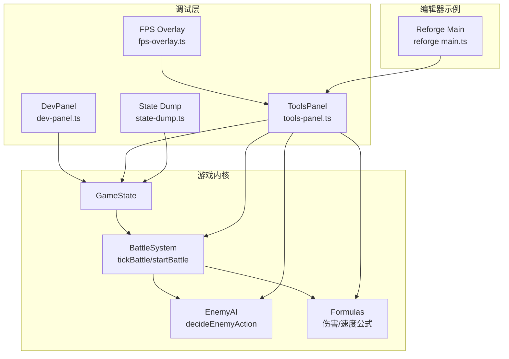
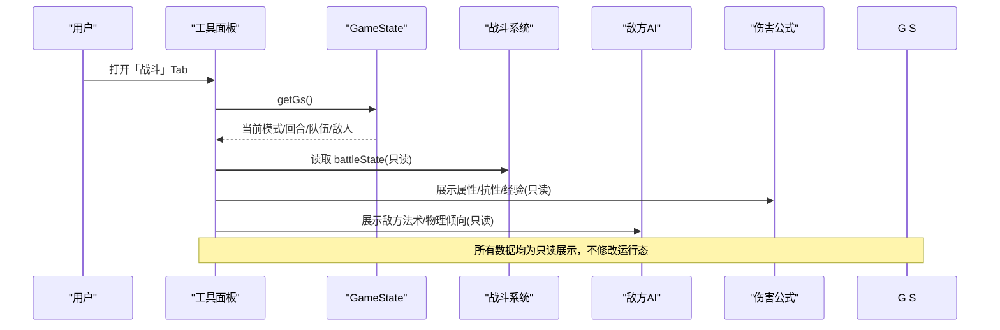
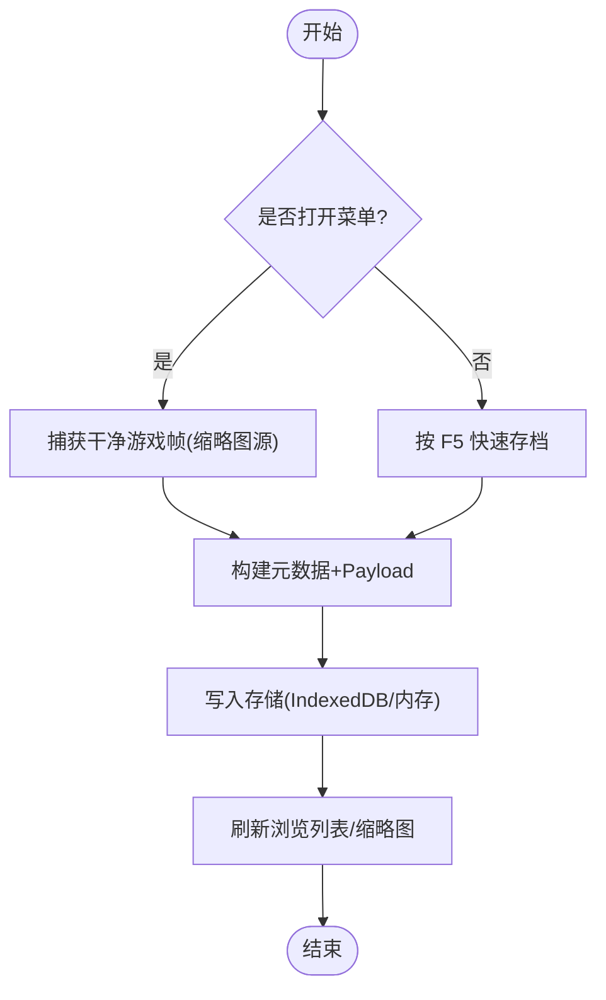
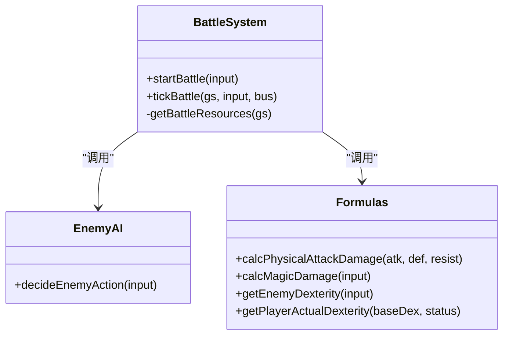
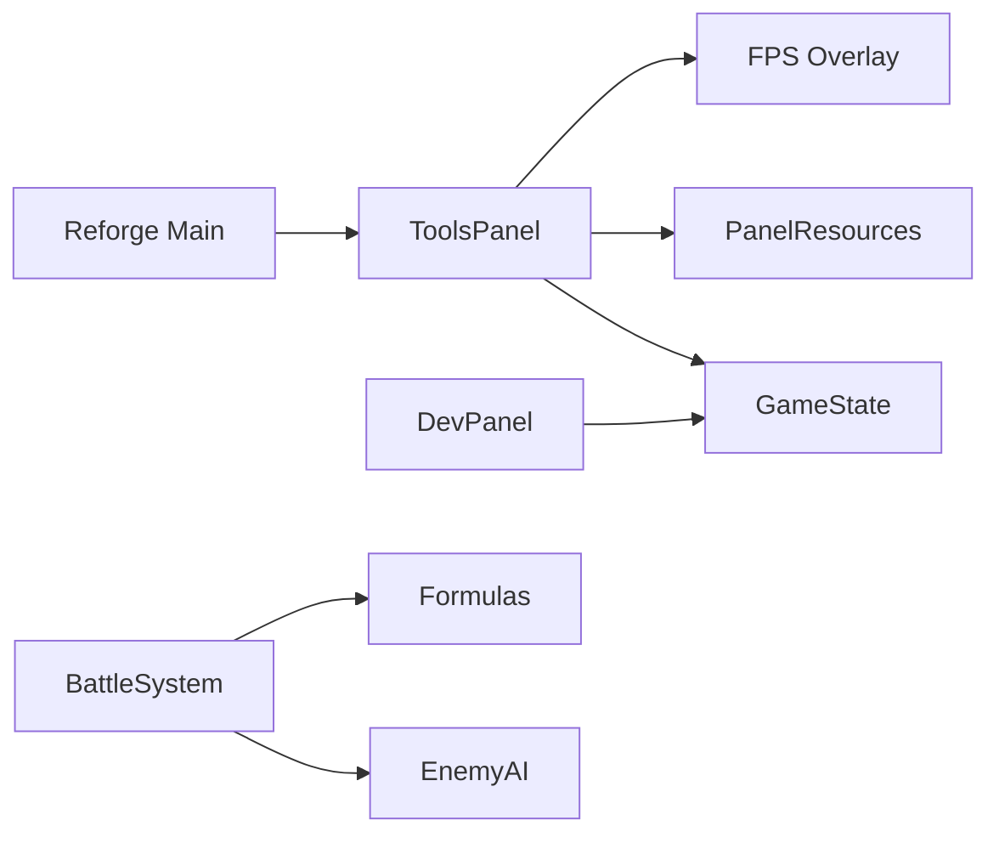

# 调试面板

<cite>
**本文引用的文件**   
- [dev-panel.ts](file://packages/game/src/dev/dev-panel.ts)
- [tools-panel.ts](file://packages/game/src/tools/tools-panel.ts)
- [state-dump.ts](file://packages/game/src/dev/state-dump.ts)
- [battle-system.ts](file://packages/game/src/core/battle/battle-system.ts)
- [enemy-ai.ts](file://packages/game/src/core/battle/enemy-ai.ts)
- [formulas.ts](file://packages/game/src/core/battle/formulas.ts)
- [fps-overlay.ts](file://packages/game/src/tools/fps-overlay.ts)
- [main.ts](file://packages/reforge/src/main.ts)
</cite>

## 目录
1. [简介](#简介)
2. [项目结构](#项目结构)
3. [核心组件](#核心组件)
4. [架构总览](#架构总览)
5. [详细组件分析](#详细组件分析)
6. [依赖关系分析](#依赖关系分析)
7. [性能考量](#性能考量)
8. [故障排查指南](#故障排查指南)
9. [结论](#结论)
10. [附录](#附录)

## 简介
本文件为“调试面板系统”的使用与扩展文档，面向开发者与测试人员。内容覆盖：
- 实时状态查看：游戏状态监控、内存使用分析、性能指标展示
- 快速存档读档工具：手动存档、自动快照、状态回滚
- 战斗只读信息展示：战斗历史回放、伤害计算验证、AI决策分析
- 性能分析工具：帧率监控、渲染性能分析、资源加载统计
- 自定义调试工具的扩展方法与最佳实践：新增调试视图与工具函数

## 项目结构
调试面板由两类面板组成：
- 开发面板（仅 DEV）：用于战斗调试、场景跳转、特效触发等深度调试能力
- 工具面板（生产可用）：提供只读信息与玩家便利操作，如战斗/场景/系统/对话/计时器/快捷键一览

图表来源
- [dev-panel.ts:1-120](file://packages/game/src/dev/dev-panel.ts#L1-L120)
- [tools-panel.ts:1-120](file://packages/game/src/tools/tools-panel.ts#L1-L120)
- [battle-system.ts:472-614](file://packages/game/src/core/battle/battle-system.ts#L472-L614)
- [enemy-ai.ts:68-131](file://packages/game/src/core/battle/enemy-ai.ts#L68-L131)
- [formulas.ts:36-60](file://packages/game/src/core/battle/formulas.ts#L36-L60)
- [fps-overlay.ts:1-60](file://packages/game/src/tools/fps-overlay.ts#L1-L60)
- [state-dump.ts:73-106](file://packages/game/src/dev/state-dump.ts#L73-L106)
- [main.ts:220-275](file://packages/reforge/src/main.ts#L220-L275)

章节来源
- [dev-panel.ts:1-120](file://packages/game/src/dev/dev-panel.ts#L1-L120)
- [tools-panel.ts:1-120](file://packages/game/src/tools/tools-panel.ts#L1-L120)

## 核心组件
- 开发面板（DEV）
  - 快捷键 B/F1 打开战斗选择器与 GameState dump
  - 支持自定义战斗、剧情 Boss 一键起战、场景跳转、字体/视频/RNG 演出测试
- 工具面板（生产可用）
  - 战斗/场景/系统/对话/计时器/快捷键六大 Tab
  - 小地图、缩放、音频通道控制、存档导入导出、FPS 开关
- 性能与诊断
  - FPS 覆盖层（rAF 采样）、每帧状态 JSONL 导出（对齐 sdlpal dump）
- 存档与快速存读
  - 浏览界面 + 缩略图缓存；快速槽 quickSave/quickLoad

章节来源
- [dev-panel.ts:430-451](file://packages/game/src/dev/dev-panel.ts#L430-L451)
- [tools-panel.ts:832-899](file://packages/game/src/tools/tools-panel.ts#L832-L899)
- [fps-overlay.ts:13-111](file://packages/game/src/tools/fps-overlay.ts#L13-L111)
- [state-dump.ts:73-106](file://packages/game/src/dev/state-dump.ts#L73-L106)
- [main.ts:220-275](file://packages/reforge/src/main.ts#L220-L275)

## 架构总览
调试面板通过依赖注入读取运行时数据，不侵入主渲染路径。关键交互如下：

图表来源
- [tools-panel.ts:394-471](file://packages/game/src/tools/tools-panel.ts#L394-L471)
- [battle-system.ts:472-614](file://packages/game/src/core/battle/battle-system.ts#L472-L614)
- [enemy-ai.ts:68-131](file://packages/game/src/core/battle/enemy-ai.ts#L68-L131)
- [formulas.ts:179-217](file://packages/game/src/core/battle/formulas.ts#L179-L217)

## 详细组件分析

### 实时状态查看
- 游戏状态监控
  - 工具面板「场景」Tab 显示地图名、场景号、主角坐标/朝向、镜头位置、队伍成员列表，并随移动实时更新
  - 开发面板 F1 输出 GameState 深拷贝到控制台，便于离线分析
- 内存使用分析
  - 浏览器端可通过 DevTools Memory 面板结合 State Dump 进行对比；也可在控制台执行 window.__tpDumpDownload() 导出 jsonl 后离线分析
- 性能指标展示
  - 工具面板「系统」Tab 可开启左上角 FPS 覆盖层，rAF 采样窗口约 500ms，≥50 绿、<50 红

章节来源
- [tools-panel.ts:474-502](file://packages/game/src/tools/tools-panel.ts#L474-L502)
- [dev-panel.ts:441-445](file://packages/game/src/dev/dev-panel.ts#L441-L445)
- [state-dump.ts:73-106](file://packages/game/src/dev/state-dump.ts#L73-L106)
- [fps-overlay.ts:77-111](file://packages/game/src/tools/fps-overlay.ts#L77-L111)

### 快速存档读档工具
- 手动存档
  - 工具面板「系统」Tab 提供 5 个存档位导入/导出；编辑器示例中提供存档浏览界面与缩略图缓存
- 自动快照
  - 编辑器示例提供 quickSave/quickLoad 快捷槽，保存时抓取当前画面作为缩略图
- 状态回滚
  - 通过导入之前导出的存档 JSON 实现回滚；编辑器侧对工程 ID 校验，防止跨工程读档导致世界态错乱

图表来源
- [main.ts:224-275](file://packages/reforge/src/main.ts#L224-L275)
- [main.ts:276-290](file://packages/reforge/src/main.ts#L276-L290)

章节来源
- [tools-panel.ts:554-605](file://packages/game/src/tools/tools-panel.ts#L554-L605)
- [main.ts:224-275](file://packages/reforge/src/main.ts#L224-L275)
- [main.ts:276-290](file://packages/reforge/src/main.ts#L276-L290)

### 战斗只读信息展示
- 战斗历史回放
  - 工具面板「对话」Tab 按场景分组倒序展示对话历史，支持关键词搜索
- 伤害计算验证
  - 工具面板「战斗」Tab 展示我方/敌方属性、抗性、状态、经验/金钱、灵葫值等；配合「伤害公式」模块可手工验算
- AI 决策分析
  - 工具面板「战斗」Tab 展示敌方目标、法术/物理倾向；AI 模块遵循 sdlpal 真值逻辑（含沉默/混乱/睡眠/麻痹分支）

图表来源
- [battle-system.ts:277-419](file://packages/game/src/core/battle/battle-system.ts#L277-L419)
- [enemy-ai.ts:68-131](file://packages/game/src/core/battle/enemy-ai.ts#L68-L131)
- [formulas.ts:36-60](file://packages/game/src/core/battle/formulas.ts#L36-L60)
- [formulas.ts:112-158](file://packages/game/src/core/battle/formulas.ts#L112-L158)
- [formulas.ts:179-217](file://packages/game/src/core/battle/formulas.ts#L179-L217)

章节来源
- [tools-panel.ts:394-471](file://packages/game/src/tools/tools-panel.ts#L394-L471)
- [tools-panel.ts:607-646](file://packages/game/src/tools/tools-panel.ts#L607-L646)
- [enemy-ai.ts:68-131](file://packages/game/src/core/battle/enemy-ai.ts#L68-L131)
- [formulas.ts:36-60](file://packages/game/src/core/battle/formulas.ts#L36-L60)

### 性能分析工具
- 帧率监控
  - 工具面板「系统」Tab 切换 FPS 覆盖层；rAF 驱动，500ms 采样窗口，≥50 绿色、<50 红色
- 渲染性能分析
  - 借助 FPS 覆盖层判断 rAF 是否稳定；若卡顿但 FPS 正常，多为逻辑 tick 量化或重绘开销
- 资源加载统计
  - 编辑器示例启动阶段并行加载 tilemap/tileset/palette/glyphs/cursor/portraits，失败降级并打印警告，便于定位缺失资源

章节来源
- [fps-overlay.ts:13-111](file://packages/game/src/tools/fps-overlay.ts#L13-L111)
- [main.ts:135-155](file://packages/reforge/src/main.ts#L135-L155)

### 自定义调试工具扩展指南
- 添加新的调试视图
  - 在工具面板中新增一个 TabKey，并在 renderActiveTab 路由中挂载对应渲染函数
  - 参考现有 Tab 的 DOM 构造与 liveRow/kvLine/chipLine 等辅助函数，保持样式一致
- 添加新的工具函数
  - 将纯逻辑封装为独立模块（如新的 inspect 或 ops），从 tools-panel 按需引入
  - 如需访问运行时数据，通过 ToolsPanelDeps.getGs()/getResources() 获取只读快照
- 最佳实践
  - 面板只读为主，避免直接 mutate GameState；需要修改时使用开发面板或专用入口
  - 使用 CSS 类复用主题色与排版，减少内联样式
  - 对异步操作（如缩略图/存档 IO）统一错误提示与成功反馈

章节来源
- [tools-panel.ts:50-58](file://packages/game/src/tools/tools-panel.ts#L50-L58)
- [tools-panel.ts:790-798](file://packages/game/src/tools/tools-panel.ts#L790-L798)
- [tools-panel.ts:188-230](file://packages/game/src/tools/tools-panel.ts#L188-L230)

## 依赖关系分析
- 低耦合：面板通过依赖注入读取数据，不持有全局引用
- 单向依赖：面板 → 游戏内核（只读）；战斗系统 → AI/公式（计算）
- 外部集成：IndexedDB/内存存储（存档）、localStorage（设置）、rAF（FPS）

图表来源
- [tools-panel.ts:31-48](file://packages/game/src/tools/tools-panel.ts#L31-L48)
- [dev-panel.ts:346-428](file://packages/game/src/dev/dev-panel.ts#L346-L428)
- [battle-system.ts:472-614](file://packages/game/src/core/battle/battle-system.ts#L472-L614)
- [enemy-ai.ts:68-131](file://packages/game/src/core/battle/enemy-ai.ts#L68-L131)
- [formulas.ts:179-217](file://packages/game/src/core/battle/formulas.ts#L179-L217)
- [main.ts:220-275](file://packages/reforge/src/main.ts#L220-L275)

章节来源
- [tools-panel.ts:31-48](file://packages/game/src/tools/tools-panel.ts#L31-L48)
- [dev-panel.ts:346-428](file://packages/game/src/dev/dev-panel.ts#L346-L428)

## 性能考量
- 面板渲染
  - 使用 liveRow/kvLine 等增量更新，避免整块替换 DOM
  - 小地图与缩略图采用懒加载与缓存，降低首屏开销
- 采样与节流
  - FPS 覆盖层 500ms 采样窗口，避免频繁重绘
  - 状态导出（jsonl）仅在 URL 参数启用，默认 no-op
- 存储与 IO
  - IndexedDB 优先，内存降级；缩略图解码为 ImageBitmap 提升后续绘制性能

[本节为通用指导，无需源码引用]

## 故障排查指南
- 无法打开工具面板
  - 检查是否已注入样式与根节点；确认未重复初始化
- 战斗 Tab 无数据
  - 确认当前处于战斗模式且 battleState 存在；检查只读数据源是否正确传入
- 快速存档失败
  - 检查存储后端可用性（IndexedDB 权限/配额）；确认工程 ID 匹配
- FPS 覆盖层不显示
  - 确认已在「系统」Tab 开启；检查 localStorage 键值与 DOM 根节点是否存在

章节来源
- [tools-panel.ts:832-899](file://packages/game/src/tools/tools-panel.ts#L832-L899)
- [tools-panel.ts:394-471](file://packages/game/src/tools/tools-panel.ts#L394-L471)
- [main.ts:252-266](file://packages/reforge/src/main.ts#L252-L266)
- [fps-overlay.ts:44-60](file://packages/game/src/tools/fps-overlay.ts#L44-L60)

## 结论
调试面板以“只读可视化 + 便捷操作”为核心，既满足日常调试与验证需求，又可在生产环境安全启用。通过模块化设计与清晰的依赖边界，新增调试视图与工具函数的成本较低，建议遵循只读原则与统一样式规范，确保长期可维护性。

[本节为总结，无需源码引用]

## 附录
- 常用快捷键
  - 工具面板：` `（反引号）打开/关闭
  - 快速存档/读档：F5 / F9
  - 开发面板（DEV）：B 打开战斗选择器，F1 输出 GameState dump
- 状态导出
  - 浏览器地址栏追加 ?tp_dump=1，运行 window.__tpDumpDownload() 下载 jsonl

章节来源
- [tools-panel.ts:774-788](file://packages/game/src/tools/tools-panel.ts#L774-L788)
- [dev-panel.ts:430-451](file://packages/game/src/dev/dev-panel.ts#L430-L451)
- [state-dump.ts:73-106](file://packages/game/src/dev/state-dump.ts#L73-L106)