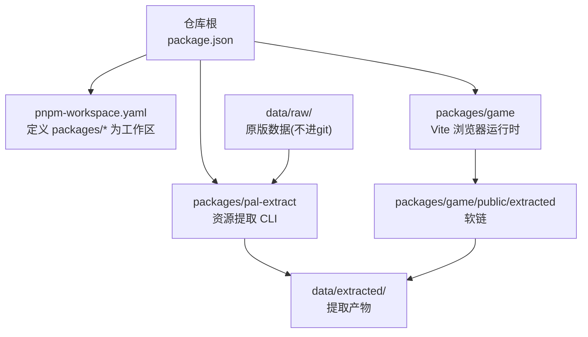
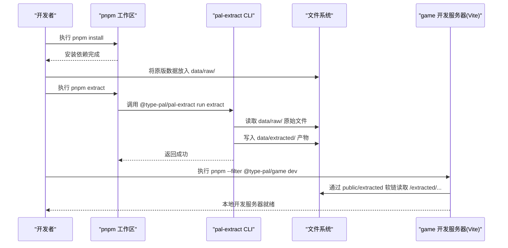
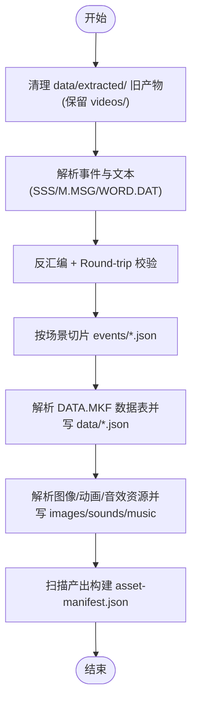
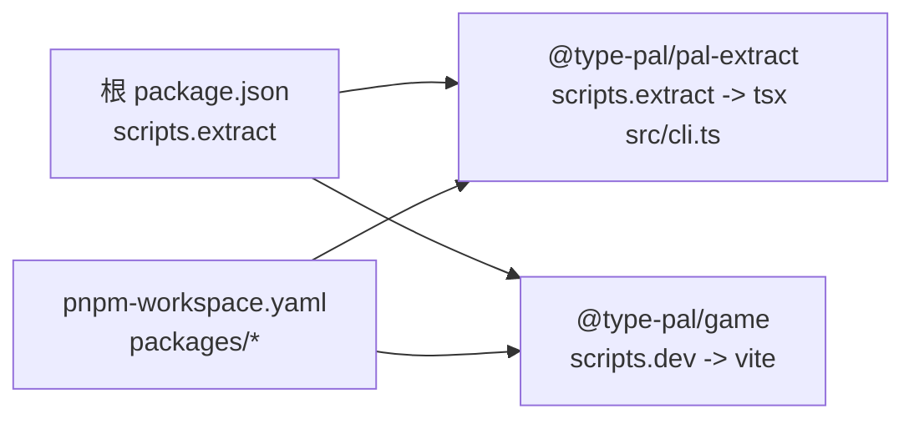

# 快速开始

<cite>
**本文引用的文件**   
- [README.md](file://README.md)
- [package.json](file://package.json)
- [pnpm-workspace.yaml](file://pnpm-workspace.yaml)
- [data/raw/README.md](file://data/raw/README.md)
- [packages/pal-extract/package.json](file://packages/pal-extract/package.json)
- [packages/game/package.json](file://packages/game/package.json)
- [packages/pal-extract/src/cli.ts](file://packages/pal-extract/src/cli.ts)
</cite>

## 目录
1. [简介](#简介)
2. [项目结构](#项目结构)
3. [核心组件](#核心组件)
4. [架构总览](#架构总览)
5. [详细组件分析](#详细组件分析)
6. [依赖分析](#依赖分析)
7. [性能考虑](#性能考虑)
8. [故障排查指南](#故障排查指南)
9. [结论](#结论)
10. [附录](#附录)

## 简介
本指南面向首次接触项目的开发者，提供从零到运行的完整路径：环境准备、原版数据文件放置、资源提取、开发服务器启动与常用命令、以及常见问题排查。项目采用 pnpm monorepo 组织，包含资源提取工具与浏览器运行时两个关键部分。

## 项目结构
- 根脚本通过 workspace 聚合各子包命令，其中 extract 命令会调用 pal-extract 包的 CLI，生成 data/extracted/ 产物；game 包提供 Vite 开发服务器。
- data/raw/ 存放原版游戏数据（不进 git），pal-extract 读取该目录并产出 data/extracted/。
- packages/game/public/extracted 指向 data/extracted/ 的软链接，使浏览器以 /extracted/... 访问资源。

图表来源
- [package.json:1-29](file://package.json#L1-L29)
- [pnpm-workspace.yaml:1-3](file://pnpm-workspace.yaml#L1-L3)
- [packages/pal-extract/package.json:1-27](file://packages/pal-extract/package.json#L1-L27)
- [packages/game/package.json:1-32](file://packages/game/package.json#L1-L32)
- [README.md:66-78](file://README.md#L66-L78)

章节来源
- [README.md:66-78](file://README.md#L66-L78)
- [package.json:1-29](file://package.json#L1-L29)
- [pnpm-workspace.yaml:1-3](file://pnpm-workspace.yaml#L1-L3)

## 核心组件
- 资源提取器(@type-pal/pal-extract)
  - 入口脚本由 pnpm extract 触发，最终执行 tsx src/cli.ts。
  - 从 data/raw/ 解析 MKF 归档、文本、音频、视频等，输出 data/extracted/ 下的 JSON、PNG、WAV/OGG/MP4 等资源与清单。
- 浏览器运行时(@type-pal/game)
  - 基于 Vite 提供 dev/build/e2e 能力，运行期通过 /extracted/... 读取提取产物。

章节来源
- [packages/pal-extract/package.json:1-27](file://packages/pal-extract/package.json#L1-L27)
- [packages/game/package.json:1-32](file://packages/game/package.json#L1-L32)
- [README.md:80-97](file://README.md#L80-L97)

## 架构总览
下图展示“安装 → 提取 → 运行”的关键流程与数据流向。

图表来源
- [README.md:66-78](file://README.md#L66-L78)
- [packages/pal-extract/package.json:1-27](file://packages/pal-extract/package.json#L1-L27)
- [packages/game/package.json:1-32](file://packages/game/package.json#L1-L32)

## 详细组件分析

### 环境准备
- Node.js 版本要求
  - 本项目未显式声明 Node 版本约束，建议使用较新的 LTS 版本以获得最佳兼容性。
- 安装 pnpm
  - 使用官方推荐方式安装 pnpm（例如 npm i -g pnpm）。
- 克隆仓库并进入项目目录
  - 在终端中执行：git clone ... && cd type-pal
- 安装依赖
  - 执行：pnpm install
  - 说明：根 package.json 定义了 workspace 脚本与 extract 命令转发至 pal-extract 包。

章节来源
- [package.json:1-29](file://package.json#L1-L29)
- [pnpm-workspace.yaml:1-3](file://pnpm-workspace.yaml#L1-L3)

### 原版数据文件准备(data/raw/)
- 将目标游戏的 Win98 中文原版数据直接放入 data/raw/，不要套子目录。
- 该目录不会入库，需自行准备。
- 已确认包含的文件类型与数量见 data/raw/README.md。

章节来源
- [data/raw/README.md:1-45](file://data/raw/README.md#L1-L45)

### 资源提取流程(pnpm extract)
- 执行命令
  - 在仓库根目录执行：pnpm extract
- 内部过程
  - 根脚本将命令转发到 @type-pal/pal-extract 包的 extract 脚本，实际执行 tsx src/cli.ts。
  - CLI 会清理 data/extracted/ 下自身产出的旧文件（保留 videos/ 等非 CLI 步骤产物），然后依次：
    - 解析 SSS.MKF、M.MSG、WORD.DAT 等事件与文本数据
    - 反汇编事件字节码并进行 round-trip 校验
    - 按场景切片写出 events/*.json
    - 解析 DATA.MKF 等数据表并写出 data/*.json
    - 解析 MAP/GOP/MGO/F.MKF/ABC.MKF/FIRE.MKF/RNG.MKF/BALL.MKF/SOUNDS.MKF/FBP.MKF 等图像/动画/音效资源，写出 images/、sounds/、data/ 等
    - 生成 asset-manifest.json 供离线预缓存使用
- 输出目录结构(data/extracted/)
  - events/: scene-NNN.json, shared.json, objects.json, all.json
  - images/: world/, battle/, ui/, magic/, splash/, portraits/, items/ 等
  - data/: tilemap/, scene/, sprite/, palette/, battle-sprite/, font/, ui-sprite/, magic-sprite/ 及大量 *.json
  - sounds/: *.wav
  - music/: *.mid 与 CD 音轨 ogg
  - lookup/: words.json, strings.json
  - asset-manifest.json
- 软链接配置
  - packages/game/public/extracted 指向 data/extracted/，浏览器通过 /extracted/... 访问资源。

图表来源
- [packages/pal-extract/src/cli.ts:172-262](file://packages/pal-extract/src/cli.ts#L172-L262)
- [packages/pal-extract/src/cli.ts:282-395](file://packages/pal-extract/src/cli.ts#L282-L395)
- [packages/pal-extract/src/cli.ts:593-700](file://packages/pal-extract/src/cli.ts#L593-L700)
- [packages/pal-extract/src/cli.ts:701-870](file://packages/pal-extract/src/cli.ts#L701-L870)

章节来源
- [packages/pal-extract/package.json:1-27](file://packages/pal-extract/package.json#L1-L27)
- [packages/pal-extract/src/cli.ts:172-262](file://packages/pal-extract/src/cli.ts#L172-L262)
- [packages/pal-extract/src/cli.ts:282-395](file://packages/pal-extract/src/cli.ts#L282-L395)
- [packages/pal-extract/src/cli.ts:593-700](file://packages/pal-extract/src/cli.ts#L593-L700)
- [packages/pal-extract/src/cli.ts:701-870](file://packages/pal-extract/src/cli.ts#L701-L870)
- [README.md:77-78](file://README.md#L77-L78)

### 开发服务器启动与常用命令
- 启动第一阶段浏览器运行时
  - pnpm --filter @type-pal/game dev
- 其他常用命令
  - pnpm check：全工作区类型检查 + 单测
  - pnpm test：全工作区测试
  - pnpm typecheck：全工作区 TypeScript 检查
  - pnpm lint：biome 检查
  - pnpm format：biome 格式化
  - pnpm extract：重新生成 data/extracted/
  - pnpm --filter @type-pal/game build：构建生产包
  - pnpm --filter @type-pal/game e2e：端到端测试
  - pnpm --filter @type-pal/reforge dev：第二阶段新引擎 demo

章节来源
- [README.md:80-97](file://README.md#L80-L97)
- [packages/game/package.json:1-32](file://packages/game/package.json#L1-L32)

## 依赖分析
- 工作区定义
  - pnpm-workspace.yaml 将 packages/* 注册为工作区包。
- 根脚本
  - package.json 中的 scripts.extract 将命令转发到 @type-pal/pal-extract 包的 extract 脚本。
- 子包依赖
  - pal-extract 依赖 iconv-lite、pngjs 等用于编码转换与 PNG 处理。
  - game 依赖 vite、spessasynth_lib 等用于浏览器运行时与音频合成。

图表来源
- [package.json:1-29](file://package.json#L1-L29)
- [pnpm-workspace.yaml:1-3](file://pnpm-workspace.yaml#L1-L3)
- [packages/pal-extract/package.json:1-27](file://packages/pal-extract/package.json#L1-L27)
- [packages/game/package.json:1-32](file://packages/game/package.json#L1-L32)

章节来源
- [package.json:1-29](file://package.json#L1-L29)
- [pnpm-workspace.yaml:1-3](file://pnpm-workspace.yaml#L1-L3)
- [packages/pal-extract/package.json:1-27](file://packages/pal-extract/package.json#L1-L27)
- [packages/game/package.json:1-32](file://packages/game/package.json#L1-L32)

## 性能考虑
- 资源体积优化
  - 提取器对多类资源采用 gzip 压缩的 RLE blob 存储（如 NPC/战斗精灵、tileset、魔法特效等），减少磁盘与网络传输体积。
- 避免双解压
  - 使用 .rle 后缀而非 .gz，防止静态服务器自动添加 Content-Encoding 导致浏览器二次解压失败。
- 按需加载
  - 通过 manifest 与索引文件，运行时仅加载所需资源，降低首屏开销。

章节来源
- [packages/pal-extract/src/cli.ts:92-140](file://packages/pal-extract/src/cli.ts#L92-L140)
- [packages/pal-extract/src/cli.ts:374-395](file://packages/pal-extract/src/cli.ts#L374-L395)
- [packages/pal-extract/src/cli.ts:593-654](file://packages/pal-extract/src/cli.ts#L593-L654)
- [packages/pal-extract/src/cli.ts:701-740](file://packages/pal-extract/src/cli.ts#L701-L740)
- [packages/pal-extract/src/cli.ts:777-789](file://packages/pal-extract/src/cli.ts#L777-L789)

## 故障排查指南
- 依赖安装失败
  - 现象：安装时报错或某些原生模块编译失败。
  - 排查：
    - 确认 Node.js 版本为较新 LTS。
    - 确保 pnpm 已正确安装且可用。
    - 若涉及 canvas 等原生依赖，参考根 package.json 的 onlyBuiltDependencies 配置，必要时安装系统级构建工具。
- 原版数据缺失
  - 现象：运行 pnpm extract 报错找不到 SSS.MKF、DATA.MKF 等文件。
  - 排查：
    - 确认已将原版数据文件直接放入 data/raw/，未嵌套子目录。
    - 核对 data/raw/README.md 中的文件清单。
- 端口冲突
  - 现象：启动 game 开发服务器时报端口占用。
  - 排查：
    - 修改 Vite 端口配置或关闭占用进程后重试。
- 权限问题
  - 现象：写入 data/extracted/ 或 public/extracted 软链失败。
  - 排查：
    - 检查当前用户对 data/ 与 packages/game/public/ 的读写权限。
    - 在 macOS/Linux 上可尝试 chmod/chown 修复权限。
- 软链接失效
  - 现象：浏览器无法加载 /extracted/... 资源。
  - 排查：
    - 确认 packages/game/public/extracted 是否指向 data/extracted/。
    - 若软链损坏，重建软链或重新运行 pnpm extract。
- 资源不更新
  - 现象：修改 data/raw/ 后浏览器仍显示旧资源。
  - 排查：
    - 重新执行 pnpm extract 以刷新 data/extracted/。
    - 清除浏览器缓存或硬刷新页面。

章节来源
- [README.md:66-78](file://README.md#L66-L78)
- [data/raw/README.md:1-45](file://data/raw/README.md#L1-L45)
- [package.json:22-27](file://package.json#L22-L27)

## 结论
按照本指南完成环境准备、数据放置、资源提取与服务启动后，即可在浏览器中体验项目。后续如需调整资源或扩展功能，建议优先修改 pal-extract 与 game 包，并通过 pnpm check 与 pnpm test 保障质量。

## 附录
- 相关文档导航
  - docs/phase1/README.md：第一阶段文档入口
  - docs/phase2/README.md：第二阶段文档入口
  - reference/sdlpal/：行为规格参考源码
- 命令行速查
  - pnpm install
  - pnpm extract
  - pnpm --filter @type-pal/game dev