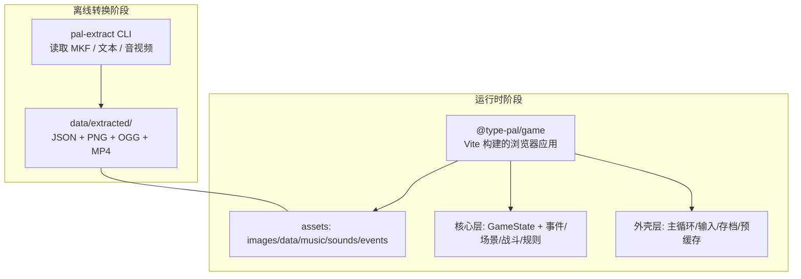
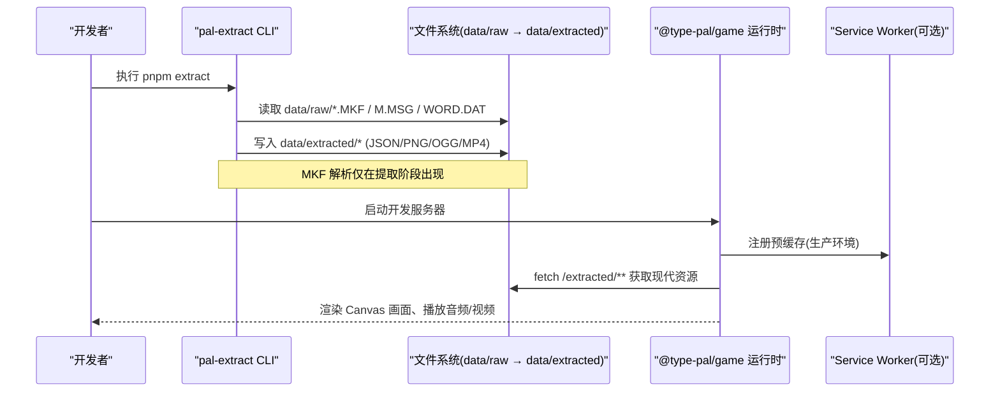
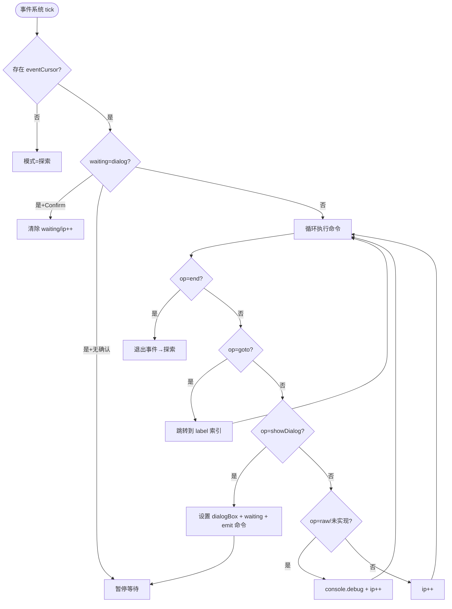
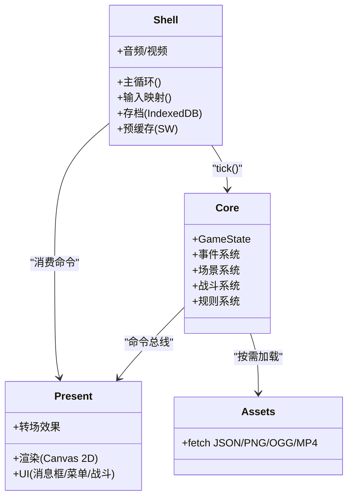
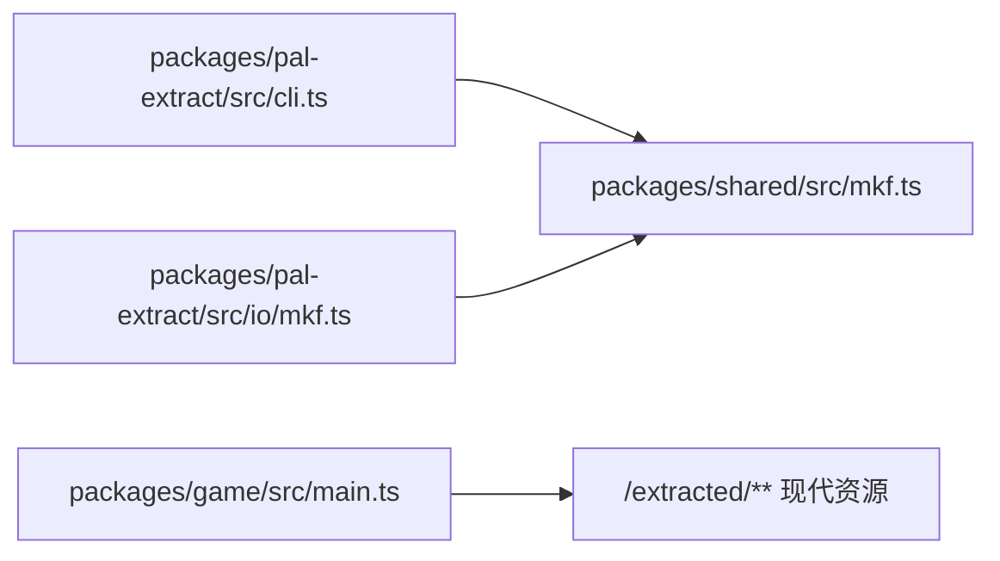

# 两阶段架构策略

<cite>
**本文引用的文件列表**
- [README.md](file://README.md)
- [02-architecture.md](file://docs/phase1/02-architecture.md)
- [04-decisions.md](file://docs/phase1/04-decisions.md)
- [cli.ts](file://packages/pal-extract/src/cli.ts)
- [mkf.ts（pal-extract 重导出）](file://packages/pal-extract/src/io/mkf.ts)
- [mkf.ts（shared 实现）](file://packages/shared/src/mkf.ts)
- [main.ts](file://packages/game/src/main.ts)
- [m1-pal-extract.md](file://docs/phase1/plans/2026-05-23-m1-pal-extract.md)
- [m2-runtime-slice.md](file://docs/phase1/plans/2026-05-23-m2-runtime-slice.md)
</cite>

## 目录
1. [引言](#引言)
2. [项目结构](#项目结构)
3. [核心组件](#核心组件)
4. [架构总览](#架构总览)
5. [详细组件分析](#详细组件分析)
6. [依赖关系分析](#依赖关系分析)
7. [性能与体积考量](#性能与体积考量)
8. [故障排查指南](#故障排查指南)
9. [结论](#结论)
10. [附录：迁移流程与版本管理](#附录：迁移流程与版本管理)

## 引言
本文件为 Type-Pal 的“两阶段架构策略”文档，聚焦以下目标：
- 解释离线转换阶段（pal-extract 工具）与运行时阶段（网页游戏）的分离设计理念。
- 说明 MKF 文件格式解析仅存在于提取工具中、运行时完全脱离二进制格式的决策原因。
- 阐述两类资源的区分：被动数据资源（图片、地图、音频等）与行为编排数据（事件脚本）。
- 定义两个阶段的交互接口、数据流转过程与扩展性考虑。
- 提供具体的迁移流程与版本管理策略。

## 项目结构
Type-Pal 采用 pnpm monorepo，第一阶段包含三个关键包：
- packages/pal-extract：Node CLI，负责从原版 MKF 等资源反汇编并生成现代格式产物。
- packages/game：浏览器运行时，加载 JSON/PNG/OGG/MP4 等现代资源，运行场景、事件、战斗、菜单等系统。
- packages/shared：双方共享类型与基础工具（如 MKF 归档 reader，供提取器与运行时复用）。

图表来源
- [02-architecture.md:1-26](file://docs/phase1/02-architecture.md#L1-L26)
- [README.md:110-131](file://README.md#L110-L131)

章节来源
- [README.md:110-131](file://README.md#L110-L131)
- [02-architecture.md:1-26](file://docs/phase1/02-architecture.md#L1-L26)

## 核心组件
- pal-extract CLI：统一入口，串联 MKF 解析、字节码反汇编、数据表转写、图集/瓦片/音效/视频输出，以及 events.json 切片与 round-trip 校验。
- shared/MKF：MKF 归档 reader，被提取器与运行时共同使用（例如 RNG 动画内层 sub-MKF）。
- game 运行时：通过 Vite 构建，按路径加载 data/extracted 下的现代资源；核心层纯逻辑，通过命令总线与表现层/外壳层解耦。

章节来源
- [cli.ts:1-80](file://packages/pal-extract/src/cli.ts#L1-L80)
- [mkf.ts（shared 实现）:1-44](file://packages/shared/src/mkf.ts#L1-L44)
- [02-architecture.md:56-104](file://docs/phase1/02-architecture.md#L56-L104)

## 架构总览
两阶段之间以“墙”隔离：
- 离线转换阶段只读 MKF，产出 JSON/PNG/OGG/MP4 等现代资源。
- 运行时完全不认识 MKF，只消费现代资源。

图表来源
- [02-architecture.md:1-26](file://docs/phase1/02-architecture.md#L1-L26)
- [cli.ts:172-280](file://packages/pal-extract/src/cli.ts#L172-L280)
- [main.ts:1-78](file://packages/game/src/main.ts#L1-L78)

## 详细组件分析

### 离线转换阶段（pal-extract）
- 职责
  - 解析 MKF 归档与子块（YJ2 解压），抽取 MAP/GOP/FBP/F.MKF/ABC.MKF/RNG.RGM/BALL/SOUNDS 等。
  - 反汇编 SSS.MKF 中的事件字节码，生成结构化 events.json，并按场景切分。
  - 将数据表（物品/法术/怪物/商店/玩家角色等）转为 JSON。
  - 输出图集 PNG、调色板 JSON、音乐 MIDI/CD 音轨、视频 mp4/webm。
  - 对事件字节码做 round-trip 验证（反编译回字节码逐字节比对）。
- 关键流程
  - 读取 SSS.MKF → disasm → recompile 校验 → annotate → sliceByScene → 写出 events/*.json。
  - 遍历所有场景 mapNum，去重后输出 tileset RLE blob + tilemap JSON。
  - 全量 dump 角色/NPC/战斗精灵，优化为 gzip RLE blob，减少磁盘 IO 与网络传输。
  - 输出 DATA.MKF 各 chunk 的数据表与 UI/魔法特效帧清单。
- 设计要点
  - MKF 解析只在提取阶段；运行时不依赖任何 MKF 代码。
  - 事件模型富且结构化优先，但忠实转写保持 1:1 可逆，便于回归验证。
  - 资源管线持续优化：RLE blob + gzip，避免浏览器 Content-Encoding 双解压问题。

章节来源
- [cli.ts:172-280](file://packages/pal-extract/src/cli.ts#L172-L280)
- [cli.ts:593-700](file://packages/pal-extract/src/cli.ts#L593-L700)
- [cli.ts:701-740](file://packages/pal-extract/src/cli.ts#L701-L740)
- [cli.ts:742-789](file://packages/pal-extract/src/cli.ts#L742-L789)
- [m1-pal-extract.md:162-284](file://docs/phase1/plans/2026-05-23-m1-pal-extract.md#L162-L284)

#### 事件系统（运行时）
- 职责
  - 作为“总导演”，驱动对话、选择、跳转、等待（对话框/动画/视频/转场）等。
  - 维护协程式步进器：遇到可等待命令挂起，每 tick 检查回执继续。
- 关键机制
  - label/goto 支持跨片段跳转；raw 指令默认 no-op skip + 日志，避免阻塞流程。
  - 单 tick 指令上限保护，防止死循环。
- 与核心层的耦合
  - 通过命令总线发出 show/hide 对话框、进入战斗等高层命令，表现层消费。

图表来源
- [m2-runtime-slice.md:1576-1696](file://docs/phase1/plans/2026-05-23-m2-runtime-slice.md#L1576-L1696)

章节来源
- [02-architecture.md:81-116](file://docs/phase1/02-architecture.md#L81-L116)
- [m2-runtime-slice.md:1576-1696](file://docs/phase1/plans/2026-05-23-m2-runtime-slice.md#L1576-L1696)

### 运行时阶段（网页游戏）
- 启动与预缓存
  - main.ts 在浏览器初始化时安装 fetch 重试、注册 Service Worker（生产环境）、两段进度 UI 与“可玩门”。
  - 必要资源就绪后触发 onPlayable，显示“进入游戏”按钮并启动 SW 全量预缓存。
- 资源加载
  - 运行时通过 fetch 直接读取 /extracted/** 的现代资源（JSON/PNG/OGG/MP4），不接触 MKF。
- 分层架构
  - 外壳层：主循环、输入映射、存档（IndexedDB）、音频/视频、预缓存。
  - 表现层：Canvas 2D 渲染、消息框/菜单/战斗 UI、转场效果。
  - 核心层：纯逻辑（GameState + 事件/场景/战斗/规则），通过命令总线与上层通信。
  - 资源加载层：fetch JSON/PNG/OGG/MP4，不含 MKF。

图表来源
- [02-architecture.md:56-104](file://docs/phase1/02-architecture.md#L56-L104)
- [main.ts:1-78](file://packages/game/src/main.ts#L1-L78)

章节来源
- [02-architecture.md:56-116](file://docs/phase1/02-architecture.md#L56-L116)
- [main.ts:1-78](file://packages/game/src/main.ts#L1-L78)

## 依赖关系分析
- pal-extract 依赖 shared/mkf.ts（通过 re-export 保持内部 import 路径不变），用于解析 MKF 归档。
- 运行时不依赖 MKF 解析，只消费 data/extracted 产物。
- 运行时通过 Vite 静态资源服务访问 /extracted/**。

图表来源
- [mkf.ts（pal-extract 重导出）:1-7](file://packages/pal-extract/src/io/mkf.ts#L1-L7)
- [mkf.ts（shared 实现）:1-44](file://packages/shared/src/mkf.ts#L1-L44)
- [main.ts:1-78](file://packages/game/src/main.ts#L1-L78)

章节来源
- [mkf.ts（pal-extract 重导出）:1-7](file://packages/pal-extract/src/io/mkf.ts#L1-L7)
- [mkf.ts（shared 实现）:1-44](file://packages/shared/src/mkf.ts#L1-L44)
- [main.ts:1-78](file://packages/game/src/main.ts#L1-L78)

## 性能与体积考量
- 资源管线优化
  - tileset/npc/battle sprite 改为 gzip 压缩的 RLE blob（后缀 .rle），避免浏览器 Content-Encoding 双解压。
  - RNG 动画、魔法特效、FIRE 特效等均以 RLE blob 存储，manifest 保留帧信息供运行时解码。
- 运行时加载
  - 按需 lazy 加载场景资源，避免一次性加载多 MB 资源。
  - 使用 IndexedDB 持久化存档，meta 字段轻量展示预览。
- 主循环与帧率
  - 固定步长：探索/菜单/事件 10fps，战斗 25fps；逻辑与渲染同帧，不插值。

章节来源
- [cli.ts:92-140](file://packages/pal-extract/src/cli.ts#L92-L140)
- [cli.ts:396-511](file://packages/pal-extract/src/cli.ts#L396-L511)
- [02-architecture.md:106-116](file://docs/phase1/02-architecture.md#L106-L116)

## 故障排查指南
- 提取阶段
  - round-trip 失败：事件反汇编/反编译不一致，需检查 opcode 具名与 raw 兜底策略。
  - YJ2 解压异常：部分 chunk 可能未压缩或损坏，提取器已做 try/catch 防御。
- 运行时
  - 资源 404：检查 data/extracted 路径是否与运行时 fetch 路径一致（注意子目录重构）。
  - 事件 raw 跳过：控制台 debug 输出会记录 opcode 号，逐步具名补齐。
  - 预缓存不可用：非生产环境或浏览器不支持 SW 时自动放行，不影响游玩。

章节来源
- [cli.ts:253-259](file://packages/pal-extract/src/cli.ts#L253-L259)
- [m2-runtime-slice.md:1576-1696](file://docs/phase1/plans/2026-05-23-m2-runtime-slice.md#L1576-L1696)
- [main.ts:30-75](file://packages/game/src/main.ts#L30-L75)

## 结论
- 两阶段分离使“忠实还原”与“可扩展性”并行不悖：提取阶段专注格式保真与 round-trip 验证，运行时专注现代资源消费与模块化核心。
- MKF 解析仅存在于提取工具，运行时彻底脱离二进制格式，降低运行时复杂度与风险。
- 资源与事件的清晰划分，使得内容扩展只需新增 JSON/PNG/OGG/MP4，无需改动引擎。
- 通过命令总线、协程式事件步进器与可等待命令，实现了高内聚低耦合的可测试核心层。

## 附录：迁移流程与版本管理

### 迁移流程（从旧资源布局到新布局）
- 背景
  - 资源目录从扁平结构迁移到按类型分层的子目录（如 data/tilemap/{id}.json、images/world/tileset/map-{N}/tile-{XXXX}.png 等）。
- 步骤
  - 更新运行时资源路径引用（tilemap、palette、scene、events、sprite、battle-sprite、battle bg 等）。
  - 确保 pal-extract 产物的目录结构与运行时 fetch 路径一致。
  - 本地验证：pnpm check + e2e 截图对比。

章节来源
- [m4-pal-extract-complete.md:363-485](file://docs/phase1/plans/2026-05-24-m4-pal-extract-complete.md#L363-L485)

### 版本管理与发布策略
- 版本号
  - 根 README 明确当前上线版本 v1.0.0，状态表与审计记录作为完成度依据。
- 分支与提交
  - 以里程碑为单位推进（M1–M5+），每个里程碑有独立完成定义与验收标准。
- 门禁与测试
  - 本地门禁：pnpm check（类型检查 + Vitest 测试）。
  - 端到端：Playwright L2 用例覆盖视觉与交互；L3 完整流程推至后期里程碑。
- 数据与产物
  - data/raw 不入仓库；data/extracted 为可再生产物，由 pnpm extract 重建。
  - 基线素材（sdlpal baseline）本机生成，不入库。

章节来源
- [README.md:15-28](file://README.md#L15-L28)
- [README.md:80-97](file://README.md#L80-L97)
- [04-decisions.md:21-41](file://docs/phase1/04-decisions.md#L21-L41)