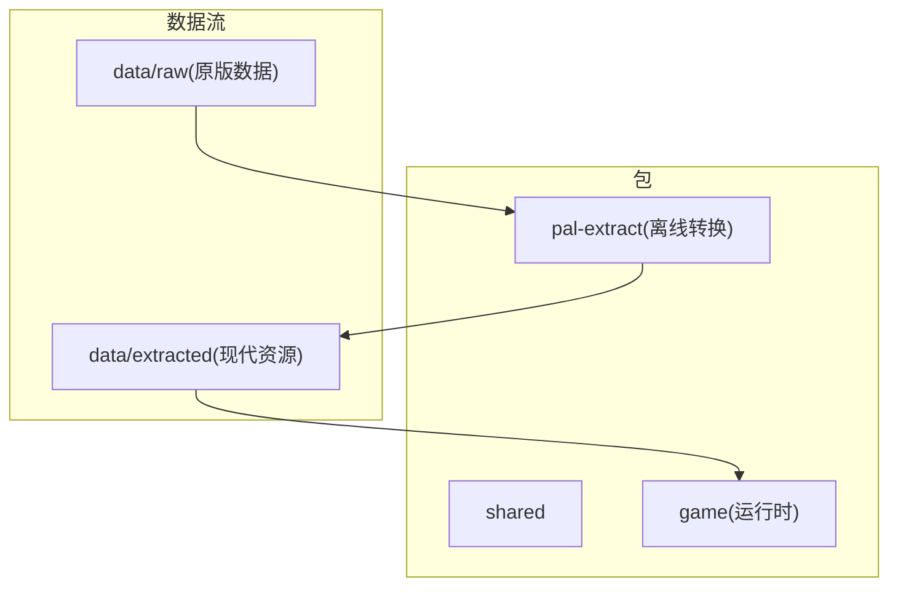
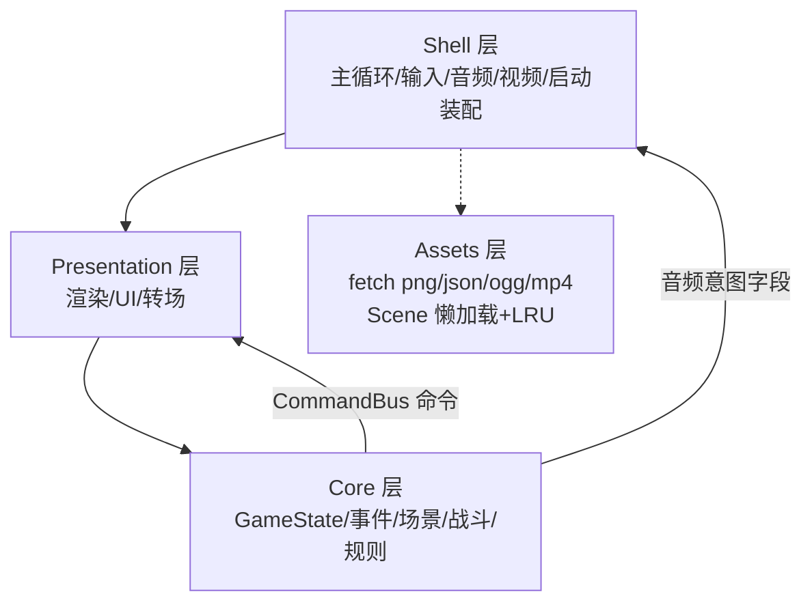
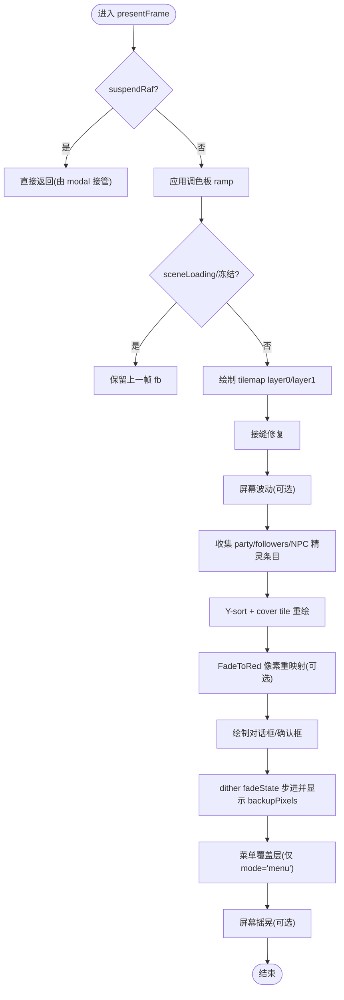
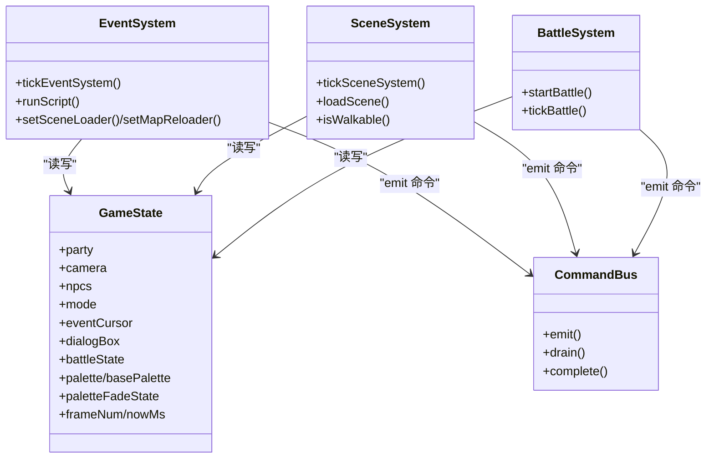
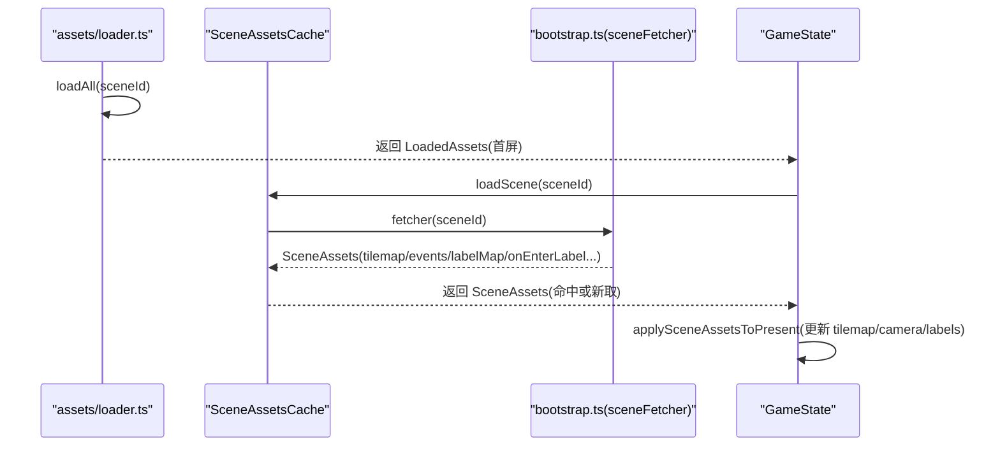
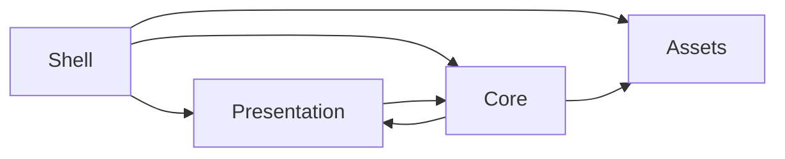

# 分层架构详解

<cite>
**本文引用的文件**   
- [README.md](file://README.md)
- [02-architecture.md](file://docs/phase1/02-architecture.md)
- [bootstrap.ts](file://packages/game/src/shell/bootstrap.ts)
- [main-loop.ts](file://packages/game/src/shell/main-loop.ts)
- [audio.ts](file://packages/game/src/shell/audio.ts)
- [loader.ts](file://packages/game/src/assets/loader.ts)
- [present.ts](file://packages/game/src/present/present.ts)
- [command-bus.ts](file://packages/game/src/core/command-bus.ts)
- [event-system.ts](file://packages/game/src/core/event-system.ts)
- [scene-system.ts](file://packages/game/src/core/scene-system.ts)
- [battle-system.ts](file://packages/game/src/core/battle/battle-system.ts)
- [game-state.ts](file://packages/game/src/core/game-state.ts)
</cite>

## 目录
1. [引言](#引言)
2. [项目结构](#项目结构)
3. [核心组件](#核心组件)
4. [架构总览](#架构总览)
5. [详细组件分析](#详细组件分析)
6. [依赖关系分析](#依赖关系分析)
7. [性能考量](#性能考量)
8. [故障排查指南](#故障排查指南)
9. [结论](#结论)
10. [附录](#附录)

## 引言
Type-Pal 采用“离线转换 + 运行时”的两阶段设计：资源提取工具将原版 MKF 转换为现代网页资源（PNG/JSON/WAV/OGG/MP4），运行时只消费这些现代资源。运行时内部按四层组织：Shell 层、Presentation 层、Core 层、Assets 层，通过命令总线进行解耦通信。该分层使核心逻辑可独立测试、表现与平台细节隔离、资源加载路径清晰，便于后续扩展与重制。

## 项目结构
仓库为 pnpm workspace 多包工程，第一阶段包含三个关键包：
- shared：共享类型与数据结构
- pal-extract：离线资源提取 CLI
- game：浏览器运行时（场景、战斗、事件 VM、菜单、存档、音频、演出、Canvas 渲染、工具面板与离线预缓存）



图表来源
- [README.md:110-131](file://README.md#L110-L131)
- [02-architecture.md:1-25](file://docs/phase1/02-architecture.md#L1-L25)

章节来源
- [README.md:110-131](file://README.md#L110-L131)
- [02-architecture.md:1-25](file://docs/phase1/02-architecture.md#L1-L25)

## 核心组件
- Shell 层：主循环、输入处理、音频播放、视频过场、资源加载协调、IndexedDB 存档桥接
- Presentation 层：320×200 帧缓冲 → Canvas 缩放、精灵/地图/文字/转场、对话框/菜单/战斗 UI
- Core 层：纯逻辑 GameState、事件系统、场景系统、战斗系统、规则系统；通过命令总线向 Present/Shell 发指令
- Assets 层：fetch png/json/ogg/mp4，含 Scene 资源懒加载与 LRU 缓存

章节来源
- [02-architecture.md:56-137](file://docs/phase1/02-architecture.md#L56-L137)

## 架构总览
运行时四层职责边界与通信机制如下：
- 依赖方向：Shell → Present → Core ← Assets
- 通信方式：Core 通过 CommandBus 发出“可等待命令”，Present 在每帧 drain 并消费；Shell 负责音频意图同步与 modal 期间暂停渲染但继续驱动音频



图表来源
- [02-architecture.md:56-73](file://docs/phase1/02-architecture.md#L56-L73)
- [command-bus.ts:1-89](file://packages/game/src/core/command-bus.ts#L1-L89)
- [loader.ts:1-120](file://packages/game/src/assets/loader.ts#L1-L120)

## 详细组件分析

### Shell 层（主循环、输入、音频、资源加载）
- 主循环：基于 requestAnimationFrame，固定步长推进逻辑 tick，并按 fade/动画门控 present
- 输入：键盘事件映射抽象按键，每 tick 提供快照给当前模式
- 音频：Web Audio 管理，SFX 队列与 BGM track 轮询切换；autoplay 策略在用户手势后 resume
- 启动装配：并行加载 glyphs、dialog assets、首屏 scene 资源；注入全局词表、菜单目录、调色板源等
- Modal 播放：RNG/FBP/结局动画等 suspendRaf 期间独占 canvas，shell 仍同步音频与预缓存让路

```mermaid
sequenceDiagram
participant Boot as "bootstrap.ts"
participant Loop as "main-loop.ts"
participant Audio as "audio.ts"
participant Loader as "assets/loader.ts"
participant Present as "present.ts"
participant Core as "core/*"
Boot->>Loader : loadAll(sceneId)+loadGlyphs()+loadDialogAssets()
Boot->>Boot : 注入全局词表/菜单目录/调色板源/事件回调
Boot->>Loop : startRafLoop(onPresent=drain+present)
Loop->>Core : tickByMode(input, bus)
Core-->>Audio : 更新 gs.pendingSounds/wNumMusic/musicLoop
Loop->>Audio : syncShellAudio(gs, drained)
alt 非 modal
Loop->>Present : presentFrame / presentBattleFrame
Present-->>Loop : flushToCanvas(fb, palette)
else modal(suspendRaf)
Note over Loop,Present : 仅音频同步，不画 canvas
end
```

图表来源
- [bootstrap.ts:215-508](file://packages/game/src/shell/bootstrap.ts#L215-L508)
- [main-loop.ts:59-137](file://packages/game/src/shell/main-loop.ts#L59-L137)
- [audio.ts:192-270](file://packages/game/src/shell/audio.ts#L192-L270)
- [loader.ts:135-220](file://packages/game/src/assets/loader.ts#L135-L220)
- [present.ts:166-206](file://packages/game/src/present/present.ts#L166-L206)

章节来源
- [bootstrap.ts:215-508](file://packages/game/src/shell/bootstrap.ts#L215-L508)
- [main-loop.ts:59-137](file://packages/game/src/shell/main-loop.ts#L59-L137)
- [audio.ts:192-270](file://packages/game/src/shell/audio.ts#L192-L270)

### Presentation 层（渲染、UI、转场）
- 帧缓冲：320×200 索引位图，逐帧绘制 tilemap 两层、Y-sort 精灵、cover tile、对话/菜单覆盖层
- 特效：调色板 ramp、dither 淡入淡出、屏幕波动/摇晃、战斗内数字弹幕与动画时间线
- 菜单与对话框：复用大世界 dialog-box 状态机，支持标题/正文/颜色控制符/头像缩进布局
- 战斗渲染：委托 BattlePresent.draw，消费 bus 命令生成浮动数值与特效



图表来源
- [present.ts:166-686](file://packages/game/src/present/present.ts#L166-L686)

章节来源
- [present.ts:166-686](file://packages/game/src/present/present.ts#L166-L686)

### Core 层（纯逻辑游戏状态、事件系统、场景系统、战斗系统、规则系统）
- GameState：单一真相源，队伍/角色/背包/金钱/事件对象状态/当前场景与坐标/游戏进度，可序列化
- 事件系统：协程式步进器，解析 opcode，管理 waiting 状态（对话/淡入淡出/切场景/延时/商店/播放 RNG/FBP/结尾动画等）
- 场景系统：探索模式 tick，碰撞/触发区检测、自动脚本、相机跟随、Confirm Search、切事件模式
- 战斗系统：回合制 phase 状态机（preBattle→selectAction→performAction→postAction→结算），AI/公式/奖励严格对齐 sdlpal
- 规则系统：角色属性/升级/物品/法术/装备/商店等（由数据驱动）



图表来源
- [game-state.ts:655-800](file://packages/game/src/core/game-state.ts#L655-L800)
- [event-system.ts:1-200](file://packages/game/src/core/event-system.ts#L1-L200)
- [scene-system.ts:1-120](file://packages/game/src/core/scene-system.ts#L1-L120)
- [battle-system.ts:1-120](file://packages/game/src/core/battle/battle-system.ts#L1-L120)
- [command-bus.ts:1-89](file://packages/game/src/core/command-bus.ts#L1-L89)

章节来源
- [game-state.ts:655-800](file://packages/game/src/core/game-state.ts#L655-L800)
- [event-system.ts:1-200](file://packages/game/src/core/event-system.ts#L1-L200)
- [scene-system.ts:1-120](file://packages/game/src/core/scene-system.ts#L1-L120)
- [battle-system.ts:1-120](file://packages/game/src/core/battle/battle-system.ts#L1-L120)
- [command-bus.ts:1-89](file://packages/game/src/core/command-bus.ts#L1-L89)

### Assets 层（现代资源格式加载）
- 首屏资源：并行 fetch JSON/PNG/RLE 图集、UI sprite、物品图标、等级经验表等
- 战斗资源：manifest 驱动的 battle sprites/bgs、魔法特效 overlay、命中特效
- 场景懒加载：SceneAssetsCache 维护最近 N 个 scene 的 tilemap/tile images/npc sprites，LRU 淘汰联动清理 tileImagesBySceneId
- 调色板动态加载：运行时 setPalette 通过 fetchPalette 获取新调色板



图表来源
- [loader.ts:135-390](file://packages/game/src/assets/loader.ts#L135-L390)
- [loader.ts:451-500](file://packages/game/src/assets/loader.ts#L451-L500)
- [bootstrap.ts:556-628](file://packages/game/src/shell/bootstrap.ts#L556-L628)

章节来源
- [loader.ts:135-390](file://packages/game/src/assets/loader.ts#L135-L390)
- [loader.ts:451-500](file://packages/game/src/assets/loader.ts#L451-L500)
- [bootstrap.ts:556-628](file://packages/game/src/shell/bootstrap.ts#L556-L628)

## 依赖关系分析
- 单向依赖：Shell 依赖 Present/Core/Assets；Present 依赖 Core 的状态与命令；Core 不依赖 Present/Shell；Assets 被 Shell/Bootstrap 调用
- 命令总线：Core → Present 的单向通道，避免反向耦合
- 场景切换：event-system 通过注入的 setSceneLoader 回调触发 bootstrap 中的异步加载与上下文同步



图表来源
- [02-architecture.md:56-73](file://docs/phase1/02-architecture.md#L56-L73)
- [command-bus.ts:1-89](file://packages/game/src/core/command-bus.ts#L1-L89)
- [event-system.ts:685-704](file://packages/game/src/core/event-system.ts#L685-L704)

章节来源
- [02-architecture.md:56-73](file://docs/phase1/02-architecture.md#L56-L73)
- [command-bus.ts:1-89](file://packages/game/src/core/command-bus.ts#L1-L89)
- [event-system.ts:685-704](file://packages/game/src/core/event-system.ts#L685-L704)

## 性能考量
- 固定步长与门控：逻辑 tick 间隔按模式区分（探索 10fps、战斗 25fps），无 tick 且无 fade/动画时跳过 present，减少重绘
- 战斗动画细分：battleAnim 期间每 rAF present 以 wall-clock 细分动画帧，避免拍频抖动
- 资源懒加载与 LRU：SceneAssetsCache 限制常驻场景数，淘汰时联动释放 tile bitmap，保护当前场景不被淘汰
- 音频去重与延迟补播：SFX 同号去重，首次未缓存则加载完即补播，避免首响丢失
- 字体与 UI 资源并行：glyphs/dialog-assets 与首屏资源并行加载，失败降级不影响运行

章节来源
- [main-loop.ts:59-137](file://packages/game/src/shell/main-loop.ts#L59-L137)
- [loader.ts:451-500](file://packages/game/src/assets/loader.ts#L451-L500)
- [audio.ts:254-270](file://packages/game/src/shell/audio.ts#L254-L270)

## 故障排查指南
- 黑屏/花屏：检查 sceneLoading 冻屏逻辑与 fadeState 备份像素是否正确；确认 applySceneAssetsToPresent 已同步 tilemap/labels
- 对话卡死：核对 dialogBox 的 pendingStyle/pendingPreOpClear/pendingPartialClear 分支是否幂等；确认 auto pre-op ClearDialog 时机
- 音频无声：确认 autoplay 解锁（keydown/pointerdown 持续监听 resume）；检查 musicBackend 初始化与 soundfont 下载
- 场景切换异常：验证 setSceneContext 是否更新 eventCommands/labelMap；检查 SceneAssetsCache 的 onEvict 是否清理 tileImagesBySceneId
- 战斗卡顿：检查 phaseStallTicks 兜底阈值；确认 battleAnim 与 battleDialogQueue 的顺序守卫

章节来源
- [present.ts:247-260](file://packages/game/src/present/present.ts#L247-L260)
- [event-system.ts:511-533](file://packages/game/src/core/event-system.ts#L511-L533)
- [bootstrap.ts:467-470](file://packages/game/src/shell/bootstrap.ts#L467-L470)
- [loader.ts:481-498](file://packages/game/src/assets/loader.ts#L481-L498)
- [battle-system.ts:472-514](file://packages/game/src/core/battle/battle-system.ts#L472-L514)

## 结论
Type-Pal 的分层架构通过清晰的职责边界与命令总线解耦，实现了核心逻辑的可测试性与表现层的灵活性。Assets 层的懒加载与 LRU 保障大场景下的内存与带宽效率，Shell 层的主循环与音频/视频协同确保体验一致。该设计既满足第一阶段的忠实还原目标，也为第二阶段的 Reforge 重制提供了可扩展的基础。

## 附录
- 完整游戏流程示例（从启动到进入战斗）
  - 启动装配：bootstrap 并行加载资源，注入全局词表/菜单目录/调色板源，设置初始 GameState
  - 主循环：advanceRafFrame 累积 dt，按间隔执行 tickByMode，Present 根据 fade/动画门控刷新
  - 事件触发：场景系统检测到 NPC 触发区 → 载入事件脚本 → 事件系统执行 → 可能发起战斗
  - 战斗流程：startBattle 构建 BattleState → selectAction 选择行动 → performAction 执行动作与动画 → 结算 → 回到探索
  - 资源切换：loadScene 通过 SceneAssetsCache 懒加载新场景资源，applySceneAssetsToPresent 同步 Present 上下文

章节来源
- [bootstrap.ts:215-508](file://packages/game/src/shell/bootstrap.ts#L215-L508)
- [main-loop.ts:59-137](file://packages/game/src/shell/main-loop.ts#L59-L137)
- [scene-system.ts:187-267](file://packages/game/src/core/scene-system.ts#L187-L267)
- [event-system.ts:685-704](file://packages/game/src/core/event-system.ts#L685-L704)
- [battle-system.ts:277-419](file://packages/game/src/core/battle/battle-system.ts#L277-L419)
- [loader.ts:451-500](file://packages/game/src/assets/loader.ts#L451-L500)