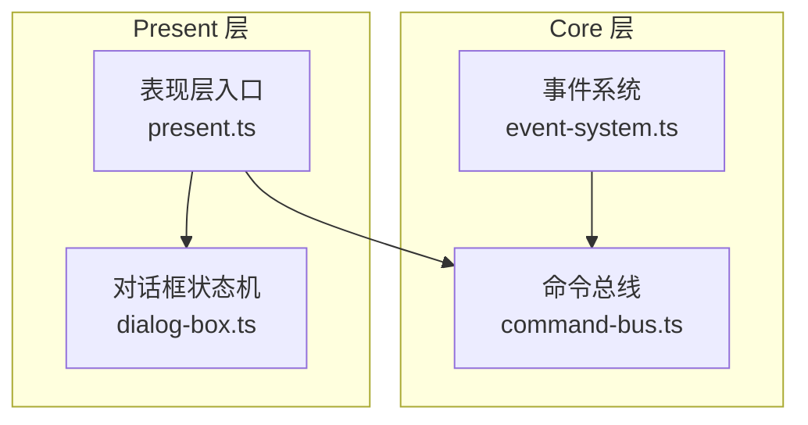
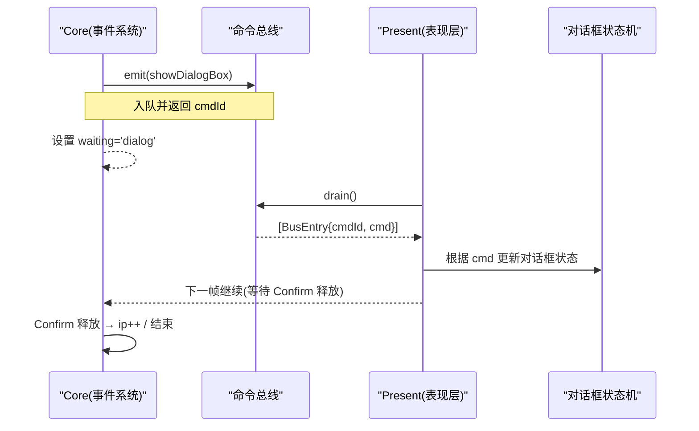
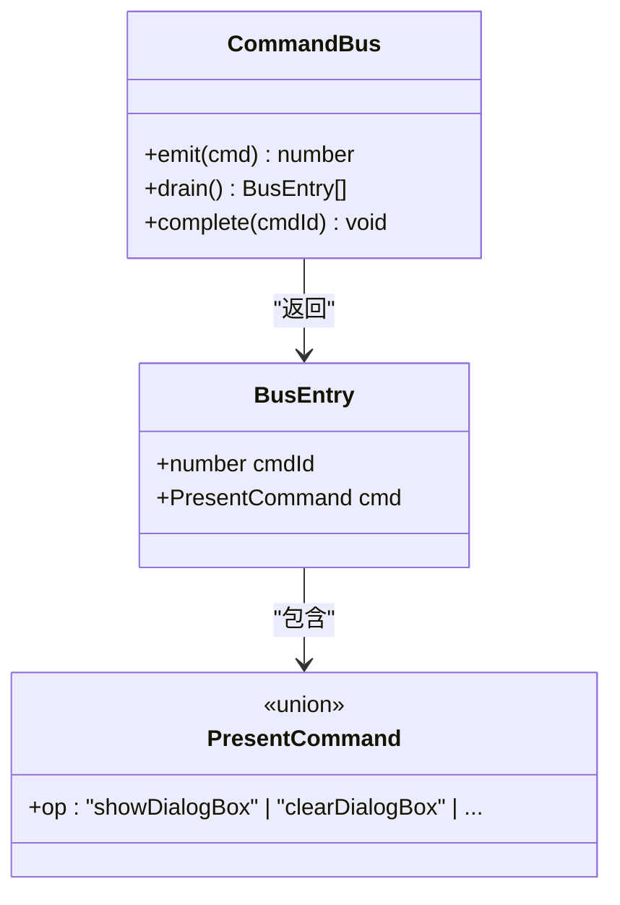
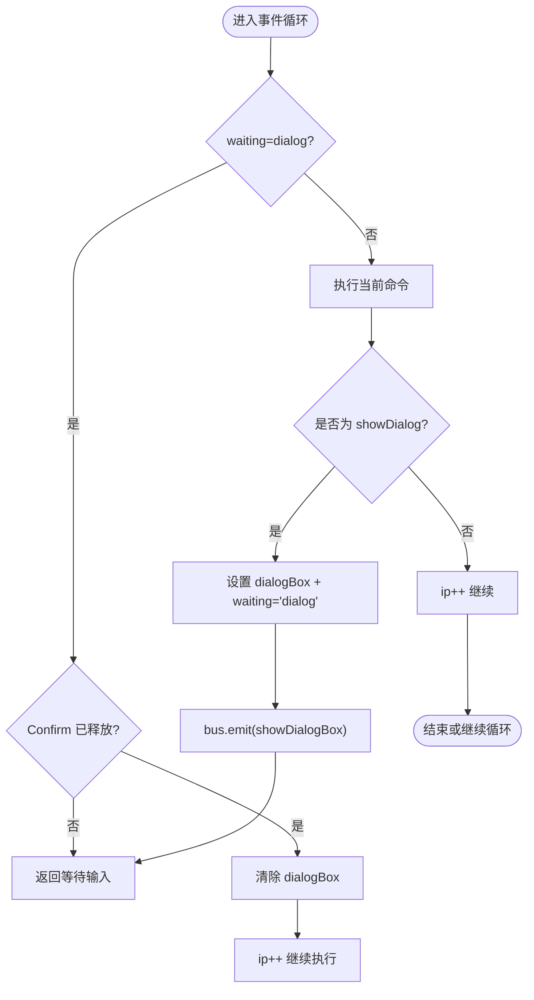
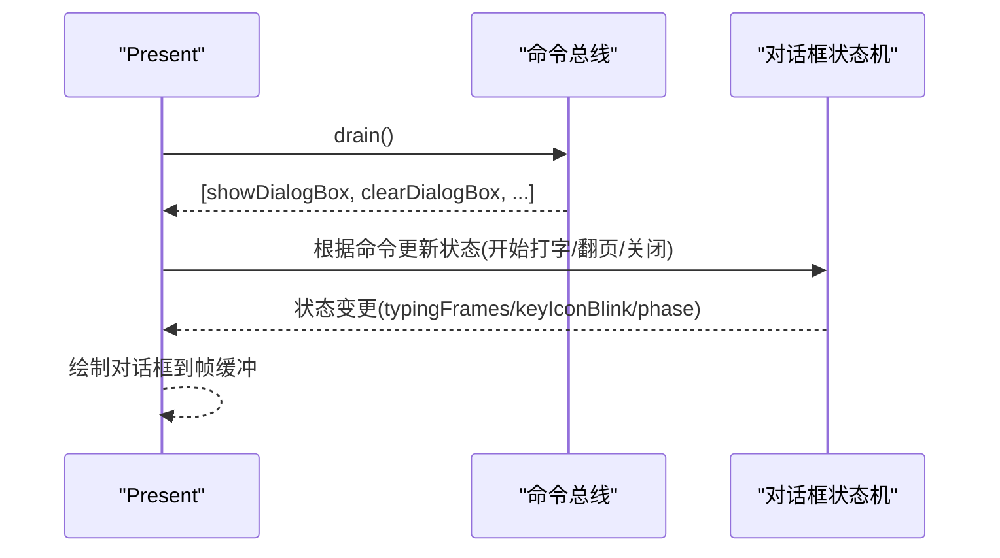
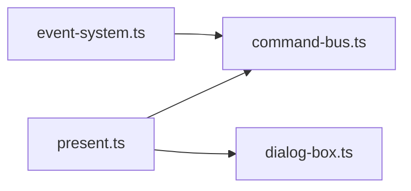

# 命令总线 (Command Bus)

<cite>
**本文引用的文件**   
- [packages/game/src/core/command-bus.ts](file://packages/game/src/core/command-bus.ts)
- [packages/game/src/core/command-bus.test.ts](file://packages/game/src/core/command-bus.test.ts)
- [packages/game/src/core/event-system.ts](file://packages/game/src/core/event-system.ts)
- [packages/game/src/present/dialog-box.ts](file://packages/game/src/present/dialog-box.ts)
- [packages/game/src/present/present.ts](file://packages/game/src/present/present.ts)
- [docs/phase1/plans/2026-05-23-m2-runtime-slice.md](file://docs/phase1/plans/2026-05-23-m2-runtime-slice.md)
</cite>

## 目录
1. [简介](#简介)
2. [项目结构](#项目结构)
3. [核心组件](#核心组件)
4. [架构总览](#架构总览)
5. [详细组件分析](#详细组件分析)
6. [依赖关系分析](#依赖关系分析)
7. [性能考量](#性能考量)
8. [故障排查指南](#故障排查指南)
9. [结论](#结论)
10. [附录](#附录)

## 简介
本文件为 Type-Pal 的命令总线系统提供系统化文档，聚焦于 Core → Present 的单向命令通道。该通道采用“同步队列 + 帧末批量消费”的模式：Core 层在 tick 内通过 bus.emit 发出表现意图（PresentCommand），tick 末由 Present 层统一 drain 并执行；同时预留 complete(cmdId) 接口以支持 M3 阶段的异步回执（如转场、视频等）。

设计目标：
- 明确分层边界：Core 不直接操作渲染或音频 API，仅表达“意图”。
- 松耦合：Core 与 Present 之间通过稳定的命令类型契约通信。
- 可观测与可测试：emit/drain 顺序稳定、cmdId 唯一、complete 幂等无副作用。
- 可扩展：新增命令只需扩展联合类型并在 Present 层实现处理逻辑。

## 项目结构
命令总线位于 core 层，作为 Core 与 Present 之间的桥梁。事件脚本在执行过程中会调用 bus.emit 将对话、战斗 UI、音效等意图入队；Present 层每帧末尾从 bus.drain 拉取并应用。

图表来源
- [packages/game/src/core/event-system.ts:1-200](file://packages/game/src/core/event-system.ts#L1-L200)
- [packages/game/src/core/command-bus.ts:69-88](file://packages/game/src/core/command-bus.ts#L69-L88)
- [packages/game/src/present/present.ts:166-200](file://packages/game/src/present/present.ts#L166-L200)
- [packages/game/src/present/dialog-box.ts:391-429](file://packages/game/src/present/dialog-box.ts#L391-L429)

章节来源
- [packages/game/src/core/command-bus.ts:1-88](file://packages/game/src/core/command-bus.ts#L1-L88)
- [packages/game/src/core/event-system.ts:1-200](file://packages/game/src/core/event-system.ts#L1-L200)
- [packages/game/src/present/present.ts:166-200](file://packages/game/src/present/present.ts#L166-L200)
- [packages/game/src/present/dialog-box.ts:391-429](file://packages/game/src/present/dialog-box.ts#L391-L429)

## 核心组件
- 命令类型定义：PresentCommand 是 Core → Present 的联合类型，包含对话、战斗 UI、音效等意图。
- 总线接口：CommandBus 暴露 emit/drain/complete 三个方法，M2 阶段 complete 为 no-op。
- 队列条目：BusEntry 携带 cmdId 与具体命令，用于追踪与未来异步回执。

关键要点
- emit 返回递增且唯一的 cmdId，便于调试与后续异步完成回调。
- drain 返回当前批次命令并清空内部队列，保证“一帧一批”的确定性。
- complete 在当前版本为空实现，但保持接口稳定，为 M3 异步资源（转场/视频）预留。

章节来源
- [packages/game/src/core/command-bus.ts:9-67](file://packages/game/src/core/command-bus.ts#L9-L67)
- [packages/game/src/core/command-bus.ts:69-88](file://packages/game/src/core/command-bus.ts#L69-L88)

## 架构总览
命令生命周期（M2 同步语义）：
- Core 层在 tick 中产生业务结果，通过 bus.emit 写入队列。
- 同一 tick 内可能多次 emit，形成有序队列。
- tick 末，Present 层调用 bus.drain 获取整批命令并逐一应用。
- 若命令需要等待（例如对话翻页），Core 侧通过 waiting 标志控制步进；M2 不需要跨层回执。
- M3 引入 complete(cmdId) 后，Present 可在异步资源完成后回调，Core 据此推进流程。

图表来源
- [packages/game/src/core/event-system.ts:1597-1696](file://packages/game/src/core/event-system.ts#L1597-L1696)
- [packages/game/src/core/command-bus.ts:69-88](file://packages/game/src/core/command-bus.ts#L69-L88)
- [packages/game/src/present/dialog-box.ts:391-429](file://packages/game/src/present/dialog-box.ts#L391-L429)

## 详细组件分析

### 命令类型与总线接口
- PresentCommand 联合类型覆盖对话、战斗消息、伤害数字、闪烁、攻击动画、魔法动画、死亡、UI 切换、音效与音乐播放/停止等。
- CommandBus 接口：
  - emit(cmd): number —— 入队并返回 cmdId
  - drain(): BusEntry[] —— 拉取并清空队列
  - complete(cmdId): void —— 异步完成回调（M2 空实现）

图表来源
- [packages/game/src/core/command-bus.ts:58-67](file://packages/game/src/core/command-bus.ts#L58-L67)
- [packages/game/src/core/command-bus.ts:69-88](file://packages/game/src/core/command-bus.ts#L69-L88)

章节来源
- [packages/game/src/core/command-bus.ts:9-67](file://packages/game/src/core/command-bus.ts#L9-L67)
- [packages/game/src/core/command-bus.ts:69-88](file://packages/game/src/core/command-bus.ts#L69-L88)

### 事件系统与命令发射
事件系统在遇到 showDialog 时：
- 设置 gs.dialogBox 与 waiting='dialog'
- 通过 bus.emit 发送 showDialogBox 命令
- 当 Confirm 释放时，清除 dialogBox 并继续步进

图表来源
- [packages/game/src/core/event-system.ts:1597-1696](file://packages/game/src/core/event-system.ts#L1597-L1696)

章节来源
- [packages/game/src/core/event-system.ts:1597-1696](file://packages/game/src/core/event-system.ts#L1597-L1696)

### 表现层消费与对话框状态机
- Present 层每帧末尾调用 bus.drain 获取命令并应用。
- 对话框状态机负责 typing、确认翻页、自动消失等细节；setWaitingPageKey 等方法用于进入等待状态。

图表来源
- [packages/game/src/present/present.ts:166-200](file://packages/game/src/present/present.ts#L166-L200)
- [packages/game/src/present/dialog-box.ts:391-429](file://packages/game/src/present/dialog-box.ts#L391-L429)

章节来源
- [packages/game/src/present/present.ts:166-200](file://packages/game/src/present/present.ts#L166-L200)
- [packages/game/src/present/dialog-box.ts:391-429](file://packages/game/src/present/dialog-box.ts#L391-L429)

### 异步命令与可等待机制（M3 规划）
- 当前 complete(cmdId) 为空实现，不抛错，确保向前兼容。
- M3 计划：将异步资源（转场、视频）与 cmdId 关联，Present 在完成时调用 complete(cmdId)，Core 据此推进流程。
- 建议：对需要等待的命令，emit 时记录 cmdId，Present 在资源结束后调用 complete；Core 维护待完成集合，收到 complete 后解除等待并继续。

章节来源
- [packages/game/src/core/command-bus.ts:84-86](file://packages/game/src/core/command-bus.ts#L84-L86)
- [docs/phase1/plans/2026-05-23-m2-runtime-slice.md:62](file://docs/phase1/plans/2026-05-23-m2-runtime-slice.md#L62)

## 依赖关系分析
- event-system.ts 依赖 command-bus.ts 的 CommandBus 接口，用于 emit 表现意图。
- present.ts 依赖 command-bus.ts 的 BusEntry 类型，用于接收并消费命令。
- dialog-box.ts 提供对话框状态机，被 present.ts 使用以响应 showDialogBox/clearDialogBox 等命令。

图表来源
- [packages/game/src/core/event-system.ts:1-200](file://packages/game/src/core/event-system.ts#L1-L200)
- [packages/game/src/core/command-bus.ts:1-88](file://packages/game/src/core/command-bus.ts#L1-L88)
- [packages/game/src/present/present.ts:1-200](file://packages/game/src/present/present.ts#L1-L200)
- [packages/game/src/present/dialog-box.ts:391-429](file://packages/game/src/present/dialog-box.ts#L391-L429)

章节来源
- [packages/game/src/core/event-system.ts:1-200](file://packages/game/src/core/event-system.ts#L1-L200)
- [packages/game/src/core/command-bus.ts:1-88](file://packages/game/src/core/command-bus.ts#L1-L88)
- [packages/game/src/present/present.ts:1-200](file://packages/game/src/present/present.ts#L1-L200)
- [packages/game/src/present/dialog-box.ts:391-429](file://packages/game/src/present/dialog-box.ts#L391-L429)

## 性能考量
- 队列操作 O(1) 入队，O(n) 出队（n 为单帧命令数），整体线性复杂度，满足游戏帧率要求。
- drain 每次返回新引用并清空内部数组，避免重复消费与内存泄漏。
- 单 tick 指令限制（事件系统）防止死循环导致的卡顿，间接保障命令流稳定。

[本节为通用指导，无需列出具体文件来源]

## 故障排查指南
常见问题与建议：
- 命令未生效：检查是否在 tick 末调用了 drain；确认 emit 的命令 op 是否匹配 Present 层的处理分支。
- 对话卡住：确认 waiting='dialog' 是否正确在 Confirm 释放后清除；核对 setWaitingPageKey 的使用路径。
- 未知 cmdId 报错：M2 中 complete 为 no-op，不会抛错；若出现异常，检查是否存在自定义实现覆盖了默认行为。
- 日志定位：事件系统对 raw 命令输出 console.debug，可用于定位 opcode 执行路径。

章节来源
- [packages/game/src/core/command-bus.test.ts:28-37](file://packages/game/src/core/command-bus.test.ts#L28-L37)
- [packages/game/src/core/event-system.ts:1678-1681](file://packages/game/src/core/event-system.ts#L1678-L1681)

## 结论
命令总线以最小接口实现了 Core 与 Present 的解耦通信：emit/drain 保证同步批处理，complete 预留异步能力。配合事件系统的 waiting 机制与对话框状态机，形成了清晰、可测试、可扩展的呈现管线。下一步建议在 M3 完善异步回执与日志体系，进一步提升可观测性与稳定性。

[本节为总结性内容，无需列出具体文件来源]

## 附录

### 如何定义新命令类型
- 在 PresentCommand 联合中添加新的 op 分支，并定义必要字段。
- 在 Present 层增加对应处理逻辑，依据 cmd.op 分支执行。
- 如需等待，记录 cmdId，在资源完成后调用 bus.complete(cmdId)。

章节来源
- [packages/game/src/core/command-bus.ts:9-57](file://packages/game/src/core/command-bus.ts#L9-L57)
- [packages/game/src/core/command-bus.ts:69-88](file://packages/game/src/core/command-bus.ts#L69-L88)

### 如何实现命令处理器（Present 层）
- 在 presentFrame 或相关绘制流程中，遍历 bus.drain() 的结果。
- 针对每个 BusEntry.cmd.op 进行分支处理，更新 Present 层状态或触发渲染。
- 对于对话框类命令，委托给 dialog-box.ts 的状态机函数。

章节来源
- [packages/game/src/present/present.ts:166-200](file://packages/game/src/present/present.ts#L166-L200)
- [packages/game/src/present/dialog-box.ts:391-429](file://packages/game/src/present/dialog-box.ts#L391-L429)

### 如何处理异步命令的等待机制（M3）
- emit 时保存 cmdId，Present 在资源完成后调用 bus.complete(cmdId)。
- Core 维护待完成集合，收到 complete 后解除等待并继续执行。
- 保持 complete 幂等，避免重复完成导致状态不一致。

章节来源
- [packages/game/src/core/command-bus.ts:84-86](file://packages/game/src/core/command-bus.ts#L84-L86)
- [docs/phase1/plans/2026-05-23-m2-runtime-slice.md:62](file://docs/phase1/plans/2026-05-23-m2-runtime-slice.md#L62)

### 最佳实践与常见陷阱
- 最佳实践
  - 命令尽量纯数据，不包含副作用；副作用在 Present 层执行。
  - 使用 op 字符串区分命令类型，保持类型安全与可读性。
  - 为每条命令赋予唯一 cmdId，便于追踪与回放。
- 常见陷阱
  - 忘记在 tick 末调用 drain，导致命令堆积或未渲染。
  - 在 Core 层直接操作渲染或音频 API，破坏分层边界。
  - 对 complete 的实现非幂等，造成重复完成与状态漂移。

[本节为通用指导，无需列出具体文件来源]