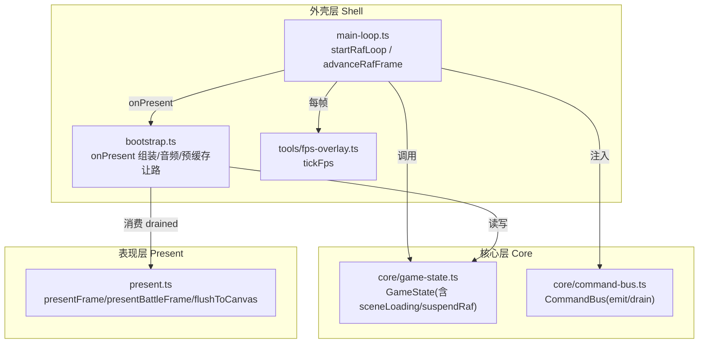
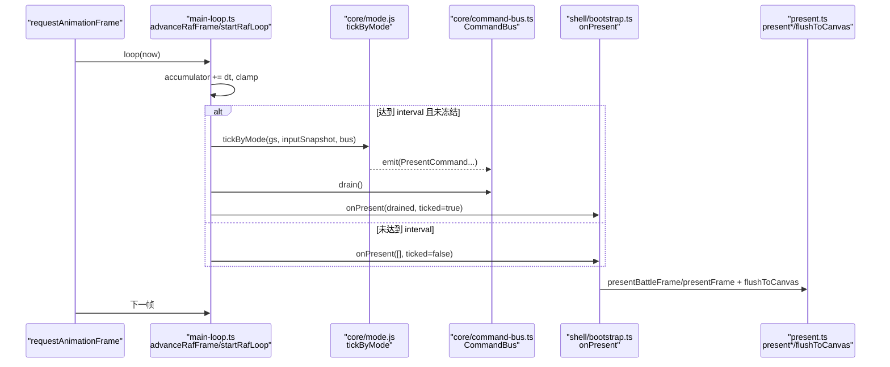
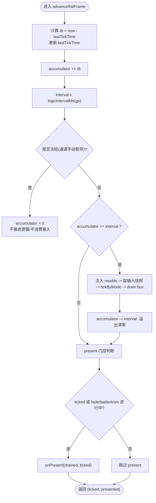
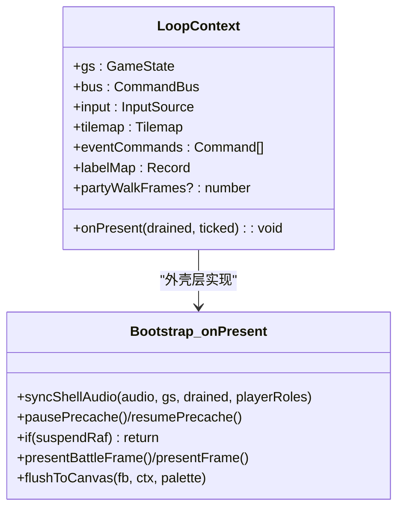
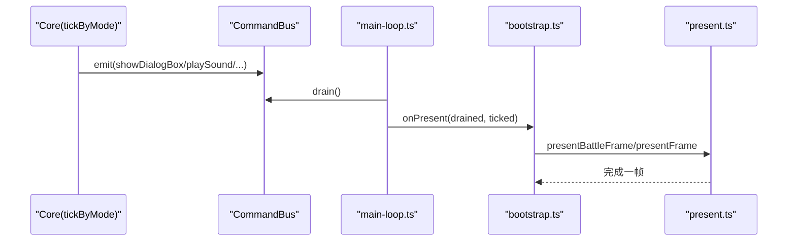
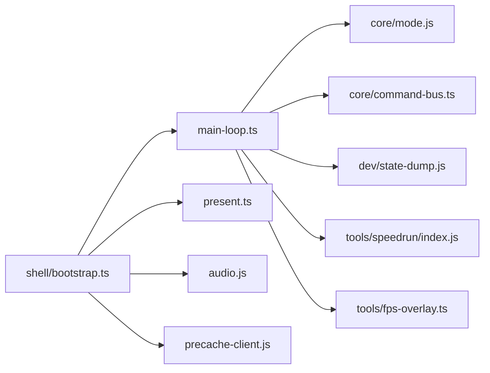

# 主循环系统

<cite>
**本文引用的文件**   
- [packages/game/src/shell/main-loop.ts](file://packages/game/src/shell/main-loop.ts)
- [packages/game/src/shell/bootstrap.ts](file://packages/game/src/shell/bootstrap.ts)
- [packages/game/src/core/command-bus.ts](file://packages/game/src/core/command-bus.ts)
- [packages/game/src/tools/fps-overlay.ts](file://packages/game/src/tools/fps-overlay.ts)
- [packages/game/src/core/game-state.ts](file://packages/game/src/core/game-state.ts)
</cite>

## 目录
1. [简介](#简介)
2. [项目结构](#项目结构)
3. [核心组件](#核心组件)
4. [架构总览](#架构总览)
5. [详细组件分析](#详细组件分析)
6. [依赖关系分析](#依赖关系分析)
7. [性能考量](#性能考量)
8. [故障排查指南](#故障排查指南)
9. [结论](#结论)
10. [附录：实践示例与最佳实践](#附录实践示例与最佳实践)

## 简介
本文件围绕浏览器端的主循环系统，系统性阐述 requestAnimationFrame 驱动的固定步长游戏循环实现。重点包括：
- 帧率控制机制：按模式（探索/战斗）选择逻辑 tick 间隔，采用累积器节流与“永不补帧”策略，保证时序忠实于原版。
- 时间片分配策略：每 rAF 至多推进一次逻辑 tick；fade、战斗动画等场景在 present 层做 wall-clock 细分渲染，避免逻辑加速副作用。
- 性能监控与调试：FPS 覆盖层、速通计时器、状态 dump（开发构建）。
- LoopContext 设计模式与 onPresent 生命周期管理：通过回调将渲染与音频同步解耦到外壳层。
- suspendRaf 机制：模态播放器（AVI/RNG/FBP/结局动画等）独占渲染期间暂停主循环 canvas 绘制，同时保持音频 drain 与预缓存让路。
- 主循环与核心层的通信：基于命令总线（CommandBus）的单向事件通道，驱动表现层消费。
- 常见问题与优化建议：标签页切换、卡顿后恢复、淡出节奏、施法动画抖动等。

## 项目结构
主循环位于 shell 层，负责 rAF 调度、逻辑步进、present 门控与工具叠加（FPS、速通计时器）。核心层提供 GameState、输入快照、命令总线；表现层在 onPresent 中消费命令并渲染。

图示来源
- [packages/game/src/shell/main-loop.ts:162-181](file://packages/game/src/shell/main-loop.ts#L162-L181)
- [packages/game/src/shell/bootstrap.ts:471-507](file://packages/game/src/shell/bootstrap.ts#L471-L507)
- [packages/game/src/tools/fps-overlay.ts:77-100](file://packages/game/src/tools/fps-overlay.ts#L77-L100)
- [packages/game/src/core/command-bus.ts:69-88](file://packages/game/src/core/command-bus.ts#L69-L88)
- [packages/game/src/core/game-state.ts:836-849](file://packages/game/src/core/game-state.ts#L836-L849)

章节来源
- [packages/game/src/shell/main-loop.ts:1-182](file://packages/game/src/shell/main-loop.ts#L1-L182)
- [packages/game/src/shell/bootstrap.ts:471-507](file://packages/game/src/shell/bootstrap.ts#L471-L507)
- [packages/game/src/tools/fps-overlay.ts:1-111](file://packages/game/src/tools/fps-overlay.ts#L1-L111)
- [packages/game/src/core/command-bus.ts:1-89](file://packages/game/src/core/command-bus.ts#L1-L89)
- [packages/game/src/core/game-state.ts:836-849](file://packages/game/src/core/game-state.ts#L836-L849)

## 核心组件
- 主循环接口与上下文
  - LoopContext：包含 GameState、CommandBus、InputSource、Tilemap、事件命令与标签映射、onPresent 回调、队伍行走帧数等。
  - RafLoopState：rAF 累积器状态（lastTickTime、accumulator），用于固定步长节流。
- 固定步长推进
  - logicIntervalMs：根据 gs.mode 返回逻辑 tick 间隔（战斗 40ms，其他 100ms）。
  - advanceRafFrame：单 rAF 帧推进，遵循三不变量（固定 interval、mode 切换 clamp、present 门控）。
  - startRafLoop：注册 rAF 循环，每帧调用 advanceRafFrame、速通计时器、FPS 覆盖层。
- 命令总线
  - CommandBus：Core → Present 单向命令通道，emit/drain/complete 接口，M2 同步语义，M3 预留异步回执。
- 性能监控
  - tickFps：每 rAF 累计帧数，500ms 采样窗口平滑显示，localStorage 持久化开关。

章节来源
- [packages/game/src/shell/main-loop.ts:27-57](file://packages/game/src/shell/main-loop.ts#L27-L57)
- [packages/game/src/shell/main-loop.ts:66-137](file://packages/game/src/shell/main-loop.ts#L66-L137)
- [packages/game/src/shell/main-loop.ts:162-181](file://packages/game/src/shell/main-loop.ts#L162-L181)
- [packages/game/src/core/command-bus.ts:69-88](file://packages/game/src/core/command-bus.ts#L69-L88)
- [packages/game/src/tools/fps-overlay.ts:77-100](file://packages/game/src/tools/fps-overlay.ts#L77-L100)

## 架构总览
下图展示主循环、核心层、表现层与外壳层之间的交互关系，以及关键数据流（输入快照、命令队列、drained 命令集）。

图示来源
- [packages/game/src/shell/main-loop.ts:66-137](file://packages/game/src/shell/main-loop.ts#L66-L137)
- [packages/game/src/shell/bootstrap.ts:481-507](file://packages/game/src/shell/bootstrap.ts#L481-L507)
- [packages/game/src/core/command-bus.ts:69-88](file://packages/game/src/core/command-bus.ts#L69-L88)

## 详细组件分析

### 固定步长与帧率控制
- 模式相关间隔
  - 探索/菜单/事件：100ms（10fps）
  - 战斗：40ms（25fps）
- 累积器与“永不补帧”
  - 每 rAF 仅当 accumulator ≥ interval 时执行一次 tick，随后减去 interval，并将溢出部分清零（clamp），避免滞后后一次性 catch-up 多 tick。
  - 该策略确保慢帧只顺延、不补帧，忠实原版节奏。
- mode 切换保护
  - 若 accumulator > 3×interval，则 clamp 为 interval，防止 explore→battle 瞬间多跑 tick。
- fade 与动画的 present 门控
  - 即使未 tick，只要存在 fade（palette/scene/battleFade）或 battleAnim，仍会调用 onPresent，使表现层按 wall-clock 细分渲染，避免顿挫。

图示来源
- [packages/game/src/shell/main-loop.ts:66-137](file://packages/game/src/shell/main-loop.ts#L66-L137)
- [packages/game/src/shell/main-loop.ts:49-51](file://packages/game/src/shell/main-loop.ts#L49-L51)

章节来源
- [packages/game/src/shell/main-loop.ts:49-51](file://packages/game/src/shell/main-loop.ts#L49-L51)
- [packages/game/src/shell/main-loop.ts:66-137](file://packages/game/src/shell/main-loop.ts#L66-L137)

### LoopContext 与 onPresent 生命周期
- LoopContext 职责
  - 承载运行时上下文：GameState、CommandBus、输入源、Tilemap、事件命令与标签映射、队伍行走帧数等。
  - onPresent 回调由外壳层注入，负责音频同步、SW 预缓存让路、present 路由与 Canvas 刷新。
- onPresent 生命周期要点
  - 音频同步必须在 suspendRaf gate 前执行，确保 modal 播放期间 BGM/SFX 正常 drain。
  - 根据 gs.suspendRaf 变化动态 pause/resume SW 预缓存，避免视频/CG 播放期抢占带宽。
  - suspendRaf 为真时，modal 播放器独占 canvas，主循环不触碰 canvas，避免两套调色板互抢导致闪烁。
  - 非 suspendRaf 时，按 gs.mode 路由到战斗或非战斗 present，最终 flushToCanvas。

图示来源
- [packages/game/src/shell/main-loop.ts:27-39](file://packages/game/src/shell/main-loop.ts#L27-L39)
- [packages/game/src/shell/bootstrap.ts:471-507](file://packages/game/src/shell/bootstrap.ts#L471-L507)

章节来源
- [packages/game/src/shell/main-loop.ts:27-39](file://packages/game/src/shell/main-loop.ts#L27-L39)
- [packages/game/src/shell/bootstrap.ts:471-507](file://packages/game/src/shell/bootstrap.ts#L471-L507)

### suspendRaf 与模态播放器独占渲染
- 触发场景
  - 开场 AVI、商标屏、启动 splash、RNG 回放、FBP 滚动、结局动画等。
- 行为约束
  - 主循环 onPresent 检测到 gs.suspendRaf 为真时直接返回，不写 canvas，交由模态播放器自行管理 framebuffer 与 flush。
  - 音频 drain 不受影响，避免声音延迟堆积。
  - 预缓存让路：在 suspendRaf 期间暂停 SW precache，减少 Range 请求与用户输入带宽竞争。

章节来源
- [packages/game/src/shell/bootstrap.ts:481-507](file://packages/game/src/shell/bootstrap.ts#L481-L507)

### 命令总线与核心层通信
- 设计目标
  - Core 层纯逻辑，不碰渲染；通过 CommandBus 发出 PresentCommand，外壳/表现层消费。
  - M2 同步语义：tick 内 emit，tick 末 drain；M3 预留 complete(cmdId) 支持异步回执。
- 使用流程
  - tickByMode 执行逻辑，可能 emit 多条命令（对话、音效、战斗 UI、伤害数字等）。
  - main-loop 在 tick 后 drain 命令集，传入 onPresent，由 bootstrap 路由到具体 present 函数。

图示来源
- [packages/game/src/core/command-bus.ts:69-88](file://packages/game/src/core/command-bus.ts#L69-L88)
- [packages/game/src/shell/main-loop.ts:101-107](file://packages/game/src/shell/main-loop.ts#L101-L107)
- [packages/game/src/shell/bootstrap.ts:481-507](file://packages/game/src/shell/bootstrap.ts#L481-L507)

章节来源
- [packages/game/src/core/command-bus.ts:1-89](file://packages/game/src/core/command-bus.ts#L1-L89)
- [packages/game/src/shell/main-loop.ts:101-107](file://packages/game/src/shell/main-loop.ts#L101-L107)
- [packages/game/src/shell/bootstrap.ts:481-507](file://packages/game/src/shell/bootstrap.ts#L481-L507)

### 性能监控与调试
- FPS 覆盖层
  - 每 rAF 调用 tickFps(now)，500ms 采样窗口平滑显示，localStorage 持久化开关。
  - 诊断用途：rAF 维持 ~60 表示无 CPU 瓶颈；低于 50 需关注性能。
- 速通计时器
  - 每 rAF 推进，不影响逻辑 tick；可配合冻结（manualPaused）观察。
- 状态 dump（开发构建）
  - 仅在 DEV 构建启用，push 当前 GameState 与队伍行走帧数，便于录制/回放与对比。

章节来源
- [packages/game/src/tools/fps-overlay.ts:77-100](file://packages/game/src/tools/fps-overlay.ts#L77-L100)
- [packages/game/src/shell/main-loop.ts:162-181](file://packages/game/src/shell/main-loop.ts#L162-L181)
- [packages/game/src/shell/main-loop.ts:168-170](file://packages/game/src/shell/main-loop.ts#L168-L170)

## 依赖关系分析
- 模块耦合
  - main-loop.ts 依赖 core/mode（tickByMode）、core/command-bus、dev/state-dump、tools/speedrun、tools/fps-overlay。
  - bootstrap.ts 注入 LoopContext.onPresent，组合 audio、present、precache-client。
- 外部依赖
  - requestAnimationFrame/cancelAnimationFrame（浏览器 API）
  - performance.now（高精度时间）
  - localStorage（FPS 开关持久化）
- 潜在环路与风险
  - 主循环与表现层通过 onPresent 回调解耦，避免直接引用，降低耦合度。
  - 命令总线单向流动，Core 不感知 Present，符合分层原则。

图示来源
- [packages/game/src/shell/main-loop.ts:17-25](file://packages/game/src/shell/main-loop.ts#L17-L25)
- [packages/game/src/shell/bootstrap.ts:471-507](file://packages/game/src/shell/bootstrap.ts#L471-L507)

章节来源
- [packages/game/src/shell/main-loop.ts:17-25](file://packages/game/src/shell/main-loop.ts#L17-L25)
- [packages/game/src/shell/bootstrap.ts:471-507](file://packages/game/src/shell/bootstrap.ts#L471-L507)

## 性能考量
- 固定步长与“永不补帧”
  - 避免卡顿后连追多 tick 导致的瞬移/跳帧问题，保持节奏稳定。
- present 门控
  - 仅在需要时 present，减少空转重绘；fade 与 battleAnim 期间允许 per-rAF 渲染，提升平滑度。
- 资源加载与预缓存让路
  - 模态播放期间暂停 SW 预缓存，避免与视频/用户输入争用带宽，提升首帧体验。
- 战斗动画细分
  - 通过每 rAF present 驱动 stepBattleAnimRender，解决 40ms 逻辑 tick 下法术效果拍频抖动问题。
- FPS 覆盖层与速通计时器
  - 轻量开销，默认在生产构建中早退，不影响性能。

[本节为通用指导，无需源码引用]

## 故障排查指南
- 战后淡出吞键/按住方向键失效
  - 现象：战后约 1.2s 按键被吞，按住方向需松开重按。
  - 根因：旧条件把清键泛化到全部渐变，现修正为函数级边界，世界冻结由 scene-system 的 paletteFadeState 门负责。
  - 定位：参考 advanceRafFrame 中对 eventCursor.waiting='scene-fade' 的处理与注释说明。
- 死亡淡出比原版长
  - 现象：battle interval=40ms 非 60Hz 整数倍，旧版清零 accumulator 导致全战斗动画变慢。
  - 修复：结转溢出余量，保留“永不补帧”，使平均节奏回到 25fps。
- 施法动画“慢”/抖成拍频
  - 现象：40ms 逻辑 tick 下法术效果帧抖频。
  - 修复：battleAnim 期间每 rAF present，stepBattleAnimRender 按 wall-clock 细分 renderIdx。
- 开场 DOS 模式画面闪烁
  - 现象：从 devpanel 触发开场 DOS 出现“正常↔偏红”闪烁。
  - 原因：suspendRaf 期间主循环仍写 canvas，两套调色板互抢。
  - 修复：suspendRaf 为真时 onPresent 直接返回，交由模态播放器独占渲染。
- 标签页切换/后台恢复
  - 现象：切回前台后逻辑不应补帧。
  - 现状：主循环采用“永不补帧”策略，切换回来不会一次性 catch-up 多 tick。
  - 注意：如需自定义处理 visibilitychange，可在 startRafLoop 外层监听并调整冻结/暂停策略。

章节来源
- [packages/game/src/shell/main-loop.ts:78-116](file://packages/game/src/shell/main-loop.ts#L78-L116)
- [packages/game/src/shell/bootstrap.ts:481-507](file://packages/game/src/shell/bootstrap.ts#L481-L507)

## 结论
主循环以 requestAnimationFrame 为驱动，结合固定步长与“永不补帧”策略，在保证原版节奏的同时，通过 present 门控与 wall-clock 细分渲染，解决了淡出与战斗动画的平滑性问题。LoopContext 与 onPresent 回调将渲染与音频同步解耦，suspendRaf 机制保障模态播放器的独占渲染与用户体验。命令总线实现了核心层与表现层的清晰边界，便于测试与扩展。FPS 覆盖层与速通计时器等工具提供了轻量而有效的性能观测手段。

[本节为总结性内容，无需源码引用]

## 附录：实践示例与最佳实践

- 自定义帧率限制
  - 思路：在 startRafLoop 外层包装一层节流器，例如基于 setInterval 或二次 rAF 限流，再调用原 startRafLoop。
  - 注意：不要破坏“永不补帧”的 accumulator 语义；建议在更高层控制 rAF 频率，而非修改 advanceRafFrame 内部逻辑。
  - 参考路径：[packages/game/src/shell/main-loop.ts:162-181](file://packages/game/src/shell/main-loop.ts#L162-L181)

- 添加性能指标收集
  - 思路：在 onPresent 前后记录 performance.now，统计 present 耗时；或在 tickByMode 前后统计逻辑耗时。
  - 输出：汇总到控制台或可视化面板，辅助定位瓶颈。
  - 参考路径：[packages/game/src/shell/bootstrap.ts:481-507](file://packages/game/src/shell/bootstrap.ts#L481-L507)

- 处理浏览器标签页切换时的暂停/恢复
  - 思路：监听 document.visibilitychange，在 hidden 时设置 gs.suspendRaf 或冻结标志，visible 时恢复。
  - 注意：冻结仅影响逻辑推进与输入消费，present 仍可运行（如淡出继续）。
  - 参考路径：[packages/game/src/shell/main-loop.ts:95-116](file://packages/game/src/shell/main-loop.ts#L95-L116)

- 通过命令总线解耦依赖
  - 做法：Core 层 emit PresentCommand，Present 层在 onPresent 中 drain 并消费；避免 Core 直接引用渲染模块。
  - 好处：单元测试隔离、多实例并行、未来异步回执扩展。
  - 参考路径：[packages/game/src/core/command-bus.ts:69-88](file://packages/game/src/core/command-bus.ts#L69-L88)

- 常见陷阱
  - 不要在 onPresent 里阻塞（如同步大 IO），以免拖慢 rAF 帧率。
  - 谨慎修改 accumulator 清零策略，避免破坏“永不补帧”。
  - 在 suspendRaf 期间避免访问 canvas，交由模态播放器管理。

[本节为实践指导，无需源码引用]