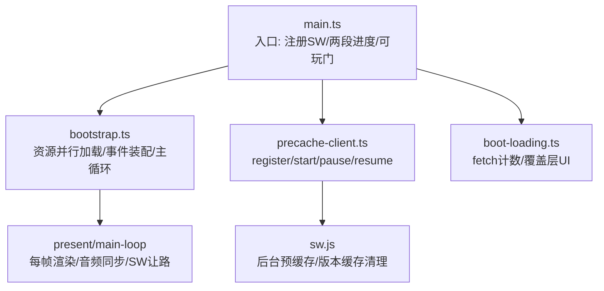
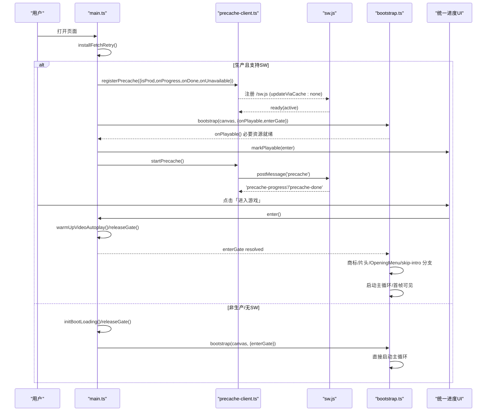
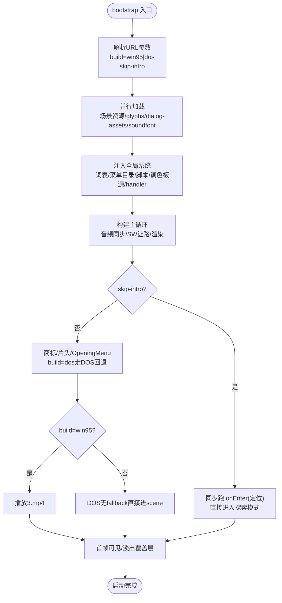
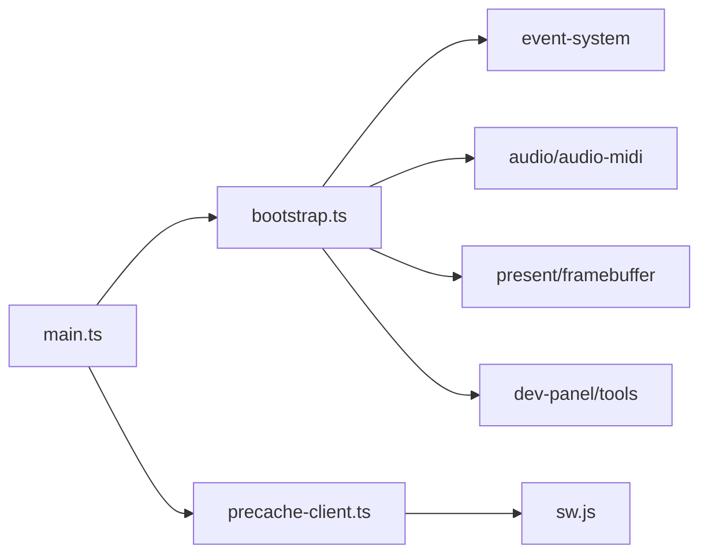

# 启动序列

<cite>
**本文引用的文件**   
- [packages/game/src/main.ts](file://packages/game/src/main.ts)
- [packages/game/src/shell/bootstrap.ts](file://packages/game/src/shell/bootstrap.ts)
- [packages/game/src/shell/precache-client.ts](file://packages/game/src/shell/precache-client.ts)
- [packages/game/public/sw.js](file://packages/game/public/sw.js)
- [packages/game/src/shell/boot-loading.ts](file://packages/game/src/shell/boot-loading.ts)
</cite>

## 目录
1. [简介](#简介)
2. [项目结构](#项目结构)
3. [核心组件](#核心组件)
4. [架构总览](#架构总览)
5. [详细组件分析](#详细组件分析)
6. [依赖关系分析](#依赖关系分析)
7. [性能考量](#性能考量)
8. [故障排查指南](#故障排查指南)
9. [结论](#结论)
10. [附录](#附录)

## 简介
本文件系统化梳理游戏的完整启动流程，覆盖资源预加载、初始化顺序、错误恢复机制、不同构建版本（win95/dos）的差异化逻辑、skip-intro 参数处理、启动进度条与并发策略、Service Worker 预缓存协作、首屏性能优化、以及失败诊断与用户友好提示设计。重点围绕 bootstrap 函数的执行步骤展开：从 soundfont 下载、字体与对话框资产并行加载，到 OpeningMenu/跳过开场、场景切换与事件系统装配，直至主循环启动与首帧可见。

## 项目结构
启动相关代码主要分布在以下模块：
- main.ts：应用入口，负责网络重试、SW 注册、两段进度 UI、可玩门控制、调用 bootstrap。
- bootstrap.ts：游戏启动核心，负责资源并行加载、全局脚本与事件系统装配、音频后端与音量控制、场景与精灵资源路由、开发工具面板、结局与 DOS 路径等。
- precache-client.ts：浏览器端 SW 客户端，提供 register/start/pause/resume 接口，封装 onReady/onUnavailable 回调。
- sw.js：原生 Service Worker，按 manifest 版本管理缓存、后台全量预缓存、暂停/续传。
- boot-loading.ts：启动期 fetch 计数与覆盖层渲染，支持虚线前必要资源进度与错误态展示。

图表来源
- [packages/game/src/main.ts:1-78](file://packages/game/src/main.ts#L1-L78)
- [packages/game/src/shell/bootstrap.ts:215-508](file://packages/game/src/shell/bootstrap.ts#L215-L508)
- [packages/game/src/shell/precache-client.ts:1-90](file://packages/game/src/shell/precache-client.ts#L1-L90)
- [packages/game/public/sw.js:1-160](file://packages/game/public/sw.js#L1-L160)
- [packages/game/src/shell/boot-loading.ts:104-149](file://packages/game/src/shell/boot-loading.ts#L104-L149)

章节来源
- [packages/game/src/main.ts:1-78](file://packages/game/src/main.ts#L1-L78)
- [packages/game/src/shell/bootstrap.ts:215-508](file://packages/game/src/shell/bootstrap.ts#L215-L508)
- [packages/game/src/shell/precache-client.ts:1-90](file://packages/game/src/shell/precache-client.ts#L1-L90)
- [packages/game/public/sw.js:1-160](file://packages/game/public/sw.js#L1-L160)
- [packages/game/src/shell/boot-loading.ts:104-149](file://packages/game/src/shell/boot-loading.ts#L104-L149)

## 核心组件
- 启动入口与门控（main.ts）
  - 安装网络重试包装器，避免偶发 net::ERR_FAILED 导致启动中断。
  - 生产环境注册 SW，建立“两段进度”UI：虚线前为必要资源（bootstrap fetch），虚线后为 SW 全量预缓存。
  - 维护 enterGate Promise；在用户点击「进入游戏」或自动放行时 resolve，允许 bootstrap 继续执行商标/开场视频与主循环。
- 引导与资源装配（bootstrap.ts）
  - 并行拉取：场景资源、字体 glyphs、对话框资产、soundfont（后台不阻塞）。
  - 注入全局词表、菜单目录、调色板源、全局脚本数组、装备效果重建、战斗/商店/RNG/FBP/结尾动画等 handler。
  - 构建 per-scene tileset 与 NPC sprite 懒加载缓存，设置 LRU 保护当前场景。
  - 启动主循环，每帧同步音频、根据 suspendRaf 暂停/恢复 SW 预缓存、渲染帧并 flush 到 canvas。
  - 处理 skip-intro 与 build=win95|dos 分支，决定开场商标/片头/OpeningMenu 行为。
- 预缓存客户端（precache-client.ts）
  - 仅在生产注册 SW，onReady 保存 active worker；startPrecache 在 onPlayable 后触发全量预缓存；pause/resume 配合视频播放期间让路。
  - 无 SW 能力或注册失败时调用 onUnavailable，由上层自动放行门，保证可用性。
- Service Worker（sw.js）
  - activate 阶段按 manifest.version 归位 CACHE_NAME，删除非当前版本的旧缓存，避免格式不兼容导致的运行时崩溃。
  - fetch 拦截 /extracted/* 与 /assets/*，命中则返回缓存，未命中则网络请求并缓存 200 响应（忽略 206 Range）。
  - 后台 precacheAll 使用并发 worker，waitUntil 保活，支持 pause/resume 与断点续传。
- 启动进度与错误覆盖层（boot-loading.ts）
  - 包装 window.fetch 统计完成数，计算 fraction 回调给统一 UI；finishBootLoading 淡出覆盖层；failBootLoading 显示错误信息。

章节来源
- [packages/game/src/main.ts:1-78](file://packages/game/src/main.ts#L1-L78)
- [packages/game/src/shell/bootstrap.ts:215-508](file://packages/game/src/shell/bootstrap.ts#L215-L508)
- [packages/game/src/shell/precache-client.ts:1-90](file://packages/game/src/shell/precache-client.ts#L1-L90)
- [packages/game/public/sw.js:1-160](file://packages/game/public/sw.js#L1-L160)
- [packages/game/src/shell/boot-loading.ts:104-149](file://packages/game/src/shell/boot-loading.ts#L104-L149)

## 架构总览
下图展示了从页面加载到游戏可玩的端到端时序，包括两段进度、可玩门、SW 预缓存与 bootstrap 内部关键步骤。

图表来源
- [packages/game/src/main.ts:1-78](file://packages/game/src/main.ts#L1-L78)
- [packages/game/src/shell/precache-client.ts:1-90](file://packages/game/src/shell/precache-client.ts#L1-L90)
- [packages/game/public/sw.js:1-160](file://packages/game/public/sw.js#L1-L160)
- [packages/game/src/shell/bootstrap.ts:215-508](file://packages/game/src/shell/bootstrap.ts#L215-L508)

## 详细组件分析

### bootstrap 函数执行步骤
- 并行资源拉取
  - 场景资源 loadAll(SCENE_ID)、字体 glyphs、对话框 dialogAssets 三路并行；glyphs 失败降级为 tofu 占位，不影响运行。
  - soundfont 提前 fetch 但不 await，soundfontSettled 用于后续 gate（如音频后端初始化不再二次 fetch）。
- 全局系统与数据装配
  - 注入 WORD.DAT 词表、菜单目录、palette 源、全局脚本 all.json、装备效果重建、战斗/商店/RNG/FBP/结尾动画等 handler。
  - 构建 per-scene tileset 与 NPC sprite 懒加载缓存，设置 LRU 保护当前场景，确保跨场景切换流畅。
- 音频与输入
  - 创建 Web Audio 管理器与 SpessaSynth MIDI 后端，绑定 soundfontData；监听 keydown/pointerdown 解锁 autoplay。
- 主循环与 SW 让路
  - 每帧先同步音频，再根据 gs.suspendRaf 暂停/恢复 SW 预缓存，避免视频/CG 播放期间抢带宽。
  - 根据 mode 选择战斗或大世界渲染，flushToCanvas 输出到画布。
- 启动路由与 skip-intro
  - 解析 URL 参数：build=win95|dos、skip-intro。
  - skip-intro=true：跳过商标/片头/OpeningMenu，直接进入 primary scene 并同步跑 onEnter（只取 setPartyPos 等定位指令）。
  - build=dos：商标/片头走 DOS fallback（RNG.MKF chunk + FBP + RLE + palette 渐变），win95 走 mp4 视频。
- 首帧可见与结束
  - 首次进入主循环后，调用 finishBootLoading 淡出覆盖层，打印启动日志。

章节来源
- [packages/game/src/shell/bootstrap.ts:215-508](file://packages/game/src/shell/bootstrap.ts#L215-L508)
- [packages/game/src/shell/bootstrap.ts:1200-1600](file://packages/game/src/shell/bootstrap.ts#L1200-L1600)
- [packages/game/src/shell/bootstrap.ts:1879-1894](file://packages/game/src/shell/bootstrap.ts#L1879-L1894)

#### 启动流程图（含 skip-intro 与 build 分支）

图表来源
- [packages/game/src/shell/bootstrap.ts:139-156](file://packages/game/src/shell/bootstrap.ts#L139-L156)
- [packages/game/src/shell/bootstrap.ts:1497-1596](file://packages/game/src/shell/bootstrap.ts#L1497-L1596)
- [packages/game/src/shell/bootstrap.ts:1879-1894](file://packages/game/src/shell/bootstrap.ts#L1879-L1894)

### 不同构建版本（win95/dos）的差异化启动逻辑
- win95 路径
  - 商标/片头走 mp4 视频（playAvi），OpeningMenu 选新游戏后播放 3.avi。
- dos 路径
  - 商标/片头走 DOS fallback：RNG.MKF chunk + FBP + RLE + palette 渐变；OpeningMenu 选新游戏时无 3.avi 替代，直接返回进入场景。
- skip-intro 优先级
  - 无论 build 为何，?skip-intro=1 均优先短路全部商标/片头/OpeningMenu，直接进入 primary scene 并同步跑 onEnter（仅定位）。

章节来源
- [packages/game/src/shell/bootstrap.ts:139-156](file://packages/game/src/shell/bootstrap.ts#L139-L156)
- [packages/game/src/shell/bootstrap.ts:1497-1596](file://packages/game/src/shell/bootstrap.ts#L1497-L1596)

### 启动进度条实现原理与并发策略
- 两段进度
  - 虚线前：bootstrap 阶段的 fetch 计数（initBootLoading），映射到 0→虚线（约 12%），单调不回退。
  - 虚线后：SW 全量预缓存真实 bytes/totalBytes 进度，仅在 onPlayable 后 startPrecache 启动。
- 并发与让路
  - SW 侧 precacheAll 使用固定并发（CONCURRENCY=8），等待 waitWhilePaused 在视频期间挂起，播完 resume 续传。
  - bootstrap 每帧检测 gs.suspendRaf，在 modal 播放期间 pausePrecache，结束后 resumePrecache，避免抢视频 Range 请求与用户输入 IO。
- 错误边界
  - 单文件失败不致命，运行时按需 fetch 兜底；SW 出错通过 precache-error 通知 UI 收尾，不阻断游戏。

章节来源
- [packages/game/src/shell/precache-client.ts:1-90](file://packages/game/src/shell/precache-client.ts#L1-L90)
- [packages/game/public/sw.js:100-160](file://packages/game/public/sw.js#L100-L160)
- [packages/game/src/shell/bootstrap.ts:471-508](file://packages/game/src/shell/bootstrap.ts#L471-L508)
- [packages/game/src/shell/boot-loading.ts:104-149](file://packages/game/src/shell/boot-loading.ts#L104-L149)

### 与 Service Worker 预缓存的协作方式
- 早注册不触发：registerPrecache 仅注册 SW 并保存 active worker，不立即开始预缓存，避免抢占必要资源带宽。
- 显式启动：onPlayable 后 startPrecache 发送 'precache' 消息，SW 用 waitUntil 保活后台任务。
- 暂停/恢复：bootstrap 在 modal 播放期间 pausePrecache，结束后 resumePrecache；若 SW 被终止，resume 会重启 precacheAll 续传。
- 版本化缓存：activate 阶段按 manifest.version 归位 CACHE_NAME，删除非当前版本旧缓存，避免格式不兼容导致的运行时崩溃。

章节来源
- [packages/game/src/main.ts:30-64](file://packages/game/src/main.ts#L30-L64)
- [packages/game/src/shell/precache-client.ts:34-90](file://packages/game/src/shell/precache-client.ts#L34-L90)
- [packages/game/public/sw.js:13-94](file://packages/game/public/sw.js#L13-L94)
- [packages/game/public/sw.js:145-160](file://packages/game/public/sw.js#L145-L160)

### 自定义启动动画、新增初始化步骤与启动时验证
- 自定义启动动画
  - 在 bootstrap 中于并行加载完成后、主循环启动前插入自定义动画逻辑（例如播放一段过渡画面），并在完成后调用 finishBootLoading 淡出覆盖层。
  - 参考位置：[packages/game/src/shell/bootstrap.ts:1879-1894](file://packages/game/src/shell/bootstrap.ts#L1879-L1894)
- 新增初始化步骤
  - 在并行加载阶段增加新的资源拉取（如额外配置或校验数据），保持与其他资源同级别并发；失败可按 glyphs 模式降级并 warn。
  - 参考位置：[packages/game/src/shell/bootstrap.ts:229-236](file://packages/game/src/shell/bootstrap.ts#L229-L236)
- 启动时验证
  - 在全局脚本加载后（all.json）进行必要校验（如命令表完整性、label 可达性），失败抛出明确错误，由 main.ts 捕获并显示错误覆盖层。
  - 参考位置：[packages/game/src/shell/bootstrap.ts:1154-1164](file://packages/game/src/shell/bootstrap.ts#L1154-L1164)

章节来源
- [packages/game/src/shell/bootstrap.ts:229-236](file://packages/game/src/shell/bootstrap.ts#L229-L236)
- [packages/game/src/shell/bootstrap.ts:1154-1164](file://packages/game/src/shell/bootstrap.ts#L1154-L1164)
- [packages/game/src/shell/bootstrap.ts:1879-1894](file://packages/game/src/shell/bootstrap.ts#L1879-L1894)

## 依赖关系分析
- main.ts 依赖 bootstrap.ts、precache-client.ts、boot-loading.ts。
- bootstrap.ts 依赖 assets/loader、event-system、audio、present、tools/dev-panel 等子系统，并通过 set*Handler 注入回调。
- precache-client.ts 与 sw.js 通过 postMessage 通信，共享 PrecacheProgress 协议。
- sw.js 读取 /extracted/asset-manifest.json 获取文件清单与总量，按版本管理缓存。

图表来源
- [packages/game/src/main.ts:1-78](file://packages/game/src/main.ts#L1-L78)
- [packages/game/src/shell/bootstrap.ts:215-508](file://packages/game/src/shell/bootstrap.ts#L215-L508)
- [packages/game/src/shell/precache-client.ts:1-90](file://packages/game/src/shell/precache-client.ts#L1-L90)
- [packages/game/public/sw.js:1-160](file://packages/game/public/sw.js#L1-L160)

章节来源
- [packages/game/src/main.ts:1-78](file://packages/game/src/main.ts#L1-L78)
- [packages/game/src/shell/bootstrap.ts:215-508](file://packages/game/src/shell/bootstrap.ts#L215-L508)
- [packages/game/src/shell/precache-client.ts:1-90](file://packages/game/src/shell/precache-client.ts#L1-L90)
- [packages/game/public/sw.js:1-160](file://packages/game/public/sw.js#L1-L160)

## 性能考量
- 并行与优先级
  - 将最大单体资源（soundfont）与其余资源并行下载，避免阻塞首屏；glyphs 失败降级，保障可玩性。
- 预缓存时机
  - 虚线后才启动 SW 全量预缓存，避免与必要资源争抢带宽；视频播放期间暂停，播完恢复，减少交互延迟。
- 内存与缓存
  - per-scene tileset 与 NPC sprite 采用 LRU 缓存（默认保留最近 16 个场景），保护当前场景不被淘汰，平衡内存与重访成本。
- 版本化缓存
  - SW 激活时按 manifest.version 清理旧缓存，避免格式不兼容导致的运行时崩溃；版本不变则保留缓存，提升复访速度。

章节来源
- [packages/game/src/shell/bootstrap.ts:215-508](file://packages/game/src/shell/bootstrap.ts#L215-L508)
- [packages/game/public/sw.js:83-94](file://packages/game/public/sw.js#L83-L94)

## 故障排查指南
- 常见症状与定位
  - 黑屏/白屏：检查 bootstrap 是否抛错并被 main.ts 捕获；查看 console 中的 “bootstrap failed” 日志。
  - 文字显示为方块：glyphs 加载失败降级为 tofu，不影响运行；确认字体资源路径与网络状态。
  - 声音缺失：soundfont 下载失败或浏览器未解锁 AudioContext；检查用户手势与后端初始化。
  - 进度条停在虚线：SW 不可用或注册失败，已自动放行门；检查 isProd 与 navigator.serviceWorker 支持。
- 诊断步骤
  - 打开浏览器控制台，搜索 “[bootstrap]” 日志，关注脚本数组加载、全局事件装配、handler 注入情况。
  - 检查 SW 消息通道：precache-progress、precache-done、precache-error；确认 precacheAll 是否被 waitUntil 保活。
  - 验证 manifest.version 与缓存版本一致性，必要时手动清缓存或刷新页面以触发 SW 更新。
- 用户友好错误提示
  - 未进入游戏：统一进度 UI 显示错误信息（failBootLoading）。
  - 已进入游戏：canvas 上绘制错误文本（showError），便于快速反馈问题。

章节来源
- [packages/game/src/main.ts:59-75](file://packages/game/src/main.ts#L59-L75)
- [packages/game/src/shell/bootstrap.ts:198-206](file://packages/game/src/shell/bootstrap.ts#L198-L206)
- [packages/game/src/shell/boot-loading.ts:141-149](file://packages/game/src/shell/boot-loading.ts#L141-L149)
- [packages/game/public/sw.js:145-160](file://packages/game/public/sw.js#L145-L160)

## 结论
本启动序列通过并行资源加载、两段进度 UI、可玩门与 SW 预缓存协作，在保证首屏体验的同时兼顾离线与复访性能。bootstrap 作为核心编排者，负责全局系统装配、场景与精灵资源路由、音频与事件系统集成，并提供 skip-intro 与多构建版本差异化逻辑。错误处理与降级策略确保在各种环境下均可稳定运行。建议持续优化预缓存命中率与首屏资源体积，结合用户反馈完善错误提示与诊断指引。

## 附录
- 关键 URL 参数
  - ?skip-intro=1：跳过商标/片头/OpeningMenu，直接进入 primary scene 并同步跑 onEnter。
  - ?build=win95（默认）/ ?build=dos：控制商标/片头/OpeningMenu 的行为路径。
- 关键回调与钩子
  - onPlayable：必要资源就绪，触发按钮与 SW 全量预缓存。
  - enterGate：用户点击「进入游戏」或自动放行后 resolve，允许 bootstrap 继续。
  - onUnavailable：SW 不可用时自动放行门，保证可用性。

章节来源
- [packages/game/src/shell/bootstrap.ts:139-156](file://packages/game/src/shell/bootstrap.ts#L139-L156)
- [packages/game/src/main.ts:30-64](file://packages/game/src/main.ts#L30-L64)
- [packages/game/src/shell/precache-client.ts:17-25](file://packages/game/src/shell/precache-client.ts#L17-L25)