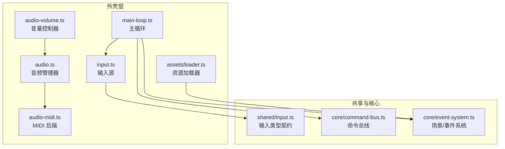
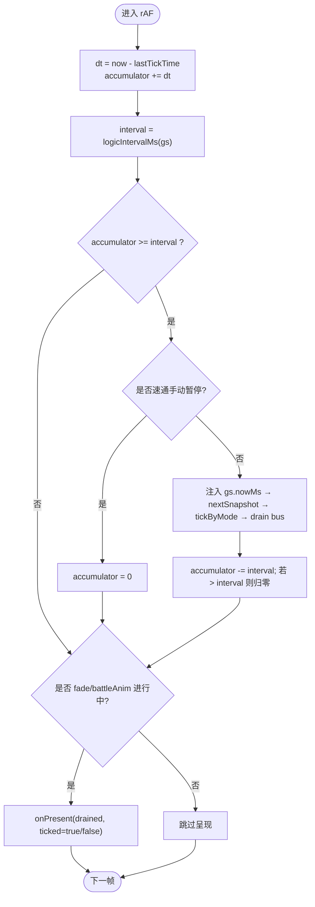
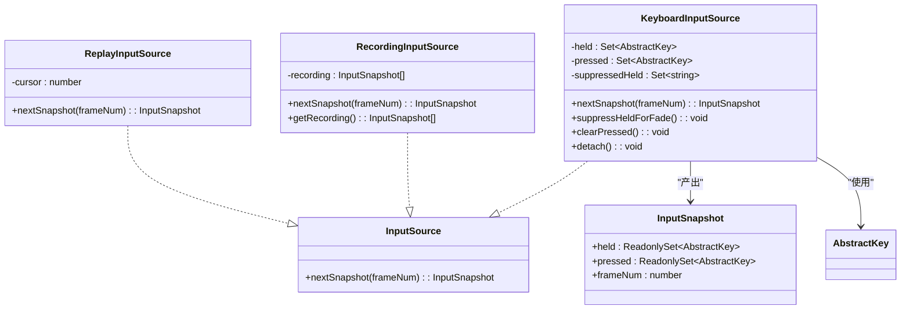
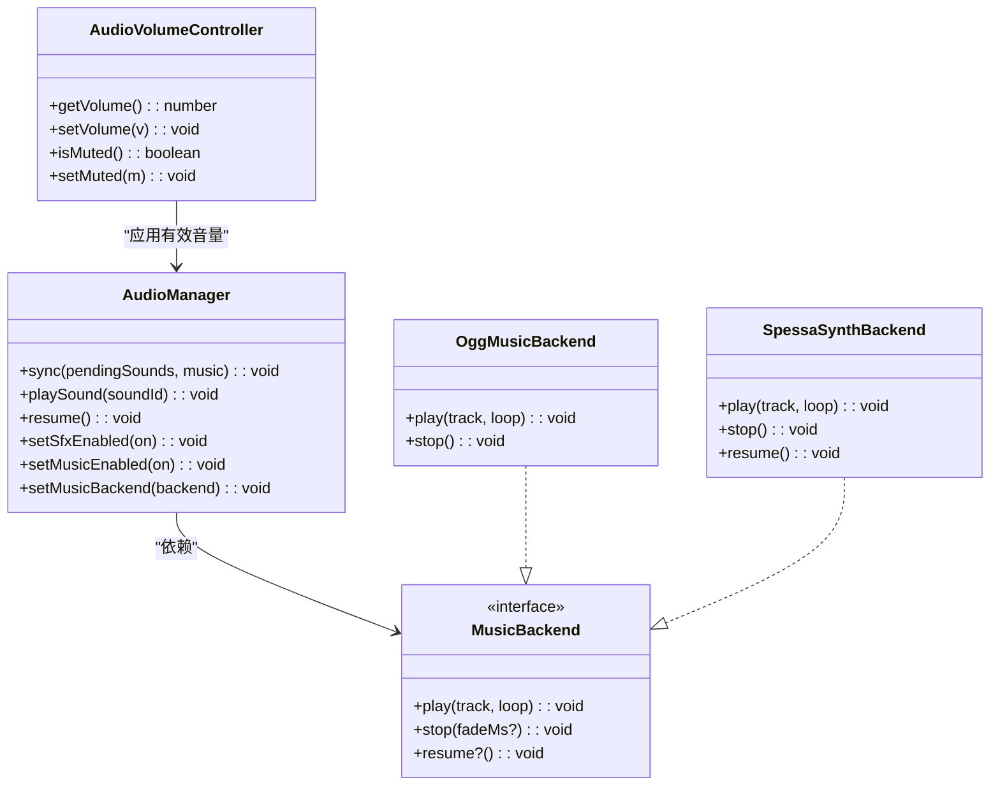
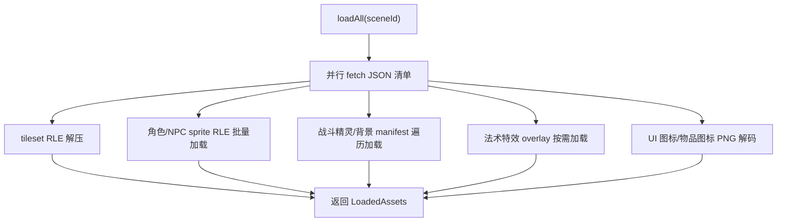
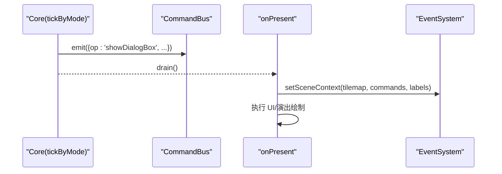
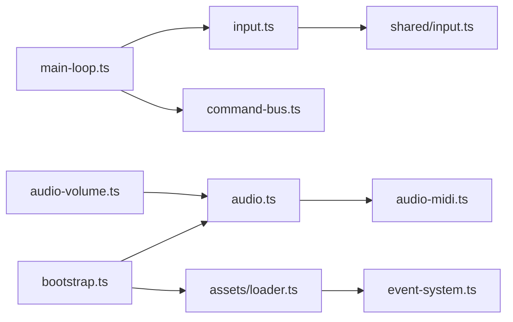

# 外壳层 (Shell Layer)

<cite>
**本文引用的文件**   
- [packages/game/src/shell/main-loop.ts](file://packages/game/src/shell/main-loop.ts)
- [packages/game/src/shell/input.ts](file://packages/game/src/shell/input.ts)
- [packages/shared/src/input.ts](file://packages/shared/src/input.ts)
- [packages/game/src/core/command-bus.ts](file://packages/game/src/core/command-bus.ts)
- [packages/game/src/shell/audio.ts](file://packages/game/src/shell/audio.ts)
- [packages/game/src/shell/audio-midi.ts](file://packages/game/src/shell/audio-midi.ts)
- [packages/game/src/shell/audio-volume.ts](file://packages/game/src/shell/audio-volume.ts)
- [packages/game/src/assets/loader.ts](file://packages/game/src/assets/loader.ts)
- [packages/reforge/src/assets.ts](file://packages/reforge/src/assets.ts)
- [packages/game/src/core/event-system.ts](file://packages/game/src/core/event-system.ts)
- [packages/game/src/shell/bootstrap.ts](file://packages/game/src/shell/bootstrap.ts)
</cite>

## 目录
1. [简介](#简介)
2. [项目结构](#项目结构)
3. [核心组件](#核心组件)
4. [架构总览](#架构总览)
5. [详细组件分析](#详细组件分析)
6. [依赖关系分析](#依赖关系分析)
7. [性能考虑](#性能考虑)
8. [故障排查指南](#故障排查指南)
9. [结论](#结论)
10. [附录](#附录)

## 简介
本文件聚焦 Type-Pal 的“外壳层（Shell Layer）”，围绕浏览器运行时与核心逻辑之间的桥接职责展开，覆盖以下子系统：
- 主循环系统：requestAnimationFrame 驱动、固定步长控制、帧率管理、淡入淡出与战斗动画的呈现门控。
- 输入处理系统：键盘事件监听、抽象按键映射、输入快照机制、fade 期间的抑制策略。
- 音频播放系统：SFX 队列与去重、BGM 后端（预渲染 OGG / 运行时 MIDI 合成）、音量控制与静音持久化。
- 资源加载系统：现代资源格式异步加载、RLE/JSON/PNG 管线、场景资源 LRU 缓存。
- 与核心层的通信：通过命令总线解耦依赖，shell 仅负责采集输入、调度 tick、消费 bus 并驱动 present。

## 项目结构
外壳层位于 packages/game/src/shell 下，配合 shared 类型契约与 core 命令总线，形成“输入→tick→bus→present”的稳定流水线。资源加载集中在 assets/loader.ts，并在 bootstrap 阶段与 shell 协同完成启动期并行下载。



图表来源
- [packages/game/src/shell/main-loop.ts:1-182](file://packages/game/src/shell/main-loop.ts#L1-L182)
- [packages/game/src/shell/input.ts:1-165](file://packages/game/src/shell/input.ts#L1-L165)
- [packages/shared/src/input.ts:1-33](file://packages/shared/src/input.ts#L1-L33)
- [packages/game/src/core/command-bus.ts:58-88](file://packages/game/src/core/command-bus.ts#L58-L88)
- [packages/game/src/shell/audio.ts:1-313](file://packages/game/src/shell/audio.ts#L1-L313)
- [packages/game/src/shell/audio-midi.ts:1-170](file://packages/game/src/shell/audio-midi.ts#L1-L170)
- [packages/game/src/shell/audio-volume.ts:1-55](file://packages/game/src/shell/audio-volume.ts#L1-L55)
- [packages/game/src/assets/loader.ts:1-500](file://packages/game/src/assets/loader.ts#L1-L500)
- [packages/game/src/core/event-system.ts:688-704](file://packages/game/src/core/event-system.ts#L688-L704)

章节来源
- [packages/game/src/shell/main-loop.ts:1-182](file://packages/game/src/shell/main-loop.ts#L1-L182)
- [packages/game/src/shell/input.ts:1-165](file://packages/game/src/shell/input.ts#L1-L165)
- [packages/shared/src/input.ts:1-33](file://packages/shared/src/input.ts#L1-L33)
- [packages/game/src/core/command-bus.ts:58-88](file://packages/game/src/core/command-bus.ts#L58-L88)
- [packages/game/src/shell/audio.ts:1-313](file://packages/game/src/shell/audio.ts#L1-L313)
- [packages/game/src/shell/audio-midi.ts:1-170](file://packages/game/src/shell/audio-midi.ts#L1-L170)
- [packages/game/src/shell/audio-volume.ts:1-55](file://packages/game/src/shell/audio-volume.ts#L1-L55)
- [packages/game/src/assets/loader.ts:1-500](file://packages/game/src/assets/loader.ts#L1-L500)
- [packages/game/src/core/event-system.ts:688-704](file://packages/game/src/core/event-system.ts#L688-L704)

## 核心组件
- 主循环：提供 headless 的 tickN 与浏览器的 startRafLoop；按模式选择逻辑间隔（探索 100ms、战斗 40ms），每 rAF 至多推进一次逻辑 tick，并通过 onPresent 门控呈现。
- 输入系统：KeyboardInputSource 将浏览器键码映射为抽象按键，维护 held/pressed 快照；支持 fade 期间抑制方向键、clearPressed 跨模态清空未消费按下。
- 音频系统：AudioManager 统一 SFX 与 BGM；SFX 走 Web Audio decode+play，带同号去重；BGM 支持两种后端：预渲染 OGG 与运行时 MIDI 合成（SpessaSynth）。
- 资源加载：loadAll 并行拉取 JSON/PNG/RLE 等，battle/magic/effect 等资源采用 RLE blob 优化；SceneAssetsCache 提供 LRU 场景资源缓存。
- 命令总线：Core 侧 emit PresentCommand，Shell 侧 drain 后交给 onPresent 执行 UI/演出绘制。

章节来源
- [packages/game/src/shell/main-loop.ts:1-182](file://packages/game/src/shell/main-loop.ts#L1-L182)
- [packages/game/src/shell/input.ts:1-165](file://packages/game/src/shell/input.ts#L1-L165)
- [packages/game/src/shell/audio.ts:1-313](file://packages/game/src/shell/audio.ts#L1-L313)
- [packages/game/src/assets/loader.ts:1-500](file://packages/game/src/assets/loader.ts#L1-L500)
- [packages/game/src/core/command-bus.ts:58-88](file://packages/game/src/core/command-bus.ts#L58-L88)

## 架构总览
外壳层作为浏览器与核心逻辑的边界，遵循“只读输入、只写呈现”的原则：
- 输入：由 KeyboardInputSource 产出 InputSnapshot，供 tickByMode 消费。
- 逻辑：tickByMode 根据当前模式推进世界状态，并将需要表现层的指令写入 CommandBus。
- 呈现：onPresent 在 shell 侧消费 bus 并驱动 Canvas/Overlay 更新。
- 音频：AudioManager 每帧同步 pendingSounds 与 music track 变化，内部对接不同 BGM 后端。
- 资源：bootstrap 阶段并行加载字体、对话资产、场景资源，loader 提供场景级 LRU 缓存。

```mermaid
sequenceDiagram
participant RAF as "rAF 回调"
participant Loop as "advanceRafFrame"
participant Core as "tickByMode"
participant Bus as "CommandBus"
participant Present as "onPresent"
participant Audio as "AudioManager.sync"
RAF->>Loop : 计算 dt, accumulator
alt 达到逻辑间隔
Loop->>Core : nextSnapshot() + tickByMode(gs, snap, bus)
Core-->>Bus : emit(PresentCommand...)
Loop->>Bus : drain()
Loop->>Present : 传入 drained + ticked 标志
else 未达间隔
Loop-->>Present : 跳过(除非 fade/battleAnim 进行中)
end
Loop->>Audio : sync(pendingSounds, music)
```

图表来源
- [packages/game/src/shell/main-loop.ts:66-137](file://packages/game/src/shell/main-loop.ts#L66-L137)
- [packages/game/src/core/command-bus.ts:58-88](file://packages/game/src/core/command-bus.ts#L58-L88)
- [packages/game/src/shell/audio.ts:272-312](file://packages/game/src/shell/audio.ts#L272-L312)

## 详细组件分析

### 主循环系统（固定步长与帧率管理）
- 设计要点
  - 逻辑间隔：探索 100ms、战斗 40ms，fade 不再提速逻辑，避免“打字/走路/等待”被加速。
  - 每 rAF 至多 1 tick：对照 sdlpal 的“顺延不补帧”，防止卡顿后瞬移或跳帧。
  - 累积器 clamp：当残留 > interval 时清零，避免 explore→battle 切换瞬间连跑多 tick。
  - 呈现门控：仅在 ticked 或各类 fade/battleAnim 进行中才调用 onPresent，减少空转重绘。
  - 速通冻结：手动暂停时冻结世界但不清除累积量，恢复后平滑衔接。
- 关键接口
  - logicIntervalMs(gs): number
  - advanceRafFrame(state, now, ctx, dump?, frozen?): {ticked, presented}
  - tickN(n, ctx): void（headless）
  - startRafLoop(ctx): () => void（返回取消函数）



图表来源
- [packages/game/src/shell/main-loop.ts:49-137](file://packages/game/src/shell/main-loop.ts#L49-L137)

章节来源
- [packages/game/src/shell/main-loop.ts:1-182](file://packages/game/src/shell/main-loop.ts#L1-L182)

### 输入处理系统（键盘事件、抽象映射、快照）
- 设计要点
  - 抽象按键：AbstractKey 与 sdlpal kKey* 一一对应，屏蔽浏览器差异。
  - 代码映射：CODE_MAP 将 e.code 映射到 AbstractKey，WASD 保持原义（非方向键）。
  - 快照语义：held 用于持续移动，pressed 用于一次性确认；nextSnapshot 后清空 pressed。
  - Fade 抑制：palette fade 期间方向键进入 suppressedHeld，keyup 前不再影响移动。
  - 跨模态清键：clearPressed 等价 PAL_ClearKeyState，避免 modal 切换残留按下。
- 扩展输入映射
  - 新增物理键映射：在 CODE_MAP 中追加 code → AbstractKey 条目。
  - 新增抽象键：在 shared/input.ts 的 AbstractKey 联合类型中添加新键名，并确保业务逻辑可识别。
  - 示例路径：
    - 添加 WASD 方向键（如需兼容）：在 input.ts 的 CODE_MAP 中增加 ArrowUp/Down/Left/Right 的别名映射。
    - 新增自定义动作键：在 shared/input.ts 的 AbstractKey 中加入 'CustomAction'，并在业务层消费该键。



图表来源
- [packages/game/src/shell/input.ts:67-164](file://packages/game/src/shell/input.ts#L67-L164)
- [packages/shared/src/input.ts:18-33](file://packages/shared/src/input.ts#L18-L33)

章节来源
- [packages/game/src/shell/input.ts:1-165](file://packages/game/src/shell/input.ts#L1-L165)
- [packages/shared/src/input.ts:1-33](file://packages/shared/src/input.ts#L1-L33)

### 音频播放系统（SFX、BGM 后端、音量控制）
- 设计要点
  - SFX：Web Audio decodeAudioData + BufferSource，带同号去重（lastSFX），缺失/解码失败静默。
  - BGM：MusicBackend 抽象，默认 OGG 后端（HTMLAudioElement），可选 SpessaSynth 运行时 MIDI 合成。
  - 音量：setOggVolumeScale/setSfxVolume 分别控制 OGG/SFX；createAudioVolumeController 持久化目标音量与静音状态。
  - 自动播放策略：首个用户手势后 resume AudioContext，确保 BGM/SFX 可播。
- 扩展音频格式支持
  - 新增一种 BGM 后端：实现 MusicBackend.play(track, loop)/stop()/resume?()，并在 AudioManager.setMusicBackend 注入。
  - 示例路径：参考 audio-midi.ts 的 createSpessaSynthBackend 实现，替换或并列于 OGG 后端。
  - 新增 SFX 解码器：在 loadSfx 中接入新的解码流程（如 mp3/wav/flac），并缓存到 sfxBuffers。



图表来源
- [packages/game/src/shell/audio.ts:18-44](file://packages/game/src/shell/audio.ts#L18-L44)
- [packages/game/src/shell/audio.ts:161-190](file://packages/game/src/shell/audio.ts#L161-L190)
- [packages/game/src/shell/audio-midi.ts:51-169](file://packages/game/src/shell/audio-midi.ts#L51-L169)
- [packages/game/src/shell/audio-volume.ts:10-54](file://packages/game/src/shell/audio-volume.ts#L10-L54)

章节来源
- [packages/game/src/shell/audio.ts:1-313](file://packages/game/src/shell/audio.ts#L1-L313)
- [packages/game/src/shell/audio-midi.ts:1-170](file://packages/game/src/shell/audio-midi.ts#L1-L170)
- [packages/game/src/shell/audio-volume.ts:1-55](file://packages/game/src/shell/audio-volume.ts#L1-L55)

### 资源加载系统（现代格式异步加载与缓存）
- 设计要点
  - 并行加载：Promise.all 并发拉取 tilemap/palette/events/player-roles 等 JSON。
  - 资源优化：tileset/sprite/battle-sprite/magic sprite 采用 gzip RLE blob，减少请求与解析开销。
  - 容错降级：缺失资源 warn 并跳过，保证游戏可运行性。
  - 场景缓存：SceneAssetsCache 基于 Map 插入序实现 LRU，支持保护当前场景不被淘汰。
- 配置选项
  - SceneAssetsCacheOptions.maxEntries/onEvict/protect：控制缓存上限、淘汰回调与保护 ID。
  - AssetBase（Reforge 工程资源）：root/maps/tilesets/sprites/palettes 子目录约定。



图表来源
- [packages/game/src/assets/loader.ts:135-390](file://packages/game/src/assets/loader.ts#L135-L390)
- [packages/reforge/src/assets.ts:1-30](file://packages/reforge/src/assets.ts#L1-L30)

章节来源
- [packages/game/src/assets/loader.ts:1-500](file://packages/game/src/assets/loader.ts#L1-L500)
- [packages/reforge/src/assets.ts:1-30](file://packages/reforge/src/assets.ts#L1-L30)

### 与核心层的通信（命令总线与场景上下文）
- 命令总线：Core 侧 emit PresentCommand，Shell 侧 drain 后交由 onPresent 执行 UI/演出绘制。
- 场景上下文：startRafLoop 启动前 setSceneContext，使 EventSystem 能访问 tilemap/eventCommands/labelMap。
- 地图重载：event-system 暴露 setMapReloader，脚本 changeMap 时可只换 tilemap 而不重置场景。



图表来源
- [packages/game/src/core/command-bus.ts:58-88](file://packages/game/src/core/command-bus.ts#L58-L88)
- [packages/game/src/shell/main-loop.ts:149-155](file://packages/game/src/shell/main-loop.ts#L149-L155)
- [packages/game/src/core/event-system.ts:688-704](file://packages/game/src/core/event-system.ts#L688-L704)

章节来源
- [packages/game/src/core/command-bus.ts:58-88](file://packages/game/src/core/command-bus.ts#L58-L88)
- [packages/game/src/shell/main-loop.ts:149-155](file://packages/game/src/shell/main-loop.ts#L149-L155)
- [packages/game/src/core/event-system.ts:688-704](file://packages/game/src/core/event-system.ts#L688-L704)

## 依赖关系分析
- 低耦合：Shell 不直接依赖浏览器 API 细节（除必要的 rAF/AudioContext），通过抽象接口（InputSource、MusicBackend）隔离平台差异。
- 单向数据流：输入→tick→bus→present；音频独立同步，不影响逻辑时序。
- 外部依赖：spessasynth_lib（MIDI 合成）、Web Audio API、Service Worker（离线预缓存，见 bootstrap）。



图表来源
- [packages/game/src/shell/main-loop.ts:1-182](file://packages/game/src/shell/main-loop.ts#L1-L182)
- [packages/game/src/shell/input.ts:1-165](file://packages/game/src/shell/input.ts#L1-L165)
- [packages/shared/src/input.ts:1-33](file://packages/shared/src/input.ts#L1-L33)
- [packages/game/src/core/command-bus.ts:58-88](file://packages/game/src/core/command-bus.ts#L58-L88)
- [packages/game/src/shell/audio.ts:1-313](file://packages/game/src/shell/audio.ts#L1-L313)
- [packages/game/src/shell/audio-midi.ts:1-170](file://packages/game/src/shell/audio-midi.ts#L1-L170)
- [packages/game/src/shell/audio-volume.ts:1-55](file://packages/game/src/shell/audio-volume.ts#L1-L55)
- [packages/game/src/assets/loader.ts:1-500](file://packages/game/src/assets/loader.ts#L1-L500)
- [packages/game/src/core/event-system.ts:688-704](file://packages/game/src/core/event-system.ts#L688-L704)
- [packages/game/src/shell/bootstrap.ts:215-236](file://packages/game/src/shell/bootstrap.ts#L215-L236)

章节来源
- [packages/game/src/shell/main-loop.ts:1-182](file://packages/game/src/shell/main-loop.ts#L1-L182)
- [packages/game/src/shell/input.ts:1-165](file://packages/game/src/shell/input.ts#L1-L165)
- [packages/game/src/shell/audio.ts:1-313](file://packages/game/src/shell/audio.ts#L1-L313)
- [packages/game/src/assets/loader.ts:1-500](file://packages/game/src/assets/loader.ts#L1-L500)
- [packages/game/src/core/event-system.ts:688-704](file://packages/game/src/core/event-system.ts#L688-L704)
- [packages/game/src/shell/bootstrap.ts:215-236](file://packages/game/src/shell/bootstrap.ts#L215-L236)

## 性能考虑
- 主循环
  - 每 rAF 至多 1 tick，避免卡顿后连追导致瞬移；clamp 残留积压，保障节奏稳定。
  - fade/battleAnim 期间仅 present，不推进逻辑，降低 CPU 占用。
- 输入
  - 过滤 e.repeat，避免重复 keydown 打乱 held 顺序，维持“后按优先”。
- 音频
  - SFX 同号去重，避免叠音；OGG 后端及时释放 HTMLAudioElement 的 src 以回收媒体资源。
  - MIDI 后端 masterGain 集中缩放，避免多次 gain 节点叠加。
- 资源
  - 并行加载 + RLE blob 压缩，减少请求数与解码时间；SceneAssetsCache LRU 控制内存峰值。

[本节为通用指导，无需特定文件引用]

## 故障排查指南
- 无 BGM 但有音效
  - 检查 secure context（https 或 localhost），否则 AudioWorklet 不可用；查看 console 中的明确错误提示。
  - 确认 soundfont.sf3 存在且为 RIFF 容器魔数，dev server 回 index.html 会触发魔数校验失败。
- 声音延迟/首次无声
  - 确认首个用户手势后已调用 AudioManager.resume()；OGG/MIDI 后端均会在 resume 后补播当前曲目。
- 淡入淡出期间按键无效
  - 属于预期行为：fade 期间 suppressHeldForFade 会抑制方向键，keyup 后恢复。
- 资源缺失导致功能退化
  - loader 对缺失资源进行 warn 并跳过，游戏仍可运行；请检查 /extracted 软链与提取产物完整性。
- 启动期卡顿
  - soundfont 较大，已在 bootstrap 阶段提前下载并计入进度；必要时可切换 OGG 后端或减小 soundfont。

章节来源
- [packages/game/src/shell/audio-midi.ts:78-145](file://packages/game/src/shell/audio-midi.ts#L78-L145)
- [packages/game/src/shell/audio.ts:272-312](file://packages/game/src/shell/audio.ts#L272-L312)
- [packages/game/src/shell/input.ts:106-135](file://packages/game/src/shell/input.ts#L106-L135)
- [packages/game/src/assets/loader.ts:135-390](file://packages/game/src/assets/loader.ts#L135-L390)
- [packages/game/src/shell/bootstrap.ts:215-236](file://packages/game/src/shell/bootstrap.ts#L215-L236)

## 结论
外壳层通过稳定的主循环、清晰的输入快照、可扩展的音频后端与高效的资源加载，将浏览器环境与核心逻辑解耦。借助命令总线与场景上下文，shell 专注于“采集输入、推进逻辑、消费指令、驱动呈现”，既保证了移植保真度，也为后续扩展（新输入键、新音频格式、新资源管线）提供了良好入口。

[本节为总结性内容，无需特定文件引用]

## 附录
- 扩展输入映射步骤
  - 在 shared/input.ts 的 AbstractKey 联合类型中添加新键名。
  - 在 input.ts 的 CODE_MAP 中将浏览器 e.code 映射到新键名。
  - 在业务层消费该键（例如菜单/战斗逻辑）。
- 添加新的音频格式支持
  - 新增 MusicBackend 实现（参考 audio-midi.ts），在 bootstrap 中注入 AudioManager.setMusicBackend。
  - 或在 audio.ts 的 loadSfx 中接入新解码器，并缓存到 sfxBuffers。
- 调试技巧
  - 使用 DEV-only 探针：__tpmidi 暴露 synth/seq 对象，便于控制台观察状态。
  - 使用 FPS 覆盖层与速通计时器辅助定位卡顿与节奏问题。
  - 利用 state-dump（DEV 构建）记录关键帧状态，对比 sdlpal 基线。

章节来源
- [packages/shared/src/input.ts:18-33](file://packages/shared/src/input.ts#L18-L33)
- [packages/game/src/shell/input.ts:17-65](file://packages/game/src/shell/input.ts#L17-L65)
- [packages/game/src/shell/audio-midi.ts:134-145](file://packages/game/src/shell/audio-midi.ts#L134-L145)
- [packages/game/src/shell/audio.ts:217-270](file://packages/game/src/shell/audio.ts#L217-L270)
- [packages/game/src/shell/main-loop.ts:162-181](file://packages/game/src/shell/main-loop.ts#L162-L181)