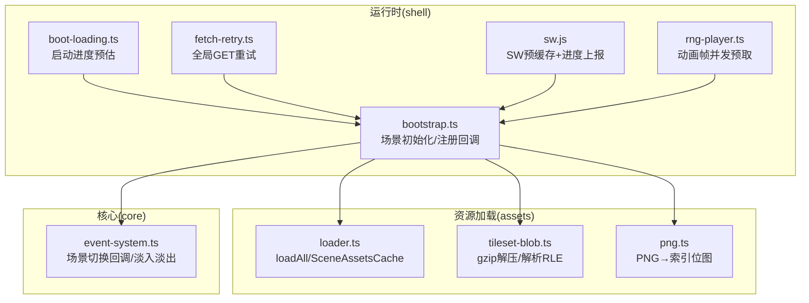
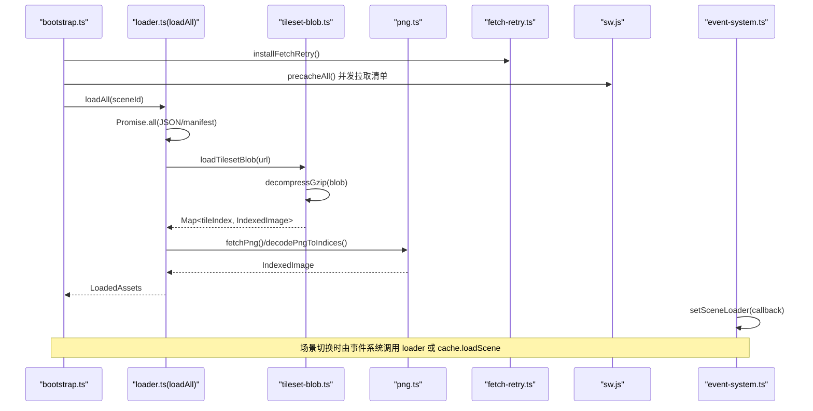
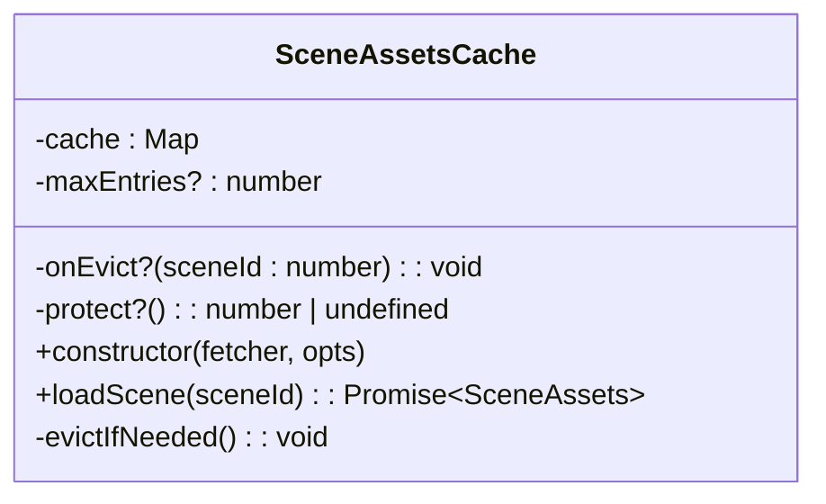
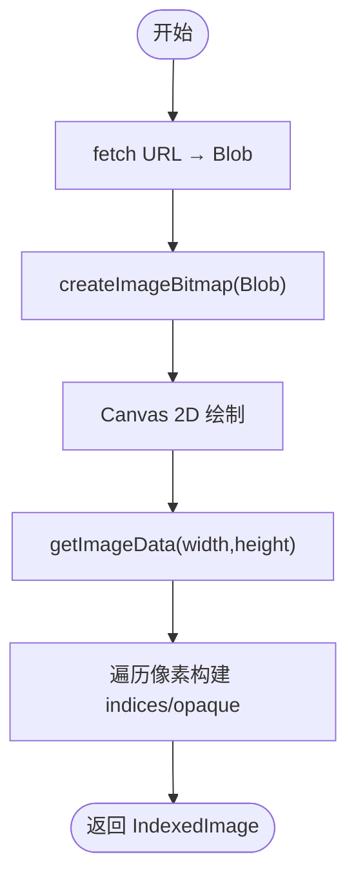
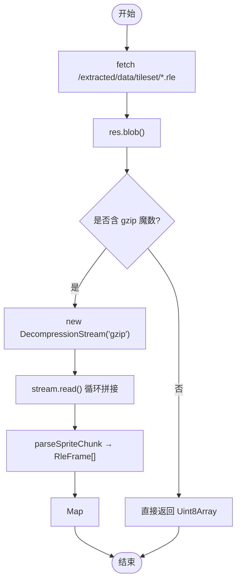
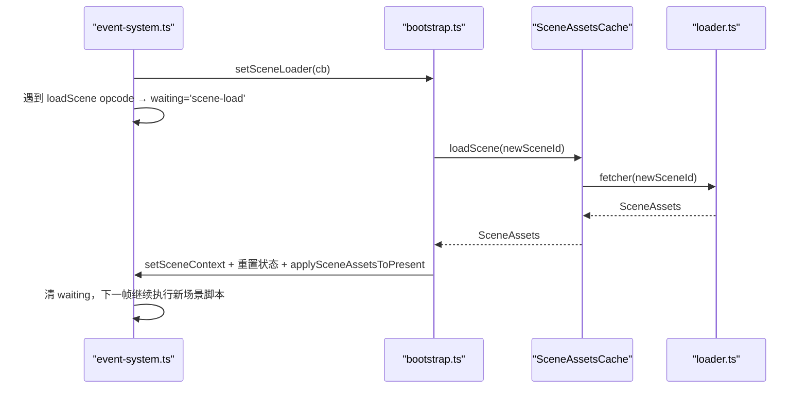
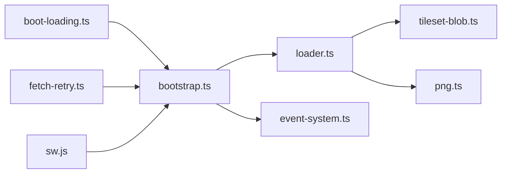

# 资源加载系统

<cite>
**本文引用的文件**
- [packages/game/src/assets/loader.ts](file://packages/game/src/assets/loader.ts)
- [packages/game/src/assets/tileset-blob.ts](file://packages/game/src/assets/tileset-blob.ts)
- [packages/game/src/assets/png.ts](file://packages/game/src/assets/png.ts)
- [packages/game/src/shell/fetch-retry.ts](file://packages/game/src/shell/fetch-retry.ts)
- [packages/game/public/sw.js](file://packages/game/public/sw.js)
- [packages/game/src/shell/boot-loading.ts](file://packages/game/src/shell/boot-loading.ts)
- [packages/game/src/shell/rng-player.ts](file://packages/game/src/shell/rng-player.ts)
- [packages/game/src/core/event-system.ts](file://packages/game/src/core/event-system.ts)
- [packages/game/src/shell/bootstrap.ts](file://packages/game/src/shell/bootstrap.ts)
</cite>

## 目录
1. [简介](#简介)
2. [项目结构](#项目结构)
3. [核心组件](#核心组件)
4. [架构总览](#架构总览)
5. [详细组件分析](#详细组件分析)
6. [依赖关系分析](#依赖关系分析)
7. [性能考量](#性能考量)
8. [故障排查指南](#故障排查指南)
9. [结论](#结论)
10. [附录](#附录)

## 简介
本文件系统化梳理资源加载系统的实现与策略，覆盖现代资源格式的异步加载、缓存机制、错误处理、生命周期管理（进度跟踪、重试与降级）、场景切换集成、并行加载优化以及内存管理与垃圾回收最佳实践。重点解析：
- SceneAssetsCache 的 LRU 缓存与保护机制
- SceneFetcher 的按需加载与预取策略
- PNG 图片解码、Tileset Blob 压缩解压、JSON 数据解析流程
- 启动期并发加载与 Service Worker 离线预缓存
- 网络层重试兜底与资源级降级
- 内存占用控制与 GC 友好实践

## 项目结构
资源加载相关代码主要分布在 assets 与 shell 子系统中：
- assets 层负责具体资源格式解析与加载（PNG、Blob/RLE、JSON）
- shell 层负责启动编排、并发策略、Service Worker 预缓存、网络重试、场景切换协调
- core 事件系统与 bootstrap 协作完成场景切换时的资源注入与渲染解冻

图表来源
- [packages/game/src/assets/loader.ts:135-390](file://packages/game/src/assets/loader.ts#L135-L390)
- [packages/game/src/assets/tileset-blob.ts:105-150](file://packages/game/src/assets/tileset-blob.ts#L105-L150)
- [packages/game/src/assets/png.ts:23-49](file://packages/game/src/assets/png.ts#L23-L49)
- [packages/game/src/shell/bootstrap.ts:1-120](file://packages/game/src/shell/bootstrap.ts#L1-L120)
- [packages/game/src/shell/boot-loading.ts:17-30](file://packages/game/src/shell/boot-loading.ts#L17-L30)
- [packages/game/src/shell/fetch-retry.ts:20-51](file://packages/game/src/shell/fetch-retry.ts#L20-L51)
- [packages/game/public/sw.js:100-143](file://packages/game/public/sw.js#L100-L143)
- [packages/game/src/shell/rng-player.ts:207-253](file://packages/game/src/shell/rng-player.ts#L207-L253)
- [packages/game/src/core/event-system.ts:673-690](file://packages/game/src/core/event-system.ts#L673-L690)

章节来源
- [packages/game/src/assets/loader.ts:135-390](file://packages/game/src/assets/loader.ts#L135-L390)
- [packages/game/src/assets/tileset-blob.ts:105-150](file://packages/game/src/assets/tileset-blob.ts#L105-L150)
- [packages/game/src/assets/png.ts:23-49](file://packages/game/src/assets/png.ts#L23-L49)
- [packages/game/src/shell/fetch-retry.ts:20-51](file://packages/game/src/shell/fetch-retry.ts#L20-L51)
- [packages/game/public/sw.js:100-143](file://packages/game/public/sw.js#L100-L143)
- [packages/game/src/shell/boot-loading.ts:17-30](file://packages/game/src/shell/boot-loading.ts#L17-L30)
- [packages/game/src/shell/rng-player.ts:207-253](file://packages/game/src/shell/rng-player.ts#L207-L253)
- [packages/game/src/core/event-system.ts:673-690](file://packages/game/src/core/event-system.ts#L673-L690)

## 核心组件
- 统一资源加载器 loadAll：按场景 ID 聚合 JSON 表、Tilemap、Palette、事件脚本、角色/NPC/战斗/魔法等资源的并发加载与组装
- Tileset Blob 管线：将 tileset/npc/battle/magic 等资源以 gzip RLE blob 形式存储，运行时一次性 fetch + 原生 DecompressionStream 解压 + parseSpriteChunk 解析为 IndexedImage
- PNG 解码：createImageBitmap → Canvas getImageData → 构造 indices/opaque 双通道位图
- SceneAssetsCache：基于 Map 的 LRU 缓存，支持 onEvict 联动清理与 protect 保护当前场景不被淘汰
- 全局 GET 重试：installFetchRetry 对网络失败与网关错误进行指数退避式重试
- SW 预缓存：后台并发拉取清单资源并写入 Cache Storage，提供进度上报与断点续传语义
- RNG 动画并发预取：同一 chunk 的多帧并发只触发一次底层加载，避免 O(N²) 风暴

章节来源
- [packages/game/src/assets/loader.ts:135-390](file://packages/game/src/assets/loader.ts#L135-L390)
- [packages/game/src/assets/tileset-blob.ts:105-150](file://packages/game/src/assets/tileset-blob.ts#L105-L150)
- [packages/game/src/assets/png.ts:23-49](file://packages/game/src/assets/png.ts#L23-L49)
- [packages/game/src/assets/loader.ts:451-499](file://packages/game/src/assets/loader.ts#L451-L499)
- [packages/game/src/shell/fetch-retry.ts:20-51](file://packages/game/src/shell/fetch-retry.ts#L20-L51)
- [packages/game/public/sw.js:100-143](file://packages/game/public/sw.js#L100-L143)
- [packages/game/src/shell/rng-player.ts:207-253](file://packages/game/src/shell/rng-player.ts#L207-L253)

## 架构总览
资源加载在启动时由 bootstrap 编排，通过 Promise.all 并发拉取大量 JSON 与二进制资源；同时 SW 在后台预缓存静态清单。场景切换时，事件系统通过 setSceneLoader 回调触发 SceneAssetsCache 的按需加载与 LRU 淘汰，并在淡入完成后解冻渲染。

图表来源
- [packages/game/src/shell/bootstrap.ts:1-120](file://packages/game/src/shell/bootstrap.ts#L1-L120)
- [packages/game/src/assets/loader.ts:135-390](file://packages/game/src/assets/loader.ts#L135-L390)
- [packages/game/src/assets/tileset-blob.ts:105-150](file://packages/game/src/assets/tileset-blob.ts#L105-L150)
- [packages/game/src/assets/png.ts:23-49](file://packages/game/src/assets/png.ts#L23-L49)
- [packages/game/src/shell/fetch-retry.ts:20-51](file://packages/game/src/shell/fetch-retry.ts#L20-L51)
- [packages/game/public/sw.js:100-143](file://packages/game/public/sw.js#L100-L143)
- [packages/game/src/core/event-system.ts:673-690](file://packages/game/src/core/event-system.ts#L673-L690)

## 详细组件分析

### SceneAssetsCache 的 LRU 缓存实现
- 数据结构：使用 JS Map 保持插入顺序，迭代序即 LRU（最旧→最近）。命中时 delete+set 刷新到 MRU 端
- 容量控制：maxEntries 启用有界缓存；省略则无限缓存（向后兼容）
- 淘汰策略：从最旧端扫描第一个非 protected 条目淘汰；若仅剩 protected 条目则停止淘汰
- 保护机制：protect 返回当前正在渲染的 sceneId，确保其永不淘汰，防止黑屏
- 联动清理：onEvict 回调用于清理调用方持有的并行缓存（如 tileImagesBySceneId），避免内存泄漏

图表来源
- [packages/game/src/assets/loader.ts:451-499](file://packages/game/src/assets/loader.ts#L451-L499)

章节来源
- [packages/game/src/assets/loader.ts:451-499](file://packages/game/src/assets/loader.ts#L451-L499)

### SceneFetcher 的按需加载与预取策略
- 按需加载：SceneAssetsCache 仅在首次访问某 sceneId 时调用 fetcher 拉取资源，后续命中直接返回
- 预取策略：可在进入新场景前主动调用 loadScene 预取相邻场景资源；结合 onEvict 清理旧场景大图缓存
- 保护当前场景：protect 回调确保正在渲染的场景不被淘汰，避免切场过程中的黑屏

章节来源
- [packages/game/src/assets/loader.ts:428-499](file://packages/game/src/assets/loader.ts#L428-L499)

### 资源格式处理流程

#### PNG 图片解码
- 流程：fetch → createImageBitmap → Canvas drawImage → getImageData → 构造 indices/opaque
- 透明表达：A 通道 > 0 表示不透明，= 0 表示透明（RLE-skip 透明）
- 适用：战斗背景、UI 帧、物品图标等

图表来源
- [packages/game/src/assets/png.ts:23-49](file://packages/game/src/assets/png.ts#L23-L49)

章节来源
- [packages/game/src/assets/png.ts:23-49](file://packages/game/src/assets/png.ts#L23-L49)

#### Tileset Blob 压缩解压与解析
- 存储格式：每个逻辑单元一个 .rle 文件（gzip 后的 sprite/MKF chunk 字节）
- 解压：DecompressionStream('gzip') 流式解压；检测魔数 0x1f8b，若无魔数说明上游已解压，直接返回
- 解析：parseSpriteChunk 解出 RleFrame[]，再映射为 IndexedImage[] 或 Map<tileIndex, IndexedImage>
- 优势：请求数从数百降至个位数，避免 createImageBitmap 开销，字节级忠实于原始 GOP chunk

图表来源
- [packages/game/src/assets/tileset-blob.ts:105-150](file://packages/game/src/assets/tileset-blob.ts#L105-L150)

章节来源
- [packages/game/src/assets/tileset-blob.ts:105-150](file://packages/game/src/assets/tileset-blob.ts#L105-L150)

#### JSON 数据解析
- 统一 fetchJson 封装：fetch → res.json()，失败抛错
- 关键数据：tilemap、palette、events、player-roles、enemies、battle-fields、magic/fire-sprites、ui-sprite、items-icons 等
- 容错：部分可选资源缺失时 catch 并降级（如 object-players、words、fire-sprites）

章节来源
- [packages/game/src/assets/loader.ts:35-41](file://packages/game/src/assets/loader.ts#L35-L41)
- [packages/game/src/assets/loader.ts:135-390](file://packages/game/src/assets/loader.ts#L135-L390)

### 资源加载的生命周期管理

#### 进度跟踪
- 启动期请求总量预估：EXPECTED_BOOT_REQUESTS 作为分母基数，结合已发起请求数保证进度条不回退
- SW 预缓存进度：precache-progress 上报 done/total/bytes/totalBytes，客户端 UI 同步显示

章节来源
- [packages/game/src/shell/boot-loading.ts:17-30](file://packages/game/src/shell/boot-loading.ts#L17-L30)
- [packages/game/public/sw.js:100-143](file://packages/game/public/sw.js#L100-L143)

#### 错误重试
- 全局 GET 重试：仅对 GET 幂等请求生效；网络失败与 502/503/504 触发重试，默认 2 次退避
- 资源级降级：可选资源缺失时 warn 并跳过，不影响主流程

章节来源
- [packages/game/src/shell/fetch-retry.ts:20-51](file://packages/game/src/shell/fetch-retry.ts#L20-L51)
- [packages/game/src/assets/loader.ts:178-189](file://packages/game/src/assets/loader.ts#L178-L189)

#### 降级处理
- 缺失资源：console.warn 记录并跳过对应功能（如法术特效 overlay、菜单 UI 帧、物品图标）
- 兼容路径：DOS fallback 与 WIN95 视频路径并存，任一失败可回退

章节来源
- [packages/game/src/assets/loader.ts:228-311](file://packages/game/src/assets/loader.ts#L228-L311)
- [packages/game/src/shell/bootstrap.ts:143-155](file://packages/game/src/shell/bootstrap.ts#L143-L155)

### 场景切换与资源系统集成
- 事件系统暴露 setSceneLoader，供 bootstrap 注入异步场景加载回调
- loadScene opcode 执行后设置 waiting='scene-load'，直到回调完成才继续推进
- fadeScreen 结束后清 sceneLoading，解冻渲染，确保切场过渡自然

图表来源
- [packages/game/src/core/event-system.ts:673-690](file://packages/game/src/core/event-system.ts#L673-L690)
- [packages/game/src/assets/loader.ts:451-499](file://packages/game/src/assets/loader.ts#L451-L499)

章节来源
- [packages/game/src/core/event-system.ts:673-690](file://packages/game/src/core/event-system.ts#L673-L690)
- [packages/game/src/assets/loader.ts:451-499](file://packages/game/src/assets/loader.ts#L451-L499)

### 并行加载与启动速度优化
- 启动期：Promise.all 并发拉取 ~20 个 JSON 表 + tileset blob + npc/battle/magic 资源
- RNG 动画：同一 chunk 的多帧并发只触发一次底层加载，避免 O(N²) 重复解压与解码
- SW 预缓存：后台并发 worker 拉取清单资源，减少首屏等待

章节来源
- [packages/game/src/assets/loader.ts:162-190](file://packages/game/src/assets/loader.ts#L162-L190)
- [packages/game/src/shell/rng-player.ts:207-253](file://packages/game/src/shell/rng-player.ts#L207-L253)
- [packages/game/public/sw.js:100-143](file://packages/game/public/sw.js#L100-L143)

### 添加新资源类型与自定义加载器
- 步骤建议：
  1) 定义新的 fetch 函数（如 fetchXxx），遵循统一错误处理与类型约束
  2) 在 loadAll 中通过 Promise.all 加入并发拉取，必要时增加 try/catch 降级
  3) 若为新格式，新增解析模块（类似 tileset-blob.ts），复用 decompressGzip + parseSpriteChunk
  4) 在 bootstrap 或相应子系统注册新资源的使用点
- 参考路径：
  - 统一 JSON 加载：[packages/game/src/assets/loader.ts:35-41](file://packages/game/src/assets/loader.ts#L35-L41)
  - 并发聚合：[packages/game/src/assets/loader.ts:162-190](file://packages/game/src/assets/loader.ts#L162-L190)
  - Blob 解析示例：[packages/game/src/assets/tileset-blob.ts:105-150](file://packages/game/src/assets/tileset-blob.ts#L105-L150)

章节来源
- [packages/game/src/assets/loader.ts:35-41](file://packages/game/src/assets/loader.ts#L35-L41)
- [packages/game/src/assets/loader.ts:162-190](file://packages/game/src/assets/loader.ts#L162-L190)
- [packages/game/src/assets/tileset-blob.ts:105-150](file://packages/game/src/assets/tileset-blob.ts#L105-L150)

## 依赖关系分析
- assets 层内部耦合：loader.ts 依赖 tileset-blob.ts 与 png.ts；tileset-blob.ts 依赖 shared 的 parseSpriteChunk
- shell 层编排：bootstrap.ts 组合 assets 与 core 能力；boot-loading.ts 提供进度预估；fetch-retry.ts 包装全局 fetch
- 外部依赖：浏览器 API（fetch、DecompressionStream、createImageBitmap、Cache Storage）、Service Worker

图表来源
- [packages/game/src/assets/loader.ts:135-390](file://packages/game/src/assets/loader.ts#L135-L390)
- [packages/game/src/assets/tileset-blob.ts:105-150](file://packages/game/src/assets/tileset-blob.ts#L105-L150)
- [packages/game/src/assets/png.ts:23-49](file://packages/game/src/assets/png.ts#L23-L49)
- [packages/game/src/shell/bootstrap.ts:1-120](file://packages/game/src/shell/bootstrap.ts#L1-L120)
- [packages/game/src/shell/boot-loading.ts:17-30](file://packages/game/src/shell/boot-loading.ts#L17-L30)
- [packages/game/src/shell/fetch-retry.ts:20-51](file://packages/game/src/shell/fetch-retry.ts#L20-L51)
- [packages/game/public/sw.js:100-143](file://packages/game/public/sw.js#L100-L143)

章节来源
- [packages/game/src/assets/loader.ts:135-390](file://packages/game/src/assets/loader.ts#L135-L390)
- [packages/game/src/assets/tileset-blob.ts:105-150](file://packages/game/src/assets/tileset-blob.ts#L105-L150)
- [packages/game/src/assets/png.ts:23-49](file://packages/game/src/assets/png.ts#L23-L49)
- [packages/game/src/shell/bootstrap.ts:1-120](file://packages/game/src/shell/bootstrap.ts#L1-L120)
- [packages/game/src/shell/boot-loading.ts:17-30](file://packages/game/src/shell/boot-loading.ts#L17-L30)
- [packages/game/src/shell/fetch-retry.ts:20-51](file://packages/game/src/shell/fetch-retry.ts#L20-L51)
- [packages/game/public/sw.js:100-143](file://packages/game/public/sw.js#L100-L143)

## 性能考量
- 并发拉取：启动期使用 Promise.all 并行加载 JSON 与二进制资源，显著缩短首屏时间
- 请求合并：tileset/npc/battle/magic 改为 gzip RLE blob，大幅降低请求数与解码开销
- 去重与预取：RNG 动画同一 chunk 并发只触发一次底层加载，避免重复解压；场景切换前可预取相邻场景
- 进度稳定：启动进度分母采用 max(已发起, 预估)，避免进度条回退
- SW 预缓存：后台并发 worker 拉取清单资源，提升离线体验与二次启动速度

章节来源
- [packages/game/src/assets/loader.ts:162-190](file://packages/game/src/assets/loader.ts#L162-L190)
- [packages/game/src/assets/tileset-blob.ts:105-150](file://packages/game/src/assets/tileset-blob.ts#L105-L150)
- [packages/game/src/shell/rng-player.ts:207-253](file://packages/game/src/shell/rng-player.ts#L207-L253)
- [packages/game/src/shell/boot-loading.ts:17-30](file://packages/game/src/shell/boot-loading.ts#L17-L30)
- [packages/game/public/sw.js:100-143](file://packages/game/public/sw.js#L100-L143)

## 故障排查指南
- 网络层失败：检查 installFetchRetry 是否正确安装且早于 boot-loading；确认仅 GET 重试生效
- 资源缺失：查看 console.warn 输出，定位缺失资源路径；必要时补充 manifest 或回退逻辑
- 场景切换黑屏：确认 SceneAssetsCache.protect 返回当前场景 id，避免被 LRU 淘汰
- 进度条异常：核对 EXPECTED_BOOT_REQUESTS 与实际请求峰值，确保分母不小于实际峰值
- SW 预缓存失败：检查 sw.js 的 precacheAll 并发与 postMessage 上报，确认 CACHE_NAME 与版本失效逻辑

章节来源
- [packages/game/src/shell/fetch-retry.ts:20-51](file://packages/game/src/shell/fetch-retry.ts#L20-L51)
- [packages/game/src/assets/loader.ts:178-189](file://packages/game/src/assets/loader.ts#L178-L189)
- [packages/game/src/assets/loader.ts:451-499](file://packages/game/src/assets/loader.ts#L451-L499)
- [packages/game/src/shell/boot-loading.ts:17-30](file://packages/game/src/shell/boot-loading.ts#L17-L30)
- [packages/game/public/sw.js:100-143](file://packages/game/public/sw.js#L100-L143)

## 结论
本资源加载系统通过统一的并发加载、高效的 Blob 解析、健壮的 LRU 缓存与保护机制、完善的网络重试与资源降级策略，实现了高可用、高性能的资源加载体验。配合 Service Worker 预缓存与启动进度可视化，进一步提升了冷启动速度与离线可用性。未来可考虑将小文件打包归档以降低请求开销，并引入更细粒度的内存监控与自动释放策略。

## 附录

### 内存管理与垃圾回收最佳实践
- 控制缓存规模：为 SceneAssetsCache 设置合理的 maxEntries，避免全场景常驻导致内存膨胀
- 联动清理：利用 onEvict 回调清理调用方持有的并行缓存（如 tileImagesBySceneId），防止引用链阻止 GC
- 保护当前场景：protect 回调确保正在渲染的场景不被淘汰，避免黑屏的同时也避免频繁重建
- 及时释放临时对象：PNG 解码后及时关闭 ImageBitmap，避免长时间持有大对象
- 避免隐式引用：在资源卸载或场景切换时，显式清空 Map/Set 引用，帮助 GC 回收

章节来源
- [packages/game/src/assets/loader.ts:451-499](file://packages/game/src/assets/loader.ts#L451-L499)
- [packages/game/src/assets/png.ts:23-49](file://packages/game/src/assets/png.ts#L23-L49)