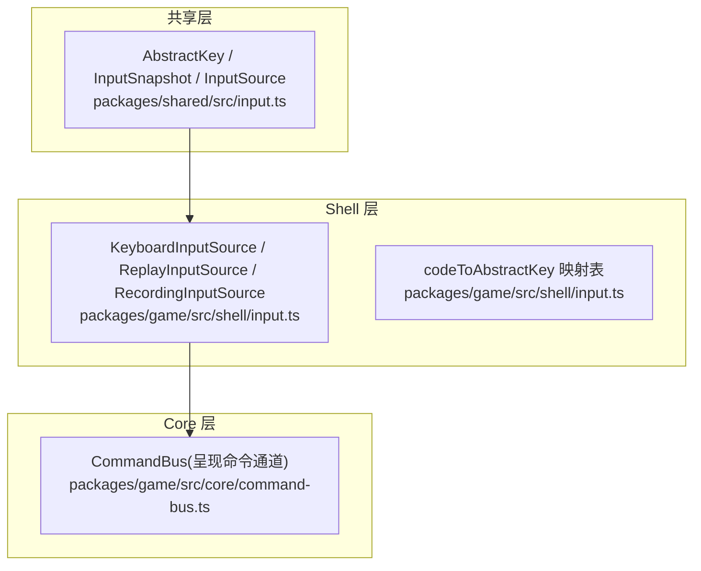
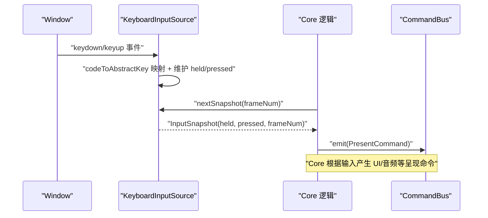
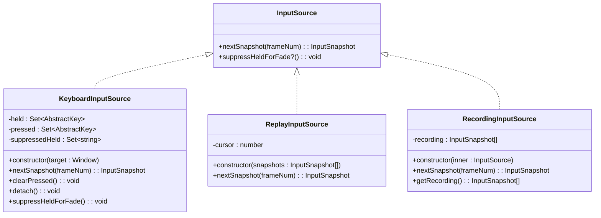
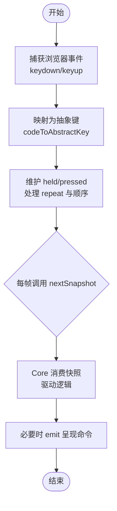
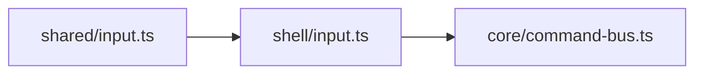

# 输入处理系统

<cite>
**本文引用的文件**
- [packages/shared/src/input.ts](file://packages/shared/src/input.ts)
- [packages/game/src/shell/input.ts](file://packages/game/src/shell/input.ts)
- [packages/game/src/shell/input.test.ts](file://packages/game/src/shell/input.test.ts)
- [packages/game/src/core/command-bus.ts](file://packages/game/src/core/command-bus.ts)
- [reference/sdlpal/input.c](file://reference/sdlpal/input.c)
</cite>

## 目录
1. [简介](#简介)
2. [项目结构](#项目结构)
3. [核心组件](#核心组件)
4. [架构总览](#架构总览)
5. [详细组件分析](#详细组件分析)
6. [依赖关系分析](#依赖关系分析)
7. [性能考量](#性能考量)
8. [故障排查指南](#故障排查指南)
9. [结论](#结论)
10. [附录](#附录)

## 简介
本文件面向输入处理子系统，系统性阐述键盘事件监听机制、抽象按键映射层的设计与输入快照模式的实现。重点解释 KeyboardInputSource 类的工作原理（事件捕获、按键状态跟踪、重复按键处理、组合键检测），说明输入快照如何保证每帧一致性，以及如何处理浏览器自动聚焦与焦点丢失问题。文档还包含扩展新按键映射、添加手柄支持、实现自定义输入设备的实践指南，并说明输入系统与核心层的集成方式及通过命令总线传递输入相关呈现指令的链路。最后提供跨浏览器兼容性与移动端触摸支持的实现建议。

## 项目结构
输入系统由“共享类型契约”和“Shell 实现”两部分组成：
- 共享层定义抽象按键、输入快照与输入源接口，确保 Core 与 Shell 解耦。
- Shell 层负责将浏览器原生事件转换为抽象输入快照，并提供回放/录制等辅助源。



图表来源
- [packages/shared/src/input.ts:1-54](file://packages/shared/src/input.ts#L1-L54)
- [packages/game/src/shell/input.ts:1-165](file://packages/game/src/shell/input.ts#L1-L165)
- [packages/game/src/core/command-bus.ts:1-89](file://packages/game/src/core/command-bus.ts#L1-L89)

章节来源
- [packages/shared/src/input.ts:1-54](file://packages/shared/src/input.ts#L1-L54)
- [packages/game/src/shell/input.ts:1-165](file://packages/game/src/shell/input.ts#L1-L165)
- [packages/game/src/core/command-bus.ts:1-89](file://packages/game/src/core/command-bus.ts#L1-L89)

## 核心组件
- 抽象按键与快照类型
  - AbstractKey：与 sdlpal 真值一一对应的字符串枚举，屏蔽浏览器差异。
  - InputSnapshot：每帧输入快照，包含 held（持续按住）与 pressed（本 tick 初次按下）两个只读集合，以及 frameNum。
  - InputSource：输入源抽象，nextSnapshot(frameNum) 返回快照；可选 suppressHeldForFade() 用于特定 fade 场景清键。

- 键盘输入源
  - KeyboardInputSource：订阅 Window 的 keydown/keyup，维护 held/pressed 集合，按“后按优先”策略更新方向优先级，过滤 e.repeat 避免顺序污染，提供 clearPressed() 与 detach()。
  - ReplayInputSource / RecordingInputSource：回放与录制装饰器，便于测试与回归。

- 代码到抽象键映射
  - codeToAbstractKey(code)：基于 CODE_MAP 将浏览器 code 映射为 AbstractKey，严格对齐 sdlpal input.c 原义（WASD 不作为方向键）。

章节来源
- [packages/shared/src/input.ts:1-54](file://packages/shared/src/input.ts#L1-L54)
- [packages/game/src/shell/input.ts:1-165](file://packages/game/src/shell/input.ts#L1-L165)

## 架构总览
输入系统采用“事件→快照→消费”的分层模式：
- 事件层：浏览器 keydown/keyup 事件被 KeyboardInputSource 捕获。
- 抽象层：通过 codeToAbstractKey 映射为 AbstractKey，统一语义。
- 快照层：每帧 nextSnapshot 产出 InputSnapshot，held/pressed 分离，frameNum 对齐主循环。
- 消费层：Core 读取快照驱动逻辑；必要时通过 CommandBus 下发呈现指令（如对话框显示）。



图表来源
- [packages/game/src/shell/input.ts:67-135](file://packages/game/src/shell/input.ts#L67-L135)
- [packages/game/src/core/command-bus.ts:63-88](file://packages/game/src/core/command-bus.ts#L63-L88)

## 详细组件分析

### 键盘事件监听与抽象映射
- 事件捕获
  - 在构造函数中向 target(Window) 注册 keydown/keyup 监听器。
  - handleDown：将 e.code 经 codeToAbstractKey 转为 AbstractKey；若未命中则忽略。
  - handleUp：从 held 移除对应键，并从抑制集 suppressedHeld 中移除（以便后续重按恢复）。

- 重复按键处理
  - 当 e.repeat 为 true 时，不刷新 held 顺序，也不新增 pressed，以符合 sdlpal 行为（仅首次按下才更新 dwKeyOrder）。

- “后按优先”的方向选择
  - 使用 delete-then-add 把最新初次按下的方向键推到 Set 末尾，pickFacing 反向取末位即可得到最近一次按下的方向。

- 组合键检测
  - 通过 held 集合同时存在多个 AbstractKey 表示组合态（例如 Confirm + Menu 等），上层可据此判断组合动作。

- 映射规则
  - 方向键：ArrowUp/Down/Left/Right 与 Numpad8/2/4/6 映射为 Up/Down/Left/Right。
  - WASD 还原 sdlpal 原义：KeyA=Auto、KeyD=Defend、KeyE=UseItem、KeyW=ThrowItem、KeyS=Status、KeyR=Repeat、KeyQ=Flee、KeyF=Force。
  - 菜单/确认/翻页/Home/End 等均有明确映射。

章节来源
- [packages/game/src/shell/input.ts:17-65](file://packages/game/src/shell/input.ts#L17-L65)
- [packages/game/src/shell/input.ts:67-93](file://packages/game/src/shell/input.ts#L67-L93)
- [packages/game/src/shell/input.test.ts:9-70](file://packages/game/src/shell/input.test.ts#L9-L70)

#### 类图：输入源与键盘源


图表来源
- [packages/shared/src/input.ts:35-53](file://packages/shared/src/input.ts#L35-L53)
- [packages/game/src/shell/input.ts:67-164](file://packages/game/src/shell/input.ts#L67-L164)

### 输入快照模式与帧一致性
- 快照结构
  - held：当前按住的键集合（走路/移动等连续操作）。
  - pressed：本 tick 新按下的键集合（菜单/确认等一次性操作）。
  - frameNum：主循环传入的帧号，便于回放与日志对齐。

- 帧内一致性
  - nextSnapshot 会复制当前 held/pressed 并清空 pressed，确保同一帧内多次消费不会重复触发 edge 事件。
  - 对于 fade 场景，调用 suppressHeldForFade 会将方向键加入抑制集，并在下一帧过滤掉，直到物理松开再重按才恢复。

- 与 sdlpal 的对齐
  - 等价于 PAL_ClearKeyState 的 clearPressed 用于 modal 边界清理残留 pressed。
  - 方向优先级与 repeat 行为对齐 sdlpal input.c 的 dwKeyOrder 与 fRepeat 判定。

章节来源
- [packages/shared/src/input.ts:25-53](file://packages/shared/src/input.ts#L25-L53)
- [packages/game/src/shell/input.ts:95-118](file://packages/game/src/shell/input.ts#L95-L118)
- [packages/game/src/shell/input.ts:120-129](file://packages/game/src/shell/input.ts#L120-L129)
- [reference/sdlpal/input.c:213](file://reference/sdlpal/input.c#L213)

#### 序列图：单帧输入快照流程
```mermaid
sequenceDiagram
participant Win as "Window"
participant KIS as "KeyboardInputSource"
participant Core as "Core 逻辑"
Win->>KIS : "keydown(e.repeat=false)"
KIS->>KIS : "pressed.add(k); held.delete/add(k)"
Core->>KIS : "nextSnapshot(frameNum)"
KIS-->>Core : "InputSnapshot{held, pressed, frameNum}"
Note over KIS,Core : "pressed 在本帧后被清空"
Win->>KIS : "keyup"
KIS->>KIS : "held.delete(k); suppressedHeld.delete(k)"
```

图表来源
- [packages/game/src/shell/input.ts:70-104](file://packages/game/src/shell/input.ts#L70-L104)

### 焦点管理与浏览器自动聚焦
- 问题背景
  - 浏览器可能在用户交互后自动聚焦某些元素，导致键盘事件不在 Window 上触发，从而丢失输入。
- 应对策略
  - 将 KeyboardInputSource 的目标设为 window，并确保在游戏初始化阶段对 window 进行 focus，或在首次用户交互（点击/触摸）时主动 focus(window)。
  - 在页面可见性变化或窗口失焦时，考虑暂停游戏逻辑或提示用户重新聚焦。
  - 在模态切换（如 AVI 播放结束进入菜单）前调用 clearPressed()，避免残留 pressed 被误消费。

章节来源
- [packages/game/src/shell/input.ts:90-93](file://packages/game/src/shell/input.ts#L90-L93)
- [packages/game/src/shell/input.ts:120-129](file://packages/game/src/shell/input.ts#L120-L129)

### 与核心层集成与命令总线
- 集成方式
  - Core 每帧从 InputSource.nextSnapshot 获取快照，并根据 pressed/held 驱动状态机与业务逻辑。
  - 当需要呈现 UI 或媒体效果时，Core 通过 CommandBus.emit 发送 PresentCommand，Present 层在 tick 末 drain 消费。

- 示例路径
  - 事件系统根据输入触发 showDiaLogBox 等命令，随后由 Present 层渲染对话框。

章节来源
- [packages/game/src/core/command-bus.ts:63-88](file://packages/game/src/core/command-bus.ts#L63-L88)

### 扩展指南

#### 扩展新的按键映射
- 步骤
  - 在 codeToAbstractKey 的映射表中新增 code → AbstractKey 的条目。
  - 在 AbstractKey 联合类型中添加新键名（位于 shared 层）。
  - 在单元测试中补充覆盖用例，确保行为稳定。

章节来源
- [packages/game/src/shell/input.ts:17-65](file://packages/game/src/shell/input.ts#L17-L65)
- [packages/shared/src/input.ts:18-23](file://packages/shared/src/input.ts#L18-L23)
- [packages/game/src/shell/input.test.ts:9-70](file://packages/game/src/shell/input.test.ts#L9-L70)

#### 添加手柄支持
- 思路
  - 新增 GamepadInputSource 实现 InputSource，轮询 gamepad API，将按钮/摇杆映射为 AbstractKey。
  - 复用现有快照模型，将手柄输入写入 held/pressed。
  - 在合成输入源中将 KeyboardInputSource 与 GamepadInputSource 合并（例如 Decorator 模式）。

章节来源
- [packages/shared/src/input.ts:35-53](file://packages/shared/src/input.ts#L35-L53)
- [packages/game/src/shell/input.ts:137-164](file://packages/game/src/shell/input.ts#L137-L164)

#### 实现自定义输入设备
- 思路
  - 实现 InputSource 接口，按需生成 InputSnapshot。
  - 可使用 RecordingInputSource 包装真实源，记录快照用于回放与回归测试。
  - 在测试中使用 ReplayInputSource 注入确定性输入序列。

章节来源
- [packages/game/src/shell/input.ts:137-164](file://packages/game/src/shell/input.ts#L137-L164)

### 概念总览：输入处理流水线


[此图为概念流程图，无需源码映射]

## 依赖关系分析
- 耦合与内聚
  - KeyboardInputSource 仅依赖 shared 层类型与浏览器事件，内聚良好。
  - Core 通过 InputSource 接口与 Shell 解耦，可通过不同实现替换输入源。
- 外部依赖
  - 浏览器 Window 事件模型。
  - 未来可扩展 Gamepad API、Touch/Mouse 事件。
- 潜在循环依赖
  - 无直接循环依赖；Shell 不依赖 Core，Core 仅依赖 shared 类型与 InputSource 接口。



图表来源
- [packages/shared/src/input.ts:1-54](file://packages/shared/src/input.ts#L1-L54)
- [packages/game/src/shell/input.ts:1-165](file://packages/game/src/shell/input.ts#L1-L165)
- [packages/game/src/core/command-bus.ts:1-89](file://packages/game/src/core/command-bus.ts#L1-L89)

章节来源
- [packages/shared/src/input.ts:1-54](file://packages/shared/src/input.ts#L1-L54)
- [packages/game/src/shell/input.ts:1-165](file://packages/game/src/shell/input.ts#L1-L165)
- [packages/game/src/core/command-bus.ts:1-89](file://packages/game/src/core/command-bus.ts#L1-L89)

## 性能考量
- 事件频率控制
  - 过滤 e.repeat 避免频繁更新 held 顺序，减少不必要的 Set 操作。
- 快照拷贝成本
  - nextSnapshot 创建新的 Set 副本，注意在高帧率下避免过度分配；可在消费端缓存快照引用。
- 内存占用
  - 录制功能需权衡存储时长与内存占用，必要时限制录制长度或异步落盘。

[本节为通用指导，不涉及具体文件分析]

## 故障排查指南
- 症状：按下方向键无效或优先级异常
  - 检查是否遗漏了 e.repeat 过滤，导致 held 顺序被重复按下刷新。
  - 确认 pickFacing 是否反向取末位以匹配“后按优先”。

- 症状：modal 切换后误触确认
  - 在模态边界调用 clearPressed()，避免残留 pressed 被消费。

- 症状：fade 期间按住方向键继续移动
  - 确认仅在 scene-fade 场景调用 suppressHeldForFade，其他渐变不应调用。

- 症状：焦点丢失导致无输入
  - 确保 window 获得焦点，或在首次交互时主动 focus(window)。

章节来源
- [packages/game/src/shell/input.ts:70-104](file://packages/game/src/shell/input.ts#L70-L104)
- [packages/game/src/shell/input.ts:113-118](file://packages/game/src/shell/input.ts#L113-L118)
- [packages/game/src/shell/input.ts:120-129](file://packages/game/src/shell/input.ts#L120-L129)

## 结论
输入系统通过抽象按键与输入快照模式，实现了浏览器事件与核心逻辑的清晰解耦。KeyboardInputSource 精确对齐 sdlpal 的行为语义，包括重复按键、方向优先级与 fade 清键。配合 Replay/Recording 源，系统具备良好的可测性与可回放性。未来可扩展手柄与触摸输入，并通过 CommandBus 与呈现层协同工作，形成完整的输入→逻辑→表现闭环。

[本节为总结，不涉及具体文件分析]

## 附录

### 跨浏览器兼容性处理要点
- 事件目标
  - 始终将事件监听绑定到 window，避免局部元素聚焦导致的输入丢失。
- 键盘事件差异
  - 使用 e.code 而非 e.key，以获得稳定的物理键码映射。
- 自动聚焦
  - 在首交互时主动 focus(window)，并在页面不可见时暂停逻辑。

[本节为通用指导，不涉及具体文件分析]

### 移动端触摸支持实现指南
- 参考 sdlpal 触摸区域划分与动作映射，将屏幕区域映射为方向与功能键。
- 在 Shell 层新增 TouchInputSource，将触摸事件转换为 AbstractKey，并接入 InputSource 接口。
- 结合现有快照模型，保持与键盘一致的消费语义。

章节来源
- [reference/sdlpal/input.c:868-1110](file://reference/sdlpal/input.c#L868-L1110)