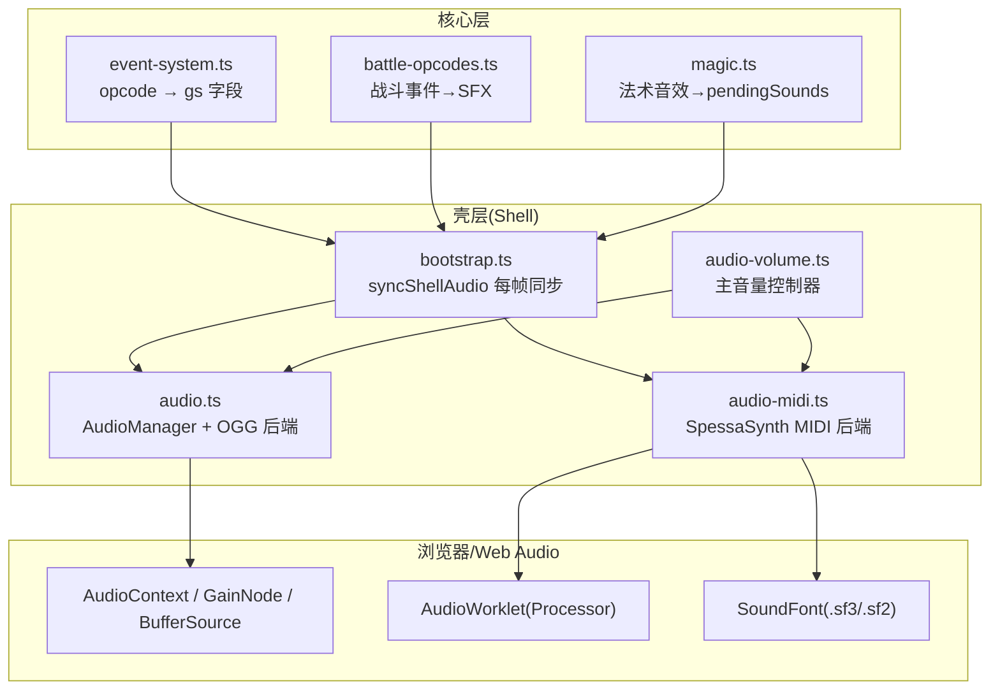
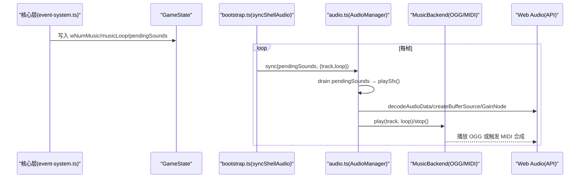
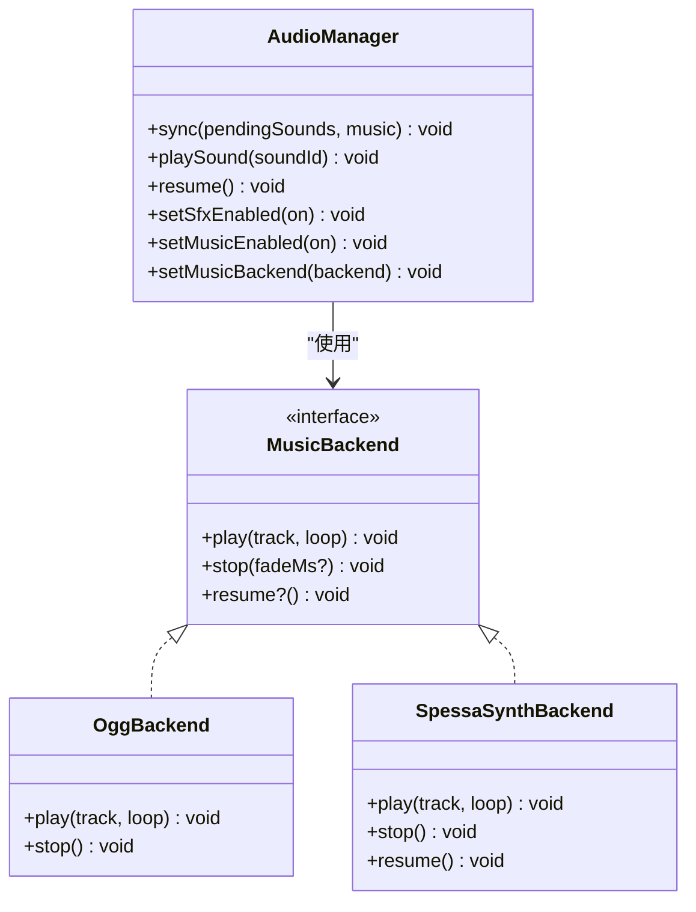
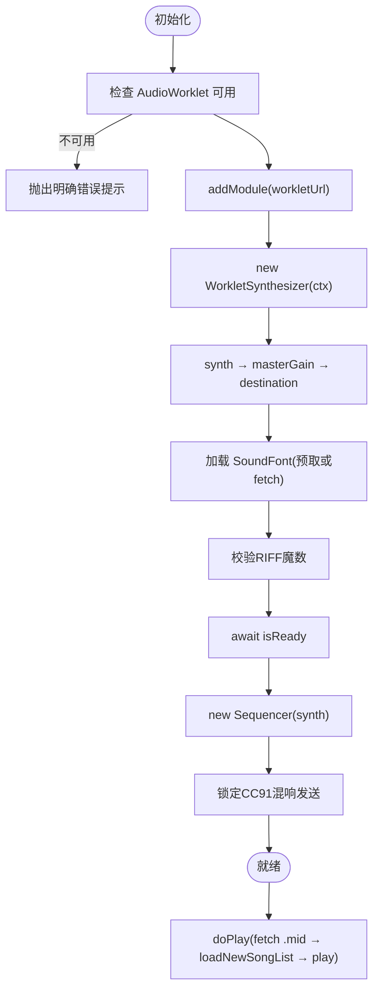
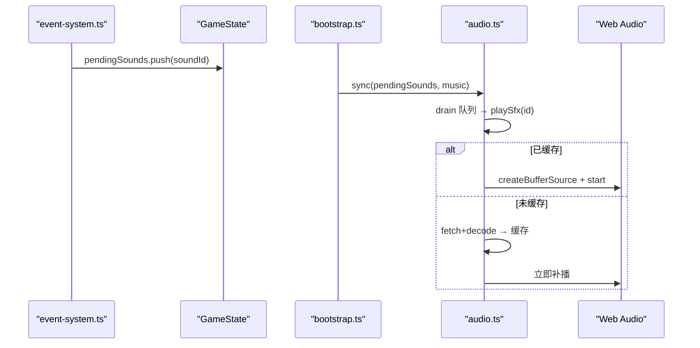
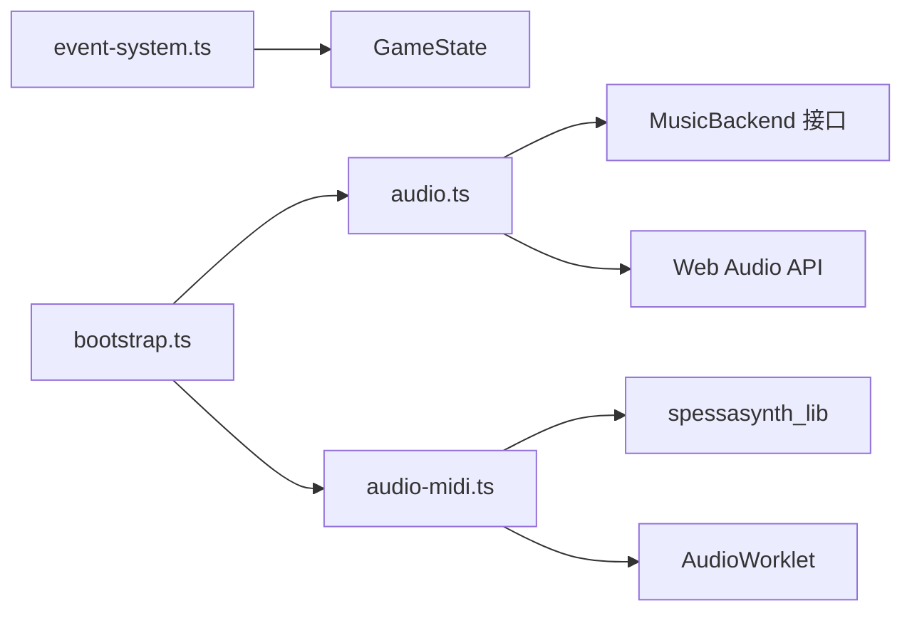

# 音频播放系统

<cite>
**本文引用的文件**   
- [packages/game/src/shell/audio.ts](file://packages/game/src/shell/audio.ts)
- [packages/game/src/shell/audio-midi.ts](file://packages/game/src/shell/audio-midi.ts)
- [packages/game/src/shell/audio-volume.ts](file://packages/game/src/shell/audio-volume.ts)
- [packages/game/src/shell/bootstrap.ts](file://packages/game/src/shell/bootstrap.ts)
- [packages/game/src/core/event-system.ts](file://packages/game/src/core/event-system.ts)
- [packages/game/src/core/battle/actions/magic.ts](file://packages/game/src/core/battle/actions/magic.ts)
- [packages/game/src/core/battle/battle-opcodes.ts](file://packages/game/src/core/battle/battle-opcodes.ts)
- [reference/sdlpal/sound.c](file://reference/sdlpal/sound.c)
</cite>

## 目录
1. [简介](#简介)
2. [项目结构](#项目结构)
3. [核心组件](#核心组件)
4. [架构总览](#架构总览)
5. [详细组件分析](#详细组件分析)
6. [依赖关系分析](#依赖关系分析)
7. [性能与内存优化](#性能与内存优化)
8. [故障排查指南](#故障排查指南)
9. [结论](#结论)
10. [附录：扩展与集成示例](#附录扩展与集成示例)

## 简介
本文件系统性地梳理了 Web Audio API 的使用、MIDI 音乐合成引擎的集成以及音效管理系统的设计。重点围绕 AudioManager 类的架构，包括 BGM 后端抽象、SFX 播放队列、音量控制与音频资源管理；并深入解析 SpessaSynth MIDI 后端的实现原理（SoundFont 加载、Web Worker/Worklet 音频处理与实时合成）。同时说明音频同步机制如何与游戏主循环协调、autoplay policy 的处理策略，并提供添加新音频格式、实现效果器、配置不同后端的实践指引。最后给出与核心层的集成方式及通过 gs.pendingSounds 传递音效请求的流程，以及性能优化与内存管理的最佳实践。

## 项目结构
音频相关代码位于 shell 层与 core 层之间：core 仅产生“音频意图”（如设置 BGM、推入 SFX 队列），shell 负责消费这些意图并驱动 Web Audio 或外部后端进行实际播放。

图表来源
- [packages/game/src/core/event-system.ts:83-112](file://packages/game/src/core/event-system.ts#L83-L112)
- [packages/game/src/core/battle/battle-opcodes.ts:1351-1364](file://packages/game/src/core/battle/battle-opcodes.ts#L1351-L1364)
- [packages/game/src/core/battle/actions/magic.ts:408-426](file://packages/game/src/core/battle/actions/magic.ts#L408-L426)
- [packages/game/src/shell/bootstrap.ts:165-196](file://packages/game/src/shell/bootstrap.ts#L165-L196)
- [packages/game/src/shell/audio.ts:197-312](file://packages/game/src/shell/audio.ts#L197-L312)
- [packages/game/src/shell/audio-midi.ts:51-169](file://packages/game/src/shell/audio-midi.ts#L51-L169)
- [packages/game/src/shell/audio-volume.ts:27-54](file://packages/game/src/shell/audio-volume.ts#L27-L54)

章节来源
- [packages/game/src/core/event-system.ts:83-112](file://packages/game/src/core/event-system.ts#L83-L112)
- [packages/game/src/shell/bootstrap.ts:165-196](file://packages/game/src/shell/bootstrap.ts#L165-L196)
- [packages/game/src/shell/audio.ts:197-312](file://packages/game/src/shell/audio.ts#L197-L312)
- [packages/game/src/shell/audio-midi.ts:51-169](file://packages/game/src/shell/audio-midi.ts#L51-L169)
- [packages/game/src/shell/audio-volume.ts:27-54](file://packages/game/src/shell/audio-volume.ts#L27-L54)

## 核心组件
- AudioManager：每帧消费核心层音频意图，统一调度 SFX 与 BGM。提供 setMusicEnabled/setSfxEnabled、setMusicBackend、resume 等接口。
- MusicBackend：BGM 后端抽象，支持 OGG 预渲染与 SpessaSynth 运行时 MIDI 合成两种实现。
- SpessaSynth 后端：基于 WorkletSynthesizer + Sequencer，加载 SoundFont，在 AudioWorklet 中实时合成，直接播 .mid。
- 音量控制器：持久化主音量与静音状态，输出有效音量到各后端。
- 同步入口 syncShellAudio：每帧将 GameState 中的 wNumMusic/musicLoop/pendingSounds 等映射为 AudioManager 调用。

章节来源
- [packages/game/src/shell/audio.ts:18-44](file://packages/game/src/shell/audio.ts#L18-L44)
- [packages/game/src/shell/audio.ts:197-312](file://packages/game/src/shell/audio.ts#L197-L312)
- [packages/game/src/shell/audio-midi.ts:22-38](file://packages/game/src/shell/audio-midi.ts#L22-L38)
- [packages/game/src/shell/audio-midi.ts:51-169](file://packages/game/src/shell/audio-midi.ts#L51-L169)
- [packages/game/src/shell/audio-volume.ts:27-54](file://packages/game/src/shell/audio-volume.ts#L27-L54)
- [packages/game/src/shell/bootstrap.ts:165-196](file://packages/game/src/shell/bootstrap.ts#L165-L196)

## 架构总览
整体采用“意图-消费”解耦：核心层只写 GameState 字段（如 wNumMusic、musicLoop、pendingSounds），shell 层每帧读取并驱动播放。BGM 支持双后端（OGG 与 SpessaSynth），SFX 走 Web Audio 解码缓存与去重。

图表来源
- [packages/game/src/core/event-system.ts:83-112](file://packages/game/src/core/event-system.ts#L83-L112)
- [packages/game/src/shell/bootstrap.ts:165-196](file://packages/game/src/shell/bootstrap.ts#L165-L196)
- [packages/game/src/shell/audio.ts:272-312](file://packages/game/src/shell/audio.ts#L272-L312)
- [packages/game/src/shell/audio.ts:217-270](file://packages/game/src/shell/audio.ts#L217-L270)
- [packages/game/src/shell/audio-midi.ts:64-76](file://packages/game/src/shell/audio-midi.ts#L64-L76)

## 详细组件分析

### AudioManager 类与 BGM 后端抽象
- 职责
  - 每帧同步：drain SFX 队列、轮询 BGM track 变化并切换。
  - 资源管理：SFX WAV 按需 fetch+decode，Map 缓存；避免重复请求。
  - 去重：同一 soundId 未播完前不再触发，对齐 sdlpal lastSFX 语义。
  - 开关：setMusicEnabled/setSfxEnabled 幂等，不影响正在播放的资源。
  - 注入：setMusicBackend 可替换 BGM 后端，并在注入时补播当前曲。
- 关键流程
  - sync：先清空 pendingSounds，再比较 music.track 是否变化，变化则 stop/play。
  - playSfx：优先命中缓存；未命中则异步加载并补播；ctx 未解锁则跳过并复位去重标记。
  - resume：用户手势后恢复 AudioContext，并转发给后端 resume。

图表来源
- [packages/game/src/shell/audio.ts:18-44](file://packages/game/src/shell/audio.ts#L18-L44)
- [packages/game/src/shell/audio.ts:197-312](file://packages/game/src/shell/audio.ts#L197-L312)
- [packages/game/src/shell/audio.ts:161-190](file://packages/game/src/shell/audio.ts#L161-L190)
- [packages/game/src/shell/audio-midi.ts:51-169](file://packages/game/src/shell/audio-midi.ts#L51-L169)

章节来源
- [packages/game/src/shell/audio.ts:197-312](file://packages/game/src/shell/audio.ts#L197-L312)
- [packages/game/src/shell/audio.ts:161-190](file://packages/game/src/shell/audio.ts#L161-L190)

### SpessaSynth MIDI 后端实现
- 初始化流程
  - 创建独立 AudioContext，注册 AudioWorklet processor。
  - 构建 WorkletSynthesizer，连接 masterGain → destination。
  - 加载 SoundFont（优先使用 bootstrap 预取数据，失败回退 fetch），校验 RIFF 魔数。
  - 锁定 CC91(reverb send) 防止 MIDI 覆盖混响量。
  - 创建 Sequencer，准备就绪后补播上次请求曲目。
- 播放逻辑
  - doPlay：若 ctx 处于 suspended 则尝试 resume；fetch .mid → loadNewSongList → 设置 loopCount → play。
  - resume：用户手势后确保 ctx 运行，并补播 last 曲目一次，防 autoplay 禁声。
- 音量控制
  - setBgmVolume 维护 masterGain.gain，支持在 synth 就绪前暂存值。

图表来源
- [packages/game/src/shell/audio-midi.ts:79-145](file://packages/game/src/shell/audio-midi.ts#L79-L145)
- [packages/game/src/shell/audio-midi.ts:64-76](file://packages/game/src/shell/audio-midi.ts#L64-L76)
- [packages/game/src/shell/audio-midi.ts:46-49](file://packages/game/src/shell/audio-midi.ts#L46-L49)

章节来源
- [packages/game/src/shell/audio-midi.ts:51-169](file://packages/game/src/shell/audio-midi.ts#L51-L169)

### 音效管理与队列
- 来源
  - 脚本 opcode 0x47 将 soundId 推入 gs.pendingSounds。
  - 战斗 bus 事件（敌死/敌攻/我攻）经 sfxForBattleEvent 映射为 soundId。
  - 法术 magic.sound 在未建链路径回落 push 到 pendingSounds。
- 消费
  - shell 每帧 drain pendingSounds，逐个调用 playSfx。
  - playSfx 内部做同号去重、缓存命中、异步加载补播、ctx 未解锁跳过并复位去重。

图表来源
- [packages/game/src/core/event-system.ts:110-112](file://packages/game/src/core/event-system.ts#L110-L112)
- [packages/game/src/core/battle/actions/magic.ts:408-426](file://packages/game/src/core/battle/actions/magic.ts#L408-L426)
- [packages/game/src/core/battle/battle-opcodes.ts:1351-1364](file://packages/game/src/core/battle/battle-opcodes.ts#L1351-L1364)
- [packages/game/src/shell/bootstrap.ts:165-196](file://packages/game/src/shell/bootstrap.ts#L165-L196)
- [packages/game/src/shell/audio.ts:254-270](file://packages/game/src/shell/audio.ts#L254-L270)

章节来源
- [packages/game/src/core/event-system.ts:110-112](file://packages/game/src/core/event-system.ts#L110-L112)
- [packages/game/src/core/battle/actions/magic.ts:408-426](file://packages/game/src/core/battle/actions/magic.ts#L408-L426)
- [packages/game/src/core/battle/battle-opcodes.ts:1351-1364](file://packages/game/src/core/battle/battle-opcodes.ts#L1351-L1364)
- [packages/game/src/shell/bootstrap.ts:165-196](file://packages/game/src/shell/bootstrap.ts#L165-L196)
- [packages/game/src/shell/audio.ts:254-270](file://packages/game/src/shell/audio.ts#L254-L270)

### 音量控制与静音
- 主音量控制器
  - 读 localStorage 恢复上次设定，默认 0.8，支持静音键。
  - applyVolume 回调由 bootstrap 注入，分别推送至 audio-midi.setBgmVolume 与 audio.ts 的 OGG 系数 setOggVolumeScale。
- 分路控制
  - 支持多通道独立音量键与共享静音键，便于工具面板一键静音。

章节来源
- [packages/game/src/shell/audio-volume.ts:27-54](file://packages/game/src/shell/audio-volume.ts#L27-L54)
- [packages/game/src/shell/audio.ts:145-159](file://packages/game/src/shell/audio.ts#L145-L159)
- [packages/game/src/shell/audio-midi.ts:46-49](file://packages/game/src/shell/audio-midi.ts#L46-L49)

### 与核心层集成与同步
- 核心层
  - opcode 0x43/0x45/0x77/0xA3 等更新 wNumMusic/musicLoop/wNumBattleMusic 等。
  - opcode 0x47 将 SFX 入队 gs.pendingSounds。
- 壳层
  - syncShellAudio 每帧读取 gs.fMusicEnabled/fSoundEnabled、gs.battleState 等，计算最终 track/loop，调用 AudioManager.sync。
  - 战斗期间扫描 drained 视觉事件，映射为 SFX 并即时播放。

章节来源
- [packages/game/src/core/event-system.ts:83-112](file://packages/game/src/core/event-system.ts#L83-L112)
- [packages/game/src/shell/bootstrap.ts:165-196](file://packages/game/src/shell/bootstrap.ts#L165-L196)

## 依赖关系分析
- 模块耦合
  - event-system.ts 仅写 GameState，不依赖 Web Audio。
  - bootstrap.ts 作为桥接，聚合 core 与 shell。
  - audio.ts 依赖 MusicBackend 接口，松耦合可插拔。
  - audio-midi.ts 依赖 spessasynth_lib，封装复杂初始化与 autoplay 处理。
- 外部依赖
  - Web Audio API（AudioContext、AudioWorklet、GainNode、BufferSource）。
  - SpessaSynth（WorkletSynthesizer、Sequencer、soundBankManager）。
  - 资源：/extracted/sounds/*.wav、/extracted/music/*.mid、public/soundfont.sf3、public/spessasynth_processor.min.js。

图表来源
- [packages/game/src/core/event-system.ts:83-112](file://packages/game/src/core/event-system.ts#L83-L112)
- [packages/game/src/shell/bootstrap.ts:165-196](file://packages/game/src/shell/bootstrap.ts#L165-L196)
- [packages/game/src/shell/audio.ts:18-44](file://packages/game/src/shell/audio.ts#L18-L44)
- [packages/game/src/shell/audio-midi.ts:19-20](file://packages/game/src/shell/audio-midi.ts#L19-L20)

章节来源
- [packages/game/src/core/event-system.ts:83-112](file://packages/game/src/core/event-system.ts#L83-L112)
- [packages/game/src/shell/audio.ts:18-44](file://packages/game/src/shell/audio.ts#L18-L44)
- [packages/game/src/shell/audio-midi.ts:19-20](file://packages/game/src/shell/audio-midi.ts#L19-L20)

## 性能与内存优化
- SFX 缓存与去重
  - Map<number, AudioBuffer> 缓存已解码缓冲，避免重复 decodeAudioData。
  - Set<number> 记录正在 fetch/decode 的请求，避免并发重复。
  - 同号去重(lastSFX)避免重叠播放，减少 CPU 与声道占用。
- 资源释放
  - OGG 后端切换曲目时 removeAttribute('src') + load() 彻底释放底层媒体资源，避免游离 HTMLAudioElement 堆积。
- 网络与解码
  - 首次 SFX 异步加载完成后立即补播，降低首音延迟。
  - MIDI 后端优先使用 bootstrap 预取的 soundfont 数据，避免二次下载。
- 线程模型
  - 合成在 AudioWorklet 中进行，避免主线程阻塞。
- 建议
  - 对高频短音效，尽量预加载常用 id 的 WAV。
  - 合理设置 SFX 增益节点，避免过度串联造成额外开销。
  - 对长 BGM，优先使用 OGG 预渲染路径以降低启动时延与内存峰值。

章节来源
- [packages/game/src/shell/audio.ts:202-235](file://packages/game/src/shell/audio.ts#L202-L235)
- [packages/game/src/shell/audio.ts:254-270](file://packages/game/src/shell/audio.ts#L254-L270)
- [packages/game/src/shell/audio.ts:161-190](file://packages/game/src/shell/audio.ts#L161-L190)
- [packages/game/src/shell/audio-midi.ts:100-120](file://packages/game/src/shell/audio-midi.ts#L100-L120)

## 故障排查指南
- 无声音但 SFX 正常
  - 检查是否非 secure context（http://局域网IP）导致 AudioWorklet 不可用，MIDI 后端会抛错提示。
  - 确认 public/soundfont.sf3 存在且内容为 RIFF 魔数，否则初始化失败静默。
- 有 BGM 无 SFX
  - 检查是否在用户交互前触发了播放（autoplay policy），需等待首个 keydown/pointerdown 后 resume。
- 切歌卡顿或内存增长
  - 确认 OGG 后端在切换时执行了 removeAttribute('src') + load() 释放旧元素。
- 混响过大
  - 调整 reverbAmount（默认 0 全干），必要时微调至低值。
- 参考 sdlpal 行为
  - SOUND_FillBuffer 与 lastSFX 语义用于对齐原版行为，确保去重与缓冲消费一致。

章节来源
- [packages/game/src/shell/audio-midi.ts:85-91](file://packages/game/src/shell/audio-midi.ts#L85-L91)
- [packages/game/src/shell/audio-midi.ts:109-119](file://packages/game/src/shell/audio-midi.ts#L109-L119)
- [packages/game/src/shell/audio.ts:237-252](file://packages/game/src/shell/audio.ts#L237-L252)
- [reference/sdlpal/sound.c:890-897](file://reference/sdlpal/sound.c#L890-L897)

## 结论
本系统以“意图-消费”模式解耦核心与播放层，AudioManager 作为统一入口，配合可插拔的 BGM 后端与完善的 SFX 管理机制，既满足高保真还原（SpessaSynth + SoundFont），又兼顾性能与稳定性（OGG 预渲染路径、缓存与去重）。通过每帧同步与 autoplay 策略处理，实现了与游戏主循环的良好协作。

## 附录：扩展与集成示例

### 添加新的音频格式支持（以 MP3 为例）
- 目标：在 AudioManager 中新增对 mp3 的支持，复用现有缓存与播放管线。
- 步骤
  - 在 sfxUrl 附近新增一个 URL 生成函数（例如 mp3Url），约定资源路径。
  - 在 loadSfx 分支中增加对 mp3 的 fetch+decode 路径（Web Audio 原生支持有限，可能需要第三方解码器或转码为 wav）。
  - 在 playSfx 中根据 soundId 后缀或类型选择对应解码路径。
  - 在测试中补充用例，验证缓存命中与补播逻辑。
- 参考位置
  - [packages/game/src/shell/audio.ts:46-49](file://packages/game/src/shell/audio.ts#L46-L49)
  - [packages/game/src/shell/audio.ts:217-235](file://packages/game/src/shell/audio.ts#L217-L235)
  - [packages/game/src/shell/audio.ts:254-270](file://packages/game/src/shell/audio.ts#L254-L270)

### 实现音频效果器（插入式 GainNode 链）
- 目标：在 SFX 播放链路中插入效果器（如压缩、混响）。
- 步骤
  - 在 play 中创建自定义节点（例如 DynamicsCompressorNode），串联 src → effect → gain → destination。
  - 暴露 setEffectParams 接口，供 UI 动态调节参数。
  - 注意节点创建成本，尽量复用或池化。
- 参考位置
  - [packages/game/src/shell/audio.ts:237-252](file://packages/game/src/shell/audio.ts#L237-L252)

### 配置不同的音频后端
- 目标：在运行时选择 OGG 或 SpessaSynth 后端。
- 步骤
  - 构造 createOggMusicBackend(baseUrl) 或 createSpessaSynthBackend(opts)。
  - 调用 audio.setMusicBackend(backend) 注入。
  - 如需预取 soundfont，在 bootstrap 阶段下载并传入 soundfontData。
- 参考位置
  - [packages/game/src/shell/audio.ts:161-190](file://packages/game/src/shell/audio.ts#L161-L190)
  - [packages/game/src/shell/audio-midi.ts:51-169](file://packages/game/src/shell/audio-midi.ts#L51-L169)

### 通过 gs.pendingSounds 传递音效请求
- 目标：从任意子系统向音频系统提交音效。
- 步骤
  - 在核心逻辑中向 gs.pendingSounds 追加 soundId。
  - shell 每帧调用 syncShellAudio，自动 drain 并播放。
- 参考位置
  - [packages/game/src/core/event-system.ts:110-112](file://packages/game/src/core/event-system.ts#L110-L112)
  - [packages/game/src/core/battle/actions/magic.ts:408-426](file://packages/game/src/core/battle/actions/magic.ts#L408-L426)
  - [packages/game/src/core/battle/battle-opcodes.ts:1351-1364](file://packages/game/src/core/battle/battle-opcodes.ts#L1351-L1364)
  - [packages/game/src/shell/bootstrap.ts:165-196](file://packages/game/src/shell/bootstrap.ts#L165-L196)