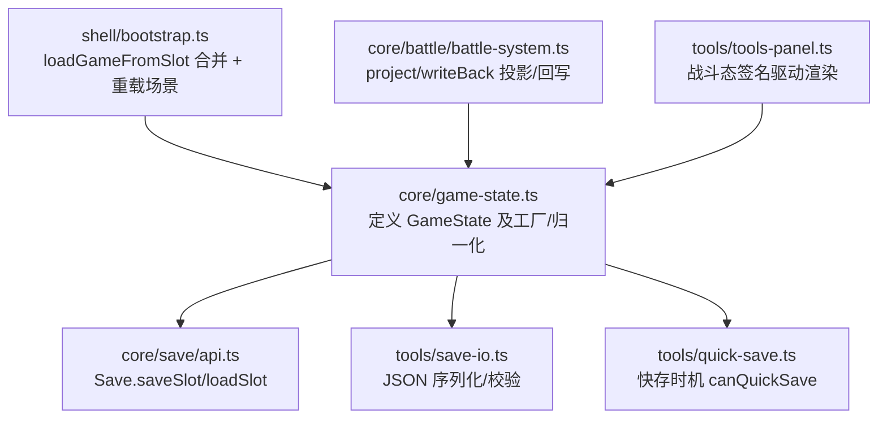
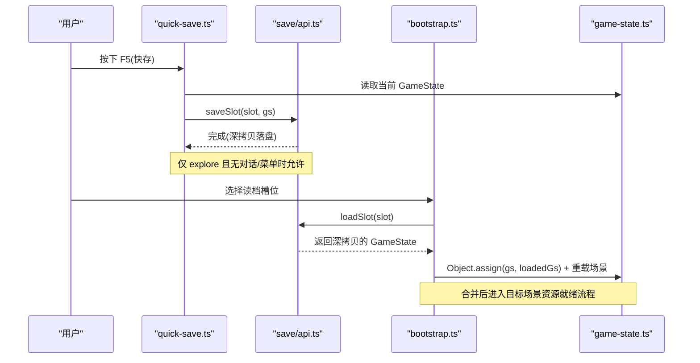
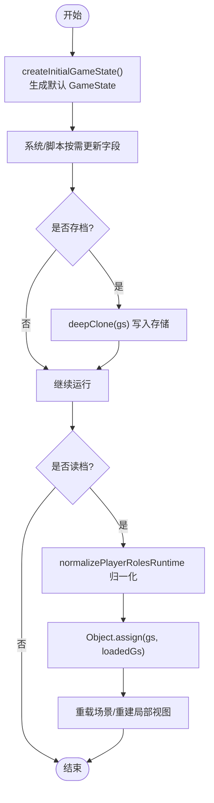
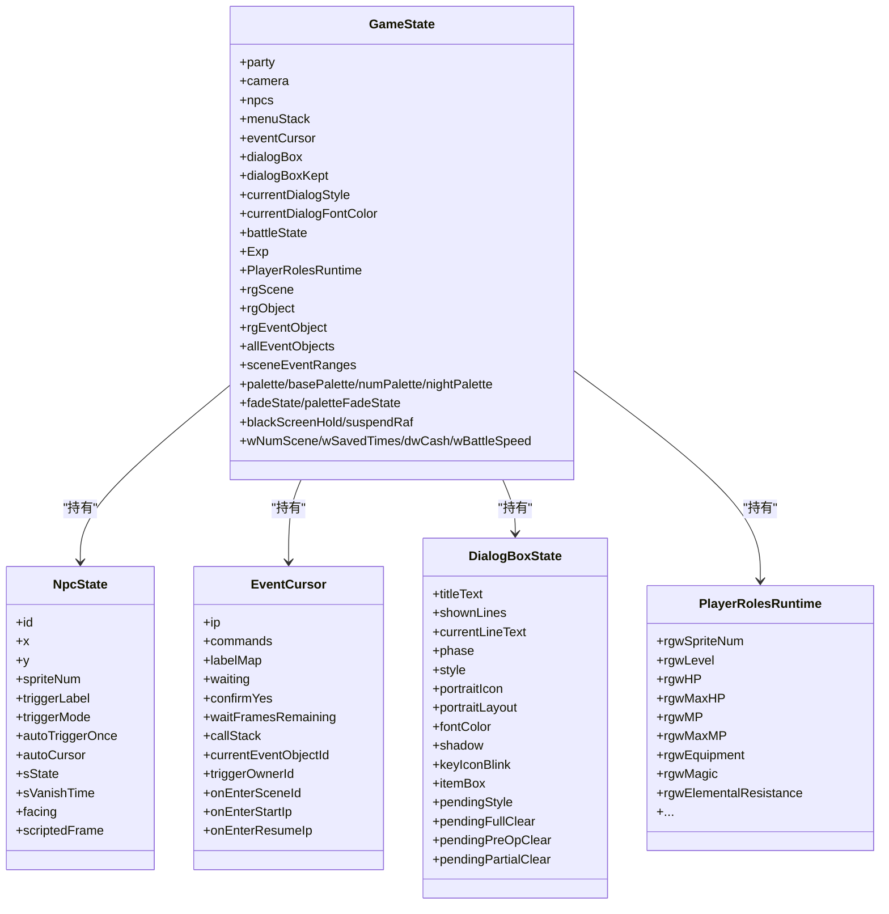
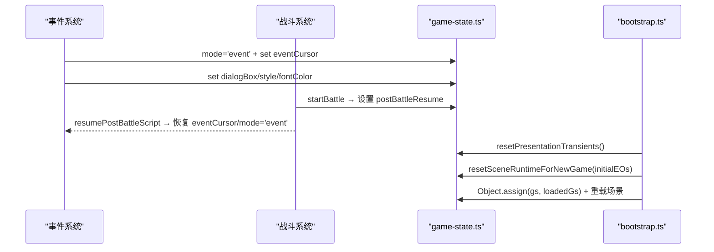
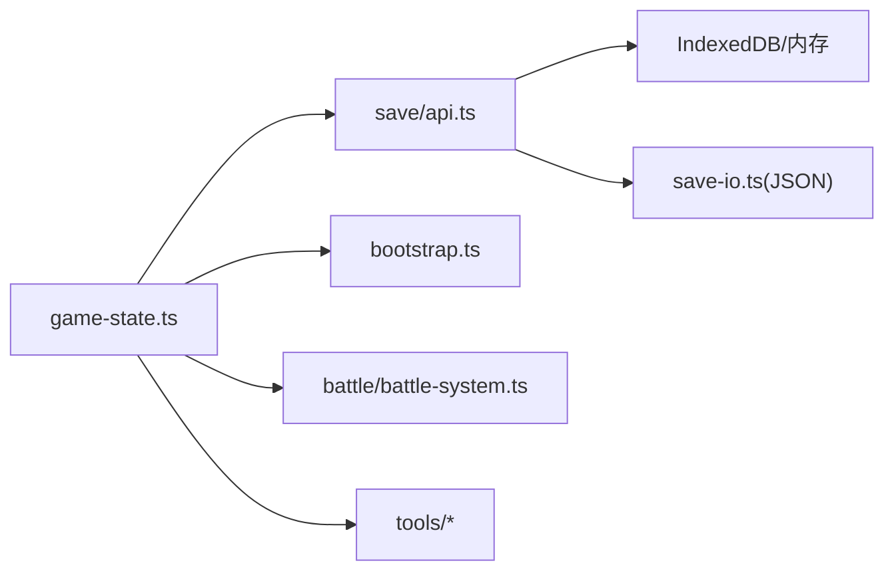

# GameState 状态管理

<cite>
**本文引用的文件**   
- [game-state.ts](file://packages/game/src/core/game-state.ts)
- [game-state.test.ts](file://packages/game/src/core/game-state.test.ts)
- [api.ts](file://packages/game/src/core/save/api.ts)
- [save-io.ts](file://packages/game/src/tools/save-io.ts)
- [quick-save.ts](file://packages/game/src/tools/quick-save.ts)
- [bootstrap.ts](file://packages/game/src/shell/bootstrap.ts)
- [battle-system.ts](file://packages/game/src/core/battle/battle-system.ts)
- [tools-panel.ts](file://packages/game/src/tools/tools-panel.ts)
</cite>

## 目录
1. [简介](#简介)
2. [项目结构](#项目结构)
3. [核心组件](#核心组件)
4. [架构总览](#架构总览)
5. [详细组件分析](#详细组件分析)
6. [依赖关系分析](#依赖关系分析)
7. [性能与不可变性](#性能与不可变性)
8. [故障排查指南](#故障排查指南)
9. [结论](#结论)
10. [附录](#附录)

## 简介
本文件围绕 GameState 作为“唯一真相源”的设计展开，系统性说明其字段语义、生命周期、序列化与存档机制、模式切换一致性保障，以及扩展新字段的最佳实践。GameState 集中承载队伍位置、相机、NPC、对话框、菜单栈、战斗上下文、特效与音频等运行时数据，并通过严格的工厂函数、归一化与深拷贝策略保证可序列化、可测试与可扩展。

## 项目结构
- 核心定义与工厂：位于 core/game-state.ts，包含所有类型、接口、初始态构造、重置与归一化工具。
- 存档与导入导出：core/save/api.ts 提供 Save API；tools/save-io.ts 提供 JSON 格式校验与导入导出工具。
- 快速存档：tools/quick-save.ts 提供 F5/F9 快捷键入口与时机判定。
- 读档恢复：shell/bootstrap.ts 在加载存档后合并到全局 gs，并触发场景重载。
- 战斗集成：core/battle/battle-system.ts 通过投影/回写与 GameState 的 PlayerRolesRuntime 交互。
- 调试面板：tools/tools-panel.ts 基于 GameState 构建轻量签名驱动 UI 刷新。

**图示来源** 
- [game-state.ts:1838-1907](file://packages/game/src/core/game-state.ts#L1838-L1907)
- [api.ts:55-96](file://packages/game/src/core/save/api.ts#L55-L96)
- [save-io.ts:7-25](file://packages/game/src/tools/save-io.ts#L7-L25)
- [quick-save.ts:17-20](file://packages/game/src/tools/quick-save.ts#L17-L20)
- [bootstrap.ts:1607-1621](file://packages/game/src/shell/bootstrap.ts#L1607-L1621)
- [battle-system.ts:174-186](file://packages/game/src/core/battle/battle-system.ts#L174-L186)
- [tools-panel.ts:804-830](file://packages/game/src/tools/tools-panel.ts#L804-L830)

**章节来源**
- [game-state.ts:1838-1907](file://packages/game/src/core/game-state.ts#L1838-L1907)
- [api.ts:55-96](file://packages/game/src/core/save/api.ts#L55-L96)
- [save-io.ts:7-25](file://packages/game/src/tools/save-io.ts#L7-L25)
- [quick-save.ts:17-20](file://packages/game/src/tools/quick-save.ts#L17-L20)
- [bootstrap.ts:1607-1621](file://packages/game/src/shell/bootstrap.ts#L1607-L1621)
- [battle-system.ts:174-186](file://packages/game/src/core/battle/battle-system.ts#L174-L186)
- [tools-panel.ts:804-830](file://packages/game/src/tools/tools-panel.ts#L804-L830)

## 核心组件
- GameState 接口：单一对象承载全部运行时数据，包括 party/camera/npcs/dialogBox/menuStack 等核心结构，以及 Exp、PlayerRolesRuntime、rgScene/rgObject/rgEventObject 等持久化子结构。
- 工厂与初始化：createInitialGameState 提供全量默认值；loadDefaultGame 对齐 SDL 新游戏重置；resetPresentationTransients/resetSceneRuntimeForNewGame 负责跨模式/新游戏的瞬态清理。
- 归一化与兼容：normalizePlayerRolesRuntime 对旧存档缺失字段进行自愈；hydrateNpcStaticDefaults 补齐 NPC 静态缺省。
- 投影/回写：projectRuntimeToBattleRoles / writeBackBattleRolesToRuntime 连接大世界与战斗的数据边界。
- 存档与导入导出：Save API 使用 deepClone 避免共享引用；save-io.ts 提供 JSON 格式头与必要字段校验。

**章节来源**
- [game-state.ts:654-1299](file://packages/game/src/core/game-state.ts#L654-L1299)
- [game-state.ts:1425-1526](file://packages/game/src/core/game-state.ts#L1425-L1526)
- [game-state.ts:1796-1800](file://packages/game/src/core/game-state.ts#L1796-L1800)
- [game-state.ts:1550-1639](file://packages/game/src/core/game-state.ts#L1550-L1639)
- [game-state.ts:1729-1740](file://packages/game/src/core/game-state.ts#L1729-L1740)
- [api.ts:55-96](file://packages/game/src/core/save/api.ts#L55-L96)
- [save-io.ts:7-25](file://packages/game/src/tools/save-io.ts#L7-L25)

## 架构总览
GameState 作为唯一真相源，被各系统（事件、场景、战斗、菜单、呈现）共同读写。为保证一致性：
- 只允许通过受控工厂/工具函数创建或变更状态。
- 存档路径统一走 Save API，内部深拷贝避免外部 mutate 污染存档。
- 读档路径由 bootstrap 合并到现有 gs，随后触发场景重载以重建局部视图。

**图示来源** 
- [quick-save.ts:17-20](file://packages/game/src/tools/quick-save.ts#L17-L20)
- [api.ts:55-96](file://packages/game/src/core/save/api.ts#L55-L96)
- [bootstrap.ts:1607-1621](file://packages/game/src/shell/bootstrap.ts#L1607-L1621)
- [game-state.ts:1838-1907](file://packages/game/src/core/game-state.ts#L1838-L1907)

## 详细组件分析

### 字段语义与生命周期
- 队伍与相机
  - party: {x,y,facing} 队长像素坐标与朝向；camera 为屏幕左上对应的世界坐标，遵循 camera.x = party.x - PARTYOFFSET_X 的规则。
  - trail/followerFrozenOffset: 跟随者轨迹与冻结偏移，用于骑乘/非走路时的相对位置保持。
- NPC 与事件
  - npcs: 当前场景切片，元素引用 allEventObjects，脚本改动自动持久。
  - allEventObjects/sceneEventRanges: 全局事件对象表与场景区间，支持按 scene 切片。
  - eventCursor: 触发脚本游标，含 waiting、callStack、onEnter 相关记录等。
- 对话框
  - dialogBox/dialogBoxKept/currentDialogStyle/fontColor/portraitIcon/portraitLayout: 完整实现打字、翻页、样式切换、头像布局与 RestoreScreen 行为。
- 菜单栈
  - menuStack: ActiveMenuEntry[]，显式建模 sdlpal 的 modal 菜单栈。
- 战斗
  - battleState: 战斗临时状态；writeBackBattleRolesToRuntime 将 HP/MP 战果回写 PlayerRolesRuntime。
- 特效与音频
  - palette/basePalette/numPalette/nightPalette/paletteFadeState/fadeState/blackScreenHold/suspendRNG/rngFrameActive 等控制淡入淡出、昼夜调色板、全屏动画与黑屏保持。
- 全局杂项
  - wNumScene/wSavedTimes/dwCash/wBattleSpeed/iCurInvMenuItem 等，覆盖存档与 UI 记忆。

**章节来源**
- [game-state.ts:654-1299](file://packages/game/src/core/game-state.ts#L654-L1299)
- [game-state.ts:1838-1907](file://packages/game/src/core/game-state.ts#L1838-L1907)

### 状态变更与不可变性原则
- 工厂与工具函数
  - createInitialGameState 提供不可变初始态；loadDefaultGame 对齐 SDL 新游戏重置；resetPresentationTransients/resetSceneRuntimeForNewGame 清理上一局残留。
- 深拷贝与快照
  - Save API 在保存/加载时均使用 deepClone，确保存档与运行态隔离。
- 归一化与兼容
  - normalizePlayerRolesRuntime 用模板补齐旧存档缺失字段，避免 undefined 访问崩溃。
- 投影/回写边界
  - projectRuntimeToBattleRoles 将 runtime SoA 转为战斗 object；writeBackBattleRolesToRuntime 将 HP/MP 战果回写。

**图示来源** 
- [game-state.ts:1838-1907](file://packages/game/src/core/game-state.ts#L1838-L1907)
- [api.ts:55-96](file://packages/game/src/core/save/api.ts#L55-L96)
- [game-state.ts:1796-1800](file://packages/game/src/core/game-state.ts#L1796-L1800)
- [bootstrap.ts:1607-1621](file://packages/game/src/shell/bootstrap.ts#L1607-L1621)

**章节来源**
- [game-state.ts:1425-1526](file://packages/game/src/core/game-state.ts#L1425-L1526)
- [game-state.ts:1796-1800](file://packages/game/src/core/game-state.ts#L1796-L1800)
- [api.ts:55-96](file://packages/game/src/core/save/api.ts#L55-L96)
- [bootstrap.ts:1607-1621](file://packages/game/src/shell/bootstrap.ts#L1607-L1621)

### 关键数据结构类图

**图示来源** 
- [game-state.ts:654-1299](file://packages/game/src/core/game-state.ts#L654-L1299)

**章节来源**
- [game-state.ts:654-1299](file://packages/game/src/core/game-state.ts#L654-L1299)

### 模式切换与一致性
- 顶层模式：explore/event/battle/menu。切换时通过 resetPresentationTransients 清理演出/对话框/淡入淡出等瞬态，防止跨模式污染。
- 新游戏：resetSceneRuntimeForNewGame 清空 rgScene/rgObject/rgEventObject 与 onEnter 停点，并从初始事件对象表重建 allEventObjects，断开上一局引用。
- 读档：bootstrap.loadGameFromSlot 先停止音乐，再 Object.assign 合并，最后触发场景重载，确保资源与状态一致。

**图示来源** 
- [game-state.ts:1480-1526](file://packages/game/src/core/game-state.ts#L1480-L1526)
- [game-state.ts:1684-1716](file://packages/game/src/core/game-state.ts#L1684-L1716)
- [bootstrap.ts:1607-1621](file://packages/game/src/shell/bootstrap.ts#L1607-L1621)

**章节来源**
- [game-state.ts:1480-1526](file://packages/game/src/core/game-state.ts#L1480-L1526)
- [game-state.ts:1684-1716](file://packages/game/src/core/game-state.ts#L1684-L1716)
- [bootstrap.ts:1607-1621](file://packages/game/src/shell/bootstrap.ts#L1607-L1621)

### 安全读取与更新示例（路径指引）
- 读取队伍位置与相机：参考 createInitialGameState 中 party/camera 初始化逻辑。
- 更新 NPC 状态：通过 sliceSceneEventObjects 获取当前场景切片，修改元素即持久化。
- 推进对话框：startDialogLine 配合 dialogBox 状态机推进 phase。
- 存档/读档：Save.saveSlot/Load.loadSlot 与 save-io.ts 的 JSON 校验。
- 战斗投影/回写：projectRuntimeToBattleRoles / writeBackBattleRolesToRuntime。

**章节来源**
- [game-state.ts:1838-1907](file://packages/game/src/core/game-state.ts#L1838-L1907)
- [game-state.ts:2057-2069](file://packages/game/src/core/game-state.ts#L2057-L2069)
- [game-state.ts:1550-1639](file://packages/game/src/core/game-state.ts#L1550-L1639)
- [game-state.ts:1729-1740](file://packages/game/src/core/game-state.ts#L1729-L1740)
- [save-io.ts:7-25](file://packages/game/src/tools/save-io.ts#L7-L25)
- [api.ts:55-96](file://packages/game/src/core/save/api.ts#L55-L96)

### 扩展新状态字段的最佳实践
- 在 GameState 接口新增字段，并在 createInitialGameState 中赋予合理默认值。
- 若为新持久字段：
  - 在 loadDefaultGame 中设置新游戏默认。
  - 在 resetSceneRuntimeForNewGame 中清理上一局脏值。
  - 在 normalizePlayerRolesRuntime 或对应归一化函数中处理旧档兼容。
- 若为运行时瞬态：
  - 在 resetPresentationTransients 中清理。
- 验证：
  - 补充 game-state.test.ts 中的 round-trip JSON 断言与新字段默认值断言。
  - 若涉及存档，增加 Save API 的 roundtrip 测试。

**章节来源**
- [game-state.ts:1838-1907](file://packages/game/src/core/game-state.ts#L1838-L1907)
- [game-state.ts:1425-1526](file://packages/game/src/core/game-state.ts#L1425-L1526)
- [game-state.ts:1796-1800](file://packages/game/src/core/game-state.ts#L1796-L1800)
- [game-state.test.ts:272-332](file://packages/game/src/core/game-state.test.ts#L272-L332)

## 依赖关系分析
- 模块耦合
  - game-state.ts 为核心，被 save、bootstrap、battle、tools 等多处消费。
  - Save API 依赖 deepClone 与 IndexedDB/内存后端。
  - bootstrap 在合并后触发场景重载，确保资源就绪。
- 外部依赖
  - JSON 序列化/反序列化（save-io.ts）。
  - IndexedDB（可选持久化后端）。
- 潜在循环
  - 当前未见直接循环依赖；注意 battle-system 通过 get/set 存取战斗资源键，避免侵入 GameState 接口。

**图示来源** 
- [game-state.ts:1838-1907](file://packages/game/src/core/game-state.ts#L1838-L1907)
- [api.ts:55-96](file://packages/game/src/core/save/api.ts#L55-L96)
- [save-io.ts:7-25](file://packages/game/src/tools/save-io.ts#L7-L25)
- [bootstrap.ts:1607-1621](file://packages/game/src/shell/bootstrap.ts#L1607-L1621)
- [battle-system.ts:174-186](file://packages/game/src/core/battle/battle-system.ts#L174-L186)

**章节来源**
- [game-state.ts:1838-1907](file://packages/game/src/core/game-state.ts#L1838-L1907)
- [api.ts:55-96](file://packages/game/src/core/save/api.ts#L55-L96)
- [save-io.ts:7-25](file://packages/game/src/tools/save-io.ts#L7-L25)
- [bootstrap.ts:1607-1621](file://packages/game/src/shell/bootstrap.ts#L1607-L1621)
- [battle-system.ts:174-186](file://packages/game/src/core/battle/battle-system.ts#L174-L186)

## 性能与不可变性
- 深拷贝成本
  - Save API 每次存档/读档都深拷贝，建议仅在必要时触发（如快存限制在 explore 且无对话/菜单）。
- 稀疏结构与引用
  - rgScene/rgObject/rgEventObject/allEventObjects 采用稀疏 Record 与引用切片，减少冗余与提升序列化效率。
- 投影/回写
  - 战斗前后通过投影/回写避免直接 mutate 静态角色数据，降低副作用风险。
- 帧级与时间驱动
  - nowMs 墙钟驱动对话打字等高频视觉子系统，不受 10fps tick 限制，提升体验稳定性。

[本节为通用指导，不直接分析具体文件]

## 故障排查指南
- 读档后画面异常
  - 检查 bootstrap.loadGameFromSlot 是否正确合并并触发场景重载。
- 存档不一致
  - 确认 Save API 使用了 deepClone；检查 save-io.ts 的格式与必要字段校验。
- 新游戏串档
  - 核对 resetSceneRuntimeForNewGame 是否清除了 rgScene/rgObject/rgEventObject 与 onEnter 停点。
- 对话框显示异常
  - 关注 dialogBox 的 pendingFullClear/pendingPreOpClear/pendingPartialClear 分支逻辑。
- 战斗血量复原
  - 确认 writeBackBattleRolesToRuntime 已调用且仅回写 partyMembers。

**章节来源**
- [bootstrap.ts:1607-1621](file://packages/game/src/shell/bootstrap.ts#L1607-L1621)
- [api.ts:55-96](file://packages/game/src/core/save/api.ts#L55-L96)
- [save-io.ts:7-25](file://packages/game/src/tools/save-io.ts#L7-L25)
- [game-state.ts:1480-1526](file://packages/game/src/core/game-state.ts#L1480-L1526)
- [game-state.ts:1729-1740](file://packages/game/src/core/game-state.ts#L1729-L1740)

## 结论
GameState 作为唯一真相源，通过清晰的字段分层、严格的工厂/归一化/深拷贝策略，以及与存档、读档、战斗系统的解耦交互，实现了高内聚、低耦合的状态管理。遵循本文的实践与规范，可在保证一致性的前提下高效扩展新字段与功能。

[本节为总结性内容，不直接分析具体文件]

## 附录
- 单元测试要点
  - 初始态断言、JSON round-trip、新字段默认值、Save API roundtrip、战斗投影/回写、死亡脚本预判等。
- 调试技巧
  - tools-panel 的战斗态签名可快速定位 HP/MP/状态变化；结合 nowMs 与 dialogBox 时序断言排查打字速度问题。

**章节来源**
- [game-state.test.ts:272-332](file://packages/game/src/core/game-state.test.ts#L272-L332)
- [tools-panel.ts:804-830](file://packages/game/src/tools/tools-panel.ts#L804-L830)