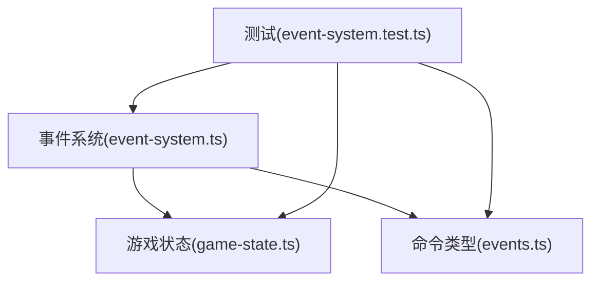
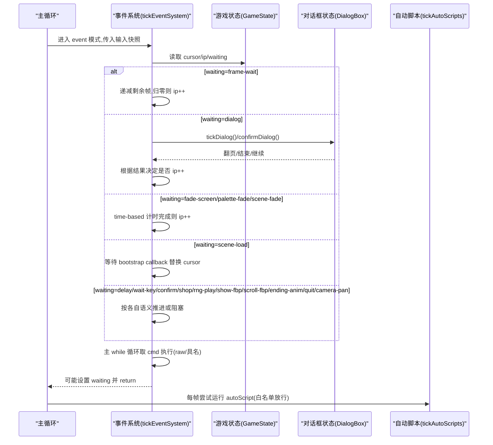
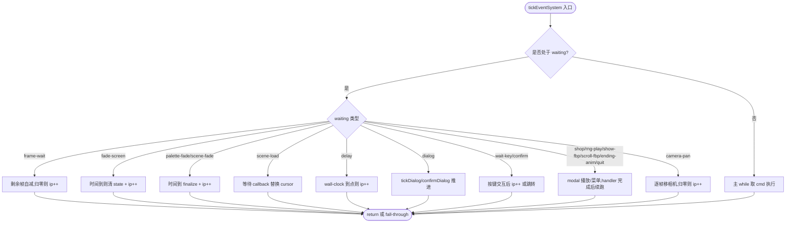
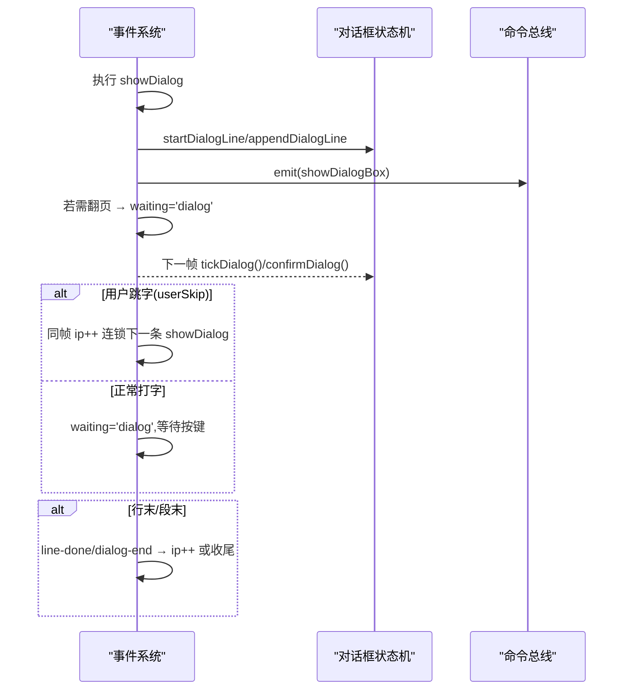
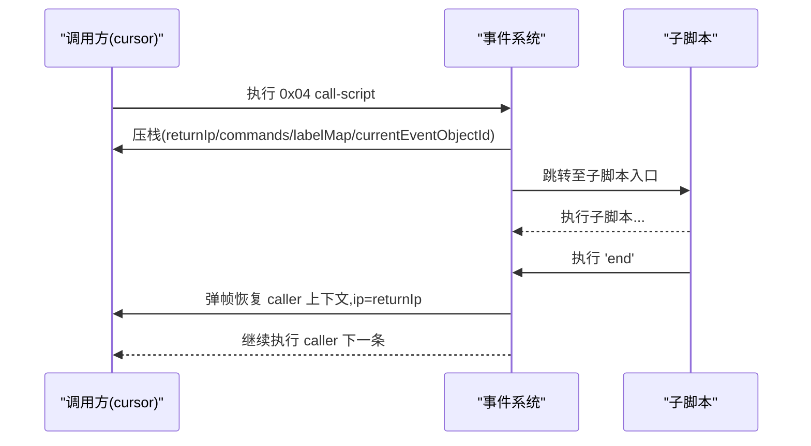
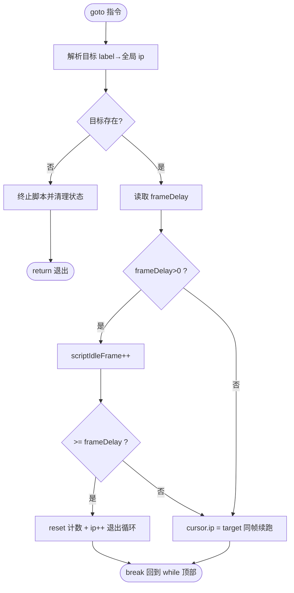
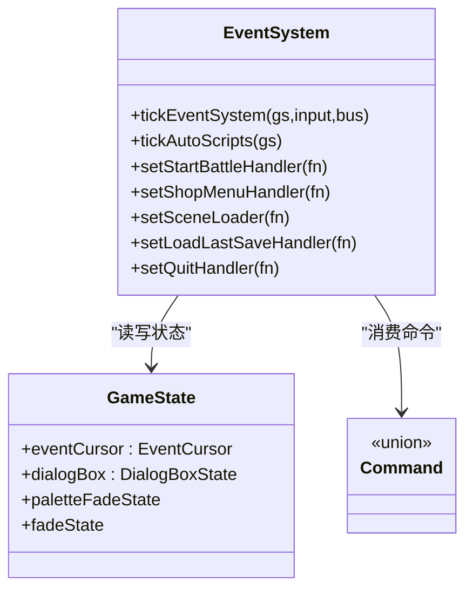

# 事件游标与协程

<cite>
**本文引用的文件**   
- [event-system.ts](file://packages/game/src/core/event-system.ts)
- [game-state.ts](file://packages/game/src/core/game-state.ts)
- [events.ts](file://packages/shared/src/events.ts)
- [event-system.test.ts](file://packages/game/src/core/event-system.test.ts)
</cite>

## 目录
1. [简介](#简介)
2. [项目结构](#项目结构)
3. [核心组件](#核心组件)
4. [架构总览](#架构总览)
5. [详细组件分析](#详细组件分析)
6. [依赖关系分析](#依赖关系分析)
7. [性能考量](#性能考量)
8. [故障排查指南](#故障排查指南)
9. [结论](#结论)
10. [附录](#附录)

## 简介
本文件围绕 EventCursor 协程式步进器，系统性阐述其执行模型与关键机制：指令指针 ip 的管理、commands/labelMap 脚本解析（含 P2#5 单一全局数组）、waiting 状态机、各类等待类型处理逻辑、callStack 子脚本调用机制、currentEventObjectId 作用域管理、triggerOwnerId 持久化策略，并给出暂停/恢复、子脚本返回、错误处理的示例路径。

## 项目结构
- 事件系统位于 packages/game/src/core/event-system.ts，负责事件模式下的协程步进、等待状态机、opcode 分发与交互。
- 事件游标与对话状态定义在 packages/game/src/core/game-state.ts。
- 命令类型与具名化结构在 packages/shared/src/events.ts。
- 行为验证与用例在 packages/game/src/core/event-system.test.ts。

图表来源
- [event-system.ts:1496-1599](file://packages/game/src/core/event-system.ts#L1496-L1599)
- [game-state.ts:226-343](file://packages/game/src/core/game-state.ts#L226-L343)
- [events.ts:162-178](file://packages/shared/src/events.ts#L162-L178)

章节来源
- [event-system.ts:1-120](file://packages/game/src/core/event-system.ts#L1-L120)
- [game-state.ts:226-343](file://packages/game/src/core/game-state.ts#L226-L343)
- [events.ts:1-193](file://packages/shared/src/events.ts#L1-L193)

## 核心组件
- 事件游标(EventCursor)：保存 ip、commands/labelMap 可选覆盖、waiting 状态、callStack、currentEventObjectId、triggerOwnerId、onEnter 相关字段等。
- 命令(Command)：raw/具名混合，包含 goto/showDialog/end/setDialogStyle* 等。
- 全局脚本与标签：P2#5 后统一为单一全局数组，goto/call/reset 目标经全局 labelMap 解析。
- 等待状态机(waiting)：dialog/frame-wait/fade-screen/scene-load/delay/shop/palette-fade/scene-fade/rng-play/show-fbp/scroll-fbp/ending-anim/wait-key/quit/confirm/camera-pan 等。

章节来源
- [game-state.ts:226-343](file://packages/game/src/core/game-state.ts#L226-L343)
- [events.ts:162-178](file://packages/shared/src/events.ts#L162-L178)
- [event-system.ts:727-815](file://packages/game/src/core/event-system.ts#L727-L815)

## 架构总览
事件系统以 tickEventSystem 为入口，单 tick 内循环执行非阻塞指令，遇到可等待或结束条件则挂起 waiting，并在后续 tick 中恢复推进。autoScript 每帧独立泵入，遵循白名单放行规则。

图表来源
- [event-system.ts:1496-1599](file://packages/game/src/core/event-system.ts#L1496-L1599)
- [event-system.ts:1600-1705](file://packages/game/src/core/event-system.ts#L1600-L1705)
- [event-system.ts:1706-1837](file://packages/game/src/core/event-system.ts#L1706-L1837)
- [event-system.ts:1838-2012](file://packages/game/src/core/event-system.ts#L1838-L2012)
- [event-system.ts:1242-1285](file://packages/game/src/core/event-system.ts#L1242-L1285)

## 详细组件分析

### 指令指针 ip 管理与命令源
- P2#5 单一全局数组：生产 cursor 仅存 ip，默认读 _globalCommands/_globalLabelMap；commands/labelMap 为可选 override（仅测试使用）。
- getCmds/getLabels 提供统一访问；resolveLabelIp 支持剥 shared# 前缀后走全局 labelMap。
- goto 跳转失败时终止脚本并清理状态，避免死循环。

章节来源
- [event-system.ts:727-815](file://packages/game/src/core/event-system.ts#L727-L815)
- [event-system.ts:2014-2045](file://packages/game/src/core/event-system.ts#L2014-L2045)
- [event-system.ts:1848-1859](file://packages/game/src/core/event-system.ts#L1848-L1859)

### commands/labelMap 脚本解析
- buildLabelMap 扫描带 label 的命令构建映射。
- resolveScriptLabel 将 label 解析为全局 ip（P2#5 后统一）。
- goto 的 frameDelay 计数实现“每 N 帧退出循环”的 walk loop 语义。

章节来源
- [event-system.ts:1157-1163](file://packages/game/src/core/event-system.ts#L1157-L1163)
- [event-system.ts:808-815](file://packages/game/src/core/event-system.ts#L808-L815)
- [event-system.ts:2029-2044](file://packages/game/src/core/event-system.ts#L2029-L2044)

### waiting 状态机与各类等待处理
- frame-wait：op9 等待 N 帧，期间可重置队伍站立帧；到达后 ip++。
- fade-screen：基于 gs.fadeState 的时间驱动淡入完成判定。
- palette-fade/scene-fade：基于 gs.paletteFadeState 的时间驱动，scene-fade 放行 autoScript。
- scene-load：异步加载场景，bootstrap callback 完成后替换 cursor。
- delay：time-based 延迟，对齐 sdlpal UTIL_Delay 不调 PAL_GameUpdate。
- dialog：typing/page-key/end-key 状态机，支持 narration/item-box 自动关闭、用户跳字同步瞬显。
- wait-key/confirm：永久等待任意键/确认框交互。
- shop/rng-play/show-fbp/scroll-fbp/ending-anim/quit：modal 播放/菜单，由注入 handler 控制。
- camera-pan：多帧 viewport 平移，逐 tick 移动相机。

章节来源
- [event-system.ts:1507-1600](file://packages/game/src/core/event-system.ts#L1507-L1600)
- [event-system.ts:1600-1705](file://packages/game/src/core/event-system.ts#L1600-L1705)
- [event-system.ts:1706-1837](file://packages/game/src/core/event-system.ts#L1706-L1837)
- [event-system.ts:2366-2391](file://packages/game/src/core/event-system.ts#L2366-L2391)
- [event-system.ts:2392-2399](file://packages/game/src/core/event-system.ts#L2392-L2399)

#### 等待类型流程图（节选）

图表来源
- [event-system.ts:1507-1705](file://packages/game/src/core/event-system.ts#L1507-L1705)
- [event-system.ts:1706-1837](file://packages/game/src/core/event-system.ts#L1706-L1837)
- [event-system.ts:2366-2399](file://packages/game/src/core/event-system.ts#L2366-L2399)

### callStack 子脚本调用机制
- 0x04 call-script：压栈 caller 上下文(ip/commands/labelMap/currentEventObjectId)，跳转子脚本；子脚本 'end' 弹帧恢复 caller 上下文继续。
- autoScript 也支持 0x04 调用，同帧消化 callee，深度护栏防自环。

章节来源
- [game-state.ts:319-325](file://packages/game/src/core/game-state.ts#L319-L325)
- [event-system.ts:1926-1935](file://packages/game/src/core/event-system.ts#L1926-L1935)
- [event-system.ts:1422-1442](file://packages/game/src/core/event-system.ts#L1422-L1442)

### currentEventObjectId 作用域管理
- 触发 NPC trigger 时设置 currentEventObjectId，使 self 类 opcode 作用于当前对象。
- 0x04 call 可覆盖作用对象(op1)，子脚本返回时还原。
- 未设置时 self 类 opcode 跳过并告警。

章节来源
- [game-state.ts:291-302](file://packages/game/src/core/game-state.ts#L291-L302)
- [event-system.ts:5086-5102](file://packages/game/src/core/event-system.ts#L5086-L5102)
- [event-system.ts:1426-1432](file://packages/game/src/core/event-system.ts#L1426-L1432)

### triggerOwnerId 持久化策略
- 当 cursor.triggerOwnerId 存在时，'end' 根据 advance/reset/plain 语义持久化 owner 的触发进度(triggerResume)，避免每次接触重播已推进过的演出。
- onEnter 脚本结束时将下一条 entry 写回 sceneOnEnterIp，实现“开场只播一次”。

章节来源
- [game-state.ts:297-302](file://packages/game/src/core/game-state.ts#L297-L302)
- [event-system.ts:1954-1988](file://packages/game/src/core/event-system.ts#L1954-L1988)
- [event-system.ts:1936-1953](file://packages/game/src/core/event-system.ts#L1936-L1953)

### 代码级时序图：对话与等待交互

图表来源
- [event-system.ts:2047-2148](file://packages/game/src/core/event-system.ts#L2047-L2148)
- [event-system.ts:1706-1837](file://packages/game/src/core/event-system.ts#L1706-L1837)

### 代码级时序图：子脚本调用与返回

图表来源
- [event-system.ts:1926-1935](file://packages/game/src/core/event-system.ts#L1926-L1935)
- [event-system.ts:1422-1442](file://packages/game/src/core/event-system.ts#L1422-L1442)

### 代码级流程图：goto 与 frameDelay 循环

图表来源
- [event-system.ts:2014-2045](file://packages/game/src/core/event-system.ts#L2014-L2045)

### 具体示例（路径引用）
- 协程暂停与恢复：frame-wait 等待 N 帧后恢复
  - [event-system.ts:2366-2391](file://packages/game/src/core/event-system.ts#L2366-L2391)
  - [event-system.ts:1507-1524](file://packages/game/src/core/event-system.ts#L1507-L1524)
- 子脚本调用返回：0x04 call-script 压栈与 'end' 弹帧
  - [event-system.ts:1926-1935](file://packages/game/src/core/event-system.ts#L1926-L1935)
  - [event-system.ts:1422-1442](file://packages/game/src/core/event-system.ts#L1422-L1442)
- 错误处理：goto 目标不存在、ip 越界、单 tick 超限
  - [event-system.ts:2014-2045](file://packages/game/src/core/event-system.ts#L2014-L2045)
  - [event-system.ts:1848-1859](file://packages/game/src/core/event-system.ts#L1848-L1859)
  - [event-system.ts:1840-1846](file://packages/game/src/core/event-system.ts#L1840-L1846)

章节来源
- [event-system.ts:1840-1859](file://packages/game/src/core/event-system.ts#L1840-L1859)
- [event-system.ts:2014-2045](file://packages/game/src/core/event-system.ts#L2014-L2045)
- [event-system.ts:1926-1935](file://packages/game/src/core/event-system.ts#L1926-L1935)
- [event-system.ts:1422-1442](file://packages/game/src/core/event-system.ts#L1422-L1442)
- [event-system.ts:2366-2391](file://packages/game/src/core/event-system.ts#L2366-L2391)
- [event-system.ts:1507-1524](file://packages/game/src/core/event-system.ts#L1507-L1524)

## 依赖关系分析
- 事件系统与游戏状态强耦合：读写 EventCursor、DialogBoxState、Palette/Fade 状态。
- 通过注入接口与外部模块解耦：startBattle、shop menu、RNG/FBP 播放、load-last-save、quit、scene loader、map reloader、obstacle checker、palette source 等。
- 命令类型来自 shared/events.ts，确保数据契约稳定。

图表来源
- [event-system.ts:1496-1599](file://packages/game/src/core/event-system.ts#L1496-L1599)
- [game-state.ts:226-343](file://packages/game/src/core/game-state.ts#L226-L343)
- [events.ts:162-178](file://packages/shared/src/events.ts#L162-L178)

章节来源
- [event-system.ts:817-995](file://packages/game/src/core/event-system.ts#L817-L995)
- [events.ts:162-178](file://packages/shared/src/events.ts#L162-L178)

## 性能考量
- 单 tick 指令上限(SINGLE_TICK_LIMIT)防止死循环导致卡顿。
- waiting 状态机减少不必要的重复计算，按类型快速分支。
- 时间驱动(fade/delay)使用 wall-clock，不受 10fps tick 限制，保证时序精确。
- autoScript 白名单放行，避免在 modal 或阻塞态下浪费 CPU。

[本节为通用指导，不直接分析具体文件]

## 故障排查指南
- goto 目标不存在：检查全局 labelMap 是否正确构建，shared# 前缀是否被正确剥离。
  - [event-system.ts:2014-2045](file://packages/game/src/core/event-system.ts#L2014-L2045)
- ip 越界：确认命令数组长度与 label 映射一致，避免断链。
  - [event-system.ts:1848-1859](file://packages/game/src/core/event-system.ts#L1848-L1859)
- 单 tick 超限：排查 goto 自环或 raw 链式无等待。
  - [event-system.ts:1840-1846](file://packages/game/src/core/event-system.ts#L1840-L1846)
- 对话显示异常：检查 isDialogContinuationOp 豁免列表与 pre-op ClearDialog 逻辑。
  - [event-system.ts:511-533](file://packages/game/src/core/event-system.ts#L511-L533)
  - [event-system.ts:1876-1911](file://packages/game/src/core/event-system.ts#L1876-L1911)
- 自动脚本冻结：核对 shouldRunAutoScripts 白名单与 waiting 值一致性。
  - [event-system.ts:1242-1285](file://packages/game/src/core/event-system.ts#L1242-L1285)

章节来源
- [event-system.ts:1840-1859](file://packages/game/src/core/event-system.ts#L1840-L1859)
- [event-system.ts:2014-2045](file://packages/game/src/core/event-system.ts#L2014-L2045)
- [event-system.ts:511-533](file://packages/game/src/core/event-system.ts#L511-L533)
- [event-system.ts:1876-1911](file://packages/game/src/core/event-system.ts#L1876-L1911)
- [event-system.ts:1242-1285](file://packages/game/src/core/event-system.ts#L1242-L1285)

## 结论
EventCursor 协程式步进器通过 ip 驱动、waiting 状态机与注入式 handler 实现了高保真的事件脚本执行模型。P2#5 单一全局数组简化了跨场景共享与存档体积；callStack 与 currentEventObjectId 保证了子脚本与作用域的正确性；triggerOwnerId 持久化避免了重复演出。完善的等待类型与错误处理保障了稳定性与可维护性。

[本节为总结，不直接分析具体文件]

## 附录
- 参考单测用例（共享 goto、frame-wait、call-script 等）：
  - [event-system.test.ts:1397-1489](file://packages/game/src/core/event-system.test.ts#L1397-L1489)
  - [event-system.test.ts:2238-2249](file://packages/game/src/core/event-system.test.ts#L2238-L2249)
  - [event-system.test.ts:3505-3524](file://packages/game/src/core/event-system.test.ts#L3505-L3524)

章节来源
- [event-system.test.ts:1397-1489](file://packages/game/src/core/event-system.test.ts#L1397-L1489)
- [event-system.test.ts:2238-2249](file://packages/game/src/core/event-system.test.ts#L2238-L2249)
- [event-system.test.ts:3505-3524](file://packages/game/src/core/event-system.test.ts#L3505-L3524)