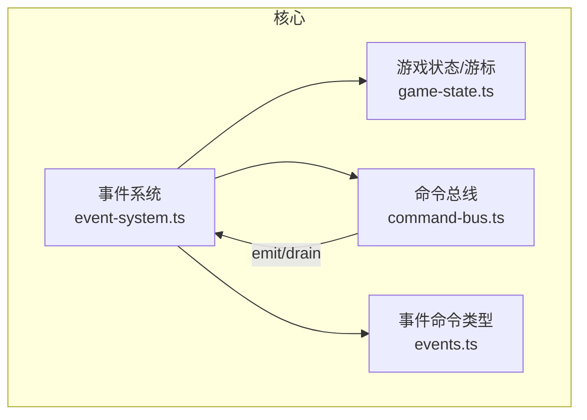
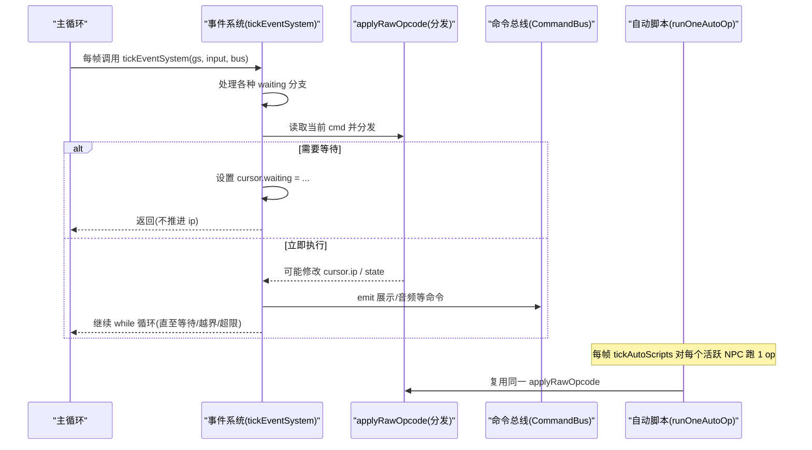
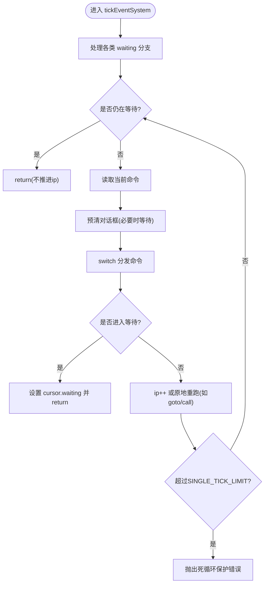
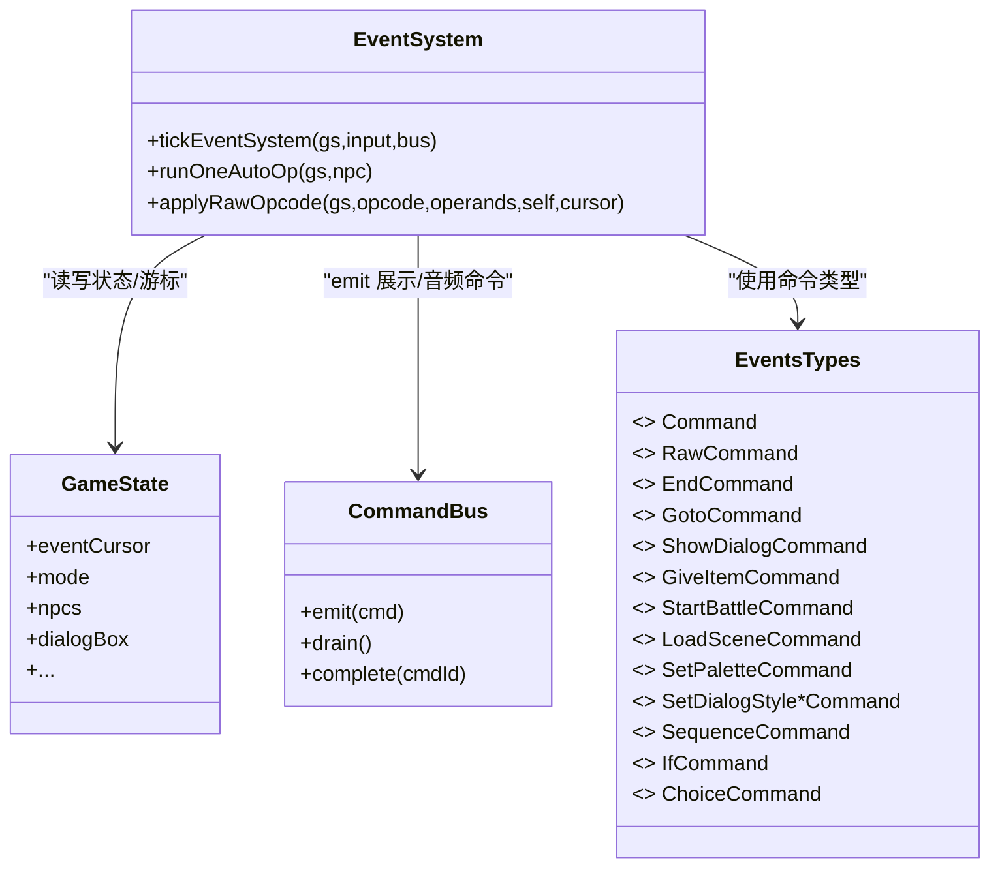

# 事件系统

<cite>
**本文引用的文件**   
- [packages/game/src/core/event-system.ts](file://packages/game/src/core/event-system.ts)
- [packages/shared/src/events.ts](file://packages/shared/src/events.ts)
- [packages/game/src/core/command-bus.ts](file://packages/game/src/core/command-bus.ts)
- [packages/game/src/core/game-state.ts](file://packages/game/src/core/game-state.ts)
</cite>

## 目录
1. [简介](#简介)
2. [项目结构](#项目结构)
3. [核心组件](#核心组件)
4. [架构总览](#架构总览)
5. [详细组件分析](#详细组件分析)
6. [依赖关系分析](#依赖关系分析)
7. [性能与优化建议](#性能与优化建议)
8. [故障排查指南](#故障排查指南)
9. [结论](#结论)
10. [附录：扩展指南](#附录扩展指南)

## 简介
本文件面向“事件系统”的深入文档，聚焦以下目标：
- 解释“总导演模式”设计：EventCursor 协程式步进器、可等待命令机制、脚本执行引擎。
- 说明事件类型（NPC触发、场景进入、自动脚本等）、命令总线通信协议、条件判断逻辑。
- 阐述协程式执行模型如何实现非阻塞的事件处理，包括 waiting 状态管理、callStack 子脚本调用、labelMap 跳转机制。
- 提供扩展实践：如何编写新的事件命令、添加自定义条件判断、如何处理异步操作。
- 给出调试工具与性能优化建议。

## 项目结构
事件系统位于游戏核心层，围绕以下关键模块组织：
- 事件系统与指令分发：event-system.ts
- 共享事件命令类型与结构化子集：events.ts
- 命令总线（Core→Present）：command-bus.ts
- 全局游戏状态与游标定义：game-state.ts

图表来源
- [packages/game/src/core/event-system.ts:1496-1600](file://packages/game/src/core/event-system.ts#L1496-L1600)
- [packages/game/src/core/command-bus.ts:63-88](file://packages/game/src/core/command-bus.ts#L63-L88)
- [packages/shared/src/events.ts:162-178](file://packages/shared/src/events.ts#L162-L178)
- [packages/game/src/core/game-state.ts:226-343](file://packages/game/src/core/game-state.ts#L226-L343)

章节来源
- [packages/game/src/core/event-system.ts:1-120](file://packages/game/src/core/event-system.ts#L1-L120)
- [packages/shared/src/events.ts:1-193](file://packages/shared/src/events.ts#L1-L193)
- [packages/game/src/core/command-bus.ts:1-89](file://packages/game/src/core/command-bus.ts#L1-L89)
- [packages/game/src/core/game-state.ts:220-419](file://packages/game/src/core/game-state.ts#L220-L419)

## 核心组件
- EventCursor 协程式步进器：维护当前脚本 ip、waiting 状态、callStack、onEnter 持久化、trigger 上下文等，驱动 tickEventSystem 单 tick 内循环步进直到遇到可等待或结束。
- 可等待命令机制：通过 cursor.waiting 标记多种等待原因（对话、帧等待、淡入淡出、场景加载、延时、菜单、RNG/FBP 播放、按键等待、确认框、摄像机平移等），在 tickEventSystem 顶部统一处理。
- 脚本执行引擎：tickEventSystem 主循环 + applyRawOpcode 指令分发 + runOneAutoOp 自动脚本步进 + callStack 子脚本支持 + labelMap 跳转解析。
- 命令总线：Core 侧 emit PresentCommand，Present 侧 drain 消费；M3 可扩展 complete 回调用于异步回执。

章节来源
- [packages/game/src/core/event-system.ts:1496-2000](file://packages/game/src/core/event-system.ts#L1496-L2000)
- [packages/game/src/core/event-system.ts:3529-4914](file://packages/game/src/core/event-system.ts#L3529-L4914)
- [packages/game/src/core/event-system.ts:1287-1494](file://packages/game/src/core/event-system.ts#L1287-L1494)
- [packages/game/src/core/command-bus.ts:63-88](file://packages/game/src/core/command-bus.ts#L63-L88)
- [packages/game/src/core/game-state.ts:226-343](file://packages/game/src/core/game-state.ts#L226-L343)

## 架构总览
事件系统采用“总导演模式”：
- 单一 EventCursor 作为“导演”，持有当前脚本位置与等待状态，按帧推进。
- 所有 opcode 由 applyRawOpcode 集中分发，动游标的指令（跳转、call、随机跳转）直接修改传入的 cursor，使 trigger/autoScript 共用同一套解释器。
- 可等待命令将长耗时或交互性操作从主循环中抽离，以 waiting 状态挂起，待外部完成后再恢复。

图表来源
- [packages/game/src/core/event-system.ts:1496-2000](file://packages/game/src/core/event-system.ts#L1496-L2000)
- [packages/game/src/core/event-system.ts:3529-4914](file://packages/game/src/core/event-system.ts#L3529-L4914)
- [packages/game/src/core/command-bus.ts:63-88](file://packages/game/src/core/command-bus.ts#L63-L88)
- [packages/game/src/core/event-system.ts:1287-1494](file://packages/game/src/core/event-system.ts#L1287-L1494)

## 详细组件分析

### 事件类型与入口
- NPC 触发脚本：由 tickSceneSystem 触发时创建 EventCursor，设置 currentEventObjectId 与 triggerOwnerId，end 时根据 advance/reset 持久化到 NPC 的 triggerResume。
- 场景进入脚本：onEnter 脚本运行后，end 时将下一条 entry 写入 gs.sceneOnEnterIp[sceneId]，实现“开场只播一次”。
- 自动脚本：tickAutoScripts 每帧为每个 sState>0 且可见的 NPC 推进 1 op，支持 goto/frameDelay/wait/call 等。

章节来源
- [packages/game/src/core/event-system.ts:1914-2000](file://packages/game/src/core/event-system.ts#L1914-L2000)
- [packages/game/src/core/event-system.ts:1242-1286](file://packages/game/src/core/event-system.ts#L1242-L1286)
- [packages/game/src/core/game-state.ts:226-343](file://packages/game/src/core/game-state.ts#L226-L343)

### 协程式执行模型与 waiting 状态
- 单 tick 连跑非阻塞命令，撞 waitable/end/越界才返回。
- waiting 类型覆盖广泛：dialog、frame-wait、fade-screen、scene-load、delay、shop、palette-fade、scene-fade、rng-play、show-fbp、scroll-fbp、ending-anim、wait-key、quit、confirm、camera-pan。
- 每种 waiting 在 tickEventSystem 顶部有对应处理分支，完成后 ip++ 并 fall-through 继续主循环。

章节来源
- [packages/game/src/core/event-system.ts:1507-1705](file://packages/game/src/core/event-system.ts#L1507-L1705)
- [packages/game/src/core/game-state.ts:236-290](file://packages/game/src/core/game-state.ts#L236-L290)

### 子脚本调用与 callStack
- 0x04 call-script 压栈保存 caller 的 returnIp/commands/labelMap/currentEventObjectId，跳入子脚本；子脚本 end 弹栈恢复 caller 上下文继续。
- autoScript 路径也支持 call，并在同帧消化 callee，若多帧 op 卡住则退化为逐帧推进。

章节来源
- [packages/game/src/core/event-system.ts:1926-1935](file://packages/game/src/core/event-system.ts#L1926-L1935)
- [packages/game/src/core/event-system.ts:1422-1442](file://packages/game/src/core/event-system.ts#L1422-L1442)
- [packages/game/src/core/game-state.ts:314-325](file://packages/game/src/core/game-state.ts#L314-L325)

### 标签与跳转机制 labelMap
- 全局单一脚本数组：生产环境 cursor 仅含 ip，默认读 _globalCommands/_globalLabelMap。
- resolveLabelIp 支持 shared# 前缀剥除，统一走全局 labelMap 解析。
- goto/jump 类 opcode 均基于此机制。

章节来源
- [packages/game/src/core/event-system.ts:787-815](file://packages/game/src/core/event-system.ts#L787-L815)
- [packages/game/src/core/event-system.ts:794-801](file://packages/game/src/core/event-system.ts#L794-L801)

### 条件判断逻辑
- A2 条件跳转：如物品不足、中毒状态、队伍 HP 不满、玩家是否在队、对象朝向/区域、对象状态、场景号、随机跳转等。
- 跳转目标经 labelMap 解析，失败分支落点由 operand 指定。

章节来源
- [packages/game/src/core/event-system.ts:4622-4654](file://packages/game/src/core/event-system.ts#L4622-L4654)

### 命令总线通信协议
- Core 侧 emit PresentCommand，Present 侧 drain 消费。
- M3 预留 complete(cmdId) 接口，用于异步回执（转场/视频）。

章节来源
- [packages/game/src/core/command-bus.ts:63-88](file://packages/game/src/core/command-bus.ts#L63-L88)

### 关键流程图：tickEventSystem 主循环

图表来源
- [packages/game/src/core/event-system.ts:1839-1860](file://packages/game/src/core/event-system.ts#L1839-L1860)
- [packages/game/src/core/event-system.ts:1507-1705](file://packages/game/src/core/event-system.ts#L1507-L1705)

## 依赖关系分析
- event-system.ts 依赖：
  - game-state.ts：EventCursor、GameState、NpcState 等类型与字段。
  - command-bus.ts：emit/drain 通道。
  - events.ts：Command 联合类型与具名命令结构。
- 注入点：
  - setStartBattleHandler/setShopMenuHandler/setRngPlayHandler/setShowFbpHandler/setScrollFbpHandler/setEndingAnimationHandler/setLoadLastSaveHandler/setQuitHandler 等，避免反向 import 成环。
  - setGlobalEvents/setFetchPalette/setPaletteSource/setSceneLoader/setMapReloader/setObstacleChecker 等运行时装配。

图表来源
- [packages/game/src/core/event-system.ts:1496-2000](file://packages/game/src/core/event-system.ts#L1496-L2000)
- [packages/game/src/core/command-bus.ts:63-88](file://packages/game/src/core/command-bus.ts#L63-L88)
- [packages/shared/src/events.ts:162-178](file://packages/shared/src/events.ts#L162-L178)
- [packages/game/src/core/game-state.ts:226-343](file://packages/game/src/core/game-state.ts#L226-L343)

章节来源
- [packages/game/src/core/event-system.ts:817-995](file://packages/game/src/core/event-system.ts#L817-L995)
- [packages/game/src/core/event-system.ts:762-780](file://packages/game/src/core/event-system.ts#L762-L780)

## 性能与优化建议
- 单 tick 指令上限：SINGLE_TICK_LIMIT 防止 goto 自指/raw 链导致死循环。
- 自动脚本节流：autoScript 每帧仅推进 1 op，避免阻塞主循环。
- 调色板淡入淡出：time-based 控制，present 层逐帧 ramp，避免在主循环做昂贵计算。
- 场景切换异步：loadScene 通过 callback 替换 eventCursor，避免阻塞。
- 建议：
  - 尽量将长耗时操作拆分为 waiting 状态，减少主循环负担。
  - 合理使用 goto frameDelay 与 reset idleFrames 控制节奏，避免频繁跳转。
  - 批量 emit 命令，减少 drain 开销。

章节来源
- [packages/game/src/core/event-system.ts:493-498](file://packages/game/src/core/event-system.ts#L493-L498)
- [packages/game/src/core/event-system.ts:1242-1286](file://packages/game/src/core/event-system.ts#L1242-L1286)
- [packages/game/src/core/event-system.ts:1563-1592](file://packages/game/src/core/event-system.ts#L1563-L1592)
- [packages/game/src/core/event-system.ts:1594-1600](file://packages/game/src/core/event-system.ts#L1594-L1600)

## 故障排查指南
- 常见症状与定位：
  - 死循环报错：检查 goto 自指或 raw 链过长，关注 SINGLE_TICK_LIMIT 抛错位置。
  - 对话遮挡后续动画：确认 pre-op ClearDialog 逻辑与 isDialogContinuationOp 豁免列表。
  - 自动脚本不动：检查 npc.sState/sVanishTime 门控、owner 跳过门控、autoLabel 解析。
  - 场景切换黑屏：确认 needToFadeIn 与 tickSceneAutoFadeIn 时机。
- 调试手段：
  - 在 tickEventSystem 主循环打印 cmd.op/opcode/ip。
  - 观察 cursor.waiting 变化与 dialogBox 状态机相位。
  - 使用命令总线日志追踪 emit/drain。

章节来源
- [packages/game/src/core/event-system.ts:1839-1860](file://packages/game/src/core/event-system.ts#L1839-L1860)
- [packages/game/src/core/event-system.ts:1876-1911](file://packages/game/src/core/event-system.ts#L1876-L1911)
- [packages/game/src/core/event-system.ts:1242-1286](file://packages/game/src/core/event-system.ts#L1242-L1286)
- [packages/game/src/core/event-system.ts:645-671](file://packages/game/src/core/event-system.ts#L645-L671)

## 结论
事件系统通过 EventCursor 协程式步进器与 waiting 状态管理，实现了非阻塞、可组合、可扩展的剧情与交互流程。统一的 applyRawOpcode 分发与 callStack 子脚本机制，配合 labelMap 跳转与命令总线，使得 NPC 触发、场景进入、自动脚本等事件类型能够高效协作。遵循本文档的扩展指南，可安全地新增命令、条件与异步操作，同时保持性能与稳定性。

## 附录：扩展指南

### 新增事件命令（raw 具名化）
步骤：
1. 在 event-system.ts 中声明新的 OP_* 常量与注释语义。
2. 在 applyRawOpcode 中添加 case 分支，实现具体效果（可修改 GameState、emit 命令、设置 waiting 等）。
3. 若涉及跳转/子脚本，确保使用传入的 cursor 进行 ip 修改。
4. 在 events.ts 中增加具名 Command 类型（可选，便于数据编辑与反汇编 round-trip）。
5. 在 tickEventSystem 的“自动预清对话框”豁免列表中更新 isDialogContinuationOp（如需）。

参考路径
- [packages/game/src/core/event-system.ts:63-158](file://packages/game/src/core/event-system.ts#L63-L158)
- [packages/game/src/core/event-system.ts:3529-4914](file://packages/game/src/core/event-system.ts#L3529-L4914)
- [packages/shared/src/events.ts:162-178](file://packages/shared/src/events.ts#L162-L178)
- [packages/game/src/core/event-system.ts:511-533](file://packages/game/src/core/event-system.ts#L511-L533)

### 添加自定义条件判断
步骤：
1. 在 applyRawOpcode 的 A2 条件跳转区段新增 case（如 OP_JUMP_IF_X）。
2. 在条件满足时调用 jumpToGlobalIp(gs, cursor, target)。
3. 在 events.ts 中为对应的 raw 命令保留 operands 映射（如需）。

参考路径
- [packages/game/src/core/event-system.ts:4622-4654](file://packages/game/src/core/event-system.ts#L4622-L4654)

### 处理异步操作（等待机制）
步骤：
1. 在 applyRawOpcode 或 tickEventSystem 中设置 cursor.waiting 为合适值（如 'scene-load'/'fade-screen'/'delay' 等）。
2. 在外部完成时（bootstrap/handler）清除 waiting 并允许下一帧继续（或替换 eventCursor）。
3. 对于 modal 全屏播放（RNG/FBP/结局动画），使用注入的 handler 并 suspendRaf，完成后清 waiting。

参考路径
- [packages/game/src/core/event-system.ts:1563-1592](file://packages/game/src/core/event-system.ts#L1563-L1592)
- [packages/game/src/core/event-system.ts:1594-1600](file://packages/game/src/core/event-system.ts#L1594-L1600)
- [packages/game/src/core/event-system.ts:900-995](file://packages/game/src/core/event-system.ts#L900-L995)