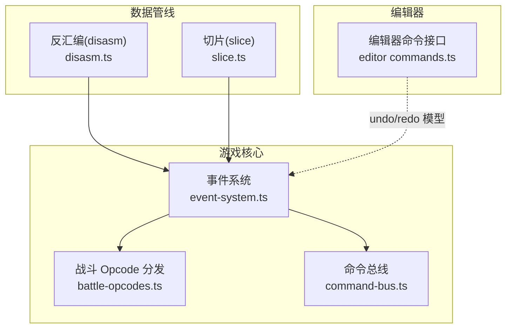
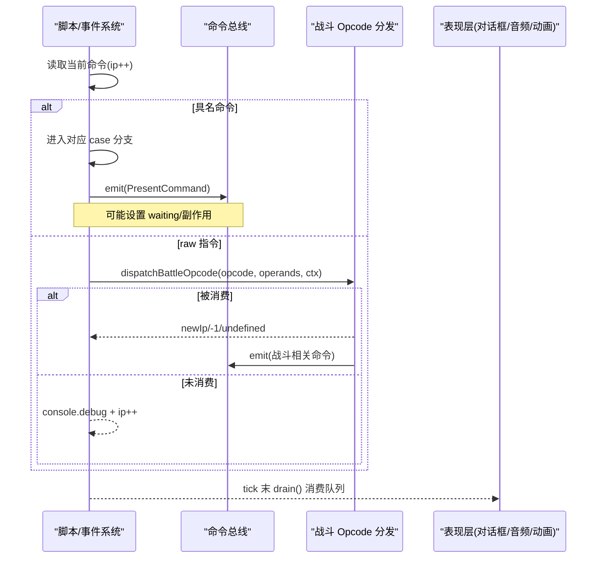
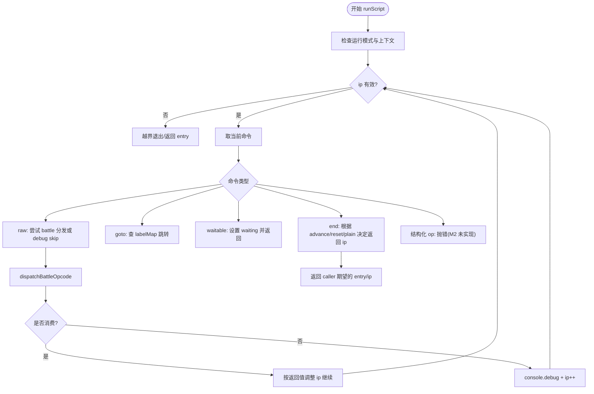
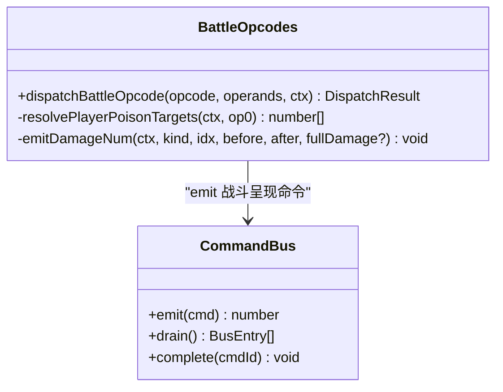
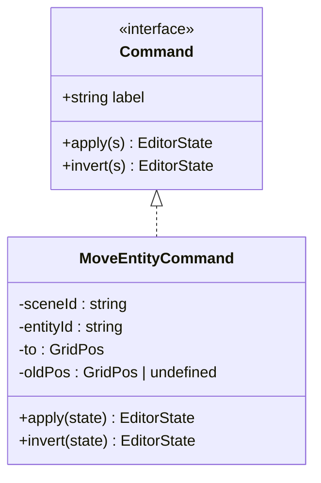
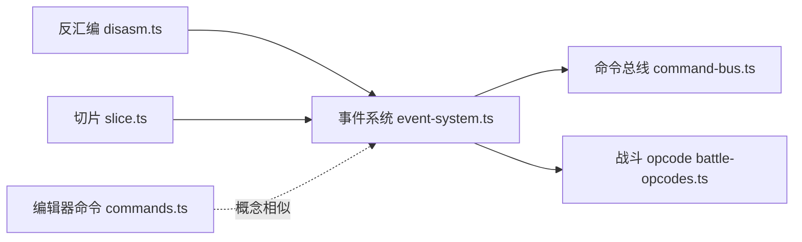

# 命令总线与调度

<cite>
**本文引用的文件**   
- [packages/game/src/core/command-bus.ts](file://packages/game/src/core/command-bus.ts)
- [packages/game/src/core/event-system.ts](file://packages/game/src/core/event-system.ts)
- [packages/game/src/core/battle/battle-opcodes.ts](file://packages/game/src/core/battle/battle-opcodes.ts)
- [packages/editor/src/core/commands.ts](file://packages/editor/src/core/commands.ts)
- [packages/pal-extract/src/events/disasm.ts](file://packages/pal-extract/src/events/disasm.ts)
- [packages/pal-extract/src/events/slice.ts](file://packages/pal-extract/src/events/slice.ts)
- [packages/game/src/core/command-bus.test.ts](file://packages/game/src/core/command-bus.test.ts)
- [packages/game/src/core/event-system.test.ts](file://packages/game/src/core/event-system.test.ts)
</cite>

## 目录
1. [简介](#简介)
2. [项目结构](#项目结构)
3. [核心组件](#核心组件)
4. [架构总览](#架构总览)
5. [详细组件分析](#详细组件分析)
6. [依赖关系分析](#依赖关系分析)
7. [性能考量](#性能考量)
8. [故障排查指南](#故障排查指南)
9. [结论](#结论)
10. [附录](#附录)

## 简介
本文件围绕“命令总线与调度”展开，聚焦以下目标：
- 解释 Command 接口设计（编辑器命令）与 PresentCommand 通道（Core→Present）的分工。
- 深入解析 opcode 分发机制、参数解析流程、以及事件系统对 raw 指令的兜底策略。
- 梳理移动、对话、战斗、物品等命令类型的实现模式与扩展方法。
- 说明命令执行上下文、副作用处理、与其他系统的集成方式。
- 提供注册新命令、实现自定义处理器、处理链式调用的实践路径。
- 给出调试与性能分析工具的使用建议。

## 项目结构
与命令总线与调度相关的代码主要分布在以下模块：
- 命令总线：单向 Core→Present 的命令队列与异步回执预留。
- 事件系统：脚本步进器、opcode 常量、具名命令分发、raw 兜底、等待态管理。
- 战斗 opcode：在 battle 上下文中消费特定 opcode，并驱动动画与数值弹幕。
- 编辑器命令：不可变编辑操作模型（apply/invert），用于 undo/redo。
- 反汇编/切片：将二进制 opcode 反编译为具名命令，构建标签跳转图。

图表来源
- [packages/game/src/core/event-system.ts:1-200](file://packages/game/src/core/event-system.ts#L1-L200)
- [packages/game/src/core/battle/battle-opcodes.ts:1-200](file://packages/game/src/core/battle/battle-opcodes.ts#L1-L200)
- [packages/game/src/core/command-bus.ts:1-89](file://packages/game/src/core/command-bus.ts#L1-L89)
- [packages/editor/src/core/commands.ts:1-77](file://packages/editor/src/core/commands.ts#L1-L77)
- [packages/pal-extract/src/events/disasm.ts:140-210](file://packages/pal-extract/src/events/disasm.ts#L140-L210)
- [packages/pal-extract/src/events/slice.ts:88-123](file://packages/pal-extract/src/events/slice.ts#L88-L123)

章节来源
- [packages/game/src/core/event-system.ts:1-200](file://packages/game/src/core/event-system.ts#L1-L200)
- [packages/game/src/core/command-bus.ts:1-89](file://packages/game/src/core/command-bus.ts#L1-L89)
- [packages/game/src/core/battle/battle-opcodes.ts:1-200](file://packages/game/src/core/battle/battle-opcodes.ts#L1-L200)
- [packages/editor/src/core/commands.ts:1-77](file://packages/editor/src/core/commands.ts#L1-L77)
- [packages/pal-extract/src/events/disasm.ts:140-210](file://packages/pal-extract/src/events/disasm.ts#L140-L210)
- [packages/pal-extract/src/events/slice.ts:88-123](file://packages/pal-extract/src/events/slice.ts#L88-L123)

## 核心组件
- 命令总线（CommandBus）
  - 职责：Core 侧 emit 呈现层命令，Present 侧 drain 批量消费；保留 complete(cmdId) 用于 M3 异步回执。
  - 关键类型：PresentCommand 联合类型（对话框、战斗 UI、音效/音乐、伤害数字等）。
  - 语义：M2 同步语义，tick 内 emit，tick 末 drain。
- 事件系统（EventSystem）
  - 职责：脚本步进器，维护 ip、labelMap、waiting 状态机；具名命令分发 + raw 兜底。
  - 运行模式：explore（大世界）与 battle（战斗）双轨；runScript 同步跑一段命令。
  - 副作用：修改 GameState、BattleState、emit 命令到总线、设置等待态。
- 战斗 Opcode 分发（Battle Opcodes）
  - 职责：在 battle 上下文消费特定 opcode（如伤害、毒、复活、模拟魔法等），驱动动画与数值弹幕。
  - 返回值约定：newIp / undefined（未消费）/ -1（消费但不改 ip）。
- 编辑器命令（Editor Commands）
  - 职责：不可变编辑操作模型（apply/invert），支撑 undo/redo。
- 反汇编与切片（Disasm/Slice）
  - 职责：从二进制反编译为具名命令；构建 labelMap 与跳转目标集合。

章节来源
- [packages/game/src/core/command-bus.ts:1-89](file://packages/game/src/core/command-bus.ts#L1-L89)
- [packages/game/src/core/event-system.ts:1-200](file://packages/game/src/core/event-system.ts#L1-L200)
- [packages/game/src/core/battle/battle-opcodes.ts:1-200](file://packages/game/src/core/battle/battle-opcodes.ts#L1-L200)
- [packages/editor/src/core/commands.ts:1-77](file://packages/editor/src/core/commands.ts#L1-L77)
- [packages/pal-extract/src/events/disasm.ts:140-210](file://packages/pal-extract/src/events/disasm.ts#L140-L210)
- [packages/pal-extract/src/events/slice.ts:88-123](file://packages/pal-extract/src/events/slice.ts#L88-L123)

## 架构总览
命令总线与调度整体遵循“Core 逻辑 → 命令总线 → Present 表现”的单向通道，事件系统作为脚本引擎负责解析与分发，战斗子系统在 battle 模式下接管部分 opcode 的执行。

图表来源
- [packages/game/src/core/event-system.ts:2873-2972](file://packages/game/src/core/event-system.ts#L2873-L2972)
- [packages/game/src/core/battle/battle-opcodes.ts:345-367](file://packages/game/src/core/battle/battle-opcodes.ts#L345-L367)
- [packages/game/src/core/command-bus.ts:63-88](file://packages/game/src/core/command-bus.ts#L63-L88)

## 详细组件分析

### 命令总线（CommandBus）
- 设计要点
  - emit(cmd): 入队并返回唯一 cmdId。
  - drain(): 清空并返回本次 tick 所有命令。
  - complete(cmdId): M3 异步回执预留，M2 无操作。
- 典型用法
  - 事件系统在 showDialog、播放音效/音乐、战斗 UI 切换时 emit。
  - 表现层在每帧末尾 drain 并渲染。
- 测试覆盖
  - 顺序性、drain 后清空、cmdId 唯一性与配对、complete 不抛错。

章节来源
- [packages/game/src/core/command-bus.ts:58-88](file://packages/game/src/core/command-bus.ts#L58-L88)
- [packages/game/src/core/command-bus.test.ts:1-45](file://packages/game/src/core/command-bus.test.ts#L1-L45)

### 事件系统与 opcode 分发
- 运行模式
  - explore：大世界事件脚本，阻塞等待（dialog/delay/wait-key 等）。
  - battle：战斗脚本，runScript 同步执行，未具名 raw 走 debug skip。
- 控制流
  - end：支持 advance/reset/plain 三种结束语义。
  - goto：基于 labelMap 跳转。
  - sequence/if/choice：M2 未实现，抛错提示。
- 等待态
  - dialog：显示对话框，按键推进。
  - delay：时间基延迟，到达后继续。
  - wait-key：永久等待，直到确认/菜单键。
- raw 兜底
  - 未被具名化的 opcode 走 console.debug 跳过，确保不阻塞游戏。
  - 在 battle 模式下，先尝试 dispatchBattleOpcode，若未消费则回退 skip。

图表来源
- [packages/game/src/core/event-system.ts:2873-2972](file://packages/game/src/core/event-system.ts#L2873-L2972)
- [packages/game/src/core/event-system.ts:2910-2943](file://packages/game/src/core/event-system.ts#L2910-L2943)

章节来源
- [packages/game/src/core/event-system.ts:2873-2972](file://packages/game/src/core/event-system.ts#L2873-L2972)
- [packages/game/src/core/event-system.ts:2910-2943](file://packages/game/src/core/event-system.ts#L2910-L2943)
- [packages/game/src/core/event-system.test.ts:920-942](file://packages/game/src/core/event-system.test.ts#L920-L942)

### 战斗 Opcode 分发
- 职责边界
  - 仅消费 battle 上下文下的特定 opcode（伤害、毒、复活、模拟魔法等）。
  - 通过 ctx.bus 向命令总线发出 showDamageNum 等呈现命令。
- 返回值约定
  - newIp：改变 ip，caller 跳到该位置。
  - undefined：未消费，caller 走默认 skip。
  - -1：消费但不改 ip，caller ip++。
- 典型行为
  - 全体扣血：为每个敌人 emit 一条蓝色伤害数字。
  - 玩家中毒/解毒：依据 applyToAll 与目标选择逻辑生效。
  - 模拟魔法/投掷物：构造 OffMagic 特效帧或回退到即时音效。

图表来源
- [packages/game/src/core/battle/battle-opcodes.ts:345-367](file://packages/game/src/core/battle/battle-opcodes.ts#L345-L367)
- [packages/game/src/core/command-bus.ts:58-88](file://packages/game/src/core/command-bus.ts#L58-L88)

章节来源
- [packages/game/src/core/battle/battle-opcodes.ts:1-200](file://packages/game/src/core/battle/battle-opcodes.ts#L1-L200)
- [packages/game/src/core/battle/__tests__/battle-opcodes.test.ts:1675-1697](file://packages/game/src/core/battle/__tests__/battle-opcodes.test.ts#L1675-L1697)

### 编辑器命令（Command 接口）
- 设计要点
  - Command 接口：label、apply(s)、invert(s)，均返回新状态（不可变更新）。
  - MoveEntityCommand：移动实体，apply 捕获旧位置，invert 还原。
- 用途
  - 驱动 undo/redo 栈；各编辑模式统一发命令。

图表来源
- [packages/editor/src/core/commands.ts:17-76](file://packages/editor/src/core/commands.ts#L17-L76)

章节来源
- [packages/editor/src/core/commands.ts:1-77](file://packages/editor/src/core/commands.ts#L1-L77)

### 反汇编与标签解析
- 反汇编（disasm）
  - 将原始 opcode 转换为具名命令（如 setDialogStyleTop/Center/Bottom/Narration、giveItem 等）。
  - 非零 operand 才附带字段，保证 round-trip 字节一致。
- 切片（slice）
  - 扫描命令中的字符串字段与 raw 跳转目标，构建 labelMap 与跳转队列。
  - end/goto 特殊处理，其他命令 fall-through 追加 i+1。

章节来源
- [packages/pal-extract/src/events/disasm.ts:140-210](file://packages/pal-extract/src/events/disasm.ts#L140-L210)
- [packages/pal-extract/src/events/slice.ts:88-123](file://packages/pal-extract/src/events/slice.ts#L88-L123)

## 依赖关系分析
- 事件系统依赖
  - 命令总线：emit 呈现命令。
  - 战斗 opcode 分发：在 battle 模式下消费特定 opcode。
  - 调色板/淡入淡出：特效 A/B/C 相关 opcode 使用 palette fade 状态。
  - 输入快照：等待态（dialog/wait-key）依赖输入。
- 反汇编/切片
  - 产出具名命令与 labelMap，供事件系统运行时使用。
- 编辑器命令
  - 独立于运行时命令总线，但共享“命令即数据”的思想。

图表来源
- [packages/pal-extract/src/events/disasm.ts:140-210](file://packages/pal-extract/src/events/disasm.ts#L140-L210)
- [packages/pal-extract/src/events/slice.ts:88-123](file://packages/pal-extract/src/events/slice.ts#L88-L123)
- [packages/game/src/core/event-system.ts:1-200](file://packages/game/src/core/event-system.ts#L1-L200)
- [packages/game/src/core/command-bus.ts:1-89](file://packages/game/src/core/command-bus.ts#L1-L89)
- [packages/game/src/core/battle/battle-opcodes.ts:1-200](file://packages/game/src/core/battle/battle-opcodes.ts#L1-L200)
- [packages/editor/src/core/commands.ts:1-77](file://packages/editor/src/core/commands.ts#L1-L77)

章节来源
- [packages/game/src/core/event-system.ts:1-200](file://packages/game/src/core/event-system.ts#L1-L200)
- [packages/game/src/core/command-bus.ts:1-89](file://packages/game/src/core/command-bus.ts#L1-L89)
- [packages/game/src/core/battle/battle-opcodes.ts:1-200](file://packages/game/src/core/battle/battle-opcodes.ts#L1-L200)
- [packages/pal-extract/src/events/disasm.ts:140-210](file://packages/pal-extract/src/events/disasm.ts#L140-L210)
- [packages/pal-extract/src/events/slice.ts:88-123](file://packages/pal-extract/src/events/slice.ts#L88-L123)
- [packages/editor/src/core/commands.ts:1-77](file://packages/editor/src/core/commands.ts#L1-L77)

## 性能考量
- 单 tick 指令上限：SINGLE_TICK_LIMIT 防止死循环（goto 自指/raw 链）。
- 等待态冻结：delay/wait-key/dialog 期间暂停 autoScript，避免无效计算。
- 批量 drain：tick 末一次性消费命令，减少频繁 UI 刷新。
- 调色板淡入淡出：state-driven 逐帧 ramp，present 层消费，避免重复重建。

章节来源
- [packages/game/src/core/event-system.ts:493-498](file://packages/game/src/core/event-system.ts#L493-L498)
- [packages/game/src/core/event-system.ts:1694-1704](file://packages/game/src/core/event-system.ts#L1694-L1704)
- [packages/game/src/core/command-bus.ts:69-88](file://packages/game/src/core/command-bus.ts#L69-L88)

## 故障排查指南
- 常见错误
  - runtimeMode 与 battleCtx 不匹配：runScript 会抛错提示。
  - goto label 不存在：抛出错误，需检查 labelMap 构建。
  - 结构化 op 未实现：M2 抛错，需补实现或改用 raw。
- 调试技巧
  - 战斗 raw 未具名：查看 console.debug 输出，前缀包含 “[event-system battle]”，grep 真实 opcode 号。
  - 延迟等待：检查 cursor.waiting='delay' 与 delayUntilMs 是否正确设置。
  - 命令总线：断点 emit/drain，核对 cmdId 配对与顺序。
- 参考用例
  - 延迟后继续执行后续 opcode 的行为验证。
  - 未知 cmdId 调用 complete 不抛错。

章节来源
- [packages/game/src/core/event-system.test.ts:1061-1084](file://packages/game/src/core/event-system.test.ts#L1061-L1084)
- [packages/game/src/core/event-system.test.ts:3973-3999](file://packages/game/src/core/event-system.test.ts#L3973-L3999)
- [packages/game/src/core/command-bus.test.ts:28-45](file://packages/game/src/core/command-bus.test.ts#L28-L45)
- [packages/game/src/core/event-system.test.ts:920-942](file://packages/game/src/core/event-system.test.ts#L920-L942)

## 结论
本系统以“命令总线 + 事件系统 + 战斗 opcode 分发”为核心，形成清晰的 Core→Present 单向通道与可扩展的 opcode 分发机制。通过具名命令与 raw 兜底，既保证了稳定性，又便于逐步完善战斗与大世界功能。配合反汇编与切片工具，可实现从二进制到可维护脚本的完整闭环。

## 附录

### 如何注册新命令（PresentCommand）
- 步骤
  - 在命令总线中新增一个 PresentCommand 联合成员（例如新的战斗 UI 或音频意图）。
  - 在事件系统或战斗 opcode 中 emit 该命令。
  - 在表现层 drain 后消费并渲染。
- 参考路径
  - 命令总线定义与实现：[packages/game/src/core/command-bus.ts:1-89](file://packages/game/src/core/command-bus.ts#L1-L89)
  - 事件系统 emit 示例（对话框/音效/音乐）：[packages/game/src/core/event-system.ts:1-200](file://packages/game/src/core/event-system.ts#L1-L200)

章节来源
- [packages/game/src/core/command-bus.ts:1-89](file://packages/game/src/core/command-bus.ts#L1-L89)
- [packages/game/src/core/event-system.ts:1-200](file://packages/game/src/core/event-system.ts#L1-L200)

### 如何实现自定义命令处理器
- 步骤
  - 在事件系统 switch 中添加具名命令 case，或扩展 battle-opcodes 的 dispatchBattleOpcode。
  - 如需交互，设置 waiting 状态并在等待处理分支中推进 ip。
  - 如需副作用，直接修改 GameState/BattleState 或 emit 命令。
- 参考路径
  - 事件系统主循环与 case 分支：[packages/game/src/core/event-system.ts:2873-2972](file://packages/game/src/core/event-system.ts#L2873-L2972)
  - 战斗 opcode 分发入口：[packages/game/src/core/battle/battle-opcodes.ts:345-367](file://packages/game/src/core/battle/battle-opcodes.ts#L345-L367)

章节来源
- [packages/game/src/core/event-system.ts:2873-2972](file://packages/game/src/core/event-system.ts#L2873-L2972)
- [packages/game/src/core/battle/battle-opcodes.ts:345-367](file://packages/game/src/core/battle/battle-opcodes.ts#L345-L367)

### 如何处理命令链式调用
- 思路
  - 使用 callStack 保存 caller 的 returnIp 与上下文（如 curEventObjId），子脚本 end 时弹栈恢复。
  - 在 runScript 中处理 end 的 advance/reset/plain 语义，确保正确返回 entry。
- 参考路径
  - runScript 的 callStack 与 end 处理：[packages/game/src/core/event-system.ts:2943-2972](file://packages/game/src/core/event-system.ts#L2943-L2972)

章节来源
- [packages/game/src/core/event-system.ts:2943-2972](file://packages/game/src/core/event-system.ts#L2943-L2972)

### 调试与性能分析工具
- 控制台日志
  - 战斗 raw 未具名：grep “[event-system battle]” 定位 opcode 号。
- 单测辅助
  - 命令总线：顺序、清空、cmdId 唯一性与配对。
  - 事件系统：runtimeMode 校验、goto 行为、delay 等待。
- 性能观察
  - 关注 SINGLE_TICK_LIMIT 触发情况，排查死循环。
  - 监控 drain 频率与队列长度，优化 emit 合并。

章节来源
- [packages/game/src/core/event-system.test.ts:920-942](file://packages/game/src/core/event-system.test.ts#L920-L942)
- [packages/game/src/core/command-bus.test.ts:1-45](file://packages/game/src/core/command-bus.test.ts#L1-L45)
- [packages/game/src/core/event-system.test.ts:1061-1084](file://packages/game/src/core/event-system.test.ts#L1061-L1084)
- [packages/game/src/core/event-system.test.ts:3973-3999](file://packages/game/src/core/event-system.test.ts#L3973-L3999)