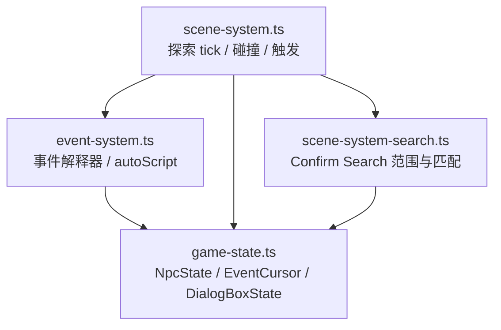
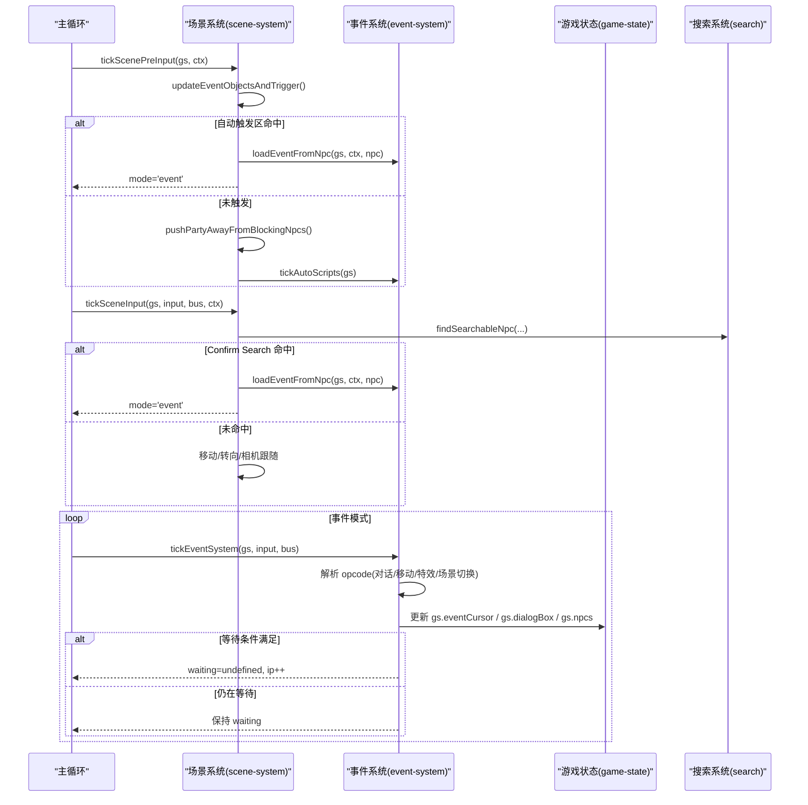
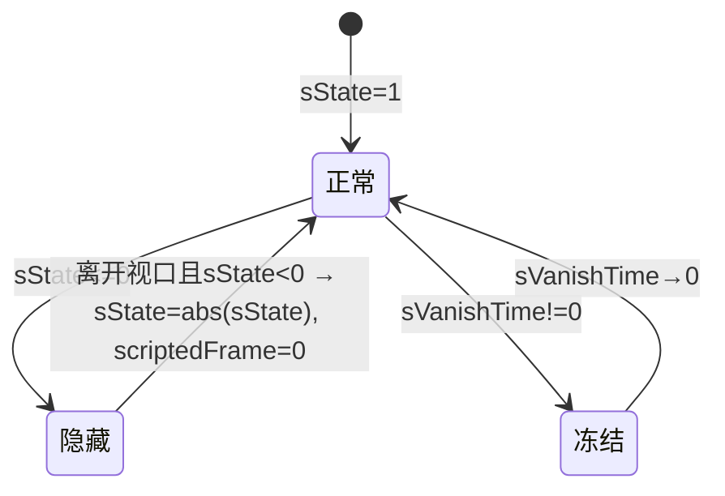
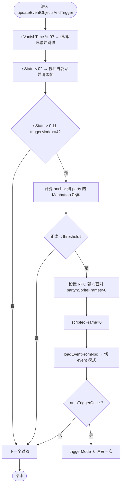
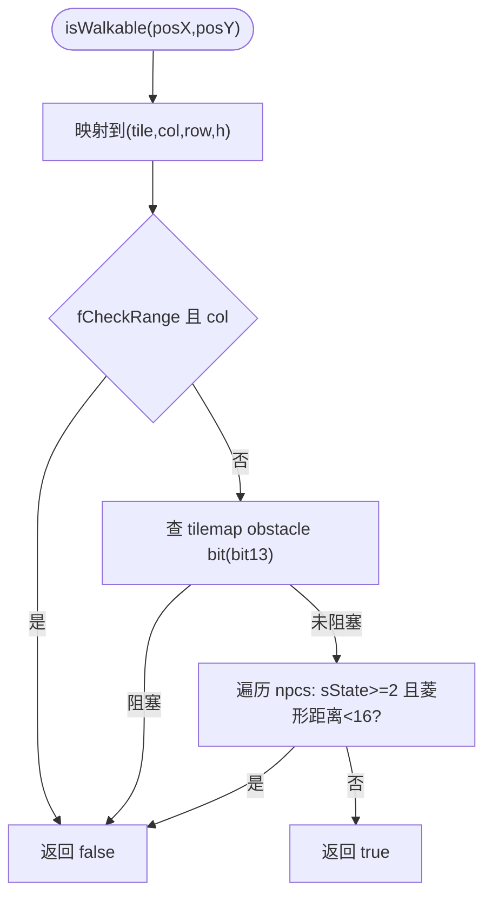
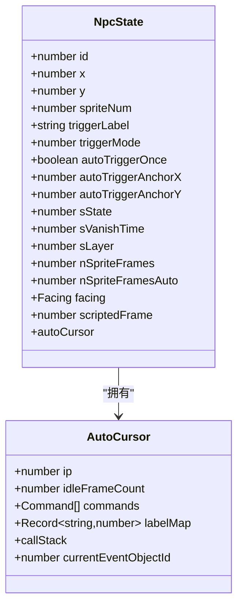
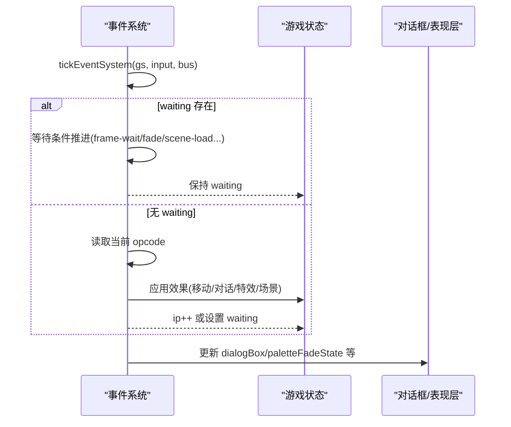
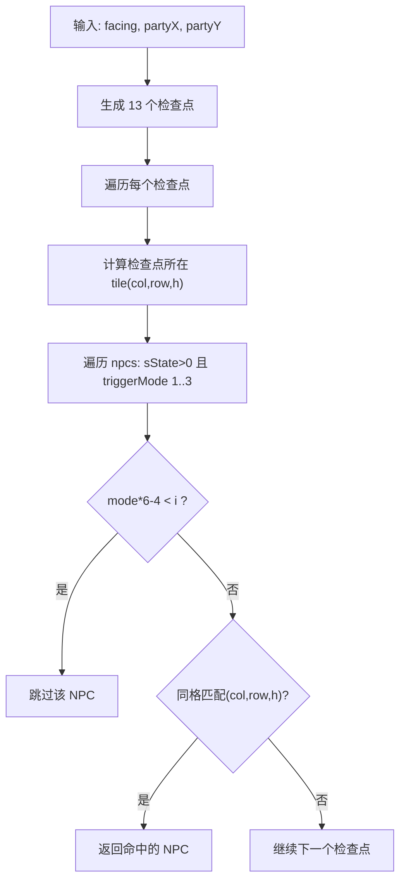
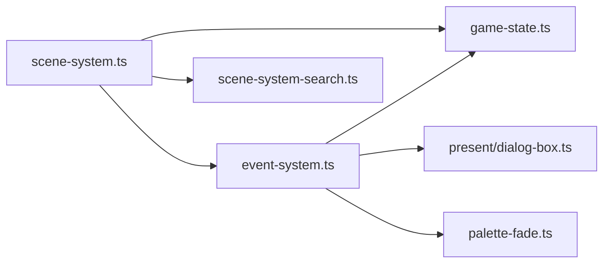

# NPC 行为系统

<cite>
**本文引用的文件**   
- [scene-system.ts](file://packages/game/src/core/scene-system.ts)
- [event-system.ts](file://packages/game/src/core/event-system.ts)
- [game-state.ts](file://packages/game/src/core/game-state.ts)
- [scene-system-search.ts](file://packages/game/src/core/scene-system-search.ts)
- [scene-system.test.ts](file://packages/game/src/core/scene-system.test.ts)
- [event-system.test.ts](file://packages/game/src/core/event-system.test.ts)
</cite>

## 目录
1. [简介](#简介)
2. [项目结构](#项目结构)
3. [核心组件](#核心组件)
4. [架构总览](#架构总览)
5. [详细组件分析](#详细组件分析)
6. [依赖关系分析](#依赖关系分析)
7. [性能考量](#性能考量)
8. [故障排查指南](#故障排查指南)
9. [结论](#结论)
10. [附录](#附录)

## 简介
本文件面向“NPC 行为系统”的完整技术文档，覆盖以下主题：
- NPC 状态机与生命周期管理（可见性、复活、阻挡、朝向、动画帧）
- 巡逻路径算法与自动脚本（autoScript）步进器
- 交互触发逻辑（Confirm Search、自动触发区、转向与站立帧同步）
- 事件系统与 opcode 驱动的行为编排（移动、对话、场景切换等）
- AI 决策树与随机行为生成（战斗侧敌方 AI 参考）
- 性能优化策略（隔帧步进、距离阈值、冻结态、批量判定）
- 实战示例：创建新 NPC、配置行为脚本、实现复杂交互
- 调试与行为分析工具使用方法

## 项目结构
围绕 NPC 行为的核心代码集中在 packages/game/src/core 下：
- scene-system.ts：探索模式主循环、碰撞与触发、相机跟随、搜索触发
- event-system.ts：事件脚本解释器、opcode 处理、自动脚本推进、移动/对话/特效
- game-state.ts：全局状态模型（含 NpcState、EventCursor、DialogBoxState 等）
- scene-system-search.ts：Confirm Search 命中区域与匹配规则
- 测试用例：验证触发、寻路、动画帧、自动脚本等行为

图表来源
- [scene-system.ts:1-120](file://packages/game/src/core/scene-system.ts#L1-L120)
- [event-system.ts:1-120](file://packages/game/src/core/event-system.ts#L1-L120)
- [game-state.ts:82-224](file://packages/game/src/core/game-state.ts#L82-L224)
- [scene-system-search.ts:1-93](file://packages/game/src/core/scene-system-search.ts#L1-L93)

章节来源
- [scene-system.ts:1-120](file://packages/game/src/core/scene-system.ts#L1-L120)
- [event-system.ts:1-120](file://packages/game/src/core/event-system.ts#L1-L120)
- [game-state.ts:82-224](file://packages/game/src/core/game-state.ts#L82-L224)
- [scene-system-search.ts:1-93](file://packages/game/src/core/scene-system-search.ts#L1-L93)

## 核心组件
- 场景系统（SceneSystem）
  - 负责探索模式的每帧更新：输入→移动→碰撞→自动触发→搜索触发→菜单/快捷键。
  - 关键函数：tickScenePreInput、tickSceneInput、tickSceneSystem、isWalkable、updateEventObjectsAndTrigger、loadEventFromNpc。
- 事件系统（EventSystem）
  - 事件脚本协程式步进器：按 opcode 执行移动、对话、淡入淡出、场景切换、自动脚本等。
  - 关键函数：tickEventSystem、runOneAutoOp、npcWalkTo/partyWalkTo/partyRideEventObject、walkFrameMod。
- 游戏状态（GameState）
  - 单一真相源，包含 NpcState、EventCursor、DialogBoxState 等关键数据结构。
- 搜索系统（Search）
  - Confirm Search 命中区域计算与匹配规则。

章节来源
- [scene-system.ts:180-340](file://packages/game/src/core/scene-system.ts#L180-L340)
- [event-system.ts:1400-1599](file://packages/game/src/core/event-system.ts#L1400-L1599)
- [game-state.ts:82-224](file://packages/game/src/core/game-state.ts#L82-L224)
- [scene-system-search.ts:35-93](file://packages/game/src/core/scene-system-search.ts#L35-L93)

## 架构总览
下图展示 NPC 行为在“探索→事件→渲染”的端到端流程，以及自动脚本与搜索触发的分支。

图表来源
- [scene-system.ts:443-584](file://packages/game/src/core/scene-system.ts#L443-L584)
- [event-system.ts:1496-1599](file://packages/game/src/core/event-system.ts#L1496-L1599)
- [scene-system-search.ts:65-93](file://packages/game/src/core/scene-system-search.ts#L65-L93)
- [game-state.ts:226-343](file://packages/game/src/core/game-state.ts#L226-L343)

## 详细组件分析

### NPC 状态机与生命周期
- sState 语义
  - 0：隐藏（不可见、不阻挡）
  - 1：正常（可见、不阻挡）
  - 2+：阻挡（可见、阻挡走路）
  - 负数：临时隐藏；离开屏幕后复活为 abs(sState)，并重置 scriptedFrame=0
- sVanishTime 语义
  - 非 0 时向 0 递进；暂停 trigger/autoScript；>0 不绘制，<0 仍绘制但冻结
- 朝向与姿势
  - facing：四方向枚举
  - scriptedFrame：姿势帧覆盖（优先级高于 walking stepFrame），用于剧情摆姿
- 精灵帧循环
  - nSpriteFrames：单方向走路帧数
  - nSpriteFramesAuto：装载时回填的精灵总帧数，用于无方向 sprite 的氛围动画循环
  - walkFrameMod：根据 nSpriteFrames/nSpriteFramesAuto 决定取模规则

图表来源
- [game-state.ts:122-176](file://packages/game/src/core/game-state.ts#L122-L176)
- [scene-system.ts:207-216](file://packages/game/src/core/scene-system.ts#L207-L216)

章节来源
- [game-state.ts:122-176](file://packages/game/src/core/game-state.ts#L122-L176)
- [scene-system.ts:207-216](file://packages/game/src/core/scene-system.ts#L207-L216)

### 自动触发区与交互触发
- 自动触发区（triggerMode >= 4）
  - 使用曼哈顿距离公式：|dx| + |dy|*2 < threshold
  - threshold = (mode - TRIGGER_MODE_AUTO_MIN)*32 + 16（mode 4..8 对应不同半径）
  - 支持 autoTriggerAnchorX/Y 调整判定中心（如扬州太守领赏）
  - 命中后：NPC 转向面对 party（仅当 nSpriteFrames>0）、scriptedFrame=0、加载事件脚本并切 event 模式
- Confirm Search（triggerMode 1..3）
  - 朝向前方 13 个 grid cell 扩散检查，按 mode 区分近/中/远触发
  - 命中后：NPC 转向 party 反方向、站立帧；队伍全员面向 NPC
- 视觉与姿态同步
  - applySearchVisualEffect：确保方向性与站立帧复位
  - 触发后若 owner 有 sprite 帧，则清 walkingFrame.walking 并复位 stepFrame 相位

图表来源
- [scene-system.ts:187-267](file://packages/game/src/core/scene-system.ts#L187-L267)
- [scene-system.ts:125-140](file://packages/game/src/core/scene-system.ts#L125-L140)
- [scene-system.ts:159-178](file://packages/game/src/core/scene-system.ts#L159-L178)

章节来源
- [scene-system.ts:187-267](file://packages/game/src/core/scene-system.ts#L187-L267)
- [scene-system.ts:125-140](file://packages/game/src/core/scene-system.ts#L125-L140)
- [scene-system.ts:159-178](file://packages/game/src/core/scene-system.ts#L159-L178)

### 碰撞与寻路
- isWalkable 菱形碰撞
  - 像素坐标映射到 tile(col,row,h)
  - 查 tilemap obstacle bit（bit 13）
  - 查 NPC 菱形曼哈顿距离（仅 sState>=2 阻挡）
  - fCheckRange 下边界保护（队首恒居屏幕中心）
- pushPartyAwayFromBlockingNpcs
  - 若阻挡物压到 party anchor，沿 NPC 朝向下一方向试 4 个方向推离一格
- NPC 行走（脚本驱动）
  - npcWalkTo：每 tick 走一步，到达 snap 到目标，facing 由 dx/dy 决定，到达后 scriptedFrame=0
  - 支持速度 2/3/4/8，部分速度带隔帧 stagger gate

图表来源
- [scene-system.ts:371-425](file://packages/game/src/core/scene-system.ts#L371-L425)
- [scene-system.ts:276-296](file://packages/game/src/core/scene-system.ts#L276-L296)
- [event-system.ts:5177-5231](file://packages/game/src/core/event-system.ts#L5177-L5231)

章节来源
- [scene-system.ts:371-425](file://packages/game/src/core/scene-system.ts#L371-L425)
- [scene-system.ts:276-296](file://packages/game/src/core/scene-system.ts#L276-L296)
- [event-system.ts:5177-5231](file://packages/game/src/core/event-system.ts#L5177-L5231)

### 自动脚本（autoScript）与巡逻路径
- 每 tick 对 sState!=0 且 autoCursor 设置的 NPC 跑 1 op
- 支持 call/jump/条件跳转/NPCWalkTo 等
- 多帧 op（wait/walkTo/camera-pan/fade）通过 cursor.waiting 挂起，逐帧推进
- 隔帧 stagger：某些 walkTo 指令按 (id+1)&1 ^ frameNum&1 控制是否步进

图表来源
- [game-state.ts:178-224](file://packages/game/src/core/game-state.ts#L178-L224)
- [event-system.ts:1400-1494](file://packages/game/src/core/event-system.ts#L1400-L1494)

章节来源
- [game-state.ts:178-224](file://packages/game/src/core/game-state.ts#L178-L224)
- [event-system.ts:1400-1494](file://packages/game/src/core/event-system.ts#L1400-L1494)

### 事件系统与 opcode 驱动
- 事件模式主循环 tickEventSystem
  - 处理各种 waiting（frame-wait、fade-screen、palette-fade、scene-load、camera-pan 等）
  - 解析 raw opcode：移动、对话、特效、场景切换、随机跳转等
- 关键 opcode 类别
  - 移动：OP_NPC_WALK_TO_*、OP_PARTY_WALK_TO、OP_RIDE_OBJECT_*
  - 对话：showDialog、setDialogStyle*、end
  - 特效：OP_FADE_SCREEN、OP_SCENE_FADE、OP_COLOR_FADE、OP_PALETTE_FADE
  - 场景：OP_LOAD_SCENE、OP_CHANGE_MAP
  - 条件/随机：OP_JUMP_IF_*、OP_RANDOM_JUMP、OP_JUMP_BY_RATE
- 自动脚本复用同一套解释器（applyRawOpcode），支持 call/jump 与子脚本返回栈

图表来源
- [event-system.ts:1496-1599](file://packages/game/src/core/event-system.ts#L1496-L1599)
- [event-system.ts:1400-1494](file://packages/game/src/core/event-system.ts#L1400-L1494)
- [game-state.ts:226-343](file://packages/game/src/core/game-state.ts#L226-L343)

章节来源
- [event-system.ts:1496-1599](file://packages/game/src/core/event-system.ts#L1496-L1599)
- [event-system.ts:1400-1494](file://packages/game/src/core/event-system.ts#L1400-L1494)
- [game-state.ts:226-343](file://packages/game/src/core/game-state.ts#L226-L343)

### 搜索触发（Confirm Search）
- getSearchTriggerRange：按 facing 生成 13 个检查点（party 位置 + 4 排扩散）
- findSearchableNpc：遍历 13 cell × 场景内 EventObject，过滤 sState>0、triggerMode 1..3、距离门限与同格匹配，返回首个命中 NPC

图表来源
- [scene-system-search.ts:35-93](file://packages/game/src/core/scene-system-search.ts#L35-L93)

章节来源
- [scene-system-search.ts:35-93](file://packages/game/src/core/scene-system-search.ts#L35-L93)

### AI 决策树与随机行为（战斗侧参考）
- 敌方 AI 基于 Enemy 数据与 RNG 进行决策：物理/法术选择、目标选取、pass 条件等
- 确定性：相同 seed 产生相同决策，便于 baseline 对拍
- 与本 NPC 系统的关联：大世界 autoScript 也可用随机跳转（OP_RANDOM_JUMP、OP_JUMP_BY_RATE）实现行为多样性

章节来源
- [battle/__tests__/enemy-ai.test.ts:1-214](file://packages/game/src/core/battle/__tests__/enemy-ai.test.ts#L1-L214)
- [event-system.ts:358-371](file://packages/game/src/core/event-system.ts#L358-L371)

## 依赖关系分析
- scene-system.ts 依赖
  - game-state.ts：NpcState、EventCursor、常量（PARTYOFFSET_X/Y）
  - event-system.ts：resolveScriptLabel、runEnterScript、tickAutoScripts、tickChaseTimer
  - scene-system-search.ts：findSearchableNpc
- event-system.ts 依赖
  - game-state.ts：NpcState、EventCursor、DialogBoxState
  - scene-system.ts：getCurrentMapNum（用于历史对话捕获）
  - present/dialog-box.ts：对话框状态机
  - palette-fade.ts：调色板淡入淡出
- 耦合与内聚
  - 模块间通过函数注入（setSceneContext、setGlobalEvents、setObstacleChecker 等）降低环依赖
  - 事件系统与场景系统职责清晰：前者执行业务逻辑，后者负责输入/碰撞/触发

图表来源
- [scene-system.ts:1-20](file://packages/game/src/core/scene-system.ts#L1-L20)
- [event-system.ts:1-40](file://packages/game/src/core/event-system.ts#L1-L40)
- [game-state.ts:1-30](file://packages/game/src/core/game-state.ts#L1-L30)

章节来源
- [scene-system.ts:1-20](file://packages/game/src/core/scene-system.ts#L1-L20)
- [event-system.ts:1-40](file://packages/game/src/core/event-system.ts#L1-L40)
- [game-state.ts:1-30](file://packages/game/src/core/game-state.ts#L1-L30)

## 性能考量
- 自动触发区距离阈值随 mode 线性增长，避免全图扫描开销
- 隔帧步进（stagger gate）减少高频移动带来的抖动与 CPU 压力
- 冻结态（sVanishTime!=0、dialog/waiting）暂停 autoScript 与 UI 重绘
- 碰撞检测采用位运算与菱形曼哈顿距离，常数时间复杂度
- 自动脚本每 tick 只跑 1 op，多帧 op 通过 waiting 挂起，避免长循环卡顿

[本节为通用指导，无需具体文件分析]

## 故障排查指南
- 常见问题定位
  - 自动触发不生效：检查 triggerMode 与 threshold 计算、anchor 坐标、sState/sVanishTime
  - NPC 被卡住：查看 pushPartyAwayFromBlockingNpcs 推离逻辑、isWalkable 的 blockX/blockY 下边界
  - 动画帧错乱：确认 scriptedFrame 与 walkFrameMod 的取模规则、nSpriteFrames/nSpriteFramesAuto 是否正确 hydrate
  - Confirm Search 不触发：核对 facing 前 13 格范围、mode 门限与同格匹配
- 单测辅助
  - scene-system.test.ts：触发区边界、复活、朝向与站立帧
  - event-system.test.ts：walkOneStep 动画循环、autoScript 运行时机、object state 同步

章节来源
- [scene-system.test.ts:289-318](file://packages/game/src/core/scene-system.test.ts#L289-L318)
- [scene-system.test.ts:605-632](file://packages/game/src/core/scene-system.test.ts#L605-L632)
- [event-system.test.ts:3328-3343](file://packages/game/src/core/event-system.test.ts#L3328-L3343)
- [event-system.test.ts:3412-3428](file://packages/game/src/core/event-system.test.ts#L3412-L3428)

## 结论
本 NPC 行为系统以 SDLPal 源码为真值锚点，在 TypeScript 中实现了高保真的状态机、触发机制、自动脚本与事件解释器。通过模块化设计与严格的时序对齐，系统在可维护性与性能之间取得平衡，并为后续扩展（更多 opcode、AI 行为、编辑器集成）奠定了坚实基础。

[本节为总结，无需具体文件分析]

## 附录

### 实战示例：创建新 NPC 与配置行为脚本
- 在场景资源中新增一个 EventObject（指定 spriteNum、x/y、triggerLabel、triggerMode、autoLabel 等）
- 在全局事件数组中添加对应的脚本命令（如 showDialog、NPCWalkTo、SetObjectState 等）
- 如需自动巡逻，设置 autoLabel 并在脚本中使用 walkTo/wait/jump 构建循环
- 如需一次性触发，启用 autoTriggerOnce 并配合 autoTriggerAnchorX/Y 调整触发中心

章节来源
- [game-state.ts:82-224](file://packages/game/src/core/game-state.ts#L82-L224)
- [event-system.ts:1400-1494](file://packages/game/src/core/event-system.ts#L1400-L1494)
- [scene-system.ts:187-267](file://packages/game/src/core/scene-system.ts#L187-L267)

### 调试与行为分析工具
- 开发面板（左上悬浮）：查看场景小地图、系统设置、历史对话、速通计时器等
- 单测断言：针对触发区、碰撞、动画帧、autoScript 推进等进行回归验证
- 日志输出：console.warn/console.debug 用于定位 labelMap 缺失、opcode 未实现等

章节来源
- [README.md:30-45](file://README.md#L30-L45)
- [scene-system.test.ts:538-577](file://packages/game/src/core/scene-system.test.ts#L538-L577)
- [event-system.ts:1496-1599](file://packages/game/src/core/event-system.ts#L1496-L1599)