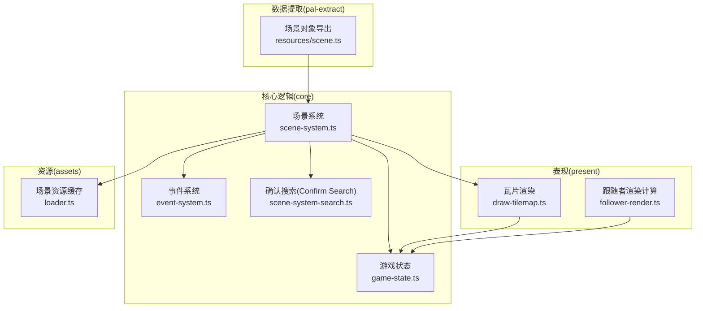
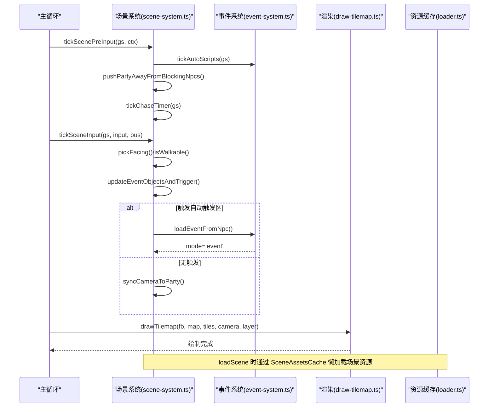
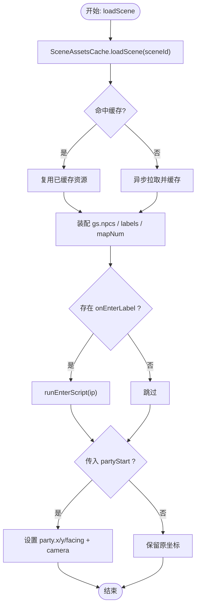
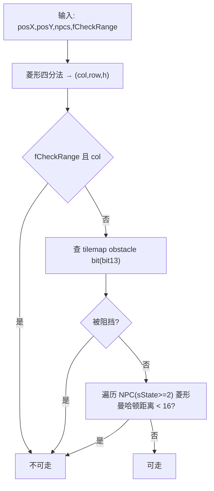
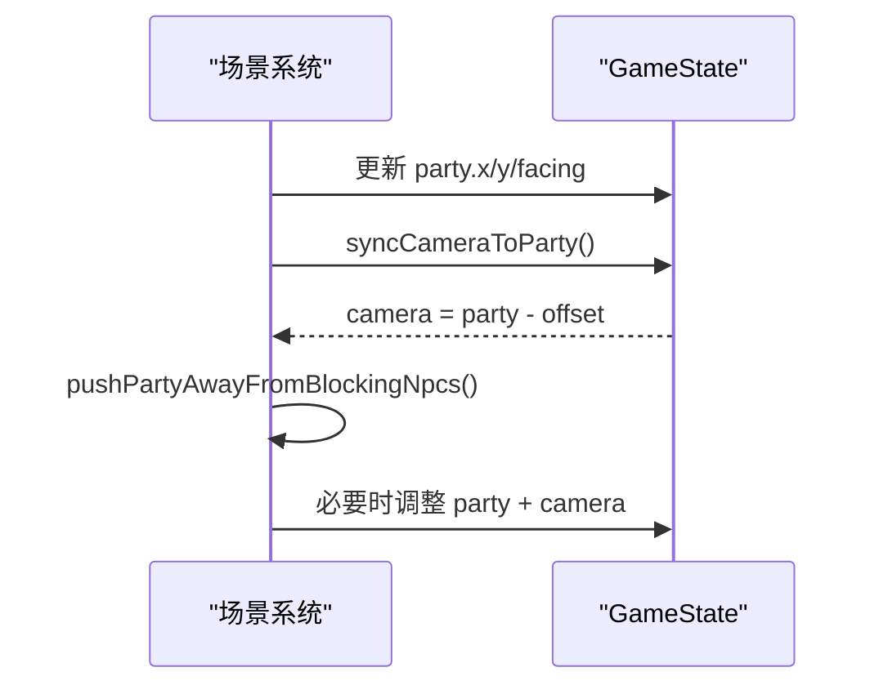
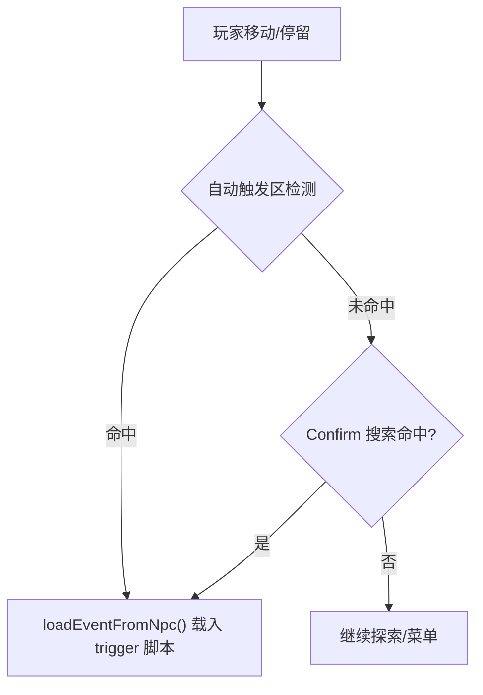
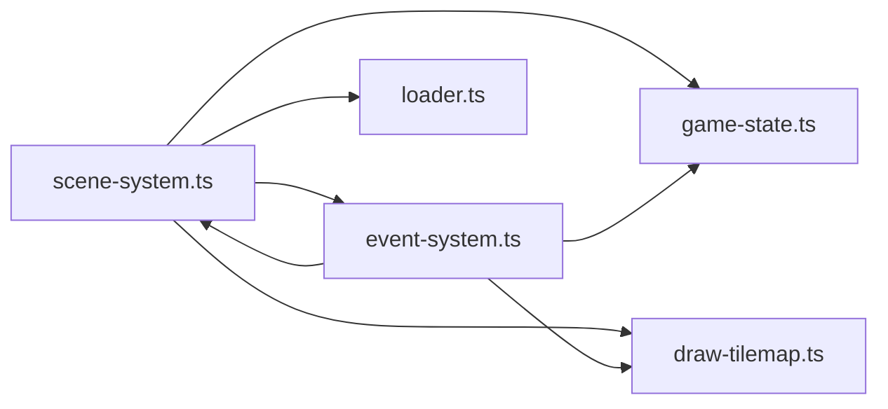

# 场景系统

<cite>
**本文引用的文件**   
- [packages/game/src/core/scene-system.ts](file://packages/game/src/core/scene-system.ts)
- [packages/game/src/core/scene-system-search.ts](file://packages/game/src/core/scene-system-search.ts)
- [packages/game/src/present/draw-tilemap.ts](file://packages/game/src/present/draw-tilemap.ts)
- [packages/game/src/assets/loader.ts](file://packages/game/src/assets/loader.ts)
- [packages/game/src/core/event-system.ts](file://packages/game/src/core/event-system.ts)
- [packages/game/src/core/game-state.ts](file://packages/game/src/core/game-state.ts)
- [packages/game/src/present/follower-render.ts](file://packages/game/src/present/follower-render.ts)
- [packages/pal-extract/src/resources/scene.ts](file://packages/pal-extract/src/resources/scene.ts)
</cite>

## 目录
1. [简介](#简介)
2. [项目结构](#项目结构)
3. [核心组件](#核心组件)
4. [架构总览](#架构总览)
5. [详细组件分析](#详细组件分析)
6. [依赖关系分析](#依赖关系分析)
7. [性能考量](#性能考量)
8. [故障排查指南](#故障排查指南)
9. [结论](#结论)
10. [附录](#附录)

## 简介
本文件面向“场景系统”的完整技术文档，覆盖以下关键主题：
- 场景加载与管理机制（含资源缓存、场景切换、地图与事件对象装配）
- 地图瓦片渲染（双层 tilemap、Y-sort、遮挡修复）
- 碰撞检测算法（菱形 isometric 判定、NPC 阻挡、自动推离）
- NPC 行为系统（自动脚本、触发器、寻路行走、朝向与帧动画）
- 相机控制逻辑（跟随主角、边界钳制、运镜平移）
- 数据结构与事件对象管理（NpcState、EventCursor、全局脚本数组）
- 触发器系统（自动触发区、Confirm 搜索、距离阈值与方向判定）
- 性能优化策略（LRU 场景资源缓存、视口裁剪、碰撞局部化）
- NPC AI 决策逻辑（autoScript 步进、walk-to 速度门控、朝向与姿态）
- 相机跟随算法（viewport 语义、camera-pan 多帧平移）
- 实操示例（添加新场景、配置碰撞区域、实现 NPC 行为脚本）
- 调试工具与性能监控方法（开发面板、状态快照、基准对比）

## 项目结构
场景系统位于游戏运行时包内，围绕 core 层（逻辑）、present 层（渲染）、assets 层（资源）协同工作。下图给出与场景系统直接相关的模块关系概览。



图表来源
- [packages/game/src/core/scene-system.ts:1-120](file://packages/game/src/core/scene-system.ts#L1-L120)
- [packages/game/src/present/draw-tilemap.ts:1-120](file://packages/game/src/present/draw-tilemap.ts#L1-L120)
- [packages/game/src/assets/loader.ts:451-499](file://packages/game/src/assets/loader.ts#L451-L499)
- [packages/pal-extract/src/resources/scene.ts:40-89](file://packages/pal-extract/src/resources/scene.ts#L40-L89)

章节来源
- [packages/game/src/core/scene-system.ts:1-120](file://packages/game/src/core/scene-system.ts#L1-L120)
- [packages/game/src/present/draw-tilemap.ts:1-120](file://packages/game/src/present/draw-tilemap.ts#L1-L120)
- [packages/game/src/assets/loader.ts:451-499](file://packages/game/src/assets/loader.ts#L451-L499)
- [packages/pal-extract/src/resources/scene.ts:40-89](file://packages/pal-extract/src/resources/scene.ts#L40-L89)

## 核心组件
- 场景系统（scene-system.ts）
  - 探索模式主循环：tickScenePreInput → tickSceneInput → tickSceneSystem
  - 输入→移动→碰撞→自动触发→菜单/Search→切模式
  - 相机跟随与边界钳制
  - 场景切换 loadScene（懒加载、onEnter 执行、partyStart 支持）
- 事件系统（event-system.ts）
  - 事件脚本协程式步进器（单 tick 连跑非阻塞命令，遇等待/结束/越界返回）
  - 大量 opcode 处理（对话、淡入淡出、场景切换、NPC 行走、相机平移等）
  - 调色板淡入淡出、屏幕特效、RNG/FBP 播放等
- 瓦片渲染（draw-tilemap.ts）
  - 双层 tilemap（底层/顶层），Y-sort 排序，接缝修复
  - 精灵遮挡 cover-tile 计算
- 资源缓存（loader.ts）
  - SceneAssetsCache：LRU 场景资源缓存，保护当前场景不被淘汰
- 确认搜索（scene-system-search.ts）
  - Confirm 键触发的 13 cell 范围搜索，按 triggerMode 区分近/中/远
- 游戏状态（game-state.ts）
  - NpcState、EventCursor、DialogBoxState、Party/Trail/Follower 等核心数据结构
- 跟随者渲染（follower-render.ts）
  - 0x98 set-follower 的额外跟随者位置与帧计算

章节来源
- [packages/game/src/core/scene-system.ts:443-584](file://packages/game/src/core/scene-system.ts#L443-L584)
- [packages/game/src/core/event-system.ts:1-120](file://packages/game/src/core/event-system.ts#L1-L120)
- [packages/game/src/present/draw-tilemap.ts:92-151](file://packages/game/src/present/draw-tilemap.ts#L92-L151)
- [packages/game/src/assets/loader.ts:451-499](file://packages/game/src/assets/loader.ts#L451-L499)
- [packages/game/src/core/scene-system-search.ts:35-93](file://packages/game/src/core/scene-system-search.ts#L35-L93)
- [packages/game/src/core/game-state.ts:82-224](file://packages/game/src/core/game-state.ts#L82-L224)
- [packages/game/src/present/follower-render.ts:1-65](file://packages/game/src/present/follower-render.ts#L1-L65)

## 架构总览
场景系统的运行流程由“场景系统 + 事件系统 + 渲染 + 资源”共同构成。下图展示一次典型帧内的调用序列与数据流。



图表来源
- [packages/game/src/core/scene-system.ts:443-584](file://packages/game/src/core/scene-system.ts#L443-L584)
- [packages/game/src/present/draw-tilemap.ts:92-151](file://packages/game/src/present/draw-tilemap.ts#L92-L151)
- [packages/game/src/assets/loader.ts:451-499](file://packages/game/src/assets/loader.ts#L451-L499)

## 详细组件分析

### 场景加载与管理机制
- 场景资源缓存
  - SceneAssetsCache 使用 Map 保持插入顺序，命中即刷新到 MRU；超过容量时从最旧端淘汰，且可保护当前场景不被淘汰。
- 场景切换 loadScene
  - 读取 sceneId 对应资源（tilemap、事件命令、labelMap、事件对象等）
  - 设置 gs.wNumScene、gs.sceneCommands、gs.sceneLabelMap、gs.npcs（切片或映射为 NpcState）
  - 执行 onEnter 脚本（setBattlefield/music/object state 等副作用）
  - 可选 partyStart 覆写队伍起点与相机位置
- 场景上下文同步
  - setSceneContext 更新 tilemap、eventCommands、labelMap，避免旧场景残留 labelMap 导致解析失败



图表来源
- [packages/game/src/assets/loader.ts:451-499](file://packages/game/src/assets/loader.ts#L451-L499)
- [packages/game/src/core/scene-system.ts:607-661](file://packages/game/src/core/scene-system.ts#L607-L661)

章节来源
- [packages/game/src/assets/loader.ts:451-499](file://packages/game/src/assets/loader.ts#L451-L499)
- [packages/game/src/core/scene-system.ts:607-661](file://packages/game/src/core/scene-system.ts#L607-L661)

### 地图瓦片渲染
- 双层 tilemap
  - layer 0（底层）先画，layer 1（顶层）后画，用于门、柜子侧面等遮挡效果
- 坐标与偏移
  - 基于 sdlpal 真实公式：每行 y 步进 16，h=1 相对 h=0 在 y 方向 +8；x 方向 lower 在 col*32-16，upper 在 col*32
- 视口裁剪与 fence 填充
  - 整行/整列在视口外则跳过；右/底边缘用 fence 回退首格 tile 填充，避免漏黑
- 接缝修复 repairTilemapSeams
  - 记录 coverage，对未覆盖像素向内扩散填充最近邻居像素，复现原版“缝里是邻接地形”的观感
- Cover-tile 计算 addCoverTileEntries
  - 根据精灵世界坐标与尺寸，计算可能覆盖该精灵的所有 layer-1 tile，生成 DrawEntry 参与 Y-sort

```mermaid
classDiagram
class Tilemap {
+width : number
+height : number
+cells[row][col] : {lower : number, upper : number}
}
class TileImages {
+get(index) : TileImage | undefined
}
class Framebuffer {
+width : number
+height : number
+indices : Uint8Array
+writePixel(x,y,idx) : void
}
class TileImage {
+width : number
+height : number
+indices : Uint8Array
+opaque : Uint8Array
}
Tilemap --> TileImages : "读取 tile id"
TileImages --> TileImage : "返回位图"
Framebuffer --> TileImage : "blit 写入像素"
```

图表来源
- [packages/game/src/present/draw-tilemap.ts:1-120](file://packages/game/src/present/draw-tilemap.ts#L1-L120)
- [packages/game/src/present/draw-tilemap.ts:92-151](file://packages/game/src/present/draw-tilemap.ts#L92-L151)
- [packages/game/src/present/draw-tilemap.ts:169-208](file://packages/game/src/present/draw-tilemap.ts#L169-L208)
- [packages/game/src/present/draw-tilemap.ts:255-383](file://packages/game/src/present/draw-tilemap.ts#L255-L383)

章节来源
- [packages/game/src/present/draw-tilemap.ts:92-151](file://packages/game/src/present/draw-tilemap.ts#L92-L151)
- [packages/game/src/present/draw-tilemap.ts:169-208](file://packages/game/src/present/draw-tilemap.ts#L169-L208)
- [packages/game/src/present/draw-tilemap.ts:255-383](file://packages/game/src/present/draw-tilemap.ts#L255-L383)

### 碰撞检测算法
- 菱形 isometric 碰撞
  - 将像素坐标映射到 (col, row, h)，查 tilemap obstacle bit（bit 13 of lower/upper u16）
  - NPC 菱形曼哈顿距离判定：abs(dx) + abs(dy)*2 < 16
  - sState >= 2 才阻挡（Blocker），sState=1 不阻挡（装饰 sprite）
- 下边界 blockX/blockY
  - 走路 fCheckRange=TRUE 时，限制队首不能进入左上 5 列/上 7 行边缘带，保证镜头恒居中
- 自动推离 pushPartyAwayFromBlockingNpcs
  - 若 NPC 压到 party anchor，沿 NPC 朝向下一方向试 4 个方向，找到可走点同时移动 party 与 camera



图表来源
- [packages/game/src/core/scene-system.ts:348-425](file://packages/game/src/core/scene-system.ts#L348-L425)
- [packages/game/src/core/scene-system.ts:276-296](file://packages/game/src/core/scene-system.ts#L276-L296)

章节来源
- [packages/game/src/core/scene-system.ts:348-425](file://packages/game/src/core/scene-system.ts#L348-L425)
- [packages/game/src/core/scene-system.ts:276-296](file://packages/game/src/core/scene-system.ts#L276-L296)

### NPC 行为系统
- 自动脚本 autoScript
  - 每 tick 推进 1 op（idleFrameCount 累计 wait N frames），与 trigger 脚本并行不阻塞
  - 支持 call-script 子脚本栈、currentEventObjectId 作用域
- 触发器系统
  - 自动触发区：Manhattan 距离阈值 = (triggerMode - TRIGGER_MODE_AUTO_MIN)*32 + 16，mode 4..8
  - Confirm 搜索：13 cell 范围，按 triggerMode 1..3 区分近/中/远，grid match 命中后转向站立帧
- 行走与姿态
  - walkOneStep/walkTo 系列 opcode，speed 2/3/4/8 不同步调门控
  - 朝向与姿势：setEventObjectDirAndFrame、setEventObjectGesture、nSpriteFrames/nSpriteFramesAuto 驱动帧循环
- 跟随者
  - 0x98 set-follower 额外跟随者，trail[3+k] 占位，固定 3 帧步序列

```mermaid
classDiagram
class NpcState {
+id : number
+x : number
+y : number
+spriteNum : number
+triggerLabel? : string
+triggerMode? : number
+sState? : number
+sVanishTime? : number
+sLayer? : number
+nSpriteFrames? : number
+nSpriteFramesAuto? : number
+facing? : Facing
+scriptedFrame? : number
+autoCursor? : { ip, idleFrameCount, commands?, labelMap?, currentEventObjectId? }
}
class EventCursor {
+ip : number
+waiting? : string
+waitFramesRemaining? : number
+cameraPanFramesRemaining? : number
+delayUntilMs? : number
+currentEventObjectId? : number
+callStack? : any[]
}
NpcState --> EventCursor : "触发时注入 currentEventObjectId"
```

图表来源
- [packages/game/src/core/game-state.ts:82-224](file://packages/game/src/core/game-state.ts#L82-L224)
- [packages/game/src/core/game-state.ts:226-343](file://packages/game/src/core/game-state.ts#L226-L343)
- [packages/game/src/present/follower-render.ts:1-65](file://packages/game/src/present/follower-render.ts#L1-L65)

章节来源
- [packages/game/src/core/game-state.ts:82-224](file://packages/game/src/core/game-state.ts#L82-L224)
- [packages/game/src/core/game-state.ts:226-343](file://packages/game/src/core/game-state.ts#L226-L343)
- [packages/game/src/present/follower-render.ts:1-65](file://packages/game/src/present/follower-render.ts#L1-L65)

### 相机控制逻辑
- 跟随算法
  - camera = party - PARTYOFFSET_X/Y，随 party 移动同步更新，带地图边界 clamp
- 运镜平移 camera-pan
  - 0x7F 多帧 viewport 平移：逐帧 dx/dy 累加，waiting='camera-pan'，期间 autoScript 放行
- 自动推离影响相机
  - pushPartyAwayFromBlockingNpcs 同时移动 party 与 camera，保持语义一致



图表来源
- [packages/game/src/core/scene-system.ts:427-434](file://packages/game/src/core/scene-system.ts#L427-L434)
- [packages/game/src/core/scene-system.ts:276-296](file://packages/game/src/core/scene-system.ts#L276-L296)
- [packages/game/src/core/event-system.ts:612-628](file://packages/game/src/core/event-system.ts#L612-L628)

章节来源
- [packages/game/src/core/scene-system.ts:427-434](file://packages/game/src/core/scene-system.ts#L427-L434)
- [packages/game/src/core/scene-system.ts:276-296](file://packages/game/src/core/scene-system.ts#L276-L296)
- [packages/game/src/core/event-system.ts:612-628](file://packages/game/src/core/event-system.ts#L612-L628)

### 事件对象管理与触发器系统
- 事件对象导出
  - pal-extract 导出全局 event object 表与各 scene 的 [start,end) 区间，供运行时切片装配
- 触发器类型
  - Confirm 搜索（triggerMode 1..3）：13 cell 范围 + grid match
  - 自动触发区（triggerMode 4..8）：Manhattan 距离阈值，靠近即触发
- 触发后行为
  - NPC 转向面对 party（有方向性 sprite 时），重置站立帧；载入 trigger script 并切 event 模式



图表来源
- [packages/pal-extract/src/resources/scene.ts:40-89](file://packages/pal-extract/src/resources/scene.ts#L40-L89)
- [packages/game/src/core/scene-system-search.ts:35-93](file://packages/game/src/core/scene-system-search.ts#L35-L93)
- [packages/game/src/core/scene-system.ts:125-140](file://packages/game/src/core/scene-system.ts#L125-L140)
- [packages/game/src/core/scene-system.ts:302-339](file://packages/game/src/core/scene-system.ts#L302-L339)

章节来源
- [packages/pal-extract/src/resources/scene.ts:40-89](file://packages/pal-extract/src/resources/scene.ts#L40-L89)
- [packages/game/src/core/scene-system-search.ts:35-93](file://packages/game/src/core/scene-system-search.ts#L35-L93)
- [packages/game/src/core/scene-system.ts:125-140](file://packages/game/src/core/scene-system.ts#L125-L140)
- [packages/game/src/core/scene-system.ts:302-339](file://packages/game/src/core/scene-system.ts#L302-L339)

## 依赖关系分析
- 场景系统依赖
  - 事件系统（脚本解释、opcode 处理、fade/rng/fbp 等特效）
  - 渲染（draw-tilemap 瓦片与 cover-tile）
  - 资源缓存（SceneAssetsCache）
  - 游戏状态（NpcState、EventCursor、Party/Trail/Follower）
- 事件系统依赖
  - 场景系统（getCurrentMapNum、setObstacleChecker 注入）
  - 调色板淡入淡出（palette-fade）
  - 对话框（dialog-box）
  - 战斗系统（battle-opcodes，仅战斗路径）



图表来源
- [packages/game/src/core/scene-system.ts:1-120](file://packages/game/src/core/scene-system.ts#L1-L120)
- [packages/game/src/core/event-system.ts:1-120](file://packages/game/src/core/event-system.ts#L1-L120)
- [packages/game/src/present/draw-tilemap.ts:1-120](file://packages/game/src/present/draw-tilemap.ts#L1-L120)
- [packages/game/src/assets/loader.ts:451-499](file://packages/game/src/assets/loader.ts#L451-L499)
- [packages/game/src/core/game-state.ts:1-120](file://packages/game/src/core/game-state.ts#L1-L120)

章节来源
- [packages/game/src/core/scene-system.ts:1-120](file://packages/game/src/core/scene-system.ts#L1-L120)
- [packages/game/src/core/event-system.ts:1-120](file://packages/game/src/core/event-system.ts#L1-L120)
- [packages/game/src/present/draw-tilemap.ts:1-120](file://packages/game/src/present/draw-tilemap.ts#L1-L120)
- [packages/game/src/assets/loader.ts:451-499](file://packages/game/src/assets/loader.ts#L451-L499)
- [packages/game/src/core/game-state.ts:1-120](file://packages/game/src/core/game-state.ts#L1-L120)

## 性能考量
- 场景资源缓存（LRU）
  - 命中即刷新 MRU；超容从最旧端淘汰；可保护当前场景不被淘汰，减少重复 fetch
- 瓦片渲染优化
  - 视口裁剪：整行/整列在视口外直接跳过
  - fence 填充：避免边缘漏黑导致的额外绘制
  - coverage 修复：仅在需要时进行少量 pass 的内向扩散
- 碰撞检测优化
  - 局部化：仅检查附近 NPC（菱形曼哈顿距离阈值）
  - 早返回：tilemap obstacle bit 优先判断
- 自动脚本与触发
  - autoScript 每 tick 只推进 1 op，避免重负载
  - 自动触发区按 threshold 快速过滤，减少无效脚本启动

章节来源
- [packages/game/src/assets/loader.ts:451-499](file://packages/game/src/assets/loader.ts#L451-L499)
- [packages/game/src/present/draw-tilemap.ts:92-151](file://packages/game/src/present/draw-tilemap.ts#L92-L151)
- [packages/game/src/present/draw-tilemap.ts:169-208](file://packages/game/src/present/draw-tilemap.ts#L169-L208)
- [packages/game/src/core/scene-system.ts:348-425](file://packages/game/src/core/scene-system.ts#L348-L425)

## 故障排查指南
- 常见问题定位
  - 场景切换后 labelMap 残留：确保 setSceneContext 同步更新 tilemap/eventCommands/labelMap
  - 自动触发区不触发：检查 triggerMode 与 Manhattan 阈值、autoTriggerAnchorX/Y 是否合理
  - 瓦片接缝漏黑：启用 repairTilemapSeams，确认 coverage 正确记录
  - NPC 行走卡顿：核对 speed 门控（奇偶帧 gate）、nSpriteFramesAuto 是否正确回填
  - 相机偏离中心：确认 fCheckRange 与 blockX/blockY 生效，pushPartyAwayFromBlockingNpcs 正常
- 调试工具
  - 开发面板：查看当前场景、事件对象、脚本光标、菜单状态
  - 状态快照：导出 GameState/NpcState 快照，比对 sdlpal baseline
  - 基准对比：使用 tilemap/battle baseline 脚本抽取与对比

章节来源
- [packages/game/src/core/scene-system.ts:627-634](file://packages/game/src/core/scene-system.ts#L627-L634)
- [packages/game/src/core/scene-system.ts:125-140](file://packages/game/src/core/scene-system.ts#L125-L140)
- [packages/game/src/present/draw-tilemap.ts:169-208](file://packages/game/src/present/draw-tilemap.ts#L169-L208)
- [packages/game/src/core/event-system.ts:480-491](file://packages/game/src/core/event-system.ts#L480-L491)
- [packages/game/src/core/scene-system.ts:276-296](file://packages/game/src/core/scene-system.ts#L276-L296)

## 结论
场景系统以“场景自包含 + 单一全局脚本数组 + 资源 LRU 缓存”为核心设计，结合忠实于 sdlpal 的碰撞、触发、相机与渲染算法，实现了高保真与高性能的探索体验。通过模块化拆分（core/present/assets）与清晰的职责边界，新增场景、配置碰撞区域、编写 NPC 行为脚本均具备良好可扩展性与可维护性。

## 附录

### 实操示例

- 添加新场景
  - 步骤
    - 准备场景资源（tilemap、事件对象、事件脚本、labelMap）
    - 使用 SceneAssetsCache 懒加载：await assets.loadScene(sceneId)
    - 调用 loadScene({ gs, sceneId, assets, partyStart? })
    - 如需指定入口位置，传入 partyStart（x,y,facing）
  - 参考路径
    - [packages/game/src/assets/loader.ts:451-499](file://packages/game/src/assets/loader.ts#L451-L499)
    - [packages/game/src/core/scene-system.ts:607-661](file://packages/game/src/core/scene-system.ts#L607-L661)

- 配置碰撞区域
  - 步骤
    - 在 tilemap 中设置 obstacle bit（bit 13 of lower/upper u16）
    - 对于 NPC 阻挡，确保 sState >= 2（Blocker）
    - 如需限制队首进入边缘带，保持 fCheckRange=TRUE（走路时默认开启）
  - 参考路径
    - [packages/game/src/core/scene-system.ts:348-425](file://packages/game/src/core/scene-system.ts#L348-L425)

- 实现 NPC 行为脚本
  - 步骤
    - 在事件对象中设置 triggerLabel/autoLabel（L_<global ip>）
    - 使用 opcode 控制行走（OP_NPC_WALK_TO_*）、朝向与姿态（OP_SET_EVENT_OBJECT_DIR_AND_FRAME、OP_SET_OBJECT_GESTURE）
    - 如需自动脚本，设置 autoCursor.ip 并在 explore 模式下每 tick 推进
  - 参考路径
    - [packages/game/src/core/event-system.ts:141-233](file://packages/game/src/core/event-system.ts#L141-L233)
    - [packages/game/src/core/game-state.ts:178-224](file://packages/game/src/core/game-state.ts#L178-L224)