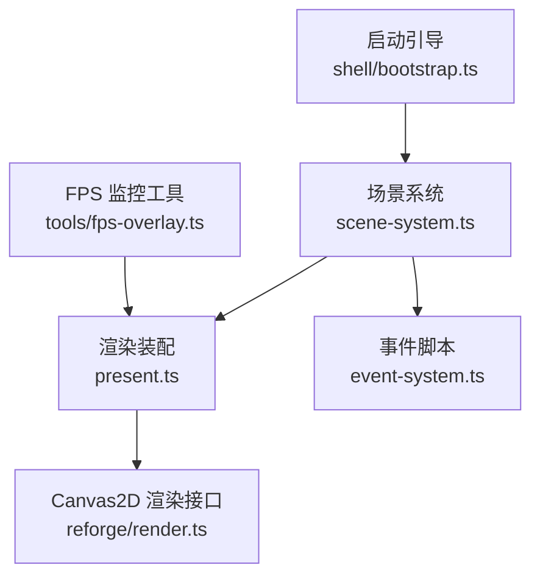
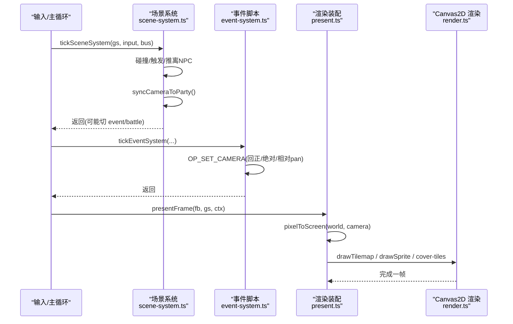
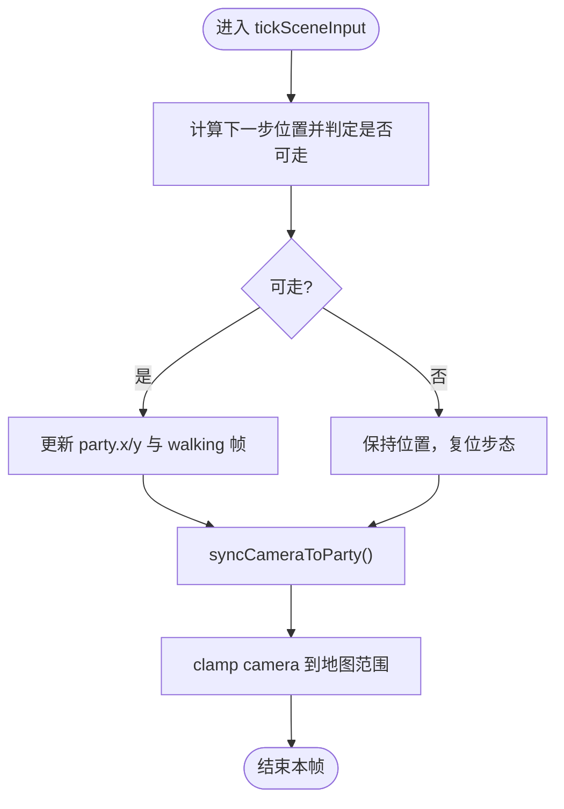
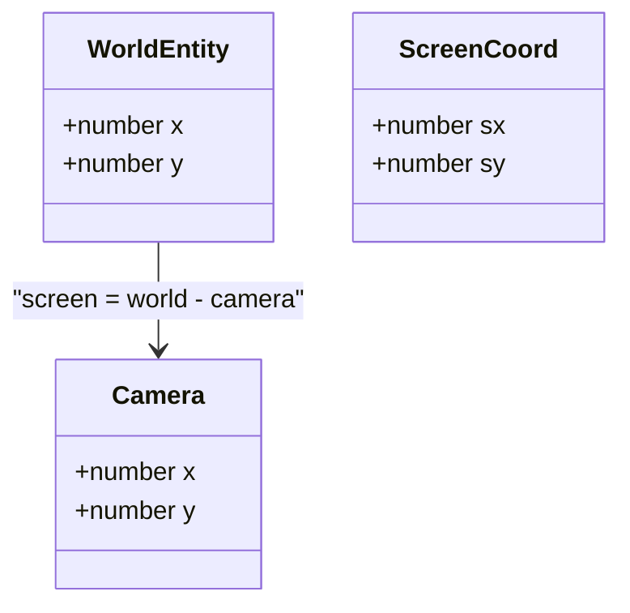
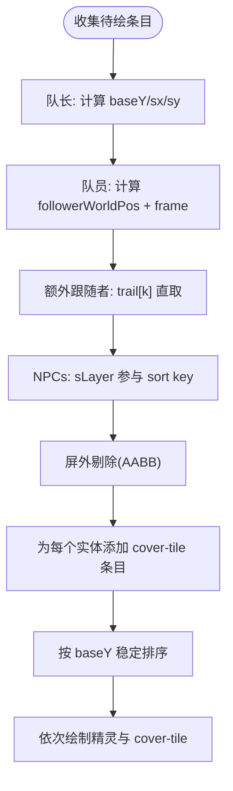
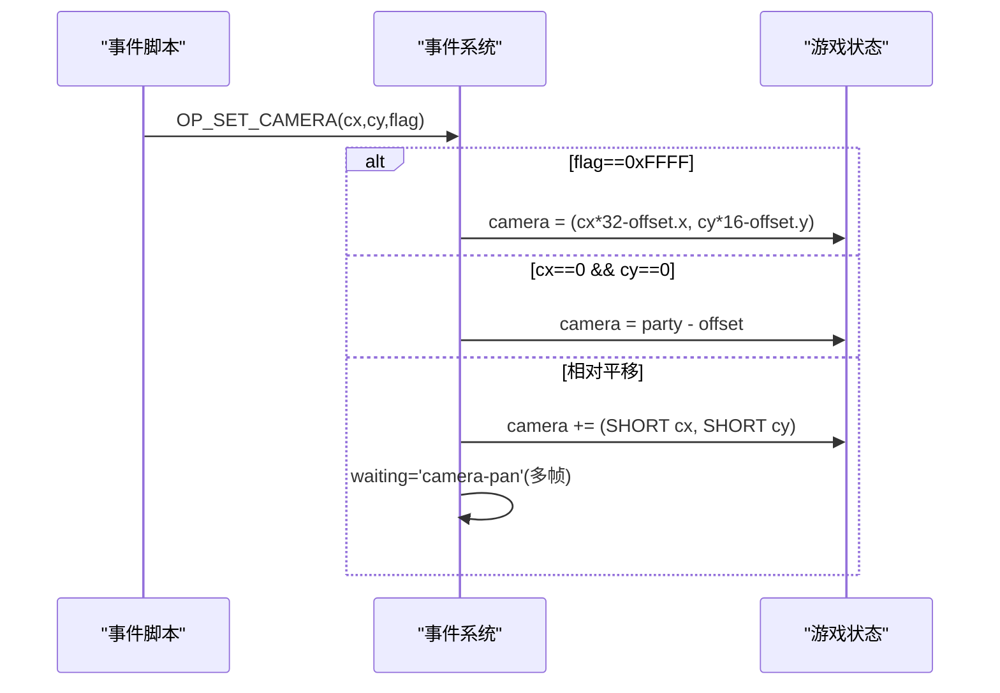
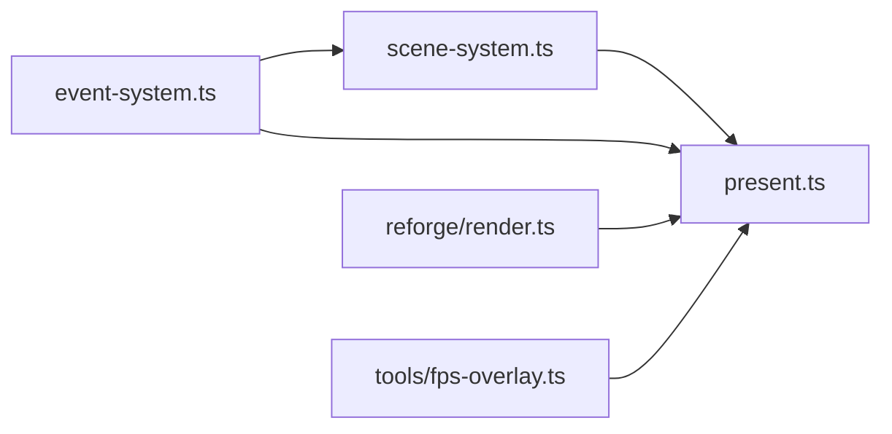

# 相机控制

<cite>
**本文引用的文件**   
- [packages/game/src/core/scene-system.ts](file://packages/game/src/core/scene-system.ts)
- [packages/game/src/present/present.ts](file://packages/game/src/present/present.ts)
- [packages/reforge/src/render.ts](file://packages/reforge/src/render.ts)
- [packages/game/src/core/event-system.ts](file://packages/game/src/core/event-system.ts)
- [packages/game/src/tools/fps-overlay.ts](file://packages/game/src/tools/fps-overlay.ts)
- [packages/game/src/shell/bootstrap.ts](file://packages/game/src/shell/bootstrap.ts)
</cite>

## 目录
1. [简介](#简介)
2. [项目结构](#项目结构)
3. [核心组件](#核心组件)
4. [架构总览](#架构总览)
5. [详细组件分析](#详细组件分析)
6. [依赖关系分析](#依赖关系分析)
7. [性能考虑](#性能考虑)
8. [故障排查指南](#故障排查指南)
9. [结论](#结论)
10. [附录](#附录)

## 简介
本文件围绕“相机控制系统”进行系统化文档化，覆盖以下关键主题：
- 相机跟随算法与视口边界限制
- 平滑移动插值（多帧平移）
- 相机坐标系统与场景坐标系统的转换关系
- 多目标跟踪逻辑（队伍成员与额外跟随者）
- 特殊场景的相机控制（脚本驱动、固定镜头、过场动画）
- 性能优化策略（视锥剔除、Y 排序遮挡、接缝修复）
- 动态分辨率适配与多屏幕适配思路
- 自定义相机行为、过场动画相机、多屏幕适配示例路径
- 调试与性能监控工具使用方法

## 项目结构
相机相关能力横跨“场景系统（更新与跟随）—渲染装配（坐标转换与绘制）—事件脚本（相机控制指令）—工具面板（FPS 监控）”。

图示来源
- [packages/game/src/core/scene-system.ts:427-434](file://packages/game/src/core/scene-system.ts#L427-L434)
- [packages/game/src/present/present.ts:144-152](file://packages/game/src/present/present.ts#L144-L152)
- [packages/game/src/core/event-system.ts:3650-3672](file://packages/game/src/core/event-system.ts#L3650-L3672)
- [packages/reforge/src/render.ts:47-50](file://packages/reforge/src/render.ts#L47-L50)
- [packages/game/src/shell/bootstrap.ts:636](file://packages/game/src/shell/bootstrap.ts#L636)
- [packages/game/src/tools/fps-overlay.ts](file://packages/game/src/tools/fps-overlay.ts)

章节来源
- [packages/game/src/core/scene-system.ts:427-434](file://packages/game/src/core/scene-system.ts#L427-L434)
- [packages/game/src/present/present.ts:144-152](file://packages/game/src/present/present.ts#L144-L152)
- [packages/game/src/core/event-system.ts:3650-3672](file://packages/game/src/core/event-system.ts#L3650-L3672)
- [packages/reforge/src/render.ts:47-50](file://packages/reforge/src/render.ts#L47-L50)
- [packages/game/src/shell/bootstrap.ts:636](file://packages/game/src/shell/bootstrap.ts#L636)
- [packages/game/src/tools/fps-overlay.ts](file://packages/game/src/tools/fps-overlay.ts)

## 核心组件
- 相机状态与语义
  - 相机在系统中以 {x, y} 表示，语义为“屏幕左上角的世界坐标”，等价于 SDL-Pal 的 viewport。
  - 队首世界坐标 = camera + (160, 112)，即 PARTYOFFSET_X/Y。
- 相机跟随与边界限制
  - 每帧根据队首位置计算 camera = party - offset，并 clamp 到地图范围 [0, maxX]×[0, maxY]。
- 坐标转换
  - 世界坐标 → 屏幕坐标：screen = world - camera；用于精灵与瓦片定位。
- 多目标跟踪
  - 队长与队员、额外跟随者均按各自世界坐标参与 Y-sort 与 cover-tile 计算。
- 脚本驱动的相机控制
  - 支持回正、绝对跳转、相对平移（可多帧），以及“固定镜头不跟随”的特殊模式。

章节来源
- [packages/game/src/core/scene-system.ts:427-434](file://packages/game/src/core/scene-system.ts#L427-L434)
- [packages/game/src/present/present.ts:144-152](file://packages/game/src/present/present.ts#L144-L152)
- [packages/game/src/core/event-system.ts:3650-3672](file://packages/game/src/core/event-system.ts#L3650-L3672)

## 架构总览
下图展示从输入到渲染的完整流程，重点标注相机在各阶段的作用点。

图示来源
- [packages/game/src/core/scene-system.ts:427-434](file://packages/game/src/core/scene-system.ts#L427-L434)
- [packages/game/src/core/event-system.ts:3650-3672](file://packages/game/src/core/event-system.ts#L3650-L3672)
- [packages/game/src/present/present.ts:144-152](file://packages/game/src/present/present.ts#L144-L152)
- [packages/reforge/src/render.ts:47-50](file://packages/reforge/src/render.ts#L47-L50)

## 详细组件分析

### 相机跟随与视口边界限制
- 跟随逻辑
  - 每帧将 camera 设置为 party - offset，确保队首始终位于屏幕中心区域。
- 边界限制
  - 将 camera 的 x/y 限制在 [0, (width-1)*TILE_W] × [0, (height-1)*TILE_H]，防止越界。
- 行走下边界保护
  - isWalkable 在 fCheckRange=TRUE 时，对左上边缘带（blockX/blockY）做阻挡，保证队首不会走入左上不可见区，从而维持镜头居中。

图示来源
- [packages/game/src/core/scene-system.ts:427-434](file://packages/game/src/core/scene-system.ts#L427-L434)
- [packages/game/src/core/scene-system.ts:371-425](file://packages/game/src/core/scene-system.ts#L371-L425)

章节来源
- [packages/game/src/core/scene-system.ts:427-434](file://packages/game/src/core/scene-system.ts#L427-L434)
- [packages/game/src/core/scene-system.ts:371-425](file://packages/game/src/core/scene-system.ts#L371-L425)

### 坐标系统与转换关系
- 世界坐标
  - 所有实体（party、npc、follower）均以像素为单位的世界坐标存储。
- 相机坐标
  - camera 表示屏幕左上角在世界坐标系中的位置。
- 屏幕坐标
  - screen = world - camera；精灵与瓦片绘制均基于此公式。
- 队首居中
  - party_screen = (160, 112)，即 PARTYOFFSET_X/Y。

图示来源
- [packages/reforge/src/render.ts:47-50](file://packages/reforge/src/render.ts#L47-L50)
- [packages/game/src/present/present.ts:144-152](file://packages/game/src/present/present.ts#L144-L152)

章节来源
- [packages/reforge/src/render.ts:47-50](file://packages/reforge/src/render.ts#L47-L50)
- [packages/game/src/present/present.ts:144-152](file://packages/game/src/present/present.ts#L144-L152)

### 多目标跟踪逻辑（队伍与额外跟随者）
- 队长
  - 使用当前朝向与 walkFrames 决定站立或行走帧，参与 Y-sort 与 cover-tile。
- 队员
  - 依据 trail 与方向偏移计算世界位置，按各自角色 sprite 渲染，同样参与 Y-sort 与 cover-tile。
- 额外跟随者（0x98）
  - 直接取 trail 对应项，恒 3 帧步，按自身 sprite 渲染，参与 Y-sort 与 cover-tile。
- 屏外剔除
  - 在加入 entries 之前进行 AABB 剔除，避免无效绘制与 cover-tile 生成。

图示来源
- [packages/game/src/present/present.ts:303-490](file://packages/game/src/present/present.ts#L303-L490)
- [packages/game/src/present/present.ts:548-582](file://packages/game/src/present/present.ts#L548-L582)

章节来源
- [packages/game/src/present/present.ts:303-490](file://packages/game/src/present/present.ts#L303-L490)
- [packages/game/src/present/present.ts:548-582](file://packages/game/src/present/present.ts#L548-L582)

### 脚本驱动的相机控制（含多帧平移）
- 回正：camera = party - offset
- 绝对跳转：camera = (tileCol*32 - offset.x, tileRow*16 - offset.y)
- 相对平移：camera += (dx, dy)，支持多帧逐帧推进（waiting='camera-pan'）
- 固定镜头：通过脚本设置 camera 后不再随 party 移动（例如某些 cutscene 或特殊交互）

图示来源
- [packages/game/src/core/event-system.ts:3650-3672](file://packages/game/src/core/event-system.ts#L3650-L3672)

章节来源
- [packages/game/src/core/event-system.ts:3650-3672](file://packages/game/src/core/event-system.ts#L3650-L3672)

### 特殊场景的相机控制
- 骑乘对象移动：当相机已偏离居中时，骑乘移动会保持偏移量，camera 增量与 party 一致，避免强制回正。
- 固定镜头：某些脚本路径中 camera 被设为固定值，后续探索跟随逻辑仍执行，但会被脚本再次覆盖或受 waiting 控制。

章节来源
- [packages/game/src/core/event-system.test.ts:2128-2139](file://packages/game/src/core/event-system.test.ts#L2128-L2139)
- [packages/game/src/core/event-system.test.ts:5771-5783](file://packages/game/src/core/event-system.test.ts#L5771-L5783)

### 平滑移动插值（多帧平移）
- 多帧 pan：OP_SET_CAMERA 的第三参数指定帧数，事件系统将其拆分为逐帧增量，等待 'camera-pan' 状态，直到帧数耗尽再继续后续脚本。
- 负位移：支持负 SHORT 值，实现反向平移。

章节来源
- [packages/game/src/core/event-system.test.ts:5714-5749](file://packages/game/src/core/event-system.test.ts#L5714-L5749)

### 自定义相机行为与过场动画相机
- 自定义相机行为
  - 在事件脚本中使用 OP_SET_CAMERA 实现任意回正、绝对跳转与相对平移组合，配合 waiting 可实现复杂运镜。
- 过场动画相机
  - 结合 fadeState、blackScreenHold、gameOverActive 等标记，可在过渡期冻结场景重绘，叠加对话框与特效，形成电影化运镜体验。
- 参考路径
  - 相机控制指令：event-system.ts
  - 过渡与冻结：present.ts
  - 启动与上下文同步：bootstrap.ts

章节来源
- [packages/game/src/core/event-system.ts:3650-3672](file://packages/game/src/core/event-system.ts#L3650-L3672)
- [packages/game/src/present/present.ts:166-260](file://packages/game/src/present/present.ts#L166-L260)
- [packages/game/src/shell/bootstrap.ts:636](file://packages/game/src/shell/bootstrap.ts#L636)

### 多屏幕适配与动态分辨率
- 基础适配
  - 渲染层以像素为单位，camera 与世界坐标均为像素级，天然适配不同显示尺寸。
- 视口裁剪
  - 通过 tilemap 边界 clamp 与精灵 AABB 剔除，确保在不同分辨率下不会出现越界或多余绘制。
- 建议扩展
  - 若需动态分辨率，可在 bootstrap 或 shell 层调整 framebuffer 尺寸，并在 render 层按比例缩放输出；注意保持 camera/world 单位不变，仅改变最终呈现。

章节来源
- [packages/game/src/present/present.ts:548-582](file://packages/game/src/present/present.ts#L548-L582)
- [packages/game/src/shell/bootstrap.ts:636](file://packages/game/src/shell/bootstrap.ts#L636)

## 依赖关系分析
- scene-system.ts
  - 负责玩家移动、碰撞、自动触发、推离 NPC、相机跟随与边界限制。
- present.ts
  - 负责一帧渲染装配：坐标转换、精灵收集、cover-tile 计算、Y-sort、屏外剔除、特效叠加。
- event-system.ts
  - 提供脚本级相机控制（OP_SET_CAMERA），支持多帧平移与固定镜头。
- reforge/render.ts
  - 定义 Camera 接口与 Canvas2D 渲染器，演示 camera 在渲染管线中的使用方式。
- tools/fps-overlay.ts
  - 提供 FPS 监控，辅助相机与渲染性能调优。

图示来源
- [packages/game/src/core/scene-system.ts:427-434](file://packages/game/src/core/scene-system.ts#L427-L434)
- [packages/game/src/present/present.ts:144-152](file://packages/game/src/present/present.ts#L144-L152)
- [packages/game/src/core/event-system.ts:3650-3672](file://packages/game/src/core/event-system.ts#L3650-L3672)
- [packages/reforge/src/render.ts:47-50](file://packages/reforge/src/render.ts#L47-L50)
- [packages/game/src/tools/fps-overlay.ts](file://packages/game/src/tools/fps-overlay.ts)

章节来源
- [packages/game/src/core/scene-system.ts:427-434](file://packages/game/src/core/scene-system.ts#L427-L434)
- [packages/game/src/present/present.ts:144-152](file://packages/game/src/present/present.ts#L144-L152)
- [packages/game/src/core/event-system.ts:3650-3672](file://packages/game/src/core/event-system.ts#L3650-L3672)
- [packages/reforge/src/render.ts:47-50](file://packages/reforge/src/render.ts#L47-L50)
- [packages/game/src/tools/fps-overlay.ts](file://packages/game/src/tools/fps-overlay.ts)

## 性能考虑
- Y 排序与遮挡
  - 所有精灵与 cover-tile 统一入表并按 baseY 升序绘制，正确实现高度感知遮挡。
- 屏外剔除
  - 在加入 entries 前进行 AABB 剔除，减少不必要的绘制与 cover-tile 生成。
- 接缝修复
  - 因每帧清屏导致透明像素露黑，采用 coverage mask 与邻接地形回填修复接缝。
- 资源缓存
  - Canvas2D 渲染器使用 tileCache 与 frameCache 降低重复烘焙开销。
- 特效与冻结
  - 在 fade、freeze、game-over 等状态下跳过场景重绘，避免无意义计算。

章节来源
- [packages/game/src/present/present.ts:270-300](file://packages/game/src/present/present.ts#L270-L300)
- [packages/game/src/present/present.ts:548-582](file://packages/game/src/present/present.ts#L548-L582)
- [packages/reforge/src/render.ts:87-125](file://packages/reforge/src/render.ts#L87-L125)

## 故障排查指南
- 常见问题
  - 队首未居中：检查 isWalkable 的 fCheckRange 与 BLOCK_X/BLOCK_Y 是否正确生效。
  - 相机越界：确认 syncCameraToParty 的 clamp 范围与 tilemap 尺寸一致。
  - 多帧 pan 不生效：检查 waiting='camera-pan' 状态与帧计数是否清零。
  - 屏缘异常地块闪烁：确认屏外剔除发生在 cover-tile 生成之前。
- 调试与监控
  - 使用 FPS 监控工具观察帧率波动，定位相机与渲染热点。
  - 在事件脚本中插入 OP_SET_CAMERA 断点式移动，验证相机变化是否符合预期。

章节来源
- [packages/game/src/core/scene-system.ts:371-425](file://packages/game/src/core/scene-system.ts#L371-L425)
- [packages/game/src/core/scene-system.ts:427-434](file://packages/game/src/core/scene-system.ts#L427-L434)
- [packages/game/src/core/event-system.ts:3650-3672](file://packages/game/src/core/event-system.ts#L3650-L3672)
- [packages/game/src/present/present.ts:548-582](file://packages/game/src/present/present.ts#L548-L582)
- [packages/game/src/tools/fps-overlay.ts](file://packages/game/src/tools/fps-overlay.ts)

## 结论
本相机控制系统以“viewport 语义”为核心，结合严格的边界限制、精确的坐标转换与高效的遮挡处理，实现了忠实原版的视觉表现与稳定的运行性能。通过脚本驱动的相机控制与多帧平移机制，开发者可以灵活构建过场动画与特殊场景的运镜效果。配合屏外剔除、Y 排序与资源缓存等优化策略，系统在多种分辨率与设备环境下均能保持良好表现。

## 附录
- 自定义相机行为示例路径
  - 脚本控制：event-system.ts（OP_SET_CAMERA）
  - 过渡与冻结：present.ts（fadeState、blackScreenHold、gameOverActive）
  - 启动与上下文同步：bootstrap.ts（setSceneContext 与 mapNum 同步）
- 多屏幕适配建议
  - 保持 camera/world 单位为像素，仅在输出层进行缩放；必要时在 bootstrap 层调整 framebuffer 尺寸。
- 调试工具
  - FPS 监控：tools/fps-overlay.ts
  - 事件脚本断点：在脚本中插入 OP_SET_CAMERA 观察 camera 变化

章节来源
- [packages/game/src/core/event-system.ts:3650-3672](file://packages/game/src/core/event-system.ts#L3650-L3672)
- [packages/game/src/present/present.ts:166-260](file://packages/game/src/present/present.ts#L166-L260)
- [packages/game/src/shell/bootstrap.ts:636](file://packages/game/src/shell/bootstrap.ts#L636)
- [packages/game/src/tools/fps-overlay.ts](file://packages/game/src/tools/fps-overlay.ts)