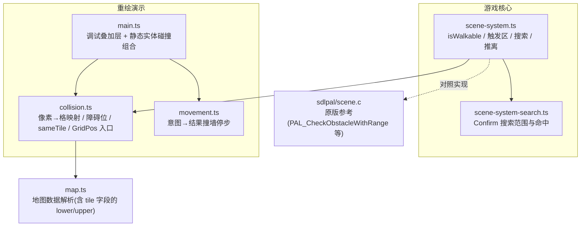
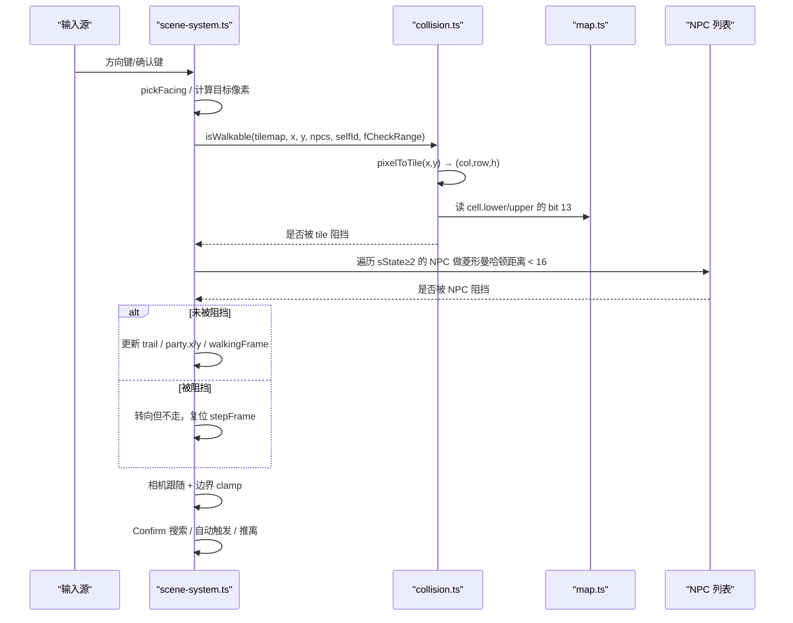
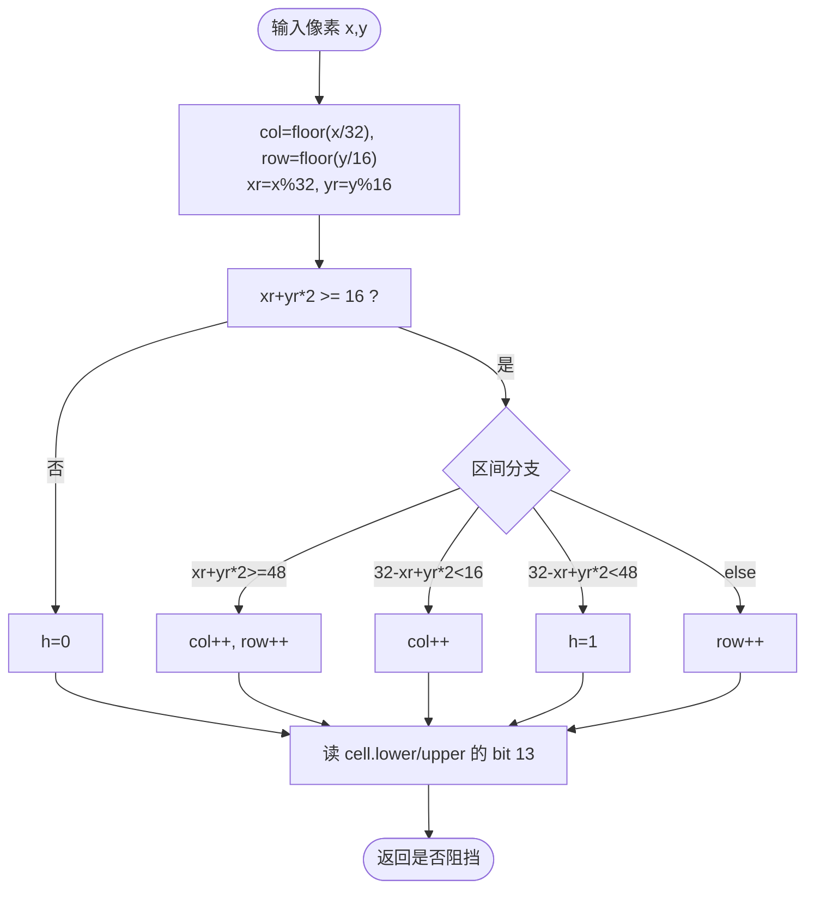
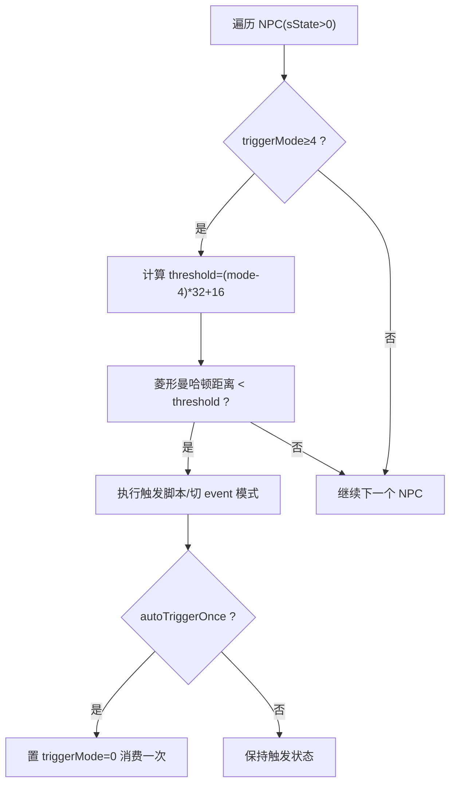
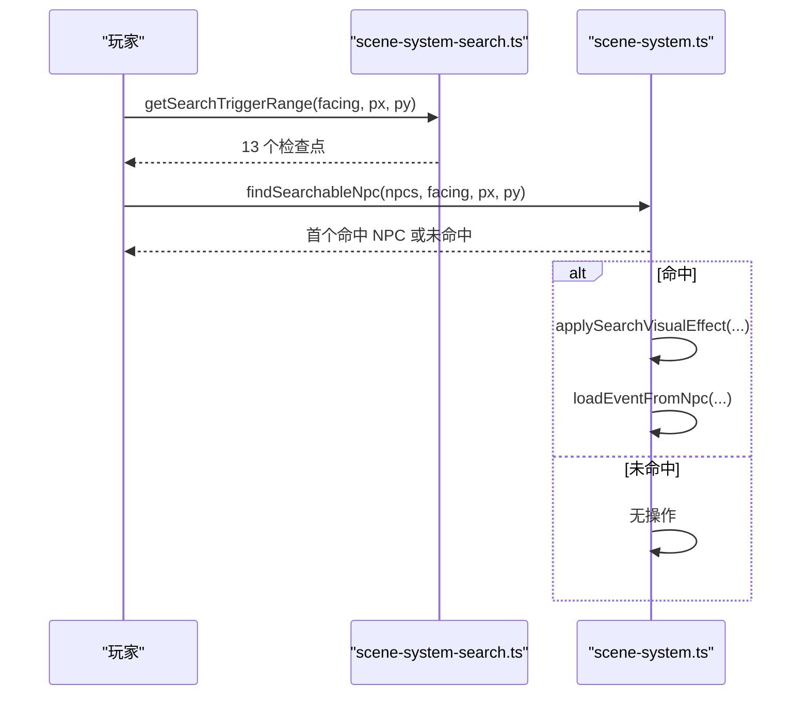
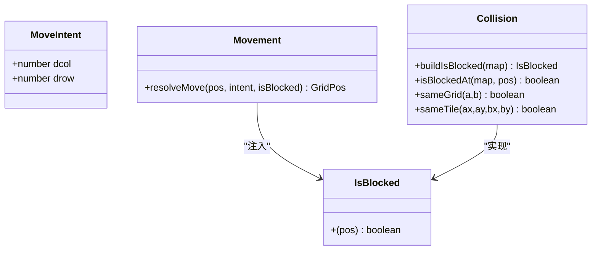
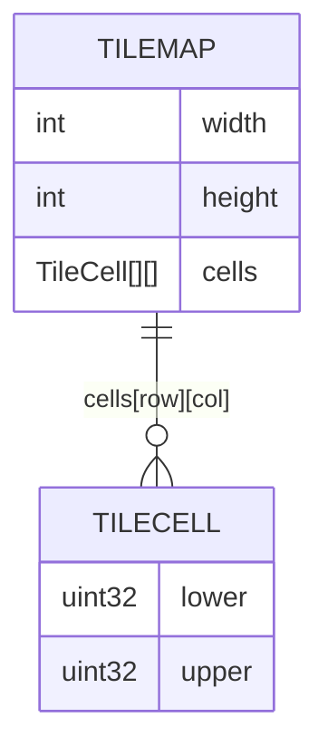
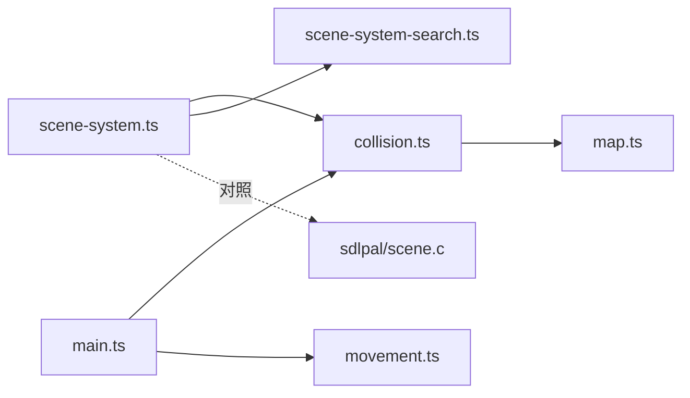

# 碰撞检测

<cite>
**本文引用的文件**   
- [packages/game/src/core/scene-system.ts](file://packages/game/src/core/scene-system.ts)
- [packages/reforge/src/collision.ts](file://packages/reforge/src/collision.ts)
- [packages/reforge/src/movement.ts](file://packages/reforge/src/movement.ts)
- [packages/reforge/src/main.ts](file://packages/reforge/src/main.ts)
- [packages/game/src/core/scene-system-search.ts](file://packages/game/src/core/scene-system-search.ts)
- [reference/sdlpal/scene.c](file://reference/sdlpal/scene.c)
- [packages/pal-extract/src/resources/map.ts](file://packages/pal-extract/src/resources/map.ts)
</cite>

## 目录
1. [简介](#简介)
2. [项目结构](#项目结构)
3. [核心组件](#核心组件)
4. [架构总览](#架构总览)
5. [详细组件分析](#详细组件分析)
6. [依赖关系分析](#依赖关系分析)
7. [性能与优化](#性能与优化)
8. [故障排查指南](#故障排查指南)
9. [结论](#结论)
10. [附录：配置与调试示例](#附录配置与调试示例)

## 简介
本文件系统化梳理本项目中的碰撞检测系统，覆盖以下要点：
- AABB 与等距菱形（isometric）碰撞的映射与判定
- 瓦片地图障碍位（bit 13）与“上/下层”tile 的读取
- NPC 阻挡、自动触发区、搜索交互、推离逻辑
- 玩家移动、NPC 碰撞、物品拾取（交互）的判定流程
- 边界处理机制（屏幕内可见范围、块级下界）
- 空间分割与批量检测策略（当前实现与可扩展建议）
- 调试可视化工具的使用方法

## 项目结构
碰撞相关代码主要分布在游戏核心与重绘演示两个包中：
- 游戏核心（game）：场景主循环、输入到移动的完整路径，包含 isWalkable、触发区、搜索、推离等
- 重绘演示（reforge）：提供可复用的碰撞工具函数、网格移动解析器、编辑器/演示层可视化



图示来源
- [packages/game/src/core/scene-system.ts](file://packages/game/src/core/scene-system.ts)
- [packages/game/src/core/scene-system-search.ts](file://packages/game/src/core/scene-system-search.ts)
- [packages/reforge/src/collision.ts](file://packages/reforge/src/collision.ts)
- [packages/reforge/src/movement.ts](file://packages/reforge/src/movement.ts)
- [packages/reforge/src/main.ts](file://packages/reforge/src/main.ts)
- [packages/pal-extract/src/resources/map.ts](file://packages/pal-extract/src/resources/map.ts)
- [reference/sdlpal/scene.c](file://reference/sdlpal/scene.c)

章节来源
- [packages/game/src/core/scene-system.ts](file://packages/game/src/core/scene-system.ts)
- [packages/reforge/src/collision.ts](file://packages/reforge/src/collision.ts)
- [packages/reforge/src/movement.ts](file://packages/reforge/src/movement.ts)
- [packages/reforge/src/main.ts](file://packages/reforge/src/main.ts)
- [packages/game/src/core/scene-system-search.ts](file://packages/game/src/core/scene-system-search.ts)
- [packages/pal-extract/src/resources/map.ts](file://packages/pal-extract/src/resources/map.ts)
- [reference/sdlpal/scene.c](file://reference/sdlpal/scene.c)

## 核心组件
- 菱形坐标映射与障碍位判定
  - 像素坐标经“菱形四分法”映射到 (col, row, h=0/1)，再查 tile 的 lower/upper 字段的 bit 13（0x2000）作为障碍标志。
  - 提供 buildIsBlocked、isBlockedAt、sameTile、sameGrid 等工具函数。
- 玩家移动与碰撞
  - tickSceneInput 根据方向键计算目标位置，调用 isWalkable 统一判断 tile 障碍与 NPC 阻挡；失败则原地停步并复位行走相位。
- NPC 阻挡与自动触发
  - sState≥2 的 NPC 为阻挡物；triggerMode≥4 的对象按菱形曼哈顿距离阈值触发脚本。
- 搜索交互（Confirm）
  - 面向前方 13 个检查点，按 triggerMode 1..3 与同格匹配命中首个对象后进入事件模式。
- 推离逻辑
  - 当阻挡物压到队伍锚点时，沿 NPC 朝向的下一方向尝试 4 个候选落点，将队伍与相机整体平移一格。
- 网格移动解析器
  - resolveMove 以纯函数形式把 MoveIntent 转为最终位置，撞墙即停步。

章节来源
- [packages/reforge/src/collision.ts](file://packages/reforge/src/collision.ts)
- [packages/game/src/core/scene-system.ts](file://packages/game/src/core/scene-system.ts)
- [packages/game/src/core/scene-system-search.ts](file://packages/game/src/core/scene-system-search.ts)
- [packages/reforge/src/movement.ts](file://packages/reforge/src/movement.ts)

## 架构总览
下图展示从输入到移动、再到碰撞与交互的关键调用链。



图示来源
- [packages/game/src/core/scene-system.ts](file://packages/game/src/core/scene-system.ts)
- [packages/reforge/src/collision.ts](file://packages/reforge/src/collision.ts)
- [packages/pal-extract/src/resources/map.ts](file://packages/pal-extract/src/resources/map.ts)

## 详细组件分析

### 菱形坐标映射与瓦片障碍位
- 菱形四分法
  - 通过 xr = x%32、yr = y%16 与线性组合 xr+yr*2 的区间划分，决定 col/row/h 的增量或层级切换。
- 障碍位
  - 使用 cell.lower（h=0）或 cell.upper（h=1）的 bit 13（0x2000）表示不可通行。
- 边界
  - 超出地图范围视为阻挡；fCheckRange 模式下还限制左上角 blockX/blockY 区域，保证镜头始终居中。



图示来源
- [packages/reforge/src/collision.ts](file://packages/reforge/src/collision.ts)
- [packages/game/src/core/scene-system.ts](file://packages/game/src/core/scene-system.ts)
- [reference/sdlpal/scene.c](file://reference/sdlpal/scene.c)

章节来源
- [packages/reforge/src/collision.ts](file://packages/reforge/src/collision.ts)
- [packages/game/src/core/scene-system.ts](file://packages/game/src/core/scene-system.ts)
- [reference/sdlpal/scene.c](file://reference/sdlpal/scene.c)

### 玩家移动碰撞
- 输入→朝向→目标像素
  - 依据最后按下方向键确定朝向，按固定步长（±16, ±8）计算目标像素。
- 碰撞判定
  - 调用 isWalkable：先菱形映射查 tile 障碍位，再对 sState≥2 的 NPC 进行菱形曼哈顿距离 < 16 的阻挡判定。
  - fCheckRange=TRUE 时额外限制左上 blockX/blockY 区域，防止队首走入屏幕边缘导致负相机。
- 结果处理
  - 成功：写入 trail、更新 party 位置、推进 walkingFrame.stepFrame。
  - 失败：仅转向，walking=false，stepFrame 复位。

```mermaid
sequenceDiagram
participant UI as "UI/输入"
participant SS as "scene-system.ts"
participant CW as "collision.ts"
UI->>SS : 方向键
SS->>SS : pickFacing / DIR_DELTA
SS->>CW : isWalkable(tilemap, nx, ny, npcs, 0, TRUE)
CW-->>SS : true/false
alt true
SS->>SS : trail.unshift(...); party.x/y += dx/dy; stepFrame++
else false
SS->>SS : walking=false; stepFrame 复位
end
SS->>SS : syncCameraToParty()
```

图示来源
- [packages/game/src/core/scene-system.ts](file://packages/game/src/core/scene-system.ts)
- [packages/reforge/src/collision.ts](file://packages/reforge/src/collision.ts)

章节来源
- [packages/game/src/core/scene-system.ts](file://packages/game/src/core/scene-system.ts)

### NPC 碰撞与自动触发
- 阻挡规则
  - 仅 sState≥2 的 NPC 参与阻挡；sState=1 的装饰型对象不阻挡。
- 自动触发区
  - triggerMode≥4 的对象按菱形曼哈顿距离阈值触发脚本；threshold=(mode-4)*32+16。
  - 支持 autoTriggerAnchorX/Y 调整触发中心，autoTriggerOnce 单次触发。
- 推离
  - 若阻挡物压到队伍锚点，沿 NPC 朝向的下一方向依次试探 4 个候选落点，找到合法落点后整体平移队伍与相机。



图示来源
- [packages/game/src/core/scene-system.ts](file://packages/game/src/core/scene-system.ts)
- [reference/sdlpal/scene.c](file://reference/sdlpal/scene.c)

章节来源
- [packages/game/src/core/scene-system.ts](file://packages/game/src/core/scene-system.ts)

### 搜索交互（Confirm）
- 搜索范围
  - 面向前方生成 13 个检查点（rgPos[0] 为自身，随后 4 排×3 点）。
- 命中条件
  - sState>0、triggerMode∈{1,2,3}、满足 mode*6-4<i 的距离门槛、且与检查点落在同一格（col,row,h）。
- 命中效果
  - NPC 转向面对队伍反方向并重置站立帧；队伍全员面向 NPC 站立帧；加载事件脚本进入事件模式。



图示来源
- [packages/game/src/core/scene-system-search.ts](file://packages/game/src/core/scene-system-search.ts)
- [packages/game/src/core/scene-system.ts](file://packages/game/src/core/scene-system.ts)

章节来源
- [packages/game/src/core/scene-system-search.ts](file://packages/game/src/core/scene-system-search.ts)
- [packages/game/src/core/scene-system.ts](file://packages/game/src/core/scene-system.ts)

### 物品拾取/交互（静态实体）
- 交互判定
  - 在演示层 main.ts 中，统计玩家与实体间的欧氏距离平方，小于阈值（如 48^2）且实体具备 interact 标记即可交互。
- 静态实体碰撞
  - 与地图障碍位合并：isBlocked(pos)=isBlockedAt(map,pos) || 存在 collide=true 的实体与 pos 同格。
- 移动解析
  - resolveMove 将 MoveIntent 转换为最终位置，若目标格被阻挡则原地停步。



图示来源
- [packages/reforge/src/movement.ts](file://packages/reforge/src/movement.ts)
- [packages/reforge/src/collision.ts](file://packages/reforge/src/collision.ts)
- [packages/reforge/src/main.ts](file://packages/reforge/src/main.ts)

章节来源
- [packages/reforge/src/movement.ts](file://packages/reforge/src/movement.ts)
- [packages/reforge/src/collision.ts](file://packages/reforge/src/collision.ts)
- [packages/reforge/src/main.ts](file://packages/reforge/src/main.ts)

### 复杂地形与多层 tile
- 上层/下层 tile
  - 通过 h=0/1 选择 cell.lower/upper 的障碍位，用于表现“站在上方平台”的遮挡与通行差异。
- 地图数据结构
  - map.ts 解析出 Tilemap.cells[row][col]={lower, upper}，供碰撞与渲染共用。



图示来源
- [packages/pal-extract/src/resources/map.ts](file://packages/pal-extract/src/resources/map.ts)
- [packages/reforge/src/collision.ts](file://packages/reforge/src/collision.ts)

章节来源
- [packages/pal-extract/src/resources/map.ts](file://packages/pal-extract/src/resources/map.ts)
- [packages/reforge/src/collision.ts](file://packages/reforge/src/collision.ts)

## 依赖关系分析
- scene-system.ts 依赖 collision.ts 的像素→格映射与障碍位读取，同时依赖 NPC 列表完成动态阻挡与触发。
- reforge 的 main.ts 组合 collision.ts 与 movement.ts，形成“意图→碰撞→结果”的可测试闭环。
- map.ts 提供底层 Tilemap 数据，确保碰撞与渲染一致。



图示来源
- [packages/game/src/core/scene-system.ts](file://packages/game/src/core/scene-system.ts)
- [packages/reforge/src/collision.ts](file://packages/reforge/src/collision.ts)
- [packages/reforge/src/movement.ts](file://packages/reforge/src/movement.ts)
- [packages/reforge/src/main.ts](file://packages/reforge/src/main.ts)
- [packages/game/src/core/scene-system-search.ts](file://packages/game/src/core/scene-system-search.ts)
- [packages/pal-extract/src/resources/map.ts](file://packages/pal-extract/src/resources/map.ts)
- [reference/sdlpal/scene.c](file://reference/sdlpal/scene.c)

章节来源
- [packages/game/src/core/scene-system.ts](file://packages/game/src/core/scene-system.ts)
- [packages/reforge/src/collision.ts](file://packages/reforge/src/collision.ts)
- [packages/reforge/src/movement.ts](file://packages/reforge/src/movement.ts)
- [packages/reforge/src/main.ts](file://packages/reforge/src/main.ts)
- [packages/game/src/core/scene-system-search.ts](file://packages/game/src/core/scene-system-search.ts)
- [packages/pal-extract/src/resources/map.ts](file://packages/pal-extract/src/resources/map.ts)
- [reference/sdlpal/scene.c](file://reference/sdlpal/scene.c)

## 性能与优化
- 当前复杂度
  - 每帧玩家移动：O(1) 菱形映射 + O(N) 遍历 NPC 做菱形曼哈顿距离。
  - 搜索交互：固定 13 个检查点 × N NPC，常数级开销。
- 空间分割与批量检测建议
  - 四叉树/网格分区：将 NPC 按格索引，仅对玩家所在及相邻格内的 NPC 做近距离检测，降低 O(N)。
  - 预筛选：按 triggerMode 分组（自动触发 vs 阻挡），分别维护快速列表。
  - 批量判定：对多单位（如怪物追击）可用 SIMD/向量化思想，但 TS 端收益有限，优先减少比较次数。
- 边界与缓存
  - 复用 pixelToTile 结果（例如 trail 历史点）避免重复计算。
  - 相机视口裁剪：仅对可见区域内的 NPC 做碰撞/触发，减少无效遍历。

[本节为通用指导，无需源码引用]

## 故障排查指南
- 无法穿过门/守卫
  - 检查 NPC 的 sState 是否为≥2；若为 1 则不会阻挡。
  - 核对 tile 的 lower/upper 是否设置了 bit 13（0x2000）。
- 走到 NPC 附近不触发
  - 确认 triggerMode≥4 且菱形曼哈顿距离小于 threshold；必要时使用 autoTriggerAnchorX/Y 调整触发中心。
- 搜索按键无反应
  - 确认 NPC 的 triggerMode∈{1,2,3}，且与检查点落在同一格（col,row,h）。
- 推离异常
  - 检查 pushPartyAwayFromBlockingNpcs 的候选方向顺序与 isWalkable 的 fCheckRange 参数。

章节来源
- [packages/game/src/core/scene-system.ts](file://packages/game/src/core/scene-system.ts)
- [packages/reforge/src/collision.ts](file://packages/reforge/src/collision.ts)

## 结论
本系统的碰撞检测以“菱形四分法 + 瓦片障碍位 + NPC 菱形曼哈顿距离”为核心，严格对齐 sdlpal 原版行为。通过纯函数化的碰撞工具与可注入的 IsBlocked 接口，实现了“意图→碰撞→结果”的可测试闭环，并在演示层提供了便捷的调试可视化。后续可在大规模场景中引入空间分割与视口裁剪进一步优化性能。

[本节为总结性内容，无需源码引用]

## 附录：配置与调试示例

### 配置碰撞区域（瓦片障碍位）
- 在 Tilemap.cells[row][col] 的 lower/upper 字段设置 bit 13（0x2000）即可将该格设为不可通行。
- 使用 isBlockedAt(map, gridPos) 或 buildIsBlocked(map)(worldX, worldY) 验证。

章节来源
- [packages/reforge/src/collision.ts](file://packages/reforge/src/collision.ts)
- [packages/pal-extract/src/resources/map.ts](file://packages/pal-extract/src/resources/map.ts)

### 实现自定义碰撞规则
- 注入 IsBlocked：在 resolveMove 调用处传入自定义 isBlocked，组合地图障碍与实体碰撞。
- 示例思路（伪代码路径）：
  - 在 main.ts 中定义 isBlocked(pos) = isBlockedAt(map,pos) || 实体同格判定
  - 将 isBlocked 注入 resolveMove(pos, intent, isBlocked)

章节来源
- [packages/reforge/src/movement.ts](file://packages/reforge/src/movement.ts)
- [packages/reforge/src/main.ts](file://packages/reforge/src/main.ts)
- [packages/reforge/src/collision.ts](file://packages/reforge/src/collision.ts)

### 处理复杂地形碰撞（多层 tile）
- 利用 h=0/1 区分 lower/upper 层的障碍位，实现“站在上层平台”的通行差异。
- 使用 sameGrid 判断实体间是否占据同一格（忽略 height），用于静态实体碰撞。

章节来源
- [packages/reforge/src/collision.ts](file://packages/reforge/src/collision.ts)
- [packages/pal-extract/src/resources/map.ts](file://packages/pal-extract/src/resources/map.ts)

### 碰撞调试可视化工具
- 启动参数
  - 在 URL 中添加 ?collision 开启调试叠加层。
- 显示内容
  - 绘制 iso 菱形网格（h=0 地格）
  - 标注每个站立点的 isBlocked 状态（绿色可走、红色禁入）
  - 高亮玩家脚点
- 使用方法
  - 运行 demo/editor 页面，附加 ?collision 参数，观察红绿点与视觉墙体的一致性，定位误判格。

章节来源
- [packages/reforge/src/main.ts](file://packages/reforge/src/main.ts)