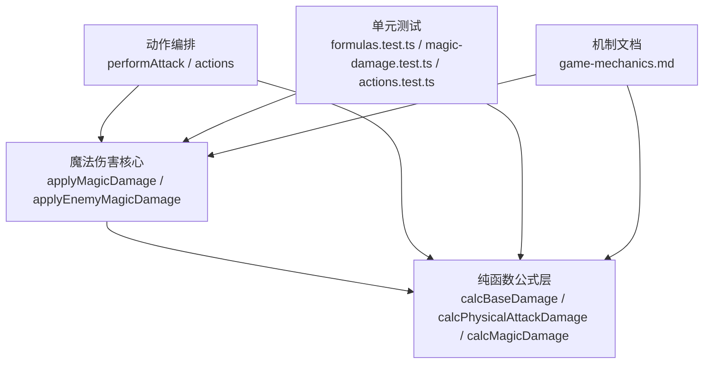
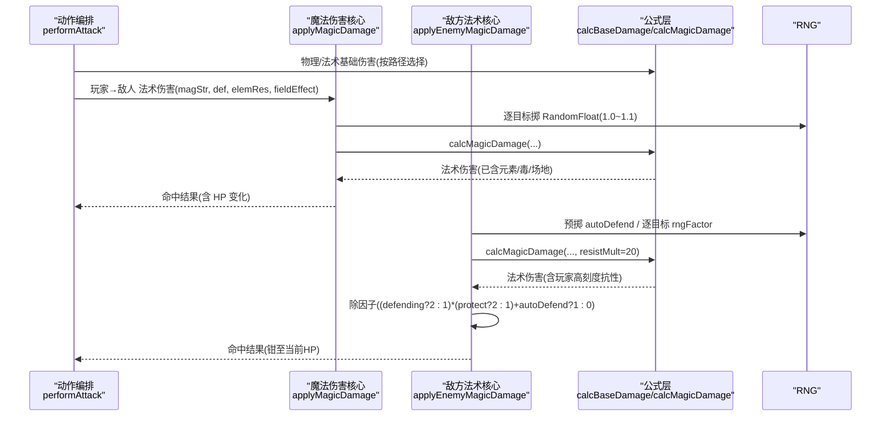
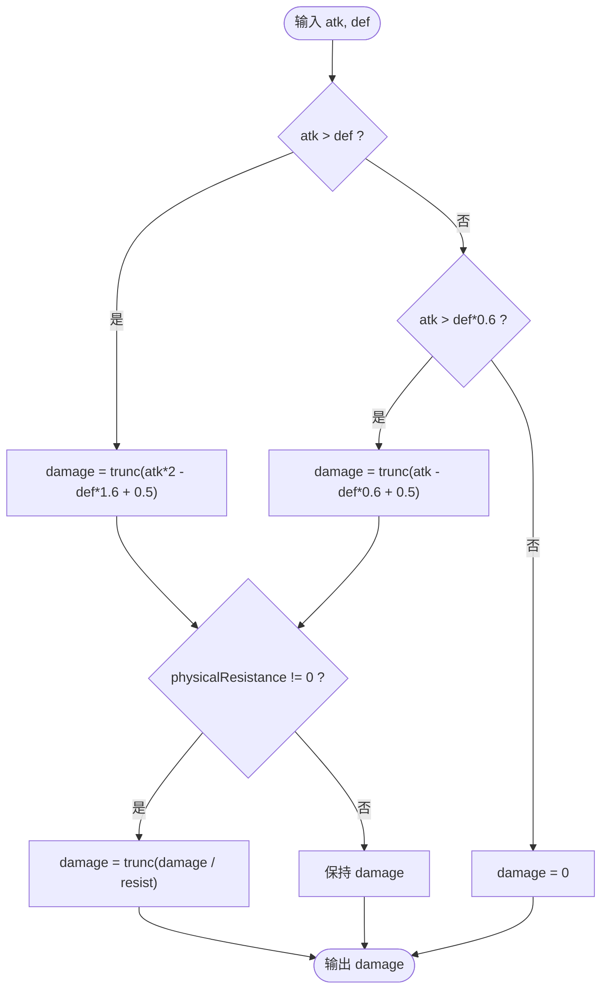
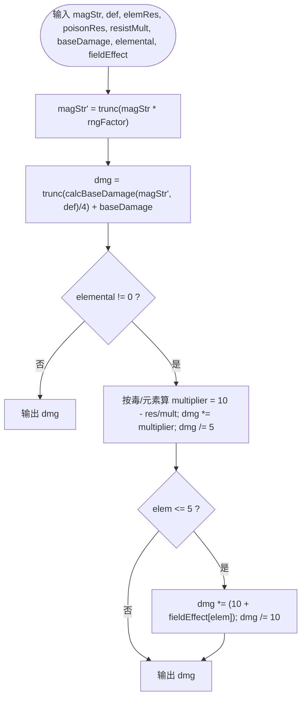
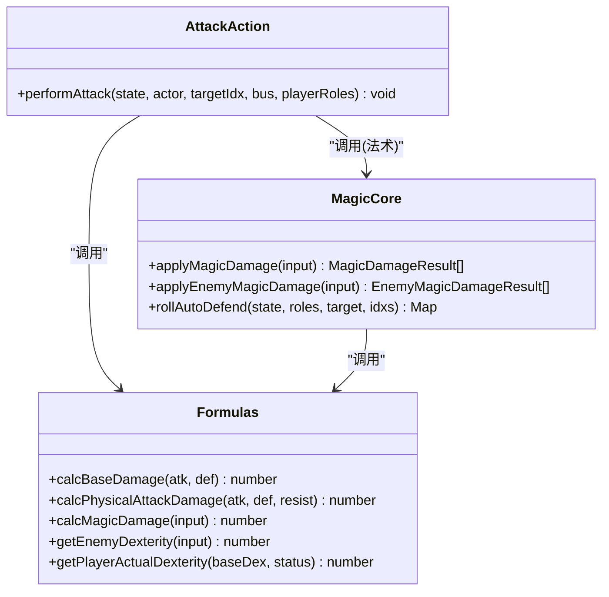

# 伤害计算公式

<cite>
**本文引用的文件**   
- [packages/game/src/core/battle/formulas.ts](file://packages/game/src/core/battle/formulas.ts)
- [packages/game/src/core/battle/magic-damage.ts](file://packages/game/src/core/battle/magic-damage.ts)
- [packages/game/src/core/battle/actions/attack.ts](file://packages/game/src/core/battle/actions/attack.ts)
- [packages/game/src/core/battle/__tests__/formulas.test.ts](file://packages/game/src/core/battle/__tests__/formulas.test.ts)
- [packages/game/src/core/battle/__tests__/magic-damage.test.ts](file://packages/game/src/core/battle/__tests__/magic-damage.test.ts)
- [packages/game/src/core/battle/__tests__/actions.test.ts](file://packages/game/src/core/battle/__tests__/actions.test.ts)
- [docs/phase1/game-mechanics.md](file://docs/phase1/game-mechanics.md)
</cite>

## 目录
1. [简介](#简介)
2. [项目结构](#项目结构)
3. [核心组件](#核心组件)
4. [架构总览](#架构总览)
5. [详细组件分析](#详细组件分析)
6. [依赖关系分析](#依赖关系分析)
7. [性能与数值特性](#性能与数值特性)
8. [可配置性与扩展机制](#可配置性与扩展机制)
9. [测试与验证方法](#测试与验证方法)
10. [调试与数值分析工具](#调试与数值分析工具)
11. [结论](#结论)

## 简介
本文件围绕“伤害计算”这一核心系统，系统化梳理并文档化以下要点：
- 基础伤害、属性加成、装备影响、元素克制
- 物理与法术伤害的完整公式链
- 暴击判定、防御减免、特殊效果处理（自动防御、援护、护体、战场环境）
- 公式的可配置性与扩展机制
- 数值平衡策略与回归测试方法
- 如何修改伤害公式、新增伤害类型、实现自定义逻辑
- 伤害计算调试与数值分析工具使用方法

## 项目结构
伤害计算相关代码集中在战斗子系统内，核心由纯函数公式层与上层编排层组成：
- 公式层：提供无副作用的纯函数，严格对齐 sdlpal 真值
- 魔法伤害编排：统一玩家→敌人、敌人→玩家的法术伤害路径
- 物理攻击编排：玩家单体/群体、敌人对玩家、混乱互殴等分支

图表来源
- [packages/game/src/core/battle/formulas.ts:1-217](file://packages/game/src/core/battle/formulas.ts#L1-L217)
- [packages/game/src/core/battle/magic-damage.ts:1-358](file://packages/game/src/core/battle/magic-damage.ts#L1-L358)
- [packages/game/src/core/battle/actions/attack.ts:1-582](file://packages/game/src/core/battle/actions/attack.ts#L1-L582)
- [docs/phase1/game-mechanics.md:143-233](file://docs/phase1/game-mechanics.md#L143-L233)

章节来源
- [packages/game/src/core/battle/formulas.ts:1-217](file://packages/game/src/core/battle/formulas.ts#L1-L217)
- [packages/game/src/core/battle/magic-damage.ts:1-358](file://packages/game/src/core/battle/magic-damage.ts#L1-L358)
- [packages/game/src/core/battle/actions/attack.ts:1-582](file://packages/game/src/core/battle/actions/attack.ts#L1-L582)
- [docs/phase1/game-mechanics.md:143-233](file://docs/phase1/game-mechanics.md#L143-L233)

## 核心组件
- 基础伤害三段式：按攻防差值分段，决定主伤段、残伤段或完全被挡
- 物理伤害：在基础伤害上应用物抗除法
- 法术伤害：灵力浮动 → 基础伤害/4 + 固定威力 → 元素/毒缩放 → 战场加成
- 敌方→玩家法术：除因子含主动防御、护体、法术自动防御；玩家抗性刻度不同
- 物理攻击修饰：抖动、暴击、会心、随机浮动、双重攻击、群体递减
- 防御机制：主动防御、自动防御、援护、护体

章节来源
- [packages/game/src/core/battle/formulas.ts:36-60](file://packages/game/src/core/battle/formulas.ts#L36-L60)
- [packages/game/src/core/battle/formulas.ts:112-158](file://packages/game/src/core/battle/formulas.ts#L112-L158)
- [packages/game/src/core/battle/magic-damage.ts:195-270](file://packages/game/src/core/battle/magic-damage.ts#L195-L270)
- [packages/game/src/core/battle/actions/attack.ts:82-101](file://packages/game/src/core/battle/actions/attack.ts#L82-L101)
- [docs/phase1/game-mechanics.md:143-233](file://docs/phase1/game-mechanics.md#L143-L233)

## 架构总览
下图展示从“动作执行”到“伤害落点”的关键调用链与数据流。

图表来源
- [packages/game/src/core/battle/actions/attack.ts:112-297](file://packages/game/src/core/battle/actions/attack.ts#L112-L297)
- [packages/game/src/core/battle/magic-damage.ts:80-124](file://packages/game/src/core/battle/magic-damage.ts#L80-L124)
- [packages/game/src/core/battle/magic-damage.ts:195-270](file://packages/game/src/core/battle/magic-damage.ts#L195-L270)
- [packages/game/src/core/battle/formulas.ts:112-158](file://packages/game/src/core/battle/formulas.ts#L112-L158)

## 详细组件分析

### 基础伤害与物理伤害
- 基础伤害三段式：
  - 当 atk > def：主力段，近似 (atk*2 − def*1.6)
  - 当 atk > def×0.6：残伤段，近似 (atk − def×0.6)
  - 否则：归零
- 物理伤害：在基础伤害基础上除以物理抗性（resist≠0 时），resist=0 不除

图表来源
- [packages/game/src/core/battle/formulas.ts:36-60](file://packages/game/src/core/battle/formulas.ts#L36-L60)

章节来源
- [packages/game/src/core/battle/formulas.ts:36-60](file://packages/game/src/core/battle/formulas.ts#L36-L60)
- [docs/phase1/game-mechanics.md:143-174](file://docs/phase1/game-mechanics.md#L143-L174)

### 法术伤害（玩家→敌人）
- 灵力浮动：magStr × RandomFloat(1.0, 1.1)
- 基础贡献：calcBaseDamage(magStr, def)/4
- 固定威力：+ magic.baseDamage
- 元素/毒缩放：按目标对应抗性（倍率 mult=1）
- 战场加成：对五灵系再乘 (10 + effect)/10

图表来源
- [packages/game/src/core/battle/formulas.ts:112-158](file://packages/game/src/core/battle/formulas.ts#L112-L158)

章节来源
- [packages/game/src/core/battle/formulas.ts:112-158](file://packages/game/src/core/battle/formulas.ts#L112-L158)
- [docs/phase1/game-mechanics.md:201-224](file://docs/phase1/game-mechanics.md#L201-L224)

### 法术伤害（敌人→玩家）
- 施法强度：enemy.magicStrength + (level+6)*6，下限 0
- 防御：角色防御（不含等级项，已投影含装备）
- 抗性刻度：玩家元素/毒抗 = 100 + min(100, mod)，倍率 mult=20
- 除因子：((主动防御?2:1) × (护体?2:1)) + (法术自动防御?1:0)
- 钳制：不超过当前 HP，不保证最小 1

章节来源
- [packages/game/src/core/battle/magic-damage.ts:195-270](file://packages/game/src/core/battle/magic-damage.ts#L195-L270)
- [docs/phase1/game-mechanics.md:201-224](file://docs/phase1/game-mechanics.md#L201-L224)

### 物理攻击修饰与暴击
- 抖动：base + RandomLong(1,2)
- 暴击：RandomLong(0,5)==0 或狂暴状态 → ×3
- 会心（李逍遥专属）：RandomLong(0,11)==0 → ×2（可与暴击叠加）
- 末浮动：× RandomFloat(1, 1.125)，SHORT 截断
- 下限：≤0 则置 1
- 群体普攻：整轮一次性暴击判定，逐敌减半（division 倍增）

章节来源
- [packages/game/src/core/battle/actions/attack.ts:82-101](file://packages/game/src/core/battle/actions/attack.ts#L82-L101)
- [packages/game/src/core/battle/actions/attack.ts:150-236](file://packages/game/src/core/battle/actions/attack.ts#L150-L236)
- [docs/phase1/game-mechanics.md:235-250](file://docs/phase1/game-mechanics.md#L235-L250)

### 防御机制与特殊效果
- 主动防御：防御×2（物理）、法术除数含×2
- 自动防御：单次免伤（物理）；法术自动防御：1/3 概率给除数+1
- 援护：虚弱/失能目标满足条件时替挡，仍为免伤
- 护体：物理/法术均减半（除数×2）

章节来源
- [packages/game/src/core/battle/actions/attack.ts:305-356](file://packages/game/src/core/battle/actions/attack.ts#L305-L356)
- [packages/game/src/core/battle/magic-damage.ts:256-270](file://packages/game/src/core/battle/magic-damage.ts#L256-L270)
- [docs/phase1/game-mechanics.md:253-292](file://docs/phase1/game-mechanics.md#L253-L292)

### 元素克制与战场加成
- 五灵顺序：风(1)、雷(2)、水(3)、火(4)、土(5)
- 毒系：elemental > 5，使用毒抗
- 玩家→敌人：倍率 mult=1，按目标原值抗性
- 敌人→玩家：倍率 mult=20，按 100+mod 刻度
- 战场加成：仅五灵系生效，×(10+effect)/10

章节来源
- [packages/game/src/core/battle/formulas.ts:124-158](file://packages/game/src/core/battle/formulas.ts#L124-L158)
- [docs/phase1/game-mechanics.md:393-447](file://docs/phase1/game-mechanics.md#L393-L447)

## 依赖关系分析
- 公式层为纯函数，无外部状态，便于单测与离线批跑
- 魔法伤害核心聚合两条路径（玩家→敌人、敌人→玩家），复用同一公式
- 动作编排负责读取角色/敌人属性、装备投影、状态标志，驱动公式与表现

图表来源
- [packages/game/src/core/battle/formulas.ts:1-217](file://packages/game/src/core/battle/formulas.ts#L1-L217)
- [packages/game/src/core/battle/magic-damage.ts:1-358](file://packages/game/src/core/battle/magic-damage.ts#L1-L358)
- [packages/game/src/core/battle/actions/attack.ts:1-582](file://packages/game/src/core/battle/actions/attack.ts#L1-L582)

章节来源
- [packages/game/src/core/battle/formulas.ts:1-217](file://packages/game/src/core/battle/formulas.ts#L1-L217)
- [packages/game/src/core/battle/magic-damage.ts:1-358](file://packages/game/src/core/battle/magic-damage.ts#L1-L358)
- [packages/game/src/core/battle/actions/attack.ts:1-582](file://packages/game/src/core/battle/actions/attack.ts#L1-L582)

## 性能与数值特性
- 纯函数与确定性：公式层无副作用，适合 worker/Node 批量跑，利于回归与数值扫描
- SHORT 语义：通过位运算模拟 C 的 SHORT cast，避免浮点漂移
- 随机性隔离：rngFactor 注入，测试可固定随机源，确保可重复
- 复杂度：单次伤害 O(1)；群攻/群法按目标线性 O(n)

章节来源
- [packages/game/src/core/battle/formulas.ts:1-21](file://packages/game/src/core/battle/formulas.ts#L1-L21)
- [packages/game/src/core/battle/magic-damage.ts:100-124](file://packages/game/src/core/battle/magic-damage.ts#L100-L124)

## 可配置性与扩展机制
- 可配置点
  - 法术参数：baseDamage、elemental、mult、fieldEffect、rngFactor
  - 角色/敌人属性：attackStrength、defense、magicStrength、各抗性
  - 状态标志：fDefending、status.protect、status.bravery、status.dualAttack
  - 战场环境：每场战斗的 rgsMagicEffect[5]
- 扩展建议
  - 新增伤害类型：在动作编排中构造新输入，复用 calcBaseDamage/calcMagicDamage
  - 自定义计算逻辑：封装新的“修饰器”函数（如护盾穿透、真实伤害），在最终返回前插入
  - 数值平衡：调整 baseDamage、mult、fieldEffect、随机范围与上限

章节来源
- [packages/game/src/core/battle/formulas.ts:62-86](file://packages/game/src/core/battle/formulas.ts#L62-L86)
- [packages/game/src/core/battle/magic-damage.ts:50-61](file://packages/game/src/core/battle/magic-damage.ts#L50-L61)
- [docs/phase1/game-mechanics.md:429-447](file://docs/phase1/game-mechanics.md#L429-L447)

## 测试与验证方法
- 单元测试覆盖
  - 基础伤害溢出与边界行为
  - 物理抗性除法与零除保护
  - 法术伤害非元素路径、元素索引映射、rngFactor≥1 不减伤
  - 魔法伤害整体流程与目标集合
  - 玩家攻击力不含等级项的回归
- 回归基准
  - 对照 sdlpal 真值表与行号注释
  - 固定 RNG 序列以复现历史差异

章节来源
- [packages/game/src/core/battle/__tests__/formulas.test.ts:38-83](file://packages/game/src/core/battle/__tests__/formulas.test.ts#L38-L83)
- [packages/game/src/core/battle/__tests__/formulas.test.ts:163-208](file://packages/game/src/core/battle/__tests__/formulas.test.ts#L163-L208)
- [packages/game/src/core/battle/__tests__/magic-damage.test.ts:97-112](file://packages/game/src/core/battle/__tests__/magic-damage.test.ts#L97-L112)
- [packages/game/src/core/battle/__tests__/actions.test.ts:206-222](file://packages/game/src/core/battle/__tests__/actions.test.ts#L206-L222)

## 调试与数值分析工具
- 固定随机源
  - 通过传入 rngFactor 或控制 RNG 序列，锁定每次计算的随机波动，便于定位问题
- 分步打印
  - 在 applyMagicDamage/applyEnemyMagicDamage 中记录每个阶段中间值（magStr、def、multiplier、fieldEffect、divisor）
- 批量扫描
  - 将公式层暴露为纯函数，批量遍历不同属性组合，生成热力图/曲线，观察阈值与拐点
- 回归对比
  - 将 ts 输出与 sdlpal 基线比对，差异即回归点

章节来源
- [packages/game/src/core/battle/magic-damage.ts:100-124](file://packages/game/src/core/battle/magic-damage.ts#L100-L124)
- [packages/game/src/core/battle/magic-damage.ts:244-270](file://packages/game/src/core/battle/magic-damage.ts#L244-L270)
- [packages/game/src/core/battle/formulas.ts:1-21](file://packages/game/src/core/battle/formulas.ts#L1-L21)

## 结论
本伤害体系以纯函数为核心，严格对齐 sdlpal 真值，具备高可测试性与可扩展性。通过清晰的公式分层、明确的配置点与完善的回归测试，既能保障还原度，又便于后续数值调参与玩法扩展。建议在新增伤害类型或特殊效果时，优先复用现有公式与修饰器模式，并以单测与基线回归作为质量门禁。