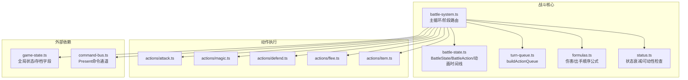
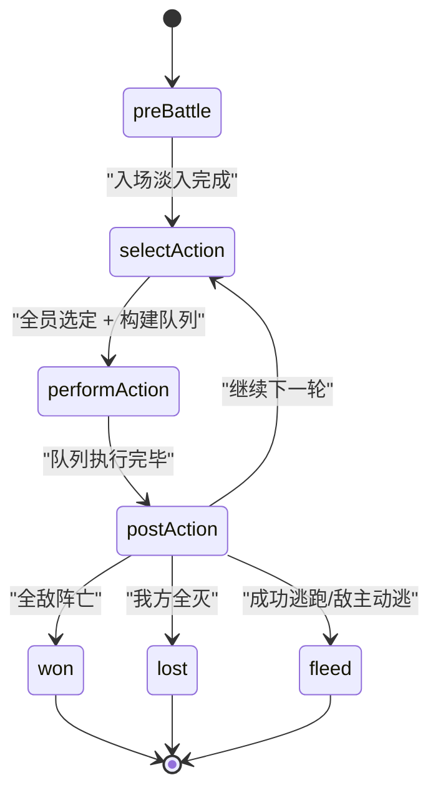
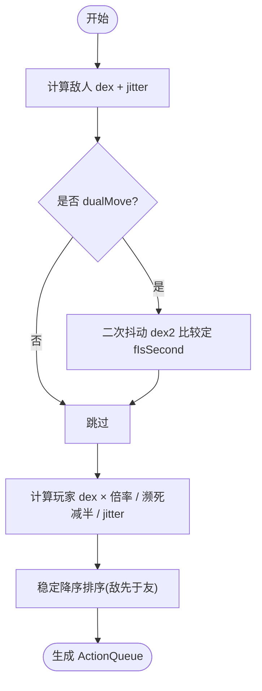
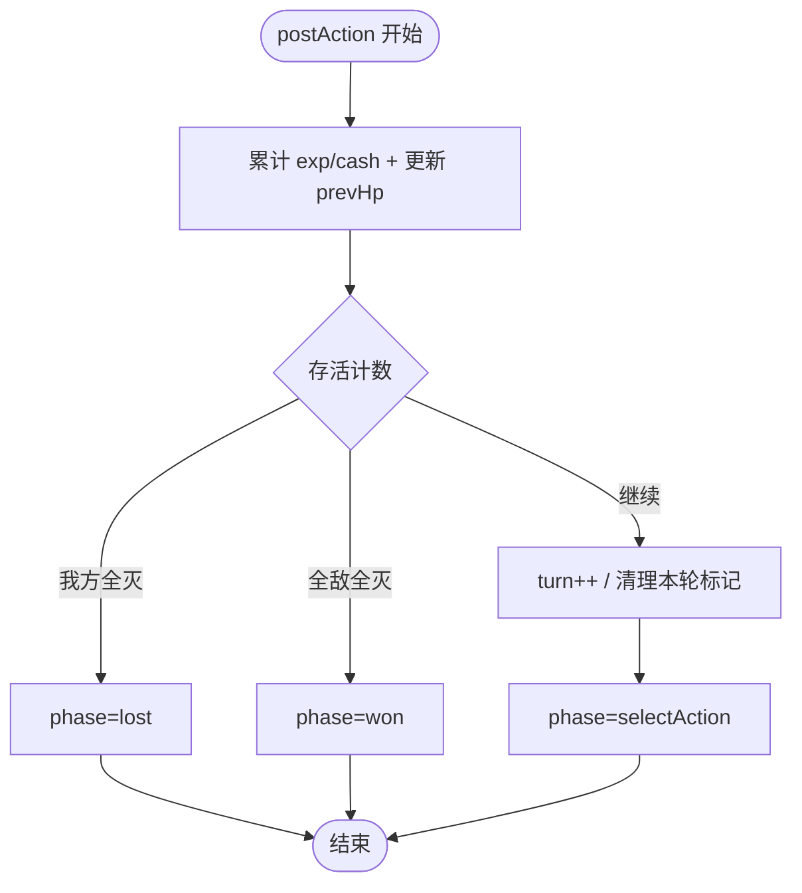
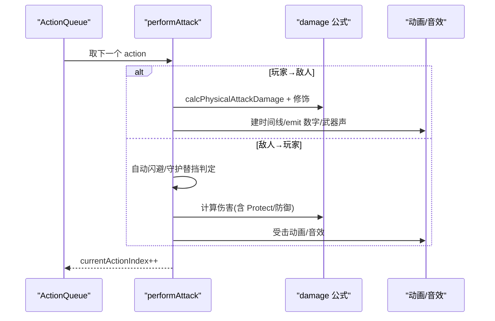
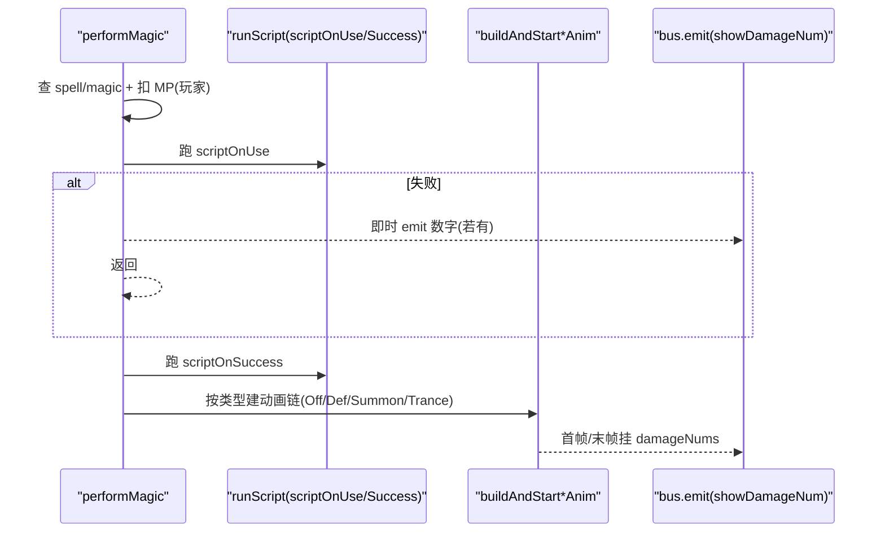
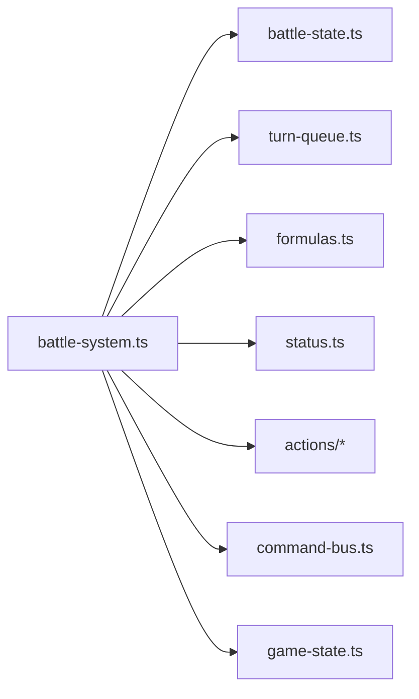

# 回合制战斗逻辑

<cite>
**本文引用的文件**
- [battle-system.ts](file://packages/game/src/core/battle/battle-system.ts)
- [battle-state.ts](file://packages/game/src/core/battle/battle-state.ts)
- [turn-queue.ts](file://packages/game/src/core/battle/turn-queue.ts)
- [formulas.ts](file://packages/game/src/core/battle/formulas.ts)
- [status.ts](file://packages/game/src/core/battle/status.ts)
- [actions/attack.ts](file://packages/game/src/core/battle/actions/attack.ts)
- [actions/magic.ts](file://packages/game/src/core/battle/actions/magic.ts)
- [actions/defend.ts](file://packages/game/src/core/battle/actions/defend.ts)
- [actions/flee.ts](file://packages/game/src/core/battle/actions/flee.ts)
- [actions/item.ts](file://packages/game/src/core/battle/actions/item.ts)
- [e2e-battle.test.ts](file://packages/game/src/__tests__/e2e-battle.test.ts)
</cite>

## 目录
1. [简介](#简介)
2. [项目结构](#项目结构)
3. [核心组件](#核心组件)
4. [架构总览](#架构总览)
5. [详细组件分析](#详细组件分析)
6. [依赖关系分析](#依赖关系分析)
7. [性能与稳定性](#性能与稳定性)
8. [故障排查指南](#故障排查指南)
9. [结论](#结论)
10. [附录：实战修改示例](#附录实战修改示例)

## 简介
本文件面向“回合制战斗逻辑”的完整说明，覆盖状态机、行动顺序计算、回合推进机制、阶段划分（准备、行动、结算）、状态转换规则与异常处理；并给出战斗数据持久化、断点续战与回放思路，以及调试与流程分析工具使用方法。内容基于仓库中 TypeScript 实现，严格对齐 sdlpal 真值行为。

## 项目结构
- 战斗系统位于 packages/game/src/core/battle 下，核心由 battle-system.ts 驱动，配合 battle-state.ts 的状态模型、turn-queue.ts 的行动队列、formulas.ts 的数值公式、status.ts 的状态衰减，以及 actions/* 下的具体动作执行器。
- 测试用例 e2e-battle.test.ts 提供端到端验证入口。



图表来源
- [battle-system.ts:472-614](file://packages/game/src/core/battle/battle-system.ts#L472-L614)
- [battle-state.ts:455-666](file://packages/game/src/core/battle/battle-state.ts#L455-L666)
- [turn-queue.ts:68-99](file://packages/game/src/core/battle/turn-queue.ts#L68-L99)
- [formulas.ts:179-216](file://packages/game/src/core/battle/formulas.ts#L179-L216)
- [status.ts:30-46](file://packages/game/src/core/battle/status.ts#L30-L46)

章节来源
- [battle-system.ts:472-614](file://packages/game/src/core/battle/battle-system.ts#L472-L614)
- [battle-state.ts:455-666](file://packages/game/src/core/battle/battle-state.ts#L455-L666)

## 核心组件
- 战斗状态机与主循环
  - tickBattle 按 phase 分发到 preBattle/selectAction/performAction/postAction/won/lost/fleed，并在各分支内维护 hold 条件（对话、淡入、逃跑动画、胜利结算等）。
  - 防卡死保护：非 selectAction 阶段累计 phaseStallTicks，超过阈值强制退出。
- 状态模型
  - BattleState 包含玩家/敌人视图、phase、actionQueue、UI 状态、动画时间线、入场淡入、逃跑动画、敌逃动画、死亡淡出、对话队列、胜利结算等。
  - BattleAction 定义动作类型与目标语义（含 targetSide 区分敌我目标）。
- 行动顺序计算
  - buildActionQueue 将敌方与队员按 dexterity 降序排队，dualMove 敌人可能两次入队（第二动 fIsSecond=true），同 dex 保持“敌先于友”。
- 数值公式
  - getEnemyDexterity/getPlayerActualDexterity 决定出手顺序；calcBaseDamage/calcPhysicalAttackDamage/calcMagicDamage 用于伤害计算。
- 状态衰减
  - tickStatusEffects 每回合末对所有 status 计数器统一 -1（含 haste/protect/dualAttack 等布尔类）。

章节来源
- [battle-system.ts:472-614](file://packages/game/src/core/battle/battle-system.ts#L472-L614)
- [battle-state.ts:455-666](file://packages/game/src/core/battle/battle-state.ts#L455-L666)
- [turn-queue.ts:68-99](file://packages/game/src/core/battle/turn-queue.ts#L68-L99)
- [formulas.ts:179-216](file://packages/game/src/core/battle/formulas.ts#L179-L216)
- [status.ts:30-46](file://packages/game/src/core/battle/status.ts#L30-L46)

## 架构总览
战斗主循环在 tickBattle 中完成：
- 前置 hold：死亡淡出、palette fade、逃跑动画、敌逃动画、对话、胜利结算。
- turnStart 脚本：每轮起手对全体活敌跑一次 scriptOnTurnStart，可能插入对话或动画。
- 选指令菜单：在 turnStart 完成后且无 hold 时开启，支持自动/重复/围攻等快捷模式。
- 构建 ActionQueue 并进入 performAction。
- postAction 结算：统计经验/金钱、判定胜负、清理本轮标记、进入下一轮或终态。

```mermaid
sequenceDiagram
participant Main as "tickBattle(主循环)"
participant Pre as "preBattle"
participant Sel as "selectAction"
participant Perf as "performAction"
participant Post as "postAction"
participant End as "won/lost/fleed"
Main->>Pre : 入场淡入 gate → 切 selectAction
Main->>Sel : 启动首个可手动选择队员菜单
Sel-->>Main : 全员填完 pendingActions
Main->>Main : 备份 prevActions + 清 auto-attack 粘性
Main->>Main : buildActionQueue + 切 performAction
loop 逐个 action
Main->>Perf : 执行当前 actor 的动作
Perf-->>Main : 更新 HP/MP/状态/动画/数字弹幕
end
Main->>Post : 统计 exp/cash、判胜负、清理 defend/毒 tick 延迟
alt 未结束
Post-->>Sel : turn++ 回到 selectAction
else 终态
Post-->>End : 进入 won/lost/fleed
end
```

图表来源
- [battle-system.ts:576-614](file://packages/game/src/core/battle/battle-system.ts#L576-L614)
- [battle-system.ts:714-847](file://packages/game/src/core/battle/battle-system.ts#L714-L847)

章节来源
- [battle-system.ts:576-614](file://packages/game/src/core/battle/battle-system.ts#L576-L614)
- [battle-system.ts:714-847](file://packages/game/src/core/battle/battle-system.ts#L714-L847)

## 详细组件分析

### 战斗阶段与状态转换
- 阶段定义
  - preBattle：入场淡入 gate，完成后切 selectAction。
  - selectAction：等待所有活队员选定动作；支持自动/重复/围攻；结束后构建 ActionQueue。
  - performAction：按队列逐项执行；敌人侧即时决策；支持动画时间线与对话 hold。
  - postAction：统计收益、判定胜负、清理本轮标记、推进回合或进入终态。
  - won/lost/fleed：结算后回写 GameState 并返回 explore。
- 关键守卫
  - 死亡淡出、palette fade、逃跑动画、敌逃动画、对话、胜利结算均会阻塞后续推进。
  - 防卡死：非 selectAction 阶段累计超时强制退出。



图表来源
- [battle-state.ts:205-213](file://packages/game/src/core/battle/battle-state.ts#L205-L213)
- [battle-system.ts:576-614](file://packages/game/src/core/battle/battle-system.ts#L576-L614)

章节来源
- [battle-state.ts:205-213](file://packages/game/src/core/battle/battle-state.ts#L205-L213)
- [battle-system.ts:576-614](file://packages/game/src/core/battle/battle-system.ts#L576-L614)

### 行动顺序计算（dex 与双动）
- 敌人 dex = (level+6)*3 + (SHORT)dexterity；玩家 dex = baseDexterity × 倍率（防御×5、辅助法术×3、逃跑÷2 等）+ 濒死减半 + jitter。
- dualMove 敌人每轮必两次入队，第二动独立二次抖动 dex，比较定 fIsSecond。
- 排序稳定：同 dex 保持“敌先于友”。



图表来源
- [turn-queue.ts:68-99](file://packages/game/src/core/battle/turn-queue.ts#L68-L99)
- [battle-system.ts:793-847](file://packages/game/src/core/battle/battle-system.ts#L793-L847)
- [formulas.ts:179-216](file://packages/game/src/core/battle/formulas.ts#L179-L216)

章节来源
- [turn-queue.ts:68-99](file://packages/game/src/core/battle/turn-queue.ts#L68-L99)
- [battle-system.ts:793-847](file://packages/game/src/core/battle/battle-system.ts#L793-L847)
- [formulas.ts:179-216](file://packages/game/src/core/battle/formulas.ts#L179-L216)

### 回合推进与回合末处理
- 每轮结束时：
  - 统计已死敌人的 exp/cash。
  - 判断胜负：我方全灭→lost；全敌全灭→won；否则 turn++，清空 pendingActions，重置 defending，回到 selectAction。
  - 毒/状态数字弹出后的停顿（roundEndDelayTicks）确保 UI 可读。
- 状态衰减：所有 status 计数器 -1（含 boolean 类）。



图表来源
- [battle-system.ts:576-614](file://packages/game/src/core/battle/battle-system.ts#L576-L614)
- [status.ts:30-46](file://packages/game/src/core/battle/status.ts#L30-L46)

章节来源
- [battle-system.ts:576-614](file://packages/game/src/core/battle/battle-system.ts#L576-L614)
- [status.ts:30-46](file://packages/game/src/core/battle/status.ts#L30-L46)

### 物理攻击（单体/群攻/混乱自伤）
- 玩家→敌人：str 不含等级项；暴击/李逍遥额外暴击/随机浮动；超杀显示完整伤害（WORD 下溢不钳）。
- 敌人→玩家：自动闪避/守护替挡/防御姿态/Protect 减半；受击动画与音效帧同步。
- 混乱敌人攻击友敌：独立伤害公式，无 jitter/crit。



图表来源
- [actions/attack.ts:112-435](file://packages/game/src/core/battle/actions/attack.ts#L112-L435)
- [actions/attack.ts:450-497](file://packages/game/src/core/battle/actions/attack.ts#L450-L497)

章节来源
- [actions/attack.ts:112-435](file://packages/game/src/core/battle/actions/attack.ts#L112-L435)
- [actions/attack.ts:450-497](file://packages/game/src/core/battle/actions/attack.ts#L450-L497)

### 法术（OffMagic/DefMagic/召唤/变身）
- 扣 MP（仅玩家）→ 跑 scriptOnUse → 若成功则跑 scriptOnSuccess → 根据 magic.type 建动画链（Pre/Off/Post 或 DefMagic/Summon/Trance）。
- 玩家攻击魔法 inline 伤害（baseDamage>0 且非防御类）；敌人攻击魔法 inline 伤害（baseDamage>0）。
- 数字弹幕延迟至特效播完后 emit，保证时序正确。



图表来源
- [actions/magic.ts:123-435](file://packages/game/src/core/battle/actions/magic.ts#L123-L435)
- [actions/magic.ts:485-572](file://packages/game/src/core/battle/actions/magic.ts#L485-L572)
- [actions/magic.ts:585-678](file://packages/game/src/core/battle/actions/magic.ts#L585-L678)

章节来源
- [actions/magic.ts:123-435](file://packages/game/src/core/battle/actions/magic.ts#L123-L435)
- [actions/magic.ts:485-572](file://packages/game/src/core/battle/actions/magic.ts#L485-L572)
- [actions/magic.ts:585-678](file://packages/game/src/core/battle/actions/magic.ts#L585-L678)

### 防御/逃跑/物品
- 防御：设置 defending 标志，实际减伤在敌人攻击时生效。
- 逃跑：str=玩家吉运 vs def=Σ(敌方吉运+(level+6)*4)，成功触发 fleeAnim，失败播放失败动画并累积 FleeExp。
- 物品：跑 item.scriptOnUse，消耗品在脚本后扣库存。

章节来源
- [actions/defend.ts:17-21](file://packages/game/src/core/battle/actions/defend.ts#L17-L21)
- [actions/flee.ts:36-76](file://packages/game/src/core/battle/actions/flee.ts#L36-L76)
- [actions/item.ts:69-119](file://packages/game/src/core/battle/actions/item.ts#L69-L119)

## 依赖关系分析
- 模块耦合
  - battle-system.ts 作为中枢，依赖 battle-state.ts 的状态模型、turn-queue.ts 的队列构建、formulas.ts 的数值、status.ts 的状态衰减，以及 actions/* 的具体执行器。
  - 通过 CommandBus 向 Present 层下发动画/音效/数字弹幕命令。
- 外部资源
  - 战斗运行时资源（items/spells/magics/playerRoles/commands 等）缓存于 GameState.__battleResources，startBattle 写入，finalizeBattle 清理。
- 潜在环依赖
  - 当前为单向调用，未见循环依赖。



图表来源
- [battle-system.ts:29-88](file://packages/game/src/core/battle/battle-system.ts#L29-L88)

章节来源
- [battle-system.ts:29-88](file://packages/game/src/core/battle/battle-system.ts#L29-L88)

## 性能与稳定性
- 防卡死保护：非 selectAction 阶段累计 phaseStallTicks，超过阈值强制退出，避免无限等待。
- 动画时间线：将声音/数字弹幕挂帧同步，减少多 tick 重叠导致的音频/视觉错位。
- E2E 上限：测试放宽 MAX_TICKS 以容纳多 tick 动画序列，仍断言最终结果一致。

章节来源
- [battle-system.ts:484-498](file://packages/game/src/core/battle/battle-system.ts#L484-L498)
- [e2e-battle.test.ts:188-220](file://packages/game/src/__tests__/e2e-battle.test.ts#L188-L220)

## 故障排查指南
- 常见症状与定位
  - 战斗无法结束/长时间卡顿：检查 phaseStallTicks 是否超限；确认是否有未释放的 hold（对话/淡入/逃跑动画/胜利结算）。
  - 法术/物品效果未生效：确认 runScript 注入是否正确；检查 scriptOnUse/scriptOnSuccess 返回值与 g_fScriptSuccess 门控。
  - 逃跑成功率异常：核对逃跑公式是否使用敌方吉运而非身法。
- 建议步骤
  - 打印 tickBattle 各分支与 hold 条件；观察 battleDialogQueue、battleAnim、settlement 等字段变化。
  - 在 tickPerformAction 前后输出 actionQueue[currentActionIndex] 与 actor/target 信息。
  - 针对法术/物品，记录 runScript 的 ip 与 battleCtx 参数，确认 opcode 路径。

章节来源
- [battle-system.ts:472-614](file://packages/game/src/core/battle/battle-system.ts#L472-L614)
- [actions/flee.ts:36-76](file://packages/game/src/core/battle/actions/flee.ts#L36-L76)

## 结论
本实现以 battle-system.ts 为核心，围绕 BattleState 的状态机与动画时间线，结合 turn-queue 的顺序计算与 formulas 的数值体系，形成完整的回合制战斗闭环。通过严格的 hold 控制与防卡死保护，保证了流程健壮性与表现一致性。后续可在现有框架上扩展新阶段、特殊规则与更丰富的演出。

## 附录：实战修改示例

### 如何修改战斗流程（添加新的战斗阶段）
- 在 BattlePhase 中添加新阶段字符串，并在 tickBattle 的 switch 中增加对应 case。
- 在相应 handler 中实现阶段逻辑，必要时引入新的 hold 条件（如自定义动画/对话）。
- 在 postAction 或终态处理中确保能回到新阶段或正常流转。

章节来源
- [battle-state.ts:205-213](file://packages/game/src/core/battle/battle-state.ts#L205-L213)
- [battle-system.ts:576-614](file://packages/game/src/core/battle/battle-system.ts#L576-L614)

### 如何实现特殊战斗规则（例如新增“护盾”状态）
- 在 BattleStatus 中新增护盾计数器字段，并在 tickStatusEffects 中参与统一衰减。
- 在相关动作（如防御/受击）中读取护盾值进行减免或抵消，并在合适时机清零。
- 如需 UI 展示，在 present 层消费该状态。

章节来源
- [battle-state.ts:26-38](file://packages/game/src/core/battle/battle-state.ts#L26-L38)
- [status.ts:30-46](file://packages/game/src/core/battle/status.ts#L30-L46)

### 断点续战与战斗回放
- 断点续战
  - 将 BattleState 序列化（含 actionQueue、currentActionIndex、pendingActions、动画时间线、对话队列、胜利结算等）存入存档。
  - 读档时恢复 BattleState 与 __battleResources，从当前 phase 继续 tickBattle。
- 战斗回放
  - 录制每 tick 的 InputSnapshot 与 bus 命令，回放时重放输入并消费命令，重建相同流程。
  - 或使用确定性 RNG seed 与固定 fixture，重放时直接驱动 tickBattle 复现。

章节来源
- [battle-state.ts:455-666](file://packages/game/src/core/battle/battle-state.ts#L455-L666)
- [battle-system.ts:277-419](file://packages/game/src/core/battle/battle-system.ts#L277-L419)

### 战斗状态调试与流程分析工具
- 开发面板
  - 打开游戏内“战斗只读信息”tab，查看实时 BattleState 字段（phase、turn、actionQueue、battleAnim、dialogQueue、settlement 等）。
- 日志与断点
  - 在 tickBattle 与各 phase handler 处打日志，观察 hold 条件与状态变更。
  - 在 tickPerformAction 前后输出当前 action 与 actor/target 详情。
- 单测辅助
  - 参考 e2e-battle.test.ts 的自动化填充 pendingActions 与 MAX_TICKS 策略，快速构造长流程场景。

章节来源
- [e2e-battle.test.ts:188-220](file://packages/game/src/__tests__/e2e-battle.test.ts#L188-L220)
- [battle-system.ts:472-614](file://packages/game/src/core/battle/battle-system.ts#L472-L614)